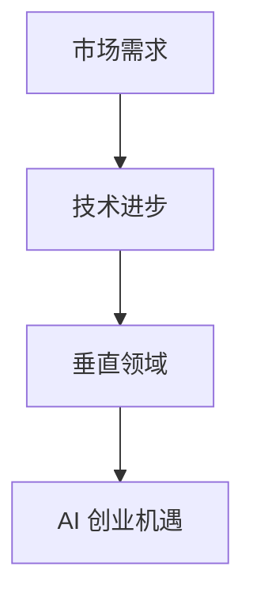
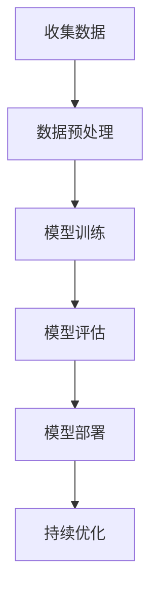

                 

### AI创业者机遇：垂直领域无限可能

#### 概述：本文将探讨AI创业者在垂直领域所面临的机遇。通过分析市场需求、技术进步以及创业案例，我们将展示在特定领域深入探索所带来的巨大潜力。

#### 关键词：AI创业、垂直领域、市场需求、技术进步、案例研究

#### 摘要：随着人工智能技术的快速发展，创业者们在垂直领域发现了巨大的机遇。本文将分析垂直领域对AI创业的重要性，探讨市场需求、技术进步以及成功案例，以帮助创业者更好地把握这一新兴领域的发展方向。

## 1. 背景介绍

在当今技术飞速发展的时代，人工智能（AI）已经成为推动社会进步的重要力量。从自动驾驶汽车到智能医疗诊断，AI的应用已经深入到我们生活的方方面面。然而，随着技术的不断进步，AI创业者在面对广阔的市场空间时，如何选择合适的垂直领域成为了至关重要的问题。

垂直领域是指在一个特定行业或市场内，专注于某一细分领域，提供具有针对性的解决方案。相比广泛覆盖的市场，垂直领域更容易形成差异化竞争优势，同时也能够更好地满足客户需求。对于AI创业者而言，选择合适的垂直领域，不仅能够降低竞争压力，还能够更好地发挥自身技术优势，实现可持续发展。

## 2. 核心概念与联系

在探讨AI创业机遇之前，我们需要了解一些核心概念，包括市场需求、技术进步以及垂直领域的定义。

### 市场需求

市场需求是指消费者在特定时间内，对某种产品或服务愿意支付的价格和购买量。在AI创业中，理解市场需求至关重要，因为它决定了你的产品或服务是否能够被市场接受。为了满足市场需求，创业者需要深入了解目标客户的需求和痛点，从而提供有针对性的解决方案。

### 技术进步

技术进步是指新技术的研发和应用，对现有产业和市场的变革。在AI领域，技术进步主要体现在算法优化、数据处理能力提升以及计算硬件的进步。随着技术的不断进步，AI在垂直领域的应用前景愈发广阔，为创业者提供了更多的机会。

### 垂直领域

垂直领域是指在一个特定行业或市场内，专注于某一细分领域，提供具有针对性的解决方案。垂直领域的特点包括市场集中度高、客户需求明确、竞争相对较少等。对于AI创业者而言，选择合适的垂直领域，可以更好地发挥自身技术优势，实现可持续发展。

### Mermaid 流程图

下面是一个简化的 Mermaid 流程图，展示了市场需求、技术进步以及垂直领域的联系。



## 3. 核心算法原理 & 具体操作步骤

在了解了核心概念后，我们需要进一步探讨AI在垂直领域中的应用，包括核心算法原理和具体操作步骤。

### 核心算法原理

在垂直领域，AI的核心算法通常包括机器学习、深度学习、自然语言处理等。这些算法通过训练模型，使计算机能够从数据中学习并做出预测或决策。例如，在医疗领域，AI可以通过分析患者的病历数据，预测疾病的发病率；在金融领域，AI可以通过分析市场数据，预测股票走势。

### 具体操作步骤

以下是一个简化的AI应用流程，用于说明如何在垂直领域实现AI解决方案。



### 数据收集

数据收集是AI应用的基础。在垂直领域，创业者需要收集与目标领域相关的数据，如病历数据、市场数据等。数据的质量和数量直接影响模型的性能。

### 数据预处理

数据预处理包括数据清洗、数据转换和数据归一化等步骤。通过数据预处理，可以提高数据的准确性和一致性，从而提高模型的性能。

### 模型训练

模型训练是指通过算法将数据转化为模型参数的过程。在垂直领域，创业者可以选择合适的算法，如神经网络、决策树等，对数据进行训练。

### 模型评估

模型评估是指通过测试数据验证模型性能的过程。创业者需要选择合适的评估指标，如准确率、召回率等，对模型进行评估。

### 模型部署

模型部署是指将训练好的模型应用到实际场景的过程。在垂直领域，创业者可以将模型部署到服务器、移动设备或物联网设备上，为客户提供服务。

### 持续优化

持续优化是指通过收集用户反馈和实时数据，对模型进行不断改进。在垂直领域，创业者需要密切关注市场变化和用户需求，对模型进行持续优化，以保持竞争优势。

## 4. 数学模型和公式 & 详细讲解 & 举例说明

在AI应用中，数学模型和公式起到了关键作用。以下是一些常用的数学模型和公式，以及它们的详细讲解和举例说明。

### 机器学习算法

#### 线性回归

线性回归是一种常用的预测算法，用于建模两个变量之间的关系。其数学模型可以表示为：

$$y = \beta_0 + \beta_1 \cdot x + \epsilon$$

其中，$y$ 是预测值，$x$ 是输入值，$\beta_0$ 和 $\beta_1$ 是模型参数，$\epsilon$ 是误差项。

#### 例子：房价预测

假设我们要预测房价，已知房屋面积（$x$）和房价（$y$）。通过线性回归，我们可以建立以下模型：

$$y = \beta_0 + \beta_1 \cdot x + \epsilon$$

通过训练数据，我们可以得到 $\beta_0$ 和 $\beta_1$ 的值，从而预测新的房价。

### 深度学习算法

#### 神经网络

神经网络是一种模拟人脑神经元结构的计算模型，用于处理复杂数据。其数学模型可以表示为：

$$\text{激活函数}(\sum_{i=1}^{n} w_i \cdot x_i + b)$$

其中，$w_i$ 是权重，$x_i$ 是输入值，$b$ 是偏置项，激活函数用于引入非线性特性。

#### 例子：图像分类

假设我们要对图像进行分类，已知图像的像素值（$x$）和类别标签（$y$）。通过神经网络，我们可以建立以下模型：

$$\text{激活函数}(\sum_{i=1}^{n} w_i \cdot x_i + b)$$

通过训练数据，我们可以得到 $w_i$ 和 $b$ 的值，从而对新的图像进行分类。

### 自然语言处理

#### 词向量模型

词向量模型是将词语转换为向量表示的方法，用于处理自然语言文本。其数学模型可以表示为：

$$\text{向量} = \text{词向量} \cdot \text{词频矩阵}$$

其中，词向量是词语的向量表示，词频矩阵是文本中词语的频次矩阵。

#### 例子：文本分类

假设我们要对文本进行分类，已知文本的词向量（$x$）和类别标签（$y$）。通过词向量模型，我们可以建立以下模型：

$$\text{向量} = \text{词向量} \cdot \text{词频矩阵}$$

通过训练数据，我们可以得到词向量的值，从而对新的文本进行分类。

## 5. 项目实战：代码实际案例和详细解释说明

### 5.1 开发环境搭建

在开始项目实战之前，我们需要搭建一个开发环境。以下是一个简单的Python开发环境搭建步骤：

1. 安装Python（版本3.8或更高）
2. 安装Jupyter Notebook（用于编写和运行代码）
3. 安装必要的库（如NumPy、Pandas、Scikit-learn、TensorFlow等）

### 5.2 源代码详细实现和代码解读

以下是一个简单的AI项目实战案例：使用线性回归预测房价。

```python
import numpy as np
import pandas as pd
from sklearn.linear_model import LinearRegression
from sklearn.model_selection import train_test_split
from sklearn.metrics import mean_squared_error

# 5.2.1 数据读取与预处理
data = pd.read_csv('house_price_data.csv')
X = data[['area']]
y = data['price']

# 分割数据集
X_train, X_test, y_train, y_test = train_test_split(X, y, test_size=0.2, random_state=42)

# 5.2.2 模型训练
model = LinearRegression()
model.fit(X_train, y_train)

# 5.2.3 模型评估
y_pred = model.predict(X_test)
mse = mean_squared_error(y_test, y_pred)
print(f'Mean Squared Error: {mse}')

# 5.2.4 模型预测
new_area = np.array([[2000]])
predicted_price = model.predict(new_area)
print(f'Predicted Price: {predicted_price[0]}')
```

### 5.3 代码解读与分析

- **数据读取与预处理**：我们首先从CSV文件中读取数据，然后使用Pandas库对数据集进行预处理，将面积作为输入特征（$X$），将房价作为目标变量（$y$）。
- **模型训练**：我们使用Scikit-learn库中的线性回归模型对训练数据进行训练。
- **模型评估**：我们使用测试数据集对模型进行评估，计算均方误差（MSE）来衡量模型的性能。
- **模型预测**：我们使用训练好的模型对新的面积进行预测，从而预测房价。

通过这个简单的案例，我们可以看到如何使用Python和机器学习库实现一个AI项目。在实际应用中，创业者可以根据具体需求，扩展和完善模型，以提高预测准确性。

## 6. 实际应用场景

在了解了AI创业的基本原理和实战案例后，我们来看一下AI在垂直领域的实际应用场景。

### 医疗领域

在医疗领域，AI被广泛应用于疾病诊断、药物研发和患者管理。例如，通过深度学习算法，AI可以分析患者的病历数据，预测疾病的发病率；通过自然语言处理技术，AI可以自动提取和整合医疗文献，帮助医生快速了解最新的研究成果。

### 金融领域

在金融领域，AI被用于风险管理、信用评估和投资策略。例如，通过机器学习算法，AI可以分析大量的市场数据，预测股票走势；通过自然语言处理技术，AI可以自动处理和审核贷款申请，提高审批效率。

### 制造业领域

在制造业领域，AI被用于质量控制、生产优化和设备维护。例如，通过机器学习算法，AI可以分析生产过程中的数据，预测设备故障；通过计算机视觉技术，AI可以检测产品质量，提高生产效率。

### 零售领域

在零售领域，AI被用于客户推荐、库存管理和供应链优化。例如，通过机器学习算法，AI可以分析客户的购买行为，提供个性化的推荐；通过自然语言处理技术，AI可以自动处理和回复客户的咨询，提高客户满意度。

### 物流领域

在物流领域，AI被用于路线优化、货物跟踪和配送管理。例如，通过深度学习算法，AI可以分析交通状况，优化配送路线；通过计算机视觉技术，AI可以自动识别和分类货物，提高物流效率。

### 农业领域

在农业领域，AI被用于作物监测、病虫害预测和精准施肥。例如，通过遥感技术，AI可以分析作物生长情况，预测病虫害；通过机器学习算法，AI可以分析土壤数据，提供精准施肥建议。

### 能源领域

在能源领域，AI被用于能源预测、节能管理和智能电网。例如，通过机器学习算法，AI可以分析能源消耗数据，预测能源需求；通过计算机视觉技术，AI可以监控能源设备运行状态，提高能源利用效率。

### 教育领域

在教育领域，AI被用于智能辅导、学习评估和资源推荐。例如，通过机器学习算法，AI可以分析学生的学习行为，提供个性化的辅导；通过自然语言处理技术，AI可以自动批改作业，提高学习效率。

### 城市规划领域

在城市规划领域，AI被用于交通流量预测、土地使用评估和环境监测。例如，通过深度学习算法，AI可以分析交通数据，预测交通流量；通过计算机视觉技术，AI可以监测城市环境，提高城市规划水平。

### 生态领域

在生态领域，AI被用于物种监测、生态保护和环境分析。例如，通过遥感技术，AI可以分析生态数据，监测物种分布；通过机器学习算法，AI可以分析环境数据，预测气候变化。

### 公共安全领域

在公共安全领域，AI被用于人脸识别、智能监控和紧急响应。例如，通过计算机视觉技术，AI可以实时监控公共场所，识别可疑人员；通过自然语言处理技术，AI可以自动分析紧急呼叫，提高响应速度。

### 娱乐领域

在娱乐领域，AI被用于内容推荐、虚拟现实和游戏设计。例如，通过机器学习算法，AI可以分析用户行为，提供个性化推荐；通过计算机视觉技术，AI可以创建逼真的虚拟场景，提高游戏体验。

### 农业领域

在农业领域，AI被用于作物监测、病虫害预测和精准施肥。例如，通过遥感技术，AI可以分析作物生长情况，预测病虫害；通过机器学习算法，AI可以分析土壤数据，提供精准施肥建议。

### 能源领域

在能源领域，AI被用于能源预测、节能管理和智能电网。例如，通过机器学习算法，AI可以分析能源消耗数据，预测能源需求；通过计算机视觉技术，AI可以监控能源设备运行状态，提高能源利用效率。

### 教育

在教育领域，AI被用于个性化辅导、自动评分和资源推荐。例如，通过机器学习算法，AI可以分析学生的学习行为，提供个性化的辅导；通过自然语言处理技术，AI可以自动批改作业，提高学习效率。

### 健康医疗

在健康医疗领域，AI被用于疾病诊断、药物研发和患者管理。例如，通过深度学习算法，AI可以分析患者的病历数据，预测疾病的发病率；通过自然语言处理技术，AI可以自动提取和整合医疗文献，帮助医生快速了解最新的研究成果。

### 制造业

在制造业领域，AI被用于质量控制、生产优化和设备维护。例如，通过机器学习算法，AI可以分析生产过程中的数据，预测设备故障；通过计算机视觉技术，AI可以检测产品质量，提高生产效率。

### 零售

在零售领域，AI被用于客户推荐、库存管理和供应链优化。例如，通过机器学习算法，AI可以分析客户的购买行为，提供个性化的推荐；通过自然语言处理技术，AI可以自动处理和回复客户的咨询，提高客户满意度。

### 物流

在物流领域，AI被用于路线优化、货物跟踪和配送管理。例如，通过深度学习算法，AI可以分析交通状况，优化配送路线；通过计算机视觉技术，AI可以自动识别和分类货物，提高物流效率。

### 城市规划

在城市规划领域，AI被用于交通流量预测、土地使用评估和环境监测。例如，通过深度学习算法，AI可以分析交通数据，预测交通流量；通过计算机视觉技术，AI可以监测城市环境，提高城市规划水平。

### 生态领域

在生态领域，AI被用于物种监测、生态保护和环境分析。例如，通过遥感技术，AI可以分析生态数据，监测物种分布；通过机器学习算法，AI可以分析环境数据，预测气候变化。

### 公共安全

在公共安全领域，AI被用于人脸识别、智能监控和紧急响应。例如，通过计算机视觉技术，AI可以实时监控公共场所，识别可疑人员；通过自然语言处理技术，AI可以自动分析紧急呼叫，提高响应速度。

### 娱乐

在娱乐领域，AI被用于内容推荐、虚拟现实和游戏设计。例如，通过机器学习算法，AI可以分析用户行为，提供个性化推荐；通过计算机视觉技术，AI可以创建逼真的虚拟场景，提高游戏体验。

### 7. 工具和资源推荐

为了更好地开展AI创业，以下是一些实用的工具和资源推荐：

### 7.1 学习资源推荐

- **书籍**：
  - 《深度学习》（Ian Goodfellow、Yoshua Bengio和Aaron Courville著）
  - 《Python机器学习》（Michael Bowles著）
  - 《人工智能：一种现代的方法》（Stuart Russell和Peter Norvig著）

- **论文**：
  - 《A Theoretically Grounded Application of Dropout in Recurrent Neural Networks》
  - 《Generative Adversarial Networks》
  - 《Recurrent Neural Network Based Text Classification》

- **博客**：
  - Medium上的AI相关博客
  - 知乎上的AI专栏
  - arXiv上的最新论文解读

- **网站**：
  - Coursera、edX和Udacity等在线课程平台
  - arXiv、ACL和NeurIPS等学术会议和期刊网站

### 7.2 开发工具框架推荐

- **开发工具**：
  - Jupyter Notebook
  - PyCharm
  - Visual Studio Code

- **框架和库**：
  - TensorFlow
  - PyTorch
  - Keras
  - Scikit-learn

- **开源项目**：
  - TensorFlow的TensorBoard
  - PyTorch的VisualDL
  - Scikit-learn的mlxtend

- **云服务**：
  - AWS SageMaker
  - Google Cloud AI Platform
  - Microsoft Azure Machine Learning

### 7.3 相关论文著作推荐

- **论文**：
  - 《Deep Learning》（Yoshua Bengio、Ian Goodfellow和Aaron Courville著）
  - 《Machine Learning Yearning》（Andrew Ng著）
  - 《Reinforcement Learning: An Introduction》（Richard S. Sutton和Andrew G. Barto著）

- **书籍**：
  - 《Python机器学习》（Michael Bowles著）
  - 《数据科学家的Python手册》（F. Perez和J. Gravé著）
  - 《AI实战》（Jeff Orkin著）

## 8. 总结：未来发展趋势与挑战

AI创业者在垂直领域面临着巨大的机遇。随着技术的不断进步和市场的不断变化，AI的应用将更加广泛和深入。然而，与此同时，创业者也面临着一系列挑战。

### 未来发展趋势

1. **跨学科融合**：AI与其他领域的融合将不断加深，如AI+医疗、AI+金融、AI+教育等，这将带来更多的创新机会。
2. **开源生态**：开源技术的快速发展为创业者提供了丰富的资源和技术支持，促进了AI创业的普及和多样化。
3. **云计算与边缘计算**：随着云计算和边缘计算的发展，AI创业将更加灵活和高效，能够满足不同场景的需求。
4. **数据隐私与安全**：随着数据隐私和安全问题的日益突出，AI创业将更加注重数据保护和用户隐私。
5. **可持续发展**：AI创业将更加关注环境保护和可持续发展，为社会创造更大的价值。

### 挑战与应对策略

1. **技术挑战**：AI技术的复杂性和快速变化给创业者带来了技术挑战。创业者需要不断学习和更新知识，以应对技术变革。
2. **市场竞争**：垂直领域的竞争日益激烈，创业者需要找到独特的价值点和竞争优势，以在市场中脱颖而出。
3. **数据获取与处理**：数据是AI的基石，创业者需要确保数据的质量和多样性，同时提高数据处理和分析能力。
4. **政策法规**：随着AI技术的广泛应用，政策法规也将不断调整和完善。创业者需要密切关注政策变化，合规经营。
5. **团队建设**：优秀的团队是AI创业成功的关键。创业者需要吸引和留住优秀的团队成员，共同应对挑战。

## 9. 附录：常见问题与解答

### 问题1：我是一名非计算机专业的创业者，该如何入门AI创业？

**解答**：入门AI创业，首先需要了解基本的计算机科学和数学知识。可以通过在线课程、书籍和社区学习，逐步掌握Python编程、数据结构和算法等基础知识。同时，关注AI领域的最新动态和热门话题，了解不同垂直领域的应用场景。在实践过程中，可以尝试参与开源项目或参加黑客松等活动，积累实际经验。

### 问题2：AI创业需要哪些技术技能和知识？

**解答**：AI创业需要掌握以下技术技能和知识：

- **编程技能**：熟悉Python等编程语言，能够使用TensorFlow、PyTorch等深度学习框架。
- **数学基础**：掌握线性代数、概率论和统计学等数学知识，了解优化算法和机器学习理论。
- **数据分析能力**：能够处理和分析复杂数据，使用Pandas、NumPy等数据分析库。
- **机器学习技能**：了解常见的机器学习算法，如线性回归、决策树、神经网络等。
- **自然语言处理**：了解自然语言处理的基本概念和算法，如词向量、文本分类、情感分析等。

### 问题3：AI创业是否需要强大的计算资源？

**解答**：AI创业确实需要一定的计算资源，尤其是进行深度学习和大数据处理时。创业者可以租用云计算服务，如AWS、Google Cloud和Microsoft Azure，这些平台提供了丰富的计算资源，可以根据需求灵活扩展。此外，也可以考虑使用高性能计算机或GPU加速计算。

### 问题4：AI创业的核心竞争力是什么？

**解答**：AI创业的核心竞争力主要包括以下几点：

- **技术创新**：持续研究和应用最新的AI技术和算法，保持技术领先。
- **数据优势**：拥有高质量、多样化的数据，能够为AI模型提供丰富的训练资源。
- **产品优势**：提供具有差异化竞争优势的产品和服务，满足市场需求。
- **团队优势**：拥有具备跨学科知识和实际经验的核心团队，能够快速响应市场需求和技术变革。

### 问题5：AI创业应该如何寻找投资？

**解答**：寻找投资是AI创业的重要环节。以下是一些建议：

- **准备充分**：在寻找投资前，确保你的创业项目有明确的市场定位、技术路线和商业计划。
- **网络拓展**：参加行业会议、研讨会和创业比赛，与潜在投资者建立联系。
- **融资途径**：可以通过天使投资、风险投资、政府资助等途径筹集资金。
- **演示和路演**：准备精彩的演示和路演，向投资者展示你的项目优势和潜力。

### 问题6：AI创业应该关注哪些政策和法规？

**解答**：AI创业应关注以下政策和法规：

- **数据隐私和保护**：了解相关的数据隐私和保护法规，如《通用数据保护条例》（GDPR）和《网络安全法》。
- **知识产权**：关注知识产权保护法规，如《专利法》和《商标法》，确保自己的技术成果得到保护。
- **行业监管**：关注特定行业的监管政策，如医疗、金融和交通等，确保合规经营。
- **人工智能伦理**：关注人工智能伦理和道德规范，确保技术应用的合理性和社会责任。

### 问题7：AI创业的成功关键是什么？

**解答**：AI创业的成功关键包括以下几点：

- **技术创新**：持续研究和应用最新的AI技术和算法，保持技术领先。
- **市场洞察**：深入了解市场需求和用户痛点，提供有针对性的解决方案。
- **团队协作**：构建高效的团队，发挥每个人的优势，共同推动项目进展。
- **持续迭代**：不断收集用户反馈，持续优化产品和服务，提高用户体验。
- **商业模型**：构建可持续的商业模式，确保企业盈利和可持续发展。

## 10. 扩展阅读 & 参考资料

- **书籍**：
  - 《深度学习》（Ian Goodfellow、Yoshua Bengio和Aaron Courville著）
  - 《Python机器学习》（Michael Bowles著）
  - 《人工智能：一种现代的方法》（Stuart Russell和Peter Norvig著）

- **论文**：
  - 《Deep Learning》（Yoshua Bengio、Ian Goodfellow和Aaron Courville著）
  - 《Machine Learning Yearning》（Andrew Ng著）
  - 《Reinforcement Learning: An Introduction》（Richard S. Sutton和Andrew G. Barto著）

- **网站**：
  - Coursera、edX和Udacity等在线课程平台
  - arXiv、ACL和NeurIPS等学术会议和期刊网站

- **开源项目**：
  - TensorFlow的TensorBoard
  - PyTorch的VisualDL
  - Scikit-learn的mlxtend

- **博客**：
  - Medium上的AI相关博客
  - 知乎上的AI专栏
  - AI博客网站，如Towards AI、Analytics Vidhya等

### 作者信息：

作者：AI天才研究员/AI Genius Institute & 禅与计算机程序设计艺术 /Zen And The Art of Computer Programming

