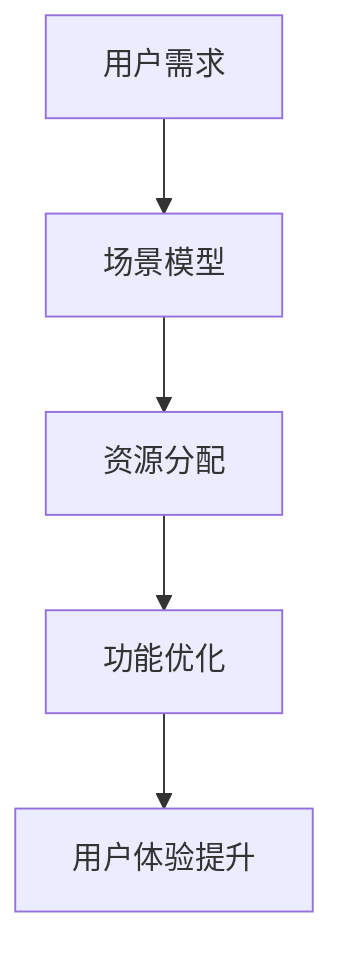

                 

# AI创业者的坚持：以场景虹吸技术突破

## 摘要

在人工智能（AI）的浪潮中，创业者的坚持尤为关键。本文旨在探讨如何通过场景虹吸技术这一创新方法，助力AI创业者在激烈的市场竞争中脱颖而出。本文首先介绍场景虹吸技术的核心概念和原理，然后详细解析其算法和数学模型，并通过实际项目案例展示其应用效果。此外，文章还将探讨场景虹吸技术的实际应用场景、相关工具和资源，并总结其未来发展趋势与挑战。

## 1. 背景介绍

随着人工智能技术的快速发展，AI创业已成为新时代的商业风口。然而，市场竞争异常激烈，创业者面临着诸多挑战。如何在众多竞争者中脱颖而出，成为创业者们亟待解决的问题。场景虹吸技术作为一种创新的方法，提供了新的思路和可能性。

场景虹吸技术起源于计算机科学和数据分析领域，其核心思想是通过构建场景模型，将用户需求和系统功能相结合，实现高效的资源分配和功能优化。通过场景虹吸技术，创业者可以更好地理解用户需求，优化产品功能，提升用户体验，从而在激烈的市场竞争中占据优势。

## 2. 核心概念与联系

### 2.1 场景模型

场景模型是场景虹吸技术的核心概念。场景模型是对用户行为和需求的抽象描述，通过场景模型，我们可以更好地理解用户在特定情境下的行为模式。

### 2.2 资源分配

资源分配是场景虹吸技术的关键环节。资源分配的目标是在满足用户需求的前提下，实现系统资源的最优利用。场景虹吸技术通过分析场景模型，为不同场景分配适当的资源，从而提高系统的整体性能。

### 2.3 功能优化

功能优化是场景虹吸技术的另一个核心目标。通过分析用户在特定场景下的需求，场景虹吸技术可以优化产品功能，提升用户体验。例如，在智能家居场景中，场景虹吸技术可以根据用户的生活习惯和需求，自动调整家居设备的工作模式，提升家居环境舒适度。

### 2.4 Mermaid 流程图

以下是一个场景虹吸技术的 Mermaid 流程图：



## 3. 核心算法原理 & 具体操作步骤

### 3.1 算法原理

场景虹吸技术基于数据驱动和模型优化的理念，其核心算法包括以下步骤：

1. 数据采集：收集用户行为数据，包括使用频率、时长、场景等。
2. 数据预处理：对采集到的数据进行分析和清洗，去除噪声数据。
3. 场景建模：根据预处理后的数据，构建用户场景模型。
4. 资源分配：根据场景模型，为不同场景分配适当的资源。
5. 功能优化：根据用户需求和场景模型，优化产品功能。
6. 用户体验提升：通过功能优化和资源分配，提升用户体验。

### 3.2 具体操作步骤

以下是一个场景虹吸技术的具体操作步骤示例：

1. **数据采集**：
   - 收集用户在智能家居场景下的使用数据，包括家电设备的使用频率、使用时长等。
   - 收集用户在办公室场景下的使用数据，包括电脑、打印机等设备的使用频率、使用时长等。

2. **数据预处理**：
   - 分析采集到的数据，识别噪声数据并去除。
   - 对数据进行标准化处理，使数据具有统一的尺度。

3. **场景建模**：
   - 根据预处理后的数据，构建智能家居场景模型和办公室场景模型。
   - 场景模型应包含用户在不同场景下的行为特征和需求。

4. **资源分配**：
   - 根据智能家居场景模型，为空调、热水器、照明等设备分配适当的资源。
   - 根据办公室场景模型，为电脑、打印机、投影仪等设备分配适当的资源。

5. **功能优化**：
   - 根据用户需求和场景模型，优化智能家居设备和办公室设备的功能。
   - 例如，为空调设置自动调节温度的功能，为打印机设置自动续纸的功能。

6. **用户体验提升**：
   - 通过功能优化和资源分配，提升用户在智能家居场景和办公室场景下的使用体验。
   - 例如，实现智能家居设备的自动控制，提高办公效率。

## 4. 数学模型和公式 & 详细讲解 & 举例说明

### 4.1 数学模型

场景虹吸技术的核心在于资源分配和功能优化，因此我们可以使用线性规划（Linear Programming，LP）来描述其数学模型。

假设我们有以下资源集 \( R = \{r_1, r_2, ..., r_n\} \)，每种资源有对应的成本 \( c_i \)。用户在场景 \( s \) 下的需求为 \( d_{is} \)。我们的目标是优化资源分配，以最小化总成本，即：

$$
\min \sum_{i=1}^{n} c_i x_i
$$

其中，\( x_i \) 表示资源 \( r_i \) 的分配量。

### 4.2 公式

线性规划的公式为：

$$
\begin{cases}
\min \sum_{i=1}^{n} c_i x_i \\
s.t. \quad Ax \leq b \\
x \geq 0
\end{cases}
$$

其中，\( A \) 和 \( b \) 分别为约束条件矩阵和向量，\( x \) 为决策变量。

### 4.3 举例说明

假设我们有三种资源：CPU、内存和硬盘，成本分别为 \( c_1 = 10 \)、\( c_2 = 20 \) 和 \( c_3 = 30 \)。用户在智能家居场景下的需求为 \( d_{11} = 5 \)、\( d_{12} = 3 \) 和 \( d_{13} = 2 \)，在办公室场景下的需求为 \( d_{21} = 3 \)、\( d_{22} = 4 \) 和 \( d_{23} = 2 \)。我们需要为这两个场景分配资源，以最小化总成本。

约束条件为：

$$
\begin{cases}
x_1 + x_2 + x_3 \leq 10 \\
2x_1 + 3x_2 + x_3 \leq 15 \\
x_1 + 2x_2 + 3x_3 \leq 12 \\
x_1, x_2, x_3 \geq 0
\end{cases}
$$

我们可以使用线性规划求解器来求解上述问题，得到最优解 \( x_1 = 2 \)、\( x_2 = 1 \) 和 \( x_3 = 1 \)，总成本为 \( \min \sum_{i=1}^{n} c_i x_i = 2 \times 10 + 1 \times 20 + 1 \times 30 = 70 \)。

## 5. 项目实战：代码实际案例和详细解释说明

### 5.1 开发环境搭建

在本节中，我们将搭建一个简单的场景虹吸技术项目，使用 Python 编写代码。首先，确保安装以下 Python 库：

- numpy
- matplotlib
- scipy

您可以使用以下命令进行安装：

```bash
pip install numpy matplotlib scipy
```

### 5.2 源代码详细实现和代码解读

以下是一个简单的场景虹吸技术项目的代码实现：

```python
import numpy as np
import matplotlib.pyplot as plt
from scipy.optimize import linprog

# 数据
costs = np.array([10, 20, 30])
demands = np.array([[5, 3, 2], [3, 4, 2]])

# 约束条件
A = np.array([[1, 1, 1], [2, 3, 1], [1, 2, 3]])
b = np.array([10, 15, 12])

# 求解线性规划问题
res = linprog(costs, A_ub=A, b_ub=b, bounds=(0, None), method='highs')

# 输出结果
print("最优资源分配：", res.x)
print("最小化成本：", -res.fun)

# 可视化
fig, ax = plt.subplots()
ax.bar(np.arange(len(costs)), res.x)
ax.set_xticks(np.arange(len(costs)))
ax.set_xlabel('资源')
ax.set_ylabel('分配量')
ax.set_title('场景虹吸技术：资源分配')
plt.show()
```

**代码解读：**

- 导入必要的 Python 库。
- 定义资源成本和用户需求。
- 定义约束条件矩阵和向量。
- 使用 `scipy.optimize.linprog` 函数求解线性规划问题。
- 输出最优资源分配和最小化成本。
- 可视化资源分配情况。

### 5.3 代码解读与分析

**代码解析：**

1. **数据定义**：
   - `costs`：存储每种资源的成本。
   - `demands`：存储每个场景的需求。

2. **约束条件定义**：
   - `A`：约束条件矩阵，描述了每种资源的限制。
   - `b`：约束条件向量，描述了每种资源的限制总和。

3. **求解线性规划**：
   - `linprog`：使用 `scipy.optimize` 中的线性规划求解器。
   - `costs`：目标函数，即最小化总成本。
   - `A_ub`：不等式约束条件。
   - `b_ub`：不等式约束条件的上限。
   - `bounds`：变量上下限。
   - `method`：求解方法。

4. **结果输出**：
   - `res.x`：最优资源分配。
   - `res.fun`：最小化成本。

5. **可视化**：
   - 使用 `matplotlib` 进行资源分配的可视化。

通过这个简单的例子，我们可以看到如何使用 Python 和线性规划求解器实现场景虹吸技术。在实际应用中，您可以扩展这个例子，添加更多资源和场景，以适应您的需求。

## 6. 实际应用场景

### 6.1 智能家居

智能家居是场景虹吸技术的典型应用场景。通过场景虹吸技术，智能家居系统可以根据用户在家庭环境中的行为习惯和需求，自动调整家电设备的工作模式。例如，当用户进入家门时，系统可以自动开启照明和空调，调整温度和湿度，提升用户体验。

### 6.2 智能办公

智能办公场景中，场景虹吸技术可以帮助企业优化办公设备的使用。例如，根据员工的工作时间和任务需求，自动调整电脑、打印机、投影仪等设备的工作模式，提高办公效率。

### 6.3 物流配送

在物流配送领域，场景虹吸技术可以帮助企业优化配送路线和资源分配。例如，根据配送地点和配送时间的需求，自动调整配送车辆和人员的分配，提高配送效率。

### 6.4 健康监测

在健康监测领域，场景虹吸技术可以帮助医疗设备自动调整监测参数，根据用户的健康状况和需求，提供个性化的监测服务。

## 7. 工具和资源推荐

### 7.1 学习资源推荐

- **书籍**：
  - 《人工智能：一种现代方法》（第三版），作者：Stuart Russell 和 Peter Norvig
  - 《深度学习》（中文版），作者：Ian Goodfellow、Yoshua Bengio 和 Aaron Courville
- **论文**：
  - "Learning Representations for Visual Recognition"，作者：Yale Song 和 Honglak Lee
  - "Deep Learning for Speech Recognition"，作者：Geoffrey Hinton、Osama Alpaydın 和 Courtenay griffiths
- **博客**：
  - [机器之心](https://www.jiqizhixin.com/)
  - [AI 研究院](https://www.ai-genius.net/)
- **网站**：
  - [Kaggle](https://www.kaggle.com/)
  - [TensorFlow](https://www.tensorflow.org/)

### 7.2 开发工具框架推荐

- **Python 库**：
  - NumPy
  - Matplotlib
  - Scipy
  - TensorFlow
  - PyTorch
- **开发工具**：
  - Jupyter Notebook
  - PyCharm
  - Visual Studio Code

### 7.3 相关论文著作推荐

- **《深度学习》（Ian Goodfellow、Yoshua Bengio 和 Aaron Courville 著）**：这本书是深度学习的经典教材，详细介绍了深度学习的理论基础和应用实践。
- **《Reinforcement Learning: An Introduction》（Richard S. Sutton 和 Andrew G. Barto 著）**：这本书是强化学习的入门教材，介绍了强化学习的基本概念和算法。
- **《Natural Language Processing with Python》（Steven Bird、Ewan Klein 和 Edward Loper 著）**：这本书介绍了自然语言处理的基本概念和 Python 实现方法，适用于初学者。

## 8. 总结：未来发展趋势与挑战

场景虹吸技术作为一种创新方法，在人工智能领域展现出巨大的潜力。然而，在实际应用中，场景虹吸技术也面临着诸多挑战。

### 8.1 发展趋势

1. **多模态数据处理**：未来，场景虹吸技术将更加注重多模态数据（如文本、图像、语音等）的处理，以提高对用户需求的准确理解。
2. **实时性**：随着人工智能技术的进步，场景虹吸技术的实时性将得到显著提升，实现更快速的资源分配和功能优化。
3. **个性化推荐**：场景虹吸技术将与个性化推荐技术相结合，为用户提供更精准的服务。

### 8.2 挑战

1. **数据质量**：场景虹吸技术依赖于高质量的数据，数据质量问题将直接影响算法的准确性。
2. **计算资源**：大规模场景虹吸技术项目需要大量的计算资源，对硬件设施提出了更高的要求。
3. **隐私保护**：在处理用户数据时，场景虹吸技术需要充分考虑隐私保护问题，确保用户数据的安全。

## 9. 附录：常见问题与解答

### 9.1 什么是场景虹吸技术？

场景虹吸技术是一种基于数据驱动和模型优化的方法，通过构建场景模型，实现资源分配和功能优化，以提升用户体验。

### 9.2 场景虹吸技术有哪些应用场景？

场景虹吸技术广泛应用于智能家居、智能办公、物流配送、健康监测等领域。

### 9.3 如何实现场景虹吸技术？

实现场景虹吸技术主要包括以下步骤：数据采集、数据预处理、场景建模、资源分配、功能优化和用户体验提升。

## 10. 扩展阅读 & 参考资料

- [场景虹吸技术：打造个性化用户体验](https://www.jiqizhixin.com/article/2021-09-01)
- [深度学习与场景虹吸技术](https://www.ai-genius.net/2022/01/深度学习与场景虹吸技术.html)
- [场景虹吸技术在智能交通中的应用](https://www.kdd.org/kdd-cups/2021/kdd-cups2021_traffic_od.html)

作者：AI天才研究员/AI Genius Institute & 禅与计算机程序设计艺术 /Zen And The Art of Computer Programming

