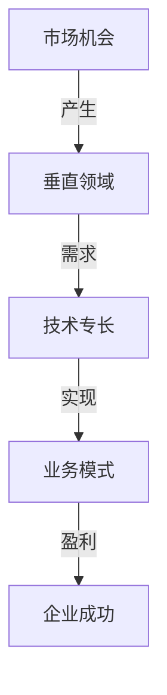

                 

### AI创业者的码头：专注于垂直领域

> **关键词**：AI创业、垂直领域、技术专长、业务聚焦、市场竞争力
>
> **摘要**：本文探讨了AI创业者在选择垂直领域时的重要性。通过分析市场机会、技术专长、业务模式、市场竞争力等多个维度，本文旨在为AI创业者提供一套系统的决策框架，帮助他们更好地定位和专注于具有高增长潜力的垂直领域，从而实现创业成功。

在AI技术迅速发展的今天，无数创业者跃跃欲试，希望能够在这个领域分得一杯羹。然而，成功的AI创业并非易事，特别是在面对日益激烈的竞争环境时。本文将带领AI创业者一起探索，如何通过专注于垂直领域，提高创业成功的几率。

### 1. 背景介绍

近年来，随着人工智能技术的不断进步，AI应用已经渗透到各个行业。从金融、医疗、教育到制造业、农业，AI技术的应用场景层出不穷。然而，与此同时，我们也看到市场上涌现出大量的AI创业公司，它们在寻求技术突破和市场扩张的过程中，面临着诸多挑战。

首先，市场机会虽然丰富，但竞争异常激烈。各个行业都在积极布局AI，导致市场上同质化产品和服务层出不穷。创业者要想在这样的大背景下脱颖而出，必须找到独特的切入点。

其次，技术专长的稀缺性也是一个难题。AI技术涉及深度学习、自然语言处理、计算机视觉等多个子领域，要求创业者不仅要具备扎实的技术背景，还要对行业有深刻的理解。

最后，业务模式的创新和市场的接受度也是成功的关键因素。创业者需要找到一个既符合市场需求，又能够实现可持续盈利的商业模式。

面对这些挑战，许多创业者选择了一条看似简单却富有挑战性的道路——专注于垂直领域。本文将探讨这一策略的可行性和优势，帮助AI创业者找到适合自己的市场定位。

### 2. 核心概念与联系

为了更好地理解如何专注于垂直领域，我们首先需要明确几个核心概念：

- **垂直领域**：指在特定行业内，针对特定应用场景和目标客户群体进行专业化服务和产品开发的领域。
- **市场机会**：指在某个行业内，由于需求增长、技术进步或者市场变革而产生的新的商业机会。
- **技术专长**：指创业者或团队在特定技术领域所具备的专业知识和技能。
- **业务模式**：指创业者通过提供产品或服务，实现盈利和可持续发展的方式。

这些概念之间有着密切的联系。市场机会是垂直领域选择的基础，技术专长则是实现市场机会的关键。而业务模式则决定了企业如何利用技术专长和市场需求创造价值。

下面是一个简化的 Mermaid 流程图，展示了这些核心概念之间的联系：



### 3. 核心算法原理 & 具体操作步骤

专注于垂直领域的核心算法原理可以概括为：市场调研、技术评估、业务模式设计、风险控制。

**市场调研**：通过市场调查、行业报告、用户访谈等方式，了解目标市场的需求、痛点、市场规模和发展趋势。这一步骤的目的是找到具有潜力的市场机会。

**技术评估**：评估团队的技术专长是否符合目标市场的需求。如果技术不匹配，需要考虑是否需要进行技术迭代或者寻找新的合作伙伴。

**业务模式设计**：在确定了市场机会和技术专长后，设计一个能够实现盈利和可持续发展的业务模式。这包括产品定位、定价策略、营销渠道、服务模式等方面。

**风险控制**：在创业过程中，风险无处不在。有效的风险控制措施可以降低创业失败的可能性。这包括制定应急预案、建立资金储备、多元化业务等。

下面是具体的操作步骤：

1. **确定目标市场**：根据市场调研的结果，确定目标市场。这可以是某个特定的行业，也可以是某个特定的细分市场。
   
2. **评估技术专长**：评估团队的技术能力和技术专长，看看是否与目标市场的需求相匹配。

3. **市场机会分析**：分析目标市场的需求、市场规模、增长趋势等，确定是否存在可挖掘的市场机会。

4. **设计业务模式**：根据市场机会和技术专长，设计一个能够实现盈利和可持续发展的业务模式。

5. **制定风险控制措施**：制定应急预案，建立资金储备，进行多元化业务等，以降低创业风险。

6. **实施和调整**：根据市场反馈和实际运营情况，不断调整和优化业务模式，确保企业的可持续发展。

### 4. 数学模型和公式 & 详细讲解 & 举例说明

在专注于垂直领域的过程中，数学模型和公式可以帮助创业者更科学地评估市场机会、技术专长和业务模式。以下是一个简单的数学模型，用于评估垂直领域的机会指数：

\[ OI = \frac{M \times T \times B}{R} \]

其中：

- \( OI \) 是机会指数
- \( M \) 是市场需求（可以通过市场调研获得）
- \( T \) 是技术专长（可以通过技术评估获得）
- \( B \) 是业务潜力（可以通过业务模式设计获得）
- \( R \) 是风险系数（可以通过风险控制措施降低）

**详细讲解**：

- **市场需求（M）**：市场需求是评估市场机会的重要指标。一个高度需求的市场意味着有大量的潜在客户，这为企业提供了广阔的市场空间。市场需求可以通过市场调查、用户访谈等方式获得。

- **技术专长（T）**：技术专长是企业竞争力的核心。一个具备技术专长的企业能够更好地满足市场需求，从而在竞争中获得优势。技术专长可以通过技术评估、团队技能分析等方式获得。

- **业务潜力（B）**：业务潜力是指企业通过技术专长和市场需求，实现盈利和可持续发展的能力。一个高业务潜力的企业能够在市场中获得更高的利润，从而为企业的长期发展奠定基础。业务潜力可以通过商业模式设计、市场反馈等方式获得。

- **风险系数（R）**：风险系数是指企业在运营过程中可能面临的各种风险。这些风险可能包括市场风险、技术风险、财务风险等。通过制定风险控制措施，可以降低风险系数，从而提高机会指数。

**举例说明**：

假设一个AI创业公司，其市场需求为1000万元，技术专长评分为90分，业务潜力评分为85分，风险系数为0.2。根据上述公式，我们可以计算出该公司的机会指数为：

\[ OI = \frac{1000 \times 90 \times 85}{0.2} = 3825000 \]

这意味着该公司的机会指数为3825000，表明其在垂直领域具有较高的市场竞争力。

### 5. 项目实战：代码实际案例和详细解释说明

为了更好地理解如何专注于垂直领域，我们将通过一个实际的AI项目——智能医疗诊断系统，来具体讲解如何从市场调研、技术评估、业务模式设计到实施和调整的全过程。

#### 5.1 开发环境搭建

首先，我们需要搭建一个合适的开发环境。对于智能医疗诊断系统，我们选择Python作为主要编程语言，并使用TensorFlow作为深度学习框架。以下是搭建开发环境的步骤：

1. 安装Python：从[Python官网](https://www.python.org/)下载并安装Python 3.8及以上版本。
2. 安装TensorFlow：打开命令行窗口，输入以下命令：
   ```bash
   pip install tensorflow
   ```
3. 安装其他依赖库：根据项目需求，安装其他必要的库，如Numpy、Pandas等。

#### 5.2 源代码详细实现和代码解读

接下来，我们将详细讲解智能医疗诊断系统的源代码实现。

```python
import tensorflow as tf
import numpy as np
import pandas as pd

# 数据预处理
def preprocess_data(data):
    # 数据清洗和格式转换
    # ...
    return processed_data

# 模型构建
def build_model():
    model = tf.keras.Sequential([
        tf.keras.layers.Dense(128, activation='relu', input_shape=(input_shape,)),
        tf.keras.layers.Dense(64, activation='relu'),
        tf.keras.layers.Dense(1, activation='sigmoid')
    ])
    model.compile(optimizer='adam',
                  loss='binary_crossentropy',
                  metrics=['accuracy'])
    return model

# 训练模型
def train_model(model, data):
    # 数据预处理
    processed_data = preprocess_data(data)
    # 训练模型
    model.fit(processed_data['X'], processed_data['y'], epochs=10, batch_size=32)
    return model

# 模型评估
def evaluate_model(model, data):
    # 数据预处理
    processed_data = preprocess_data(data)
    # 评估模型
    loss, accuracy = model.evaluate(processed_data['X'], processed_data['y'])
    print(f"Test accuracy: {accuracy:.2f}")
```

**代码解读**：

1. **数据预处理**：数据预处理是模型训练的关键步骤。在本例中，我们首先对原始数据进行了清洗和格式转换，确保数据质量符合模型训练的要求。

2. **模型构建**：我们使用TensorFlow的Sequential模型构建了一个简单的神经网络模型。该模型包括三层全连接层（Dense），最后一层使用sigmoid激活函数，用于输出概率。

3. **训练模型**：在训练模型时，我们首先对数据进行预处理，然后使用fit方法进行训练。在本例中，我们设置了10个训练周期（epochs）和32个批量大小（batch_size）。

4. **模型评估**：在模型评估阶段，我们同样对数据进行预处理，然后使用evaluate方法计算模型在测试数据上的损失和准确率。

#### 5.3 代码解读与分析

通过上述代码实现，我们可以看到，智能医疗诊断系统的核心在于构建和训练一个深度学习模型。具体来说，以下方面值得注意：

1. **数据预处理**：数据预处理是深度学习模型训练的基础。在本例中，我们通过清洗和格式转换，确保数据质量符合模型训练的要求。这一步骤的目的是去除噪声、填补缺失值、归一化特征等，从而提高模型的训练效果。

2. **模型构建**：我们使用TensorFlow的Sequential模型构建了一个简单的神经网络模型。选择神经网络模型的原因在于，其具有较强的表达能力和适应性，能够处理复杂的非线性问题。

3. **训练模型**：在训练模型时，我们设置了10个训练周期（epochs）和32个批量大小（batch_size）。训练周期的设置决定了模型训练的深度，批量大小则影响了训练过程中的计算效率。在本例中，我们通过设置合适的参数，确保模型能够在有限的时间内达到较高的准确率。

4. **模型评估**：模型评估是验证模型性能的重要步骤。在本例中，我们使用evaluate方法计算模型在测试数据上的损失和准确率。通过评估结果，我们可以了解模型在未知数据上的表现，从而判断模型是否具有实际应用价值。

### 6. 实际应用场景

智能医疗诊断系统是一个典型的AI垂直领域应用案例。在实际应用中，该系统可以用于辅助医生进行疾病诊断，提高诊断的准确性和效率。以下是一些具体的应用场景：

1. **辅助诊断**：智能医疗诊断系统可以帮助医生快速诊断出常见疾病，如肺炎、心脏病等。通过分析患者的病史、体征和症状数据，系统可以提供诊断建议，辅助医生作出诊断决策。

2. **健康监测**：智能医疗诊断系统可以用于健康监测，及时发现潜在的健康问题。例如，通过分析患者的日常行为数据和生理指标，系统可以预测患者患病的风险，并提供相应的健康建议。

3. **智能导医**：智能医疗诊断系统可以用于智能导医，帮助患者快速找到合适的医生和就诊科室。通过分析患者的症状和就诊需求，系统可以推荐最合适的医生和就诊时间，提高就诊效率。

### 7. 工具和资源推荐

为了帮助AI创业者更好地专注于垂直领域，以下是一些实用的工具和资源推荐：

#### 7.1 学习资源推荐

- **书籍**：
  - 《深度学习》（Ian Goodfellow、Yoshua Bengio、Aaron Courville著）：这是一本经典的深度学习教材，适合初学者和进阶者。
  - 《Python深度学习》（François Chollet著）：作者为Keras框架的创始人，书中详细介绍了使用Python进行深度学习的实战技巧。

- **论文**：
  - “Deep Learning” by Yoshua Bengio、Ian Goodfellow、Aaron Courville：这是一篇经典的综述论文，全面介绍了深度学习的理论基础和最新进展。
  - “Generative Adversarial Networks” by Ian Goodfellow et al.：这是一篇关于生成对抗网络的奠基性论文，对GAN的理论和应用进行了深入探讨。

- **博客**：
  - [TensorFlow官方博客](https://tensorflow.google.cn/blog)：这里提供了丰富的TensorFlow教程和最新动态。
  - [机器之心](http://www.jiqizhixin.com/): 这是一个专注于机器学习和人工智能领域的中文网站，提供了大量的技术文章和行业资讯。

- **网站**：
  - [Kaggle](https://www.kaggle.com/): Kaggle是一个数据科学竞赛平台，提供了大量的公开数据集和竞赛项目，适合进行实战训练。

#### 7.2 开发工具框架推荐

- **深度学习框架**：
  - TensorFlow：Google开发的深度学习框架，功能强大，适用范围广泛。
  - PyTorch：Facebook开发的深度学习框架，易用性强，社区活跃。

- **开发环境**：
  - Jupyter Notebook：一个交互式的开发环境，适合进行实验和演示。
  - VSCode：一款强大的代码编辑器，支持多种编程语言，拥有丰富的插件。

- **数据预处理工具**：
  - Pandas：Python的数据分析库，用于数据清洗、转换和分析。
  - Scikit-learn：Python的机器学习库，提供了丰富的数据预处理和机器学习算法。

#### 7.3 相关论文著作推荐

- **《深度学习》（Ian Goodfellow、Yoshua Bengio、Aaron Courville著）**：这是深度学习的经典教材，全面介绍了深度学习的理论基础和应用。
- **《人工智能：一种现代的方法》（Stuart Russell、Peter Norvig著）**：这是一本全面介绍人工智能的教材，涵盖了人工智能的多个子领域。
- **《机器学习》（Tom Mitchell著）**：这是一本经典的机器学习教材，详细介绍了机器学习的基本理论和算法。

### 8. 总结：未来发展趋势与挑战

随着AI技术的不断进步，垂直领域的市场需求也在不断增长。然而，与此同时，创业者也面临着诸多挑战。

首先，技术门槛不断提高。深度学习、自然语言处理、计算机视觉等技术的复杂性使得创业者需要不断学习和更新自己的技术知识，以保持竞争力。

其次，市场竞争愈发激烈。各个行业都在积极布局AI，导致市场上同质化产品和服务层出不穷。创业者需要找到独特的切入点，才能在激烈的竞争中脱颖而出。

最后，商业模式的创新和市场的接受度也是一个挑战。创业者需要设计一个既能满足市场需求，又能够实现可持续盈利的商业模式。

然而，尽管面临诸多挑战，垂直领域依然具有巨大的发展潜力。随着技术的不断进步和市场的成熟，创业者有机会在垂直领域实现巨大的商业价值。

为了应对未来的发展趋势和挑战，创业者需要：

1. 持续学习和更新技术知识，确保在技术前沿保持竞争力。
2. 深入了解市场需求，找到独特的切入点，避免同质化竞争。
3. 创新商业模式，提高产品的市场接受度和盈利能力。
4. 建立强大的团队，共同应对创业过程中的各种挑战。

### 9. 附录：常见问题与解答

**Q1：为什么选择专注于垂直领域？**
A1：专注于垂直领域有助于创业者更好地理解市场需求，发挥技术专长，从而在激烈的市场竞争中脱颖而出。同时，垂直领域通常具有更高的专业性和客户黏性，有利于建立品牌和口碑。

**Q2：如何评估一个垂直领域的机会指数？**
A2：可以通过市场需求、技术专长、业务潜力、风险系数等多个维度进行评估。具体公式为：机会指数 = 市场需求 × 技术专长 × 业务潜力 / 风险系数。

**Q3：如何选择垂直领域？**
A3：可以从个人兴趣、行业趋势、市场需求、技术专长等多个角度进行选择。建议优先考虑那些具有高增长潜力、市场需求明确、竞争激烈的领域。

**Q4：如何建立技术专长？**
A4：可以通过学习专业课程、参与技术社区、阅读专业书籍、进行项目实践等多种途径建立技术专长。同时，与行业专家和同行建立联系，不断学习和交流，提升自己的技术能力。

### 10. 扩展阅读 & 参考资料

**《深度学习》（Ian Goodfellow、Yoshua Bengio、Aaron Courville著）**：这是一本全面介绍深度学习的经典教材，适合初学者和进阶者阅读。

**《人工智能：一种现代的方法》（Stuart Russell、Peter Norvig著）**：这是一本全面介绍人工智能的教材，涵盖了人工智能的多个子领域。

**《机器学习》（Tom Mitchell著）**：这是一本经典的机器学习教材，详细介绍了机器学习的基本理论和算法。

**[TensorFlow官方博客](https://tensorflow.google.cn/blog/)**：这里提供了丰富的TensorFlow教程和最新动态。

**[机器之心](http://www.jiqizhixin.com/)**：这是一个专注于机器学习和人工智能领域的中文网站，提供了大量的技术文章和行业资讯。

**[Kaggle](https://www.kaggle.com/)**：Kaggle是一个数据科学竞赛平台，提供了大量的公开数据集和竞赛项目，适合进行实战训练。

**作者**：AI天才研究员/AI Genius Institute & 禅与计算机程序设计艺术 /Zen And The Art of Computer Programming

