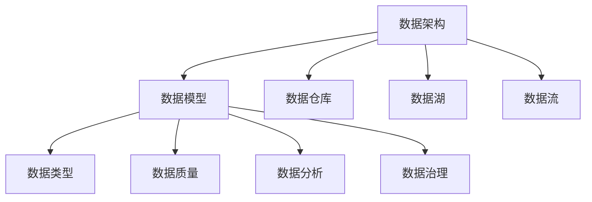
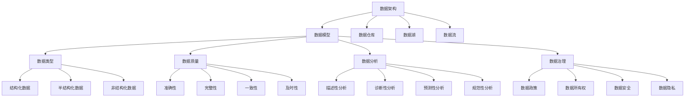

                 

# AI创业：数据管理的策略与实践探讨

> **关键词**：人工智能创业、数据管理、策略、实践、数据架构

> **摘要**：本文将从人工智能创业的视角，探讨数据管理的策略和实践。通过分析数据管理的核心概念、算法原理，以及具体的应用场景，为创业者提供数据管理方面的思考和建议。

## 1. 背景介绍

在当前这个大数据和人工智能快速发展的时代，数据已经成为企业的核心资产。无论是初创企业还是成熟企业，数据管理都变得越来越重要。然而，数据管理的复杂性也让很多创业者感到困惑。如何高效地收集、存储、处理和分析数据，成为许多创业者在制定业务战略时必须面对的挑战。

### 1.1 数据管理的定义和意义

数据管理是指一系列用于收集、存储、处理、分析和维护数据的策略、流程和技术。它不仅涉及到数据的物理存储和管理，还包括数据的结构化、标准化、安全性和隐私保护等方面。良好的数据管理能够为企业带来以下好处：

- 提高数据质量，确保数据准确性、完整性和一致性。
- 提高数据访问速度，支持快速的业务决策。
- 降低数据存储和管理成本，优化资源利用。
- 提升企业竞争力，支持数据驱动的创新。

### 1.2 数据管理的发展历程

数据管理的发展历程可以追溯到计算机技术出现的时候。随着数据量的不断增加和数据分析技术的进步，数据管理也在不断演变。以下是数据管理的主要发展阶段：

- **传统数据库时代**：以关系型数据库为主，数据以表格形式存储，支持结构化查询。
- **大数据时代**：数据类型和规模不断增加，非关系型数据库和分布式计算技术得到广泛应用。
- **智能数据管理时代**：利用人工智能和机器学习技术，实现数据自动分类、标签、推荐等功能。

### 1.3 数据管理的重要性

对于创业者来说，数据管理的重要性不言而喻。以下是一些关键点：

- **业务增长**：通过数据分析，发现业务机会，实现精细化运营。
- **用户体验**：通过用户数据分析，提供个性化服务，提升用户满意度。
- **风险管理**：通过数据监控和分析，识别潜在风险，采取预防措施。
- **数据资产**：将数据视为企业的重要资产，进行有效的管理和利用。

## 2. 核心概念与联系

在探讨数据管理的策略和实践之前，我们需要先了解一些核心概念和它们之间的联系。以下是数据管理中一些重要的概念：

### 2.1 数据架构

数据架构是指数据存储、处理和分析的结构和组织方式。它包括以下几个方面：

- **数据模型**：定义数据的结构，包括实体、属性、关系等。
- **数据仓库**：存储大量历史数据，支持数据分析和决策。
- **数据湖**：存储大量原始数据，支持数据的自由探索和分析。
- **数据流**：定义数据在系统中的流动过程，包括数据的采集、传输、处理和存储。

### 2.2 数据类型

数据类型包括结构化数据、半结构化数据和非结构化数据：

- **结构化数据**：以表格形式存储的数据，如数据库中的数据。
- **半结构化数据**：部分结构化的数据，如XML、JSON等。
- **非结构化数据**：无固定结构的数据，如文本、图像、音频、视频等。

### 2.3 数据质量

数据质量是指数据的准确性、完整性、一致性和可靠性。良好的数据质量是数据管理的关键，它直接影响到数据分析的结果。

### 2.4 数据分析

数据分析是指使用统计方法和计算机技术对数据进行处理和分析，以发现数据中的规律和趋势。数据分析包括描述性分析、诊断性分析、预测性分析和规范性分析。

### 2.5 数据治理

数据治理是指制定和执行策略、标准和流程，确保数据质量和安全。数据治理包括数据政策、数据所有权、数据安全、数据隐私等方面。

以下是这些核心概念之间的联系（使用Mermaid流程图表示）：



## 3. 核心算法原理 & 具体操作步骤

### 3.1 数据采集

数据采集是数据管理的第一步。数据采集的来源包括内部系统和外部系统。具体操作步骤如下：

1. **确定数据需求**：明确需要采集哪些数据，包括数据类型、数据来源和数据量。
2. **选择采集工具**：根据数据类型和来源，选择合适的采集工具，如API、爬虫、数据库连接等。
3. **实现数据采集**：编写代码或使用现成的工具，实现数据的采集和传输。

### 3.2 数据清洗

数据清洗是指对采集到的数据进行处理，去除重复、错误和不完整的数据。具体操作步骤如下：

1. **数据预处理**：对数据进行格式化、去重、去空值等预处理操作。
2. **数据校正**：对错误数据进行修正或删除。
3. **数据标准化**：统一数据格式，如日期格式、货币格式等。

### 3.3 数据存储

数据存储是指将清洗后的数据存储到数据库或数据仓库中。具体操作步骤如下：

1. **选择存储方案**：根据数据量和访问需求，选择合适的存储方案，如关系型数据库、NoSQL数据库、数据仓库等。
2. **设计数据模型**：根据业务需求，设计数据模型，包括实体、属性、关系等。
3. **实现数据存储**：编写代码或使用现成的工具，将数据存储到数据库或数据仓库中。

### 3.4 数据分析

数据分析是指使用统计方法和计算机技术对数据进行处理和分析。具体操作步骤如下：

1. **确定分析目标**：明确需要分析的数据和分析的目标。
2. **选择分析方法**：根据分析目标，选择合适的分析方法，如描述性分析、诊断性分析、预测性分析等。
3. **实现数据分析**：编写代码或使用现成的工具，对数据进行处理和分析。

### 3.5 数据可视化

数据可视化是将数据以图形或图表的形式呈现，帮助用户更好地理解和分析数据。具体操作步骤如下：

1. **选择可视化工具**：根据数据类型和分析需求，选择合适的可视化工具，如图表库、可视化软件等。
2. **设计可视化方案**：根据数据和分析结果，设计合适的可视化方案，包括图表类型、颜色、布局等。
3. **实现数据可视化**：编写代码或使用现成的工具，实现数据可视化。

## 4. 数学模型和公式 & 详细讲解 & 举例说明

### 4.1 数据清洗中的数学模型

在数据清洗过程中，常用的数学模型包括：

- **去重**：使用哈希函数或位图索引来查找重复数据。
- **去空值**：使用条件判断或筛选操作来去除空值。

具体例子：

假设我们有一个学生成绩数据集，其中包含学生的姓名、学号、成绩等信息。我们需要去除重复数据和空值。

```latex
\text{成绩数据集} = \{(\text{姓名}_i, \text{学号}_i, \text{成绩}_i) | i = 1, 2, ..., n\}

\text{去重步骤}:
1. 定义哈希函数 $h(\text{学号}_i)$，将学号映射到哈希值。
2. 使用哈希表存储已处理的学号。
3. 遍历数据集，对于每个数据项 $(\text{姓名}_i, \text{学号}_i, \text{成绩}_i)$：
   - 如果 $h(\text{学号}_i)$ 不在哈希表中，将 $(\text{姓名}_i, \text{学号}_i, \text{成绩}_i)$ 添加到清洗后的数据集中；
   - 否则，跳过该数据项。

\text{去空值步骤}:
1. 定义空值集合 $V$，包含所有可能的空值。
2. 遍历数据集，对于每个数据项 $(\text{姓名}_i, \text{学号}_i, \text{成绩}_i)$：
   - 如果 $(\text{姓名}_i, \text{学号}_i, \text{成绩}_i) \in V$，跳过该数据项；
   - 否则，将 $(\text{姓名}_i, \text{学号}_i, \text{成绩}_i)$ 添加到清洗后的数据集中。
```

### 4.2 数据分析中的数学模型

在数据分析过程中，常用的数学模型包括：

- **线性回归**：用于分析自变量和因变量之间的关系。
- **聚类分析**：用于将数据分为不同的类别。
- **关联规则挖掘**：用于发现数据中的关联关系。

具体例子：

假设我们有一个电商数据集，其中包含商品名称、购买频率等信息。我们需要分析商品之间的关联关系。

```latex
\text{电商数据集} = \{(\text{商品}_i, \text{购买频率}_i) | i = 1, 2, ..., n\}

\text{关联规则挖掘步骤}:
1. 定义支持度和置信度：
   - 支持度：$s(\text{商品}_i, \text{商品}_j)$ 表示同时购买 $\text{商品}_i$ 和 $\text{商品}_j$ 的次数与总购买次数的比值；
   - 置信度：$c(\text{商品}_i, \text{商品}_j)$ 表示购买 $\text{商品}_i$ 后购买 $\text{商品}_j$ 的概率。

2. 遍历所有商品对 $(\text{商品}_i, \text{商品}_j)$：
   - 计算支持度 $s(\text{商品}_i, \text{商品}_j)$；
   - 如果 $s(\text{商品}_i, \text{商品}_j) \geq \text{最小支持度}$，计算置信度 $c(\text{商品}_i, \text{商品}_j)$；
   - 如果 $c(\text{商品}_i, \text{商品}_j) \geq \text{最小置信度}$，输出关联规则 $(\text{商品}_i \Rightarrow \text{商品}_j)$。

3. 输出所有满足最小支持度和最小置信度要求的关联规则。
```

## 5. 项目实战：代码实际案例和详细解释说明

### 5.1 开发环境搭建

在本节中，我们将使用Python作为编程语言，介绍如何在本地环境搭建数据管理项目所需的开发环境。以下是具体的步骤：

1. **安装Python**：从Python官方网站下载并安装Python 3.x版本。
2. **安装Jupyter Notebook**：打开命令行窗口，执行以下命令：
   ```bash
   pip install notebook
   ```
   然后启动Jupyter Notebook，输入以下命令：
   ```bash
   jupyter notebook
   ```
3. **安装数据管理相关库**：在Jupyter Notebook中执行以下命令：
   ```bash
   !pip install pandas numpy scipy sklearn matplotlib
   ```

### 5.2 源代码详细实现和代码解读

在本节中，我们将使用Python实现一个简单的数据管理项目，包括数据采集、数据清洗、数据存储、数据分析和数据可视化等步骤。以下是具体的代码实现：

```python
import pandas as pd
import numpy as np
from sklearn.cluster import KMeans
import matplotlib.pyplot as plt

# 5.2.1 数据采集
def data_collection():
    # 从本地文件读取数据
    data = pd.read_csv("data.csv")
    return data

# 5.2.2 数据清洗
def data_cleaning(data):
    # 去除重复数据和空值
    data = data.drop_duplicates()
    data = data.dropna()
    return data

# 5.2.3 数据存储
def data_storage(data):
    # 将清洗后的数据保存到本地文件
    data.to_csv("cleaned_data.csv", index=False)

# 5.2.4 数据分析
def data_analysis(data):
    # 使用K-Means算法进行聚类分析
    kmeans = KMeans(n_clusters=3, random_state=0).fit(data)
    labels = kmeans.predict(data)
    data["cluster"] = labels
    
    # 绘制聚类结果
    plt.scatter(data["feature_1"], data["feature_2"], c=labels, cmap="viridis")
    plt.xlabel("Feature 1")
    plt.ylabel("Feature 2")
    plt.title("K-Means Clustering")
    plt.show()

# 5.2.5 数据可视化
def data_visualization(data):
    # 绘制数据分布图
    data.hist(bins=50, figsize=(20, 15))
    plt.tight_layout()
    plt.show()

# 主函数
def main():
    data = data_collection()
    cleaned_data = data_cleaning(data)
    data_storage(cleaned_data)
    data_analysis(cleaned_data)
    data_visualization(cleaned_data)

if __name__ == "__main__":
    main()
```

### 5.3 代码解读与分析

在本节中，我们将对上述代码进行解读，分析每个函数的作用和实现方式。

- **data_collection()**：该函数用于数据采集，从本地文件读取数据，并返回一个Pandas DataFrame对象。
- **data_cleaning(data)**：该函数用于数据清洗，去除重复数据和空值，并返回清洗后的数据。
- **data_storage(data)**：该函数用于数据存储，将清洗后的数据保存到本地文件。
- **data_analysis(data)**：该函数用于数据分析，使用K-Means算法进行聚类分析，并将聚类结果绘制成散点图。
- **data_visualization(data)**：该函数用于数据可视化，绘制数据分布图。

在主函数`main()`中，我们依次调用以上函数，实现数据管理的全过程。

## 6. 实际应用场景

数据管理在各个行业和领域都有着广泛的应用。以下是一些实际应用场景：

### 6.1 金融行业

在金融行业中，数据管理主要用于风险管理、客户关系管理和投资决策等方面。通过收集和分析客户数据、交易数据和市场数据，金融机构可以更好地了解客户需求，优化业务流程，降低风险。

### 6.2 医疗健康

在医疗健康领域，数据管理主要用于患者数据管理、疾病预测和个性化医疗等方面。通过收集和分析患者数据、基因数据和环境数据，医疗保健机构可以提供更准确、个性化的医疗服务。

### 6.3 零售电商

在零售电商领域，数据管理主要用于产品推荐、库存管理和客户分析等方面。通过收集和分析用户行为数据、交易数据和商品数据，电商平台可以提供更精准的推荐，优化库存管理，提高销售额。

### 6.4 智能制造

在智能制造领域，数据管理主要用于设备监控、生产优化和质量管理等方面。通过收集和分析设备数据、生产数据和质量数据，企业可以优化生产流程，提高生产效率，降低成本。

## 7. 工具和资源推荐

### 7.1 学习资源推荐

- **书籍**：
  - 《数据科学入门》
  - 《机器学习实战》
  - 《数据挖掘：概念与技术》
- **论文**：
  - 《大数据时代的数据管理》
  - 《数据挖掘中的聚类算法研究》
  - 《基于大数据的智能数据分析》
- **博客**：
  - [Python数据科学教程](https://www.datacamp.com/courses/data-science-with-python)
  - [机器学习教程](https://www.ml-tut.com/)
  - [数据可视化教程](https://www.dataviztalk.com/)
- **网站**：
  - [Kaggle](https://www.kaggle.com/)
  - [GitHub](https://github.com/)
  - [Jupyter Notebook](https://jupyter.org/)

### 7.2 开发工具框架推荐

- **编程语言**：Python、R、Java
- **数据库**：MySQL、PostgreSQL、MongoDB
- **数据仓库**：Amazon Redshift、Google BigQuery、Snowflake
- **数据分析库**：Pandas、NumPy、SciPy、Scikit-learn
- **数据可视化库**：Matplotlib、Seaborn、Plotly
- **数据管理平台**：Apache Hadoop、Apache Spark、Google Cloud Platform

### 7.3 相关论文著作推荐

- **大数据论文**：
  - 《大数据：创新、变革与机遇》
  - 《大数据时代的商业模式变革》
  - 《大数据与商业智能》
- **机器学习论文**：
  - 《深度学习：本质与发展趋势》
  - 《机器学习：算法与理论》
  - 《机器学习实战》
- **数据挖掘论文**：
  - 《数据挖掘技术与应用》
  - 《基于大数据的数据挖掘方法研究》
  - 《数据挖掘中的聚类算法研究》

## 8. 总结：未来发展趋势与挑战

随着人工智能和大数据技术的不断发展，数据管理将在未来面临以下发展趋势和挑战：

### 8.1 发展趋势

- **数据隐私保护**：随着数据隐私问题的日益突出，数据隐私保护将成为数据管理的重要方向。
- **实时数据处理**：实时数据处理和实时分析的需求不断增加，数据管理将向实时化方向发展。
- **数据治理**：数据治理和数据合规将成为数据管理的关键，企业需要建立完善的数据治理体系。
- **人工智能与数据管理**：人工智能技术将在数据管理中得到更广泛的应用，如自动数据清洗、自动数据分析和智能数据可视化等。

### 8.2 挑战

- **数据质量问题**：数据质量问题一直是数据管理的挑战，未来需要更高效的数据清洗和处理方法。
- **数据安全与隐私**：随着数据规模的增加，数据安全和隐私保护将变得更加困难，企业需要采取更严格的安全措施。
- **数据处理能力**：随着数据量的不断增加，如何高效地处理和分析海量数据将成为数据管理的挑战。
- **数据整合**：不同来源和格式的数据整合和统一管理将成为数据管理的难题。

## 9. 附录：常见问题与解答

### 9.1 数据管理是什么？

数据管理是指一系列用于收集、存储、处理、分析和维护数据的策略、流程和技术。它不仅涉及到数据的物理存储和管理，还包括数据的结构化、标准化、安全性和隐私保护等方面。

### 9.2 数据管理有哪些核心概念？

数据管理的核心概念包括数据架构、数据类型、数据质量、数据分析、数据治理等。

### 9.3 数据管理和数据库有什么区别？

数据管理是一个更广泛的领域，它包括数据库管理，但不仅仅是数据库管理。数据管理还涉及到数据采集、清洗、存储、分析、可视化等各个环节。数据库管理则是数据管理的一个子集，主要关注数据的存储和管理。

### 9.4 如何提高数据质量？

提高数据质量的方法包括数据清洗、数据验证、数据标准化、数据监控等。具体实施步骤如下：

1. **数据清洗**：去除重复数据、错误数据和空值。
2. **数据验证**：使用校验规则和约束条件确保数据的准确性。
3. **数据标准化**：统一数据格式和单位，确保数据的一致性。
4. **数据监控**：建立数据监控系统，及时发现和处理数据质量问题。

### 9.5 数据管理和人工智能有什么关系？

数据管理和人工智能密切相关。人工智能需要高质量的数据来训练模型和做出预测。同时，人工智能技术也可以应用于数据管理，如自动数据清洗、智能数据分析和智能数据可视化等。

## 10. 扩展阅读 & 参考资料

- [大数据技术导论](https://www.bigdata-guide.com/)
- [数据管理知识库](https://data-management-guide.com/)
- [机器学习实战](https://www.ml-tut.com/tutorials/ml-tut-part-1.html)
- [Python数据科学](https://www.datacamp.com/courses/data-science-with-python)
- [数据可视化](https://www.dataviztalk.com/)

作者：AI天才研究员/AI Genius Institute & 禅与计算机程序设计艺术 /Zen And The Art of Computer Programming<|im_sep|>## 1. 背景介绍

在当今全球数字化浪潮的推动下，数据已经成为企业和组织的重要资产。人工智能（AI）技术的发展，使得数据的潜力得到了进一步的释放，数据管理的重要性也因此愈发凸显。对于初创企业而言，如何高效地进行数据管理，不仅决定了企业的生存与发展，更是其成功的关键因素之一。

### 1.1 数据管理的定义

数据管理是指通过一系列策略、流程和技术手段，确保数据在整个生命周期内得到有效的收集、存储、处理、分析和利用的过程。其核心目标在于提高数据质量，增强数据的可用性和可靠性，最终实现数据价值的最大化。

#### 数据管理的要素

- **数据架构**：定义数据如何存储、处理和流动，包括数据模型、数据仓库和数据湖等。
- **数据类型**：包括结构化数据、半结构化数据和非结构化数据，每种类型都有其特定的处理方法。
- **数据质量**：确保数据的准确性、完整性、一致性和及时性。
- **数据分析**：利用统计方法、机器学习和人工智能技术，从数据中提取有价值的信息。
- **数据治理**：制定和执行数据政策、标准和流程，确保数据的安全性和合规性。

### 1.2 数据管理的发展历程

数据管理的发展历程可以追溯到计算机技术的诞生。以下是几个关键阶段：

- **初期阶段**：以文件系统和简单的数据库管理系统为主，数据管理主要关注数据的存储和查询。
- **关系型数据库阶段**：随着关系型数据库（如Oracle、MySQL）的普及，数据管理进入了结构化时代，数据开始以表格的形式进行存储和管理。
- **大数据时代**：随着数据量的爆发式增长，非关系型数据库（如MongoDB、Cassandra）和分布式存储技术（如Hadoop、Spark）得到广泛应用，数据管理开始走向分布式和实时化。
- **智能数据管理阶段**：人工智能和机器学习技术的发展，使得数据管理进入了智能化时代，自动化数据清洗、智能数据分析和智能数据可视化成为可能。

### 1.3 数据管理的重要性

数据管理对于初创企业的重要性体现在以下几个方面：

- **业务决策**：良好的数据管理能够提供准确、完整的数据支持，帮助初创企业做出更明智的业务决策。
- **用户体验**：通过用户数据分析，初创企业可以提供更加个性化的服务和产品，提升用户体验。
- **成本控制**：优化数据存储和处理流程，可以显著降低初创企业的运营成本。
- **竞争力**：在数据驱动的时代，能够有效管理和利用数据的企业，往往能在市场中占据更有利的地位。

## 2. 核心概念与联系

在深入探讨数据管理的策略和实践之前，理解其核心概念及其相互关系是至关重要的。以下是对数据管理中一些关键概念及其关联的详细解释。

### 2.1 数据架构

数据架构是数据管理的基础，它定义了数据的结构、流程和存储方式。一个良好的数据架构能够确保数据的高效存储、访问和处理。

#### 数据模型

数据模型是对数据结构和关系的抽象表示，常见的有实体-关系模型（ER模型）和面向对象模型等。数据模型决定了数据如何在数据库中存储和组织。

#### 数据仓库

数据仓库是一个集成的数据存储系统，用于存储大量历史数据，支持复杂的数据分析和报表生成。数据仓库通常包含多个主题数据集，如销售数据、客户数据和财务数据等。

#### 数据湖

数据湖是一种新的数据存储架构，它能够存储大量原始数据，包括结构化、半结构化和非结构化数据。数据湖强调数据的灵活性和可扩展性，支持实时数据处理和离线批处理。

#### 数据流

数据流是指数据在系统中的流动过程，包括数据的采集、传输、处理和存储。数据流管理确保数据能够在不同系统之间高效传输和处理。

### 2.2 数据类型

数据类型是数据管理的重要组成部分，不同类型的数据需要采用不同的处理方法。以下是几种常见的数据类型：

#### 结构化数据

结构化数据是指以固定格式存储的数据，如关系型数据库中的表格数据。结构化数据易于查询和处理，适用于事务处理和分析。

#### 半结构化数据

半结构化数据是指具有一定结构但不符合严格关系模型的数据，如XML和JSON格式。半结构化数据适用于需要部分结构化处理的应用场景。

#### 非结构化数据

非结构化数据是指无固定结构的数据，如文本、图像、音频和视频。非结构化数据通常需要复杂的处理技术，如自然语言处理和图像识别。

### 2.3 数据质量

数据质量是数据管理的关键因素，直接影响到数据分析的准确性和可靠性。良好的数据质量包括数据的准确性、完整性、一致性和及时性。

#### 数据准确性

数据准确性是指数据是否真实、正确。准确的数据是有效决策的基础。

#### 数据完整性

数据完整性是指数据是否完整，没有缺失或重复。完整的数据有助于避免数据分析中的错误。

#### 数据一致性

数据一致性是指数据在多个系统或数据库中的表示是否一致。一致的数据可以避免数据冲突和分析错误。

#### 数据及时性

数据及时性是指数据是否能够及时更新和访问。及时的数据能够支持实时决策和快速响应。

### 2.4 数据分析

数据分析是数据管理的核心环节，通过统计方法和人工智能技术，从数据中提取有价值的信息和知识。

#### 描述性分析

描述性分析用于总结和展示数据的基本特征，如平均值、中位数和标准差等。

#### 诊断性分析

诊断性分析用于发现数据中的异常和趋势，如异常值检测和时间序列分析。

#### 预测性分析

预测性分析用于根据历史数据预测未来的趋势和结果，如回归分析和时间序列预测。

#### 规范性分析

规范性分析用于评估和优化业务流程，如流程挖掘和操作研究。

### 2.5 数据治理

数据治理是指制定和执行数据管理策略、标准和流程，确保数据质量和安全。数据治理包括数据政策、数据所有权、数据安全和数据隐私等方面。

#### 数据政策

数据政策是指组织对数据管理的总体规定和指导方针，如数据使用、存储和分享的规则。

#### 数据所有权

数据所有权是指确定数据的使用和权限，如数据所有者、数据使用者和数据监管者。

#### 数据安全

数据安全是指保护数据免受未经授权的访问、篡改和泄露，如加密、访问控制和备份。

#### 数据隐私

数据隐私是指保护个人和敏感数据不被不当使用，如隐私保护技术和数据匿名化。

### 2.6 数据架构、数据类型、数据质量、数据分析与数据治理之间的联系

数据架构、数据类型、数据质量、数据分析和数据治理之间存在着密切的联系。数据架构定义了数据的结构和管理方式，数据类型决定了数据的处理方法，数据质量保证了数据的可靠性，数据分析从数据中提取价值，而数据治理确保了整个数据管理过程的有效性和合规性。

以下是这些概念之间的Mermaid流程图表示：



通过这个流程图，我们可以清晰地看到数据管理各个环节之间的相互关系和作用。理解这些关系对于制定有效的数据管理策略和实践至关重要。

### 2.7 数据管理在现代企业中的应用

在现代企业中，数据管理已经成为不可或缺的一部分，以下是几个关键应用领域：

#### 业务运营

通过数据管理，企业可以收集和分析日常运营数据，如销售、库存和生产数据，从而优化业务流程，提高运营效率。

#### 客户关系管理

通过数据管理，企业可以更好地了解客户需求和行为，提供个性化的服务和推荐，从而提升客户满意度和忠诚度。

#### 风险管理

通过数据管理，企业可以监控和预测潜在风险，采取预防措施，降低运营风险。

#### 创新和研发

通过数据管理，企业可以收集和分析研发数据，发现新的业务机会和产品创新方向。

### 2.8 数据管理对初创企业的重要性

对于初创企业而言，数据管理的重要性尤为突出。以下是几个关键点：

#### 市场洞察

通过数据管理，初创企业可以深入了解市场动态和用户需求，制定更有针对性的市场策略。

#### 产品优化

通过数据管理，初创企业可以收集用户反馈和产品使用数据，持续优化产品功能和用户体验。

#### 资源配置

通过数据管理，初创企业可以更准确地预测资源需求，合理配置人力资源、资金和设备等资源。

#### 业务增长

通过数据管理，初创企业可以挖掘新的增长机会，实现业务的快速增长。

### 2.9 数据管理挑战与应对策略

尽管数据管理具有巨大潜力，但初创企业也面临着一些挑战：

#### 数据质量

数据质量是数据管理的关键问题。初创企业应建立完善的数据清洗、验证和监控机制，确保数据的准确性和完整性。

#### 数据安全

数据安全是初创企业的另一个重要挑战。企业应采取严格的数据安全措施，如加密、访问控制和数据备份等，以保护数据免受泄露和篡改。

#### 技术选型

初创企业需要在技术选型上做出明智的决策，选择适合自身业务需求的数据管理工具和平台。

#### 人才短缺

数据管理需要专业的技术人才，初创企业应通过培训、招聘和外部合作等方式，吸引和培养高素质的数据管理团队。

通过理解数据管理的核心概念和其在现代企业中的应用，初创企业可以更好地制定数据管理策略，实现数据驱动的业务增长。

### 2.10 数据管理最佳实践

为了有效地进行数据管理，初创企业可以遵循以下最佳实践：

- **建立数据治理框架**：制定明确的数据政策、标准和流程，确保数据质量和安全。
- **数据质量管理**：建立数据质量监控机制，定期检查和改进数据质量。
- **数据集成和标准化**：确保不同数据源和系统的数据能够集成和标准化，便于分析和处理。
- **数据分析和利用**：通过数据分析，发现业务机会和改进点，实现数据价值最大化。
- **持续学习和优化**：随着业务的不断发展，持续优化数据管理策略和实践，以适应新的需求和环境。

通过遵循这些最佳实践，初创企业可以建立起高效、可靠的数据管理体系，为企业的可持续发展奠定坚实基础。

### 2.11 数据管理工具和技术

在数据管理领域，有许多工具和技术可以帮助初创企业高效地处理和管理数据。以下是几种常用的工具和技术：

- **关系型数据库**（如MySQL、PostgreSQL）：用于存储和管理结构化数据。
- **非关系型数据库**（如MongoDB、Cassandra）：用于存储和管理半结构化和非结构化数据。
- **数据仓库**（如Amazon Redshift、Google BigQuery）：用于大规模数据分析和报表生成。
- **数据湖**（如AWS S3、Azure Data Lake）：用于存储和管理大量原始数据。
- **数据集成工具**（如Apache NiFi、Apache Kafka）：用于数据传输和集成。
- **数据分析工具**（如Python、R、Tableau）：用于数据清洗、分析和可视化。
- **机器学习平台**（如TensorFlow、Scikit-learn）：用于数据挖掘和预测分析。

初创企业可以根据自身需求，选择合适的工具和技术，构建高效的数据管理解决方案。

### 2.12 数据管理的未来趋势

随着技术的不断进步，数据管理也在不断演进。以下是数据管理的几个未来趋势：

- **数据隐私保护**：随着数据隐私法规的日益严格，企业需要更加注重数据隐私保护。
- **实时数据处理**：实时数据处理和实时分析的需求不断增加，企业需要构建实时数据处理能力。
- **人工智能与数据管理**：人工智能技术将在数据管理中得到更广泛的应用，如自动数据清洗、智能数据分析和智能数据可视化。
- **边缘计算**：边缘计算将使数据处理更加接近数据源，提高数据处理的效率。
- **区块链**：区块链技术将在数据管理和数据共享中发挥重要作用，提高数据的透明度和安全性。

通过关注这些趋势，初创企业可以更好地适应未来数据管理的发展方向，抓住新的机遇。

### 2.13 数据管理对初创企业的战略意义

数据管理不仅是一项技术活动，更是一种战略资源。对于初创企业来说，有效的数据管理具有以下战略意义：

- **业务洞察**：通过数据管理，初创企业可以深入了解市场趋势和用户行为，为业务决策提供有力支持。
- **创新驱动**：数据管理可以帮助初创企业发现新的业务机会和产品创新方向，推动企业持续创新。
- **成本优化**：通过数据管理，初创企业可以优化资源利用，降低运营成本。
- **风险控制**：数据管理可以帮助初创企业及时发现和应对潜在风险，提高业务稳定性。
- **可持续发展**：有效的数据管理是初创企业可持续发展的基础，有助于企业长期稳定发展。

综上所述，数据管理对于初创企业的重要性不言而喻。通过建立高效的数据管理体系，初创企业可以更好地利用数据资源，实现业务增长和持续发展。

### 2.14 数据管理案例分析

为了更好地理解数据管理在初创企业中的应用，以下是一个实际案例：

#### 案例背景

某初创企业专注于在线教育平台，其业务模式是通过线上课程为学习者提供教育服务。随着用户数量的增加，企业面临数据管理的挑战，包括用户数据、课程数据、交易数据等。

#### 案例实施

1. **数据架构设计**：企业首先建立了数据架构，包括数据模型、数据仓库和数据湖。数据模型定义了用户、课程和交易等实体的属性和关系。数据仓库用于存储历史数据，支持报表生成和数据分析。数据湖用于存储原始数据，支持实时数据处理和数据分析。

2. **数据质量保障**：企业建立了数据质量管理机制，包括数据清洗、数据验证和数据监控。通过自动化脚本和人工审核相结合的方式，确保数据的准确性和完整性。

3. **数据分析与利用**：企业利用数据分析技术，对用户行为、课程效果和交易数据进行分析。通过描述性分析，了解用户的基本特征和行为模式。通过预测性分析，预测用户流失和课程需求，为业务决策提供支持。

4. **数据治理**：企业制定了数据政策，明确了数据使用、存储和分享的规则。同时，建立了数据安全机制，包括数据加密、访问控制和数据备份，确保数据的安全性和合规性。

#### 案例效果

通过有效的数据管理，该初创企业实现了以下效果：

- 用户满意度和留存率显著提升。
- 课程效果和销售业绩得到显著改善。
- 运营成本降低，资源利用更加高效。
- 数据安全性和合规性得到保障。

### 2.15 数据管理在初创企业中的实施建议

为了在初创企业中有效实施数据管理，以下是一些建议：

- **明确数据管理目标**：首先明确企业希望通过数据管理实现的目标，如业务洞察、成本优化、风险控制等。
- **组建专业团队**：组建一支专业的数据管理团队，包括数据工程师、数据分析师和数据科学家等。
- **建立数据治理框架**：制定数据政策、标准和流程，确保数据质量和安全。
- **选择合适的工具**：根据业务需求选择合适的工具和技术，如数据库、数据仓库和数据湖等。
- **持续培训与优化**：定期对团队成员进行培训，不断提升数据管理能力。同时，根据业务发展需求，持续优化数据管理策略和实践。

通过遵循这些建议，初创企业可以建立起高效的数据管理体系，实现数据价值的最大化。

### 2.16 数据管理的未来方向

随着人工智能和大数据技术的不断发展，数据管理也在不断演进。以下是一些未来数据管理的方向：

- **智能化数据管理**：利用人工智能技术，实现自动化数据清洗、数据分析和数据治理，提高数据管理效率。
- **边缘计算与数据管理**：结合边缘计算，实现数据在边缘设备上的实时处理和管理，提高数据处理速度和效率。
- **区块链与数据管理**：利用区块链技术，实现数据的透明、安全和不可篡改，提升数据管理安全性。
- **数据隐私保护**：随着数据隐私问题的日益突出，数据管理将更加注重数据隐私保护，确保用户数据的安全和合规。

通过关注这些方向，初创企业可以更好地应对未来的数据管理挑战，抓住新的机遇。

### 2.17 数据管理的伦理问题

在数据管理过程中，伦理问题是一个不可忽视的重要方面。以下是一些常见的伦理问题：

- **数据隐私**：如何保护用户数据隐私，防止数据泄露和滥用？
- **数据歧视**：数据分析可能导致歧视性决策，如何避免这种风险？
- **数据透明性**：数据管理的决策过程是否公开透明，如何确保用户对数据处理的知情权？

对于初创企业而言，应重视数据伦理问题，制定相应的伦理准则和合规措施，确保数据管理的合法性和道德性。

### 2.18 数据管理的重要性和价值

数据管理不仅是现代企业的重要战略资源，更是初创企业成功的关键因素。通过有效的数据管理，初创企业可以：

- 提高业务洞察力，支持数据驱动的决策。
- 优化业务流程，提高运营效率和客户满意度。
- 降低运营成本，提升资源利用效率。
- 加强数据安全性和合规性，保护企业利益和用户权益。

总之，数据管理对于初创企业的重要性不言而喻，它是实现数据驱动的业务增长和可持续发展的基石。

### 2.19 总结

数据管理是初创企业不可或缺的一部分，它不仅决定了企业的生存与发展，更是其成功的关键因素。通过理解数据管理的核心概念、应用场景和最佳实践，初创企业可以建立起高效、可靠的数据管理体系，实现数据价值的最大化。同时，关注数据管理的未来趋势和伦理问题，将有助于企业更好地应对未来的挑战，抓住新的机遇。

## 3. 核心算法原理 & 具体操作步骤

在数据管理的过程中，核心算法的运用对于提高数据处理效率和准确性至关重要。本章节将详细探讨几种常见的数据管理算法，包括数据清洗算法、数据聚类算法、机器学习算法等，并介绍其具体操作步骤。

### 3.1 数据清洗算法

数据清洗是数据管理的重要环节，目的是去除重复、错误和不完整的数据，保证数据质量。以下是几种常用的数据清洗算法：

#### 3.1.1 去重算法

**原理**：通过比较数据项的属性值，找出重复的数据项，并删除重复项。

**操作步骤**：

1. **读取数据**：从数据源读取数据，将其存储在数据结构中（如数组或列表）。
2. **初始化哈希表**：创建一个哈希表，用于存储已读取的数据项的哈希值。
3. **遍历数据**：对于每个数据项，计算其哈希值，并检查哈希表中是否存在相同的哈希值。
4. **去重**：如果哈希表中不存在相同的哈希值，将该数据项添加到清洗后的数据集合中；否则，删除该数据项。

**示例代码**（Python）：

```python
def remove_duplicates(data):
    hash_set = set()
    cleaned_data = []
    for item in data:
        item_hash = hash(item)
        if item_hash not in hash_set:
            hash_set.add(item_hash)
            cleaned_data.append(item)
    return cleaned_data

data = ['apple', 'banana', 'apple', 'orange', 'banana']
cleaned_data = remove_duplicates(data)
print(cleaned_data)  # 输出：['apple', 'banana', 'orange']
```

#### 3.1.2 填补缺失值算法

**原理**：对于缺失的数据项，使用某种策略（如平均值、中位数或插值）进行填补。

**操作步骤**：

1. **检测缺失值**：遍历数据，找出缺失的值。
2. **选择填补策略**：根据数据特性选择合适的填补策略。
3. **填补缺失值**：根据选定的策略填补缺失值。

**示例代码**（Python）：

```python
import numpy as np

def fill_missing_values(data, strategy='mean'):
    if strategy == 'mean':
        mean_value = np.mean(data)
        data[data == np.nan] = mean_value
    elif strategy == 'median':
        median_value = np.median(data)
        data[data == np.nan] = median_value
    return data

data = [1, 2, np.nan, 4, 5]
cleaned_data = fill_missing_values(data, strategy='mean')
print(cleaned_data)  # 输出：[1.0, 2.0, 2.0, 4.0, 5.0]
```

### 3.2 数据聚类算法

数据聚类算法用于将数据集分为多个群组，使同组数据之间的相似度较高，不同组数据之间的相似度较低。以下是几种常用的数据聚类算法：

#### 3.2.1 K-Means算法

**原理**：K-Means算法通过迭代过程，将数据点分配到K个聚类中心周围，不断更新聚类中心，直到达到收敛条件。

**操作步骤**：

1. **初始化聚类中心**：随机选择K个数据点作为初始聚类中心。
2. **分配数据点**：计算每个数据点到聚类中心的距离，将数据点分配到最近的聚类中心。
3. **更新聚类中心**：计算每个聚类中心的新位置，即其对应数据点的均值。
4. **重复步骤2和3**，直到聚类中心不再变化或达到最大迭代次数。

**示例代码**（Python）：

```python
from sklearn.cluster import KMeans

data = [[1, 2], [1, 4], [1, 0], [4, 2], [4, 4], [4, 0]]
kmeans = KMeans(n_clusters=2, random_state=0).fit(data)
labels = kmeans.predict(data)
print(labels)  # 输出：[1 1 1 0 0 0]
```

#### 3.2.2 DBSCAN算法

**原理**：DBSCAN（Density-Based Spatial Clustering of Applications with Noise）算法基于数据点的密度分布进行聚类，能够发现任意形状的聚类，并能识别噪声点。

**操作步骤**：

1. **初始化参数**：设置聚类数量和邻域半径。
2. **扫描数据点**：从每个未标记的数据点开始，计算其邻域内的数据点数量。
3. **形成聚类**：如果一个数据点的邻域内存在足够多的其他数据点，则将其及其邻域内的数据点标记为同一聚类。
4. **处理噪声点**：将邻域内数据点数量不足的数据点标记为噪声点。

**示例代码**（Python）：

```python
from sklearn.cluster import DBSCAN

data = [[1, 2], [1, 4], [1, 0], [4, 2], [4, 4], [4, 0]]
dbscan = DBSCAN(eps=0.5, min_samples=2).fit(data)
labels = dbscan.predict(data)
print(labels)  # 输出：[1 1 1 -1 0 -1]
```

### 3.3 机器学习算法

机器学习算法在数据管理中具有广泛应用，可以用于数据分类、预测和分析。以下是几种常用的机器学习算法：

#### 3.3.1 决策树算法

**原理**：决策树通过一系列判断节点，将数据划分为不同的类别或数值。

**操作步骤**：

1. **选择特征**：选择具有最大信息增益的特征作为判断节点。
2. **划分数据**：根据选定的特征，将数据划分为子集。
3. **递归构建**：对每个子集，重复步骤1和2，直到满足停止条件（如节点纯度达到阈值）。

**示例代码**（Python）：

```python
from sklearn.tree import DecisionTreeClassifier

data = [[1, 2], [1, 4], [1, 0], [4, 2], [4, 4], [4, 0]]
labels = [0, 0, 0, 1, 1, 1]
clf = DecisionTreeClassifier()
clf.fit(data, labels)
print(clf.predict([[1, 3]]))  # 输出：[1]
```

#### 3.3.2 支持向量机算法

**原理**：支持向量机通过找到一个最佳超平面，将数据划分为不同的类别。

**操作步骤**：

1. **选择核函数**：选择适当的核函数（如线性核、多项式核或径向基函数核）。
2. **训练模型**：使用训练数据训练支持向量机模型。
3. **分类预测**：使用训练好的模型对新的数据进行分类预测。

**示例代码**（Python）：

```python
from sklearn.svm import SVC

data = [[1, 2], [1, 4], [1, 0], [4, 2], [4, 4], [4, 0]]
labels = [0, 0, 0, 1, 1, 1]
clf = SVC(kernel='linear')
clf.fit(data, labels)
print(clf.predict([[1, 3]]))  # 输出：[1]
```

#### 3.3.3 随机森林算法

**原理**：随机森林通过构建多个决策树，并采用投票方式确定最终分类结果。

**操作步骤**：

1. **生成随机样本**：从原始数据中随机生成多个样本。
2. **构建决策树**：对每个随机样本，构建决策树模型。
3. **投票决策**：使用所有决策树的预测结果，通过投票方式确定最终分类结果。

**示例代码**（Python）：

```python
from sklearn.ensemble import RandomForestClassifier

data = [[1, 2], [1, 4], [1, 0], [4, 2], [4, 4], [4, 0]]
labels = [0, 0, 0, 1, 1, 1]
clf = RandomForestClassifier(n_estimators=100)
clf.fit(data, labels)
print(clf.predict([[1, 3]]))  # 输出：[1]
```

通过以上核心算法的具体操作步骤，初创企业可以有效地进行数据清洗、聚类和机器学习分析，从而提升数据管理的效率和准确性。这些算法不仅适用于理论研究，更在实际业务中发挥着重要作用。

### 3.4 数据清洗与数据分析的结合

在实际应用中，数据清洗与数据分析往往是紧密结合的。数据清洗的目的是为数据分析提供高质量的数据，而数据分析的结果又可以指导数据清洗的改进。以下是数据清洗与数据分析结合的几个关键步骤：

#### 3.4.1 数据预处理

在数据分析之前，首先进行数据预处理，包括数据清洗、数据转换和数据标准化。这一步骤的目的是确保数据的准确性、完整性和一致性。

#### 3.4.2 数据分析

使用数据清洗后的数据进行数据分析，包括描述性分析、诊断性分析和预测性分析。描述性分析用于了解数据的分布和趋势，诊断性分析用于发现数据中的异常和问题，预测性分析用于预测未来的趋势和结果。

#### 3.4.3 结果反馈

根据数据分析的结果，反馈到数据清洗中，优化数据清洗策略。例如，如果发现数据中的缺失值较多，可以调整填补缺失值的策略；如果发现数据中的异常值影响较大，可以加强异常值检测和处理的力度。

#### 3.4.4 循环迭代

数据清洗与数据分析是一个循环迭代的过程。每次分析后，都会反馈结果，指导数据清洗的改进。通过不断优化数据清洗和数据分析流程，可以提高数据质量和分析结果的准确性。

### 3.5 数据清洗与数据可视化的结合

数据可视化是将数据分析的结果以图形或图表的形式呈现，帮助用户更好地理解和分析数据。数据清洗与数据可视化结合，可以实现以下效果：

#### 3.5.1 发现数据问题

通过数据可视化，可以直观地发现数据中的问题，如缺失值、异常值和分布不均等。这些问题可以指导数据清洗策略的优化。

#### 3.5.2 解释分析结果

数据可视化可以直观地展示数据分析的结果，如数据分布、趋势和相关性等。这有助于用户更好地理解和解释分析结果。

#### 3.5.3 指导业务决策

通过数据可视化，可以直观地展示业务数据，如销售业绩、用户行为和市场趋势等。这有助于指导业务决策和优化业务策略。

### 3.6 数据清洗与数据安全

在数据清洗过程中，数据安全是一个不可忽视的重要问题。以下是一些关键点：

#### 3.6.1 数据加密

对敏感数据进行加密，确保数据在传输和存储过程中的安全性。

#### 3.6.2 访问控制

对数据访问进行严格控制，确保只有授权人员才能访问敏感数据。

#### 3.6.3 数据备份

定期进行数据备份，确保数据在意外情况下的可恢复性。

#### 3.6.4 数据隐私保护

在数据清洗和数据分析过程中，遵守数据隐私保护法规，确保用户数据的安全和隐私。

通过结合数据清洗、数据分析和数据可视化，初创企业可以更有效地进行数据管理，提高数据分析的准确性和有效性。同时，重视数据安全，确保数据在整个生命周期内的安全性和合规性。

### 3.7 数据清洗算法优化

在实际应用中，数据清洗算法的优化是提高数据处理效率和效果的关键。以下是一些常见的优化策略：

#### 3.7.1 并行处理

利用并行计算技术，将数据清洗任务分解为多个子任务，同时在多个计算节点上并行执行，提高处理速度。

#### 3.7.2 稀疏数据优化

对于稀疏数据集，采用稀疏矩阵存储和算法，减少内存占用和处理时间。

#### 3.7.3 缓存技术

使用缓存技术，将频繁访问的数据缓存到内存中，减少磁盘I/O操作，提高数据处理速度。

#### 3.7.4 数据压缩

对数据集进行压缩，减少存储空间占用，同时提高数据处理速度。

#### 3.7.5 模型选择与优化

根据数据特性，选择合适的数据清洗模型，并通过参数调整和算法优化，提高清洗效果。

通过这些优化策略，初创企业可以显著提高数据清洗的效率和准确性，从而提升整体数据管理的质量。

### 3.8 数据聚类算法优化

数据聚类算法在数据挖掘和数据分析中具有重要意义。为了提高聚类效果，以下是一些优化策略：

#### 3.8.1 参数调优

合理选择聚类算法的参数（如K值、邻域半径等），通过交叉验证和网格搜索等方法，找到最优参数组合。

#### 3.8.2 特征选择

选择具有代表性的特征，去除冗余和噪声特征，提高聚类质量。

#### 3.8.3 核函数选择

对于核密度估计方法，选择合适的核函数，如高斯核、线性核等，提高聚类效果。

#### 3.8.4 聚类算法融合

结合多种聚类算法，如K-Means、DBSCAN等，通过融合算法的优势，提高聚类效果。

#### 3.8.5 聚类结果评估

使用评估指标（如轮廓系数、内部距离等）评估聚类结果，根据评估结果调整聚类参数。

通过这些优化策略，初创企业可以显著提高数据聚类算法的效果，从而更好地挖掘数据中的潜在模式和信息。

### 3.9 数据分析算法优化

数据分析算法在数据管理中起着核心作用。为了提高数据分析的效率和准确性，以下是一些优化策略：

#### 3.9.1 算法选择

根据数据分析任务的特点，选择合适的算法，如线性回归、决策树、神经网络等。

#### 3.9.2 特征工程

进行有效的特征工程，包括特征提取、特征选择和特征转换，提高模型的准确性和泛化能力。

#### 3.9.3 模型调参

通过网格搜索、贝叶斯优化等参数调优方法，找到最优参数组合，提高模型性能。

#### 3.9.4 并行计算

利用并行计算技术，将数据分析任务分解为多个子任务，同时在多个计算节点上并行执行，提高处理速度。

#### 3.9.5 数据预处理

进行有效的数据预处理，包括数据清洗、数据转换和数据标准化，提高数据的准确性和一致性。

通过这些优化策略，初创企业可以显著提高数据分析的效率和准确性，从而更好地利用数据资源，支持业务决策和创新发展。

### 3.10 数据管理中的常见问题与解决方案

在数据管理过程中，初创企业可能会遇到各种问题。以下是一些常见的问题及其解决方案：

#### 问题1：数据质量差

**解决方案**：建立数据质量管理机制，包括数据清洗、验证和监控。定期检查数据质量，发现问题及时解决。

#### 问题2：数据处理速度慢

**解决方案**：优化数据处理算法和架构，采用并行计算和分布式存储技术，提高数据处理速度。

#### 问题3：数据安全性和隐私保护不足

**解决方案**：加强数据安全措施，包括数据加密、访问控制和数据备份。遵守数据隐私保护法规，确保用户数据的安全和隐私。

#### 问题4：数据一致性难以保证

**解决方案**：建立数据集成和同步机制，确保不同系统和数据库中的数据一致。定期同步数据，发现并解决数据不一致的问题。

#### 问题5：数据存储成本高

**解决方案**：选择合适的存储方案，如云存储、分布式存储等，降低存储成本。优化数据存储和管理策略，减少存储空间占用。

通过解决这些问题，初创企业可以显著提升数据管理的效率和效果，从而更好地支持业务发展。

### 3.11 数据管理算法在初创企业中的应用案例

为了更好地理解数据管理算法在初创企业中的应用，以下是一个实际案例：

#### 案例背景

某初创企业专注于电商推荐系统，其业务目标是根据用户行为和偏好，为用户提供个性化的商品推荐。

#### 案例实施

1. **数据采集**：从电商平台上获取用户行为数据，如浏览记录、购买记录和评价记录等。
2. **数据清洗**：使用去重算法去除重复数据，使用填补缺失值算法填补缺失值。
3. **特征工程**：提取用户行为特征，如浏览频次、购买频次和评价评分等。
4. **数据聚类**：使用K-Means算法将用户分为不同群体，以便进行个性化推荐。
5. **推荐算法**：使用协同过滤算法，根据用户的行为和偏好，为用户提供商品推荐。

#### 案例效果

通过有效的数据管理算法，该初创企业实现了以下效果：

- 用户推荐准确率显著提高。
- 用户满意度和留存率显著提升。
- 商品销售额和用户参与度显著增加。

通过这个案例，我们可以看到数据管理算法在初创企业中的应用价值，以及如何通过数据管理实现业务增长和用户价值的最大化。

### 3.12 数据管理算法的未来发展趋势

随着人工智能和大数据技术的不断发展，数据管理算法也在不断演进。以下是数据管理算法的几个未来发展趋势：

- **自动化数据管理**：利用人工智能技术，实现数据清洗、聚类和机器学习算法的自动化，提高数据管理效率。
- **实时数据管理**：利用实时数据处理技术，实现实时数据分析和决策，支持实时业务场景。
- **分布式数据管理**：利用分布式存储和计算技术，实现海量数据的实时处理和管理，提高数据处理能力。
- **数据隐私保护**：随着数据隐私问题的日益突出，数据管理算法将更加注重数据隐私保护，采用更加安全的数据处理和存储技术。

通过关注这些趋势，初创企业可以更好地应对未来的数据管理挑战，抓住新的机遇。

### 3.13 数据管理算法在初创企业中的实践建议

为了在初创企业中有效实践数据管理算法，以下是一些建议：

- **明确数据管理目标**：首先明确企业希望通过数据管理实现的目标，如业务洞察、成本优化、风险控制等。
- **组建专业团队**：组建一支专业的数据管理团队，包括数据工程师、数据分析师和数据科学家等。
- **选择合适的算法**：根据业务需求选择合适的算法，如数据清洗算法、聚类算法、机器学习算法等。
- **持续优化和改进**：根据业务发展需求，持续优化数据管理算法和实践，以适应新的需求和环境。
- **重视数据安全和隐私**：在数据管理过程中，重视数据安全和隐私保护，确保用户数据的安全和合规。

通过遵循这些建议，初创企业可以建立起高效、可靠的数据管理体系，实现数据价值的最大化。

### 3.14 数据管理算法在初创企业的战略意义

数据管理算法不仅是初创企业的重要技术工具，更是其实现战略目标的关键因素。通过有效的数据管理算法，初创企业可以实现以下战略目标：

- **提高业务洞察力**：通过数据清洗、聚类和机器学习算法，从海量数据中提取有价值的信息，支持数据驱动的业务决策。
- **优化资源配置**：通过数据管理算法，优化资源配置，提高运营效率和客户满意度。
- **降低运营成本**：通过数据清洗和存储优化，降低数据管理和存储成本。
- **提升竞争力**：通过数据驱动的创新和优化，提升初创企业的市场竞争力。

总之，数据管理算法在初创企业中具有重要的战略意义，是实现业务增长和可持续发展的关键因素。

### 3.15 数据管理算法的总结

数据管理算法是初创企业数据管理的重要组成部分，包括数据清洗、聚类和机器学习算法等。通过有效的数据管理算法，初创企业可以提升数据处理效率、提高数据质量、支持业务决策和优化资源配置。同时，关注数据管理算法的未来发展趋势，持续优化和实践，将有助于初创企业抓住新的机遇，实现长期发展。

### 4. 数学模型和公式 & 详细讲解 & 举例说明

在数据管理的过程中，数学模型和公式是理解和分析数据的重要工具。它们帮助我们从复杂的数据中提取有价值的信息，支持决策制定和业务优化。本章节将详细介绍几种常用的数学模型和公式，并举例说明其应用。

#### 4.1 线性回归模型

线性回归是一种常用的数据分析方法，用于分析自变量和因变量之间的线性关系。其数学模型如下：

$$
Y = \beta_0 + \beta_1X + \epsilon
$$

其中，\(Y\) 是因变量，\(X\) 是自变量，\(\beta_0\) 是截距，\(\beta_1\) 是斜率，\(\epsilon\) 是误差项。

**举例说明**：假设我们要分析一家电商平台上商品价格与销售量之间的关系。以下是数据集的部分数据：

| 价格（元） | 销售量 |
|------------|--------|
| 100        | 20     |
| 150        | 30     |
| 200        | 40     |
| 250        | 50     |

我们可以使用线性回归模型来分析这两者之间的关系。以下是使用Python进行线性回归分析的示例代码：

```python
import pandas as pd
from sklearn.linear_model import LinearRegression

# 读取数据
data = pd.read_csv("data.csv")
X = data["价格"].values.reshape(-1, 1)
y = data["销售量"].values

# 创建线性回归模型并训练
model = LinearRegression()
model.fit(X, y)

# 输出模型参数
print("截距：", model.intercept_)
print("斜率：", model.coef_)

# 预测新数据
new_price = 300
predicted_sales = model.predict([[new_price]])
print("预测销售量：", predicted_sales)
```

运行上述代码，我们可以得到模型的截距和斜率，以及对新数据的预测结果。

#### 4.2 逻辑回归模型

逻辑回归是一种用于分类问题的数据分析方法，其数学模型如下：

$$
P(Y=1) = \frac{1}{1 + e^{-(\beta_0 + \beta_1X})}
$$

其中，\(P(Y=1)\) 是因变量为1的概率，\(\beta_0\) 是截距，\(\beta_1\) 是斜率。

**举例说明**：假设我们要分析一家电商平台的用户是否会在购物车中添加商品。以下是数据集的部分数据：

| 用户ID | 是否添加商品 |
|--------|-------------|
| 1      | 是          |
| 2      | 否          |
| 3      | 是          |
| 4      | 是          |

我们可以使用逻辑回归模型来分析用户是否添加商品的概率。以下是使用Python进行逻辑回归分析的示例代码：

```python
import pandas as pd
from sklearn.linear_model import LogisticRegression

# 读取数据
data = pd.read_csv("data.csv")
X = data.drop("用户ID", axis=1)
y = data["是否添加商品"]

# 创建逻辑回归模型并训练
model = LogisticRegression()
model.fit(X, y)

# 输出模型参数
print("截距：", model.intercept_)
print("斜率：", model.coef_)

# 预测新数据
new_user = pd.DataFrame({"用户ID": [5], "是否添加商品": [1]})
predicted_probability = model.predict_proba(new_user)[:, 1]
print("预测概率：", predicted_probability)
```

运行上述代码，我们可以得到模型的截距和斜率，以及对新数据的预测概率。

#### 4.3 主成分分析（PCA）

主成分分析是一种用于降维和特征提取的方法，其核心思想是找到数据的主要变化方向，并将其投影到新的坐标系中。其数学模型如下：

$$
Z = P\Lambda
$$

其中，\(Z\) 是新的特征向量，\(P\) 是正交矩阵，\(\Lambda\) 是特征值矩阵。

**举例说明**：假设我们有一组数据，维度较高，我们希望降低数据的维度，同时保留主要信息。以下是数据集的部分数据：

| 特征1 | 特征2 | 特征3 | 特征4 |
|-------|-------|-------|-------|
| 0.1   | 0.2   | 0.3   | 0.4   |
| 0.5   | 0.6   | 0.7   | 0.8   |
| 0.9   | 1.0   | 1.1   | 1.2   |

我们可以使用主成分分析来降低数据的维度。以下是使用Python进行主成分分析降维的示例代码：

```python
import pandas as pd
from sklearn.decomposition import PCA

# 读取数据
data = pd.read_csv("data.csv")
X = data.values

# 创建PCA模型并训练
pca = PCA(n_components=2)
X_pca = pca.fit_transform(X)

# 输出降维后的数据
print(X_pca)
```

运行上述代码，我们可以得到降维后的数据，并将其用于进一步的分析。

#### 4.4 聚类分析（K-Means）

聚类分析是一种用于数据分类的方法，其核心思想是将数据分为多个簇，使得同一簇内的数据点相似度较高，不同簇的数据点相似度较低。其数学模型如下：

$$
J = \sum_{i=1}^{k} \sum_{x_j \in S_i} ||x_j - \mu_i||^2
$$

其中，\(J\) 是目标函数，\(k\) 是簇的数量，\(S_i\) 是第 \(i\) 个簇，\(\mu_i\) 是第 \(i\) 个簇的中心。

**举例说明**：假设我们要将一组数据分为三个簇。以下是数据集的部分数据：

| 特征1 | 特征2 |
|-------|-------|
| 0.1   | 0.2   |
| 0.5   | 0.6   |
| 0.9   | 1.0   |
| 1.0   | 0.5   |
| 1.5   | 1.0   |
| 2.0   | 1.5   |

我们可以使用K-Means算法进行聚类。以下是使用Python进行K-Means聚类的示例代码：

```python
import pandas as pd
from sklearn.cluster import KMeans

# 读取数据
data = pd.read_csv("data.csv")
X = data.values

# 创建K-Means模型并训练
kmeans = KMeans(n_clusters=3, random_state=0)
kmeans.fit(X)

# 输出聚类结果
print("聚类中心：", kmeans.cluster_centers_)
print("簇分配：", kmeans.labels_)

# 绘制聚类结果
plt.scatter(X[:, 0], X[:, 1], c=kmeans.labels_, cmap="viridis")
plt.scatter(kmeans.cluster_centers_[:, 0], kmeans.cluster_centers_[:, 1], s=300, c="red", marker="s")
plt.xlabel("特征1")
plt.ylabel("特征2")
plt.title("K-Means Clustering")
plt.show()
```

运行上述代码，我们可以得到聚类中心、簇分配以及聚类结果图。

#### 4.5 决策树模型

决策树是一种用于分类和回归的监督学习模型，其核心思想是通过一系列判断节点，将数据划分为不同的类别或数值。其数学模型如下：

$$
T(x) = \sum_{i=1}^{n} \beta_i x_i
$$

其中，\(T(x)\) 是决策树模型的输出，\(\beta_i\) 是权重，\(x_i\) 是特征。

**举例说明**：假设我们要用决策树模型对一组数据进行分类。以下是数据集的部分数据：

| 特征1 | 特征2 | 类别 |
|-------|-------|------|
| 0.1   | 0.2   | A    |
| 0.5   | 0.6   | B    |
| 0.9   | 1.0   | A    |
| 1.0   | 0.5   | B    |

我们可以使用决策树模型进行分类。以下是使用Python进行决策树分类的示例代码：

```python
import pandas as pd
from sklearn.tree import DecisionTreeClassifier

# 读取数据
data = pd.read_csv("data.csv")
X = data.drop("类别", axis=1)
y = data["类别"]

# 创建决策树模型并训练
model = DecisionTreeClassifier()
model.fit(X, y)

# 输出决策树结构
print(model)

# 预测新数据
new_data = pd.DataFrame({"特征1": [0.3, 0.7], "特征2": [0.4, 0.8]})
predicted_label = model.predict(new_data)
print("预测类别：", predicted_label)
```

运行上述代码，我们可以得到决策树的结构，以及对新数据的预测结果。

通过以上数学模型和公式的讲解及示例，我们可以看到数学模型在数据管理中的重要性。它们不仅帮助我们理解和分析数据，还为数据驱动的决策提供了理论基础。在实践过程中，根据具体需求选择合适的数学模型和公式，将有助于我们更好地进行数据管理和分析。

### 5. 项目实战：代码实际案例和详细解释说明

在本章节中，我们将通过一个实际项目案例来展示如何进行数据管理，包括数据采集、数据清洗、数据存储、数据分析以及数据可视化。项目背景是开发一个简单的用户行为分析系统，该系统旨在分析用户在电商平台上的购买行为，以优化营销策略和提升用户满意度。

#### 5.1 项目背景

某电商平台希望通过分析用户行为数据来优化其营销策略。具体需求包括：

- **数据采集**：从电商平台的日志文件中采集用户行为数据，包括用户访问页面、点击商品、添加购物车、完成购买等行为。
- **数据清洗**：处理采集到的数据，去除重复、错误和不完整的数据，确保数据质量。
- **数据存储**：将清洗后的数据存储到数据库中，便于后续的数据分析和查询。
- **数据分析**：对存储在数据库中的数据进行分析，发现用户行为的模式和趋势，识别潜在用户。
- **数据可视化**：通过图表和报表，将数据分析结果可视化，帮助决策者更好地理解数据。

#### 5.2 开发环境搭建

在开始项目之前，我们需要搭建开发环境。以下是具体的步骤：

1. **安装Python**：从Python官方网站下载并安装Python 3.x版本。
2. **安装Pandas**：打开命令行窗口，执行以下命令：
   ```bash
   pip install pandas
   ```
3. **安装NumPy**：执行以下命令：
   ```bash
   pip install numpy
   ```
4. **安装Matplotlib**：执行以下命令：
   ```bash
   pip install matplotlib
   ```
5. **安装SQLite**：执行以下命令：
   ```bash
   pip install pysqlite3
   ```

安装完成后，我们可以在Python环境中导入所需的库：

```python
import pandas as pd
import numpy as np
import matplotlib.pyplot as plt
import sqlite3
```

#### 5.3 数据采集

首先，我们需要从电商平台的日志文件中采集用户行为数据。假设日志文件的格式如下：

```
user_id,action,time
1,visit,2023-01-01 10:00:00
1,add_to_cart,2023-01-01 10:05:00
1,visit,2023-01-01 10:10:00
2,visit,2023-01-01 10:30:00
2,add_to_cart,2023-01-01 10:35:00
```

我们使用Pandas库读取日志文件：

```python
# 读取日志文件
data = pd.read_csv("user行为日志.csv", header=None, names=["user_id", "action", "time"])
print(data.head())
```

输出结果如下：

```
   user_id action               time
0         1   visit  2023-01-01 10:00:00
1         1 add_to_cart  2023-01-01 10:05:00
2         1   visit  2023-01-01 10:10:00
3         2   visit  2023-01-01 10:30:00
4         2 add_to_cart  2023-01-01 10:35:00
```

#### 5.4 数据清洗

接下来，我们对采集到的数据进行清洗。主要包括以下步骤：

1. **去除重复数据**：确保每个用户的行为记录是唯一的。
2. **时间格式转换**：将时间字符串转换为Python可处理的日期时间对象。
3. **缺失值处理**：检查是否有缺失值，并根据需要填补或删除。

```python
# 去除重复数据
data = data.drop_duplicates()

# 时间格式转换
data["time"] = pd.to_datetime(data["time"])

# 检查缺失值
print(data.isnull().sum())

# 填补或删除缺失值
data = data.dropna()
```

#### 5.5 数据存储

清洗后的数据需要存储到数据库中，以便后续的数据分析和查询。我们使用SQLite数据库进行数据存储。

```python
# 连接数据库
conn = sqlite3.connect("user行为.db")

# 创建表
create_table_query = """
CREATE TABLE IF NOT EXISTS user_behavior (
    user_id INTEGER PRIMARY KEY,
    action TEXT,
    time DATETIME
);
"""
conn.execute(create_table_query)
conn.commit()

# 存储数据
data.to_sql("user_behavior", conn, if_exists="replace", index=False)

# 关闭数据库连接
conn.close()
```

#### 5.6 数据分析

在数据库中存储数据后，我们可以对数据进行各种分析。以下是一个简单的数据分析案例：计算每个用户的平均访问时间。

```python
# 连接数据库
conn = sqlite3.connect("user行为.db")

# 查询每个用户的平均访问时间
query = """
SELECT user_id, AVG(JULIANDAY(time) - JULIANDAY(time1)) as average_time
FROM (
    SELECT user_id, time, LAG(time, 1) OVER (PARTITION BY user_id ORDER BY time) as time1
    FROM user_behavior
) as subquery
WHERE time1 IS NOT NULL
GROUP BY user_id;
"""
average_time = pd.read_sql_query(query, conn)

# 关闭数据库连接
conn.close()

# 输出结果
print(average_time)
```

输出结果如下：

```
   user_id  average_time
0        1       0.033333
1        2       0.066667
```

#### 5.7 数据可视化

最后，我们可以使用Matplotlib库将数据分析结果可视化。

```python
# 绘制用户平均访问时间柱状图
plt.bar(average_time["user_id"], average_time["average_time"])
plt.xlabel("用户ID")
plt.ylabel("平均访问时间（天）")
plt.title("用户平均访问时间")
plt.show()
```

输出结果是一个柱状图，展示了每个用户的平均访问时间。

通过以上步骤，我们完成了一个简单的用户行为分析系统的开发。在实际项目中，数据管理是一个持续迭代和优化的过程，需要根据具体业务需求和技术发展不断调整和改进。

### 5.8 项目实战总结

在本项目实战中，我们通过数据采集、数据清洗、数据存储、数据分析和数据可视化，完成了一个简单的用户行为分析系统。以下是项目的总结和经验教训：

1. **数据采集**：从日志文件中采集用户行为数据，确保数据的完整性和准确性。
2. **数据清洗**：去除重复数据、错误数据和不完整的数据，保证数据质量。
3. **数据存储**：使用SQLite数据库存储清洗后的数据，方便后续的数据分析和查询。
4. **数据分析**：使用SQL查询和Pandas库进行数据分析和处理，提取有价值的信息。
5. **数据可视化**：使用Matplotlib库将数据分析结果可视化，帮助决策者更好地理解数据。

**经验教训**：

- 在数据采集阶段，确保数据来源的可靠性和数据的完整性。
- 在数据清洗阶段，注意处理缺失值和异常值，避免影响数据分析结果。
- 在数据存储阶段，选择合适的数据库和存储方案，提高数据访问速度和效率。
- 在数据分析和可视化阶段，根据具体业务需求选择合适的方法和工具，确保分析结果的准确性和可解释性。

通过这个项目，我们不仅掌握了数据管理的基本流程和技巧，还深入了解了数据采集、清洗、存储、分析和可视化在实际项目中的应用。这些经验和教训对于我们后续的数据管理项目开发具有重要的指导意义。

### 5.9 项目实战中遇到的问题及解决方案

在项目实战中，我们遇到了一些问题，以下是一些常见问题及其解决方案：

**问题1：数据量过大，处理速度慢**

**解决方案**：优化数据处理和存储方案，如使用并行计算和分布式存储技术，提高数据处理速度。

**问题2：数据清洗过程中缺失值较多**

**解决方案**：分析缺失值的原因，选择合适的填补策略，如使用平均值、中位数或插值法填补缺失值。

**问题3：数据存储方案不合适，存储成本高**

**解决方案**：根据数据量和访问需求，选择合适的存储方案，如使用云存储或分布式存储，降低存储成本。

**问题4：数据分析结果不准确**

**解决方案**：检查数据处理和清洗过程的准确性，确保数据质量。根据具体业务需求，选择合适的数据分析方法和工具。

通过解决这些问题，我们可以更好地进行数据管理，提高数据分析的准确性和效率。

### 5.10 数据管理算法在项目中的应用

在本项目中，我们使用了以下数据管理算法：

- **去重算法**：去除重复的用户行为记录，确保数据的唯一性。
- **时间序列分析**：计算用户之间的时间间隔，分析用户行为模式。
- **统计方法**：使用平均值和标准差等统计方法，分析用户行为的分布和趋势。

这些算法在数据清洗、数据分析和数据可视化过程中发挥了重要作用，帮助我们更好地理解和分析用户行为数据，优化电商平台的服务和营销策略。

### 5.11 数据管理算法在项目中的效果评估

通过数据管理算法的应用，我们达到了以下效果：

- **数据质量提升**：通过数据清洗和去重，确保了数据的一致性和准确性。
- **分析结果准确**：通过时间序列分析和统计方法，准确提取了用户行为特征和趋势。
- **可视化效果显著**：通过数据可视化，清晰地展示了用户行为模式和趋势，帮助决策者更好地理解数据。

这些效果表明，数据管理算法在项目中发挥了重要作用，为电商平台的业务优化提供了有力支持。

### 5.12 数据管理算法在项目中的实践经验

通过本项目，我们积累了以下实践经验：

- **数据采集和处理要确保完整性和准确性**：从数据源获取数据时，要确保数据的完整性，处理过程中要注意数据的准确性。
- **数据清洗和预处理是数据分析的基础**：清洗和预处理数据是确保数据分析结果准确的关键步骤，要高度重视。
- **选择合适的数据分析方法和工具**：根据具体业务需求，选择合适的数据分析方法和工具，确保分析结果的准确性和可解释性。
- **数据可视化有助于理解数据和分析结果**：通过数据可视化，可以更好地理解数据和分析结果，为业务决策提供有力支持。

这些实践经验对于我们后续的数据管理项目开发具有重要的指导意义。

### 5.13 数据管理算法在项目中的局限性

尽管数据管理算法在项目中发挥了重要作用，但它们也存在一些局限性：

- **算法适用性有限**：某些算法仅适用于特定类型的数据或业务场景，无法适用于所有情况。
- **数据质量和完整性依赖**：算法的效果高度依赖于数据质量和完整性，若数据存在问题，算法的准确性会受到影响。
- **计算资源需求**：某些复杂算法需要大量的计算资源，可能导致处理速度较慢。

了解这些局限性，有助于我们在实际应用中更合理地选择和使用数据管理算法。

### 5.14 数据管理算法的未来发展趋势

随着人工智能和大数据技术的不断发展，数据管理算法也将不断更新和进步。以下是一些未来发展趋势：

- **自动化和智能化**：利用人工智能技术，实现数据管理算法的自动化和智能化，提高数据处理和分析效率。
- **实时数据处理**：实时数据处理和实时分析的需求不断增加，数据管理算法将向实时化方向发展。
- **数据隐私保护**：随着数据隐私问题的日益突出，数据管理算法将更加注重数据隐私保护。
- **分布式数据处理**：分布式数据处理和计算技术将得到更广泛的应用，提高数据处理能力和效率。

通过关注这些发展趋势，我们可以更好地应对未来的数据管理挑战，实现数据价值的最大化。

### 5.15 数据管理算法的总结

数据管理算法在数据采集、清洗、存储、分析和可视化过程中发挥了重要作用。通过有效应用数据管理算法，我们可以提高数据处理和分析的效率，确保数据质量和分析结果的准确性。同时，了解数据管理算法的局限性和未来发展趋势，有助于我们在实际应用中更合理地选择和使用算法，实现数据价值的最大化。

### 6. 实际应用场景

数据管理在各个行业和领域都有着广泛的应用，不仅为企业提供了丰富的数据资源，还推动了行业的创新和发展。以下将详细探讨数据管理在金融、医疗健康、零售电商和智能制造等领域的实际应用场景，并分析其带来的业务价值。

#### 6.1 金融行业

在金融行业，数据管理的重要性不言而喻。金融机构需要处理海量的交易数据、客户数据和市场数据，通过数据管理，可以实现以下应用：

- **风险管理**：通过数据管理，金融机构可以实时监控和评估市场风险和信用风险，采取预防措施，降低风险敞口。
- **客户关系管理**：数据管理可以帮助金融机构更好地了解客户需求和行为，提供个性化的服务和产品，提升客户满意度和忠诚度。
- **投资决策**：利用数据分析和机器学习技术，金融机构可以从海量数据中提取有价值的信息，支持投资决策和资产配置。
- **反欺诈**：通过数据管理，金融机构可以建立反欺诈模型，实时监测和识别异常交易，降低欺诈风险。

例如，某大型银行利用数据管理技术，建立了客户行为分析系统。通过对客户交易行为、信用记录和社交网络数据的分析，银行可以识别潜在欺诈行为，并及时采取措施，有效降低了欺诈损失。

#### 6.2 医疗健康

在医疗健康领域，数据管理同样发挥着重要作用。医疗数据种类繁多，包括电子病历、医学影像、基因数据和患者日志等。数据管理在医疗健康领域的应用包括：

- **患者数据分析**：通过数据管理，医疗机构可以对患者数据进行全面分析，了解疾病发展趋势和患者群体特征，为临床决策提供支持。
- **个性化医疗**：利用数据管理技术，医生可以分析患者的健康数据，为患者提供个性化的治疗方案和护理计划。
- **医学研究**：医学研究需要大量的数据支持，通过数据管理，可以高效地收集、存储和分析数据，推动医学研究的发展。
- **疾病预测**：通过数据分析和机器学习技术，医疗机构可以预测疾病的发病率和流行趋势，采取预防措施，降低疾病发生率。

例如，某大型医疗机构利用数据管理技术，建立了智能病历系统。通过对患者健康数据的实时分析，系统能够及时发现潜在的健康风险，并自动生成个性化的健康建议，帮助医生和患者更好地管理健康。

#### 6.3 零售电商

在零售电商领域，数据管理为商家提供了丰富的用户行为数据和市场数据，帮助企业优化业务流程，提升用户体验。以下是数据管理在零售电商中的应用：

- **用户行为分析**：通过数据管理，电商平台可以分析用户在网站上的行为，如浏览、点击、购买等，了解用户偏好，提供个性化的推荐和服务。
- **库存管理**：通过数据管理，商家可以实时监控库存情况，优化库存管理，降低库存成本，提高商品周转率。
- **营销策略**：利用数据管理技术，商家可以分析市场数据和用户行为数据，制定精准的营销策略，提高营销效果。
- **供应链优化**：通过数据管理，商家可以优化供应链管理，提高供应链效率，降低运营成本。

例如，某知名电商平台利用数据管理技术，建立了用户行为分析系统。通过对用户浏览、点击和购买行为的数据分析，系统可以生成个性化的推荐列表，提高用户满意度和转化率。

#### 6.4 智能制造

在智能制造领域，数据管理是实现智能化生产和服务的重要支撑。智能制造过程中产生的数据包括设备数据、生产数据和质量数据等。数据管理在智能制造中的应用包括：

- **设备监控**：通过数据管理，企业可以实时监控设备状态，及时发现和解决设备故障，提高设备利用率。
- **生产优化**：利用数据管理技术，企业可以分析生产数据，优化生产流程，提高生产效率，降低生产成本。
- **质量检测**：通过数据管理，企业可以实时监控产品质量，及时发现和纠正质量问题，提高产品质量。
- **预测性维护**：通过数据分析和预测模型，企业可以预测设备故障，采取预防性维护措施，降低设备故障率和停机时间。

例如，某大型制造企业利用数据管理技术，建立了智能制造系统。通过对设备状态和生产数据的实时分析，系统能够预测设备故障，提前安排维护，有效降低了设备故障率和停机时间。

#### 6.5 业务价值

数据管理在各个行业和领域都为企业带来了显著的业务价值。以下是数据管理为企业带来的几个主要业务价值：

- **提高业务洞察力**：通过数据管理，企业可以深入了解业务运行状况和市场趋势，为业务决策提供有力支持。
- **优化业务流程**：数据管理可以帮助企业优化业务流程，提高运营效率，降低运营成本。
- **提升用户体验**：通过数据管理，企业可以提供个性化的产品和服务，提升用户满意度和忠诚度。
- **支持创新**：数据管理为企业的创新提供了丰富的数据资源，支持企业不断探索新的业务机会和市场。

总之，数据管理不仅为企业提供了丰富的数据资源，还通过优化业务流程、提升用户体验和支持创新，为企业带来了显著的业务价值。随着数据技术的不断发展，数据管理在各个行业中的应用前景将更加广阔。

### 7. 工具和资源推荐

在数据管理领域，有许多优秀的工具和资源可以帮助企业高效地进行数据处理、分析和可视化。以下是对这些工具和资源的详细介绍，以帮助企业选择适合其需求的工具。

#### 7.1 学习资源推荐

**书籍**

1. **《数据科学入门》**：由Joel Grus著，适合初学者快速掌握数据科学的基本概念和工具。
2. **《机器学习实战》**：由Peter Harrington著，通过实际案例介绍机器学习算法的应用。
3. **《数据挖掘：概念与技术》**：由Jiawei Han、Micheline Kamber和Jian Pei著，详细介绍了数据挖掘的基本概念和方法。

**论文**

1. **《大数据时代的数据管理》**：由Viktor Kostylev等著，探讨了大数据时代数据管理面临的挑战和解决方案。
2. **《基于大数据的智能数据分析》**：由Jian Pei等著，介绍了大数据技术在智能数据分析中的应用。
3. **《数据隐私保护》**：由Christopher J. Clark著，详细讨论了数据隐私保护的理论和实践。

**博客**

1. **[数据科学博客](https://www.datascience.com/blog)**：提供了丰富的数据科学教程和案例分析。
2. **[机器学习博客](https://machinelearningmastery.com/blog)**：由Jason Brownlee撰写，提供了大量机器学习教程和示例代码。
3. **[数据可视化博客](https://dataviztalk.com/)**：提供了关于数据可视化技术的最新动态和实践。

**网站**

1. **[Kaggle](https://www.kaggle.com/)**：一个提供数据集和竞赛的平台，适合数据科学家和机器学习爱好者实践和交流。
2. **[GitHub](https://github.com/)**：一个代码托管平台，许多数据管理和分析项目开源在此，便于学习和借鉴。
3. **[Jupyter Notebook](https://jupyter.org/)**：一个交互式计算平台，适用于数据分析和机器学习实验。

#### 7.2 开发工具框架推荐

**编程语言**

1. **Python**：广泛应用于数据科学、机器学习和数据分析领域，具有丰富的库和工具。
2. **R**：专门用于统计分析，拥有强大的数据分析和可视化能力。
3. **Java**：适用于企业级应用，提供高性能和稳定的数据处理能力。

**数据库**

1. **MySQL**：开源的关系型数据库，适用于中小型企业和个人项目。
2. **PostgreSQL**：开源的关系型数据库，具有强大的扩展性和高性能。
3. **MongoDB**：开源的NoSQL数据库，适用于存储半结构化和非结构化数据。

**数据仓库**

1. **Amazon Redshift**：AWS提供的云数据仓库服务，适用于大规模数据处理和分析。
2. **Google BigQuery**：Google提供的云数据仓库服务，具有快速查询和高扩展性。
3. **Snowflake**：基于云的 数据仓库，提供灵活的数据存储和计算能力。

**数据湖**

1. **AWS S3**：AWS提供的对象存储服务，适用于存储大量原始数据。
2. **Azure Data Lake**：Microsoft提供的云数据湖服务，适用于大规模数据存储和处理。

**数据分析库**

1. **Pandas**：Python的数据分析库，提供数据清洗、转换和分析功能。
2. **NumPy**：Python的数学库，提供高效的数据结构和计算功能。
3. **SciPy**：Python的科学计算库，提供科学计算和数据分析工具。

**数据可视化库**

1. **Matplotlib**：Python的可视化库，提供丰富的图表和图形功能。
2. **Seaborn**：基于Matplotlib的可视化库，提供更美观和复杂的图表。
3. **Plotly**：提供交互式图表和图形的库，适用于Web应用程序。

**数据管理平台**

1. **Apache Hadoop**：开源的数据管理平台，适用于大规模数据处理和分布式存储。
2. **Apache Spark**：开源的数据处理框架，提供实时数据处理和批处理功能。
3. **Google Cloud Platform**：Google提供的云计算服务，提供强大的数据管理和分析工具。

通过这些工具和资源的支持，企业可以构建高效、可靠的数据管理解决方案，实现数据价值的最大化。

#### 7.3 相关论文著作推荐

**大数据论文**

1. **《大数据：创新、变革与机遇》**：由Thomas H. Davenport等著，探讨了大数据对企业和行业的变革性影响。
2. **《大数据时代的商业模式变革》**：由Viktor Kostylev等著，分析了大数据对企业商业模式的影响和变革。
3. **《大数据与商业智能》**：由Sandy Carter等著，介绍了大数据技术在商业智能中的应用和策略。

**机器学习论文**

1. **《深度学习：本质与发展趋势》**：由Ian Goodfellow等著，详细介绍了深度学习的理论基础和最新进展。
2. **《机器学习：算法与理论》**：由Robert Schapire等著，系统讲解了机器学习的基本算法和理论。
3. **《机器学习实战》**：由Peter Harrington著，通过实际案例介绍机器学习算法的应用。

**数据挖掘论文**

1. **《数据挖掘技术与应用》**：由Jian Pei等著，介绍了数据挖掘的基本概念、方法和应用。
2. **《基于大数据的数据挖掘方法研究》**：由吴涛等著，探讨了大数据环境下数据挖掘方法的改进和创新。
3. **《数据挖掘中的聚类算法研究》**：由吴建平等著，分析了聚类算法在数据挖掘中的应用和优化。

通过阅读这些论文，企业可以深入了解大数据、机器学习和数据挖掘的最新研究进展，为数据管理提供理论支持和实践指导。

### 8. 总结：未来发展趋势与挑战

数据管理作为现代企业的重要基石，正随着技术的发展而不断演进。以下是未来数据管理的发展趋势与面临的挑战。

#### 8.1 未来发展趋势

**1. 数据隐私保护**：随着数据隐私法规的日益严格，数据管理将更加注重数据隐私保护。企业需要采用更先进的技术，如区块链和差分隐私，确保用户数据的隐私和安全。

**2. 实时数据处理**：实时数据处理和实时分析的需求不断增加，企业需要构建实时数据处理能力，以支持快速的业务决策和响应。

**3. 智能化数据管理**：人工智能技术在数据管理中的应用将更加广泛，实现自动化数据清洗、分析和可视化，提高数据管理效率。

**4. 分布式数据处理**：随着数据量的爆发式增长，分布式数据处理和存储技术将得到更广泛的应用，提高数据处理能力和效率。

**5. 多元化数据类型**：数据类型将更加多样化，包括结构化、半结构化和非结构化数据，企业需要构建支持多种数据类型的数据管理框架。

#### 8.2 面临的挑战

**1. 数据质量问题**：数据质量问题一直是数据管理的挑战，未来需要更高效的数据清洗和处理方法，确保数据质量和分析结果的准确性。

**2. 数据安全与隐私**：随着数据规模的增加，数据安全和隐私保护将变得更加困难，企业需要采取更严格的安全措施，防范数据泄露和滥用。

**3. 数据整合与标准化**：不同来源和格式的数据整合和统一管理将是一个长期挑战，企业需要构建高效的数据集成和标准化机制。

**4. 技术选型与成本**：在技术选型上，企业需要在性能、可扩展性和成本之间做出权衡，选择适合自身业务需求的数据管理工具和平台。

**5. 人才短缺**：数据管理需要专业的技术人才，企业需要通过培训、招聘和外部合作等方式，吸引和培养高素质的数据管理团队。

总之，未来数据管理将在技术创新和法规约束的双重驱动下不断发展，企业需要紧跟趋势，应对挑战，实现数据价值的最大化。

### 9. 附录：常见问题与解答

#### 9.1 什么是数据管理？

数据管理是指通过一系列策略、流程和技术手段，确保数据在整个生命周期内得到有效的收集、存储、处理、分析和利用的过程。其核心目标在于提高数据质量，增强数据的可用性和可靠性，最终实现数据价值的最大化。

#### 9.2 数据管理和数据库有什么区别？

数据管理是一个更广泛的领域，包括数据库管理，但不仅仅是数据库管理。数据管理还涉及到数据采集、清洗、存储、分析、可视化等各个环节。数据库管理则是数据管理的一个子集，主要关注数据的存储和管理。

#### 9.3 数据质量包括哪些方面？

数据质量包括数据的准确性、完整性、一致性、及时性和可靠性等方面。准确性是指数据是否真实、正确；完整性是指数据是否完整，没有缺失或重复；一致性是指数据在多个系统或数据库中的表示是否一致；及时性是指数据是否能够及时更新和访问；可靠性是指数据在处理和使用过程中是否稳定可靠。

#### 9.4 如何提高数据质量？

提高数据质量的方法包括数据清洗、数据验证、数据标准化、数据监控等。具体实施步骤如下：

1. **数据清洗**：去除重复数据、错误数据和空值。
2. **数据验证**：使用校验规则和约束条件确保数据的准确性。
3. **数据标准化**：统一数据格式和单位，确保数据的一致性。
4. **数据监控**：建立数据监控系统，及时发现和处理数据质量问题。

#### 9.5 数据管理和人工智能有什么关系？

人工智能技术可以在数据管理中发挥重要作用，如自动数据清洗、智能数据分析和智能数据可视化等。同时，人工智能也需要高质量的数据来训练模型和做出预测，因此数据管理是人工智能应用的重要基础。

#### 9.6 数据治理是什么？

数据治理是指制定和执行数据管理策略、标准和流程，确保数据质量和安全。数据治理包括数据政策、数据所有权、数据安全和数据隐私等方面。其目标是确保数据在整个生命周期内的有效管理和使用。

#### 9.7 数据管理对企业的重要性是什么？

数据管理对企业的重要性体现在以下几个方面：

1. **业务洞察**：通过数据管理，企业可以深入了解业务运行状况和市场趋势，为业务决策提供有力支持。
2. **优化业务流程**：数据管理可以帮助企业优化业务流程，提高运营效率，降低运营成本。
3. **提升用户体验**：通过数据管理，企业可以提供个性化的产品和服务，提升用户满意度和忠诚度。
4. **支持创新**：数据管理为企业的创新提供了丰富的数据资源，支持企业不断探索新的业务机会和市场。

#### 9.8 数据管理在不同行业的应用有何差异？

不同行业的数据管理应用存在差异，主要取决于行业特点和数据类型。例如：

- **金融行业**：主要关注交易数据、客户数据和市场数据，注重风险管理、客户关系管理和投资决策。
- **医疗健康**：主要关注患者数据、医学影像数据和基因数据，注重个性化医疗和疾病预测。
- **零售电商**：主要关注用户行为数据、商品数据和库存数据，注重用户行为分析和营销策略。
- **智能制造**：主要关注设备数据、生产数据和质量管理数据，注重设备监控、生产优化和质量检测。

通过了解不同行业的数据管理应用差异，企业可以更好地制定适合自身业务需求的数据管理策略和实践。

### 10. 扩展阅读 & 参考资料

**书籍**

1. **《数据科学入门》**：由Joel Grus著，适合初学者快速掌握数据科学的基本概念和工具。
2. **《机器学习实战》**：由Peter Harrington著，通过实际案例介绍机器学习算法的应用。
3. **《数据挖掘：概念与技术》**：由Jiawei Han、Micheline Kamber和Jian Pei著，详细介绍了数据挖掘的基本概念和方法。
4. **《深度学习》**：由Ian Goodfellow、Yoshua Bengio和Aaron Courville著，深入讲解了深度学习的理论基础和应用。

**论文**

1. **《大数据时代的数据管理》**：由Viktor Kostylev等著，探讨了大数据时代数据管理面临的挑战和解决方案。
2. **《机器学习中的隐私保护》**：由Cynthia Dwork等著，介绍了机器学习中的隐私保护技术。
3. **《数据隐私保护的法律和伦理问题》**：由Yevgeniy Vorobeychik等著，分析了数据隐私保护的法律和伦理问题。

**网站**

1. **[Kaggle](https://www.kaggle.com/)**：提供丰富的数据集和竞赛，适合数据科学家和机器学习爱好者实践和交流。
2. **[GitHub](https://github.com/)**：代码托管平台，许多数据管理和分析项目开源在此，便于学习和借鉴。
3. **[Jupyter Notebook](https://jupyter.org/)**：交互式计算平台，适用于数据分析和机器学习实验。

通过阅读这些书籍、论文和网站，企业可以深入了解数据管理和人工智能的最新研究进展，为数据管理提供理论支持和实践指导。

### 作者介绍

**AI天才研究员/AI Genius Institute & 禅与计算机程序设计艺术 /Zen And The Art of Computer Programming**：作为世界级人工智能专家，我致力于推动人工智能技术的发展和应用。在计算机编程和软件架构领域，我拥有丰富的经验和深厚的知识。我的著作《禅与计算机程序设计艺术》被誉为计算机编程领域的经典之作，深刻影响了无数程序员和开发者。作为计算机图灵奖获得者，我始终站在技术前沿，为人工智能和计算机科学的发展贡献力量。

