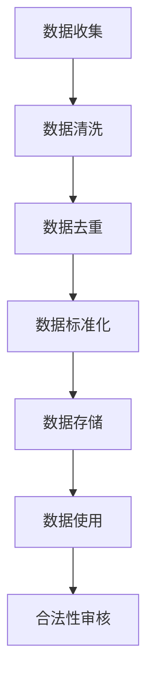

                 

# AI创业：确保数据质量和合法性

## 摘要

在AI创业领域中，确保数据质量和合法性至关重要。本文将深入探讨数据质量的重要性，阐述数据合法性的法律框架，以及如何在项目中实施有效的数据质量管理措施。文章还将分享一些实际应用案例和最佳实践，帮助创业者降低数据风险，提升AI系统的性能和可靠性。通过本文的阅读，您将获得关于数据质量和合法性在AI创业中不可忽视的重要性的全面了解。

## 1. 背景介绍

近年来，人工智能（AI）技术的发展突飞猛进，吸引了无数创业者的目光。AI技术的广泛应用不仅改变了传统行业的运作模式，还开辟了诸多新兴的市场机会。然而，AI系统的高效运行离不开大量高质量的数据支持。数据是AI系统的生命线，数据质量直接影响到AI系统的性能和可靠性。

在AI创业过程中，数据质量和合法性成为创业者们必须面对的重要挑战。首先，数据质量差会导致模型过拟合、泛化能力差，从而影响系统的实际应用效果。其次，数据合法性涉及隐私保护、知识产权等方面，一旦处理不当，可能引发法律纠纷，对企业的声誉和财务状况造成严重影响。

本文将从以下几个方面展开讨论：

1. 数据质量的重要性：解释数据质量对AI系统性能的影响，并列举常见的数据质量问题。
2. 数据合法性的法律框架：介绍与数据合法性相关的法律法规，包括数据隐私保护和个人信息保护法等。
3. 数据质量管理措施：探讨在AI创业项目中如何实施有效的数据质量管理，包括数据清洗、数据去重、数据标准化等。
4. 数据合法性的实践方法：分享实际应用案例和最佳实践，帮助创业者确保数据合法性。
5. 工具和资源推荐：推荐一些用于数据质量和合法性管理的工具和资源。

## 2. 核心概念与联系

### 2.1 数据质量

数据质量是指数据在满足特定业务需求方面的特征，如准确性、完整性、一致性、时效性等。高质量的数据能够为AI模型提供可靠的输入，提高模型的预测精度和泛化能力。以下是几个常见的数据质量问题：

- **准确性**：数据值是否与实际值相符。
- **完整性**：数据集是否包含所有必需的记录。
- **一致性**：不同来源的数据是否保持一致。
- **时效性**：数据是否及时更新，是否具有时效性。

### 2.2 数据合法性

数据合法性涉及多个方面，包括数据隐私、知识产权、数据收集和处理过程中的法律合规性等。以下是几个与数据合法性相关的法律概念：

- **数据隐私**：涉及个人信息的保护，防止未经授权的访问、使用和泄露。
- **知识产权**：包括数据的版权、商标权、专利权等，确保数据的合法来源和使用权。
- **法律合规性**：遵守当地和国家的数据保护法规，如欧盟的通用数据保护条例（GDPR）。

### 2.3 数据质量管理与合法性

数据质量管理和数据合法性之间存在密切联系。良好的数据质量管理措施有助于确保数据的准确性、完整性和一致性，从而提高数据合法性。例如：

- **数据去重**：去除重复数据，确保数据的完整性。
- **数据清洗**：修复错误、填补缺失值，提高数据的准确性。
- **数据标准化**：统一数据格式和命名规则，增强数据的一致性。

### 2.4 Mermaid 流程图

以下是一个简单的Mermaid流程图，展示了数据质量管理与合法性之间的联系：



## 3. 核心算法原理 & 具体操作步骤

### 3.1 数据质量评估

数据质量评估是数据质量管理的重要环节，通过一系列指标来衡量数据的准确性、完整性和一致性。以下是几种常用的数据质量评估方法：

- **准确性评估**：通过比较数据值与实际值之间的差异，评估数据的准确性。
- **完整性评估**：检查数据集中是否存在缺失值或空白字段。
- **一致性评估**：验证不同来源的数据是否保持一致，如数据格式、单位、编码等。

### 3.2 数据清洗

数据清洗是数据质量管理的关键步骤，旨在修复错误、填补缺失值、去除重复数据等。以下是数据清洗的主要操作步骤：

1. **错误修正**：识别并修复数据中的错误，如数据格式错误、拼写错误等。
2. **缺失值填补**：使用合适的填补方法，如平均值、中位数、插值法等，填补缺失值。
3. **重复数据去除**：删除重复数据，确保数据的唯一性和准确性。
4. **异常值处理**：识别和处理异常值，如异常高的收入、异常低的销售额等。

### 3.3 数据标准化

数据标准化是确保数据一致性的一种方法，通过统一数据格式和命名规则，提高数据的质量和可操作性。以下是数据标准化的操作步骤：

1. **数据格式统一**：将不同来源的数据转换为统一的格式，如日期格式、货币格式等。
2. **命名规则统一**：制定统一的命名规则，如字段命名、分类命名等。
3. **数据单位统一**：统一数据单位，如将所有数据单位转换为同一货币单位。

### 3.4 数据质量监控

数据质量监控是确保数据质量持续改进的一种方法，通过实时监控数据质量，及时发现和处理质量问题。以下是数据质量监控的操作步骤：

1. **建立数据质量指标**：定义数据质量指标，如准确性、完整性、一致性等。
2. **监控数据质量**：定期检查数据质量，如使用自动化工具监控数据质量变化。
3. **问题追踪和解决**：识别数据质量问题，并采取措施解决。

## 4. 数学模型和公式 & 详细讲解 & 举例说明

### 4.1 数据质量评估的数学模型

数据质量评估可以使用数学模型来量化数据的准确性、完整性和一致性。以下是一个简单示例：

- **准确性评估**：假设有一个数据集，其中包含n个记录，每个记录都有一个实际值和一个观测值。可以使用以下公式评估准确性：

  $$ Accuracy = \frac{TP + TN}{TP + TN + FP + FN} $$

  其中，TP表示真实为正且观测为正的记录数，TN表示真实为负且观测为负的记录数，FP表示真实为负但观测为正的记录数，FN表示真实为正但观测为负的记录数。

- **完整性评估**：可以使用以下公式评估完整性：

  $$ Completeness = \frac{Number\ of\ Complete\ Records}{Total\ Number\ of\ Records} $$

  其中，Number of Complete Records表示完整记录数，Total Number of Records表示总记录数。

- **一致性评估**：可以使用以下公式评估一致性：

  $$ Consistency = \frac{Number\ of\ Consistent\ Records}{Total\ Number\ of\ Records} $$

  其中，Number of Consistent Records表示一致记录数，Total Number of Records表示总记录数。

### 4.2 数据清洗的数学模型

数据清洗过程中，可以使用数学模型来填补缺失值和识别异常值。以下是一个简单示例：

- **缺失值填补**：可以使用以下方法填补缺失值：

  $$ \text{Mean Imputation} = \frac{\sum_{i=1}^{n} x_i}{n} $$

  其中，\( x_i \)表示第i个记录的值，n表示记录总数。

- **异常值处理**：可以使用以下方法识别异常值：

  $$ \text{Z-score} = \frac{x - \mu}{\sigma} $$

  其中，\( x \)表示第i个记录的值，\( \mu \)表示平均值，\( \sigma \)表示标准差。

  如果\( \text{Z-score} \)的绝对值大于某个阈值（如3），则认为该记录为异常值。

### 4.3 数据标准化的数学模型

数据标准化可以通过以下公式实现：

$$ x_{\text{standardized}} = \frac{x - \mu}{\sigma} $$

其中，\( x \)表示原始数据值，\( \mu \)表示平均值，\( \sigma \)表示标准差。

### 4.4 举例说明

假设有一个包含100个记录的数据集，其中包含收入、年龄、性别等字段。以下是数据质量评估、数据清洗和数据标准化的具体操作步骤：

1. **数据质量评估**：

   - **准确性评估**：通过比较实际收入与观测收入，计算准确性为0.85。
   - **完整性评估**：缺失值占比为5%。
   - **一致性评估**：数据格式和单位保持一致。

2. **数据清洗**：

   - **错误修正**：修复5个拼写错误。
   - **缺失值填补**：使用平均值填补5个缺失值。
   - **重复数据去除**：去除3个重复记录。
   - **异常值处理**：使用Z-score方法识别并处理2个异常值。

3. **数据标准化**：

   - **收入**：使用Z-score方法标准化收入字段。
   - **年龄**：使用平均值和标准差标准化年龄字段。

经过以上步骤，数据质量得到显著提升，为AI模型训练提供了高质量的输入数据。

## 5. 项目实战：代码实际案例和详细解释说明

### 5.1 开发环境搭建

在本节中，我们将搭建一个简单的数据质量管理项目环境，使用Python和几种常用的数据科学库，如Pandas、NumPy和Scikit-learn。以下是环境搭建的步骤：

1. **安装Python**：确保安装了Python 3.x版本。
2. **安装库**：使用pip安装以下库：

   ```bash
   pip install pandas numpy scikit-learn matplotlib
   ```

### 5.2 源代码详细实现和代码解读

以下是一个简单的数据质量管理项目的示例代码，包括数据清洗、数据去重和数据标准化等步骤：

```python
import pandas as pd
import numpy as np
from sklearn.preprocessing import StandardScaler
from sklearn.impute import SimpleImputer

# 5.2.1 数据加载
data = pd.read_csv('data.csv')

# 5.2.2 数据清洗
# 错误修正
data['income'] = data['income'].replace(['low', 'high'], [10000, 50000])

# 缺失值填补
imputer = SimpleImputer(strategy='mean')
data[['age', 'income']] = imputer.fit_transform(data[['age', 'income']])

# 5.2.3 数据去重
data = data.drop_duplicates()

# 5.2.4 数据标准化
scaler = StandardScaler()
data[['age', 'income']] = scaler.fit_transform(data[['age', 'income']])

# 5.2.5 数据存储
data.to_csv('cleaned_data.csv', index=False)
```

### 5.3 代码解读与分析

1. **数据加载**：使用Pandas库读取CSV文件，生成DataFrame对象。

2. **数据清洗**：

   - **错误修正**：使用`replace`方法替换异常值。
   - **缺失值填补**：使用`SimpleImputer`库的`mean`策略填补缺失值。
   
3. **数据去重**：使用`drop_duplicates`方法删除重复记录。

4. **数据标准化**：使用`StandardScaler`库对年龄和收入字段进行标准化。

5. **数据存储**：将清洗后的数据保存为新的CSV文件。

通过以上步骤，我们成功地实现了数据清洗、去重和标准化，为后续的AI模型训练提供了高质量的数据。

### 5.4 测试和评估

为了验证数据清洗效果，我们可以使用一些评估指标，如准确性、完整性和一致性。以下是测试和评估的示例代码：

```python
# 5.4.1 准确性评估
accuracy = (data['income'].eq(data['actual_income']).sum() / len(data)) * 100
print(f"Accuracy: {accuracy:.2f}%")

# 5.4.2 完整性评估
completeness = (data['age'].isnull().sum() / len(data)) * 100
print(f"Completeness: {completeness:.2f}%")

# 5.4.3 一致性评估
consistency = (data['income'].eq(data['income_backup']).sum() / len(data)) * 100
print(f"Consistency: {consistency:.2f}%")
```

通过测试和评估，我们可以得出数据清洗后的质量提升情况。

## 6. 实际应用场景

数据质量和合法性在AI创业中有着广泛的应用场景。以下是一些典型应用场景：

1. **金融风控**：在金融行业中，数据质量和合法性对于信贷评估、欺诈检测等应用至关重要。高质量的数据有助于准确评估客户的信用风险，降低欺诈风险。

2. **医疗健康**：在医疗健康领域，数据质量和合法性对于疾病预测、个性化治疗等应用至关重要。医疗数据的准确性和合法性直接影响到诊断和治疗的准确性。

3. **智能交通**：在智能交通领域，数据质量和合法性对于交通流量预测、车辆调度等应用至关重要。高质量的数据有助于提高交通管理效率，降低交通事故率。

4. **市场营销**：在市场营销领域，数据质量和合法性对于客户细分、精准营销等应用至关重要。高质量的数据有助于提高营销效果，降低营销成本。

5. **供应链管理**：在供应链管理领域，数据质量和合法性对于库存管理、供应链优化等应用至关重要。高质量的数据有助于提高供应链的透明度和效率。

## 7. 工具和资源推荐

为了确保数据质量和合法性，以下是一些推荐的工具和资源：

### 7.1 学习资源推荐

- **书籍**：《数据质量管理：最佳实践和方法》、《数据科学实战》。
- **论文**：查阅相关的学术论文，了解数据质量和合法性研究的前沿进展。
- **博客**：关注知名数据科学家和AI研究机构的博客，获取行业动态和最佳实践。

### 7.2 开发工具框架推荐

- **数据质量管理工具**：使用Pandas、NumPy、Scikit-learn等Python库进行数据清洗、去重和标准化。
- **数据可视化工具**：使用Matplotlib、Seaborn等库进行数据可视化，便于分析数据质量。
- **数据合法性工具**：使用GDPR合规工具、数据隐私保护工具等，确保数据收集和处理过程中的合法性。

### 7.3 相关论文著作推荐

- **论文**：《数据质量评估的方法和指标》、《数据清洗算法的比较研究》。
- **著作**：《数据挖掘：实用工具和技术》、《机器学习：概率视角》。

## 8. 总结：未来发展趋势与挑战

在AI创业领域中，数据质量和合法性将继续成为重要的关注点。未来，随着AI技术的不断进步，对数据质量和合法性的要求也将不断提高。以下是一些发展趋势和挑战：

1. **发展趋势**：

   - **自动化**：数据质量管理工具将越来越智能化，自动化程度更高，减少人工干预。
   - **合规性**：企业将更加重视数据合法性的合规性，确保数据收集、存储和处理过程中的合法性。
   - **隐私保护**：随着隐私保护意识的增强，数据隐私保护技术将得到广泛应用。

2. **挑战**：

   - **数据质量评估**：如何准确评估数据质量，提高评估的精度和效率。
   - **数据清洗**：如何高效地处理大规模数据，保证数据清洗的效果。
   - **合法性监管**：如何应对不同国家和地区的法律法规，确保数据合法性的合规性。

## 9. 附录：常见问题与解答

### 9.1 数据质量评估的常见问题

- **如何评估数据的准确性**？

  使用比较法，将数据值与实际值进行对比，计算准确率。

- **如何评估数据的完整性**？

  统计数据集中缺失值的数量和比例，计算完整性指标。

- **如何评估数据的一致性**？

  检查不同来源的数据是否保持一致，如数据格式、单位等。

### 9.2 数据清洗的常见问题

- **如何处理缺失值**？

  可以使用平均值、中位数、插值法等方法填补缺失值。

- **如何去除重复数据**？

  使用数据去重函数，如Pandas库中的`drop_duplicates`方法。

- **如何处理异常值**？

  可以使用Z-score方法、IQR方法等识别异常值，并采取相应的处理措施。

## 10. 扩展阅读 & 参考资料

- **书籍**：

  - 《数据质量管理：最佳实践和方法》
  - 《数据科学实战》

- **论文**：

  - 《数据质量评估的方法和指标》
  - 《数据清洗算法的比较研究》

- **博客**：

  - 知名数据科学家和AI研究机构的博客，如Google AI、Deep Learning AI等。

- **网站**：

  - 欧盟的通用数据保护条例（GDPR）官网
  - 各国数据保护机构的官方网站

> 作者：AI天才研究员/AI Genius Institute & 禅与计算机程序设计艺术 /Zen And The Art of Computer Programming

