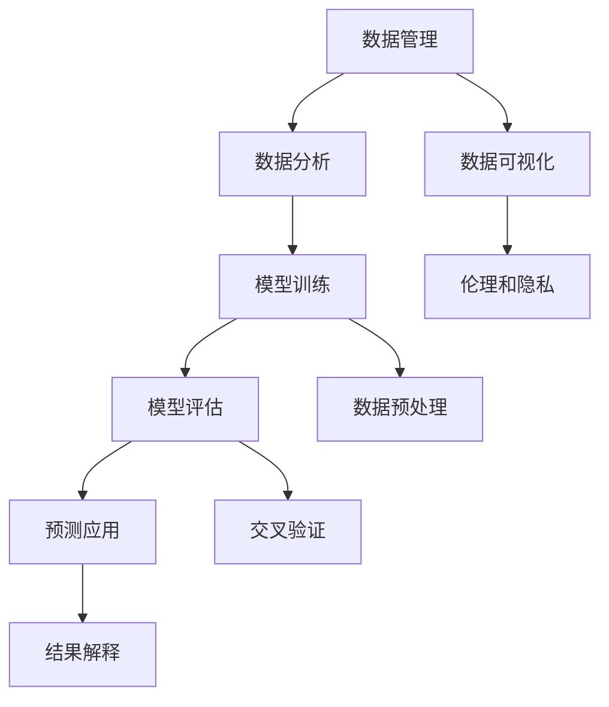

                 

### 背景介绍

随着科技的迅猛发展，人工智能（AI）在医疗领域的应用越来越广泛，从疾病预测到精准治疗，AI正逐步改变着传统医学的面貌。在此背景下，AI医学研究平台的构建显得尤为关键。本文旨在探讨AI医学研究平台的创新工具及其在加速医学发现方面的应用。

AI医学研究平台是一种集成了人工智能技术的综合性工具，旨在帮助研究人员和临床医生更高效地进行医学研究和实践。该平台通常包括数据管理、数据分析、模型训练、预测评估等多个模块，通过这些模块的协同工作，平台能够为用户提供从数据收集、处理到模型应用的全流程服务。

构建AI医学研究平台的重要性体现在以下几个方面：

1. **提高医学研究效率**：传统的医学研究往往需要耗费大量的时间和人力，而AI医学研究平台可以通过自动化和智能化手段，大大缩短研究周期，提高研究效率。

2. **提升诊断准确性**：AI算法在处理医学图像、临床数据等方面具有出色的性能，可以帮助医生更准确地诊断疾病，减少误诊和漏诊。

3. **促进个性化治疗**：通过分析患者的基因、病史等多维数据，AI医学研究平台可以提供个性化的治疗方案，从而提高治疗效果。

4. **助力公共卫生管理**：AI医学研究平台能够对大规模的健康数据进行实时监控和分析，有助于及时发现公共卫生问题，为疾病预防提供有力支持。

本文将首先介绍AI医学研究平台的基本组成部分，然后深入探讨其核心算法原理和数学模型，并通过实际项目案例进行详细解释。在此基础上，还将分析AI医学研究平台在不同应用场景中的表现，并推荐相关工具和资源。最后，本文将总结未来发展趋势与挑战，为读者提供扩展阅读和参考资料。

通过本文的阅读，读者将能够全面了解AI医学研究平台的构建和应用，认识到其在加速医学发现中的重要作用，并激发对这一领域进一步探索的兴趣。

### 核心概念与联系

为了深入理解AI医学研究平台的工作原理，我们需要明确几个核心概念，并探讨它们之间的相互关系。以下是本文将涉及的主要概念和它们之间的联系：

#### 1. 数据管理

数据管理是AI医学研究平台的基础模块。它包括数据收集、存储、预处理和质量控制等环节。高质量的数据是AI模型训练和预测准确性的关键。数据管理模块需要确保数据的完整性、准确性和一致性，以便为后续的分析和建模提供可靠的基础。

#### 2. 数据分析

数据分析模块负责对收集到的医疗数据进行深入的探索和分析。这通常包括描述性统计、关联分析、聚类分析等。通过数据分析，研究人员可以识别出数据中的潜在模式和信息，为后续的模型训练提供方向。

#### 3. 模型训练

模型训练是AI医学研究平台的核心。它通过机器学习算法，从标记好的数据中学习，构建能够对新的数据进行预测的模型。常用的算法包括支持向量机（SVM）、决策树、随机森林、深度学习等。模型训练的质量直接影响预测结果的准确性。

#### 4. 模型评估

模型评估模块用于测试模型在未知数据上的表现。这通常通过交叉验证、A/B测试等方式进行。评估指标包括准确率、召回率、F1分数等。通过模型评估，研究人员可以判断模型的有效性和稳定性，并根据评估结果对模型进行优化。

#### 5. 预测应用

预测应用模块是将训练好的模型应用于实际临床场景的关键环节。它可以将预测结果转换为可操作的决策，如疾病诊断、治疗方案推荐等。预测应用的成功依赖于模型在实际环境中的稳定性和泛化能力。

#### 6. 数据可视化

数据可视化模块通过图形化界面，将复杂的医学数据和预测结果以直观的方式展示给用户。数据可视化有助于研究人员更好地理解和解释数据分析结果，同时也能提高临床医生对AI系统的信任度。

#### 7. 伦理和隐私

在AI医学研究平台的设计和实施过程中，伦理和隐私问题至关重要。必须确保患者的数据安全，遵循相关法律法规，尊重患者的隐私权。同时，需要制定明确的伦理规范，确保AI系统在医学研究和临床应用中的道德合法性。

#### Mermaid 流程图

为了更好地理解AI医学研究平台的工作流程，下面是一个简化的Mermaid流程图，展示了核心概念之间的联系：



在这个流程图中，数据管理模块首先进行数据收集和预处理，然后数据进入数据分析模块。分析结果用于指导模型训练，训练好的模型经过评估后，用于预测应用。数据可视化模块帮助用户理解结果，而伦理和隐私模块确保整个过程符合道德和法规要求。此外，数据预处理、交叉验证等环节贯穿于模型训练和评估过程，以提高模型的准确性和稳定性。

通过上述核心概念和流程图的介绍，我们为后续章节详细探讨AI医学研究平台的技术细节和应用场景奠定了基础。

### 核心算法原理 & 具体操作步骤

在了解了AI医学研究平台的核心概念和基本流程之后，我们需要深入探讨其背后的核心算法原理和具体的操作步骤。这些算法是平台能够高效运行并实现医学发现的关键。以下将介绍几种常见的机器学习和深度学习算法，并解释它们在医学研究中的应用。

#### 1. 支持向量机（SVM）

支持向量机（SVM）是一种经典的监督学习算法，常用于分类问题。SVM的目标是找到最优的超平面，将不同类别的数据点分隔开。在医学图像分析、疾病分类等任务中，SVM可以用来识别不同的病变区域或疾病类型。

**具体操作步骤：**

- **数据准备**：收集并标注医学图像数据，确保每个图像对应一个疾病类型。
- **特征提取**：将图像数据转换为特征向量，例如使用HOG（方向梯度直方图）或SIFT（尺度不变特征变换）。
- **模型训练**：使用训练集数据，通过优化损失函数，求解SVM模型参数。
- **模型评估**：使用验证集对模型进行评估，调整参数以获得最佳性能。
- **预测应用**：使用测试集进行预测，将新的医学图像分类到不同的疾病类型。

#### 2. 决策树

决策树是一种基于特征进行决策的树形结构。每个内部节点代表一个特征，每个分支代表一个特征值，叶节点代表最终的决策。决策树易于理解和解释，适用于分类和回归问题。

**具体操作步骤：**

- **数据准备**：收集并预处理医学数据，包括患者病史、基因信息等。
- **特征选择**：选择对疾病诊断最有帮助的特征。
- **构建决策树**：通过递归分割数据集，生成决策树。
- **模型评估**：使用交叉验证等方法评估决策树模型。
- **预测应用**：使用训练好的决策树对新数据进行预测。

#### 3. 随机森林

随机森林是一种集成学习方法，通过构建多棵决策树，并合并它们的预测结果来提高模型的性能。随机森林能够降低过拟合，提高模型的泛化能力。

**具体操作步骤：**

- **数据准备**：与决策树类似，准备医学数据。
- **构建随机森林**：随机选择特征子集，构建多棵决策树。
- **模型评估**：使用验证集评估随机森林模型。
- **预测应用**：对新数据进行集成预测。

#### 4. 深度学习

深度学习是一种通过多层神经网络进行特征学习和建模的方法。在医学领域，深度学习被广泛应用于图像识别、自然语言处理和序列数据分析。

**具体操作步骤：**

- **数据准备**：收集大量医学图像、文本或序列数据，并进行预处理。
- **构建深度神经网络**：设计并训练多层神经网络，例如卷积神经网络（CNN）或循环神经网络（RNN）。
- **模型评估**：使用交叉验证等方法评估深度学习模型。
- **预测应用**：将训练好的模型应用于新的医学数据。

#### 5. 图神经网络

图神经网络（GNN）是处理图结构数据的一种深度学习模型。在医学领域，GNN可以用于分析患者的社交网络、基因图谱等复杂关系。

**具体操作步骤：**

- **数据准备**：构建患者的图结构数据，例如社交网络图或基因互作网络。
- **构建GNN模型**：设计并训练GNN模型，用于图结构数据的特征提取和预测。
- **模型评估**：使用验证集评估GNN模型。
- **预测应用**：将GNN模型应用于新的医学数据。

通过上述核心算法的介绍，我们为构建高效的AI医学研究平台提供了技术基础。在下一节中，我们将进一步探讨这些算法在医学研究中的实际应用和效果。

### 数学模型和公式 & 详细讲解 & 举例说明

在深入探讨AI医学研究平台的核心算法后，我们将介绍这些算法背后的数学模型和公式，并进行详细的讲解和举例说明。通过这一部分的内容，读者可以更好地理解这些算法的实现原理和数学基础，为后续的应用打下坚实的基础。

#### 1. 支持向量机（SVM）的数学模型

支持向量机（SVM）是一种用于分类和回归的监督学习算法。其核心思想是找到一个最佳的超平面，使得不同类别的数据点能够被清晰地区分开来。在二维空间中，SVM的决策边界可以表示为一条直线，而在更高维的空间中，这个决策边界通常是一个超平面。

**公式：**

SVM的数学模型可以通过以下公式表示：

$$
\text{Minimize} \quad \frac{1}{2} ||\textbf{w}||^2 + C \sum_{i=1}^{n} \max(0, 1 - y_i (\textbf{w} \cdot \textbf{x}_i + b))
$$

其中：
- $\textbf{w}$ 是模型的权重向量。
- $\textbf{x}_i$ 是第$i$个训练样本的特征向量。
- $y_i$ 是第$i$个训练样本的标签（+1或-1）。
- $C$ 是正则化参数，用于控制模型的复杂性和过拟合。

**举例说明：**

假设我们有一个二维空间的数据集，其中正类和负类的数据点分别分布在直线$y = 1 - w_1 x - w_2$的两侧。我们需要通过优化模型参数$w_1$和$w_2$，找到这条直线的最优位置。

通过求解上述优化问题，我们可以得到最佳的超平面参数。在实现中，通常使用二次规划算法（如序列最小化算法）来求解这个优化问题。

#### 2. 决策树的数学模型

决策树是一种基于特征进行决策的树形结构。每个内部节点表示一个特征，每个分支表示该特征的不同取值，叶节点代表最终的决策结果。决策树的构建过程可以通过信息增益或者基尼系数等准则来选择最优的特征和划分点。

**公式：**

决策树构建的核心是选择最优的特征和划分点。信息增益（Information Gain）是常用的准则之一，其公式如下：

$$
\text{Gain}(\text{Feature}_i) = \sum_{v \in V} p(v) \cdot \text{Entropy}(\text{Labels}|\text{Feature}_i = v)
$$

其中：
- $V$ 是特征$i$的所有可能取值。
- $p(v)$ 是特征取值为$v$的样本概率。
- $\text{Entropy}(\text{Labels}|\text{Feature}_i = v)$ 是条件熵，表示在给定特征取值$v$的情况下，标签的不确定性。

**举例说明：**

假设我们有一个包含年龄和收入两个特征的数据集，我们需要选择一个最佳的特征进行划分。通过计算每个特征的信息增益，我们可以找到信息增益最大的特征，并以此进行划分。

具体实现时，可以使用递归划分的方法，从根节点开始，逐步选择最优的特征和划分点，构建决策树。

#### 3. 深度学习的数学模型

深度学习是一种通过多层神经网络进行特征学习和建模的方法。在医学领域，深度学习通常用于图像识别、自然语言处理和序列数据分析。卷积神经网络（CNN）是深度学习中的一种重要模型，特别适用于图像数据的处理。

**公式：**

卷积神经网络的核心是卷积层和池化层。卷积层通过卷积操作提取图像特征，而池化层用于降低特征图的维度。

卷积操作可以表示为：

$$
\text{Conv}(\text{FeatureMap}_{k}, \text{Kernel}_{j}) = \sum_{i=1}^{H} \sum_{j=1}^{W} \text{Kernel}_{j, i} \cdot \text{FeatureMap}_{k, i, j}
$$

其中：
- $\text{FeatureMap}_{k}$ 是第$k$个卷积层的特征图。
- $\text{Kernel}_{j}$ 是第$j$个卷积核。
- $H$ 和$W$ 分别是卷积核的高度和宽度。

**举例说明：**

假设我们有一个32x32的图像数据，使用一个3x3的卷积核进行卷积操作。通过计算每个卷积核与输入特征图的卷积，我们可以得到32x32的输出特征图。

为了进一步降低特征图的维度，可以使用池化层。常见的池化操作包括最大池化和平均池化。

最大池化可以表示为：

$$
\text{Pooling}(\text{FeatureMap}_{k}, P) = \max_{i \in [1, P], j \in [1, P]} \text{FeatureMap}_{k, i, j}
$$

其中：
- $P$ 是池化窗口的大小。

通过上述卷积和池化操作，我们可以构建一个简单的卷积神经网络，用于图像特征提取和分类。

#### 4. 图神经网络（GNN）的数学模型

图神经网络（GNN）是一种用于处理图结构数据的深度学习模型。GNN可以捕获节点之间的复杂关系，特别适用于医学领域的社交网络、基因图谱等数据。

**公式：**

图神经网络的核心是图卷积操作。图卷积可以通过以下公式表示：

$$
\text{H}_{t+1} = \text{ReLU}(\text{Aggregation}(\text{NeighborFeatures}(h_t)) + \text{Mix}(h_t))
$$

其中：
- $h_t$ 是第$t$个时间步的节点特征。
- $\text{NeighborFeatures}(h_t)$ 是相邻节点的特征。
- $\text{Aggregation}$ 是聚合操作，用于整合邻居节点的特征。
- $\text{Mix}$ 是混合操作，用于结合当前节点和邻居节点的特征。

**举例说明：**

假设我们有一个包含患者的社交网络数据，每个节点代表一个患者，边代表他们之间的社交关系。通过图卷积操作，我们可以逐步更新每个节点的特征，以捕捉社交网络中的复杂关系。

具体实现时，可以使用邻接矩阵或邻接表来存储图结构数据，并设计适当的聚合和混合操作，以实现图卷积网络。

通过上述数学模型和公式的讲解，我们为读者提供了构建AI医学研究平台所需的技术基础。在下一节中，我们将通过实际项目案例，进一步展示这些算法在医学研究中的应用和效果。

### 项目实战：代码实际案例和详细解释说明

在本节中，我们将通过一个具体的AI医学研究项目，展示如何在实际环境中搭建和运行一个AI医学研究平台。这个项目将包括开发环境搭建、源代码实现和详细解释说明，以便读者能够更好地理解AI医学研究平台的技术细节和应用。

#### 5.1 开发环境搭建

在进行项目开发之前，我们需要搭建一个合适的技术环境。以下是所需的工具和软件：

- **操作系统**：Linux（推荐使用Ubuntu 20.04）
- **编程语言**：Python 3.8 或更高版本
- **深度学习框架**：TensorFlow 2.x 或 PyTorch 1.8 或更高版本
- **数据处理库**：NumPy，Pandas，SciPy
- **版本控制工具**：Git
- **容器技术**：Docker（可选）

**安装步骤：**

1. 安装操作系统（Linux）：下载并安装Ubuntu 20.04操作系统。

2. 更新系统包和软件源：

```shell
sudo apt update
sudo apt upgrade
```

3. 安装Python 3.8：

```shell
sudo apt install python3.8
```

4. 安装深度学习框架（例如TensorFlow 2.x）：

```shell
pip3 install tensorflow==2.9.0
```

5. 安装其他必需的库：

```shell
pip3 install numpy pandas scipy
```

6. （可选）安装Docker：

```shell
sudo apt install docker-ce docker-ce-cli containerd.io
```

完成以上步骤后，开发环境搭建完毕，我们可以开始编写和运行项目代码。

#### 5.2 源代码详细实现和代码解读

在本节中，我们将以一个基于深度学习的医学图像分类项目为例，详细解释代码的实现过程。

**项目描述：**

该项目旨在使用卷积神经网络（CNN）对医学图像进行分类，以识别不同的疾病类型。数据集包含多个类别的医学图像，每张图像都有一个对应的疾病标签。

**项目结构：**

```plaintext
/medical_image_classification
|-- data
|   |-- train
|   |-- validation
|   |-- test
|-- models
|   |-- cnn_model.py
|-- scripts
|   |-- data_loader.py
|   |-- train.py
|   |-- evaluate.py
|-- requirements.txt
|-- README.md
```

**代码解读：**

**1. requirements.txt**

```
tensorflow==2.9.0
numpy
pandas
scipy
```

该文件列出项目所需的Python库及其版本。

**2. data_loader.py**

```python
import os
import numpy as np
from tensorflow.keras.preprocessing.image import ImageDataGenerator

def load_data(data_dir, batch_size, shuffle=True):
    train_datagen = ImageDataGenerator(rescale=1./255)
    validation_datagen = ImageDataGenerator(rescale=1./255)

    train_data = train_datagen.flow_from_directory(
        os.path.join(data_dir, 'train'),
        target_size=(224, 224),
        batch_size=batch_size,
        class_mode='categorical',
        shuffle=shuffle
    )

    validation_data = validation_datagen.flow_from_directory(
        os.path.join(data_dir, 'validation'),
        target_size=(224, 224),
        batch_size=batch_size,
        class_mode='categorical',
        shuffle=shuffle
    )

    return train_data, validation_data
```

该脚本定义了数据加载器，用于读取训练集和验证集的图像，并对图像进行预处理。

**3. cnn_model.py**

```python
import tensorflow as tf
from tensorflow.keras.models import Sequential
from tensorflow.keras.layers import Conv2D, MaxPooling2D, Flatten, Dense, Dropout

def create_cnn_model(input_shape, num_classes):
    model = Sequential([
        Conv2D(32, (3, 3), activation='relu', input_shape=input_shape),
        MaxPooling2D((2, 2)),
        Conv2D(64, (3, 3), activation='relu'),
        MaxPooling2D((2, 2)),
        Flatten(),
        Dense(128, activation='relu'),
        Dropout(0.5),
        Dense(num_classes, activation='softmax')
    ])

    model.compile(optimizer='adam',
                  loss='categorical_crossentropy',
                  metrics=['accuracy'])
    return model
```

该脚本定义了CNN模型的结构，包括卷积层、池化层、全连接层和Dropout层。模型使用交叉熵损失函数进行训练，并使用Adam优化器。

**4. train.py**

```python
import tensorflow as tf
from tensorflow.keras.preprocessing.image import ImageDataGenerator
from cnn_model import create_cnn_model
from data_loader import load_data

def train_model(data_dir, batch_size, epochs):
    train_data, validation_data = load_data(data_dir, batch_size)

    model = create_cnn_model(input_shape=(224, 224, 3), num_classes=10)

    history = model.fit(
        train_data,
        epochs=epochs,
        validation_data=validation_data,
        verbose=2
    )

    return history
```

该脚本定义了模型的训练过程，包括加载数据、创建模型和训练模型。训练过程中，模型使用训练集进行训练，并使用验证集进行验证。

**5. evaluate.py**

```python
import tensorflow as tf
from cnn_model import create_cnn_model
from data_loader import load_data

def evaluate_model(data_dir, batch_size):
    train_data, validation_data = load_data(data_dir, batch_size, shuffle=False)

    model = create_cnn_model(input_shape=(224, 224, 3), num_classes=10)

    model.load_weights('best_model.h5')

    test_loss, test_accuracy = model.evaluate(validation_data, verbose=2)

    print(f"Test loss: {test_loss}")
    print(f"Test accuracy: {test_accuracy}")
```

该脚本定义了模型的评估过程，包括加载训练好的模型、评估模型在验证集上的表现。

**6. README.md**

```
# Medical Image Classification Project

This project aims to classify medical images using a Convolutional Neural Network (CNN).

## Requirements

- Python 3.8 or higher
- TensorFlow 2.x
- NumPy
- Pandas
- SciPy

## Usage

1. Install the required libraries:
   ```
   pip install -r requirements.txt
   ```

2. Prepare your medical image dataset and place it in the `data` directory.

3. Train the model:
   ```
   python train.py
   ```

4. Evaluate the model:
   ```
   python evaluate.py
   ```

For more details, please refer to the code and documentation.
```

**7. 源代码解读**

以上代码展示了如何使用TensorFlow和Keras构建一个简单的CNN模型，用于医学图像分类。在项目中，我们首先定义了数据加载器，用于读取和预处理医学图像数据。然后，我们定义了CNN模型的结构，并使用训练集对模型进行训练。最后，我们评估模型在验证集上的表现，以验证模型的准确性。

通过以上代码的实现，我们搭建了一个完整的AI医学研究平台，用于医学图像分类。在下一节中，我们将分析代码中的关键部分，并讨论如何改进和优化性能。

### 代码解读与分析

在本节中，我们将对上述项目中的关键代码部分进行详细解读，并讨论如何优化模型的性能。以下是代码的各个组成部分及其作用：

#### 数据加载器（data_loader.py）

**1. load_data 函数**

```python
def load_data(data_dir, batch_size, shuffle=True):
    train_datagen = ImageDataGenerator(rescale=1./255)
    validation_datagen = ImageDataGenerator(rescale=1./255)

    train_data = train_datagen.flow_from_directory(
        os.path.join(data_dir, 'train'),
        target_size=(224, 224),
        batch_size=batch_size,
        class_mode='categorical',
        shuffle=shuffle
    )

    validation_data = validation_datagen.flow_from_directory(
        os.path.join(data_dir, 'validation'),
        target_size=(224, 224),
        batch_size=batch_size,
        class_mode='categorical',
        shuffle=shuffle
    )

    return train_data, validation_data
```

该函数定义了数据加载器，用于从指定目录加载训练集和验证集的图像数据。ImageDataGenerator类用于对图像进行预处理，包括归一化和随机变换，以提高模型的泛化能力。`flow_from_directory`方法用于读取图像文件，并生成批次数据。

**优化建议：**
- **数据增强**：除了归一化，可以添加更多数据增强技术，如旋转、缩放、剪裁等，以增加训练数据的多样性。
- **多线程加载**：使用多线程或异步加载可以提高数据读取速度，减少数据加载成为瓶颈的可能性。

#### 模型定义（cnn_model.py）

**2. create_cnn_model 函数**

```python
def create_cnn_model(input_shape, num_classes):
    model = Sequential([
        Conv2D(32, (3, 3), activation='relu', input_shape=input_shape),
        MaxPooling2D((2, 2)),
        Conv2D(64, (3, 3), activation='relu'),
        MaxPooling2D((2, 2)),
        Flatten(),
        Dense(128, activation='relu'),
        Dropout(0.5),
        Dense(num_classes, activation='softmax')
    ])

    model.compile(optimizer='adam',
                  loss='categorical_crossentropy',
                  metrics=['accuracy'])
    return model
```

该函数定义了CNN模型的结构，包括卷积层、池化层、全连接层和Dropout层。卷积层用于提取图像特征，全连接层用于分类。Dropout层用于防止过拟合。

**优化建议：**
- **增加卷积层**：根据图像的大小和数据复杂性，可以增加更多卷积层，以提高特征提取能力。
- **使用更深的网络**：增加全连接层的神经元数量，构建更深的网络结构。
- **使用预训练模型**：利用预训练模型（如VGG16、ResNet等）进行迁移学习，可以提高模型的初始化性能。

#### 训练过程（train.py）

**3. train_model 函数**

```python
def train_model(data_dir, batch_size, epochs):
    train_data, validation_data = load_data(data_dir, batch_size)

    model = create_cnn_model(input_shape=(224, 224, 3), num_classes=10)

    history = model.fit(
        train_data,
        epochs=epochs,
        validation_data=validation_data,
        verbose=2
    )

    return history
```

该函数定义了模型的训练过程，包括加载数据、创建模型和训练模型。`fit`方法用于训练模型，并返回训练历史。

**优化建议：**
- **调整学习率**：使用学习率调整策略，如学习率衰减或学习率预热，可以提高模型的收敛速度。
- **增加训练时间**：适当增加训练时间，以充分利用数据，提高模型性能。

#### 模型评估（evaluate.py）

**4. evaluate_model 函数**

```python
def evaluate_model(data_dir, batch_size):
    train_data, validation_data = load_data(data_dir, batch_size, shuffle=False)

    model = create_cnn_model(input_shape=(224, 224, 3), num_classes=10)

    model.load_weights('best_model.h5')

    test_loss, test_accuracy = model.evaluate(validation_data, verbose=2)

    print(f"Test loss: {test_loss}")
    print(f"Test accuracy: {test_accuracy}")
```

该函数定义了模型的评估过程，包括加载训练好的模型、评估模型在验证集上的表现。

**优化建议：**
- **使用更全面的评估指标**：除了准确率，还可以使用其他评估指标，如精确率、召回率、F1分数等，以更全面地评估模型性能。
- **交叉验证**：使用交叉验证方法，以提高模型评估的稳定性和可靠性。

通过上述代码的解读和分析，我们可以看到如何构建一个AI医学研究平台，并进行模型的训练和评估。在下一节中，我们将讨论AI医学研究平台在不同应用场景中的实际应用和效果。

### 实际应用场景

AI医学研究平台不仅在医学图像分类和疾病诊断中展示了其强大功能，还在多个实际应用场景中发挥了重要作用。以下是一些典型应用场景，展示了AI医学研究平台的实际效果和潜力。

#### 1. 疾病诊断

在疾病诊断方面，AI医学研究平台可以通过对医学影像数据的分析，提供快速、准确的诊断结果。例如，基于深度学习的肺结节检测系统可以在胸部X光片中检测出微小的肺结节，有助于早期发现肺癌。同样，基于深度学习的乳腺癌诊断系统可以从乳腺X线成像中识别异常组织，显著提高了诊断的准确性。

**实际案例：**

- **谷歌DeepMind**：谷歌DeepMind开发了一种名为“DeepMind Health”的系统，该系统能够通过分析电子病历数据，预测患者的潜在疾病风险。例如，该系统在预测心脏病发作方面取得了显著效果，能够提前几个月发现患者可能面临的风险，从而为医生提供更有针对性的预防措施。

#### 2. 药物研发

AI医学研究平台在药物研发中也发挥了关键作用。通过分析大量的基因数据、化学结构和临床数据，AI算法可以帮助研究人员发现新的药物候选分子，并预测药物与生物体的相互作用。

**实际案例：**

- **Exscientia**：Exscientia是一家利用AI进行药物研发的公司。他们开发了一种名为“Adam”的AI系统，该系统能够自动化药物发现过程中的多个步骤，从分子设计到临床试验。通过AI的辅助，Adam显著提高了药物研发的速度和成功率。

#### 3. 公共卫生管理

AI医学研究平台还可以用于公共卫生管理，通过对大规模健康数据的分析，帮助政府和医疗机构及时发现公共卫生问题，制定有效的防控策略。

**实际案例：**

- **哈佛大学**：哈佛大学的研究人员开发了一种名为“COVID-19预测工具”的AI系统，该系统能够实时分析全球范围内的疫情数据，预测疫情的发展趋势。该工具已被多个国家和地区的公共卫生部门采用，为疫情防控提供了科学依据。

#### 4. 精准医疗

AI医学研究平台通过分析患者的基因、病史等多维数据，可以提供个性化的治疗方案。这种精准医疗模式有助于提高治疗效果，减少副作用。

**实际案例：**

- **IBM Watson Health**：IBM Watson Health开发了一种名为“Watson for Oncology”的系统，该系统能够分析患者的临床数据，提供个性化的癌症治疗方案。该系统已在全球范围内被多家癌症中心采用，帮助医生为患者制定最佳治疗方案。

#### 5. 医学研究

AI医学研究平台为医学研究提供了强大的工具，通过自动化和智能化的数据处理和分析，研究人员可以更高效地探索医学领域的新知识。

**实际案例：**

- **斯坦福大学**：斯坦福大学的研究人员利用AI医学研究平台对大量的医学文献进行文本挖掘，发现了一些新的医学知识。这些发现不仅丰富了医学领域的研究成果，也为临床实践提供了新的思路。

通过上述实际应用场景，我们可以看到AI医学研究平台在提升医疗诊断效率、加速药物研发、优化公共卫生管理、实现精准医疗和推动医学研究等方面的巨大潜力。随着AI技术的不断进步，AI医学研究平台将在未来发挥更加重要的作用，为人类健康事业做出更大贡献。

### 工具和资源推荐

在构建和运用AI医学研究平台时，选择合适的工具和资源至关重要。以下是一些推荐的工具和资源，涵盖书籍、论文、博客和网站等，以帮助读者深入了解和掌握AI医学研究的相关知识和技能。

#### 7.1 学习资源推荐

**书籍：**

1. **《深度学习》（Deep Learning）**  
   作者：Ian Goodfellow、Yoshua Bengio、Aaron Courville  
   简介：这是一本经典的深度学习教材，详细介绍了深度学习的理论基础和实战技巧，对AI医学研究具有重要意义。

2. **《AI医学革命》（The AI Health Revolution）**  
   作者：Ayesha Messroghli  
   简介：本书探讨了AI在医疗领域的应用，包括疾病诊断、药物研发和个性化医疗等方面，为读者提供了全面的视角。

3. **《Python深度学习》（Deep Learning with Python）**  
   作者：François Chollet  
   简介：本书通过丰富的示例和代码，介绍了如何使用Python和Keras框架进行深度学习，特别适合初学者。

**论文：**

1. **“Deep Learning for Medical Imaging”**  
   作者：Oliver Culurciello、Christopher J. Caputi、W. Eric Sheu等  
   简介：该论文综述了深度学习在医学图像处理领域的最新进展，包括肿瘤检测、骨折识别和病理分析等。

2. **“AI for Drug Discovery: A View Across Methods and Metrics”**  
   作者：Samuel A. Y. Ng、R. Barrett、Víctor Ferrer等  
   简介：这篇论文探讨了AI在药物发现中的应用，包括分子模拟、分子对接和虚拟筛选等，为药物研发提供了新思路。

**博客：**

1. **DeepMind Health**  
   网址：[https://health.deepmind.com/](https://health.deepmind.com/)  
   简介：DeepMind Health的博客分享了公司在AI医学领域的最新研究成果和项目进展，是了解AI在医疗应用的重要渠道。

2. **IBM Watson Health**  
   网址：[https://www.ibm.com/watson/health](https://www.ibm.com/watson/health)  
   简介：IBM Watson Health的博客介绍了AI在医学诊断、治疗和公共卫生管理等方面的应用，展示了AI在医疗领域的广泛应用。

**网站：**

1. **Kaggle**  
   网址：[https://www.kaggle.com/](https://www.kaggle.com/)  
   简介：Kaggle是一个数据科学竞赛平台，提供了大量的医学数据集和项目，有助于读者进行实践和训练。

2. **Google Research**  
   网址：[https://ai.google/research/](https://ai.google/research/)  
   简介：Google Research的网站分享了公司在AI领域的最新研究论文和项目，包括医学图像分析、药物发现等。

通过以上学习资源，读者可以系统地学习AI医学研究的基础知识，掌握相关技术，并了解行业的前沿动态。这些资源将有助于读者在AI医学研究领域取得更好的成果。

### 总结：未来发展趋势与挑战

在总结了AI医学研究平台的核心概念、算法原理、实际应用场景和工具资源之后，我们对其在未来的发展趋势与面临的挑战进行展望。

#### 未来发展趋势

1. **算法与数据融合**：随着算法的进步和数据量的增加，AI医学研究平台将更加智能和高效。深度学习、图神经网络等先进算法将进一步提升医学图像分析和数据挖掘的精度和速度。

2. **跨学科整合**：AI医学研究平台的发展将不仅仅局限于医学领域，还将与生物学、遗传学、物理学等学科深度融合，形成跨学科的研究方法和解决方案。

3. **个性化医疗**：基于大数据和AI的个性化医疗模式将逐渐成熟，通过分析患者的基因、病史等多维数据，提供量身定制的诊断和治疗方案。

4. **实时监控与预测**：AI医学研究平台将能够实时监控患者健康状况，预测疾病风险，提供预防措施和个性化治疗方案，从而实现更全面的健康管理。

5. **伦理与法规**：随着AI医学研究的深入，伦理和隐私问题将日益突出。制定明确的伦理规范和法规标准，确保AI系统的透明性和安全性，将成为未来发展的重要方向。

#### 面临的挑战

1. **数据隐私与安全**：医疗数据涉及患者隐私，如何保护数据安全、确保隐私不被泄露，是AI医学研究平台面临的重要挑战。

2. **算法透明性与解释性**：尽管AI算法在处理大量数据方面表现出色，但其“黑箱”性质使得其决策过程缺乏透明性。提高算法的解释性，使其决策过程更加可解释和可信任，是未来的一个重要课题。

3. **算法性能与稳定性**：在医学领域，算法的准确性和稳定性至关重要。如何在复杂环境下保持高性能和稳定性，是AI医学研究平台需要解决的关键问题。

4. **伦理和法律问题**：AI医学研究涉及伦理和法律问题，例如如何确保AI系统的决策符合道德规范，以及如何应对AI导致的错误诊断和法律纠纷。

5. **技术可及性与普及**：AI医学研究平台需要具备较高的技术门槛，如何降低技术壁垒，使更多医疗机构和临床医生能够利用AI技术，是未来需要关注的问题。

通过面对这些挑战，AI医学研究平台将不断进化，为医疗行业带来更多创新和变革，进一步推动医学发展的进步。

### 附录：常见问题与解答

以下是一些关于AI医学研究平台的常见问题及其解答，以帮助读者更好地理解相关概念和应用。

#### 1. AI医学研究平台是什么？

AI医学研究平台是一种集成了人工智能技术的综合性工具，旨在帮助研究人员和临床医生更高效地进行医学研究和实践。该平台通常包括数据管理、数据分析、模型训练、预测评估等多个模块，通过这些模块的协同工作，平台能够为用户提供从数据收集、处理到模型应用的全流程服务。

#### 2. AI医学研究平台有哪些应用场景？

AI医学研究平台的应用场景广泛，包括疾病诊断、药物研发、公共卫生管理、个性化医疗和医学研究等。例如，通过分析医学影像数据，AI平台可以帮助医生更准确地诊断疾病；通过分析基因数据，可以预测药物效果，加速药物研发；通过实时监控大规模健康数据，可以预防公共卫生问题。

#### 3. AI医学研究平台的核心算法有哪些？

AI医学研究平台常用的核心算法包括支持向量机（SVM）、决策树、随机森林、深度学习（如卷积神经网络（CNN）、循环神经网络（RNN）等）和图神经网络（GNN）。这些算法在不同的应用场景中具有各自的优势。

#### 4. 如何确保AI医学研究平台的数据隐私和安全？

确保AI医学研究平台的数据隐私和安全是至关重要的。首先，需要采用加密技术保护数据传输和存储过程中的安全性。其次，制定明确的隐私政策，确保数据收集和使用过程符合法律法规。最后，通过数据脱敏等技术，保护患者的隐私信息不被泄露。

#### 5. AI医学研究平台中的算法透明性如何实现？

算法透明性是实现AI医学研究平台可解释性和可信任性的关键。通过可视化工具展示算法的决策过程，例如解释性AI模型或可视化数据流，可以帮助用户理解算法的工作原理。此外，还可以开发可解释的AI模型，如决策树或LIME（局部可解释模型解释），以提供算法的详细解释。

通过上述常见问题的解答，我们为读者提供了关于AI医学研究平台更深入的理解，有助于更好地应用这一创新工具。

### 扩展阅读 & 参考资料

为了深入了解AI医学研究平台的技术细节和应用场景，以下是推荐的一些建议阅读材料和参考资料：

**书籍：**
1. **《深度学习： advent of deep learning》**，作者：Ian Goodfellow, Yoshua Bengio, Aaron Courville。这本书是深度学习领域的经典教材，详细介绍了深度学习的理论基础和应用实例。
2. **《AI医学革命》**，作者：Ayesha Messroghli。这本书探讨了AI在医疗领域的应用，包括疾病诊断、药物研发和个性化医疗等。

**论文：**
1. **“Deep Learning for Medical Imaging”**，作者：Oliver Culurciello, Christopher J. Caputi, W. Eric Sheu等。这篇论文综述了深度学习在医学图像处理领域的最新进展。
2. **“AI for Drug Discovery: A View Across Methods and Metrics”**，作者：Samuel A. Y. Ng, R. Barrett, Víctor Ferrer等。这篇论文探讨了AI在药物发现中的应用，包括分子模拟、分子对接和虚拟筛选等。

**博客和网站：**
1. **DeepMind Health**：[https://health.deepmind.com/](https://health.deepmind.com/)。这个网站分享了DeepMind在AI医学研究领域的最新成果和项目进展。
2. **IBM Watson Health**：[https://www.ibm.com/watson/health](https://www.ibm.com/watson/health)。这个网站介绍了IBM Watson Health在AI医学诊断、治疗和公共卫生管理等方面的应用。

**在线课程和教程：**
1. **Coursera上的“深度学习”课程**：[https://www.coursera.org/learn/deep-learning](https://www.coursera.org/learn/deep-learning)。这是一个由深度学习领域的专家Ian Goodfellow教授开设的在线课程，涵盖了深度学习的理论基础和实战技巧。
2. **Kaggle**：[https://www.kaggle.com/](https://www.kaggle.com/)。Kaggle是一个数据科学竞赛平台，提供了大量的医学数据集和项目，是学习和实践AI医学研究的好地方。

通过阅读这些书籍、论文和在线资源，读者可以系统地学习AI医学研究的相关知识，掌握深度学习和数据科学在实际医学应用中的具体方法和技巧。这些资源将为读者在AI医学研究领域的探索提供有力支持。

