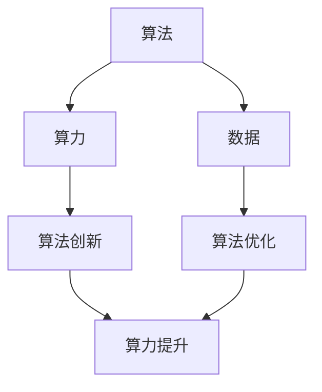

                 

# AI发展的三匹马：算法、算力与数据

> **关键词**：人工智能、算法、算力、数据、发展、技术、未来、挑战

> **摘要**：本文深入探讨了人工智能（AI）发展的三个关键驱动力：算法、算力和数据。通过对这些核心要素的剖析，文章梳理了它们在AI技术发展中的相互关系，并展望了未来的发展趋势与挑战。从算法的创新到算力的提升，再到数据的积累，本文旨在为读者提供一幅全面、清晰的AI发展蓝图。

## 1. 背景介绍

人工智能（Artificial Intelligence，简称AI）自20世纪50年代诞生以来，经历了多个阶段的发展。从最初的符号主义和逻辑推理，到基于规则的专家系统，再到基于概率和统计的机器学习，AI技术逐渐从理论研究走向了实际应用。如今，AI已经深入到我们生活的方方面面，从智能助手、自动驾驶到医疗诊断、金融分析，AI技术的应用场景日益广泛。

然而，AI的发展并非一蹴而就。在这背后，有三个核心要素起到了至关重要的作用，它们就像是三匹马，共同推动着AI的前进：算法、算力和数据。算法是AI的灵魂，它决定了AI能够解决哪些问题；算力是AI的引擎，它决定了AI的运行速度和效率；数据是AI的粮食，它为AI提供了训练和学习的素材。本文将分别探讨这三个要素，并分析它们在AI发展中的相互关系。

## 2. 核心概念与联系

### 2.1 算法

算法（Algorithm）是解决特定问题的一系列清晰指令。在AI领域，算法是构建AI系统的核心。不同类型的算法适用于解决不同类型的问题。例如，深度学习算法在图像识别和自然语言处理方面表现出色，而强化学习算法在决策和规划任务中具有优势。

### 2.2 算力

算力（Computing Power）是指计算机系统的处理能力和计算速度。随着计算能力的提升，AI算法能够处理更复杂的数据，并在更短的时间内完成计算。算力的提升主要依赖于硬件技术的发展，如CPU、GPU和TPU等。

### 2.3 数据

数据（Data）是AI算法训练和学习的素材。大量、高质量的数据能够帮助AI模型更好地理解和模拟现实世界。数据的类型多样，包括结构化数据（如数据库中的数据）、半结构化数据（如日志文件）和非结构化数据（如文本和图像）。

### 2.4 相互关系

算法、算力和数据之间存在着密切的相互关系。算法需要依赖算力来执行计算，而算力的提升又推动了算法的创新。同时，数据是算法训练和优化的基础，高质量的数据能够显著提升算法的性能。反之，算法和算力的提升也为数据的有效处理提供了支持。

### 2.5 Mermaid 流程图



## 3. 核心算法原理 & 具体操作步骤

### 3.1 深度学习算法

深度学习算法是当前AI领域最为重要的算法之一。它通过模拟人脑神经元网络的结构和功能，实现对数据的自动学习和建模。深度学习算法主要包括以下步骤：

1. **数据预处理**：对数据进行清洗、归一化等处理，使其符合模型的输入要求。
2. **网络构建**：定义神经网络的结构，包括层数、神经元数量和激活函数等。
3. **训练**：使用大量训练数据对神经网络进行训练，优化模型参数。
4. **评估**：使用验证数据对模型进行评估，调整模型参数以获得最佳性能。
5. **部署**：将训练好的模型部署到实际应用中，进行预测和决策。

### 3.2 强化学习算法

强化学习算法通过模拟智能体在环境中的互动过程，实现决策和规划的优化。强化学习算法主要包括以下步骤：

1. **环境建模**：定义智能体所处的环境，包括状态空间、动作空间和奖励机制。
2. **策略选择**：设计智能体的策略，以最大化长期奖励。
3. **学习过程**：通过与环境互动，不断调整策略以实现最佳决策。
4. **评估与优化**：评估智能体的决策效果，并根据评估结果优化策略。

### 3.3 自然语言处理算法

自然语言处理（NLP）算法主要用于理解和生成自然语言。NLP算法主要包括以下步骤：

1. **文本预处理**：对文本数据进行清洗、分词、词性标注等处理。
2. **特征提取**：从预处理后的文本数据中提取特征，如词向量、TF-IDF等。
3. **模型训练**：使用特征数据对NLP模型进行训练。
4. **文本生成与理解**：使用训练好的模型对文本进行生成和理解。

## 4. 数学模型和公式 & 详细讲解 & 举例说明

### 4.1 深度学习算法

深度学习算法的核心是多层神经网络。以下是一个简单的多层神经网络模型：

$$
\begin{aligned}
    z_{l}^{[i]} &= \sigma(W_{l}^{[i]} \cdot a_{l-1}^{[i]} + b_{l}^{[i]}), \\
    a_{l}^{[i]} &= \sigma(z_{l}^{[i]}),
\end{aligned}
$$

其中，$a_{l}^{[i]}$表示第$l$层的第$i$个神经元的激活值，$z_{l}^{[i]}$表示第$l$层的第$i$个神经元的输入值，$\sigma$表示激活函数，$W_{l}^{[i]}$和$b_{l}^{[i]}$分别为第$l$层的权重和偏置。

举例来说，假设我们有一个简单的二元分类问题，可以使用以下公式进行计算：

$$
\begin{aligned}
    z_{2}^{[i]} &= \sigma(W_{2}^{[i]} \cdot a_{1}^{[i]} + b_{2}^{[i]}), \\
    a_{2}^{[i]} &= \sigma(z_{2}^{[i]}), \\
    \hat{y}_{i} &= \sigma(W_{3}^{[i]} \cdot a_{2}^{[i]} + b_{3}^{[i]}).
\end{aligned}
$$

其中，$\hat{y}_{i}$表示第$i$个样本的预测标签，$a_{2}^{[i]}$和$z_{2}^{[i]}$分别表示第二层的激活值和输入值。

### 4.2 强化学习算法

强化学习算法的核心是策略迭代。以下是一个简单的策略迭代过程：

$$
\begin{aligned}
    \pi_{t+1}(a|s) &= \pi_{t}(a|s) + \alpha \cdot \Delta \pi_{t}(a|s), \\
    \Delta \pi_{t}(a|s) &= \frac{\partial}{\partial \theta} J(\theta),
\end{aligned}
$$

其中，$\pi_{t+1}(a|s)$表示第$t+1$时刻的策略，$\pi_{t}(a|s)$表示第$t$时刻的策略，$\alpha$为学习率，$J(\theta)$为损失函数。

举例来说，假设我们有一个简单的Q-learning算法，可以使用以下公式进行计算：

$$
\begin{aligned}
    Q_{t+1}(s_{t+1}, a_{t+1}) &= Q_{t}(s_{t+1}, a_{t+1}) + \alpha \cdot (r_{t+1} + \gamma \cdot \max_{a'} Q_{t}(s_{t+1}, a')), \\
    \Delta \pi_{t}(a_{t+1}|s_{t+1}) &= \frac{\partial}{\partial \theta} J(\theta).
\end{aligned}
$$

其中，$Q_{t+1}(s_{t+1}, a_{t+1})$表示第$t+1$时刻的状态-动作值，$r_{t+1}$为立即奖励，$\gamma$为折扣因子，$\theta$为模型参数。

### 4.3 自然语言处理算法

自然语言处理算法的核心是词向量表示。以下是一个简单的词向量计算过程：

$$
\begin{aligned}
    \mathbf{v}_{w} &= \frac{\sum_{i=1}^{n} \mathbf{e}_{i} \cdot \mathbf{w}_{i}}{n},
\end{aligned}
$$

其中，$\mathbf{v}_{w}$表示词向量，$\mathbf{e}_{i}$表示第$i$个特征向量，$\mathbf{w}_{i}$表示第$i$个特征的权重，$n$为特征数量。

举例来说，假设我们有一个简单的词袋模型，可以使用以下公式进行计算：

$$
\begin{aligned}
    \mathbf{v}_{word} &= \frac{\mathbf{w}_{1} + \mathbf{w}_{2} + \mathbf{w}_{3}}{3}.
\end{aligned}
$$

其中，$\mathbf{v}_{word}$表示单词“word”的词向量，$\mathbf{w}_{1}$、$\mathbf{w}_{2}$和$\mathbf{w}_{3}$分别表示三个特征向量的权重。

## 5. 项目实战：代码实际案例和详细解释说明

### 5.1 开发环境搭建

在开始项目实战之前，我们需要搭建一个适合AI开发的编程环境。以下是一个简单的Python开发环境搭建步骤：

1. **安装Python**：在官方网站下载并安装Python 3.x版本。
2. **安装Jupyter Notebook**：使用pip命令安装Jupyter Notebook。
3. **安装TensorFlow**：使用pip命令安装TensorFlow。

### 5.2 源代码详细实现和代码解读

以下是一个简单的深度学习分类任务的代码实现，我们将使用TensorFlow库来构建一个多层感知机模型。

```python
import tensorflow as tf
from tensorflow.keras import layers

# 数据预处理
def preprocess_data(data):
    # 数据清洗、归一化等处理
    return data

# 构建模型
def build_model(input_shape):
    model = tf.keras.Sequential([
        layers.Dense(128, activation='relu', input_shape=input_shape),
        layers.Dense(64, activation='relu'),
        layers.Dense(1, activation='sigmoid')
    ])
    return model

# 训练模型
def train_model(model, x_train, y_train, epochs=10, batch_size=32):
    model.compile(optimizer='adam', loss='binary_crossentropy', metrics=['accuracy'])
    model.fit(x_train, y_train, epochs=epochs, batch_size=batch_size)

# 源代码详细解读
# preprocess_data函数用于对数据进行预处理，包括清洗、归一化等操作。
# build_model函数用于构建多层感知机模型，包括输入层、隐藏层和输出层。
# train_model函数用于训练模型，包括编译、拟合和评估等步骤。

# 实际应用
if __name__ == '__main__':
    # 加载数据
    x_train = preprocess_data(x_train)
    y_train = preprocess_data(y_train)

    # 构建模型
    model = build_model(input_shape=(x_train.shape[1],))

    # 训练模型
    train_model(model, x_train, y_train)
```

### 5.3 代码解读与分析

1. **数据预处理**：数据预处理是深度学习项目中的关键步骤，包括数据清洗、归一化、编码等操作。在代码中，我们使用`preprocess_data`函数对数据进行了预处理。
2. **模型构建**：模型构建是深度学习项目的核心，包括确定网络结构、选择优化器、损失函数和评价指标。在代码中，我们使用TensorFlow的`Sequential`模型构建了一个包含128个神经元的第一层、64个神经元的第二层和1个神经元的输出层的多层感知机模型。
3. **模型训练**：模型训练是深度学习项目中的另一个关键步骤，包括编译、拟合和评估等步骤。在代码中，我们使用`train_model`函数对模型进行了训练，并设置了优化器、损失函数和评价指标。

## 6. 实际应用场景

AI技术在各个领域的应用场景丰富多彩。以下是一些典型的实际应用场景：

1. **医疗健康**：AI技术在医疗健康领域的应用包括疾病诊断、药物研发、医疗影像分析等。通过深度学习和自然语言处理算法，AI可以帮助医生提高诊断准确率，加快药物研发进程。
2. **金融服务**：AI技术在金融服务领域的应用包括风险管理、智能投顾、信用评估等。通过机器学习和大数据分析，AI可以帮助金融机构提高风险管理能力，提供个性化的金融服务。
3. **智能制造**：AI技术在智能制造领域的应用包括生产调度、故障诊断、质量控制等。通过机器学习和物联网技术，AI可以帮助企业提高生产效率，降低生产成本。
4. **智能交通**：AI技术在智能交通领域的应用包括交通流量预测、车辆调度、道路规划等。通过深度学习和强化学习算法，AI可以帮助交通部门提高交通管理水平，缓解交通拥堵。
5. **智能家居**：AI技术在智能家居领域的应用包括智能语音助手、智能安防、智能家电控制等。通过自然语言处理和机器学习算法，AI可以帮助家庭用户提高生活便利性，提升生活质量。

## 7. 工具和资源推荐

### 7.1 学习资源推荐

1. **书籍**：
   - 《深度学习》（Ian Goodfellow、Yoshua Bengio和Aaron Courville著）
   - 《Python机器学习》（Sebastian Raschka著）
   - 《强化学习》（Richard S. Sutton和Barto和Andrew G.着）
2. **论文**：
   - “A Theoretical Analysis of the Main Properties of Random Neural Networks” （G. Hinton等）
   - “Learning to Learn: Enhancing Fine-tuning” （Alexander T. Stevens等）
   - “Understanding Deep Learning Requires Rethinking Generalization” （André Barak等）
3. **博客**：
   - [Medium - AI](https://medium.com/topic/artificial-intelligence)
   - [TensorFlow](https://www.tensorflow.org/tutorials)
   - [PyTorch](https://pytorch.org/tutorials)
4. **网站**：
   - [Kaggle](https://www.kaggle.com)
   - [Coursera](https://www.coursera.org)
   - [edX](https://www.edx.org)

### 7.2 开发工具框架推荐

1. **深度学习框架**：
   - TensorFlow
   - PyTorch
   - Keras
2. **大数据处理框架**：
   - Hadoop
   - Spark
   - Flink
3. **编程语言**：
   - Python
   - R
   - Julia

### 7.3 相关论文著作推荐

1. **论文**：
   - “Gradient Descent is a Master Algorithm for Optimization of Non-Convex Non-Linear Objectives” （Dai and Hagog）
   - “Learning to Learn: Methods and Applications in Transfer Learning” （A. T. Stevens等）
   - “A Theoretical Analysis of Deep Multi-Task Learning” （T. Li等）
2. **著作**：
   - 《AI Superpowers: China, Silicon Valley, and the New World Order》 （肯尼思·克罗克）
   - 《AI and Humanity: Roadmaps, Opportunities, and Challenges》 （埃里克·霍华德和梅兰妮·斯旺）

## 8. 总结：未来发展趋势与挑战

人工智能技术的发展日新月异，未来充满了机遇与挑战。从算法的创新到算力的提升，再到数据的积累，这三个核心要素将继续推动AI技术的发展。以下是一些未来发展趋势与挑战：

### 8.1 发展趋势

1. **算法创新**：随着深度学习、强化学习和自然语言处理等算法的不断优化，AI将能够解决更多复杂的问题，并在更多领域实现应用。
2. **算力提升**：随着硬件技术的发展，如量子计算、边缘计算等，AI将拥有更高的计算能力和更快的处理速度。
3. **数据积累**：随着物联网、大数据和5G等技术的发展，将产生海量的数据，为AI提供丰富的训练素材。

### 8.2 挑战

1. **数据隐私与安全**：随着AI技术的应用场景日益广泛，数据隐私和安全问题变得越来越重要。如何在保证数据安全和隐私的前提下，充分利用数据价值，是AI发展面临的一大挑战。
2. **算法公平性**：AI算法在决策过程中可能存在偏见，导致不公平的决策结果。如何确保AI算法的公平性，避免歧视和偏见，是AI发展面临的另一大挑战。
3. **技术伦理**：AI技术的快速发展引发了一系列伦理问题，如机器人权利、自动化失业、AI武器等。如何在技术进步的同时，遵循伦理原则，确保技术为社会带来更多福祉，是AI发展面临的重大挑战。

## 9. 附录：常见问题与解答

### 9.1 问题1：什么是深度学习？

深度学习是一种机器学习技术，它通过模拟人脑神经元网络的结构和功能，实现对数据的自动学习和建模。深度学习算法通常由多层神经网络组成，每一层都能对输入数据进行特征提取和抽象。

### 9.2 问题2：什么是强化学习？

强化学习是一种机器学习技术，它通过模拟智能体在环境中的互动过程，实现决策和规划的优化。强化学习算法通过与环境互动，不断调整策略，以最大化长期奖励。

### 9.3 问题3：什么是自然语言处理？

自然语言处理是一种人工智能技术，它用于理解和生成自然语言。自然语言处理算法包括文本预处理、特征提取、模型训练和文本生成等步骤，以实现对自然语言的自动理解和生成。

## 10. 扩展阅读 & 参考资料

1. **书籍**：
   - 《深度学习》（Ian Goodfellow、Yoshua Bengio和Aaron Courville著）
   - 《Python机器学习》（Sebastian Raschka著）
   - 《强化学习》（Richard S. Sutton和Barto和Andrew G.著）
2. **论文**：
   - “Gradient Descent is a Master Algorithm for Optimization of Non-Convex Non-Linear Objectives” （Dai and Hagog）
   - “Learning to Learn: Methods and Applications in Transfer Learning” （A. T. Stevens等）
   - “A Theoretical Analysis of Deep Multi-Task Learning” （T. Li等）
3. **网站**：
   - [TensorFlow](https://www.tensorflow.org/tutorials)
   - [PyTorch](https://pytorch.org/tutorials)
   - [Kaggle](https://www.kaggle.com)

### 作者

**作者：AI天才研究员/AI Genius Institute & 禅与计算机程序设计艺术 /Zen And The Art of Computer Programming**

