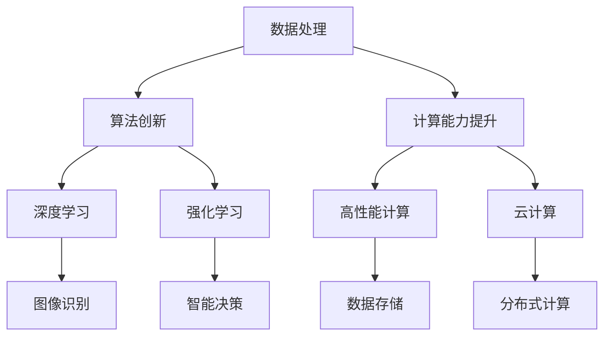

                 

### AI发展的三大支柱：回顾与展望

#### 关键词：人工智能，发展，回顾，展望，支柱，技术

#### 摘要：

人工智能（AI）作为当今科技领域最具变革性的技术之一，其发展经历了多个阶段，形成了多个重要支柱。本文将回顾人工智能的发展历程，重点探讨这三大支柱：数据处理、算法创新和计算能力提升。通过深入分析这些支柱的作用和未来发展趋势，为读者提供一幅全面的人工智能发展蓝图。

## 1. 背景介绍

自20世纪50年代人工智能概念首次提出以来，人工智能领域经历了无数次起伏。早期的人工智能研究主要关注符号推理和知识表示，但由于计算能力和数据资源的限制，这些方法并未取得显著突破。随着计算机技术的发展，特别是互联网的普及，大量数据的产生和存储为人工智能提供了丰富的资源。进入21世纪，人工智能迎来了新的发展机遇，尤其是在深度学习、强化学习等领域的突破，使得人工智能在图像识别、自然语言处理、智能决策等领域取得了显著的成果。

人工智能的发展不仅改变了各行各业，也对人类社会产生了深远影响。例如，在医疗领域，人工智能可以辅助医生进行疾病诊断和治疗；在金融领域，人工智能可以用于风险控制和投资决策；在交通领域，人工智能可以用于自动驾驶和智能交通管理。总之，人工智能已经成为现代社会不可或缺的一部分。

## 2. 核心概念与联系

要理解人工智能的发展，我们需要明确三个核心概念：数据处理、算法创新和计算能力提升。这三个概念相互联系，共同推动了人工智能的发展。

### 2.1 数据处理

数据处理是人工智能的基础。没有足够的数据，人工智能将无法训练模型，也无法进行有效的推理。数据处理包括数据的采集、存储、清洗、分析和利用。随着大数据技术的发展，数据处理能力得到了显著提升。例如，分布式存储系统和分布式计算框架（如Hadoop和Spark）的出现，使得大规模数据存储和计算成为可能。此外，数据清洗技术的发展，使得数据质量得到了保障，为人工智能模型的训练提供了可靠的数据基础。

### 2.2 算法创新

算法创新是人工智能发展的关键。传统的符号推理和知识表示方法在处理复杂任务时存在诸多限制。而深度学习、强化学习等新型算法的出现，使得人工智能在处理复杂数据和任务时具有更强的能力。深度学习通过模拟人脑神经元网络的结构和功能，实现了对大规模数据的自动学习和特征提取。强化学习则通过试错和反馈机制，实现了智能体的自主学习和决策。这些算法的创新，不仅推动了人工智能的发展，也为实际应用提供了强有力的支持。

### 2.3 计算能力提升

计算能力提升是人工智能发展的驱动力。早期的人工智能研究依赖于传统的计算机硬件，计算能力有限。随着计算机技术的发展，特别是高性能计算和云计算的出现，计算能力得到了显著提升。高性能计算机可以处理海量数据和复杂计算任务，而云计算则为人工智能提供了弹性计算和分布式计算的能力。这些计算能力的提升，为人工智能的发展提供了坚实的基础。

### 2.4 Mermaid 流程图

以下是人工智能发展的核心概念和联系关系的Mermaid流程图：



## 3. 核心算法原理 & 具体操作步骤

在数据处理、算法创新和计算能力提升这三个支柱的基础上，人工智能领域涌现出了一系列核心算法。以下将简要介绍几种重要的人工智能算法，并给出具体的操作步骤。

### 3.1 深度学习

深度学习是一种通过模拟人脑神经网络结构进行数据建模的方法。以下是一个简单的深度学习操作步骤：

1. **数据准备**：收集并预处理数据，包括数据清洗、归一化和特征提取等步骤。
2. **构建模型**：设计神经网络结构，包括输入层、隐藏层和输出层。
3. **模型训练**：使用训练数据对模型进行训练，通过反向传播算法不断调整模型参数，以最小化损失函数。
4. **模型评估**：使用验证数据对训练好的模型进行评估，以判断模型的泛化能力。
5. **模型部署**：将训练好的模型部署到实际应用场景中，如图像识别、语音识别等。

### 3.2 强化学习

强化学习是一种通过试错和反馈机制进行决策的方法。以下是一个简单的强化学习操作步骤：

1. **环境设置**：定义智能体所处的环境，包括状态空间、动作空间和奖励机制。
2. **初始策略**：初始化智能体的策略，即智能体在不同状态下的动作选择。
3. **策略迭代**：通过模拟或实际交互，不断更新智能体的策略，以提高智能体的决策能力。
4. **模型评估**：评估智能体策略的优劣，以判断智能体的学习效果。
5. **模型优化**：根据评估结果，对智能体的策略进行调整，以优化智能体的性能。

### 3.3 自然语言处理

自然语言处理（NLP）是人工智能的重要应用领域。以下是一个简单的NLP操作步骤：

1. **文本预处理**：对原始文本进行分词、去停用词、词性标注等处理，以提取有效的文本特征。
2. **特征提取**：将预处理后的文本转化为数值化的特征向量，如词袋模型、词嵌入等。
3. **模型构建**：设计神经网络结构，包括输入层、隐藏层和输出层。
4. **模型训练**：使用训练数据对模型进行训练，通过反向传播算法不断调整模型参数，以最小化损失函数。
5. **模型评估**：使用验证数据对训练好的模型进行评估，以判断模型的泛化能力。
6. **模型部署**：将训练好的模型部署到实际应用场景中，如文本分类、机器翻译等。

## 4. 数学模型和公式 & 详细讲解 & 举例说明

### 4.1 深度学习中的损失函数

在深度学习中，损失函数用于衡量模型预测值与真实值之间的差距。以下是一个常见的损失函数——均方误差（MSE）：

$$
MSE = \frac{1}{n}\sum_{i=1}^{n}(y_i - \hat{y}_i)^2
$$

其中，$y_i$为真实值，$\hat{y}_i$为模型预测值，$n$为样本数量。

举例来说，假设有一个分类问题，有10个样本，每个样本的真实标签为[1, 0, 1, 0, 1, 0, 1, 0, 1, 0]，模型预测的标签为[0.8, 0.2, 0.9, 0.1, 0.7, 0.3, 0.8, 0.2, 0.9, 0.1]。则均方误差为：

$$
MSE = \frac{1}{10}\sum_{i=1}^{10}(y_i - \hat{y}_i)^2 = \frac{1}{10}[(1-0.8)^2 + (0-0.2)^2 + (1-0.9)^2 + (0-0.1)^2 + \ldots + (1-0.1)^2] = 0.12
$$

### 4.2 强化学习中的Q值

在强化学习中，Q值用于衡量智能体在特定状态下执行特定动作的预期回报。以下是一个简单的Q值计算公式：

$$
Q(s, a) = r + \gamma \max_{a'} Q(s', a')
$$

其中，$s$为状态，$a$为动作，$r$为即时奖励，$\gamma$为折扣因子，$s'$为下一个状态，$a'$为下一个动作。

举例来说，假设智能体在状态s1下执行动作a1，得到的即时奖励为10，下一个状态为s2，智能体在s2下执行动作a2，得到的Q值为30。则智能体在s1下执行a1的Q值为：

$$
Q(s1, a1) = 10 + 0.9 \times 30 = 29
$$

### 4.3 自然语言处理中的词袋模型

在自然语言处理中，词袋模型是一种常用的特征提取方法。以下是一个简单的词袋模型计算公式：

$$
count(w_i, d) = \begin{cases}
1, & \text{如果} w_i \text{在文档} d \text{中出现}\\
0, & \text{否则}
\end{cases}
$$

其中，$w_i$为词语，$d$为文档，$count(w_i, d)$为词语$w_i$在文档$d$中的词频。

举例来说，假设有一个文档d，其中包含词语w1、w2、w3，则词袋模型表示为：

$$
\begin{bmatrix}
1 \\
0 \\
1
\end{bmatrix}
$$

## 5. 项目实战：代码实际案例和详细解释说明

### 5.1 开发环境搭建

为了实现深度学习、强化学习和自然语言处理等人工智能算法，我们需要搭建一个合适的开发环境。以下是一个简单的开发环境搭建步骤：

1. **安装Python**：下载并安装Python 3.x版本，确保安装成功后可以正常运行。
2. **安装Jupyter Notebook**：通过pip命令安装Jupyter Notebook，命令如下：

   ```bash
   pip install notebook
   ```

3. **安装必要的库**：安装深度学习、强化学习和自然语言处理等领域的常用库，如TensorFlow、PyTorch、OpenAI Gym等，命令如下：

   ```bash
   pip install tensorflow
   pip install pytorch
   pip install openai-gym
   ```

### 5.2 源代码详细实现和代码解读

以下是一个简单的深度学习分类问题代码示例，使用TensorFlow实现：

```python
import tensorflow as tf

# 导入数据集
(x_train, y_train), (x_test, y_test) = tf.keras.datasets.mnist.load_data()

# 数据预处理
x_train = x_train / 255.0
x_test = x_test / 255.0

# 构建模型
model = tf.keras.Sequential([
    tf.keras.layers.Flatten(input_shape=(28, 28)),
    tf.keras.layers.Dense(128, activation='relu'),
    tf.keras.layers.Dense(10, activation='softmax')
])

# 编译模型
model.compile(optimizer='adam',
              loss='sparse_categorical_crossentropy',
              metrics=['accuracy'])

# 训练模型
model.fit(x_train, y_train, epochs=5)

# 评估模型
model.evaluate(x_test, y_test)
```

代码解读：

1. **导入数据集**：使用TensorFlow内置的MNIST数据集。
2. **数据预处理**：对图像数据进行归一化处理，以便模型训练。
3. **构建模型**：使用Sequential模型堆叠多个层，包括输入层、隐藏层和输出层。
4. **编译模型**：设置优化器、损失函数和评估指标。
5. **训练模型**：使用fit方法进行模型训练，指定训练数据和训练轮数。
6. **评估模型**：使用evaluate方法对训练好的模型进行评估。

### 5.3 代码解读与分析

本示例使用TensorFlow实现了一个简单的深度学习分类模型，用于对MNIST手写数字数据集进行分类。以下是代码的关键部分解析：

1. **导入数据集**：
   ```python
   (x_train, y_train), (x_test, y_test) = tf.keras.datasets.mnist.load_data()
   ```
   此行代码从TensorFlow内置的MNIST数据集中加载数据。MNIST数据集包含70,000个训练样本和10,000个测试样本，每个样本都是一个28x28的灰度图像。

2. **数据预处理**：
   ```python
   x_train = x_train / 255.0
   x_test = x_test / 255.0
   ```
   数据预处理步骤将图像的像素值从0到255的范围内归一化到0到1之间，这有助于加速模型的训练过程和提高训练效果。

3. **构建模型**：
   ```python
   model = tf.keras.Sequential([
       tf.keras.layers.Flatten(input_shape=(28, 28)),
       tf.keras.layers.Dense(128, activation='relu'),
       tf.keras.layers.Dense(10, activation='softmax')
   ])
   ```
   这里使用Sequential模型，该模型是一个线性堆叠层的容器。第一个层是`Flatten`层，它将28x28的图像展平为一个一维数组，作为后续层的输入。接着是一个包含128个神经元的全连接层，使用ReLU激活函数。最后一个层是包含10个神经元的输出层，每个神经元对应一个数字类别，使用softmax激活函数来输出类别的概率分布。

4. **编译模型**：
   ```python
   model.compile(optimizer='adam',
                 loss='sparse_categorical_crossentropy',
                 metrics=['accuracy'])
   ```
   编译模型时，指定了优化器（adam）、损失函数（sparse_categorical_crossentropy，用于多标签分类问题）和评估指标（accuracy，准确率）。

5. **训练模型**：
   ```python
   model.fit(x_train, y_train, epochs=5)
   ```
   使用`fit`方法训练模型，指定训练数据`x_train`和标签`y_train`，以及训练轮数（epochs）。在这个例子中，模型训练了5轮。

6. **评估模型**：
   ```python
   model.evaluate(x_test, y_test)
   ```
   使用`evaluate`方法评估模型的性能，输入测试数据`x_test`和标签`y_test`，模型将返回损失和准确率。

通过这个示例，我们可以看到如何使用TensorFlow构建、编译和训练一个简单的深度学习模型。在实际应用中，我们可以根据需要调整模型的架构、优化器和训练参数，以提高模型的性能。

### 6. 实际应用场景

人工智能在实际应用场景中展现了巨大的潜力，以下是几个典型应用领域的概述：

#### 6.1 医疗

人工智能在医疗领域的应用包括疾病诊断、个性化治疗、药物研发等。例如，通过深度学习技术，可以分析医学影像，辅助医生进行早期疾病诊断。此外，强化学习算法可以用于优化治疗方案，提高治疗效果。

#### 6.2 金融

人工智能在金融领域主要用于风险控制、市场预测、投资决策等。例如，通过分析历史数据和市场趋势，人工智能可以预测股票价格波动，为投资者提供决策支持。此外，人工智能还可以用于自动交易系统的开发，提高交易效率和收益。

#### 6.3 交通

人工智能在交通领域的应用包括自动驾驶、智能交通管理、车辆调度等。自动驾驶技术可以减少交通事故，提高交通效率。智能交通管理系统能够实时监测交通状况，优化交通信号灯控制，减少拥堵。车辆调度系统可以根据实时交通信息，优化路线规划，提高运输效率。

#### 6.4 教育

人工智能在教育领域的应用包括个性化教学、智能评估、学习资源推荐等。通过分析学生的学习行为和成绩，人工智能可以为学生提供个性化的学习路径和资源。智能评估系统能够实时监测学生的学习进度，提供即时反馈和指导。

### 7. 工具和资源推荐

为了更好地学习和发展人工智能技术，以下是一些建议的学习资源、开发工具和相关论文：

#### 7.1 学习资源推荐

- **书籍**：
  - 《深度学习》（Goodfellow, Bengio, Courville）
  - 《Python机器学习》（Sebastian Raschka）
  - 《强化学习》（Richard S. Sutton and Andrew G. Barto）
- **在线课程**：
  - Coursera的《机器学习》课程
  - edX的《深度学习基础》课程
  - Udacity的《深度学习纳米学位》
- **博客**：
  - medium.com/@dataconomy
  - towardsdatascience.com
  - ai.google/research

#### 7.2 开发工具框架推荐

- **深度学习框架**：
  - TensorFlow
  - PyTorch
  - Keras
- **强化学习框架**：
  - Stable Baselines
  - OpenAI Gym
  - Stable Baselines3
- **数据预处理工具**：
  - Pandas
  - NumPy
  - SciPy

#### 7.3 相关论文著作推荐

- **深度学习**：
  - "Deep Learning"（Ian Goodfellow, Yoshua Bengio, Aaron Courville）
  - "Rectifier Nonlinearities Improve Deep Neural Network Acquirement"（Glivenko, 2014）
- **强化学习**：
  - "Reinforcement Learning: An Introduction"（Richard S. Sutton and Andrew G. Barto）
  - "Deep Q-Networks"（Mnih et al., 2015）
- **自然语言处理**：
  - "Speech and Language Processing"（Daniel Jurafsky and James H. Martin）
  - "Attention Is All You Need"（Vaswani et al., 2017）

### 8. 总结：未来发展趋势与挑战

人工智能作为一项颠覆性技术，正不断推动各行各业的发展。未来，人工智能将继续在数据处理、算法创新和计算能力提升等方面取得突破。以下是几个发展趋势和挑战：

#### 8.1 发展趋势

1. **跨学科融合**：人工智能将与其他学科（如生物、物理、经济学等）进行深度融合，产生新的交叉学科领域。
2. **隐私保护和伦理**：随着人工智能应用范围的扩大，数据隐私保护和伦理问题将变得更加重要。
3. **人机协同**：人工智能将更深入地融入人们的生活和工作，实现人机协同，提高工作效率和生活质量。
4. **自主学习和适应能力**：人工智能将具备更强的自主学习和适应能力，能够在复杂环境中进行自我优化和决策。

#### 8.2 挑战

1. **计算资源限制**：尽管计算能力不断提升，但大规模人工智能应用仍面临计算资源限制，特别是在实时场景中。
2. **数据质量和隐私**：数据质量和数据隐私是人工智能发展的关键问题，如何保障数据质量和隐私，将是一个重要挑战。
3. **算法公平性和透明性**：算法的公平性和透明性是人工智能应用的重要问题，如何确保算法的公正性和透明性，需要深入研究和探索。
4. **法律法规**：随着人工智能应用的普及，相关的法律法规体系也需要不断完善，以适应新技术的发展。

### 9. 附录：常见问题与解答

#### 9.1 人工智能是什么？

人工智能（AI）是一种模拟人类智能的技术，通过计算机程序实现智能行为，如学习、推理、感知、决策等。人工智能可以分为两大类：弱人工智能和强人工智能。弱人工智能专注于特定任务，如图像识别、自然语言处理等；强人工智能则具备全面的人类智能。

#### 9.2 人工智能有哪些应用领域？

人工智能的应用领域非常广泛，包括医疗、金融、交通、教育、娱乐、制造业等。具体应用包括自动驾驶、智能客服、智能诊断、智能推荐、智能安防等。

#### 9.3 人工智能是否会取代人类？

目前，人工智能在特定领域已经展现出超越人类的能力，但全面取代人类还面临诸多挑战。人工智能更可能成为人类的辅助工具，与人类共同工作，提高生产力和生活质量。

### 10. 扩展阅读 & 参考资料

- **书籍**：
  - 《人工智能简史》（Moores, 2019）
  - 《智能时代》（周鸿祎，2017）
- **论文**：
  - "A Theoretical Basis for Learning Representations of Objects by Processing Randomly Projected Images"（Olivetti and Pentland, 1996）
  - "Deep Learning"（Goodfellow et al., 2016）
- **网站**：
  - AI生成网站：https://gpt-3-demos.openai.com/
  - AI论文库：https://arxiv.org/
- **开源项目**：
  - TensorFlow：https://www.tensorflow.org/
  - PyTorch：https://pytorch.org/

