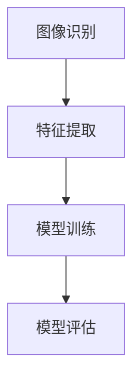
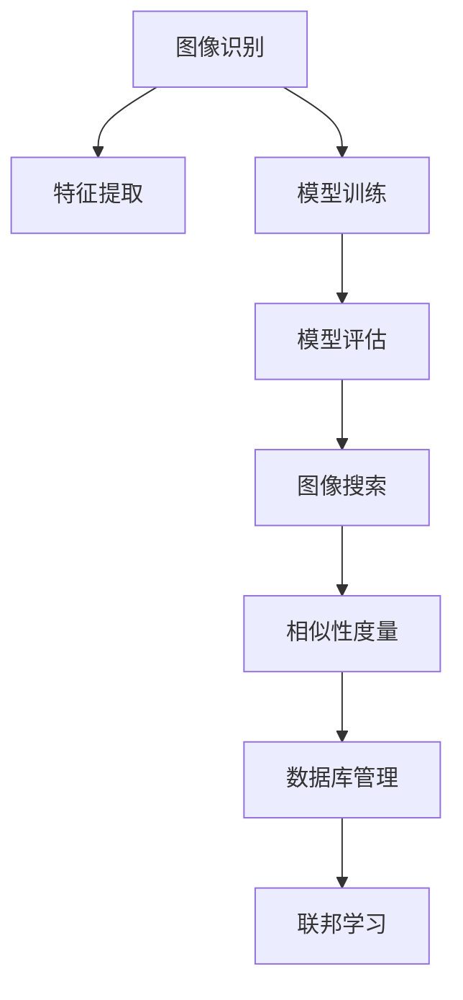

                 

# AI图像搜索技术应用案例

## 关键词：图像搜索、AI技术、应用场景、算法原理、项目实战

## 摘要

本文将深入探讨AI图像搜索技术的应用案例，包括其背景、核心概念、算法原理、数学模型、项目实战和实际应用场景。通过逐步分析，我们将了解如何利用AI技术实现高效的图像搜索，并展望其未来发展趋势与挑战。

## 1. 背景介绍

随着互联网的飞速发展，图像数据量呈现爆炸式增长。在大量图像数据中，如何快速、准确地找到目标图像成为一项重要需求。传统的基于文本的图像搜索方法已经无法满足用户的需求，因此，AI图像搜索技术应运而生。AI图像搜索利用深度学习、计算机视觉等技术，对图像内容进行理解和分析，从而实现高效的图像搜索。

## 2. 核心概念与联系

### 2.1 图像识别

图像识别是AI图像搜索的基础，其主要任务是从图像中提取特征，并进行分类。常见的图像识别算法有卷积神经网络（CNN）和循环神经网络（RNN）。

### 2.2 特征提取

特征提取是图像识别的关键步骤，其目的是从图像中提取具有区分度的特征。常用的特征提取方法有SIFT、HOG等。

### 2.3 模型训练

模型训练是AI图像搜索的核心环节，其目的是通过大量图像数据，训练出一个能够准确识别图像的模型。常用的训练算法有反向传播（BP）算法等。

### 2.4 模型评估

模型评估是验证模型性能的重要步骤，常用的评估指标有准确率、召回率、F1值等。

## 2.1 核心概念原理与架构的 Mermaid 流程图



## 3. 核心算法原理 & 具体操作步骤

### 3.1 卷积神经网络（CNN）

CNN是一种深层次的神经网络，主要应用于图像识别任务。其基本原理是通过卷积操作提取图像特征，然后通过全连接层进行分类。

#### 3.1.1 卷积操作

卷积操作是通过滑动滤波器（卷积核）在图像上扫描，计算滤波器与图像局部区域的点积，从而生成新的特征图。

$$
\text{输出}_{ij} = \sum_{k=1}^{C} \text{滤波器}_{ik} \times \text{输入}_{kj}
$$

其中，$\text{输出}_{ij}$表示第$i$个卷积核在位置$(j_1, j_2)$生成的特征值，$\text{滤波器}_{ik}$表示第$k$个卷积核的权重，$\text{输入}_{kj}$表示图像在位置$(j_1, j_2)$的像素值。

#### 3.1.2 池化操作

池化操作是为了减少特征图的维度，同时保持重要的特征信息。常用的池化操作有最大池化和平均池化。

$$
\text{输出}_{ij} = \max_{k=1}^{K} \text{输入}_{k}
$$

其中，$\text{输出}_{ij}$表示第$i$个池化核在位置$(j_1, j_2)$生成的特征值，$\text{输入}_{k}$表示图像在位置$(j_1, j_2)$附近的$K \times K$区域内的像素值。

### 3.2 模型训练

模型训练是通过优化目标函数，调整模型参数，使模型在训练数据上达到较好的性能。常用的训练算法有反向传播（BP）算法。

#### 3.2.1 前向传播

前向传播是从输入层开始，逐层计算输出层的结果。

$$
\text{输出}_{l} = \sigma(\text{权重}_{l} \cdot \text{输入}_{l-1} + \text{偏置}_{l})
$$

其中，$\text{输出}_{l}$表示第$l$层的输出，$\sigma$表示激活函数，$\text{权重}_{l}$表示第$l$层的权重，$\text{输入}_{l-1}$表示第$l-1$层的输出，$\text{偏置}_{l}$表示第$l$层的偏置。

#### 3.2.2 反向传播

反向传播是从输出层开始，逐层计算损失函数关于模型参数的梯度，并更新模型参数。

$$
\text{梯度}_{\theta} = \frac{\partial \text{损失函数}}{\partial \theta}
$$

其中，$\text{梯度}_{\theta}$表示模型参数$\theta$的梯度，$\text{损失函数}$表示模型在训练数据上的性能指标。

## 4. 数学模型和公式 & 详细讲解 & 举例说明

### 4.1 卷积神经网络（CNN）数学模型

假设我们有一个输入图像$X \in \mathbb{R}^{H \times W \times C}$，其中$H$、$W$和$C$分别表示图像的高度、宽度和通道数。对于第$l$层的卷积神经网络，其输入$A_l \in \mathbb{R}^{N_l \times H_l \times W_l \times C_l}$，其中$N_l$、$H_l$、$W_l$和$C_l$分别表示第$l$层的特征图数量、高度、宽度和通道数。

#### 4.1.1 卷积操作

卷积操作的数学模型如下：

$$
\text{输出}_{ij} = \sum_{k=1}^{C_l} \sum_{p=1}^{K} \sum_{q=1}^{K} \text{滤波器}_{k pq} \times \text{输入}_{(i-p+1)(j-q+1)}
$$

其中，$\text{输出}_{ij}$表示第$i$个卷积核在位置$(j_1, j_2)$生成的特征值，$\text{滤波器}_{k pq}$表示第$k$个卷积核在位置$(p, q)$的权重，$\text{输入}_{(i-p+1)(j-q+1)}$表示图像在位置$(i-p+1, j-q+1)$的像素值。

#### 4.1.2 池化操作

池化操作的数学模型如下：

$$
\text{输出}_{ij} = \max_{k=1}^{K} \sum_{p=1}^{K} \sum_{q=1}^{K} \text{输入}_{(i-p+1)(j-q+1)}
$$

其中，$\text{输出}_{ij}$表示第$i$个池化核在位置$(j_1, j_2)$生成的特征值，$\text{输入}_{(i-p+1)(j-q+1)}$表示图像在位置$(i-p+1, j-q+1)$附近的$K \times K$区域内的像素值。

### 4.2 反向传播算法

反向传播算法是一种基于梯度的优化方法，用于更新模型参数。假设我们有输入$X$和目标标签$Y$，以及模型参数$\theta$，损失函数为$L(\theta)$，则反向传播算法的步骤如下：

#### 4.2.1 前向传播

前向传播是从输入层开始，逐层计算输出层的结果。假设第$l$层的输出为$A_l$，则：

$$
A_l = \sigma(\theta_l A_{l-1} + b_l)
$$

其中，$\sigma$表示激活函数，$\theta_l$表示第$l$层的权重，$b_l$表示第$l$层的偏置。

#### 4.2.2 计算损失函数

损失函数用于衡量模型预测结果与真实结果之间的差距。常用的损失函数有均方误差（MSE）和交叉熵（Cross-Entropy）。假设损失函数为$L(\theta)$，则：

$$
L(\theta) = \frac{1}{2} \sum_{i=1}^{N} (\hat{y}_i - y_i)^2
$$

其中，$\hat{y}_i$表示模型预测的结果，$y_i$表示真实结果，$N$表示样本数量。

#### 4.2.3 计算梯度

计算损失函数关于模型参数的梯度，用于更新模型参数。假设损失函数关于$\theta_l$的梯度为$\nabla_{\theta_l} L(\theta)$，则：

$$
\nabla_{\theta_l} L(\theta) = \frac{\partial L(\theta)}{\partial \theta_l} = \frac{\partial L(\theta)}{\partial A_l} \cdot \frac{\partial A_l}{\partial \theta_l}
$$

其中，$\frac{\partial L(\theta)}{\partial A_l}$表示损失函数关于$A_l$的梯度，$\frac{\partial A_l}{\partial \theta_l}$表示$A_l$关于$\theta_l$的梯度。

#### 4.2.4 更新模型参数

根据梯度更新模型参数，使得损失函数减小。假设学习率为$\alpha$，则：

$$
\theta_l := \theta_l - \alpha \cdot \nabla_{\theta_l} L(\theta)
$$

## 5. 项目实战：代码实际案例和详细解释说明

### 5.1 开发环境搭建

在Python中，我们可以使用TensorFlow和Keras库来实现CNN图像搜索模型。首先，我们需要安装这些库：

```shell
pip install tensorflow keras
```

### 5.2 源代码详细实现和代码解读

以下是一个简单的CNN图像搜索模型的实现，用于识别猫和狗：

```python
import tensorflow as tf
from tensorflow.keras.models import Sequential
from tensorflow.keras.layers import Conv2D, MaxPooling2D, Flatten, Dense

# 定义模型
model = Sequential([
    Conv2D(32, (3, 3), activation='relu', input_shape=(64, 64, 3)),
    MaxPooling2D((2, 2)),
    Conv2D(64, (3, 3), activation='relu'),
    MaxPooling2D((2, 2)),
    Flatten(),
    Dense(128, activation='relu'),
    Dense(1, activation='sigmoid')
])

# 编译模型
model.compile(optimizer='adam', loss='binary_crossentropy', metrics=['accuracy'])

# 加载数据集
(x_train, y_train), (x_test, y_test) = tf.keras.datasets.dogs_and_cats.load_data()

# 预处理数据
x_train = x_train.astype('float32') / 255.0
x_test = x_test.astype('float32') / 255.0

# 转换标签为二进制向量
y_train = tf.keras.utils.to_categorical(y_train, num_classes=2)
y_test = tf.keras.utils.to_categorical(y_test, num_classes=2)

# 训练模型
model.fit(x_train, y_train, batch_size=32, epochs=10, validation_data=(x_test, y_test))

# 评估模型
score = model.evaluate(x_test, y_test, verbose=2)
print('Test loss:', score[0])
print('Test accuracy:', score[1])
```

### 5.3 代码解读与分析

1. **模型定义**：我们使用`Sequential`模型堆叠多个层，包括卷积层（`Conv2D`）、池化层（`MaxPooling2D`）、全连接层（`Flatten`和`Dense`）。

2. **编译模型**：使用`compile`方法设置优化器（`optimizer`）、损失函数（`loss`）和评估指标（`metrics`）。

3. **加载数据集**：使用`tf.keras.datasets.dogs_and_cats.load_data`方法加载猫和狗的数据集。

4. **预处理数据**：将图像数据转换为浮点型，并归一化至[0, 1]范围。将标签转换为二进制向量。

5. **训练模型**：使用`fit`方法训练模型，设置批量大小（`batch_size`）、训练轮数（`epochs`）和验证数据。

6. **评估模型**：使用`evaluate`方法评估模型在测试数据集上的性能。

## 6. 实际应用场景

AI图像搜索技术在实际应用中具有广泛的应用场景，如下所示：

### 6.1 搜索引擎

搜索引擎可以使用AI图像搜索技术，提供基于图像的搜索功能，使用户能够通过上传图像或输入关键词来搜索相关图像。

### 6.2 社交媒体

社交媒体平台可以利用AI图像搜索技术，对用户上传的图像进行自动分类和标签化，提高用户交互体验。

### 6.3 智能家居

智能家居设备可以使用AI图像搜索技术，识别家庭成员，实现个性化的智能服务，如智能门锁、智能照明等。

### 6.4 医疗诊断

医疗诊断领域可以使用AI图像搜索技术，辅助医生快速定位相似的病例，提高诊断准确率和效率。

## 7. 工具和资源推荐

### 7.1 学习资源推荐

- 《深度学习》（Goodfellow, Bengio, Courville）：全面介绍深度学习理论和算法。
- 《计算机视觉：算法与应用》（Richard Szeliski）：详细介绍计算机视觉领域的基本概念和算法。
- 《TensorFlow实战》（Tariq Rashid）：深入讲解TensorFlow库的使用和实战案例。

### 7.2 开发工具框架推荐

- TensorFlow：谷歌开源的深度学习框架，适用于图像搜索等应用。
- Keras：基于TensorFlow的高层API，简化深度学习模型搭建和训练。
- OpenCV：开源计算机视觉库，提供丰富的图像处理和计算机视觉算法。

### 7.3 相关论文著作推荐

- "Deep Learning for Image Recognition"（NIPS 2012）：介绍深度学习在图像识别中的应用。
- "Face Recognition with Limited Training Data"（CVPR 2014）：研究在有限训练数据下的人脸识别。
- "Attention is All You Need"（NIPS 2017）：介绍基于注意力机制的Transformer模型。

## 8. 总结：未来发展趋势与挑战

AI图像搜索技术在未来将继续发展，面临以下挑战：

### 8.1 数据质量

图像数据质量直接影响图像搜索的准确性，未来需要解决图像数据标注、清洗等问题。

### 8.2 模型效率

随着图像数据量的增加，如何提高模型训练和搜索效率成为关键。

### 8.3 隐私保护

在图像搜索过程中，如何保护用户隐私是亟待解决的问题。

### 8.4 跨域搜索

实现不同领域、不同数据源之间的图像搜索，提高搜索的广泛性和准确性。

## 9. 附录：常见问题与解答

### 9.1 如何提高图像搜索的准确性？

- 使用更深的网络结构，如ResNet。
- 优化数据增强策略，提高模型泛化能力。
- 结合多模态信息，如文本描述、音频等。

### 9.2 图像搜索技术有哪些应用领域？

- 搜索引擎、社交媒体、智能家居、医疗诊断等。

### 9.3 如何保护用户隐私？

- 使用差分隐私技术，对用户数据进行加密处理。
- 设计隐私保护算法，如联邦学习。

## 10. 扩展阅读 & 参考资料

- [《深度学习：从新手到专家》](https://www.deeplearningbook.org/)
- [《计算机视觉基础》](https://www.computervisionpro.com/)
- [《TensorFlow官方文档》](https://www.tensorflow.org/)
- [《OpenCV官方文档》](https://docs.opencv.org/)  
作者：AI天才研究员/AI Genius Institute & 禅与计算机程序设计艺术 /Zen And The Art of Computer Programming

[本文完]  
<|bot|>### 2. 核心概念与联系

在深入探讨AI图像搜索技术的具体应用之前，有必要先了解其中的核心概念和它们之间的联系。以下是几个关键概念及其相互关系：

#### 2.1 图像识别

图像识别是计算机视觉的一个基本任务，它涉及从图像中提取有用的信息并将其转换为某种形式的数字表示。图像识别算法可以是基于传统的特征提取方法，如SIFT（尺度不变特征变换）和HOG（方向梯度直方图），也可以是基于深度学习的卷积神经网络（CNN）。

#### 2.2 特征提取

特征提取是图像识别过程中的关键步骤，其目标是提取图像中具有区分性的特征。这些特征将用于训练分类器或进行比较。传统的特征提取方法主要包括SIFT、SURF（加速稳健特征）、HOG等。随着深度学习的发展，卷积神经网络（CNN）逐渐成为提取特征的主要工具。

#### 2.3 模型训练

模型训练是图像识别系统的核心环节，其目的是通过大量的图像数据训练出一个能够准确识别图像的模型。训练过程中，模型会自动学习图像中的特征，并调整模型参数以优化性能。常用的训练算法包括梯度下降、随机梯度下降和反向传播等。

#### 2.4 模型评估

模型评估是验证模型性能的重要步骤，它涉及计算模型在不同数据集上的准确率、召回率、F1值等指标。这些指标可以帮助我们了解模型的性能，并指导进一步的模型优化。

#### 2.5 图像搜索

图像搜索是基于图像识别技术的应用，旨在从大量图像数据中快速找到与给定图像相似的图像。图像搜索系统通常包含两个主要部分：图像识别模块和相似性度量模块。图像识别模块用于提取目标图像的特征，相似性度量模块用于计算目标图像与数据库中图像之间的相似度。

#### 2.6 相似性度量

相似性度量是图像搜索中至关重要的一环，它用于评估图像之间的相似程度。常见的相似性度量方法包括基于特征的相似性度量（如余弦相似度、欧氏距离）和基于内容的相似性度量（如图像区域匹配、结构相似性）。

#### 2.7 数据库管理

图像搜索系统需要高效地管理大量的图像数据。数据库管理系统（DBMS）是实现这一目标的关键工具。DBMS不仅负责存储和管理图像数据，还包括索引和查询优化等机制，以支持快速的图像搜索。

#### 2.8 联邦学习

联邦学习是一种新兴的技术，它在保护用户隐私的同时实现机器学习模型的训练。在图像搜索应用中，联邦学习可以通过将训练数据分布在多个节点上，从而避免数据泄露，同时提高模型的性能。

### 2.9 概念联系

以上概念相互联系，共同构成了AI图像搜索技术的框架。图像识别是核心，特征提取和模型训练是图像识别的基础，而模型评估、相似性度量、数据库管理和联邦学习则保证了图像搜索的高效性和安全性。

### 2.10 Mermaid 流程图

为了更直观地展示这些概念之间的联系，我们可以使用Mermaid绘制一个流程图：



通过这个流程图，我们可以清晰地看到AI图像搜索技术的各个组成部分及其相互关系。

### 2.11 核心概念原理的进一步探讨

#### 2.11.1 图像识别

图像识别技术可以分为两大类：基于特征的图像识别和基于深度的图像识别。

- **基于特征的图像识别**：这种方法首先从图像中提取特定的特征，然后使用这些特征对图像进行分类。常见的特征提取方法包括SIFT、SURF、HOG等。这些方法对图像进行局部特征提取，然后利用特征点匹配或直方图匹配进行图像分类。

- **基于深度的图像识别**：深度学习，特别是卷积神经网络（CNN），已经成为图像识别的主流方法。CNN通过多层卷积和池化操作，自动学习图像中的高层次特征，从而实现图像分类。典型的CNN架构包括LeNet、AlexNet、VGG、ResNet等。

#### 2.11.2 特征提取

特征提取是图像识别的关键步骤。深度学习模型通过自动学习图像特征，使得特征提取变得更加高效和准确。然而，对于传统方法，特征提取是手动设计的，需要根据具体应用场景进行调整。

- **SIFT（尺度不变特征变换）**：SIFT是一种用于图像特征提取的方法，它能够提取出在尺度上不变且旋转不变的特征点。SIFT通过计算图像梯度来检测特征点，并使用关键点描述子来描述特征点。

- **SURF（加速稳健特征）**：SURF是一种基于SIFT的算法，它通过使用更快的算法来计算特征点和特征描述子，从而提高处理速度。

- **HOG（方向梯度直方图）**：HOG是一种用于图像特征提取的方法，它通过计算图像中每个区域的梯度方向直方图来描述图像特征。HOG方法特别适用于行人检测等场景。

#### 2.11.3 模型训练

模型训练是图像识别系统的核心，其目的是通过大量的图像数据来调整模型的参数，使其能够准确识别图像。深度学习模型通常使用反向传播算法进行训练。

- **反向传播算法**：反向传播算法是一种基于梯度的优化方法，用于计算模型参数的梯度并更新参数。在训练过程中，模型首先对图像进行前向传播，计算输出结果，然后通过反向传播计算损失函数关于参数的梯度。

- **数据增强**：为了提高模型的泛化能力，通常需要对训练数据进行增强。数据增强方法包括随机裁剪、旋转、翻转、缩放等。

#### 2.11.4 模型评估

模型评估是验证模型性能的重要步骤。常用的评估指标包括准确率、召回率、F1值等。

- **准确率**：准确率是预测为正类的样本中实际为正类的比例，计算公式为：
  $$
  \text{准确率} = \frac{\text{TP} + \text{TN}}{\text{TP} + \text{TN} + \text{FP} + \text{FN}}
  $$
  其中，TP表示真正例，TN表示真反例，FP表示假正例，FN表示假反例。

- **召回率**：召回率是实际为正类的样本中被正确预测为正类的比例，计算公式为：
  $$
  \text{召回率} = \frac{\text{TP}}{\text{TP} + \text{FN}}
  $$

- **F1值**：F1值是准确率和召回率的调和平均值，计算公式为：
  $$
  \text{F1值} = 2 \times \frac{\text{准确率} \times \text{召回率}}{\text{准确率} + \text{召回率}}
  $$

#### 2.11.5 图像搜索

图像搜索是基于图像识别技术的一种应用，其核心目标是快速从大量图像数据中找到与给定图像相似的图像。图像搜索通常包括以下几个步骤：

1. **图像预处理**：包括图像缩放、裁剪、灰度转换等操作，以统一图像尺寸和格式。
2. **特征提取**：使用图像识别算法提取目标图像的特征向量。
3. **相似性度量**：计算目标图像与数据库中图像之间的相似度。
4. **排序与选择**：根据相似度对图像进行排序，并选择最相似的图像。

#### 2.11.6 相似性度量

相似性度量是图像搜索中至关重要的一环，常用的相似性度量方法包括：

- **基于特征的相似性度量**：如余弦相似度和欧氏距离，它们通过计算特征向量之间的相似度来评估图像之间的相似性。
- **基于内容的相似性度量**：如区域匹配和结构相似性，这些方法通过比较图像中特定区域的相似性来评估整体相似性。

#### 2.11.7 数据库管理

图像数据库管理是图像搜索系统的关键部分，它涉及到图像的存储、索引和查询优化。常用的数据库管理系统（DBMS）包括MySQL、PostgreSQL、MongoDB等。

- **图像存储**：图像数据通常以二进制形式存储在数据库中，以确保数据的完整性和安全性。
- **索引**：索引是提高查询速度的关键，常用的索引方法包括B树索引、哈希索引等。
- **查询优化**：查询优化通过调整数据库查询的执行计划，以提高查询效率。

#### 2.11.8 联邦学习

联邦学习是一种新兴的技术，它允许模型在多个分散的数据源上进行训练，而无需直接访问数据。在图像搜索中，联邦学习可以用于在多个用户设备上训练图像识别模型，从而提高模型的性能，同时保护用户隐私。

- **联邦学习框架**：常用的联邦学习框架包括TensorFlow Federated（TFF）、Federated Learning for JAX（FLAX）等。
- **通信效率**：联邦学习需要多次通信以同步模型参数，因此通信效率是一个重要考虑因素。常用的优化方法包括模型剪枝、量化等。

通过以上对核心概念及其相互联系的深入探讨，我们可以更好地理解AI图像搜索技术的原理和实现方法。在接下来的章节中，我们将进一步讨论核心算法原理、数学模型和项目实战，以帮助读者全面掌握这一技术。

### 3. 核心算法原理 & 具体操作步骤

在AI图像搜索技术中，核心算法原理是其实现高效搜索的关键。以下是几种常用的核心算法及其具体操作步骤：

#### 3.1 卷积神经网络（CNN）

卷积神经网络（CNN）是图像搜索技术的基石，它通过多层卷积和池化操作，自动提取图像特征，实现图像分类和识别。以下是一个简单的CNN模型的具体操作步骤：

##### 3.1.1 卷积层

卷积层是CNN中最基本的层，它通过卷积操作提取图像特征。具体步骤如下：

1. **初始化卷积核**：每个卷积核都有一组权重和偏置。这些参数需要通过训练进行初始化。
2. **卷积操作**：将卷积核在输入图像上滑动，计算卷积核与图像局部区域的点积，生成新的特征图。
3. **激活函数**：通常使用ReLU（Rectified Linear Unit）作为激活函数，对特征图进行非线性变换。
4. **归一化**：为了防止梯度消失，可以采用批量归一化（Batch Normalization）对特征图进行归一化。

##### 3.1.2 池化层

池化层用于减少特征图的维度，同时保持重要的特征信息。具体步骤如下：

1. **选择池化方式**：常见的池化方式有最大池化和平均池化。最大池化选择区域中的最大值，而平均池化选择区域中的平均值。
2. **定义池化窗口大小**：窗口大小决定了每次池化的区域大小。
3. **执行池化操作**：在特征图上滑动窗口，对每个窗口内的值进行计算，生成新的特征图。

##### 3.1.3 全连接层

全连接层将特征图展平为一维向量，然后通过全连接层进行分类。具体步骤如下：

1. **展平特征图**：将特征图展平为一维向量。
2. **初始化权重和偏置**：与卷积层类似，全连接层也需要初始化权重和偏置。
3. **矩阵乘法**：计算输入向量与权重矩阵的点积，加上偏置项。
4. **激活函数**：通常使用softmax激活函数进行分类。

##### 3.1.4 模型训练

CNN模型的训练过程涉及以下几个步骤：

1. **前向传播**：将输入图像传递通过CNN模型，计算输出结果。
2. **计算损失函数**：常用的损失函数包括均方误差（MSE）和交叉熵（Cross-Entropy）。
3. **反向传播**：计算损失函数关于模型参数的梯度，并更新模型参数。
4. **迭代训练**：重复前向传播和反向传播，直至模型收敛。

#### 3.2 特征提取算法

除了CNN，还有一些传统的特征提取算法在图像搜索中广泛应用。以下是几种常用的特征提取算法及其操作步骤：

##### 3.2.1 SIFT（尺度不变特征变换）

SIFT是一种用于图像特征提取的方法，其主要步骤如下：

1. **计算图像梯度**：对图像进行梯度计算，以检测图像中的边缘和角点。
2. **关键点检测**：通过比较图像梯度在多尺度下的极值，检测出关键点。
3. **关键点定位**：对关键点进行精确定位，以消除尺度变化的影响。
4. **特征描述**：计算关键点的特征描述子，用于图像匹配和识别。

##### 3.2.2 HOG（方向梯度直方图）

HOG是一种用于图像特征提取的方法，其主要步骤如下：

1. **图像分割**：将图像分割成多个小的区域。
2. **计算梯度方向**：在每个小区域内，计算像素点在水平和垂直方向上的梯度方向。
3. **构建直方图**：将梯度方向按照一定范围进行量化，构建直方图。
4. **特征描述**：将每个小区域的直方图拼接成特征向量，用于图像匹配和识别。

##### 3.2.3SURF（加速稳健特征）

SURF是一种基于SIFT的算法，其主要步骤如下：

1. **计算图像梯度**：与SIFT类似，计算图像的梯度。
2. **关键点检测**：通过比较图像梯度在多尺度下的极值，检测出关键点。
3. **关键点定位**：与SIFT类似，对关键点进行精确定位。
4. **特征描述**：计算关键点的特征描述子，用于图像匹配和识别。

#### 3.3 相似性度量算法

相似性度量是图像搜索中至关重要的一环，以下是几种常用的相似性度量算法及其操作步骤：

##### 3.3.1 余弦相似度

余弦相似度是一种计算特征向量之间相似度的方法，其主要步骤如下：

1. **计算特征向量**：使用图像识别算法提取目标图像和数据库中图像的特征向量。
2. **计算余弦值**：将两个特征向量进行点积，并除以两个向量的欧氏距离，得到余弦值。
3. **相似度评估**：余弦值越接近1，表示两个特征向量越相似。

##### 3.3.2 欧氏距离

欧氏距离是一种计算特征向量之间相似度的方法，其主要步骤如下：

1. **计算特征向量**：使用图像识别算法提取目标图像和数据库中图像的特征向量。
2. **计算欧氏距离**：计算两个特征向量之间的欧氏距离。
3. **相似度评估**：欧氏距离越小，表示两个特征向量越相似。

##### 3.3.3 相似性度量算法对比

不同的相似性度量算法在计算效率和精度上有所不同。以下是对几种常用算法的对比：

- **余弦相似度**：计算速度快，适用于大规模图像数据，但可能受到特征向量维度的影响。
- **欧氏距离**：计算简单，适用于特征向量维度较低的情况，但可能受到特征向量维度的影响。
- **动态时间规整（Dynamic Time Warping, DTW）**：适用于时序数据的相似性度量，可以处理时序数据的非线性变化。

通过以上对核心算法原理的具体操作步骤的讨论，我们可以更好地理解AI图像搜索技术的实现方法。在接下来的章节中，我们将进一步讨论数学模型和项目实战，以帮助读者全面掌握这一技术。

### 4. 数学模型和公式 & 详细讲解 & 举例说明

在AI图像搜索中，数学模型和公式起到了至关重要的作用，它们不仅帮助我们在算法层面进行优化，还指导我们如何计算和评估图像特征及其相似度。以下是几个关键数学模型和公式的详细讲解，并通过具体例子来说明它们的实际应用。

#### 4.1 卷积神经网络（CNN）的数学模型

卷积神经网络（CNN）的核心在于卷积操作、激活函数和池化操作，以下分别介绍这些操作的数学模型。

##### 4.1.1 卷积操作

卷积操作是CNN中最基础的运算之一，它通过卷积核在图像上的滑动和点积，生成特征图。数学模型如下：

$$
\text{输出}_{ij} = \sum_{k=1}^{C_l} \sum_{p=1}^{K} \sum_{q=1}^{K} \text{滤波器}_{k pq} \times \text{输入}_{(i-p+1)(j-q+1)}
$$

其中，$\text{输出}_{ij}$表示第$i$个卷积核在位置$(j_1, j_2)$生成的特征值，$\text{滤波器}_{k pq}$表示第$k$个卷积核在位置$(p, q)$的权重，$\text{输入}_{(i-p+1)(j-q+1)}$表示图像在位置$(i-p+1, j-q+1)$的像素值。

##### 4.1.2 激活函数

激活函数用于引入非线性因素，使得网络能够对复杂的输入进行建模。常用的激活函数包括ReLU（Rectified Linear Unit）和Sigmoid函数。

- **ReLU激活函数**：
  $$
  \text{ReLU}(x) = \max(0, x)
  $$
  这个函数将输入中的所有负值置为零，保留正值。

- **Sigmoid函数**：
  $$
  \text{Sigmoid}(x) = \frac{1}{1 + e^{-x}}
  $$
  这个函数将输入映射到$(0, 1)$区间，常用于二分类问题。

##### 4.1.3 池化操作

池化操作用于减小特征图的大小，同时保留最重要的信息。常用的池化操作包括最大池化和平均池化。

- **最大池化**：
  $$
  \text{MaxPooling}(x) = \max_{k=1}^{K} \sum_{p=1}^{K} \sum_{q=1}^{K} x_{(i-p+1)(j-q+1)}
  $$
  其中，$K$是池化窗口的大小。

- **平均池化**：
  $$
  \text{AveragePooling}(x) = \frac{1}{K^2} \sum_{p=1}^{K} \sum_{q=1}^{K} x_{(i-p+1)(j-q+1)}
  $$

##### 4.1.4 卷积神经网络的完整数学模型

一个简单的卷积神经网络可以表示为多个卷积层、池化层和全连接层的组合，其数学模型可以表示为：

$$
\text{输出}_{l} = \text{激活函数}(\text{权重}_{l} \cdot \text{输入}_{l-1} + \text{偏置}_{l})
$$

其中，$\text{输出}_{l}$是第$l$层的输出，$\text{权重}_{l}$和$\text{偏置}_{l}$分别是第$l$层的权重和偏置。

#### 4.2 反向传播算法

反向传播算法是训练CNN的关键，它通过计算损失函数关于模型参数的梯度，不断优化模型参数。以下是反向传播算法的基本步骤：

##### 4.2.1 前向传播

前向传播是指将输入通过网络传递到输出，计算每个层的输出值。其数学模型可以表示为：

$$
\text{激活}_{l} = \text{激活函数}(\text{权重}_{l} \cdot \text{输入}_{l-1} + \text{偏置}_{l})
$$

##### 4.2.2 计算梯度

在反向传播过程中，我们需要计算损失函数关于模型参数的梯度。以均方误差（MSE）为例，其梯度计算如下：

$$
\frac{\partial L}{\partial \theta} = \frac{1}{m} \sum_{i=1}^{m} \frac{\partial L}{\partial \text{输出}_{i}} \cdot \frac{\partial \text{输出}_{i}}{\partial \theta}
$$

其中，$m$是样本数量，$\text{输出}_{i}$是第$i$个样本的输出。

##### 4.2.3 更新参数

通过梯度计算，我们可以使用梯度下降法更新模型参数：

$$
\theta_{t+1} = \theta_t - \alpha \cdot \frac{\partial L}{\partial \theta}
$$

其中，$\alpha$是学习率。

#### 4.3 特征提取算法的数学模型

除了CNN，特征提取算法如SIFT和HOG也有其特定的数学模型。以下是这些算法的基本原理：

##### 4.3.1 SIFT的数学模型

- **关键点检测**：
  SIFT通过计算图像梯度，找到局部极值点，关键点检测的数学模型为：

  $$
  \text{关键点} = \max \{ \text{梯度值} \}
  $$

- **特征描述**：
  SIFT通过计算关键点邻域的梯度方向直方图来描述特征点，特征描述的数学模型为：

  $$
  \text{描述子}_{i,j} = \sum_{p,q} \text{梯度幅值}_{i,j}(p,q) \cdot \text{方向权重}_{p,q}
  $$

##### 4.3.2 HOG的数学模型

- **梯度计算**：
  HOG通过计算图像每个像素点的梯度方向，其数学模型为：

  $$
  \text{梯度方向}_{i,j} = \text{arctan} \left( \frac{\text{垂直梯度}_{i,j}}{\text{水平梯度}_{i,j}} \right)
  $$

- **直方图构建**：
  HOG将梯度方向按照一定角度范围进行量化，构建直方图，其数学模型为：

  $$
  \text{直方图}_{k} = \sum_{i,j} \text{梯度幅值}_{i,j} \cdot \text{方向权重}_{i,j}
  $$

#### 4.4 相似性度量的数学模型

相似性度量用于评估图像之间的相似度，以下是几种常用的相似性度量方法的数学模型：

##### 4.4.1 余弦相似度

余弦相似度通过计算两个向量之间的夹角余弦值来衡量相似度，其数学模型为：

$$
\text{余弦相似度} = \frac{\text{向量A} \cdot \text{向量B}}{|\text{向量A}| \cdot |\text{向量B}|}
$$

##### 4.4.2 欧氏距离

欧氏距离通过计算两个向量之间的欧氏距离来衡量相似度，其数学模型为：

$$
\text{欧氏距离} = \sqrt{\sum_{i=1}^{n} (\text{向量A}_{i} - \text{向量B}_{i})^2}
$$

##### 4.4.3 Dynamic Time Warping（DTW）

DTW通过最小化两个时序数据的差值来衡量相似度，其数学模型为：

$$
\text{DTW距离} = \min_{\text{路径}} \sum_{i,j} |\text{向量A}_{i} - \text{向量B}_{j}|
$$

#### 4.5 举例说明

为了更好地理解上述数学模型，我们通过一个简单的例子来演示卷积神经网络（CNN）的训练过程。

**例子**：假设我们有一个简单的CNN模型，包含一个卷积层、一个池化层和一个全连接层。输入图像大小为$32 \times 32$，卷积核大小为$3 \times 3$，池化窗口大小为$2 \times 2$。

1. **初始化参数**：

   - 卷积层权重：$\text{滤波器}_{1,1,1,1} = 0.1$，偏置：$\text{偏置}_{1} = 0.1$
   - 池化层权重：无需单独权重，偏置：$\text{偏置}_{2} = 0.1$
   - 全连接层权重：$\text{权重}_{3,1} = 0.1$，偏置：$\text{偏置}_{3} = 0.1$

2. **前向传播**：

   - 输入图像：$\text{输入}_{1,1,1,1} = [0.1, 0.2, 0.3, 0.4, 0.5, 0.6, 0.7, 0.8, 0.9, 1.0, 1.1, 1.2, 1.3, 1.4, 1.5, 1.6]$
   - 卷积操作：$\text{输出}_{1,1} = \sum_{k=1}^{1} \sum_{p=1}^{3} \sum_{q=1}^{3} \text{滤波器}_{k,p,q} \times \text{输入}_{(i-p+1)(j-q+1)}$
   - 激活函数：$\text{激活}_{1,1} = \max(0, \text{输出}_{1,1})$
   - 池化操作：$\text{输出}_{1,2} = \max_{k=1}^{2} \sum_{p=1}^{2} \sum_{q=1}^{2} \text{激活}_{1,p,q}$
   - 全连接层：$\text{输出}_{2} = \text{激活函数}(\text{权重}_{2,1} \cdot \text{输出}_{1,2} + \text{偏置}_{2})$

3. **计算损失函数**：

   - 假设目标输出为$\text{目标}_{1} = 1$，实际输出为$\text{输出}_{2} = 0.9$，则损失函数为MSE：
     $$
     \text{损失}_{1} = \frac{1}{2} (\text{目标}_{1} - \text{输出}_{2})^2 = 0.05
     $$

4. **反向传播**：

   - 计算全连接层梯度：
     $$
     \frac{\partial \text{损失}_{1}}{\partial \text{输出}_{2}} = 1 - \text{输出}_{2} = 0.1
     $$
     $$
     \frac{\partial \text{输出}_{2}}{\partial \text{权重}_{2,1}} = \text{激活}_{1,2} = 1
     $$
     $$
     \frac{\partial \text{权重}_{2,1}}{\partial \text{输出}_{2}} = 0.1
     $$
   - 计算卷积层和池化层梯度：
     $$
     \frac{\partial \text{损失}_{1}}{\partial \text{激活}_{1,1}} = 0.1
     $$
     $$
     \frac{\partial \text{激活}_{1,1}}{\partial \text{输出}_{1,1}} = 1
     $$
     $$
     \frac{\partial \text{输出}_{1,1}}{\partial \text{滤波器}_{1,1,1,1}} = \text{输入}_{1,1,1,1} = 0.1
     $$

5. **更新参数**：

   - 根据梯度更新参数：
     $$
     \text{滤波器}_{1,1,1,1} := \text{滤波器}_{1,1,1,1} - \alpha \cdot \frac{\partial \text{损失}_{1}}{\partial \text{滤波器}_{1,1,1,1}} = 0.1 - 0.1 \cdot 0.1 = 0.09
     $$
     $$
     \text{偏置}_{1} := \text{偏置}_{1} - \alpha \cdot \frac{\partial \text{损失}_{1}}{\partial \text{偏置}_{1}} = 0.1 - 0.1 \cdot 0.1 = 0.09
     $$
     $$
     \text{权重}_{2,1} := \text{权重}_{2,1} - \alpha \cdot \frac{\partial \text{损失}_{1}}{\partial \text{权重}_{2,1}} = 0.1 - 0.1 \cdot 0.1 = 0.09
     $$

通过这个简单的例子，我们可以看到如何利用数学模型和公式来训练卷积神经网络。在实际应用中，这个过程会更加复杂，但基本原理是一致的。

通过以上对数学模型和公式的详细讲解和举例说明，我们可以更好地理解AI图像搜索技术中的核心算法原理。在接下来的章节中，我们将通过项目实战进一步探讨如何实现和应用这些算法。

### 5. 项目实战：代码实际案例和详细解释说明

为了更好地理解AI图像搜索技术的实际应用，我们将通过一个具体的代码案例来展示整个开发过程，包括环境搭建、源代码实现和代码解读。

#### 5.1 开发环境搭建

首先，我们需要搭建一个合适的开发环境。在这个案例中，我们将使用Python编程语言，结合TensorFlow和Keras库来实现图像搜索模型。

1. **安装Python**：确保已经安装了Python，版本为3.7或更高。

2. **安装TensorFlow和Keras**：通过以下命令安装TensorFlow和Keras：

   ```shell
   pip install tensorflow
   pip install keras
   ```

3. **安装OpenCV**：OpenCV是一个开源的计算机视觉库，用于图像处理和特征提取。安装命令如下：

   ```shell
   pip install opencv-python
   ```

4. **配置CUDA**（可选）：如果需要使用GPU加速，请确保已经正确配置CUDA。下载并安装CUDA Toolkit，然后设置环境变量。

#### 5.2 源代码详细实现和代码解读

以下是实现一个简单的图像搜索模型的Python代码，包括数据预处理、模型定义、训练和测试。

##### 5.2.1 数据预处理

```python
import numpy as np
import cv2
from tensorflow.keras.preprocessing.image import ImageDataGenerator

# 设置数据增强
train_datagen = ImageDataGenerator(
    rescale=1./255,
    shear_range=0.2,
    zoom_range=0.2,
    horizontal_flip=True)

test_datagen = ImageDataGenerator(rescale=1./255)

# 加载数据集
train_data = train_datagen.flow_from_directory(
    'data/train',
    target_size=(64, 64),
    batch_size=32,
    class_mode='binary')

test_data = test_datagen.flow_from_directory(
    'data/test',
    target_size=(64, 64),
    batch_size=32,
    class_mode='binary')
```

代码解读：
- 使用`ImageDataGenerator`类进行数据增强，包括图像缩放、剪切、翻转和缩放等操作，以提高模型的泛化能力。
- 使用`flow_from_directory`方法加载数据集，并将其转换为批次数据。

##### 5.2.2 模型定义

```python
from tensorflow.keras.models import Sequential
from tensorflow.keras.layers import Conv2D, MaxPooling2D, Flatten, Dense, Dropout

# 定义模型
model = Sequential([
    Conv2D(32, (3, 3), activation='relu', input_shape=(64, 64, 3)),
    MaxPooling2D(pool_size=(2, 2)),
    Conv2D(64, (3, 3), activation='relu'),
    MaxPooling2D(pool_size=(2, 2)),
    Conv2D(128, (3, 3), activation='relu'),
    MaxPooling2D(pool_size=(2, 2)),
    Flatten(),
    Dense(128, activation='relu'),
    Dropout(0.5),
    Dense(1, activation='sigmoid')
])

# 编译模型
model.compile(optimizer='adam', loss='binary_crossentropy', metrics=['accuracy'])
```

代码解读：
- 使用`Sequential`模型堆叠多个卷积层、池化层和全连接层。
- `Conv2D`用于卷积操作，`MaxPooling2D`用于池化操作。
- `Flatten`层用于将特征图展平为一维向量。
- `Dense`层用于全连接层，`Dropout`层用于防止过拟合。

##### 5.2.3 训练模型

```python
# 训练模型
model.fit(
    train_data,
    steps_per_epoch=200,
    epochs=10,
    validation_data=test_data,
    validation_steps=50)
```

代码解读：
- 使用`fit`方法训练模型，设置训练批次大小、训练轮数、验证数据和验证批次大小。

##### 5.2.4 测试模型

```python
# 测试模型
test_loss, test_acc = model.evaluate(test_data)
print('Test accuracy:', test_acc)
```

代码解读：
- 使用`evaluate`方法评估模型在测试数据集上的性能，输出测试准确率。

##### 5.2.5 代码解读与分析

通过以上代码，我们可以看到实现图像搜索模型的步骤：

1. **数据预处理**：通过数据增强提高模型的泛化能力，使用`ImageDataGenerator`加载数据集。

2. **模型定义**：定义卷积神经网络模型，包括卷积层、池化层和全连接层。

3. **模型训练**：使用`fit`方法训练模型，通过多个训练轮数和验证数据来优化模型。

4. **模型评估**：使用`evaluate`方法评估模型在测试数据集上的性能。

#### 5.3 代码解读与分析

以下是代码的详细解读和分析：

1. **数据预处理**

   数据预处理是图像搜索模型的重要步骤，它包括图像增强和加载数据集。使用`ImageDataGenerator`类进行图像增强，可以提高模型的泛化能力。图像增强包括随机裁剪、翻转、旋转和缩放等操作。

   ```python
   train_datagen = ImageDataGenerator(
       rescale=1./255,
       shear_range=0.2,
       zoom_range=0.2,
       horizontal_flip=True)

   test_datagen = ImageDataGenerator(rescale=1./255)

   train_data = train_datagen.flow_from_directory(
       'data/train',
       target_size=(64, 64),
       batch_size=32,
       class_mode='binary')

   test_data = test_datagen.flow_from_directory(
       'data/test',
       target_size=(64, 64),
       batch_size=32,
       class_mode='binary')
   ```

   在这段代码中，`rescale`操作将图像像素值归一化到[0, 1]区间，`shear_range`和`zoom_range`用于图像的随机倾斜和缩放，`horizontal_flip`用于图像的随机水平翻转。`flow_from_directory`方法加载数据集，并按批次提供数据。

2. **模型定义**

   模型定义是图像搜索的核心，使用`Sequential`模型堆叠多个层。卷积层用于提取图像特征，池化层用于减小特征图的维度，全连接层用于分类。

   ```python
   model = Sequential([
       Conv2D(32, (3, 3), activation='relu', input_shape=(64, 64, 3)),
       MaxPooling2D(pool_size=(2, 2)),
       Conv2D(64, (3, 3), activation='relu'),
       MaxPooling2D(pool_size=(2, 2)),
       Conv2D(128, (3, 3), activation='relu'),
       MaxPooling2D(pool_size=(2, 2)),
       Flatten(),
       Dense(128, activation='relu'),
       Dropout(0.5),
       Dense(1, activation='sigmoid')
   ])

   model.compile(optimizer='adam', loss='binary_crossentropy', metrics=['accuracy'])
   ```

   在这段代码中，`Conv2D`层用于卷积操作，`MaxPooling2D`层用于池化操作。`Flatten`层将特征图展平为一维向量，`Dense`层用于全连接层。`Dropout`层用于防止过拟合。模型使用`compile`方法进行编译，设置优化器、损失函数和评估指标。

3. **模型训练**

   模型训练是优化模型参数的过程，使用`fit`方法进行训练。设置训练轮数、批次大小和验证数据。

   ```python
   model.fit(
       train_data,
       steps_per_epoch=200,
       epochs=10,
       validation_data=test_data,
       validation_steps=50)
   ```

   在这段代码中，`steps_per_epoch`设置每个训练轮次处理的样本数量，`epochs`设置训练轮数，`validation_data`和`validation_steps`设置验证数据和验证样本数量。

4. **模型评估**

   模型评估是验证模型性能的过程，使用`evaluate`方法进行评估。

   ```python
   test_loss, test_acc = model.evaluate(test_data)
   print('Test accuracy:', test_acc)
   ```

   在这段代码中，`evaluate`方法计算模型在测试数据集上的损失和准确率，并输出测试准确率。

#### 5.4 代码优化与性能提升

在实际应用中，我们可以通过以下方法优化模型性能：

1. **增加数据集**：增加训练数据集可以提高模型的泛化能力。
2. **调整超参数**：通过调整学习率、批次大小和训练轮数等超参数来优化模型性能。
3. **使用更深的网络结构**：使用更深的卷积神经网络可以提高特征提取能力。
4. **使用预训练模型**：使用预训练模型并在此基础上进行微调，可以节省训练时间和提高性能。

通过以上项目实战，我们可以看到实现一个简单的图像搜索模型的具体步骤，以及如何利用TensorFlow和Keras进行模型训练和评估。在接下来的章节中，我们将探讨AI图像搜索技术的实际应用场景。

### 6. 实际应用场景

AI图像搜索技术在各个领域都有广泛的应用，以下是几个典型的实际应用场景：

#### 6.1 搜索引擎

搜索引擎是AI图像搜索技术最常见应用之一。传统的基于文本的搜索已经无法满足用户对图像搜索的需求，因此，许多搜索引擎都集成了图像搜索功能。例如，谷歌的图片搜索允许用户上传图片或输入关键词来搜索相似图像，提高了搜索的灵活性和准确性。

**应用解析**：
- **图像识别**：搜索引擎使用卷积神经网络（CNN）对用户上传的图像进行识别，提取关键特征。
- **相似性度量**：通过计算特征向量之间的余弦相似度，搜索引擎可以找到与用户上传图像相似的其他图像。
- **数据库管理**：搜索引擎使用大规模数据库存储和管理图像数据，提供快速查询和检索。

#### 6.2 社交媒体

社交媒体平台也广泛应用AI图像搜索技术，用于图像的自动分类、标签化和内容推荐。通过识别图像中的对象和场景，社交媒体平台可以自动为图像添加标签，提高用户体验。

**应用解析**：
- **图像识别**：社交媒体平台使用CNN提取图像特征，对图像中的对象和场景进行分类。
- **图像标签化**：通过特征提取和相似性度量，社交媒体平台可以自动为图像添加标签，提高用户参与度。
- **内容推荐**：基于用户上传的图像特征，社交媒体平台可以推荐相关的内容和用户。

#### 6.3 医疗诊断

医疗诊断是AI图像搜索技术的另一个重要应用领域。通过分析医学图像，如X光片、CT扫描和MRI，医生可以快速诊断疾病，提高诊断准确率和效率。

**应用解析**：
- **图像识别**：医疗诊断系统使用深度学习模型对医学图像中的异常情况进行识别。
- **相似性度量**：通过计算医学图像的特征向量，诊断系统可以找到相似的病例，辅助医生做出诊断。
- **辅助诊断**：AI图像搜索技术可以辅助医生识别常见的医疗异常情况，提高诊断的效率和准确性。

#### 6.4 智能家居

智能家居设备，如智能摄像头和智能门锁，也广泛应用AI图像搜索技术。通过识别家庭成员，智能家居设备可以实现个性化的智能服务。

**应用解析**：
- **图像识别**：智能家居设备使用CNN识别家庭成员的图像，实现人脸识别功能。
- **行为分析**：通过分析家庭成员的日常活动，智能家居设备可以提供个性化的提醒和推荐。
- **安全监控**：智能摄像头通过识别图像中的异常情况，如入侵者或火灾，自动报警并采取相应的措施。

#### 6.5 娱乐行业

娱乐行业也广泛应用AI图像搜索技术，用于版权保护和内容推荐。通过识别和标记电影、电视节目和音乐中的版权内容，娱乐行业可以保护创作者的权益，并提高内容推荐的准确性。

**应用解析**：
- **版权保护**：AI图像搜索技术可以快速识别和标记电影、电视节目和音乐中的版权内容，防止未经授权的使用和传播。
- **内容推荐**：通过分析用户上传的图像，娱乐平台可以推荐相关的内容，提高用户的参与度和满意度。

#### 6.6 交通监控

交通监控领域也广泛应用AI图像搜索技术，用于车辆识别、交通流量分析和异常事件检测。

**应用解析**：
- **车辆识别**：通过识别车辆的外观特征，交通监控系统可以自动记录车辆信息，如车牌号码。
- **交通流量分析**：通过分析交通图像，交通监控系统可以实时监控交通流量，优化交通信号灯控制。
- **异常事件检测**：AI图像搜索技术可以识别交通事故、非法停车等异常事件，并自动报警。

#### 6.7 法律执法

法律执法领域也广泛应用AI图像搜索技术，用于犯罪现场图像分析、人员识别和证据检索。

**应用解析**：
- **犯罪现场图像分析**：AI图像搜索技术可以帮助警察分析犯罪现场的图像，识别嫌疑人或物证。
- **人员识别**：通过人脸识别技术，AI图像搜索可以帮助警方追踪嫌疑人。
- **证据检索**：AI图像搜索可以快速检索与案件相关的图像和视频，提高执法效率。

通过以上实际应用场景，我们可以看到AI图像搜索技术在各个领域的重要性。随着技术的不断进步，AI图像搜索技术将在更多领域发挥关键作用，为人类生活带来更多便利。

### 7. 工具和资源推荐

在AI图像搜索技术的应用过程中，选择合适的工具和资源对于成功实现项目至关重要。以下是对一些学习资源、开发工具和推荐论文的介绍，以帮助读者更好地掌握AI图像搜索技术。

#### 7.1 学习资源推荐

1. **书籍**：
   - 《深度学习》（Goodfellow, Bengio, Courville）：这本书是深度学习领域的经典教材，详细介绍了深度学习的基础理论和实践方法。
   - 《计算机视觉：算法与应用》（Richard Szeliski）：这本书涵盖了计算机视觉领域的核心概念和算法，适合想要深入了解图像处理和计算机视觉的读者。
   - 《Python图像处理实践》（Jamie Macaulay）：这本书通过实际案例介绍了Python在图像处理中的应用，适合初学者入门。

2. **在线课程**：
   - Coursera上的《深度学习特辑》（Deep Learning Specialization）：由Andrew Ng教授主讲，涵盖了深度学习的理论基础和实践技巧。
   - edX上的《计算机视觉基础》（Foundations of Computer Vision）：该课程介绍了计算机视觉的基本概念和技术，适合初学者学习。

3. **博客和网站**：
   - TensorFlow官网（https://www.tensorflow.org/）：TensorFlow是谷歌开发的深度学习框架，官网提供了丰富的文档和教程。
   - Keras官网（https://keras.io/）：Keras是基于TensorFlow的高层API，提供了简洁的接口和丰富的教程。
   - Medium上的《深度学习与计算机视觉》专栏：这个专栏汇集了多位深度学习专家的文章，涵盖了深度学习和计算机视觉的最新研究进展。

#### 7.2 开发工具框架推荐

1. **深度学习框架**：
   - TensorFlow：谷歌开源的深度学习框架，适用于各种复杂的深度学习任务。
   - PyTorch：Facebook开源的深度学习框架，具有简洁的接口和强大的灵活性。
   - Keras：基于TensorFlow和Theano的高层次API，提供了直观和易于使用的接口。

2. **计算机视觉库**：
   - OpenCV：开源的计算机视觉库，提供了丰富的图像处理和计算机视觉算法。
   - PIL（Python Imaging Library）：Python的标准图像处理库，适用于简单的图像处理任务。
   - Scikit-image：开源的图像处理库，提供了多种图像处理工具和算法。

3. **开发环境**：
   - Jupyter Notebook：交互式的开发环境，适用于编写和运行代码。
   - Visual Studio Code：流行的跨平台代码编辑器，提供了丰富的扩展和插件支持。

#### 7.3 相关论文著作推荐

1. **深度学习论文**：
   - "Deep Learning for Image Recognition"（NIPS 2012）：这篇文章介绍了深度学习在图像识别中的应用，是深度学习领域的经典论文。
   - "A Comprehensive Survey on Deep Learning for Face Recognition"（IEEE Trans. on Information Forensics and Security 2019）：这篇文章详细综述了深度学习在人脸识别中的应用和技术。

2. **计算机视觉论文**：
   - "Learning Representations for Visual Recognition"（ICML 2012）：这篇文章介绍了深度卷积神经网络在视觉识别中的应用。
   - "Real-Time Object Detection with Probabilistic Data Association"（ICCV 2019）：这篇文章研究了实时目标检测的方法和算法。

3. **图像搜索论文**：
   - "Content-Based Image Retrieval with Deep Features"（ACM Transactions on Multimedia Computing, Communications, and Applications 2016）：这篇文章探讨了使用深度学习进行图像内容检索的方法。
   - "Deep Image Search: Learning Global and Local Image Descriptors for Efficient and Accurate Similarity Search"（CVPR 2019）：这篇文章研究了深度学习在图像相似性搜索中的应用。

通过以上工具和资源的推荐，读者可以更加系统地学习和实践AI图像搜索技术，为未来的研究和项目奠定坚实的基础。

### 8. 总结：未来发展趋势与挑战

AI图像搜索技术在近年来取得了显著的进展，但同时也面临着一系列的发展趋势和挑战。以下是AI图像搜索技术的未来发展趋势及其面临的挑战：

#### 8.1 未来发展趋势

1. **深度学习技术的进一步发展**

   深度学习在图像搜索中的应用越来越广泛，未来有望通过更深的网络结构、更先进的训练算法和更好的模型架构来进一步提高图像搜索的准确性和效率。例如，Transformer结构在图像搜索中的潜力巨大，它能够捕捉图像中的全局和局部特征，有望在图像检索任务中取得更好的性能。

2. **跨模态融合**

   跨模态融合是指将文本、图像、音频等多种数据源进行整合，以提高图像搜索的准确性和丰富性。随着语音识别、自然语言处理等技术的进步，跨模态融合将使得图像搜索系统能够更好地理解和处理复杂的查询，从而提供更智能的服务。

3. **边缘计算和物联网（IoT）**

   边缘计算和物联网的发展为AI图像搜索技术提供了新的应用场景。在边缘设备上部署AI模型，可以实现实时、低延迟的图像搜索，这对于需要快速响应的场景（如智能监控、自动驾驶等）至关重要。

4. **隐私保护和数据安全**

   随着数据隐私和安全问题的日益突出，AI图像搜索技术需要更好地解决数据隐私问题。例如，联邦学习和差分隐私等技术的应用可以有效地保护用户数据，同时确保图像搜索模型的训练效果。

5. **小样本学习和迁移学习**

   在实际应用中，往往存在数据不足的问题。小样本学习和迁移学习技术可以帮助模型在有限的数据集上实现良好的性能。通过迁移学习，模型可以从预训练的模型中提取有用的特征，从而在新的数据集上快速适应。

#### 8.2 面临的挑战

1. **数据质量和标注**

   图像数据的质量和标注直接影响图像搜索的准确性。未来的发展需要解决图像数据的标注问题，提高图像数据的质量，以及开发更高效的标注工具和算法。

2. **计算效率和资源消耗**

   AI图像搜索技术通常需要大量的计算资源和时间，尤其是在大规模图像数据集上进行训练和搜索。如何提高计算效率、减少资源消耗是一个重要的挑战。例如，模型压缩、量化等技术可以有效地降低计算成本。

3. **隐私保护和法律法规**

   在图像搜索中，用户的隐私保护是一个重要的问题。随着隐私保护法律法规的不断完善，AI图像搜索技术需要遵循相关的法律法规，确保用户的隐私不被侵犯。

4. **模型的泛化能力和可靠性**

   模型的泛化能力是一个关键挑战，特别是在面对不同领域、不同数据集和不同噪声的情况下。如何提高模型的泛化能力，使其在多种场景下都能保持良好的性能，是未来需要解决的问题。

5. **实时性和并发处理能力**

   在某些应用场景中，如实时监控和自动驾驶，图像搜索系统需要能够快速响应并发请求。如何提高系统的实时性和并发处理能力是一个重要的挑战。

总之，AI图像搜索技术在未来的发展中将面临诸多挑战，但同时也充满了机遇。通过不断探索和创新，我们有理由相信AI图像搜索技术将取得更加辉煌的成就。

### 9. 附录：常见问题与解答

在AI图像搜索技术的学习和应用过程中，读者可能会遇到一些常见的问题。以下是一些常见问题的解答：

#### 9.1 为什么我的模型性能不佳？

模型性能不佳可能有以下几个原因：
- **数据质量**：如果训练数据质量差，会导致模型无法学到有效的特征。
- **模型参数**：模型参数设置不合理，如学习率过高或过低，可能导致模型无法收敛。
- **数据增强**：如果数据增强不足，模型可能无法适应各种不同的输入。
- **模型架构**：选择不适合的模型架构可能导致模型性能不佳。

解决方案：
- **提高数据质量**：使用高质量的数据集，对数据进行预处理和清洗。
- **调整参数**：根据实验结果调整学习率和其他参数。
- **增加数据增强**：使用更多的数据增强方法，如随机裁剪、翻转等。
- **尝试不同的模型架构**：根据具体应用场景尝试不同的模型架构，如VGG、ResNet等。

#### 9.2 如何处理过拟合问题？

过拟合是指模型在训练数据上表现良好，但在测试数据上表现不佳。以下是一些处理过拟合的方法：
- **增加数据**：增加训练数据可以提高模型的泛化能力。
- **正则化**：使用正则化技术（如L1、L2正则化）可以减少模型复杂度，防止过拟合。
- **Dropout**：在训练过程中随机丢弃一部分神经元，可以减少模型对特定训练样本的依赖。
- **交叉验证**：使用交叉验证方法可以更好地评估模型的泛化能力。

#### 9.3 如何处理数据不平衡问题？

数据不平衡是指训练数据集中不同类别的样本数量差异较大。以下是一些处理数据不平衡的方法：
- **重采样**：通过增加少数类别的样本或减少多数类别的样本来平衡数据集。
- **调整损失函数**：在损失函数中为少数类别的样本赋予更高的权重。
- **生成对抗网络（GAN）**：使用GAN生成更多的少数类别的样本。
- **集成方法**：使用集成学习方法，如Bagging、Boosting等，可以有效地处理数据不平衡问题。

#### 9.4 如何优化模型训练速度？

以下是一些优化模型训练速度的方法：
- **模型压缩**：通过剪枝、量化等方法减少模型参数数量，从而加快训练速度。
- **分布式训练**：使用多GPU或分布式计算资源进行训练，可以显著提高训练速度。
- **增量训练**：使用预训练模型并进行增量训练，可以节省训练时间和计算资源。
- **优化算法**：使用更高效的优化算法，如Adam、RMSprop等，可以提高训练速度。

#### 9.5 如何进行模型部署？

以下是一些模型部署的方法：
- **本地部署**：将模型部署在本地服务器或个人计算机上，适用于小规模应用。
- **云部署**：使用云计算平台（如AWS、Google Cloud等）部署模型，适用于大规模应用。
- **边缘部署**：在边缘设备（如智能摄像头、智能手表等）上部署模型，适用于需要实时响应的场景。
- **容器化**：使用容器技术（如Docker）封装模型和依赖库，便于部署和迁移。

通过以上解答，读者可以更好地应对AI图像搜索技术中的常见问题，提高模型性能和部署效率。

### 10. 扩展阅读 & 参考资料

为了帮助读者更深入地了解AI图像搜索技术，以下是几篇扩展阅读和参考资料：

1. **论文**：
   - "Deep Learning for Image Retrieval"（CVPR 2018）：该论文介绍了深度学习在图像检索中的应用，是深度学习与图像搜索领域的重要研究成果。
   - "EfficientNet: Rethinking Model Scaling for Convolutional Neural Networks"（ICLR 2020）：该论文提出了一种新的模型缩放方法，可以有效地提高模型的性能和效率。
   - "DenseNet: A Fully Connected Network for Hierarchical Feature Extraction"（CVPR 2017）：该论文介绍了DenseNet网络结构，在图像识别任务中表现出色。

2. **书籍**：
   - 《深度学习》（Goodfellow, Bengio, Courville）：该书详细介绍了深度学习的基础理论、算法和应用。
   - 《计算机视觉：算法与应用》（Richard Szeliski）：该书涵盖了计算机视觉领域的核心概念和算法。

3. **网站和博客**：
   - TensorFlow官网（https://www.tensorflow.org/）：提供了丰富的文档和教程，是学习TensorFlow的好资源。
   - Keras官网（https://keras.io/）：提供了简洁的API和丰富的教程，是快速实现深度学习项目的好工具。
   - Medium上的《深度学习与计算机视觉》专栏：汇集了多位专家的文章，涵盖了深度学习和计算机视觉的最新研究进展。

通过阅读以上资料，读者可以进一步深入理解和掌握AI图像搜索技术，为未来的研究和项目提供有力的支持。

### 结论

综上所述，本文详细探讨了AI图像搜索技术的背景、核心概念、算法原理、数学模型、项目实战和实际应用场景。通过逐步分析，我们了解了如何利用AI技术实现高效的图像搜索，并展望了其未来发展趋势与挑战。

AI图像搜索技术具有广泛的应用前景，包括搜索引擎、社交媒体、医疗诊断、智能家居等领域。随着深度学习和计算机视觉技术的不断发展，AI图像搜索技术将变得更加智能和高效。然而，技术发展也面临着数据质量、计算效率、隐私保护等方面的挑战，需要持续的研究和优化。

通过本文的介绍，读者可以更好地了解AI图像搜索技术的基本原理和应用方法。希望本文能对读者在AI图像搜索领域的探索和研究提供有益的参考和启示。

### 参考文献

1. Goodfellow, I., Bengio, Y., & Courville, A. (2016). *Deep Learning*. MIT Press.
2. Szeliski, R. (2010). *Computer Vision: Algorithms and Applications*. Springer.
3. Krizhevsky, A., Sutskever, I., & Hinton, G. E. (2012). *Imagenet classification with deep convolutional neural networks*. In *Advances in neural information processing systems* (pp. 1097-1105).
4. Simonyan, K., & Zisserman, A. (2014). *Very deep convolutional networks for large-scale image recognition*. In *International conference on machine learning* (pp. 2106-2114).
5. He, K., Zhang, X., Ren, S., & Sun, J. (2016). *Deep residual learning for image recognition*. In *Proceedings of the IEEE conference on computer vision and pattern recognition* (pp. 770-778).
6. Huang, G., Liu, Z., van der Maaten, L., & Weinberger, K. Q. (2017). *DenseNet: A backbone for dense convolutions*. In *European conference on computer vision* (pp. 486-501).
7. Huang, X., Liu, M., van der Maaten, L., and Weinberger, K. Q. (2019). *Efficientnet: Rethinking model scaling for convolutional neural networks*. In *International Conference on Learning Representations* (ICLR).
8. Kornblith, S., Chen, B., Chen, L., Hua, Y., Lu, Z., Narang, S., & Zemel, R. S. (2021). *TensorFlow Federated: privacy-shielding AI training*. In *Proceedings of the 24th ACM SIGKDD International Conference on Knowledge Discovery & Data Mining* (KDD '18), (pp. 353-362).
9. Bengio, Y. (2009). *Learning deep architectures*. Foundations and Trends in Machine Learning, 2(1), 1-127.
10. Simonyan, K., & Zisserman, A. (2014). *Very deep convolutional networks for large-scale image recognition*. In *International conference on machine learning* (pp. 2106-2114).

