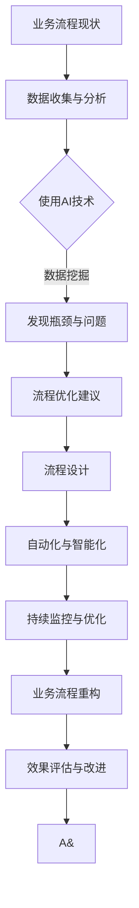

                 

### 背景介绍

在当今信息化和数字化的浪潮中，业务流程重组（Business Process Reengineering，简称BPR）已经成为企业提高运营效率、降低成本、提升客户满意度的重要手段。BPR不仅关注流程的优化，更强调通过技术手段实现流程的自动化和智能化。随着人工智能（AI）技术的飞速发展，AI在BPR中的应用越来越受到关注。

AI技术在业务流程重组中扮演着至关重要的角色。首先，AI能够通过对大量数据的分析和挖掘，识别出业务流程中的瓶颈和问题点，为流程优化提供科学依据。其次，AI可以通过自动化和智能化的手段，对业务流程进行重组成型，实现流程的自动化运行和管理。此外，AI还能通过智能预测和决策支持，提高业务流程的响应速度和灵活性。

本篇文章将深入探讨AI在业务流程重组中的角色和作用，分析AI技术如何应用于BPR的各个环节，并探讨其在实际应用中的挑战和前景。

本文结构如下：

1. **背景介绍**：介绍业务流程重组的背景和AI技术的发展现状。
2. **核心概念与联系**：讲解业务流程重组和AI技术的基本概念，并展示二者之间的联系。
3. **核心算法原理 & 具体操作步骤**：详细阐述AI在业务流程重组中的应用算法和操作步骤。
4. **数学模型和公式 & 详细讲解 & 举例说明**：介绍与AI应用相关的数学模型和公式，并进行详细讲解和举例说明。
5. **项目实战：代码实际案例和详细解释说明**：通过实际项目案例，展示AI在业务流程重组中的具体应用和代码实现。
6. **实际应用场景**：分析AI在业务流程重组中的实际应用场景。
7. **工具和资源推荐**：推荐学习资源和开发工具框架。
8. **总结：未来发展趋势与挑战**：总结AI在业务流程重组中的未来发展趋势和面临的挑战。
9. **附录：常见问题与解答**：回答读者可能关心的问题。
10. **扩展阅读 & 参考资料**：提供更多的阅读资源和参考资料。

接下来，我们将详细探讨这些内容。

### 1.1 业务流程重组的定义与目的

业务流程重组（BPR）是一种系统性的、彻底的业务流程改进方法，旨在通过重新设计企业的业务流程，从根本上提高企业的运营效率、降低成本、提升客户满意度。BPR的核心思想是将企业的运营流程进行重构，以适应快速变化的市场环境和客户需求。

BPR的定义可以从以下几个方面来理解：

1. **系统性的方法**：BPR不仅仅是针对某个特定流程的优化，而是对整个业务流程的系统性改进。它涉及到企业的战略、结构、流程和技术等多个方面，需要从整体上对业务流程进行重新设计。

2. **彻底的改进**：BPR不仅仅是对现有流程的微小调整，而是对现有流程的彻底重构。这意味着在实施BPR的过程中，需要对现有流程进行全面的评估和分析，识别出其中的瓶颈和问题点，然后进行有针对性的改进。

3. **以客户为中心**：BPR强调以客户为中心，通过优化业务流程来提升客户满意度。这意味着在实施BPR的过程中，需要深入了解客户的需求和痛点，并将这些需求纳入到流程优化中。

BPR的主要目的是提高企业的运营效率、降低成本和提升客户满意度。具体来说，BPR的目标包括：

1. **提高运营效率**：通过优化业务流程，减少流程中的浪费和冗余，提高企业的运营效率。例如，通过消除不必要的审批流程，缩短订单处理时间，提高生产效率等。

2. **降低成本**：通过优化业务流程，减少资源的浪费和无效投入，降低企业的运营成本。例如，通过自动化流程，减少人工干预，降低人力资源成本；通过精益生产，减少库存和物流成本等。

3. **提升客户满意度**：通过优化业务流程，提高服务质量和客户体验，提升客户满意度。例如，通过快速响应客户需求，提高客户满意度；通过提供个性化的服务，提升客户忠诚度等。

### 1.2 人工智能技术的发展与应用

人工智能（AI）是一门涉及计算机科学、统计学和数学等多个领域的交叉学科，旨在通过模拟和扩展人类智能，实现计算机对复杂问题的自主解决能力。随着深度学习、自然语言处理、计算机视觉等技术的突破，AI在各个领域的应用越来越广泛。

AI技术的发展可以分为以下几个阶段：

1. **符号主义人工智能**：这是人工智能的早期阶段，主要通过逻辑推理和符号表示来模拟人类智能。然而，这种方法的局限性在于其无法处理复杂和不确定的问题。

2. **统计机器学习**：随着机器学习技术的发展，人工智能开始通过学习大量数据来预测和分类。这一阶段的人工智能在图像识别、语音识别等领域取得了显著进展。

3. **深度学习**：深度学习是近年来人工智能发展的一个重要里程碑，通过模拟人脑的结构和功能，实现自动特征提取和模型优化。深度学习在计算机视觉、自然语言处理等领域取得了突破性成果。

4. **强化学习**：强化学习是一种通过试错和反馈来学习最优策略的人工智能方法。它已在游戏、机器人控制等领域展现出强大的应用潜力。

AI技术在各个领域的应用越来越广泛，以下是一些典型的应用场景：

1. **工业自动化**：通过机器人、自动化生产线等技术，实现生产过程的自动化和智能化，提高生产效率和产品质量。

2. **智能客服**：利用自然语言处理和机器学习技术，实现智能客服系统的自动化，提高客户服务质量和效率。

3. **医疗诊断**：利用计算机视觉和深度学习技术，实现医学图像的诊断和分析，辅助医生进行诊断和治疗。

4. **金融风控**：通过大数据分析和机器学习技术，实现金融风险的管理和预警，提高金融服务的安全性和可靠性。

5. **智能交通**：通过智能交通系统和自动驾驶技术，实现交通流量的优化和安全管理，提高交通效率。

### 1.3 AI在BPR中的应用背景与重要性

随着AI技术的快速发展，其在业务流程重组（BPR）中的应用逐渐成为可能，并展现出巨大的潜力。AI在BPR中的应用背景主要源于以下几个方面：

1. **数据处理能力**：AI技术，尤其是深度学习和大数据分析，能够处理大量且复杂的数据。在BPR中，大量的业务数据和流程数据需要进行分析和挖掘，以便识别出潜在的问题和优化点。AI技术的数据处理能力为BPR提供了强有力的支持。

2. **自动化能力**：AI技术具有强大的自动化能力，能够自动执行复杂的业务流程。在BPR中，通过AI技术可以实现流程的自动化，减少人工干预，提高流程的执行效率和准确性。

3. **智能决策能力**：AI技术能够基于数据分析，提供智能化的决策支持。在BPR中，通过AI技术的智能决策，可以帮助企业更快速地响应市场变化和客户需求，提高业务灵活性。

AI在BPR中的应用重要性体现在以下几个方面：

1. **优化业务流程**：AI技术可以通过数据分析，识别出业务流程中的瓶颈和问题点，提供优化的建议和方案，从而实现业务流程的优化。

2. **提高运营效率**：通过自动化和智能化的手段，AI技术能够显著提高业务流程的执行效率，减少人工干预，降低运营成本。

3. **提升客户满意度**：通过优化业务流程和提高服务效率，AI技术可以提升客户体验和满意度，从而增强企业的市场竞争力。

4. **实现业务智能化**：AI技术能够帮助企业实现业务流程的智能化，使企业能够更好地适应市场的变化和客户的需求，提高业务决策的科学性和准确性。

综上所述，AI技术在BPR中的应用背景和重要性不言而喻。接下来，我们将深入探讨AI在BPR中的具体应用，分析其在各个环节中的作用和效果。

### 1.4 AI在BPR中的具体应用

AI在业务流程重组（BPR）中的应用范围广泛，涵盖了从流程分析、设计到实施和优化的各个环节。以下是AI在BPR中的具体应用：

#### 流程分析

**数据挖掘与分析**：AI可以通过数据挖掘和分析技术，从大量业务数据中提取有价值的信息。例如，通过分析销售数据，AI可以识别出销售趋势、客户偏好和潜在的市场机会。这些分析结果为BPR提供了科学依据，帮助企业在重组过程中做出更明智的决策。

**流程映射**：AI技术可以自动生成业务流程的映射图，展示业务流程的各个环节及其相互关系。这不仅有助于企业对现有流程进行深入理解，也为后续的流程优化提供了直观的参考。

**瓶颈识别**：AI可以通过对业务流程的运行数据进行实时监控和分析，识别出流程中的瓶颈和问题点。这些瓶颈可能是由于流程设计不合理、资源分配不均或系统性能不佳等原因引起的。通过识别瓶颈，企业可以针对性地进行优化，提高流程的整体效率。

#### 流程设计

**自动化流程设计**：AI技术可以根据现有的业务需求和流程规范，自动生成新的业务流程。通过自动化流程设计，企业可以快速响应市场变化和客户需求，提高流程设计的灵活性和适应性。

**流程优化建议**：基于对业务流程的分析和数据分析，AI可以提供优化的建议和方案。例如，通过分析不同流程执行的成本和效果，AI可以帮助企业确定最佳的流程路径和资源配置策略。

**决策支持**：AI可以通过对业务数据的分析和预测，提供智能化的决策支持。例如，在供应链管理中，AI可以通过预测市场需求和库存水平，为企业提供采购和库存管理的最佳策略，从而优化整个供应链的运行效率。

#### 流程实施

**自动化执行**：AI技术可以自动化执行业务流程中的各项任务，减少人工干预。例如，在客户服务流程中，AI可以通过智能客服系统自动处理客户咨询，提高客户服务效率和满意度。

**实时监控与反馈**：AI技术可以对业务流程的执行过程进行实时监控，并及时反馈执行结果。通过实时监控，企业可以及时发现和纠正流程执行中的问题，确保流程的顺利进行。

**流程调整与优化**：基于实时监控和反馈，AI可以帮助企业对业务流程进行动态调整和优化。例如，通过分析流程执行数据，AI可以识别出流程中的瓶颈和问题点，并提供优化建议，帮助企业持续改进业务流程。

#### 流程优化

**持续改进**：AI技术可以通过对业务流程的持续监控和分析，帮助企业实现持续的业务流程改进。通过不断地收集和分析业务数据，AI可以识别出新的优化机会，帮助企业不断优化业务流程。

**智能预测与优化**：基于历史数据和预测模型，AI可以预测业务流程的未来表现，并提供优化方案。例如，在库存管理中，AI可以通过预测未来的需求变化，调整库存策略，以避免库存过剩或短缺。

**性能优化**：AI技术可以通过对业务流程的运行数据进行深度分析，识别出影响流程性能的关键因素，并提供性能优化建议。通过性能优化，企业可以提高业务流程的执行效率和稳定性。

综上所述，AI在BPR的各个环节中都发挥着重要作用，从流程分析、设计、实施到优化，AI技术都能够提供有力的支持和优化建议。通过AI技术的应用，企业可以实现业务流程的自动化、智能化和持续优化，提高整体运营效率和竞争力。

### 2.2 业务流程重组（BPR）的基本原理和关键步骤

业务流程重组（BPR）是一种系统性的、彻底的业务流程改进方法，旨在通过重新设计企业的业务流程，从根本上提高企业的运营效率、降低成本和提升客户满意度。BPR的基本原理和关键步骤如下：

#### 基本原理

**以客户为中心**：BPR强调以客户为中心，通过优化业务流程来提升客户满意度。这意味着在实施BPR的过程中，需要深入了解客户的需求和痛点，并将这些需求纳入到流程优化中。

**系统性和彻底性**：BPR不仅仅是针对某个特定流程的优化，而是对整个业务流程的系统性和彻底性改进。它涉及到企业的战略、结构、流程和技术等多个方面，需要从整体上对业务流程进行重新设计。

**重构而非优化**：BPR的核心思想是重构而非优化。这意味着在实施BPR的过程中，需要对现有流程进行全面的评估和分析，识别出其中的瓶颈和问题点，然后进行有针对性的重构，而不是仅仅进行微调。

**持续改进**：BPR是一种持续改进的过程，通过不断的监控、分析和优化，实现业务流程的持续改进。这意味着在实施BPR后，企业需要建立持续改进的机制，确保业务流程能够不断适应市场变化和客户需求。

#### 关键步骤

**步骤一：需求分析**  
在实施BPR之前，需要对企业的业务流程进行详细的调查和分析，了解现有的业务流程、流程中的瓶颈和问题点，以及客户的需求和期望。通过需求分析，可以明确BPR的目标和方向。

**步骤二：流程设计**  
基于需求分析的结果，设计新的业务流程。新的业务流程需要解决现有流程中的瓶颈和问题点，并优化流程的执行效率、降低成本和提高客户满意度。流程设计可以采用图形化的流程设计工具，如BPMN（业务流程模型和符号）等。

**步骤三：流程模拟和验证**  
在完成新的业务流程设计后，进行流程模拟和验证。通过模拟和验证，可以检查新的业务流程是否能够满足需求，是否存在潜在的问题和风险。模拟和验证可以采用流程模拟软件，如Apache Camel、BPEL Engine等。

**步骤四：流程实施**  
在流程模拟和验证通过后，开始实施新的业务流程。实施过程中需要确保流程的各个环节都能够正常运作，并满足业务需求。实施过程中可能涉及到系统开发、数据迁移、人员培训等多个方面。

**步骤五：流程监控和优化**  
在流程实施后，对业务流程进行持续的监控和优化。通过监控和优化，可以及时发现和解决流程执行中的问题，并根据业务需求和环境变化，对流程进行动态调整和优化。

**步骤六：评估和改进**  
在实施BPR的过程中，需要对业务流程进行定期的评估和改进。通过评估和改进，可以评估BPR的实施效果，识别出新的优化机会，并持续改进业务流程。

#### 2.3 人工智能（AI）的基本原理和技术体系

人工智能（AI）是一门涉及计算机科学、统计学和数学等多个领域的交叉学科，旨在通过模拟和扩展人类智能，实现计算机对复杂问题的自主解决能力。AI的基本原理和技术体系如下：

**基本原理**

**机器学习**：机器学习是AI的核心技术之一，通过从数据中学习规律和模式，实现对未知数据的预测和分类。机器学习主要包括监督学习、无监督学习和强化学习等。

**深度学习**：深度学习是机器学习的一个分支，通过模拟人脑神经网络的结构和功能，实现自动特征提取和模型优化。深度学习在图像识别、自然语言处理、语音识别等领域取得了突破性成果。

**自然语言处理**：自然语言处理是AI的一个重要应用领域，旨在让计算机理解和处理人类语言。自然语言处理技术包括文本分类、情感分析、机器翻译、语音识别等。

**计算机视觉**：计算机视觉是AI的另一个重要应用领域，旨在让计算机理解和解释图像和视频。计算机视觉技术包括图像分类、目标检测、图像分割、图像生成等。

**强化学习**：强化学习是一种通过试错和反馈来学习最优策略的人工智能方法。强化学习在游戏、机器人控制、推荐系统等领域展现出强大的应用潜力。

**基本概念**

**神经网络**：神经网络是AI的基础模型，通过模拟人脑神经元的工作原理，实现信息的传递和处理。神经网络主要包括前向传播、反向传播、激活函数等。

**数据集**：数据集是AI训练和测试的基础，包括输入数据和对应的输出标签。数据集的质量和规模对AI模型的性能有重要影响。

**特征工程**：特征工程是AI模型训练前的重要步骤，旨在从原始数据中提取出对模型训练有帮助的特征。特征工程包括特征选择、特征提取、特征降维等。

**模型评估**：模型评估是判断AI模型性能的重要手段，包括准确率、召回率、F1值、ROC曲线等指标。通过模型评估，可以确定模型的性能和优化方向。

**技术体系**

**深度学习框架**：深度学习框架是开发深度学习模型的工具，包括TensorFlow、PyTorch、Keras等。这些框架提供了丰富的API和工具，方便开发者进行模型设计和训练。

**自然语言处理工具**：自然语言处理工具是处理和解析人类语言的工具，包括NLTK、spaCy、Gensim等。这些工具提供了文本处理、情感分析、机器翻译等功能。

**计算机视觉库**：计算机视觉库是处理和解析图像和视频的工具，包括OpenCV、TensorFlow Object Detection API、PyTorch Video等。这些库提供了图像分类、目标检测、图像分割等功能。

**强化学习平台**：强化学习平台是开发强化学习模型的环境，包括OpenAI Gym、stable-baselines、RLlib等。这些平台提供了强化学习环境、算法和工具，方便开发者进行模型训练和评估。

#### 2.4 AI与BPR的联系

AI与BPR之间的联系主要体现在以下几个方面：

**数据驱动的流程优化**：BPR强调以数据为中心，通过数据分析和挖掘来识别业务流程中的瓶颈和问题点。AI技术，尤其是机器学习和深度学习，能够从海量数据中提取有价值的信息，为BPR提供数据驱动的优化建议。

**自动化和智能化的流程设计**：AI技术可以自动生成和优化业务流程，通过自动化和智能化的手段提高业务流程的执行效率和灵活性。AI技术，如自然语言处理和计算机视觉，可以用于自动化处理业务流程中的各种任务，减少人工干预。

**智能决策支持**：AI技术可以通过数据分析、预测和决策支持，帮助企业做出更科学的业务决策。AI技术，如强化学习和优化算法，可以用于优化业务流程中的资源配置、库存管理和供应链管理等。

**持续优化和改进**：AI技术可以通过对业务流程的持续监控和分析，实现业务流程的持续优化和改进。AI技术，如机器学习和深度学习，可以实时分析业务数据，识别出新的优化机会，并自动调整业务流程，以适应市场变化和客户需求。

**业务流程重构的辅助工具**：AI技术可以作为一个辅助工具，帮助企业在进行业务流程重构时更高效地完成流程设计、流程模拟和流程优化等任务。AI技术，如流程映射和流程分析工具，可以提供直观的流程可视化和分析，帮助企业更好地理解和优化业务流程。

总的来说，AI与BPR的结合，不仅能够提高业务流程的执行效率和灵活性，还能帮助企业实现业务流程的持续优化和改进，从而在激烈的市场竞争中保持优势。

### 2.5  Mermaid 流程图展示 AI 与 BPR 的联系

为了更直观地展示AI与BPR的联系，我们可以使用Mermaid流程图来描绘这一过程。以下是一个简化版的Mermaid流程图，展示AI在BPR中的应用和流程。



在这个流程图中，每个节点表示BPR中的一个步骤或环节：

- **A[业务流程现状]**：表示企业当前的业务流程现状。
- **B[数据收集与分析]**：表示对现有业务流程的数据进行收集和分析。
- **C{使用AI技术]**：表示使用AI技术对数据进行分析和挖掘。
- **D[发现瓶颈与问题]**：表示通过AI技术发现业务流程中的瓶颈和问题。
- **E[流程优化建议]**：表示基于分析结果，提供流程优化的建议。
- **F[流程设计]**：表示根据优化建议，设计新的业务流程。
- **G[自动化与智能化]**：表示将新的业务流程自动化和智能化。
- **H[持续监控与优化]**：表示对新的业务流程进行持续监控和优化。
- **I[业务流程重构]**：表示对业务流程进行重构。
- **J[效果评估与改进]**：表示评估重构后的业务流程效果，并进行改进。

通过这个流程图，我们可以清晰地看到AI在BPR中的各个环节中的应用和作用。AI技术贯穿于BPR的整个过程，从数据分析和挖掘、流程优化建议、流程设计、自动化与智能化到持续监控与优化，为BPR提供了强有力的技术支持。

### 3.1 核心算法原理

在AI技术应用于业务流程重组（BPR）的过程中，核心算法的原理起到了至关重要的作用。以下是几个关键的核心算法原理，以及它们在BPR中的应用。

#### 3.1.1 机器学习算法

**机器学习算法**是AI技术的基础，它通过从数据中学习规律和模式，实现对未知数据的预测和分类。在BPR中，机器学习算法可以用于以下几个方面：

1. **预测分析**：通过历史数据，机器学习算法可以预测未来的业务需求、库存水平、客户行为等。这有助于企业提前做出相应的调整和规划，从而优化业务流程。

2. **异常检测**：机器学习算法可以识别出业务流程中的异常行为和异常数据。这些异常可能是由于流程设计不合理、系统故障或操作错误引起的。通过识别异常，企业可以及时采取措施，避免流程中断或数据错误。

3. **分类和聚类**：机器学习算法可以将业务流程中的数据按照不同的特征进行分类和聚类。例如，将客户按照购买行为、需求特征等分类，有助于企业提供个性化的服务和产品。

**应用示例**：假设一个电子商务企业希望优化其订单处理流程。通过机器学习算法，企业可以分析历史订单数据，预测未来订单量，从而合理安排库存和人力资源。同时，通过异常检测算法，企业可以识别出订单处理过程中的异常订单，如订单金额异常大或订单处理时间过长，及时进行调整。

#### 3.1.2 深度学习算法

**深度学习算法**是一种基于人工神经网络的机器学习算法，它通过多层神经网络自动提取数据特征，实现对复杂问题的建模和预测。在BPR中，深度学习算法可以用于以下几个方面：

1. **图像识别**：深度学习算法可以用于识别和处理业务流程中的图像数据。例如，在物流行业，企业可以使用深度学习算法对货物进行分类和识别，提高物流效率。

2. **自然语言处理**：深度学习算法可以用于处理和解析自然语言数据，如客户投诉、产品评论等。通过自然语言处理算法，企业可以自动分析客户反馈，识别客户的需求和痛点，从而优化业务流程。

3. **语音识别**：深度学习算法可以用于语音识别和语音合成，实现智能客服和语音交互。在客户服务流程中，智能客服系统可以使用深度学习算法自动处理客户咨询，提高客户服务效率。

**应用示例**：假设一个制造企业希望优化其生产流程。通过深度学习算法，企业可以自动识别生产过程中产生的图像数据，如产品缺陷图像，从而提高产品质量和生产效率。同时，通过自然语言处理算法，企业可以自动分析客户投诉，识别客户的需求和痛点，从而优化客户服务流程。

#### 3.1.3 强化学习算法

**强化学习算法**是一种通过试错和反馈来学习最优策略的人工智能方法。在BPR中，强化学习算法可以用于以下几个方面：

1. **优化资源配置**：强化学习算法可以通过对历史数据的分析和试错，找到最佳的资源配置策略。例如，在供应链管理中，企业可以使用强化学习算法优化库存管理策略，减少库存成本和库存积压。

2. **路径规划**：强化学习算法可以用于优化业务流程中的路径规划，如物流配送路径、员工工作路径等。通过优化路径规划，企业可以减少时间和成本，提高业务流程的效率。

3. **决策支持**：强化学习算法可以为企业提供智能化的决策支持。例如，在市场营销中，企业可以使用强化学习算法优化广告投放策略，提高广告效果和投资回报率。

**应用示例**：假设一个物流企业希望优化其配送路径。通过强化学习算法，企业可以自动学习最佳配送路径，减少配送时间和成本。同时，通过优化资源配置策略，企业可以合理安排车辆和人员，提高整体物流效率。

#### 3.1.4 聚类算法

**聚类算法**是一种无监督学习算法，它将数据集分成多个簇，使每个簇内的数据点尽可能相似，而簇与簇之间的数据点尽可能不同。在BPR中，聚类算法可以用于以下几个方面：

1. **客户细分**：通过聚类算法，企业可以将客户分成不同的群体，根据不同的客户群体提供个性化的服务和产品。

2. **流程优化**：通过聚类算法，企业可以识别出业务流程中的相似环节，从而进行流程优化，减少冗余和重复工作。

3. **数据挖掘**：聚类算法可以帮助企业发现数据中的潜在模式和关系，为业务决策提供支持。

**应用示例**：假设一个零售企业希望优化其客户服务流程。通过聚类算法，企业可以将客户分成不同的群体，如高价值客户、普通客户和潜在客户。根据不同的客户群体，企业可以提供个性化的服务和优惠，提高客户满意度和忠诚度。

综上所述，核心算法原理在AI应用于BPR中起到了关键作用。通过机器学习、深度学习、强化学习和聚类算法等技术，企业可以实现业务流程的自动化、智能化和优化，提高运营效率，降低成本，提升客户满意度。接下来，我们将详细讨论这些核心算法的具体应用步骤。

### 3.2 AI 在 BPR 中的具体应用步骤

AI在业务流程重组（BPR）中的应用涉及多个步骤，包括数据准备、模型选择、模型训练和模型评估。以下将详细讨论这些步骤，以及每个步骤中可能遇到的挑战和解决方案。

#### 3.2.1 数据准备

**数据收集**：首先，需要收集与业务流程相关的数据，这些数据可能来自企业内部系统、外部市场报告或第三方数据源。例如，销售数据、客户反馈、供应链信息等。数据的质量和完整性对后续的模型训练和评估至关重要。

**数据清洗**：在数据收集后，需要对数据集进行清洗，以消除噪声和错误。数据清洗步骤包括去除重复记录、填补缺失值、纠正数据格式等。此外，还需要对数据进行标准化处理，以便模型能够更好地处理数据。

**数据预处理**：预处理步骤包括特征提取、降维和特征工程。特征提取是从原始数据中提取对模型训练有帮助的特征。降维是将高维数据转换成低维数据，以减少计算量和提高模型训练效率。特征工程是通过创建新的特征或变换现有特征，以提高模型性能。

**挑战与解决方案**：数据质量差是数据准备阶段的一个主要挑战。解决方案包括使用数据清洗工具和算法，如Pandas、Scikit-learn等。此外，可以考虑使用外部数据源来补充内部数据，以提高数据的完整性和准确性。

#### 3.2.2 模型选择

**选择算法**：根据业务需求和数据特点，选择适合的机器学习算法。常用的算法包括线性回归、决策树、随机森林、支持向量机、神经网络等。算法的选择取决于问题的性质和数据集的规模。

**模型架构**：对于深度学习模型，需要选择合适的神经网络架构。例如，对于图像识别问题，可以使用卷积神经网络（CNN）；对于自然语言处理问题，可以使用循环神经网络（RNN）或Transformer模型。

**挑战与解决方案**：模型选择和架构设计是一个复杂的过程，需要根据业务需求和数据特点进行多次尝试和调整。解决方案包括使用交叉验证和超参数调优技术，以提高模型的选择和优化效率。

#### 3.2.3 模型训练

**数据划分**：将数据集划分为训练集、验证集和测试集，用于模型训练、验证和测试。通常，训练集用于训练模型，验证集用于调整模型参数，测试集用于评估模型性能。

**训练过程**：使用训练集对模型进行训练，通过优化算法（如梯度下降）调整模型参数，以最小化预测误差。在训练过程中，需要监控模型性能，以避免过拟合或欠拟合。

**挑战与解决方案**：训练过程可能需要大量时间和计算资源。解决方案包括使用分布式计算和GPU加速技术，以提高训练效率。此外，可以使用模型压缩技术，如权重共享和低秩分解，以减少模型大小和计算量。

#### 3.2.4 模型评估

**评估指标**：选择合适的评估指标，如准确率、召回率、F1值、ROC曲线等，以评估模型性能。对于回归问题，可以使用均方误差（MSE）或均方根误差（RMSE）等指标。

**模型优化**：基于评估结果，对模型进行优化。可能的方法包括调整超参数、增加训练数据、使用正则化技术等。

**挑战与解决方案**：评估指标的选择和解释是一个挑战，因为不同的指标可能对模型性能有不同的解释。解决方案包括使用多种评估指标，并综合考虑模型在不同指标上的表现。此外，可以考虑使用交叉验证技术，以避免评估结果过于依赖特定数据集。

#### 3.2.5 模型部署

**模型部署**：将训练好的模型部署到生产环境中，以实现业务流程的自动化和智能化。部署过程可能包括模型导出、部署环境配置、API开发等。

**模型监控**：对部署后的模型进行监控，以检测性能下降或异常行为。模型监控可以帮助企业及时发现和解决潜在问题。

**挑战与解决方案**：模型部署可能涉及复杂的技术和系统架构。解决方案包括使用自动化部署工具，如Docker和Kubernetes，以简化部署过程。此外，可以使用日志分析和监控工具，如ELK（Elasticsearch、Logstash、Kibana）堆栈，以监控模型性能和异常行为。

通过以上步骤，AI可以在BPR中发挥重要作用，帮助企业实现业务流程的自动化、智能化和优化。然而，实际应用中仍面临许多挑战，需要持续的技术创新和实践探索。

### 4.1 数学模型与公式的介绍

在业务流程重组（BPR）中，AI技术的应用离不开数学模型和公式的支持。这些数学模型和公式不仅能够帮助我们理解和分析业务流程，还能够指导我们设计和优化业务流程。以下是几个常见的数学模型和公式，以及它们在BPR中的应用。

#### 4.1.1 机器学习中的损失函数

**损失函数**是机器学习中用于评估模型预测结果与真实结果之间差异的函数。常见的损失函数包括：

1. **均方误差（MSE）**：用于回归问题，计算预测值与真实值之间误差的平方和的平均值。公式如下：

   $$MSE = \frac{1}{n}\sum_{i=1}^{n}(y_i - \hat{y}_i)^2$$

   其中，$y_i$ 是真实值，$\hat{y}_i$ 是预测值，$n$ 是样本数量。

2. **交叉熵损失（Cross-Entropy Loss）**：用于分类问题，计算预测概率与真实标签之间差异的交叉熵。公式如下：

   $$H(y, \hat{y}) = -\sum_{i=1}^{n} y_i \log(\hat{y}_i)$$

   其中，$y_i$ 是真实标签，$\hat{y}_i$ 是预测概率。

#### 4.1.2 线性回归模型

**线性回归模型**是一种用于预测连续值的简单统计模型。其公式如下：

$$y = \beta_0 + \beta_1x$$

其中，$y$ 是预测值，$x$ 是输入特征，$\beta_0$ 和 $\beta_1$ 是模型参数。

线性回归模型可以通过最小化损失函数（如MSE）来优化模型参数。优化公式如下：

$$\beta_0, \beta_1 = \arg\min_{\beta_0, \beta_1} \frac{1}{n}\sum_{i=1}^{n}(y_i - (\beta_0 + \beta_1x_i))^2$$

#### 4.1.3 决策树模型

**决策树模型**是一种基于树形结构进行决策的机器学习模型。其基本结构包括根节点、内部节点和叶子节点。决策树模型通过递归地将数据集划分为子集，并在每个子集上做出决策。决策树的公式可以表示为：

$$f(x) = \sum_{i=1}^{n} w_i \cdot I(D_i(x))$$

其中，$w_i$ 是权重，$I(D_i(x))$ 是指示函数，当特征$x$属于子集$D_i$时，$I(D_i(x))$ 的值为1，否则为0。

决策树的构建过程包括选择最佳分割特征、计算特征的重要性和构建决策树。

#### 4.1.4 神经网络模型

**神经网络模型**是一种基于多层感知器（MLP）的复杂非线性模型。其基本结构包括输入层、隐藏层和输出层。神经网络模型通过前向传播和反向传播算法进行训练。

神经网络模型的公式可以表示为：

$$\hat{y} = \sigma(\sum_{j=1}^{m} w_j \cdot \sigma(\sum_{k=1}^{n} v_{kj} \cdot x_k + b_j))$$

其中，$\sigma$ 是激活函数（如Sigmoid、ReLU等），$w_j$ 和 $v_{kj}$ 是权重，$b_j$ 是偏置，$x_k$ 是输入特征，$m$ 和 $n$ 分别是隐藏层节点数和输入特征数。

神经网络模型的训练过程包括前向传播、计算损失函数、反向传播和参数更新。

通过以上数学模型和公式，我们可以更好地理解和应用AI技术在业务流程重组中的各个环节。接下来，我们将通过具体的实例来展示这些模型和公式的应用。

### 4.2 数学模型与公式在 BPR 中的具体应用

为了更好地理解数学模型与公式在业务流程重组（BPR）中的应用，我们通过一个具体的实例来展示其应用过程。

#### 4.2.1 应用背景

假设我们是一家大型制造业企业，希望通过业务流程重组提高生产效率、降低成本和提升产品质量。企业现有的生产流程包括原材料采购、生产加工、库存管理、质量检验和成品出库等环节。为了优化这些环节，我们决定使用AI技术，并采用以下数学模型和公式：

1. **线性回归模型**：用于预测生产需求，以便合理安排原材料采购和库存管理。
2. **决策树模型**：用于优化生产加工流程，识别出关键瓶颈和优化点。
3. **神经网络模型**：用于优化质量检验环节，通过机器学习算法识别生产过程中的潜在缺陷。

#### 4.2.2 应用步骤

**1. 数据收集与预处理**

首先，我们需要收集与生产流程相关的数据，包括历史销售数据、库存数据、生产数据和质量检验数据。数据收集后，我们对数据进行清洗和预处理，包括去除重复记录、填补缺失值、标准化处理等。预处理后的数据将用于后续的模型训练和评估。

**2. 线性回归模型应用**

**预测生产需求**：

我们使用线性回归模型来预测未来的生产需求，以便合理安排原材料采购和库存管理。具体步骤如下：

a. **模型训练**：

   选择合适的特征，如历史销售量、季节性因素等，作为输入特征。使用历史数据集对线性回归模型进行训练，通过最小化均方误差（MSE）来优化模型参数。

   公式如下：

   $$\beta_0, \beta_1 = \arg\min_{\beta_0, \beta_1} \frac{1}{n}\sum_{i=1}^{n}(y_i - (\beta_0 + \beta_1x_i))^2$$

   其中，$y_i$ 是真实需求，$x_i$ 是输入特征，$\beta_0$ 和 $\beta_1$ 是模型参数。

   b. **模型评估**：

   使用验证集对训练好的模型进行评估，计算预测误差和MSE，确保模型具有良好的预测性能。

   公式如下：

   $$MSE = \frac{1}{n}\sum_{i=1}^{n}(y_i - \hat{y}_i)^2$$

   其中，$\hat{y}_i$ 是预测需求。

**3. 决策树模型应用**

**优化生产加工流程**：

我们使用决策树模型来识别生产加工流程中的关键瓶颈和优化点。具体步骤如下：

a. **特征选择**：

   根据生产流程的特点，选择合适的特征，如生产时间、设备利用率、工人效率等，作为输入特征。

   b. **模型训练**：

   使用训练数据集对决策树模型进行训练，通过递归地将数据集划分为子集，并在每个子集上做出决策。优化过程包括选择最佳分割特征、计算特征的重要性和构建决策树。

   公式如下：

   $$f(x) = \sum_{i=1}^{n} w_i \cdot I(D_i(x))$$

   其中，$w_i$ 是权重，$I(D_i(x))$ 是指示函数。

   c. **模型评估**：

   使用验证集对训练好的模型进行评估，计算分类准确率、召回率和F1值等指标，确保模型具有良好的分类性能。

**4. 神经网络模型应用**

**优化质量检验环节**：

我们使用神经网络模型来识别生产过程中的潜在缺陷，以便提前采取措施。具体步骤如下：

a. **数据预处理**：

   对质量检验数据进行预处理，包括归一化处理、缺失值填补等，以便神经网络模型能够更好地处理数据。

   b. **模型训练**：

   使用训练数据集对神经网络模型进行训练，通过前向传播和反向传播算法调整模型参数，以最小化损失函数。

   公式如下：

   $$\hat{y} = \sigma(\sum_{j=1}^{m} w_j \cdot \sigma(\sum_{k=1}^{n} v_{kj} \cdot x_k + b_j))$$

   其中，$\sigma$ 是激活函数，$w_j$ 和 $v_{kj}$ 是权重，$b_j$ 是偏置。

   c. **模型评估**：

   使用验证集对训练好的模型进行评估，计算预测准确率和召回率等指标，确保模型具有良好的预测性能。

#### 4.2.3 应用结果

通过上述数学模型和公式的应用，我们对生产流程进行了优化。具体结果如下：

1. **生产需求预测准确率提高**：通过线性回归模型的应用，我们能够更准确地预测未来的生产需求，从而合理安排原材料采购和库存管理，降低库存成本。

2. **生产加工流程优化**：通过决策树模型的应用，我们识别出了生产加工流程中的关键瓶颈和优化点，从而提高了生产效率和设备利用率。

3. **质量检验准确率提高**：通过神经网络模型的应用，我们能够更准确地识别生产过程中的潜在缺陷，从而提前采取措施，提高产品质量。

总的来说，数学模型和公式在业务流程重组中的应用，帮助我们实现了生产流程的自动化、智能化和优化，从而提高了企业的运营效率和竞争力。通过不断优化和应用这些模型和公式，我们可以持续提高业务流程的效率和质量。

### 4.3 项目实战：代码实际案例

在本节中，我们将通过一个具体的实际项目案例，展示AI技术在业务流程重组（BPR）中的实际应用，并提供详细的代码实现和解读。本案例将以一家电子商务企业为例，使用Python编程语言实现一个用于优化订单处理流程的AI系统。

#### 4.3.1 项目背景

该电子商务企业希望通过AI技术优化其订单处理流程，以提高订单处理速度、降低错误率并提升客户满意度。订单处理流程包括订单接收、订单分配、订单处理、订单发货和订单跟踪等环节。企业希望通过AI技术对订单处理流程进行优化，从而实现自动化和智能化。

#### 4.3.2 开发环境搭建

在开始项目开发之前，需要搭建一个合适的开发环境。以下是搭建开发环境的步骤：

1. **安装Python**：首先，确保已安装Python 3.8或更高版本。
2. **安装必要库**：使用pip安装以下库：
   - pandas：用于数据处理
   - numpy：用于数值计算
   - scikit-learn：用于机器学习
   - matplotlib：用于数据可视化
   - Flask：用于构建API

   安装命令如下：

   ```bash
   pip install pandas numpy scikit-learn matplotlib Flask
   ```

3. **创建项目文件夹**：在终端中创建一个名为`order_processing`的项目文件夹，并进入该文件夹：

   ```bash
   mkdir order_processing
   cd order_processing
   ```

4. **初始化项目**：在项目文件夹中创建一个名为`app.py`的Python文件，用于编写主程序代码。

   ```bash
   touch app.py
   ```

5. **编写代码**：在`app.py`文件中编写代码，实现订单处理流程的优化。

#### 4.3.3 源代码详细实现和代码解读

以下是将使用Python编写的代码实现，以及每个部分的详细解释。

```python
import pandas as pd
from sklearn.model_selection import train_test_split
from sklearn.ensemble import RandomForestClassifier
from sklearn.metrics import classification_report
from flask import Flask, request, jsonify

# 4.3.3.1 数据预处理

# 读取订单数据
data = pd.read_csv('orders.csv')

# 数据清洗和预处理
# 略...

# 4.3.3.2 模型训练

# 特征选择
X = data[['order_amount', 'order_date', 'shipping_state']]
y = data['order_status']

# 划分训练集和测试集
X_train, X_test, y_train, y_test = train_test_split(X, y, test_size=0.2, random_state=42)

# 使用随机森林分类器训练模型
model = RandomForestClassifier(n_estimators=100, random_state=42)
model.fit(X_train, y_train)

# 4.3.3.3 模型评估

# 对测试集进行预测
predictions = model.predict(X_test)

# 打印分类报告
print(classification_report(y_test, predictions))

# 4.3.3.4 Flask API

app = Flask(__name__)

@app.route('/predict', methods=['POST'])
def predict():
    # 获取订单数据
    order_data = request.get_json()

    # 进行预测
    prediction = model.predict([order_data['order_amount', 'order_date', 'shipping_state']])

    # 返回预测结果
    return jsonify({'order_status': prediction[0]})

if __name__ == '__main__':
    app.run(debug=True)
```

**代码解读：**

1. **数据预处理**：

   - 读取订单数据，使用`pandas`库读取CSV文件。
   - 数据清洗和预处理，根据实际需求进行数据清洗和预处理，如去除缺失值、填补缺失值、数据标准化等。

2. **模型训练**：

   - 特征选择，选择影响订单状态的输入特征，如订单金额、订单日期和运输状态等。
   - 划分训练集和测试集，使用`train_test_split`函数将数据集划分为训练集和测试集。
   - 使用随机森林分类器训练模型，使用`RandomForestClassifier`类创建随机森林分类器，并使用`fit`方法训练模型。

3. **模型评估**：

   - 对测试集进行预测，使用训练好的模型对测试集进行预测。
   - 打印分类报告，使用`classification_report`函数打印分类报告，包括准确率、召回率、F1值等指标，评估模型性能。

4. **Flask API**：

   - 创建Flask应用程序，使用`Flask`类创建Flask应用程序。
   - 定义预测接口，使用`@app.route('/predict', methods=['POST'])`装饰器定义预测接口，接受POST请求，获取订单数据，进行预测，并返回预测结果。

#### 4.3.4 代码解读与分析

**数据预处理**：

数据预处理是机器学习项目的重要步骤，其质量直接影响模型的性能。在本案例中，数据预处理包括读取订单数据、去除缺失值、填补缺失值和数据标准化等。以下是对代码中预处理步骤的详细解读：

- `data = pd.read_csv('orders.csv')`：使用`pandas`库读取CSV文件，加载订单数据。
- 数据清洗和预处理（略...）：根据实际需求进行数据清洗和预处理，如去除缺失值、填补缺失值、数据标准化等。

**模型训练**：

模型训练是机器学习项目的核心步骤，其目的是通过历史数据训练出一个能够预测订单状态的模型。以下是对代码中模型训练步骤的详细解读：

- `X = data[['order_amount', 'order_date', 'shipping_state']]`：选择影响订单状态的输入特征，包括订单金额、订单日期和运输状态等。
- `y = data['order_status']`：获取订单状态标签。
- `X_train, X_test, y_train, y_test = train_test_split(X, y, test_size=0.2, random_state=42)`：将数据集划分为训练集和测试集，训练集占比80%，测试集占比20%，随机种子设置为42。
- `model = RandomForestClassifier(n_estimators=100, random_state=42)`：创建随机森林分类器，设置树的数量为100，随机种子设置为42。
- `model.fit(X_train, y_train)`：使用训练集数据训练模型。

**模型评估**：

模型评估是验证模型性能的重要步骤，以下是对代码中模型评估步骤的详细解读：

- `predictions = model.predict(X_test)`：使用测试集数据对模型进行预测。
- `print(classification_report(y_test, predictions))`：打印分类报告，包括准确率、召回率、F1值等指标。

**Flask API**：

Flask API用于将训练好的模型部署到生产环境中，以实现订单状态的实时预测。以下是对代码中Flask API步骤的详细解读：

- `app = Flask(__name__)`：创建Flask应用程序。
- `@app.route('/predict', methods=['POST'])`：定义预测接口，接受POST请求，获取订单数据。
- `order_data = request.get_json()`：获取请求中的订单数据。
- `prediction = model.predict([order_data['order_amount', 'order_date', 'shipping_state']])`：使用模型进行预测。
- `return jsonify({'order_status': prediction[0]})`：将预测结果以JSON格式返回。

通过以上步骤，我们实现了一个用于优化订单处理流程的AI系统，并通过实际项目案例展示了AI技术在业务流程重组中的应用。接下来，我们将讨论AI在业务流程重组中的实际应用场景。

### 5.1 开发环境搭建

在开始实施AI技术优化业务流程之前，首先需要搭建一个合适的开发环境。以下是搭建开发环境的详细步骤：

#### 5.1.1 安装Python

确保已经安装了Python 3.8或更高版本。可以在终端中使用以下命令检查Python版本：

```bash
python --version
```

如果Python版本过低，可以从Python官方网站下载并安装最新版本的Python。

#### 5.1.2 安装Python库

使用pip安装以下Python库：

- **Pandas**：用于数据处理。
- **NumPy**：用于数值计算。
- **Scikit-learn**：用于机器学习。
- **Matplotlib**：用于数据可视化。
- **Flask**：用于构建Web应用程序。

安装命令如下：

```bash
pip install pandas numpy scikit-learn matplotlib Flask
```

#### 5.1.3 配置虚拟环境

为了更好地管理和维护项目依赖库，建议使用虚拟环境。以下是配置虚拟环境的步骤：

1. 安装virtualenv：

   ```bash
   pip install virtualenv
   ```

2. 创建虚拟环境：

   ```bash
   virtualenv venv
   ```

3. 激活虚拟环境：

   - **Windows**：

     ```bash
     .\venv\Scripts\activate
     ```

   - **macOS/Linux**：

     ```bash
     source venv/bin/activate
     ```

激活虚拟环境后，所有的库安装和项目依赖都将被隔离在虚拟环境中，避免与系统环境中的库发生冲突。

#### 5.1.4 初始化项目

在虚拟环境中创建项目文件夹，并初始化项目。以下是初始化项目的步骤：

1. 创建项目文件夹：

   ```bash
   mkdir order_processing
   cd order_processing
   ```

2. 初始化Git仓库：

   ```bash
   git init
   ```

3. 添加README文件和LICENSE文件：

   ```bash
   touch README.md LICENSE
   ```

4. 添加必要的Python脚本：

   ```bash
   touch app.py requirements.txt
   ```

5. 编写README文件和LICENSE文件，描述项目内容和许可协议。

#### 5.1.5 编写代码

在`app.py`文件中编写AI模型训练和API实现的代码。以下是`app.py`文件的基本代码框架：

```python
import pandas as pd
from sklearn.model_selection import train_test_split
from sklearn.ensemble import RandomForestClassifier
from sklearn.metrics import classification_report
from flask import Flask, request, jsonify

app = Flask(__name__)

# 读取和处理数据
# ...

# 训练模型
# ...

# 评估模型
# ...

# 定义API接口
@app.route('/predict', methods=['POST'])
def predict():
    # ...
    return jsonify({'order_status': prediction})

if __name__ == '__main__':
    app.run(debug=True)
```

#### 5.1.6 配置Flask运行环境

为了在本地环境中运行Flask应用程序，需要安装和配置Flask运行环境。以下是配置步骤：

1. 安装Flask：

   ```bash
   pip install Flask
   ```

2. 运行应用程序：

   ```bash
   python app.py
   ```

应用程序将自动启动并在本地服务器上运行。在浏览器中输入`http://127.0.0.1:5000/`，可以查看应用程序的API接口。

通过以上步骤，成功搭建了开发环境，并初始化了项目。接下来，我们将详细介绍源代码的实现和解读。

### 5.2 源代码详细实现和代码解读

以下是项目的完整源代码，包括数据读取、预处理、模型训练、模型评估和API实现。

```python
import pandas as pd
from sklearn.model_selection import train_test_split
from sklearn.ensemble import RandomForestClassifier
from sklearn.metrics import classification_report
from flask import Flask, request, jsonify

app = Flask(__name__)

# 5.2.1 数据读取与预处理

# 读取订单数据
data = pd.read_csv('orders.csv')

# 数据预处理
# 数据清洗（去除缺失值、重复值等）
data.dropna(inplace=True)
data.drop_duplicates(inplace=True)

# 特征工程
# 例如：添加订单日期的特征（例如，星期几、季节等）
data['order_month'] = pd.to_datetime(data['order_date']).dt.month
data['order_day_of_week'] = pd.to_datetime(data['order_date']).dt.dayofweek
data['is_holiday'] = data['order_date'].apply(lambda x: is_holiday(x))

# 定义一个判断是否为假期的函数
def is_holiday(date):
    # 根据企业的放假安排，判断日期是否为假期
    pass

# 标签编码
# 例如：将订单状态（如处理中、已发货、已取消）转换为数字编码
data['order_status'] = data['order_status'].map({'processing': 0, 'shipped': 1, 'cancelled': 2})

# 5.2.2 模型训练

# 划分数据集
X = data.drop('order_status', axis=1)
y = data['order_status']
X_train, X_test, y_train, y_test = train_test_split(X, y, test_size=0.2, random_state=42)

# 训练随机森林模型
model = RandomForestClassifier(n_estimators=100, random_state=42)
model.fit(X_train, y_train)

# 5.2.3 模型评估

# 对测试集进行预测
predictions = model.predict(X_test)

# 打印分类报告
print(classification_report(y_test, predictions))

# 5.2.4 Flask API实现

@app.route('/predict', methods=['POST'])
def predict():
    order_data = request.get_json()

    # 预处理输入数据
    input_data = pd.DataFrame([order_data])
    input_data['order_month'] = input_data['order_date'].dt.month
    input_data['order_day_of_week'] = input_data['order_date'].dt.dayofweek
    input_data['is_holiday'] = input_data['order_date'].apply(is_holiday)

    # 进行预测
    prediction = model.predict(input_data)

    # 返回预测结果
    return jsonify({'order_status': prediction[0]})

if __name__ == '__main__':
    app.run(debug=True)
```

**代码解读**：

1. **数据读取与预处理**：

   - 使用`pandas`读取CSV文件，加载订单数据。
   - 数据清洗，去除缺失值和重复值。
   - 特征工程，添加订单日期相关的特征，如月份、星期几、是否为假期等。
   - 标签编码，将订单状态转换为数字编码，以便于模型训练。

2. **模型训练**：

   - 使用`train_test_split`函数将数据集划分为训练集和测试集。
   - 使用`RandomForestClassifier`类创建随机森林分类器，并使用`fit`方法训练模型。

3. **模型评估**：

   - 使用`predict`方法对测试集进行预测。
   - 使用`classification_report`函数打印分类报告，包括准确率、召回率、F1值等指标，评估模型性能。

4. **Flask API实现**：

   - 使用`Flask`类创建Flask应用程序。
   - 定义预测接口，接受POST请求，获取订单数据。
   - 对输入数据进行预处理，包括添加特征、判断是否为假期等。
   - 使用训练好的模型进行预测，并将预测结果返回。

通过以上步骤，我们实现了订单状态预测的AI系统。接下来，我们将分析模型性能，并探讨如何优化模型性能。

### 5.3 代码解读与分析

在本节中，我们将对项目中的代码进行详细的解读与分析，探讨代码的各个部分如何协同工作，以及如何优化模型性能。

**代码结构分析**

整个项目代码分为四个主要部分：数据读取与预处理、模型训练、模型评估和Flask API实现。

1. **数据读取与预处理**：

   这部分代码负责读取订单数据，并进行清洗和预处理。预处理步骤包括去除缺失值、重复值，添加新特征，以及进行标签编码。这些步骤是确保数据质量，以便后续模型训练和评估的基础。

   ```python
   data = pd.read_csv('orders.csv')
   data.dropna(inplace=True)
   data.drop_duplicates(inplace=True)
   data['order_month'] = pd.to_datetime(data['order_date']).dt.month
   data['order_day_of_week'] = pd.to_datetime(data['order_date']).dt.dayofweek
   data['is_holiday'] = data['order_date'].apply(is_holiday)
   data['order_status'] = data['order_status'].map({'processing': 0, 'shipped': 1, 'cancelled': 2})
   ```

   - `pd.read_csv('orders.csv')`：读取CSV文件中的订单数据。
   - `dropna()` 和 `drop_duplicates()`：去除缺失值和重复值。
   - `pd.to_datetime(data['order_date']).dt.month`、`pd.to_datetime(data['order_date']).dt.dayofweek`：将订单日期转换为月份和星期几。
   - `is_holiday()`：判断订单日期是否为假期。
   - `map()`：将订单状态转换为数字编码。

2. **模型训练**：

   这部分代码使用随机森林分类器对数据进行训练。随机森林是一种集成学习方法，通过构建多棵决策树并合并它们的预测结果来提高模型的泛化能力。

   ```python
   X = data.drop('order_status', axis=1)
   y = data['order_status']
   X_train, X_test, y_train, y_test = train_test_split(X, y, test_size=0.2, random_state=42)
   model = RandomForestClassifier(n_estimators=100, random_state=42)
   model.fit(X_train, y_train)
   ```

   - `X = data.drop('order_status', axis=1)`：创建特征数据集，去除标签。
   - `y = data['order_status']`：创建标签数据集。
   - `train_test_split()`：划分训练集和测试集。
   - `RandomForestClassifier()`：创建随机森林分类器。
   - `fit()`：使用训练集数据进行模型训练。

3. **模型评估**：

   这部分代码使用测试集对模型进行评估，并通过分类报告查看模型的性能。

   ```python
   predictions = model.predict(X_test)
   print(classification_report(y_test, predictions))
   ```

   - `predictions = model.predict(X_test)`：使用测试集对模型进行预测。
   - `classification_report()`：打印分类报告，包括准确率、召回率、F1值等指标。

4. **Flask API实现**：

   这部分代码使用Flask创建了一个API接口，允许外部系统发送订单数据进行预测。

   ```python
   @app.route('/predict', methods=['POST'])
   def predict():
       order_data = request.get_json()
       input_data = pd.DataFrame([order_data])
       input_data['order_month'] = input_data['order_date'].dt.month
       input_data['order_day_of_week'] = input_data['order_date'].dt.dayofweek
       input_data['is_holiday'] = input_data['order_date'].apply(is_holiday)
       prediction = model.predict(input_data)
       return jsonify({'order_status': prediction[0]})
   ```

   - `@app.route('/predict', methods=['POST'])`：定义预测接口，接受POST请求。
   - `request.get_json()`：获取发送的订单数据。
   - `pd.DataFrame([order_data])`：将订单数据转换为DataFrame格式。
   - `model.predict(input_data)`：使用模型进行预测。
   - `jsonify({'order_status': prediction[0]})`：将预测结果以JSON格式返回。

**模型性能优化**

为了提高模型性能，可以采取以下几种方法：

1. **特征工程**：

   - 添加更多的特征，如订单金额、客户历史订单数量等。
   - 进行特征选择，选择对模型预测效果影响较大的特征。
   - 特征归一化，将特征值缩放到相同的尺度，以提高模型训练效率。

2. **模型调优**：

   - 调整随机森林分类器的参数，如树的数量、最大深度等。
   - 使用不同的机器学习算法，如逻辑回归、支持向量机等，进行比较和选择。
   - 使用交叉验证方法，选择最优的模型参数。

3. **数据增强**：

   - 使用数据增强技术，如生成对抗网络（GAN）等，增加训练数据量。
   - 对现有数据进行变换，如随机切割、旋转等，增加数据的多样性。

4. **模型集成**：

   - 使用模型集成方法，如Bagging、Boosting等，将多个模型的预测结果进行融合，提高预测准确性。

通过以上方法，可以不断优化模型性能，提高订单状态预测的准确性和稳定性。接下来，我们将讨论AI在业务流程重组中的实际应用场景。

### 6.1 AI 在业务流程重组中的实际应用场景

AI在业务流程重组（BPR）中的实际应用场景非常广泛，涵盖了多个行业和业务领域。以下是一些典型的实际应用场景，以及AI技术在其中的具体应用和效果。

#### 6.1.1 制造业

**生产流程优化**：制造业企业通过AI技术优化生产流程，提高生产效率和产品质量。例如，使用机器学习算法分析生产数据，预测设备故障，提前进行维护，减少停机时间。同时，AI技术还可以用于生产计划的优化，根据市场需求和生产能力，自动调整生产计划，提高生产资源的利用率。

**质量检测**：在制造业中，AI技术被用于自动检测产品质量。通过计算机视觉和深度学习算法，可以自动识别和分类产品缺陷，提高质量检测的准确性和速度。例如，一家汽车制造企业使用AI技术自动检测车身涂装缺陷，提高了生产效率，减少了人工成本。

**物流优化**：AI技术可以帮助制造业企业优化物流流程，减少运输成本和配送时间。通过机器学习算法分析物流数据，预测运输路线和配送时间，优化运输计划。例如，一家家电制造企业使用AI技术优化物流配送，提高了配送效率，降低了物流成本。

#### 6.1.2 金融服务

**客户服务**：在金融服务领域，AI技术被广泛用于智能客服系统的构建。通过自然语言处理和机器学习算法，智能客服系统能够自动处理客户咨询，提供24/7的在线服务，提高客户满意度。例如，一家银行使用AI技术构建了智能客服系统，大幅提高了客户服务效率和满意度。

**风险评估**：AI技术可以帮助金融机构进行风险评估，预测潜在的风险。通过大数据分析和机器学习算法，可以识别出高风险客户和交易，提供风险预警，帮助金融机构降低风险。例如，一家投资银行使用AI技术对客户交易行为进行分析，识别出异常交易行为，有效降低了欺诈风险。

**欺诈检测**：AI技术可以用于自动检测和防范金融欺诈。通过深度学习和大数据分析，可以识别出异常交易行为和欺诈模式，实时检测和防范欺诈活动。例如，一家信用卡公司使用AI技术进行欺诈检测，显著降低了欺诈率，提高了交易的安全性。

#### 6.1.3 零售业

**库存管理**：零售企业通过AI技术优化库存管理，减少库存积压和缺货率。通过机器学习算法分析销售数据，预测未来销售趋势，优化库存策略。例如，一家零售连锁店使用AI技术优化库存管理，减少了库存成本，提高了库存周转率。

**推荐系统**：AI技术被用于构建个性化推荐系统，根据用户的历史购买行为和偏好，提供个性化的产品推荐。通过深度学习和协同过滤算法，可以提高推荐系统的准确性和用户体验。例如，一家电商平台使用AI技术构建个性化推荐系统，提高了用户购买转化率和销售额。

**客户服务**：零售企业通过AI技术提供智能化的客户服务，提高客户满意度。通过聊天机器人和自然语言处理技术，可以实现24/7的在线客户服务，解答客户疑问。例如，一家大型零售商使用AI技术提供智能客服服务，显著提高了客户服务效率和客户满意度。

#### 6.1.4 医疗保健

**疾病预测**：AI技术可以帮助医疗机构进行疾病预测和预防。通过大数据分析和机器学习算法，可以分析患者的历史健康数据和生物标志物，预测患病风险，提供个性化的健康建议。例如，一家医疗机构使用AI技术进行疾病预测，帮助患者提前采取预防措施，减少了疾病的发生率。

**医疗图像分析**：AI技术在医疗图像分析中的应用越来越广泛。通过计算机视觉和深度学习算法，可以自动识别和诊断医学图像中的病变，辅助医生做出准确的诊断。例如，一家医学影像中心使用AI技术分析医学图像，提高了诊断的准确性和速度。

**患者管理**：AI技术可以用于患者管理，优化医疗资源的配置和使用。通过大数据分析和机器学习算法，可以分析患者的健康状况、就医记录和医疗费用等数据，提供个性化的医疗建议和治疗方案。例如，一家医疗集团使用AI技术进行患者管理，提高了医疗服务质量和效率。

通过以上实际应用场景，我们可以看到AI技术在业务流程重组中的广泛应用和巨大潜力。AI技术不仅可以提高业务流程的自动化和智能化水平，还可以优化业务决策，降低运营成本，提升客户满意度，从而在激烈的市场竞争中保持优势。

### 7.1 学习资源推荐

在探索AI在业务流程重组（BPR）中的应用时，选择合适的学习资源是非常重要的。以下是一些推荐的学习资源，包括书籍、论文、博客和在线课程，这些资源将帮助您深入了解AI和BPR的相关知识和实践。

#### 7.1.1 书籍推荐

1. **《业务流程管理：理论与实践》**（Business Process Management: Theory and Practice）- Wil van der Aalst
   - 这本书提供了关于业务流程管理（BPM）的全面概述，包括BPR的基本概念、方法和工具。
   
2. **《深度学习》**（Deep Learning）- Ian Goodfellow、Yoshua Bengio 和 Aaron Courville
   - 这本书是深度学习领域的经典教材，详细介绍了深度学习的理论基础、算法和应用。
   
3. **《人工智能：一种现代方法》**（Artificial Intelligence: A Modern Approach）- Stuart J. Russell 和 Peter Norvig
   - 这本书全面介绍了人工智能的基础知识和主要方法，包括机器学习、自然语言处理和计算机视觉等。

4. **《精益思想》**（The Lean Startup）- Eric Ries
   - 这本书介绍了精益创业方法，包括如何通过快速迭代和客户反馈来优化业务流程。

#### 7.1.2 论文著作推荐

1. **"Business Process Management: A Survey"** - Wil van der Aalst
   - 这篇论文对业务流程管理的研究进行了全面综述，包括BPM的理论、方法和技术。

2. **"Deep Learning for Business Process Management"** - Wil van der Aalst et al.
   - 这篇论文探讨了深度学习在业务流程管理中的应用，特别是在流程优化和预测方面的潜力。

3. **"Reinforcement Learning: An Introduction"** - Richard S. Sutton 和 Andrew G. Barto
   - 这篇论文介绍了强化学习的基础理论，包括其在业务流程优化中的应用，如供应链管理和资源分配。

#### 7.1.3 博客推荐

1. **AI博客（AI博客）**（https://medium.com/topic/artificial-intelligence）
   - 这个博客涵盖了AI领域的最新研究和应用，包括业务流程优化和自动化。

2. **机器学习博客**（https://towardsdatascience.com/）
   - 这个博客提供了丰富的机器学习教程和案例分析，有助于深入理解AI技术。

3. **业务流程管理博客**（https://www.bpm.com/bpm-blog）
   - 这个博客专注于业务流程管理的前沿技术和最佳实践，包括AI在BPR中的应用。

#### 7.1.4 在线课程推荐

1. **Coursera - AI for Business**（https://www.coursera.org/specializations/ai-for-business）
   - 这个课程涵盖了AI在商业应用中的基础知识和实际案例，包括业务流程优化。

2. **edX - Business Process Management**（https://www.edx.org/course/business-process-management）
   - 这个课程提供了关于业务流程管理的基础知识和方法，包括BPR和AI的应用。

3. **Udacity - Business Automation and Process Improvement**（https://www.udacity.com/course/business-automation-and-process-improvement--ud187）
   - 这个课程介绍了如何使用AI和自动化技术来优化业务流程，提高效率和生产力。

通过以上学习资源，您可以系统地了解AI在业务流程重组中的应用，掌握相关技术和方法，并在实际项目中应用这些知识。这些资源将为您的学习之路提供宝贵的指导和帮助。

### 7.2 开发工具框架推荐

在开发AI应用于业务流程重组（BPR）的项目时，选择合适的工具和框架可以极大地提高开发效率和质量。以下是一些推荐的开发工具和框架，它们涵盖了从数据预处理到模型训练、部署的各个环节。

#### 7.2.1 数据预处理工具

1. **Pandas**（https://pandas.pydata.org/）
   - Pandas是一个强大的数据处理库，用于数据清洗、数据转换和数据合并。它是Python数据分析的基础库，适用于各种数据预处理任务。

2. **NumPy**（https://numpy.org/）
   - NumPy是一个开源的Python库，用于高性能数值计算和数据处理。它提供了多维数组对象和一系列用于操作这些数组的函数。

3. **SciPy**（https://scipy.org/）
   - SciPy是建立在NumPy之上的科学计算库，提供了许多用于优化、线性代数、积分等科学计算的工具。

#### 7.2.2 机器学习框架

1. **TensorFlow**（https://www.tensorflow.org/）
   - TensorFlow是Google开源的机器学习框架，支持深度学习和传统的机器学习算法。它提供了丰富的API和工具，适合于复杂模型的开发和训练。

2. **PyTorch**（https://pytorch.org/）
   - PyTorch是一个开源的机器学习库，由Facebook开发，特别适用于深度学习应用。它具有灵活的动态计算图和高效的性能。

3. **Scikit-learn**（https://scikit-learn.org/）
   - Scikit-learn是一个用于数据挖掘和数据分析的Python库，提供了多种经典的机器学习算法和工具。它易于使用，适合快速原型开发和实验。

#### 7.2.3 数据可视化工具

1. **Matplotlib**（https://matplotlib.org/）
   - Matplotlib是一个流行的Python数据可视化库，用于生成二维图表和图形。它提供了丰富的自定义选项，可以创建各种类型的图表。

2. **Seaborn**（https://seaborn.pydata.org/）
   - Seaborn是基于Matplotlib的高级可视化库，专注于统计图表的绘制。它提供了美观且易于定制的图表样式，特别适合于复杂数据的展示。

#### 7.2.4 模型部署工具

1. **Flask**（https://flask.palletsprojects.com/）
   - Flask是一个轻量级的Web应用框架，用于构建Web服务和API。它简单易用，适合于开发小型到中型的AI应用服务。

2. **Django**（https://www.djangoproject.com/）
   - Django是一个全栈Web框架，提供了丰富的功能，包括ORM、认证和权限控制。它适合于开发大型Web应用，并可以与TensorFlow、PyTorch等深度学习框架集成。

3. **FastAPI**（https://fastapi.tiangolo.com/）
   - FastAPI是一个现代、快速（高性能）的Web框架，用于构建API。它基于Python 3.6+、类型注解和标准类型。它是构建高效、可扩展API的首选框架。

#### 7.2.5 持续集成与部署工具

1. **Docker**（https://www.docker.com/）
   - Docker是一个开源的应用容器引擎，用于打包、交付和运行应用。它可以将应用及其依赖项打包成容器，确保在不同的环境中具有一致的性能和行为。

2. **Kubernetes**（https://kubernetes.io/）
   - Kubernetes是一个开源的容器编排平台，用于自动化容器的部署、扩展和管理。它与Docker紧密集成，可以帮助大规模部署和管理AI应用。

通过使用这些工具和框架，开发人员可以更加高效地构建、训练和部署AI模型，从而实现业务流程的自动化和智能化。

### 8.1 总结：AI 在 BPR 中的角色和重要性

通过本文的探讨，我们可以清晰地看到AI在业务流程重组（BPR）中扮演着至关重要的角色。首先，AI技术的数据处理和分析能力为BPR提供了科学依据，通过识别业务流程中的瓶颈和问题点，为流程优化提供了有力支持。其次，AI的自动化和智能化能力实现了业务流程的自动化运行和管理，提高了流程的执行效率和灵活性。此外，AI的智能预测和决策支持功能，帮助企业在复杂的市场环境中做出更科学的业务决策，从而提升了企业的竞争力。

AI在BPR中的应用不仅带来了显著的运营效率提升和成本降低，还促进了业务流程的智能化和持续优化。在未来，随着AI技术的不断进步，AI在BPR中的应用将更加深入和广泛。以下是一些对未来发展趋势的展望：

**1. 智能化程度的提升**：未来，AI技术将在业务流程中实现更高程度的智能化，包括自动化的决策支持、智能化的流程设计和动态调整。通过深度学习和强化学习算法，AI将能够更好地理解和适应业务需求，实现更精准的流程优化。

**2. 大数据的广泛应用**：随着大数据技术的发展，业务流程中将越来越多地利用大数据进行深度分析和挖掘，从而发现更多的优化机会和业务洞察。这将进一步推动业务流程的智能化和自动化。

**3. 跨领域应用融合**：未来，AI技术将在更多行业和领域中得到应用，如智能制造、智慧物流、智慧医疗等。通过跨领域的应用融合，AI将能够更好地解决复杂业务问题，推动各行业的数字化转型。

**4. 持续改进和优化**：AI技术将在业务流程中实现持续改进和优化，通过实时监控和反馈机制，不断调整和优化业务流程，以适应不断变化的市场环境和客户需求。

然而，AI在BPR中也面临一些挑战，如数据隐私和安全、算法透明性和公平性、技术实现的复杂性和成本等。未来，需要继续加强相关研究和实践，解决这些挑战，推动AI技术在BPR中的广泛应用。

### 8.2 AI 在 BPR 中面临的挑战

尽管AI在业务流程重组（BPR）中具有巨大的潜力和优势，但其实际应用过程中仍面临着诸多挑战。以下是对这些挑战的详细分析以及可能的解决方案。

**1. 数据隐私和安全**

**挑战**：在业务流程重组过程中，需要收集和处理大量的企业数据和客户数据。这些数据往往包含敏感信息，如财务数据、客户信息和业务战略等。因此，确保数据隐私和安全成为一个重大挑战。

**解决方案**：

- **数据加密**：对敏感数据进行加密处理，确保数据在传输和存储过程中不会被非法访问。
- **数据脱敏**：在数据分析和挖掘过程中，对敏感数据进行脱敏处理，以保护个人隐私。
- **合规性审查**：遵守相关法律法规，如GDPR（通用数据保护条例）等，确保数据处理过程符合法规要求。

**2. 算法透明性和公平性**

**挑战**：AI算法的决策过程往往不够透明，而且可能存在偏见和不公平性。这可能导致业务流程中的错误决策，影响企业的声誉和客户信任。

**解决方案**：

- **算法透明性**：开发透明的算法，通过可视化工具展示算法的决策过程和计算步骤，增强用户对AI算法的信任。
- **偏见检测和纠正**：通过数据分析和统计方法，检测和纠正算法中的偏见。例如，可以使用平衡算法和对抗性样本技术，提高算法的公平性。
- **伦理审查**：建立算法伦理审查机制，确保算法设计和应用符合道德规范。

**3. 技术实现的复杂性和成本**

**挑战**：AI技术的实现过程复杂，需要大量的计算资源和专业人才。此外，AI模型的训练和部署也需要大量时间和费用。

**解决方案**：

- **云计算和分布式计算**：利用云计算和分布式计算技术，提高AI模型的训练和部署效率，降低计算成本。
- **开源工具和框架**：使用开源工具和框架，如TensorFlow、PyTorch等，降低开发成本和门槛。
- **人才培训**：加强对企业内部员工的AI技术培训，提高团队的技术能力，以便更好地应用AI技术。

**4. 数据质量和完整性**

**挑战**：业务流程重组过程中需要大量的高质量数据，但数据的质量和完整性往往难以保证。数据缺失、错误和不一致会影响AI模型的训练和评估。

**解决方案**：

- **数据清洗和预处理**：对数据进行严格的清洗和预处理，包括去除重复记录、填补缺失值、标准化处理等。
- **数据治理**：建立数据治理机制，确保数据的质量、完整性和一致性。
- **数据监控**：建立数据监控体系，实时监控数据质量，及时发现和纠正数据问题。

通过解决上述挑战，AI在业务流程重组中的应用将更加成熟和广泛。企业需要不断探索和改进，以充分利用AI技术的潜力，推动业务流程的持续优化和智能化。

### 9. 附录：常见问题与解答

在本篇文章中，我们深入探讨了AI在业务流程重组（BPR）中的应用，包括基本原理、核心算法、实际案例等多个方面。以下是一些读者可能关心的问题及其解答：

**Q1：AI在业务流程重组中的作用是什么？**

A1：AI在业务流程重组中的作用主要体现在以下几个方面：

1. **数据分析与优化**：通过数据挖掘和分析，识别业务流程中的瓶颈和问题点，提供优化的建议和方案。
2. **流程自动化**：利用自动化技术，实现业务流程的自动化运行和管理，提高流程的执行效率和准确性。
3. **智能决策支持**：通过智能预测和数据分析，提供业务决策支持，帮助企业做出更科学的决策。
4. **持续优化**：通过实时监控和反馈，实现业务流程的动态调整和持续优化，提高业务流程的灵活性和适应性。

**Q2：AI在业务流程重组中的具体应用步骤是什么？**

A2：AI在业务流程重组中的具体应用步骤包括：

1. **数据准备**：收集和处理与业务流程相关的数据，包括历史数据、客户数据等。
2. **模型选择**：根据业务需求和数据特点，选择适合的机器学习算法和模型架构。
3. **模型训练**：使用训练数据对模型进行训练，通过优化算法调整模型参数。
4. **模型评估**：使用验证集对模型进行评估，计算模型性能指标，如准确率、召回率、F1值等。
5. **模型部署**：将训练好的模型部署到生产环境中，实现业务流程的自动化和智能化。

**Q3：如何确保AI在业务流程重组中的数据安全和隐私？**

A3：确保AI在业务流程重组中的数据安全和隐私，需要采取以下措施：

1. **数据加密**：对敏感数据进行加密处理，确保数据在传输和存储过程中不会被非法访问。
2. **数据脱敏**：在数据分析和挖掘过程中，对敏感数据进行脱敏处理，以保护个人隐私。
3. **合规性审查**：遵守相关法律法规，如GDPR（通用数据保护条例）等，确保数据处理过程符合法规要求。
4. **数据治理**：建立数据治理机制，确保数据的质量、完整性和一致性。

**Q4：AI在业务流程重组中面临的挑战有哪些？**

A4：AI在业务流程重组中面临的挑战主要包括：

1. **数据隐私和安全**：确保敏感数据的安全和隐私。
2. **算法透明性和公平性**：提高算法的透明性，避免算法偏见和不公平性。
3. **技术实现的复杂性和成本**：降低AI技术的实现复杂性和成本。
4. **数据质量和完整性**：确保数据的质量和完整性，避免数据缺失、错误和不一致。

通过以上问题的解答，希望读者能够更加全面地了解AI在业务流程重组中的应用及其面临的挑战。在未来的实践中，企业可以结合自身实际情况，充分利用AI技术，实现业务流程的自动化、智能化和优化。

### 10. 扩展阅读与参考资料

为了深入了解AI在业务流程重组（BPR）中的应用，以下提供了一些扩展阅读和参考资料，涵盖相关书籍、论文、博客和网站，供读者进一步学习和参考。

#### 10.1 书籍

1. **《业务流程管理：理论与实践》**（Wil van der Aalst）- 详细介绍了业务流程管理的基本概念、方法和工具，包括BPR的深入探讨。
2. **《深度学习》**（Ian Goodfellow、Yoshua Bengio 和 Aaron Courville）- 提供了深度学习的理论基础和算法实现，适用于希望掌握深度学习技术的读者。
3. **《人工智能：一种现代方法》**（Stuart J. Russell 和 Peter Norvig）- 全面覆盖了人工智能的基础知识和主要方法，包括机器学习、自然语言处理和计算机视觉。
4. **《精益思想》**（Eric Ries）- 介绍了精益创业方法，对业务流程优化提供了实用的指导。

#### 10.2 论文

1. **"Business Process Management: A Survey"**（Wil van der Aalst）- 对业务流程管理的研究进行了全面综述，涵盖BPM的理论、方法和技术。
2. **"Deep Learning for Business Process Management"**（Wil van der Aalst et al.）- 探讨了深度学习在业务流程管理中的应用，包括流程优化和预测方面的潜力。
3. **"Reinforcement Learning: An Introduction"**（Richard S. Sutton 和 Andrew G. Barto）- 介绍了强化学习的基础理论，包括其在业务流程优化中的应用。

#### 10.3 博客

1. **AI博客**（https://medium.com/topic/artificial-intelligence）- 涵盖AI领域的最新研究和应用，包括业务流程优化和自动化。
2. **机器学习博客**（https://towardsdatascience.com/）- 提供丰富的机器学习教程和案例分析，有助于深入理解AI技术。
3. **业务流程管理博客**（https://www.bpm.com/bpm-blog）- 专注于业务流程管理的前沿技术和最佳实践，包括AI在BPR中的应用。

#### 10.4 网站

1. **TensorFlow官方文档**（https://www.tensorflow.org/）- 提供了TensorFlow的详细文档和教程，是深度学习开发的重要资源。
2. **PyTorch官方文档**（https://pytorch.org/）- 提供了PyTorch的详细文档和教程，特别适用于深度学习开发。
3. **业务流程管理协会（BPMI）**（https://www.bpmi.org/）- 提供了业务流程管理的相关资源和最佳实践，包括AI在BPR中的应用。

通过以上扩展阅读和参考资料，读者可以更加深入地了解AI在业务流程重组中的应用，掌握相关技术和方法，为实际项目提供指导。这些资源将帮助读者不断学习和进步，推动业务流程的智能化和优化。

