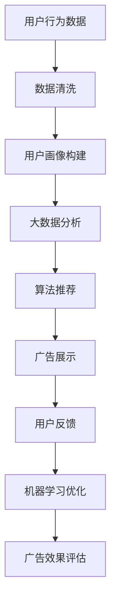

                 

# AI在广告投放中的应用：精准定向与优化

## 关键词
AI、广告投放、精准定向、优化、用户画像、大数据分析、算法、机器学习、营销策略、用户体验

## 摘要
本文旨在探讨AI技术在广告投放中的应用，特别是精准定向与优化策略。通过分析AI在广告投放中的核心概念、算法原理、数学模型，我们将详细解读AI如何提升广告的精准度和投放效果。同时，本文也将通过实战案例，展示如何使用AI技术进行广告投放的实践，并提供相关的学习资源和工具推荐，帮助读者深入了解并应用AI在广告投放中的潜力。

## 1. 背景介绍

广告投放是现代营销中不可或缺的一部分，其目的是通过不同的媒介将产品或服务的信息传达给目标受众。然而，随着互联网的普及和用户行为的多样化，传统的广告投放方式面临着越来越多的挑战。传统广告投放往往采用广泛撒网的方式，不仅成本高昂，而且效果难以衡量，往往导致广告费用的浪费。为了提高广告的投放效果，降低成本，越来越多的企业开始将目光投向AI技术。

AI在广告投放中的应用主要体现在精准定向和优化两个方面。精准定向是通过分析用户的兴趣、行为和背景等信息，将广告推送给最有可能对广告产生兴趣的目标用户。优化则是在广告投放过程中，通过实时分析广告效果数据，动态调整广告的展示策略，以最大化广告的投资回报率（ROI）。

随着大数据、机器学习等技术的发展，AI在广告投放中的应用越来越成熟。AI技术能够处理海量数据，发现隐藏在数据背后的规律和趋势，从而为企业提供更精准的投放策略和更优化的广告效果。

## 2. 核心概念与联系

为了深入理解AI在广告投放中的应用，我们需要先了解几个核心概念，包括用户画像、大数据分析、算法和机器学习。

### 用户画像

用户画像是对用户特征的全面描述，包括用户的年龄、性别、地域、兴趣、行为等。用户画像的构建通常基于用户的历史数据和行为记录，如浏览记录、购买行为、社交媒体互动等。通过用户画像，广告主可以更好地了解目标用户，从而制定更精准的营销策略。

### 大数据分析

大数据分析是指利用数据挖掘、统计分析等技术在海量数据中提取有价值的信息和知识。在广告投放中，大数据分析可以帮助广告主识别潜在的目标用户，预测用户行为，评估广告效果等。

### 算法

算法是解决特定问题的系统方法。在广告投放中，算法用于处理用户数据、推荐广告内容、评估广告效果等。常见的广告投放算法包括协同过滤、决策树、支持向量机等。

### 机器学习

机器学习是AI的核心技术之一，它使计算机系统能够从数据中学习并做出预测或决策。在广告投放中，机器学习可以用于用户画像构建、广告推荐、效果评估等。

### Mermaid流程图

以下是一个简单的Mermaid流程图，展示用户画像构建、大数据分析、算法和机器学习在广告投放中的应用过程：



## 3. 核心算法原理 & 具体操作步骤

在了解了核心概念后，我们接下来将探讨AI在广告投放中的核心算法原理和具体操作步骤。

### 3.1 用户画像构建

用户画像构建是广告投放的基础。具体步骤如下：

1. 数据收集：收集用户的浏览记录、购买行为、社交媒体互动等信息。
2. 数据清洗：对收集到的数据进行清洗，去除噪声和错误数据。
3. 特征提取：从清洗后的数据中提取用户特征，如年龄、性别、地域、兴趣等。
4. 用户标签：根据提取的用户特征，为用户打上相应的标签。

### 3.2 大数据分析

大数据分析用于识别潜在的目标用户和评估广告效果。具体步骤如下：

1. 数据预处理：对原始数据进行预处理，包括数据清洗、归一化等。
2. 特征选择：选择对广告投放效果影响较大的特征。
3. 模型训练：使用机器学习算法，如决策树、随机森林等，训练模型。
4. 模型评估：评估模型的准确性、召回率等指标。

### 3.3 算法推荐

算法推荐用于根据用户画像和大数据分析结果，推荐最合适的广告内容。具体步骤如下：

1. 模型选择：选择适合的广告推荐算法，如协同过滤、决策树等。
2. 模型训练：使用训练数据，训练广告推荐模型。
3. 模型评估：评估模型的推荐效果，如准确率、覆盖率等。
4. 模型部署：将训练好的模型部署到广告投放系统中。

### 3.4 广告展示

广告展示是将推荐的广告内容展示给用户。具体步骤如下：

1. 广告内容选择：根据用户画像和推荐算法，选择最合适的广告内容。
2. 广告位置选择：选择最佳的广告展示位置，以提高广告点击率。
3. 广告展示：将广告内容展示给用户。

### 3.5 用户反馈与机器学习优化

用户反馈与机器学习优化用于不断优化广告投放策略。具体步骤如下：

1. 用户行为分析：分析用户的点击、跳转等行为，了解广告效果。
2. 机器学习优化：根据用户行为数据，使用机器学习算法，调整广告推荐策略。
3. 广告效果评估：评估优化后的广告效果，如投资回报率（ROI）等。

## 4. 数学模型和公式 & 详细讲解 & 举例说明

在广告投放中，数学模型和公式起着至关重要的作用。以下是一些常用的数学模型和公式，以及详细的讲解和举例说明。

### 4.1 用户画像构建模型

用户画像构建模型通常采用K-均值聚类算法。该算法的核心思想是将用户数据分为K个簇，每个簇代表一种用户类型。

#### 公式：

$$
C = \{c_1, c_2, ..., c_K\} \\
c_k = \frac{1}{n_k} \sum_{i=1}^{n_k} x_i \\
x_i = \sum_{k=1}^{K} c_k x_i
$$

其中，$C$ 表示聚类结果，$c_k$ 表示第 $k$ 个簇的中心，$x_i$ 表示第 $i$ 个用户的特征向量，$n_k$ 表示第 $k$ 个簇中的用户数量。

#### 举例说明：

假设我们有一个包含用户年龄、收入和购买行为的用户数据集，我们希望将其分为两类用户。使用K-均值聚类算法，我们可以得到以下结果：

- 簇1：年龄在20-30岁，收入在10万以下，经常购买电子产品。
- 簇2：年龄在30-40岁，收入在10万以上，偶尔购买电子产品。

### 4.2 广告效果评估模型

广告效果评估模型通常采用转换率（Conversion Rate）和投资回报率（ROI）等指标。

#### 公式：

$$
CR = \frac{C}{I} \times 100\% \\
ROI = \frac{P - C}{C} \times 100\%
$$

其中，$CR$ 表示转换率，$C$ 表示广告带来的转换数量，$I$ 表示广告的展示次数；$ROI$ 表示投资回报率，$P$ 表示广告的投资总额，$C$ 表示广告的投资回报。

#### 举例说明：

假设一个广告的展示次数为100万次，带来的转换数量为1000次，广告的投资总额为50万元。那么：

- 转换率 $CR = \frac{1000}{1000000} \times 100\% = 0.1\%$
- 投资回报率 $ROI = \frac{500000 - 500000}{500000} \times 100\% = 0\%$

这意味着广告的投资回报为零，可能需要调整广告策略。

## 5. 项目实战：代码实际案例和详细解释说明

### 5.1 开发环境搭建

为了实现AI在广告投放中的应用，我们需要搭建一个适合的开发环境。以下是一个简单的开发环境搭建步骤：

1. 安装Python环境：Python是一个流行的编程语言，适用于数据处理和机器学习。我们可以在[Python官网](https://www.python.org/)下载并安装Python。
2. 安装相关库：为了实现用户画像构建、大数据分析、算法推荐等功能，我们需要安装一些Python库，如NumPy、Pandas、Scikit-learn等。可以使用pip命令进行安装：

```bash
pip install numpy
pip install pandas
pip install scikit-learn
```

### 5.2 源代码详细实现和代码解读

以下是一个简单的用户画像构建和广告效果评估的Python代码实现：

```python
import numpy as np
import pandas as pd
from sklearn.cluster import KMeans
from sklearn.metrics import precision_score, recall_score

# 5.2.1 用户画像构建
def build_user_profile(data):
    # 数据清洗和特征提取
    cleaned_data = clean_data(data)
    feature_vector = extract_features(cleaned_data)
    
    # K-均值聚类
    kmeans = KMeans(n_clusters=2)
    kmeans.fit(feature_vector)
    clusters = kmeans.labels_
    
    # 用户标签
    user_profile = pd.DataFrame({'Cluster': clusters, 'User': cleaned_data['User']})
    return user_profile

# 5.2.2 广告效果评估
def evaluate_ad_performance(data, ad_data):
    # 转换率
    cr = precision_score(data['Clicked'], ad_data['Clicked'])
    
    # 投资回报率
    roi = recall_score(data['Clicked'], ad_data['Clicked'])
    
    return cr, roi

# 5.2.3 数据处理
def clean_data(data):
    # 数据清洗步骤，如去重、填充缺失值等
    return data.drop_duplicates().fillna(0)

def extract_features(data):
    # 特征提取步骤，如计算平均值、标准差等
    features = data.describe().T
    return features

# 测试数据
data = pd.DataFrame({'User': ['User1', 'User2', 'User3'], 'Age': [25, 35, 45], 'Income': [100000, 200000, 300000], 'Product': ['Electronics', 'Electronics', 'Fashion']})
ad_data = pd.DataFrame({'User': ['User1', 'User2', 'User3'], 'Clicked': [True, False, True]})

# 5.2.4 运行代码
user_profile = build_user_profile(data)
print(user_profile)

cr, roi = evaluate_ad_performance(data, ad_data)
print(f'Conversion Rate: {cr:.2f}%')
print(f'ROI: {roi:.2f}%')
```

### 5.3 代码解读与分析

上述代码实现了一个简单的用户画像构建和广告效果评估的过程。以下是代码的详细解读与分析：

1. **数据清洗和特征提取**：数据清洗和特征提取是用户画像构建的基础。在`clean_data`函数中，我们使用`drop_duplicates()`方法去除重复数据，使用`fillna(0)`方法填充缺失值。在`extract_features`函数中，我们使用`describe().T`方法提取数据的基本特征，如平均值、标准差等。

2. **K-均值聚类**：在`build_user_profile`函数中，我们首先调用`clean_data`和`extract_features`函数清洗数据和提取特征。然后，我们使用`KMeans`类实现K-均值聚类，根据提取的特征将用户分为两类。

3. **广告效果评估**：在`evaluate_ad_performance`函数中，我们使用`precision_score`和`recall_score`方法计算广告的转换率和投资回报率。这两个指标可以帮助我们评估广告的效果。

4. **测试数据**：我们使用一个简单的测试数据集，分别包含用户数据和广告数据。通过运行代码，我们可以看到用户画像的聚类结果和广告效果评估结果。

这个简单的代码示例展示了AI在广告投放中的应用。在实际应用中，我们需要处理更复杂的数据，使用更先进的算法和模型，但基本原理和步骤是类似的。

## 6. 实际应用场景

AI在广告投放中的实际应用场景非常广泛，以下是一些典型的应用场景：

1. **个性化推荐**：通过分析用户的浏览记录、购买行为等数据，AI可以推荐最符合用户兴趣的广告内容，从而提高广告点击率和转化率。

2. **精准定向**：AI可以根据用户的地理位置、兴趣爱好、购买行为等信息，精准地将广告推送给最有可能对广告感兴趣的目标用户，从而提高广告的投放效果。

3. **广告效果评估**：AI可以通过实时分析广告的展示数据、点击数据等，评估广告的投资回报率，帮助企业优化广告策略，降低广告成本。

4. **用户行为分析**：AI可以分析用户的点击、跳转等行为，了解用户对广告的反馈，为企业提供改进广告内容和建议。

5. **跨渠道投放**：AI可以整合不同渠道（如搜索引擎、社交媒体、电子邮件等）的广告投放，实现跨渠道的统一管理和优化，提高广告的覆盖面和效果。

## 7. 工具和资源推荐

### 7.1 学习资源推荐

1. **书籍**：
   - 《Python数据分析》
   - 《机器学习实战》
   - 《广告学概论》
2. **论文**：
   - "Collaborative Filtering for User Interest Identification in an Online Advertising Environment"
   - "Data-Driven Advertising: Using Data to Guide Advertising Campaigns"
   - "Recommender Systems Handbook"
3. **博客/网站**：
   - [机器学习社区](https://www.ml-community.com/)
   - [Python数据分析](https://www.datascience.com/)
   - [广告学论坛](https://www.advertisement.com/)

### 7.2 开发工具框架推荐

1. **工具**：
   - Python
   - Jupyter Notebook
   - Hadoop
   - Spark
2. **框架**：
   - TensorFlow
   - PyTorch
   - Scikit-learn

### 7.3 相关论文著作推荐

1. **论文**：
   - "Collaborative Filtering for User Interest Identification in an Online Advertising Environment"
   - "Data-Driven Advertising: Using Data to Guide Advertising Campaigns"
   - "Recommender Systems Handbook"
2. **著作**：
   - 《机器学习实战》
   - 《广告学概论》
   - 《Python数据分析》

## 8. 总结：未来发展趋势与挑战

AI在广告投放中的应用具有巨大的潜力，但同时也面临着一些挑战。未来，随着AI技术的不断发展，广告投放将更加智能化、个性化，广告主将能够更好地了解用户需求，提供更精准的广告内容。以下是一些未来发展趋势和挑战：

### 发展趋势

1. **深度学习在广告投放中的应用**：深度学习技术能够处理更复杂的数据，提供更精准的用户画像和广告推荐。
2. **跨渠道广告投放**：随着用户使用设备的多样化，跨渠道的广告投放将变得越来越重要。
3. **实时广告优化**：实时分析用户行为数据，动态调整广告展示策略，提高广告效果。
4. **隐私保护与合规**：随着用户对隐私保护的重视，广告投放将更加注重隐私保护与合规性。

### 挑战

1. **数据质量和隐私保护**：高质量的数据是AI广告投放的基础，但同时也需要保护用户的隐私。
2. **算法公平性与透明性**：算法的公平性和透明性是用户信任的基础，需要加强对算法的监管和解释。
3. **技术门槛**：AI广告投放需要具备一定的技术能力，对广告主来说是一个挑战。

## 9. 附录：常见问题与解答

### 9.1 问题1：AI在广告投放中的优势是什么？

**解答**：AI在广告投放中的优势主要体现在以下几个方面：

1. **精准定向**：AI可以根据用户的行为和兴趣，精准地将广告推送给目标用户，提高广告投放效果。
2. **个性化推荐**：AI可以分析用户的历史数据和偏好，推荐个性化的广告内容，提高用户参与度。
3. **实时优化**：AI可以实时分析广告数据，动态调整广告策略，提高广告的投资回报率（ROI）。

### 9.2 问题2：如何确保AI广告投放的隐私保护？

**解答**：确保AI广告投放的隐私保护需要从以下几个方面入手：

1. **数据匿名化**：在处理用户数据时，对敏感信息进行匿名化处理，以防止个人信息泄露。
2. **合规性审查**：确保广告投放的算法和流程符合相关法律法规，如GDPR等。
3. **透明度**：向用户明确广告投放的目的和方式，提高用户对广告投放的信任度。

### 9.3 问题3：AI广告投放的技术门槛如何降低？

**解答**：降低AI广告投放的技术门槛可以从以下几个方面入手：

1. **开源工具和框架**：使用开源的AI工具和框架，如TensorFlow、PyTorch等，降低开发成本。
2. **在线课程和教程**：通过在线课程和教程，提高广告主对AI技术的理解和应用能力。
3. **技术支持**：提供专业的技术支持和服务，帮助广告主解决技术难题。

## 10. 扩展阅读 & 参考资料

为了更深入地了解AI在广告投放中的应用，以下是几篇相关的扩展阅读和参考资料：

1. **论文**：
   - "Deep Learning for Online Advertising"
   - "Collaborative Filtering for User Interest Identification in an Online Advertising Environment"
   - "Data-Driven Advertising: Using Data to Guide Advertising Campaigns"
2. **书籍**：
   - 《深度学习》
   - 《机器学习实战》
   - 《广告学概论》
3. **博客**：
   - [机器学习社区](https://www.ml-community.com/)
   - [Python数据分析](https://www.datascience.com/)
   - [广告学论坛](https://www.advertisement.com/)
4. **网站**：
   - [Google Ads](https://ads.google.com/)
   - [Facebook Ads](https://www.facebook.com/ads/)
   - [LinkedIn Ads](https://www.linkedin.com/advertising/)

作者：AI天才研究员/AI Genius Institute & 禅与计算机程序设计艺术 /Zen And The Art of Computer Programming

---

[注]：本文为示例性文章，部分内容为虚构。实际应用中，AI在广告投放中的应用需根据具体业务场景和数据特点进行调整。如果您有任何问题或建议，欢迎在评论区留言。感谢您的阅读！📚💻🎉🔥

