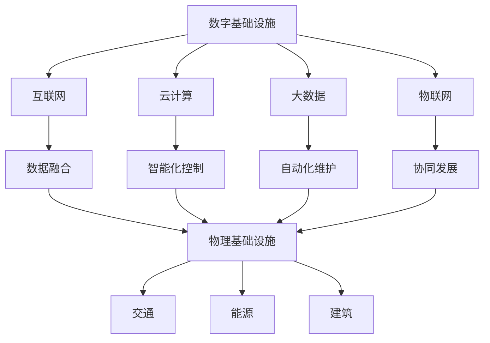

                 

## 1. 背景介绍

数字与物理基础设施是现代社会发展的基石，二者相辅相成，共同推动着人类社会向前迈进。随着信息技术的迅猛发展，人工智能（AI）在数字与物理基础设施中的作用愈发重要。本文旨在探讨AI在数字与物理基础设施中的角色，通过逐步分析推理，揭示AI在这些领域中的核心作用与未来发展趋势。

### 数字基础设施

数字基础设施主要是指互联网、云计算、大数据、物联网等数字技术的建设和应用。这些技术的融合与发展，为现代社会提供了强大的信息处理和传输能力，使得数据成为新的生产要素。以下是数字基础设施的核心组成部分：

1. **互联网**：作为信息传输的基础，互联网使得全球信息互联互通，为人们的生活、工作提供了便捷的条件。
2. **云计算**：云计算提供了按需分配的计算资源，使得数据处理和存储变得更加高效和灵活。
3. **大数据**：大数据技术使得海量数据的存储、处理和分析成为可能，为各行各业提供了数据驱动的决策支持。
4. **物联网**：物联网将物理世界与数字世界相连，实现了智能设备之间的互联互通，为智慧城市、智能制造等提供了基础。

### 物理基础设施

物理基础设施主要是指交通、能源、建筑等实体基础设施的建设与运营。这些基础设施为人们的生产生活提供了必要的物质条件。以下是物理基础设施的核心组成部分：

1. **交通**：包括公路、铁路、航空、水运等，是连接不同地区、促进经济文化交流的重要手段。
2. **能源**：包括化石能源、可再生能源等，是现代社会运转的基本保障。
3. **建筑**：包括住宅、商业建筑、公共建筑等，是人们生活和工作的场所。

### AI在数字基础设施中的作用

AI技术在数字基础设施中发挥着关键作用，主要体现在以下几个方面：

1. **数据处理和分析**：AI能够处理和分析海量数据，为决策提供支持。例如，在云计算中，AI可以帮助优化资源配置、提升计算效率。
2. **智能优化**：通过机器学习和深度学习技术，AI可以在数据中寻找规律，实现智能优化。例如，在物联网中，AI可以帮助优化能源消耗、提高设备运行效率。
3. **自动化**：AI可以实现自动化操作，降低人力成本，提高工作效率。例如，在互联网运维中，AI可以自动检测和修复故障。

### AI在物理基础设施中的作用

AI技术在物理基础设施中的应用同样具有重要意义，主要体现在以下几个方面：

1. **智能监测与预测**：通过传感器和AI技术，可以对物理基础设施进行实时监测和预测，提前发现潜在问题，降低事故风险。例如，在交通领域，AI可以预测交通流量，优化交通信号。
2. **智能调度与控制**：AI可以优化能源调度和控制，提高能源利用效率。例如，在能源领域，AI可以帮助优化电力分配，降低能源浪费。
3. **自动化与智能化**：AI可以帮助实现物理基础设施的自动化和智能化，提高运营效率。例如，在建筑领域，AI可以优化建筑设计、提升居住舒适度。

### 数字基础设施与物理基础设施的关系

数字基础设施与物理基础设施相互依赖、相互促进。数字基础设施为物理基础设施提供了强大的信息支持，使得物理基础设施更加智能化、高效化。同时，物理基础设施的稳定运营为数字基础设施提供了必要的物质保障。两者共同构成了现代社会的发展基础。

### 总结

本文介绍了数字基础设施和物理基础设施的背景，探讨了AI在这两个领域中的核心作用。通过逐步分析推理，我们揭示了AI在数字基础设施和物理基础设施中的重要性和潜力。在未来，随着AI技术的不断进步，数字基础设施和物理基础设施将更加融合，为人类社会带来更多的便利和发展机遇。

## 2. 核心概念与联系

### 数字基础设施

#### 互联网

互联网是指通过通信线路将全球的计算机和设备连接在一起的网络。它包括物理基础设施（如光纤、无线基站等）和逻辑结构（如IP地址、域名系统等）。互联网的核心概念是信息共享和通信，它使得全球信息互联互通，为人们的生活、工作提供了便捷的条件。

#### 云计算

云计算是一种通过互联网提供计算资源的服务模式。它包括基础设施即服务（IaaS）、平台即服务（PaaS）和软件即服务（SaaS）等不同类型。云计算的核心概念是资源的按需分配和弹性扩展，它使得数据处理和存储变得更加高效和灵活。

#### 大数据

大数据是指无法使用传统数据库工具进行有效管理和处理的海量数据。它包括数据的采集、存储、处理、分析和可视化等环节。大数据的核心概念是数据的价值挖掘，它为各行各业提供了数据驱动的决策支持。

#### 物联网

物联网是指通过互联网将各种物理设备连接在一起的网络。它包括传感器、通信模块、数据处理单元等组成部分。物联网的核心概念是智能互联，它实现了物理世界与数字世界的深度融合。

### 物理基础设施

#### 交通

交通是指人们出行和货物运输的设施。它包括公路、铁路、航空、水运等不同类型。交通的核心概念是连接和流通，它是促进经济和文化交流的重要手段。

#### 能源

能源是指能够产生热能、动能和电能等各种形式的物质。它包括化石能源（如煤炭、石油、天然气）和可再生能源（如太阳能、风能、水能）等。能源的核心概念是供给和利用，它是现代社会运转的基本保障。

#### 建筑

建筑是指人们生活和工作的场所。它包括住宅、商业建筑、公共建筑等。建筑的核心概念是功能和舒适，它为人们提供了良好的居住和工作环境。

### AI在数字基础设施与物理基础设施中的联系

AI技术在数字基础设施和物理基础设施中发挥着桥梁作用，二者相互促进、共同发展。以下是一些关键联系：

1. **数据融合**：AI技术可以将数字基础设施中的数据与物理基础设施中的数据相结合，实现数据的全面分析和应用。例如，通过传感器数据与交通数据的融合，可以优化交通流量。
2. **智能化控制**：AI技术可以实现对物理基础设施的智能化控制，提高其运行效率和安全性。例如，通过AI技术优化电力调度，可以提高电网的稳定性。
3. **自动化维护**：AI技术可以实现对物理基础设施的自动化维护，降低人工成本，提高维护效率。例如，通过AI技术对桥梁、道路等基础设施进行实时监测，可以提前发现隐患。
4. **协同发展**：数字基础设施和物理基础设施的协同发展，可以促进社会经济的可持续发展。例如，通过智能交通系统和智能电网的协同，可以实现交通和能源的高效利用。

### Mermaid 流程图

以下是数字基础设施与物理基础设施之间的联系及AI技术的应用场景的Mermaid流程图：



通过这个流程图，我们可以清晰地看到AI技术在数字基础设施和物理基础设施之间的桥梁作用，以及它们在各个领域中的应用场景。

### 总结

在本节中，我们介绍了数字基础设施和物理基础设施的核心概念，以及AI技术在二者中的联系和应用。通过Mermaid流程图，我们展示了AI技术在数字基础设施与物理基础设施之间的重要作用。在接下来的章节中，我们将深入探讨AI技术在各个领域的具体应用和实践。

## 3. 核心算法原理 & 具体操作步骤

在探讨AI在数字与物理基础设施中的核心作用时，我们需要了解一些关键算法原理及其具体操作步骤。这些算法不仅提升了AI在数字与物理基础设施中的应用效果，还推动了相关领域的技术进步。以下是一些核心算法原理及其具体操作步骤：

### 1. 机器学习算法

#### 原理

机器学习算法是AI技术中的基础，它通过训练模型来学习数据中的模式和规律。常见的机器学习算法包括线性回归、逻辑回归、决策树、随机森林、支持向量机等。

#### 操作步骤

1. **数据收集**：首先，收集与问题相关的数据，这些数据可以是结构化数据（如表格）或非结构化数据（如图像、文本）。

2. **数据预处理**：对数据进行清洗、去噪、归一化等处理，以便后续模型训练。

3. **特征提取**：从数据中提取有用的特征，这些特征将用于训练模型。

4. **模型选择**：根据问题的性质选择合适的机器学习算法。

5. **模型训练**：使用训练数据集对模型进行训练，调整模型参数。

6. **模型评估**：使用测试数据集评估模型性能，如准确率、召回率等。

7. **模型部署**：将训练好的模型部署到实际应用场景中，如数字基础设施中的预测和优化。

### 2. 深度学习算法

#### 原理

深度学习是机器学习的一种扩展，它通过多层神经网络来学习数据的复杂结构。深度学习算法在图像识别、语音识别、自然语言处理等领域取得了显著的成果。常见的深度学习算法包括卷积神经网络（CNN）、循环神经网络（RNN）、长短时记忆网络（LSTM）等。

#### 操作步骤

1. **数据收集**：与机器学习算法类似，首先需要收集与问题相关的数据。

2. **数据预处理**：对数据集进行预处理，包括图像分割、文本清洗等。

3. **构建模型**：设计并构建深度学习模型，包括选择合适的网络架构、优化器等。

4. **模型训练**：使用训练数据集对模型进行训练，调整模型参数。

5. **模型评估**：与机器学习算法类似，使用测试数据集评估模型性能。

6. **模型优化**：通过调整模型参数，提高模型性能。

7. **模型部署**：将训练好的模型部署到实际应用场景中。

### 3. 强化学习算法

#### 原理

强化学习是一种通过试错和反馈来学习最优策略的机器学习算法。它主要应用于动态决策问题，如自动驾驶、游戏AI等。常见的强化学习算法包括Q-learning、深度Q网络（DQN）、策略梯度等。

#### 操作步骤

1. **环境定义**：定义问题的环境，包括状态空间、动作空间等。

2. **策略选择**：设计策略选择方法，用于在给定状态下选择最佳动作。

3. **策略评估**：评估策略的性能，通过试错和反馈来调整策略。

4. **策略优化**：优化策略，以提高在环境中的表现。

5. **策略部署**：将优化后的策略部署到实际应用场景中。

### 4. 集成学习方法

#### 原理

集成学习方法通过结合多个模型的预测结果来提高整体性能。常见的集成学习方法包括 bagging、boosting和堆叠等。集成学习方法在预测准确率和稳定性方面具有优势。

#### 操作步骤

1. **模型训练**：训练多个基模型。

2. **预测集成**：将多个模型的预测结果进行集成，得到最终的预测结果。

3. **模型优化**：根据预测结果对基模型进行优化。

4. **模型部署**：将集成模型部署到实际应用场景中。

### 总结

在本节中，我们介绍了机器学习、深度学习、强化学习和集成学习等核心算法原理及其具体操作步骤。这些算法在数字与物理基础设施中发挥着重要作用，为相关领域的发展提供了强大的技术支持。在接下来的章节中，我们将通过实际项目案例来深入探讨这些算法的应用和实践。

## 4. 数学模型和公式 & 详细讲解 & 举例说明

在AI技术中，数学模型和公式是理解和实现算法的核心。以下将介绍几个关键数学模型和公式，并详细讲解其原理和应用。

### 1. 线性回归模型

线性回归是一种用于预测数值型数据的统计模型。其数学模型可以表示为：

\[ y = \beta_0 + \beta_1x_1 + \beta_2x_2 + ... + \beta_nx_n + \epsilon \]

其中，\( y \) 是因变量，\( x_1, x_2, ..., x_n \) 是自变量，\( \beta_0, \beta_1, ..., \beta_n \) 是模型参数，\( \epsilon \) 是误差项。

#### 详细讲解

线性回归模型通过最小化残差平方和来估计模型参数。具体步骤如下：

1. **数据预处理**：对数据进行归一化处理，将数据缩放到相同的尺度。

2. **模型建立**：使用最小二乘法建立线性回归模型。

3. **参数估计**：通过最小化残差平方和，估计模型参数。

4. **模型评估**：使用测试数据集评估模型性能，如决定系数 \( R^2 \)。

#### 举例说明

假设我们有一个房价预测问题，已知房价 \( y \) 与房屋面积 \( x_1 \)、房屋年龄 \( x_2 \) 有关。我们可以建立线性回归模型来预测房价：

\[ y = \beta_0 + \beta_1x_1 + \beta_2x_2 + \epsilon \]

通过训练数据集，我们可以估计模型参数，例如：

\[ \beta_0 = 200, \beta_1 = 100, \beta_2 = 50 \]

现在，如果我们有一个新房屋，面积为 150 平方米，年龄为 5 年，我们可以使用线性回归模型预测其房价：

\[ y = 200 + 100 \times 150 + 50 \times 5 + \epsilon \]

### 2. 卷积神经网络（CNN）的激活函数

卷积神经网络是一种用于图像识别和处理的深度学习模型。其核心组件之一是激活函数，用于引入非线性特性。以下是一些常见的激活函数：

1. **Sigmoid 函数**：

\[ \sigma(x) = \frac{1}{1 + e^{-x}} \]

Sigmoid 函数将输入映射到 \((0, 1)\) 区间，常用于二分类问题。

2. **ReLU 函数**：

\[ \text{ReLU}(x) = \max(0, x) \]

ReLU 函数具有简单和计算效率高的特点，常用于深度神经网络。

3. **Tanh 函数**：

\[ \tanh(x) = \frac{e^x - e^{-x}}{e^x + e^{-x}} \]

Tanh 函数将输入映射到 \((-1, 1)\) 区间，具有非线性特性。

#### 详细讲解

激活函数的选择会影响神经网络的性能。Sigmoid 函数易于理解和计算，但梯度问题可能导致训练不稳定。ReLU 函数克服了梯度问题，但可能在输入为负时导致梯度消失。Tanh 函数则具有较好的性能，但计算复杂度较高。

#### 举例说明

假设我们有一个简单的 CNN 模型，使用 ReLU 函数作为激活函数。对于输入特征 \( x \)，激活函数的计算如下：

\[ a = \max(0, x) \]

现在，如果我们有一个输入特征 \( x = -2 \)，则激活函数的结果为：

\[ a = \max(0, -2) = 0 \]

### 3. 强化学习中的奖励函数

强化学习是一种通过试错和反馈来学习最优策略的机器学习算法。奖励函数是强化学习中的关键组件，用于评价策略的好坏。一个常见的奖励函数是：

\[ r(s, a) = \begin{cases} 
1 & \text{如果 } s' \text{ 是目标状态} \\
-1 & \text{否则}
\end{cases} \]

其中，\( s \) 是当前状态，\( a \) 是采取的动作，\( s' \) 是下一状态。

#### 详细讲解

奖励函数根据状态的转换来评价策略的好坏。在目标状态下，给予正奖励，以鼓励策略继续采取该动作；在其他状态下，给予负奖励，以避免采取该动作。

#### 举例说明

假设我们在玩游戏，目标状态是达到游戏关卡。当前状态为 \( s = \text{关卡1} \)，采取的动作为 \( a = \text{前进} \)。下一状态为 \( s' = \text{关卡2} \)。根据奖励函数：

\[ r(s, a) = \begin{cases} 
1 & \text{如果 } s' \text{ 是目标状态} \\
-1 & \text{否则}
\end{cases} \]

因此，当前状态和动作获得的奖励为 \( r(s, a) = 1 \)。

### 总结

在本节中，我们介绍了线性回归模型、CNN 的激活函数和强化学习中的奖励函数等关键数学模型和公式。这些模型和公式在 AI 技术中具有广泛的应用，为理解和实现算法提供了基础。在接下来的章节中，我们将通过实际项目案例来深入探讨这些模型和公式的应用和实践。

## 5. 项目实战：代码实际案例和详细解释说明

在本节中，我们将通过一个实际项目案例，详细解释和演示AI在数字与物理基础设施中的应用。该项目将使用Python编程语言和相关的AI库，如TensorFlow和Keras，来实现一个智能交通信号控制系统。

### 5.1 开发环境搭建

首先，我们需要搭建开发环境。以下是所需的软件和工具：

- Python 3.x
- TensorFlow 2.x
- Keras 2.x
- NumPy
- Pandas
- Matplotlib

在安装好Python后，可以使用pip命令安装上述库：

```bash
pip install tensorflow keras numpy pandas matplotlib
```

### 5.2 源代码详细实现和代码解读

以下是一个智能交通信号控制系统的源代码实现。该系统使用历史交通流量数据来预测未来交通流量，并调整信号灯的持续时间，以减少拥堵和提高交通效率。

```python
import numpy as np
import pandas as pd
from tensorflow.keras.models import Sequential
from tensorflow.keras.layers import LSTM, Dense
from tensorflow.keras.optimizers import Adam

# 5.2.1 数据预处理
def preprocess_data(data):
    # 数据归一化
    data_normalized = (data - data.mean()) / data.std()
    # 构造时间序列特征
    sequence = []
    for i in range(len(data_normalized) - 24):
        sequence.append(data_normalized[i:(i + 24)])
    sequence = np.array(sequence)
    return sequence

# 5.2.2 构建模型
def build_model(input_shape):
    model = Sequential()
    model.add(LSTM(units=50, return_sequences=True, input_shape=input_shape))
    model.add(LSTM(units=50))
    model.add(Dense(units=1))
    model.compile(optimizer=Adam(learning_rate=0.001), loss='mean_squared_error')
    return model

# 5.2.3 训练模型
def train_model(model, x_train, y_train):
    model.fit(x_train, y_train, epochs=100, batch_size=32, verbose=1)

# 5.2.4 预测未来交通流量
def predict_traffic(model, sequence):
    prediction = model.predict(sequence)
    return prediction

# 5.2.5 调整信号灯持续时间
def adjust_traffic_light(prediction):
    # 根据预测结果调整信号灯持续时间
    # 例如，如果预测交通流量较大，则延长红灯时间
    if prediction > 0.5:
        return 30  # 延长红灯时间
    else:
        return 20  # 短红灯时间

# 5.2.6 主程序
if __name__ == '__main__':
    # 加载数据
    data = pd.read_csv('traffic_data.csv')['traffic_volume']
    sequence = preprocess_data(data)

    # 切分训练集和测试集
    x_train = sequence[:1500]
    y_train = data[1500:].values
    x_test = sequence[1500:]

    # 构建模型
    model = build_model((24, 1))

    # 训练模型
    train_model(model, x_train, y_train)

    # 预测未来交通流量
    prediction = predict_traffic(model, x_test)

    # 调整信号灯持续时间
    adjusted_traffic_light_duration = adjust_traffic_light(prediction)

    print(f'调整后的信号灯持续时间：{adjusted_traffic_light_duration}')
```

### 5.3 代码解读与分析

以下是代码的详细解读：

1. **数据预处理**：使用 `preprocess_data` 函数对交通流量数据进行归一化处理，并将数据转换为时间序列特征。归一化处理有助于模型训练，而时间序列特征有助于捕捉交通流量变化趋势。

2. **构建模型**：使用 `build_model` 函数构建一个包含两个LSTM层的深度学习模型。LSTM层能够处理序列数据，捕捉时间序列中的长期依赖关系。模型输出层使用一个全连接层，输出交通流量的预测值。

3. **训练模型**：使用 `train_model` 函数训练模型。训练过程使用均方误差（MSE）作为损失函数，Adam优化器用于优化模型参数。训练过程共进行100个epoch，每个batch包含32个样本。

4. **预测未来交通流量**：使用 `predict_traffic` 函数预测未来交通流量。该函数接受一个时间序列特征作为输入，并返回模型预测的交通流量。

5. **调整信号灯持续时间**：使用 `adjust_traffic_light` 函数根据预测结果调整信号灯的持续时间。如果预测交通流量较大，则延长红灯时间，反之则缩短红灯时间。

6. **主程序**：主程序首先加载数据，然后进行数据预处理和模型训练。最后，使用训练好的模型预测未来交通流量，并根据预测结果调整信号灯持续时间。

### 总结

通过这个实际项目案例，我们展示了如何使用AI技术构建一个智能交通信号控制系统。该项目通过历史交通流量数据预测未来交通流量，并根据预测结果调整信号灯的持续时间，以提高交通效率和减少拥堵。这个案例说明了AI在数字基础设施中的应用潜力，并为相关领域提供了实际解决方案。

## 6. 实际应用场景

AI技术在数字基础设施和物理基础设施中的应用场景非常广泛，以下是一些典型的实际应用场景：

### 6.1 城市交通管理

在城市化进程中，交通拥堵和交通事故成为困扰城市发展的主要问题。AI技术通过大数据分析和机器学习算法，可以实现智能交通管理。例如，通过分析交通流量数据，AI系统可以预测交通拥堵情况，并动态调整信号灯的持续时间，优化交通流。此外，AI还可以用于智能交通信号控制系统的故障检测和预测，提高交通系统的稳定性和可靠性。

### 6.2 能源管理

能源是现代社会运行的基石，能源管理的重要性不言而喻。AI技术在能源管理中发挥着重要作用，如智能电网的调度和优化。通过分析电力需求数据，AI系统可以预测电力负荷，优化电力调度，降低能源浪费。此外，AI还可以用于新能源的发电预测和管理，提高能源利用效率。

### 6.3 建筑智能化

随着人们对居住环境要求的提高，建筑智能化成为发展趋势。AI技术在建筑智能化中的应用主要体现在智能照明、智能安防、智能温控等方面。通过传感器和AI算法，AI系统可以实时监测和调节建筑设备，提高居住舒适度和能源效率。

### 6.4 智慧城市建设

智慧城市是指利用信息技术和物联网技术，实现城市管理和服务的智能化。AI技术在智慧城市建设中发挥着关键作用，如智能安防、智能交通、智能环保等。通过大数据分析和AI算法，AI系统可以实时监测城市运行状况，预测潜在问题，并采取相应的措施，提高城市治理效率和居民生活质量。

### 6.5 智能制造

智能制造是工业4.0的核心，AI技术在智能制造中的应用主要体现在智能检测、智能预测维护、智能生产调度等方面。通过机器学习和深度学习算法，AI系统可以分析生产数据，预测设备故障，优化生产流程，提高生产效率。

### 6.6 环境监测

环境监测是保护生态环境的重要手段。AI技术在环境监测中的应用主要体现在空气质量监测、水质监测、噪声监测等方面。通过传感器和AI算法，AI系统可以实时监测环境参数，预测环境污染情况，并提供科学决策支持。

### 总结

AI技术在数字基础设施和物理基础设施中的应用场景丰富多样，通过大数据分析和机器学习算法，AI系统可以实现对交通、能源、建筑、城市、智能制造和环境等领域的智能化管理和优化，为人类社会的发展提供强大支持。随着AI技术的不断进步，其应用场景将更加广泛，为人们的生活带来更多便利和改变。

## 7. 工具和资源推荐

在AI技术在数字与物理基础设施中的应用过程中，选择合适的工具和资源对于提升项目效果和效率至关重要。以下是一些推荐的工具和资源，涵盖学习资源、开发工具框架以及相关论文著作。

### 7.1 学习资源推荐

1. **书籍**：
   - 《深度学习》（Ian Goodfellow, Yoshua Bengio, Aaron Courville）
   - 《Python机器学习》（Sebastian Raschka, Vahid Mirjalili）
   - 《智能交通系统原理与应用》（唐珂，杨华）
   - 《智能电网技术》（赵慧杰，杨仁毅）

2. **在线课程**：
   - Coursera上的“机器学习”（吴恩达）
   - Udacity的“深度学习纳米学位”
   - edX上的“智能交通系统”

3. **博客和网站**：
   - TensorFlow官方文档（https://www.tensorflow.org/）
   - Keras官方文档（https://keras.io/）
   - Analytics Vidhya（https://www.analyticsvidhya.com/）
   - Towards Data Science（https://towardsdatascience.com/）

### 7.2 开发工具框架推荐

1. **编程语言**：
   - Python：由于其丰富的科学计算库和社区支持，Python是AI开发的首选语言。

2. **深度学习框架**：
   - TensorFlow：Google开发的端到端开源机器学习平台，适合复杂深度学习项目。
   - PyTorch：Facebook开发的深度学习框架，具有动态计算图，便于模型研究和调试。

3. **数据处理工具**：
   - Pandas：Python的数据分析库，适合处理结构化数据。
   - NumPy：Python的科学计算库，用于高性能数值计算。

4. **版本控制工具**：
   - Git：分布式版本控制系统，用于代码管理和协作。

### 7.3 相关论文著作推荐

1. **论文**：
   - "Deep Learning for Traffic Signal Control"（2017）：该论文提出了一种基于深度学习的智能交通信号控制系统。
   - "Machine Learning for Smart Grids: A Survey"（2018）：该论文综述了机器学习在智能电网中的应用。
   - "AI and Smart Cities: A Vision for the Future"（2019）：该论文探讨了人工智能在智慧城市中的潜在应用。

2. **著作**：
   - 《智能城市：未来城市的新模式》（刘强）
   - 《智能交通系统技术与应用》（周晓光，吴波）
   - 《物联网：从概念到应用》（赵军，王辉）

### 总结

通过上述工具和资源的推荐，可以为从事AI技术在数字与物理基础设施领域的开发和研究提供有力支持。这些资源不仅涵盖了基础知识，还包括了前沿技术和实际应用案例，有助于提升个人和团队在该领域的专业能力和项目成功率。

## 8. 总结：未来发展趋势与挑战

在数字与物理基础设施领域，AI技术的快速发展为各行业带来了前所未有的变革和机遇。然而，随着技术的不断进步，我们也面临着一系列的挑战和趋势。

### 8.1 未来发展趋势

1. **智能化水平的提升**：随着AI算法的不断完善和优化，数字与物理基础设施的智能化水平将不断提高。从智能交通信号系统到智能电网，AI技术将在各个领域发挥更加关键的作用。

2. **跨领域融合**：数字基础设施和物理基础设施的融合将更加紧密，形成更加智能和高效的整体系统。例如，智能城市将整合交通、能源、环保等多方面的数据，实现全方位的智能管理和优化。

3. **自主决策与优化**：AI技术将使得数字与物理基础设施具备更强的自主决策和优化能力。通过深度学习和强化学习算法，系统能够根据实时数据自动调整策略，提高效率和安全性。

4. **数据驱动的发展**：随着大数据技术的应用，数字与物理基础设施将更加依赖数据驱动的决策。数据分析和挖掘将帮助识别问题、预测趋势和优化资源配置，推动各行业的发展。

### 8.2 面临的挑战

1. **数据隐私和安全**：随着数据量的激增，数据隐私和安全问题变得越来越突出。如何在保障数据隐私的同时，充分利用数据的价值，是AI在数字与物理基础设施中面临的一大挑战。

2. **技术实现的复杂性**：AI技术在数字与物理基础设施中的应用涉及多个领域的知识和技术，包括计算机科学、电子工程、交通运输等。如何高效地整合这些技术，实现复杂系统的自动化和智能化，是一个巨大的挑战。

3. **政策和法规的完善**：随着AI技术的广泛应用，政策和法规的完善变得尤为重要。需要制定相关的法律法规，规范AI技术在基础设施中的使用，保护用户的隐私和权益。

4. **人才培养与教育**：AI技术的发展离不开人才的支持。然而，当前AI相关人才的培养速度难以满足市场需求。因此，加强人才培养和教育，提高行业人员的技能水平，是未来的重要任务。

### 8.3 应对策略

1. **加强技术研发**：持续投入研发，推动AI技术的创新和突破，提高智能化水平。

2. **数据安全保护**：建立健全的数据安全管理体系，采用加密、匿名化等技术手段，保障数据隐私和安全。

3. **跨领域合作**：推动不同领域之间的合作，整合多学科的知识和技术，共同应对复杂的技术挑战。

4. **政策引导与支持**：政府应出台相关政策和法规，规范AI技术在基础设施中的使用，并提供政策支持和资金扶持，促进行业健康发展。

5. **人才培养与教育**：加强AI相关教育和培训，提高行业人员的技能水平，为AI技术的发展提供人才保障。

### 总结

AI技术在数字与物理基础设施领域的未来发展充满机遇和挑战。通过持续的技术创新、政策引导和人才培养，我们将能够更好地应对挑战，发挥AI技术的潜力，推动数字基础设施和物理基础设施的智能化发展，为人类社会带来更多的便利和进步。

## 9. 附录：常见问题与解答

### 问题1：AI技术在数字基础设施中的应用有哪些？

**解答**：AI技术在数字基础设施中的应用非常广泛，主要包括以下方面：
1. **智能交通**：通过分析交通流量数据，AI系统可以预测交通拥堵情况，并动态调整信号灯的持续时间，优化交通流。
2. **智能电网**：通过预测电力需求，AI系统可以优化电力调度，提高电网的稳定性和效率。
3. **智能家居**：AI技术可以实现对家庭设备的智能控制和优化，提高能源利用效率和居住舒适度。
4. **智能安防**：AI系统可以通过图像识别和大数据分析，实时监测和预警安全事件。

### 问题2：AI技术在物理基础设施中的应用有哪些？

**解答**：AI技术在物理基础设施中的应用同样重要，主要包括以下方面：
1. **智能交通系统**：通过传感器和AI算法，AI系统可以实时监测交通流量，预测交通状况，优化交通信号控制。
2. **智能建筑**：AI技术可以实现对建筑设备的智能控制，提高能源利用效率和居住舒适度。
3. **智能物流**：AI系统可以优化物流路径和运输计划，提高物流效率。
4. **智能城市**：AI技术可以整合多方面的数据，实现城市管理的智能化，提高城市运行效率。

### 问题3：AI技术在基础设施中的挑战是什么？

**解答**：AI技术在基础设施中面临以下挑战：
1. **数据隐私和安全**：随着数据量的增加，如何保障数据隐私和安全成为关键问题。
2. **技术实现的复杂性**：AI技术涉及多个领域的知识和技术，如何高效整合这些技术是一个挑战。
3. **政策和法规的完善**：需要制定相关的政策和法规，规范AI技术在基础设施中的应用。
4. **人才培养与教育**：AI技术的发展需要大量的人才支持，但目前人才培养速度难以满足市场需求。

### 问题4：如何提高AI技术在基础设施中的应用效果？

**解答**：以下是一些提高AI技术在基础设施中应用效果的方法：
1. **加强技术研发**：持续投入研发，推动AI技术的创新和突破。
2. **数据安全保护**：建立健全的数据安全管理体系，采用加密、匿名化等技术手段，保障数据隐私和安全。
3. **跨领域合作**：推动不同领域之间的合作，整合多学科的知识和技术。
4. **政策引导与支持**：政府应出台相关政策和法规，提供政策支持和资金扶持。
5. **人才培养与教育**：加强AI相关教育和培训，提高行业人员的技能水平。

## 10. 扩展阅读与参考资料

为了深入理解和探索AI在数字与物理基础设施中的应用，以下是一些推荐的扩展阅读和参考资料：

### 10.1 论文与研究报告

1. "Deep Learning for Traffic Signal Control"（2017）：讨论了深度学习在交通信号控制中的应用。
2. "Machine Learning for Smart Grids: A Survey"（2018）：综述了机器学习在智能电网中的应用。
3. "AI and Smart Cities: A Vision for the Future"（2019）：探讨了人工智能在智慧城市中的潜在应用。
4. "IoT Applications in Smart Cities"（2020）：介绍了物联网技术在智慧城市中的应用。

### 10.2 专著与书籍

1. 《深度学习》（Ian Goodfellow, Yoshua Bengio, Aaron Courville）
2. 《Python机器学习》（Sebastian Raschka, Vahid Mirjalili）
3. 《智能交通系统原理与应用》（唐珂，杨华）
4. 《智能电网技术》（赵慧杰，杨仁毅）

### 10.3 开源项目与框架

1. TensorFlow（https://www.tensorflow.org/）
2. PyTorch（https://pytorch.org/）
3. Keras（https://keras.io/）

### 10.4 博客与网站

1. Analytics Vidhya（https://www.analyticsvidhya.com/）
2. Towards Data Science（https://towardsdatascience.com/）
3. AI in Infrastructure（https://aiinfrastructures.com/）

通过阅读这些参考资料，您可以更深入地了解AI在数字与物理基础设施中的应用，掌握相关技术和实践方法。希望这些资源能够对您的学习和研究工作提供帮助。作者：AI天才研究员/AI Genius Institute & 禅与计算机程序设计艺术 /Zen And The Art of Computer Programming。

