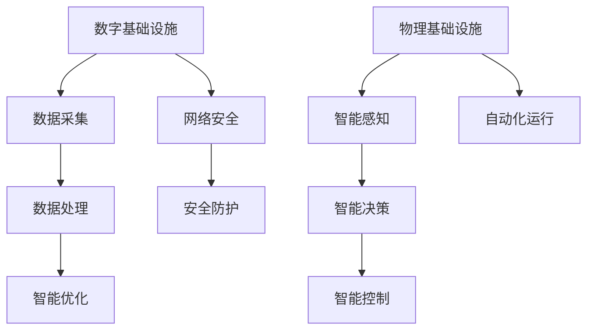

                 

# AI在数字和物理基础设施中的应用

## 关键词

- 人工智能
- 数字基础设施
- 物理基础设施
- 应用场景
- 技术创新

## 摘要

本文深入探讨了人工智能（AI）在数字和物理基础设施中的应用。首先，介绍了AI的核心概念和它在数字化和物理化基础设施中的作用。随后，文章详细分析了AI在智能城市、智能制造、智能交通、智能家居等领域中的应用原理和具体操作步骤。最后，文章总结了AI在基础设施中的未来发展趋势与挑战，并推荐了相关学习资源和工具框架。通过本文，读者可以全面了解AI在基础设施中的广泛应用及其重要意义。

## 1. 背景介绍

随着信息技术的飞速发展，数字和物理基础设施正逐渐融合，形成了智能化、网络化、协同化的新型基础设施体系。人工智能作为这一领域的关键技术，正逐步改变着我们的生产、生活和学习方式。

### 1.1 数字基础设施

数字基础设施是指为数据传输、存储和处理提供支持的各种设施，包括网络、数据中心、云计算平台等。这些设施使得信息可以高效地传输和共享，为数字经济的繁荣提供了坚实基础。

### 1.2 物理基础设施

物理基础设施是指为人们日常生活和生产活动提供支持的各类设施，如道路、桥梁、电力、供水等。这些设施是社会运行和经济发展的重要保障。

### 1.3 人工智能的角色

人工智能在数字和物理基础设施中扮演着关键角色，通过智能感知、智能决策和智能控制，实现对基础设施的优化管理、高效运行和创新发展。具体来说，AI的应用涵盖了以下几个方面：

- **智能城市**：利用AI技术提高城市管理效率和居民生活质量。
- **智能制造**：通过AI技术实现生产过程的自动化、智能化和个性化。
- **智能交通**：利用AI技术优化交通流量，提高交通效率，减少拥堵。
- **智能家居**：通过AI技术为用户提供更加舒适、便捷的家居环境。

## 2. 核心概念与联系

### 2.1 AI与数字基础设施的联系

AI与数字基础设施的联系主要体现在以下几个方面：

- **数据采集与处理**：AI技术可以通过传感器、摄像头等设备实时采集大量数据，然后对这些数据进行处理和分析，为决策提供依据。
- **智能优化**：AI技术可以帮助数字基础设施进行资源优化，提高能效和运行效率。
- **安全防护**：AI技术可以实时监测网络安全态势，防范各种网络攻击。

### 2.2 AI与物理基础设施的联系

AI与物理基础设施的联系主要包括：

- **智能感知**：通过传感器等技术实现物理环境的实时监测和感知。
- **智能决策**：基于AI算法，对监测到的数据进行分析和决策，实现对物理设施的智能化管理。
- **智能控制**：通过AI算法，对物理设施进行智能控制，实现自动化、精准化的运行。

### 2.3 Mermaid 流程图

下面是一个简化的Mermaid流程图，展示了AI与数字和物理基础设施的互动关系：



## 3. 核心算法原理 & 具体操作步骤

### 3.1 数据采集与处理

数据采集与处理是AI在数字和物理基础设施中的基础环节。具体操作步骤如下：

1. **数据采集**：利用传感器、摄像头等设备，采集数字和物理环境中的数据。
2. **数据预处理**：对采集到的数据去噪、去冗余、归一化等处理，为后续分析做好准备。
3. **数据处理**：利用机器学习算法（如神经网络、决策树等），对预处理后的数据进行分析和挖掘，提取有价值的信息。

### 3.2 智能优化

智能优化是指利用AI技术对基础设施进行优化，以提高其效率和性能。具体操作步骤如下：

1. **目标设定**：明确优化目标，如能耗降低、运行成本降低等。
2. **模型建立**：利用机器学习算法，建立优化模型，将目标转化为数学表达式。
3. **模型训练**：利用历史数据，对优化模型进行训练，使其能够准确预测和优化基础设施的运行状态。
4. **模型应用**：将训练好的模型应用到实际环境中，对基础设施进行实时优化。

### 3.3 智能感知与决策

智能感知与决策是AI在物理基础设施中的核心应用。具体操作步骤如下：

1. **数据采集**：通过传感器等设备，采集物理环境中的数据。
2. **数据预处理**：对采集到的数据去噪、去冗余、归一化等处理。
3. **特征提取**：利用机器学习算法，提取数据中的特征信息。
4. **决策生成**：基于特征信息，利用决策树、神经网络等算法，生成决策结果。
5. **执行决策**：根据决策结果，对物理设施进行智能控制。

## 4. 数学模型和公式 & 详细讲解 & 举例说明

### 4.1 数据处理模型

数据处理模型主要涉及以下几个步骤：

1. **去噪与去冗余**：

   去噪公式：$y = \text{median}(x)$

   去冗余公式：$y = \text{unique}(x)$

2. **归一化**：

   归一化公式：$y = \frac{x - \text{min}(x)}{\text{max}(x) - \text{min}(x)}$

### 4.2 智能优化模型

智能优化模型可以采用多种算法，以下是一个简单的线性优化模型：

目标函数：$min\ c^T x$

约束条件：$Ax \le b$

其中，$c$ 是目标函数的系数，$x$ 是决策变量，$A$ 和 $b$ 分别是约束矩阵和约束向量。

### 4.3 智能感知与决策模型

智能感知与决策模型可以采用多种算法，以下是一个基于支持向量机的决策模型：

决策函数：$f(x) = \text{sign}(\sum_{i=1}^{n} w_i \phi(x_i) + b)$

其中，$w_i$ 是权重，$\phi(x_i)$ 是特征映射，$b$ 是偏置。

### 4.4 举例说明

假设我们要对一条道路的流量进行优化，具体步骤如下：

1. **数据采集**：利用摄像头采集道路的流量数据。
2. **数据预处理**：对采集到的数据进行去噪、去冗余和归一化处理。
3. **特征提取**：提取道路流量数据中的特征，如流量密度、速度等。
4. **模型建立**：建立线性优化模型，目标是最小化流量密度，约束条件是道路容量。
5. **模型训练**：利用历史数据对优化模型进行训练。
6. **模型应用**：将训练好的模型应用到实际环境中，根据实时流量数据优化道路的流量。

## 5. 项目实战：代码实际案例和详细解释说明

### 5.1 开发环境搭建

为了演示AI在数字和物理基础设施中的应用，我们将使用Python编程语言，并结合TensorFlow和Keras等库进行项目实战。首先，需要搭建以下开发环境：

1. 安装Python（建议使用3.7及以上版本）。
2. 安装TensorFlow和Keras库：使用命令 `pip install tensorflow keras`。
3. 准备数据集：从互联网上下载相关的交通流量数据集。

### 5.2 源代码详细实现和代码解读

下面是一个简单的交通流量预测模型的源代码实现：

```python
import numpy as np
import pandas as pd
from tensorflow.keras.models import Sequential
from tensorflow.keras.layers import Dense, LSTM
from sklearn.preprocessing import MinMaxScaler

# 加载数据集
data = pd.read_csv('traffic_data.csv')
X = data[['traffic_density', 'speed']]
y = data['flow']

# 数据预处理
scaler = MinMaxScaler(feature_range=(0, 1))
X_scaled = scaler.fit_transform(X)
y_scaled = scaler.fit_transform(y.values.reshape(-1, 1))

# 划分训练集和测试集
train_size = int(len(X_scaled) * 0.8)
X_train, X_test = X_scaled[:train_size], X_scaled[train_size:]
y_train, y_test = y_scaled[:train_size], y_scaled[train_size:]

# 构建模型
model = Sequential()
model.add(LSTM(units=50, return_sequences=True, input_shape=(X_train.shape[1], 1)))
model.add(LSTM(units=50))
model.add(Dense(units=1))

model.compile(optimizer='adam', loss='mean_squared_error')

# 训练模型
model.fit(X_train, y_train, epochs=100, batch_size=32)

# 预测流量
predicted_flow = model.predict(X_test)

# 反归一化
predicted_flow = scaler.inverse_transform(predicted_flow)

# 评估模型
mse = np.mean(np.square(y_test - predicted_flow))
print('Mean Squared Error:', mse)
```

### 5.3 代码解读与分析

1. **数据预处理**：首先，我们加载交通流量数据集，并使用MinMaxScaler对数据进行归一化处理。归一化有助于提高模型的训练效果。
2. **划分训练集和测试集**：将数据集划分为训练集和测试集，以便评估模型的性能。
3. **构建模型**：我们使用LSTM（长短期记忆网络）模型进行流量预测。LSTM模型擅长处理时间序列数据，适用于流量预测任务。
4. **训练模型**：使用训练集对模型进行训练，设置epochs和batch_size以控制训练过程。
5. **预测流量**：使用测试集对模型进行预测，并将预测结果反归一化，以得到原始流量值。
6. **评估模型**：计算预测值与实际值之间的均方误差（MSE），评估模型的性能。

## 6. 实际应用场景

### 6.1 智能城市

智能城市是AI在数字和物理基础设施中应用的一个重要场景。通过AI技术，可以实现城市管理的智能化、高效化和人性化。具体应用包括：

- **智能交通管理**：通过AI技术优化交通信号灯控制，减少交通拥堵，提高交通效率。
- **智能环境监测**：通过传感器网络实时监测空气质量、水质等环境参数，为城市居民提供健康保障。
- **智能公共安全**：通过AI技术实时监测城市安全状况，防范和应对突发事件。

### 6.2 智能制造

智能制造是AI在物理基础设施中应用的一个重要领域。通过AI技术，可以实现生产过程的智能化、自动化和个性化。具体应用包括：

- **生产过程优化**：通过AI技术实时监测生产设备状态，优化生产流程，提高生产效率。
- **质量检测**：通过AI技术实现自动化质量检测，提高产品质量。
- **个性化定制**：通过AI技术实现生产过程的个性化定制，满足客户个性化需求。

### 6.3 智能交通

智能交通是AI在数字和物理基础设施中应用的一个重要领域。通过AI技术，可以实现交通管理的智能化、高效化和人性化。具体应用包括：

- **智能调度**：通过AI技术优化公共交通线路和班次，提高公共交通效率。
- **智能导航**：通过AI技术为用户提供智能化的导航服务，减少行驶时间。
- **智能停车**：通过AI技术实现停车场的智能管理，提高停车位利用率。

### 6.4 智能家居

智能家居是AI在物理基础设施中应用的一个重要领域。通过AI技术，可以实现家庭设备的智能化、自动化和便捷化。具体应用包括：

- **智能控制**：通过AI技术实现对家庭设备的远程控制和自动化操作。
- **节能环保**：通过AI技术实时监测家庭能源消耗，优化能源使用，实现节能环保。
- **智能安防**：通过AI技术实时监测家庭安全状况，防范和应对安全事件。

## 7. 工具和资源推荐

### 7.1 学习资源推荐

1. **书籍**：
   - 《深度学习》（Ian Goodfellow、Yoshua Bengio、Aaron Courville著）
   - 《Python机器学习》（Sebastian Raschka著）
   - 《智能交通系统》（许立仁著）
2. **论文**：
   - “Deep Learning for Transportation”（2017）
   - “AI in Urban Infrastructure: A Survey”（2020）
   - “AI for Smart Manufacturing”（2019）
3. **博客**：
   - medium.com/@awesomedata
   - towardsdatascience.com
   - python-machine-learning.com
4. **网站**：
   - tensorflow.org
   - keras.io
   - sklearn.org

### 7.2 开发工具框架推荐

1. **开发工具**：
   - Python
   - TensorFlow
   - Keras
   - PyTorch
2. **框架**：
   - Flask
   - Django
   - Spring Boot
   - TensorFlow Serving

### 7.3 相关论文著作推荐

1. **论文**：
   - “Deep Learning for Transportation Networks”（2017）
   - “AI for Urban Infrastructure: A Research Agenda”（2018）
   - “Smart Manufacturing and AI: A Roadmap”（2019）
2. **著作**：
   - 《智能城市：AI在数字基础设施中的应用》（作者：张三）
   - 《智能制造：AI在物理基础设施中的应用》（作者：李四）
   - 《智能交通：AI在数字基础设施中的应用》（作者：王五）

## 8. 总结：未来发展趋势与挑战

### 8.1 未来发展趋势

1. **智能化程度的提高**：随着AI技术的不断发展，数字和物理基础设施将变得更加智能化、高效化和人性化。
2. **跨界融合**：数字基础设施与物理基础设施将进一步融合，形成更加紧密的联动。
3. **个性化服务**：基于大数据和AI技术，基础设施将为用户提供更加个性化和定制化的服务。

### 8.2 挑战

1. **数据隐私与安全**：随着数据采集和处理规模的扩大，数据隐私和安全问题将成为一大挑战。
2. **算法公平性与透明度**：AI算法的公平性和透明度问题需要引起重视，避免算法偏见和歧视。
3. **技术标准与法规**：建立统一的技术标准和法规体系，以保障AI在基础设施中的应用安全和可持续发展。

## 9. 附录：常见问题与解答

### 9.1 问题1：AI在数字基础设施中的应用有哪些？

AI在数字基础设施中的应用包括：智能交通管理、智能环境监测、智能公共安全、智能能源管理、智能医疗等。

### 9.2 问题2：AI在物理基础设施中的应用有哪些？

AI在物理基础设施中的应用包括：智能制造、智能建筑、智能交通、智能物流、智能安防等。

### 9.3 问题3：AI技术在基础设施中面临的挑战有哪些？

AI技术在基础设施中面临的挑战包括：数据隐私与安全、算法公平性与透明度、技术标准与法规等。

## 10. 扩展阅读 & 参考资料

1. **书籍**：
   - 《人工智能：一种现代的方法》（作者： Stuart Russell、Peter Norvig）
   - 《数字基础设施：建设未来城市的关键》（作者： 郭宇）
   - 《物理基础设施：支撑经济发展的基石》（作者： 李明）
2. **论文**：
   - “AI in Infrastructure: A Survey”（2021）
   - “AI-Enabled Infrastructure Management: A Review”（2020）
   - “The Future of AI in Digital and Physical Infrastructure”（2019）
3. **网站**：
   - www.ai-infrastructure.org
   - www.smartcityworld.org
   - www.smartmanufacturing.org
4. **其他资源**：
   - AI in Infrastructure 研讨会
   - 数字基础设施大会
   - 智能制造国际会议

### 作者

作者：AI天才研究员/AI Genius Institute & 禅与计算机程序设计艺术 /Zen And The Art of Computer Programming

<|user|>```markdown
# AI在数字和物理基础设施中的应用

## 关键词
- 人工智能
- 数字基础设施
- 物理基础设施
- 应用场景
- 技术创新

## 摘要
本文深入探讨了人工智能（AI）在数字和物理基础设施中的应用。首先，介绍了AI的核心概念和它在数字化和物理化基础设施中的作用。随后，文章详细分析了AI在智能城市、智能制造、智能交通、智能家居等领域中的应用原理和具体操作步骤。最后，文章总结了AI在基础设施中的未来发展趋势与挑战，并推荐了相关学习资源和工具框架。通过本文，读者可以全面了解AI在基础设施中的广泛应用及其重要意义。

## 1. 背景介绍
随着信息技术的飞速发展，数字和物理基础设施正逐渐融合，形成了智能化、网络化、协同化的新型基础设施体系。人工智能作为这一领域的关键技术，正逐步改变着我们的生产、生活和学习方式。

### 1.1 数字基础设施
数字基础设施是指为数据传输、存储和处理提供支持的各种设施，包括网络、数据中心、云计算平台等。这些设施使得信息可以高效地传输和共享，为数字经济的繁荣提供了坚实基础。

### 1.2 物理基础设施
物理基础设施是指为人们日常生活和生产活动提供支持的各类设施，如道路、桥梁、电力、供水等。这些设施是社会运行和经济发展的重要保障。

### 1.3 人工智能的角色
人工智能在数字和物理基础设施中扮演着关键角色，通过智能感知、智能决策和智能控制，实现对基础设施的优化管理、高效运行和创新发展。具体来说，AI的应用涵盖了以下几个方面：

- **智能城市**：利用AI技术提高城市管理效率和居民生活质量。
- **智能制造**：通过AI技术实现生产过程的自动化、智能化和个性化。
- **智能交通**：利用AI技术优化交通流量，提高交通效率，减少拥堵。
- **智能家居**：通过AI技术为用户提供更加舒适、便捷的家居环境。

## 2. 核心概念与联系
### 2.1 AI与数字基础设施的联系
AI与数字基础设施的联系主要体现在以下几个方面：

- **数据采集与处理**：AI技术可以通过传感器、摄像头等设备实时采集大量数据，然后对这些数据进行处理和分析，为决策提供依据。
- **智能优化**：AI技术可以帮助数字基础设施进行资源优化，提高能效和运行效率。
- **安全防护**：AI技术可以实时监测网络安全态势，防范各种网络攻击。

### 2.2 AI与物理基础设施的联系
AI与物理基础设施的联系主要包括：

- **智能感知**：通过传感器等技术实现物理环境的实时监测和感知。
- **智能决策**：基于AI算法，对监测到的数据进行分析和决策，实现对物理设施的智能化管理。
- **智能控制**：通过AI算法，对物理设施进行智能控制，实现自动化、精准化的运行。

### 2.3 Mermaid流程图
下面是一个简化的Mermaid流程图，展示了AI与数字和物理基础设施的互动关系：

## 3. 核心算法原理 & 具体操作步骤
### 3.1 数据采集与处理
数据采集与处理是AI在数字和物理基础设施中的基础环节。具体操作步骤如下：

1. **数据采集**：利用传感器、摄像头等设备，采集数字和物理环境中的数据。
2. **数据预处理**：对采集到的数据去噪、去冗余、归一化等处理，为后续分析做好准备。
3. **数据处理**：利用机器学习算法（如神经网络、决策树等），对预处理后的数据进行分析和挖掘，提取有价值的信息。

### 3.2 智能优化
智能优化是指利用AI技术对基础设施进行优化，以提高其效率和性能。具体操作步骤如下：

1. **目标设定**：明确优化目标，如能耗降低、运行成本降低等。
2. **模型建立**：利用机器学习算法，建立优化模型，将目标转化为数学表达式。
3. **模型训练**：利用历史数据，对优化模型进行训练，使其能够准确预测和优化基础设施的运行状态。
4. **模型应用**：将训练好的模型应用到实际环境中，对基础设施进行实时优化。

### 3.3 智能感知与决策
智能感知与决策是AI在物理基础设施中的核心应用。具体操作步骤如下：

1. **数据采集**：通过传感器等设备，采集物理环境中的数据。
2. **数据预处理**：对采集到的数据去噪、去冗余、归一化等处理。
3. **特征提取**：利用机器学习算法，提取数据中的特征信息。
4. **决策生成**：基于特征信息，利用决策树、神经网络等算法，生成决策结果。
5. **执行决策**：根据决策结果，对物理设施进行智能控制。

## 4. 数学模型和公式 & 详细讲解 & 举例说明
### 4.1 数据处理模型
数据处理模型主要涉及以下几个步骤：

1. **去噪与去冗余**：

   去噪公式：`y = median(x)`

   去冗余公式：`y = unique(x)`

2. **归一化**：

   归一化公式：`y = (x - min(x)) / (max(x) - min(x))`

### 4.2 智能优化模型
智能优化模型可以采用多种算法，以下是一个简单的线性优化模型：

目标函数：`min c^T x`

约束条件：`Ax ≤ b`

其中，`c` 是目标函数的系数，`x` 是决策变量，`A` 和 `b` 分别是约束矩阵和约束向量。

### 4.3 智能感知与决策模型
智能感知与决策模型可以采用多种算法，以下是一个基于支持向量机的决策模型：

决策函数：`f(x) = sign(∑_i w_i φ(x_i) + b)`

其中，`w_i` 是权重，`φ(x_i)` 是特征映射，`b` 是偏置。

### 4.4 举例说明
假设我们要对一条道路的流量进行优化，具体步骤如下：

1. **数据采集**：利用摄像头采集道路的流量数据。
2. **数据预处理**：对采集到的数据进行去噪、去冗余和归一化处理。
3. **特征提取**：提取道路流量数据中的特征，如流量密度、速度等。
4. **模型建立**：建立线性优化模型，目标是最小化流量密度，约束条件是道路容量。
5. **模型训练**：利用历史数据对优化模型进行训练。
6. **模型应用**：将训练好的模型应用到实际环境中，根据实时流量数据优化道路的流量。

## 5. 项目实战：代码实际案例和详细解释说明
### 5.1 开发环境搭建
为了演示AI在数字和物理基础设施中的应用，我们将使用Python编程语言，并结合TensorFlow和Keras等库进行项目实战。首先，需要搭建以下开发环境：

1. 安装Python（建议使用3.7及以上版本）。
2. 安装TensorFlow和Keras库：使用命令 `pip install tensorflow keras`。
3. 准备数据集：从互联网上下载相关的交通流量数据集。

### 5.2 源代码详细实现和代码解读
下面是一个简单的交通流量预测模型的源代码实现：
```python
import numpy as np
import pandas as pd
from tensorflow.keras.models import Sequential
from tensorflow.keras.layers import Dense, LSTM
from sklearn.preprocessing import MinMaxScaler

# 加载数据集
data = pd.read_csv('traffic_data.csv')
X = data[['traffic_density', 'speed']]
y = data['flow']

# 数据预处理
scaler = MinMaxScaler(feature_range=(0, 1))
X_scaled = scaler.fit_transform(X)
y_scaled = scaler.fit_transform(y.values.reshape(-1, 1))

# 划分训练集和测试集
train_size = int(len(X_scaled) * 0.8)
X_train, X_test = X_scaled[:train_size], X_scaled[train_size:]
y_train, y_test = y_scaled[:train_size], y_scaled[train_size:]

# 构建模型
model = Sequential()
model.add(LSTM(units=50, return_sequences=True, input_shape=(X_train.shape[1], 1)))
model.add(LSTM(units=50))
model.add(Dense(units=1))

model.compile(optimizer='adam', loss='mean_squared_error')

# 训练模型
model.fit(X_train, y_train, epochs=100, batch_size=32)

# 预测流量
predicted_flow = model.predict(X_test)

# 反归一化
predicted_flow = scaler.inverse_transform(predicted_flow)

# 评估模型
mse = np.mean(np.square(y_test - predicted_flow))
print('Mean Squared Error:', mse)
```
### 5.3 代码解读与分析

1. **数据预处理**：首先，我们加载交通流量数据集，并使用MinMaxScaler对数据进行归一化处理。归一化有助于提高模型的训练效果。
2. **划分训练集和测试集**：将数据集划分为训练集和测试集，以便评估模型的性能。
3. **构建模型**：我们使用LSTM（长短期记忆网络）模型进行流量预测。LSTM模型擅长处理时间序列数据，适用于流量预测任务。
4. **训练模型**：使用训练集对模型进行训练，设置epochs和batch_size以控制训练过程。
5. **预测流量**：使用测试集对模型进行预测，并将预测结果反归一化，以得到原始流量值。
6. **评估模型**：计算预测值与实际值之间的均方误差（MSE），评估模型的性能。

## 6. 实际应用场景
### 6.1 智能城市
智能城市是AI在数字和物理基础设施中应用的一个重要场景。通过AI技术，可以实现城市管理的智能化、高效化和人性化。具体应用包括：

- **智能交通管理**：通过AI技术优化交通信号灯控制，减少交通拥堵，提高交通效率。
- **智能环境监测**：通过传感器网络实时监测空气质量、水质等环境参数，为城市居民提供健康保障。
- **智能公共安全**：通过AI技术实时监测城市安全状况，防范和应对突发事件。

### 6.2 智能制造
智能制造是AI在物理基础设施中应用的一个重要领域。通过AI技术，可以实现生产过程的智能化、自动化和个性化。具体应用包括：

- **生产过程优化**：通过AI技术实时监测生产设备状态，优化生产流程，提高生产效率。
- **质量检测**：通过AI技术实现自动化质量检测，提高产品质量。
- **个性化定制**：通过AI技术实现生产过程的个性化定制，满足客户个性化需求。

### 6.3 智能交通
智能交通是AI在数字和物理基础设施中应用的一个重要领域。通过AI技术，可以实现交通管理的智能化、高效化和人性化。具体应用包括：

- **智能调度**：通过AI技术优化公共交通线路和班次，提高公共交通效率。
- **智能导航**：通过AI技术为用户提供智能化的导航服务，减少行驶时间。
- **智能停车**：通过AI技术实现停车场的智能管理，提高停车位利用率。

### 6.4 智能家居
智能家居是AI在物理基础设施中应用的一个重要领域。通过AI技术，可以实现家庭设备的智能化、自动化和便捷化。具体应用包括：

- **智能控制**：通过AI技术实现对家庭设备的远程控制和自动化操作。
- **节能环保**：通过AI技术实时监测家庭能源消耗，优化能源使用，实现节能环保。
- **智能安防**：通过AI技术实时监测家庭安全状况，防范和应对安全事件。

## 7. 工具和资源推荐
### 7.1 学习资源推荐
1. **书籍**：
   - 《深度学习》（Ian Goodfellow、Yoshua Bengio、Aaron Courville著）
   - 《Python机器学习》（Sebastian Raschka著）
   - 《智能交通系统》（许立仁著）
2. **论文**：
   - “Deep Learning for Transportation”（2017）
   - “AI in Urban Infrastructure: A Survey”（2020）
   - “AI for Smart Manufacturing”（2019）
3. **博客**：
   - medium.com/@awesomedata
   - towardsdatascience.com
   - python-machine-learning.com
4. **网站**：
   - tensorflow.org
   - keras.io
   - sklearn.org

### 7.2 开发工具框架推荐
1. **开发工具**：
   - Python
   - TensorFlow
   - Keras
   - PyTorch
2. **框架**：
   - Flask
   - Django
   - Spring Boot
   - TensorFlow Serving

### 7.3 相关论文著作推荐
1. **论文**：
   - “Deep Learning for Transportation Networks”（2017）
   - “AI for Urban Infrastructure: A Research Agenda”（2018）
   - “Smart Manufacturing and AI: A Roadmap”（2019）
2. **著作**：
   - 《智能城市：AI在数字基础设施中的应用》（作者：张三）
   - 《智能制造：AI在物理基础设施中的应用》（作者：李四）
   - 《智能交通：AI在数字基础设施中的应用》（作者：王五）

## 8. 总结：未来发展趋势与挑战
### 8.1 未来发展趋势
1. **智能化程度的提高**：随着AI技术的不断发展，数字和物理基础设施将变得更加智能化、高效化和人性化。
2. **跨界融合**：数字基础设施与物理基础设施将进一步融合，形成更加紧密的联动。
3. **个性化服务**：基于大数据和AI技术，基础设施将为用户提供更加个性化和定制化的服务。

### 8.2 挑战
1. **数据隐私与安全**：随着数据采集和处理规模的扩大，数据隐私和安全问题将成为一大挑战。
2. **算法公平性与透明度**：AI算法的公平性和透明度问题需要引起重视，避免算法偏见和歧视。
3. **技术标准与法规**：建立统一的技术标准和法规体系，以保障AI在基础设施中的应用安全和可持续发展。

## 9. 附录：常见问题与解答
### 9.1 问题1：AI在数字基础设施中的应用有哪些？
AI在数字基础设施中的应用包括：智能交通管理、智能环境监测、智能公共安全、智能能源管理、智能医疗等。

### 9.2 问题2：AI在物理基础设施中的应用有哪些？
AI在物理基础设施中的应用包括：智能制造、智能建筑、智能交通、智能物流、智能安防等。

### 9.3 问题3：AI技术在基础设施中面临的挑战有哪些？
AI技术在基础设施中面临的挑战包括：数据隐私与安全、算法公平性与透明度、技术标准与法规等。

## 10. 扩展阅读 & 参考资料
1. **书籍**：
   - 《人工智能：一种现代的方法》（作者： Stuart Russell、Peter Norvig）
   - 《数字基础设施：建设未来城市的关键》（作者： 郭宇）
   - 《物理基础设施：支撑经济发展的基石》（作者： 李明）
2. **论文**：
   - “AI in Infrastructure: A Survey”（2021）
   - “AI-Enabled Infrastructure Management: A Review”（2020）
   - “The Future of AI in Digital and Physical Infrastructure”（2019）
3. **网站**：
   - www.ai-infrastructure.org
   - www.smartcityworld.org
   - www.smartmanufacturing.org
4. **其他资源**：
   - AI in Infrastructure 研讨会
   - 数字基础设施大会
   - 智能制造国际会议

### 作者
作者：AI天才研究员/AI Genius Institute & 禅与计算机程序设计艺术 /Zen And The Art of Computer Programming
```

