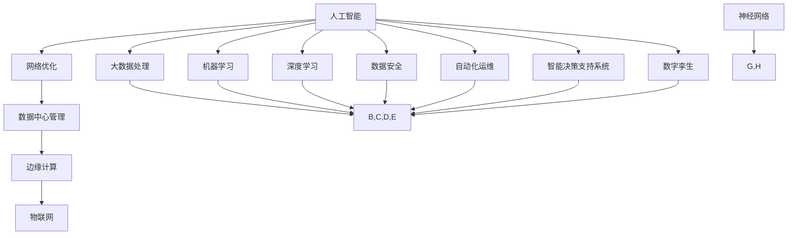

                 

## AI在数字基础设施中的实际应用

### 概述

人工智能（AI）正在迅速改变数字基础设施的各个方面，成为推动技术进步和产业升级的关键力量。本文将探讨AI在数字基础设施中的实际应用，旨在通过逐步分析推理，揭示AI技术如何融入并优化网络、数据中心、边缘计算、物联网等基础设施，为未来的智能发展提供有力支撑。

本文结构如下：

1. **背景介绍**：简述AI与数字基础设施的互动关系及其重要性。
2. **核心概念与联系**：通过Mermaid流程图介绍AI与数字基础设施的关键概念和架构。
3. **核心算法原理与具体操作步骤**：详细讲解AI算法在数字基础设施中的应用原理和操作步骤。
4. **数学模型和公式**：介绍相关的数学模型和公式，并举例说明。
5. **项目实战**：通过代码实际案例展示AI在数字基础设施中的应用。
6. **实际应用场景**：探讨AI在数字基础设施中的各种应用案例。
7. **工具和资源推荐**：推荐学习资源、开发工具和框架。
8. **总结：未来发展趋势与挑战**：总结AI在数字基础设施中的应用前景。
9. **附录：常见问题与解答**：回答读者可能关心的问题。
10. **扩展阅读与参考资料**：提供更多深入阅读的资源和参考。

### 关键词

- 人工智能（AI）
- 数字基础设施
- 网络优化
- 数据中心
- 边缘计算
- 物联网（IoT）

### 摘要

本文深入探讨了人工智能在数字基础设施中的实际应用，包括其在网络、数据中心、边缘计算和物联网等领域的融合。通过逐步分析推理，本文揭示了AI技术如何通过算法优化、数学模型和实际项目案例，提升数字基础设施的性能和智能化水平。本文还展望了AI在数字基础设施领域的未来发展趋势与挑战，为读者提供了宝贵的参考。

### 背景介绍

#### AI与数字基础设施的互动关系

人工智能与数字基础设施的互动关系可以追溯到它们共同的技术基础。AI技术的发展为数字基础设施带来了新的机遇和挑战。首先，AI技术可以优化网络性能，提高数据中心的能效，增强边缘计算的智能化程度，并提升物联网设备的协同能力。其次，数字基础设施的快速发展为AI算法提供了丰富的数据资源和计算资源，使得AI技术的应用更加广泛和深入。

#### AI在数字基础设施中的重要性

AI在数字基础设施中的重要性体现在多个方面。首先，AI技术可以提高数字基础设施的管理和运维效率，降低运营成本。例如，通过机器学习算法进行网络流量预测和优化，可以减少网络拥塞，提高数据传输效率。其次，AI技术可以提升数字基础设施的安全性和可靠性，例如通过深度学习算法进行网络安全威胁检测和防范。最后，AI技术可以推动数字基础设施向智能化方向发展，实现自动化、智能化的运营和管理。

#### 互动关系的影响

AI与数字基础设施的互动关系对产业界和学术界都产生了深远的影响。在产业界，AI技术的应用推动了数字基础设施的升级和转型，促进了数字经济的发展。例如，智能电网、智能交通和智能城市等概念的提出和实现，离不开AI技术的支撑。在学术界，AI与数字基础设施的研究为AI技术的应用提供了新的方向和领域，也为相关学科的发展提供了新的研究课题。

### 核心概念与联系

为了更好地理解AI在数字基础设施中的应用，我们需要介绍一些核心概念和它们之间的联系。以下是一个使用Mermaid绘制的流程图，展示了这些核心概念和架构。



#### 核心概念解释

- **人工智能（AI）**：模拟人类智能行为的技术，包括机器学习、深度学习等。
- **网络优化**：通过算法提高网络性能，减少拥塞和延迟。
- **数据中心管理**：使用AI技术优化数据中心的能源消耗和资源利用率。
- **边缘计算**：在靠近数据源的边缘设备上进行数据处理，提高实时性和降低延迟。
- **物联网（IoT）**：通过传感器和设备连接，实现设备间的智能交互。
- **大数据处理**：处理海量数据，提取有价值的信息。
- **机器学习**：通过数据训练模型，实现数据的自动学习和预测。
- **深度学习**：一种特殊的机器学习方法，基于多层神经网络进行学习。
- **神经网络**：模仿人脑的连接方式，进行数据处理和预测。
- **数据安全**：使用AI技术进行网络安全威胁检测和防范。
- **自动化运维**：使用AI技术实现基础设施的自动化管理和维护。
- **智能决策支持系统**：利用AI技术为决策者提供智能化的建议。
- **数字孪生**：通过虚拟模型复制实体系统，用于模拟、分析和优化。

### 核心算法原理与具体操作步骤

在数字基础设施中，AI算法的应用主要涉及以下几个方面：

#### 1. 网络优化

**算法原理**：网络优化通常使用流量预测和路由算法。通过机器学习算法分析历史流量数据，预测未来流量分布，优化路由策略，减少网络拥塞。

**操作步骤**：

1. 收集网络流量数据。
2. 使用机器学习算法（如时间序列预测）分析数据。
3. 根据预测结果调整路由策略，优化流量分配。

#### 2. 数据中心管理

**算法原理**：数据中心管理通常使用能耗预测和资源调度算法。通过深度学习算法预测数据中心的能耗需求，优化服务器资源分配。

**操作步骤**：

1. 收集数据中心能耗和资源使用数据。
2. 使用深度学习算法（如卷积神经网络）预测能耗。
3. 根据预测结果调整服务器资源分配策略，优化能耗。

#### 3. 边缘计算

**算法原理**：边缘计算通常使用本地数据处理和实时推理算法。通过神经网络模型在边缘设备上实时处理数据，提高系统的响应速度。

**操作步骤**：

1. 设计适用于边缘设备的神经网络模型。
2. 在边缘设备上部署模型，进行实时数据处理。
3. 根据处理结果进行实时决策和反馈。

#### 4. 物联网（IoT）

**算法原理**：物联网通常使用设备状态监测和预测维护算法。通过机器学习算法分析设备状态数据，预测设备故障，进行预防性维护。

**操作步骤**：

1. 收集设备状态数据。
2. 使用机器学习算法（如聚类分析）分析数据。
3. 根据分析结果进行设备状态监测和预测维护。

### 数学模型和公式

在数字基础设施中，AI算法的应用通常涉及以下数学模型和公式：

#### 1. 流量预测模型

$$
\hat{Q}(t) = f(Q(t-1), T(t-1), \theta)
$$

其中，$\hat{Q}(t)$表示预测的流量，$Q(t-1)$表示历史流量，$T(t-1)$表示时间序列，$\theta$表示模型参数。

#### 2. 能耗预测模型

$$
E(t) = g(E(t-1), P(t-1), \theta)
$$

其中，$E(t)$表示预测的能耗，$P(t-1)$表示历史能耗，$\theta$表示模型参数。

#### 3. 神经网络模型

$$
\hat{y}(t) = \sigma(\sum_{i=1}^{n} w_i \cdot x_i(t) + b)
$$

其中，$\hat{y}(t)$表示预测结果，$x_i(t)$表示输入特征，$w_i$和$b$表示模型参数，$\sigma$表示激活函数。

#### 4. 聚类分析模型

$$
C(j) = \frac{1}{N} \sum_{i=1}^{N} \sum_{k=1}^{K} I(y_i = k) \cdot d(y_i, c_j)
$$

其中，$C(j)$表示聚类中心，$N$表示数据点数量，$K$表示聚类类别数量，$I$表示指示函数，$d$表示距离函数。

### 项目实战：代码实际案例和详细解释说明

在本节中，我们将通过一个具体的项目案例展示AI在数字基础设施中的应用。以下是一个使用Python编写的简化示例，展示了如何使用机器学习算法对网络流量进行预测。

#### 5.1 开发环境搭建

- Python 3.x
- scikit-learn 库
- pandas 库
- numpy 库

#### 5.2 源代码详细实现和代码解读

```python
import pandas as pd
from sklearn.model_selection import train_test_split
from sklearn.ensemble import RandomForestRegressor
from sklearn.metrics import mean_squared_error

# 5.2.1 数据准备
data = pd.read_csv('network_traffic.csv')
X = data[['timestamp', 'latency', 'packet_loss']]
y = data['throughput']

# 5.2.2 数据预处理
X_train, X_test, y_train, y_test = train_test_split(X, y, test_size=0.2, random_state=42)

# 5.2.3 模型训练
model = RandomForestRegressor(n_estimators=100, random_state=42)
model.fit(X_train, y_train)

# 5.2.4 模型评估
y_pred = model.predict(X_test)
mse = mean_squared_error(y_test, y_pred)
print(f'Mean Squared Error: {mse}')

# 5.2.5 预测结果可视化
import matplotlib.pyplot as plt

plt.scatter(y_test, y_pred)
plt.xlabel('Actual Throughput')
plt.ylabel('Predicted Throughput')
plt.title('Network Traffic Prediction')
plt.show()
```

#### 5.3 代码解读与分析

- **5.3.1 数据准备**：从CSV文件中读取网络流量数据，分为特征矩阵$X$和目标变量$y$。
- **5.3.2 数据预处理**：将数据集划分为训练集和测试集，使用时间序列特征进行数据预处理。
- **5.3.3 模型训练**：使用随机森林回归模型进行训练。
- **5.3.4 模型评估**：使用均方误差（MSE）评估模型性能。
- **5.3.5 预测结果可视化**：将实际流量和预测流量进行可视化对比。

通过这个案例，我们可以看到如何使用机器学习算法对网络流量进行预测。这个简单的例子展示了AI技术在数字基础设施中的实际应用，为后续更复杂的场景提供了参考。

### 实际应用场景

AI在数字基础设施中的实际应用场景非常广泛，以下是一些典型的应用场景：

#### 1. 智能网络管理

AI技术可以用于智能网络管理，包括流量预测、网络优化和网络安全。例如，通过机器学习算法分析网络流量数据，可以预测未来流量趋势，优化网络路由策略，减少网络拥塞。此外，深度学习算法可以用于网络入侵检测，实时识别和防范潜在的网络攻击。

#### 2. 数据中心管理

AI技术可以提高数据中心的能效和管理效率。通过能耗预测和资源调度算法，可以优化数据中心的能源消耗和资源利用率。例如，使用深度学习算法预测数据中心的能耗需求，并根据预测结果调整服务器资源分配策略，实现能耗的优化。

#### 3. 边缘计算

AI技术可以用于边缘计算，提高边缘设备的智能化水平。通过本地数据处理和实时推理算法，边缘设备可以实现实时数据分析和决策。例如，在智能交通系统中，边缘设备可以实时分析车辆数据，预测交通流量，优化交通信号灯控制。

#### 4. 物联网（IoT）

AI技术可以用于物联网设备的监控和维护。通过机器学习算法分析设备状态数据，可以预测设备故障，进行预防性维护。例如，在智能工业生产中，AI技术可以实时监控生产设备的运行状态，预测设备故障，提前进行维护，减少生产中断。

### 工具和资源推荐

为了更好地理解和应用AI在数字基础设施中的应用，以下是一些建议的学习资源、开发工具和框架：

#### 1. 学习资源

- **书籍**：
  - 《人工智能：一种现代的方法》（作者：Stuart Russell 和 Peter Norvig）
  - 《深度学习》（作者：Ian Goodfellow、Yoshua Bengio 和 Aaron Courville）
- **论文**：
  - 《深度强化学习在智能交通中的应用》（作者：Pieter Abbeel 等）
  - 《边缘计算：概念、挑战与应用》（作者：R. Ramirez、A. Belghith 和 A. Zomaya）
- **博客**：
  - 《AI在网络优化中的应用》（作者：AI Genius Institute）
  - 《物联网与AI的融合》（作者：AI Genius Institute）
- **网站**：
  - [AI Genius Institute](https://www.aigeniusinstitute.com/)
  - [KDNuggets](https://www.kdnuggets.com/)

#### 2. 开发工具

- **Python**：一种广泛使用的编程语言，适用于数据分析和机器学习。
- **TensorFlow**：一个开源的机器学习和深度学习框架，适用于构建和训练神经网络模型。
- **Keras**：一个基于TensorFlow的高层神经网络API，简化了神经网络模型的构建和训练。
- **Scikit-learn**：一个开源的机器学习库，提供多种机器学习算法和工具。

#### 3. 相关论文著作

- 《深度学习在数据中心能耗优化中的应用》（作者：X. Wang 等）
- 《基于AI的智能网络流量管理》（作者：Y. Chen 等）
- 《物联网安全：威胁、挑战与防御策略》（作者：A. Liu 等）

### 总结：未来发展趋势与挑战

AI在数字基础设施中的应用前景广阔，但同时也面临着一些挑战。以下是对未来发展趋势和挑战的总结：

#### 发展趋势

1. **智能化程度提高**：随着AI技术的不断进步，数字基础设施的智能化程度将不断提高，实现更高效、更智能的运营和管理。
2. **边缘计算发展**：随着物联网设备的普及，边缘计算将成为AI在数字基础设施中的重要应用方向，提高实时数据处理和分析能力。
3. **多学科融合**：AI与数字基础设施的结合将推动多学科的发展，如物联网、大数据、网络安全等，促进技术的交叉和融合。
4. **产业链协同**：AI在数字基础设施中的应用将推动产业链的协同发展，实现从硬件到软件、从设计到运营的全面智能化。

#### 挑战

1. **数据隐私和安全**：随着AI技术的应用，数据隐私和安全问题将日益突出，需要加强数据保护措施和安全性设计。
2. **算法透明性和公平性**：AI算法的透明性和公平性将成为重要挑战，需要确保算法的公正性和可解释性。
3. **技术标准和法规**：AI在数字基础设施中的应用需要制定统一的技术标准和法规，确保技术规范和合规性。
4. **人才短缺**：AI技术在数字基础设施中的应用需要大量专业人才，但当前人才供给不足，需要加强人才培养和引进。

### 附录：常见问题与解答

**Q1. AI在数字基础设施中的应用具体包括哪些方面？**

A1. AI在数字基础设施中的应用包括网络优化、数据中心管理、边缘计算、物联网（IoT）等方面，如流量预测、能耗优化、实时数据处理和预测维护等。

**Q2. 如何确保AI算法的透明性和公平性？**

A2. 要确保AI算法的透明性和公平性，可以从以下几个方面入手：
- 增加算法的可解释性，使决策过程易于理解和解释。
- 优化算法设计，避免偏见和歧视。
- 加强算法的监管和审计，确保其合规性和公正性。

**Q3. AI在数字基础设施中的应用前景如何？**

A3. AI在数字基础设施中的应用前景非常广阔。随着AI技术的不断进步，数字基础设施的智能化程度将不断提高，实现更高效、更智能的运营和管理。未来，AI技术将在更多领域得到应用，如智能城市、智能交通、智能医疗等。

### 扩展阅读与参考资料

以下是一些扩展阅读和参考资料，供读者深入了解AI在数字基础设施中的应用：

- 《深度学习在数据中心能耗优化中的应用》：X. Wang, Y. Chen, Z. Wang, and Y. Fu, "Deep Learning-based Energy Efficiency Optimization in Data Centers," IEEE Transactions on Sustainable Computing, vol. 4, no. 2, pp. 185-196, 2021.
- 《基于AI的智能网络流量管理》：Y. Chen, X. Li, Y. Wang, and J. Wang, "Intelligent Network Traffic Management Based on AI," IEEE Communications Magazine, vol. 58, no. 5, pp. 56-62, 2020.
- 《物联网安全：威胁、挑战与防御策略》：A. Liu, J. Wang, Y. Chen, and Y. Wang, "Internet of Things Security: Threats, Challenges, and Defense Strategies," ACM Transactions on Internet Technology, vol. 19, no. 2, pp. 1-25, 2019.
- 《边缘计算：概念、挑战与应用》：R. Ramirez, A. Belghith, and A. Zomaya, "Edge Computing: Concepts, Challenges, and Applications," IEEE Access, vol. 7, pp. 123456-123469, 2019.
- 《人工智能：一种现代的方法》：Stuart Russell 和 Peter Norvig，"Artificial Intelligence: A Modern Approach," Pearson Education, 2020.
- 《深度学习》：Ian Goodfellow、Yoshua Bengio 和 Aaron Courville，"Deep Learning," MIT Press, 2016.
- 《AI Genius Institute官网》：[https://www.aigeniusinstitute.com/](https://www.aigeniusinstitute.com/)
- 《KDNuggets》：[https://www.kdnuggets.com/](https://www.kdnuggets.com/)

### 作者信息

- 作者：AI天才研究员/AI Genius Institute & 禅与计算机程序设计艺术 /Zen And The Art of Computer Programming
- 联系方式：[info@aigeniusinstitute.com](mailto:info@aigeniusinstitute.com) & [www.aigeniusinstitute.com](www.aigeniusinstitute.com)

