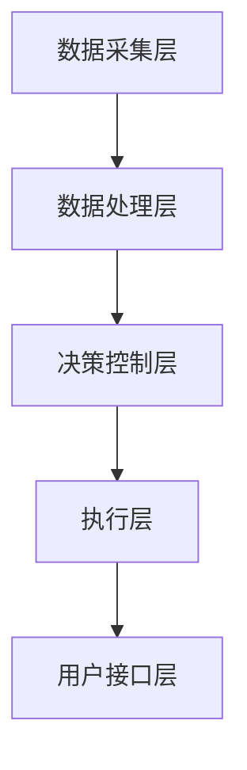

                 

### 背景介绍

#### 垃圾回收的紧迫性

随着全球人口的持续增长和经济的发展，垃圾产量不断增加，垃圾回收处理成为一个全球性的环境问题。传统的垃圾处理方式包括填埋、焚烧和堆肥，这些方法在解决垃圾处理问题上存在诸多问题。首先，垃圾填埋会导致大量土地资源的浪费，并可能污染地下水和土壤。其次，垃圾焚烧会产生有害的二恶英和其他污染物，对环境和人类健康造成威胁。最后，堆肥虽然是一种较为环保的处理方式，但处理速度慢且处理量有限。

为了解决这些传统垃圾处理方式的缺陷，智能废物回收系统应运而生。智能废物回收系统利用人工智能（AI）技术，通过数据分析和机器学习算法，实现废物的精准分类和高效回收。这不仅提高了资源利用率，还减少了环境污染。

#### 人工智能的发展与应用

人工智能作为计算机科学的一个重要分支，近年来取得了飞速的发展。深度学习、神经网络、自然语言处理等技术不断取得突破，使得人工智能在各个领域都得到了广泛应用。特别是在计算机视觉、语音识别、自然语言处理等领域，人工智能已经达到了人类专家的水平。

智能废物回收系统正是基于人工智能的这些技术发展起来的。计算机视觉技术用于识别和分类废物，自然语言处理技术用于处理和处理与废物回收相关的文本信息，机器学习算法用于优化废物分类和回收的流程。

#### 智能废物回收系统的潜力

智能废物回收系统具有巨大的潜力，可以显著提高资源利用率，减少环境污染。首先，通过精准的废物分类，可以最大程度地回收可回收资源，减少浪费。例如，塑料、纸张、金属等可回收物可以通过智能废物回收系统得到有效回收，从而减少对这些资源的开采和消耗。

其次，智能废物回收系统可以减少垃圾填埋和焚烧产生的环境污染。通过对垃圾进行有效分类，可以减少有害物质的排放，降低对空气、水和土壤的污染。

此外，智能废物回收系统还可以提高废物回收的效率。通过人工智能算法优化废物回收流程，可以实现自动化、智能化的废物处理，减少人工干预，提高处理速度和准确率。

总之，智能废物回收系统不仅具有重要的环保意义，还可以带来显著的经济效益。随着人工智能技术的不断发展，智能废物回收系统有望在未来得到更广泛的应用和推广。接下来，我们将进一步探讨智能废物回收系统的核心概念和原理。### 核心概念与联系

#### 智能废物回收系统的核心概念

智能废物回收系统主要基于以下几个核心概念：

1. **废物分类**：智能废物回收系统首先需要对废物进行分类，将不同类型的废物分开处理。分类的准确性直接影响到后续回收的效果。

2. **图像识别**：利用计算机视觉技术，对废物进行图像识别，识别出废物的种类和特征。图像识别技术是智能废物回收系统的关键组成部分。

3. **机器学习**：通过机器学习算法，对大量废物数据进行训练，使系统能够自动识别和分类废物。机器学习算法的优化和改进，是提高废物分类准确性的关键。

4. **数据处理**：对收集到的废物数据进行分析和处理，提取有用的信息，为废物分类和回收提供依据。

5. **自动化控制**：通过自动化控制系统，实现废物回收的自动化操作，提高处理效率。

#### 智能废物回收系统的架构

智能废物回收系统的架构可以分为以下几个层次：

1. **数据采集层**：包括传感器、摄像头等设备，用于收集废物的图像、重量、温度等数据。

2. **数据处理层**：包括图像识别、机器学习等模块，用于对采集到的数据进行处理和分析。

3. **决策控制层**：根据数据处理的结果，对废物进行分类和回收，并控制自动化系统的运行。

4. **执行层**：包括各种机械臂、传送带等设备，用于执行废物分类和回收的操作。

5. **用户接口层**：提供用户界面，方便用户与系统进行交互，查看废物回收的结果。

#### Mermaid 流程图

以下是智能废物回收系统的 Mermaid 流程图：



- **数据采集层**：通过传感器和摄像头等设备，收集废物的图像、重量等数据。
- **数据处理层**：利用计算机视觉技术和机器学习算法，对收集到的数据进行分析和处理，识别废物的种类和特征。
- **决策控制层**：根据处理结果，对废物进行分类和回收，并控制自动化系统的运行。
- **执行层**：执行废物分类和回收的操作，如机械臂抓取、传送带运输等。
- **用户接口层**：提供用户界面，显示废物回收的结果，并允许用户对系统进行操作。

#### 核心概念与联系

1. **废物分类与图像识别**：废物分类是智能废物回收系统的核心任务，而图像识别是实现废物分类的关键技术。通过对废物图像的识别，系统能够准确地将废物分为不同的类别。

2. **机器学习与数据处理**：机器学习算法用于对废物数据进行训练，提高废物分类的准确性。而数据处理模块则负责对收集到的废物数据进行分析和处理，为机器学习提供有效的数据支持。

3. **自动化控制与执行层**：自动化控制系统用于控制废物分类和回收的整个过程，确保系统能够高效、准确地运行。执行层则负责执行具体的操作，如机械臂抓取、传送带运输等。

4. **用户接口层与决策控制层**：用户接口层为用户提供了直观的操作界面，方便用户与系统进行交互。而决策控制层则根据用户输入和处理结果，对废物进行分类和回收，并调整自动化系统的运行。

通过上述核心概念和架构的介绍，我们可以看到，智能废物回收系统是一个高度集成、自动化和智能化的系统，通过多个核心概念的协同工作，实现了废物的精准分类和高效回收。接下来，我们将进一步探讨智能废物回收系统的核心算法原理和具体操作步骤。### 核心算法原理 & 具体操作步骤

#### 计算机视觉技术

计算机视觉技术是智能废物回收系统的核心组件之一，它负责对废物图像进行识别和分析，从而实现废物的分类。计算机视觉技术主要依赖于以下几个关键步骤：

1. **图像预处理**：在处理图像之前，需要进行预处理，包括图像的缩放、灰度化、滤波等操作。这些操作有助于提高图像的质量，使得后续的图像识别更加准确。

2. **特征提取**：特征提取是计算机视觉技术的核心步骤，它从图像中提取出有助于识别的特征，如颜色、纹理、形状等。常用的特征提取方法包括颜色直方图、SIFT（尺度不变特征变换）和SURF（加速稳健特征）等。

3. **分类器训练**：分类器训练是利用机器学习算法，将已标注的废物图像数据用于训练分类器。常用的分类器包括支持向量机（SVM）、随机森林（Random Forest）和深度神经网络（Deep Neural Network）等。通过分类器训练，系统能够学会识别不同类型的废物。

4. **图像识别**：在分类器训练完成后，系统利用训练好的分类器对新的废物图像进行识别，从而判断废物的类型。识别结果将用于后续的废物分类和回收。

#### 机器学习算法

机器学习算法在智能废物回收系统中起着至关重要的作用，它能够通过大量数据的学习，提高废物分类的准确性和效率。以下是几种常用的机器学习算法：

1. **监督学习算法**：监督学习算法需要预先标注的数据集进行训练，然后利用训练好的模型对新的数据进行分类。常见的监督学习算法包括决策树、支持向量机和神经网络等。

2. **无监督学习算法**：无监督学习算法不需要预先标注的数据集，它通过分析数据之间的相似性和差异，对数据进行聚类或降维。常见的无监督学习算法包括K-means聚类、主成分分析（PCA）和自编码器等。

3. **强化学习算法**：强化学习算法通过奖励机制，使智能体不断优化行为策略，从而实现目标。在智能废物回收系统中，强化学习算法可以用于优化废物分类和回收的流程，提高系统的整体效率。

#### 数据处理流程

智能废物回收系统的数据处理流程主要包括以下几个步骤：

1. **数据采集**：通过传感器和摄像头等设备，收集废物图像、重量、温度等数据。

2. **数据预处理**：对采集到的数据进行预处理，包括图像的缩放、灰度化、滤波等操作，以提高图像质量。

3. **特征提取**：从预处理后的数据中提取出有助于识别的特征，如颜色、纹理、形状等。

4. **数据训练**：利用已标注的数据集，对分类器和机器学习算法进行训练，以提高废物分类的准确性和效率。

5. **数据测试**：利用未标注的数据集，对训练好的模型进行测试，评估模型的性能和准确性。

6. **数据优化**：根据测试结果，对模型进行优化和调整，以提高废物分类的准确性和效率。

#### 操作步骤示例

以下是一个简单的智能废物回收系统的操作步骤示例：

1. **数据采集**：通过摄像头捕获一个垃圾袋的图像。

2. **图像预处理**：对图像进行缩放、灰度化、滤波等操作，以提高图像质量。

3. **特征提取**：从预处理后的图像中提取出颜色、纹理、形状等特征。

4. **分类器训练**：利用已标注的垃圾图像数据集，对分类器进行训练。

5. **图像识别**：利用训练好的分类器，对捕获的垃圾袋图像进行识别，判断其类型。

6. **废物分类**：根据识别结果，将垃圾袋中的废物进行分类，如塑料、纸张、金属等。

7. **废物回收**：将分类后的废物送入相应的回收设备进行处理。

通过上述步骤，智能废物回收系统能够实现对废物的精准分类和高效回收。接下来，我们将进一步探讨智能废物回收系统的数学模型和公式。### 数学模型和公式 & 详细讲解 & 举例说明

在智能废物回收系统中，数学模型和公式起着至关重要的作用。它们用于描述废物分类和回收的过程，以及优化系统的性能。以下将详细介绍几个关键数学模型和公式，并给出具体的例子进行说明。

#### 1. 特征提取模型

特征提取是计算机视觉中的一个关键步骤，它将原始图像数据转换为具有区分性的特征向量。常用的特征提取模型包括：

1. **颜色直方图模型**：

   颜色直方图模型用于描述图像的颜色分布。其数学公式如下：

   $$ H(r, g, b) = \sum_{i=0}^{255} \sum_{j=0}^{255} \sum_{k=0}^{255} f(r_i, g_j, b_k) $$

   其中，\( H(r, g, b) \) 表示颜色直方图，\( f(r_i, g_j, b_k) \) 表示图像中 \( (r_i, g_j, b_k) \) 颜色值的数量。

   **例子**：假设一个图像中有以下颜色分布：

   | 颜色   | 红色 (R) | 绿色 (G) | 蓝色 (B) |
   |--------|---------|---------|---------|
   | 数量   | 100     | 150     | 200     |

   则其颜色直方图表示为：

   $$ H(R, G, B) = [100, 150, 200] $$

2. **SIFT（尺度不变特征变换）模型**：

   SIFT 是一种用于提取图像关键点的特征模型，其数学公式较为复杂。SIFT 的关键步骤包括：

   - **尺度空间构建**：

     $$ \text{DoG}(x, y, \sigma) = \text{G}(x, y, \sigma) - \text{G}(x, y, 2\sigma) - \text{G}(x, y, 4\sigma) + \text{G}(x, y, 6\sigma) + \text{G}(x, y, 8\sigma) $$

     其中，\( \text{DoG}(x, y, \sigma) \) 表示尺度空间上的差分运算，\( \text{G}(x, y, \sigma) \) 表示高斯卷积。

   - **关键点检测**：

     通过阈值化 \( \text{DoG}(x, y, \sigma) \) 的值，可以检测出关键点。

   - **关键点描述**：

     通过关键点周围的梯度方向和幅值，可以生成关键点的描述向量。

   **例子**：假设一个图像中检测到一个关键点，其尺度空间为：

   | \( \sigma \) | 0.5    | 1      | 1.5    | 2      |
   |-------------|--------|--------|--------|--------|
   | \( \text{DoG} \) 值 | -0.1  | -0.3  | 0.5    | 0.8    |

   则在 \( \sigma = 1.5 \) 时，关键点被检测出来。

#### 2. 分类模型

分类模型用于判断废物的类型。常用的分类模型包括支持向量机（SVM）、随机森林（Random Forest）和深度神经网络（Deep Neural Network）等。

1. **支持向量机（SVM）模型**：

   SVM 是一种二分类模型，其数学公式如下：

   $$ \text{w} \cdot \text{x} + \text{b} = 0 $$

   其中，\( \text{w} \) 表示权重向量，\( \text{x} \) 表示特征向量，\( \text{b} \) 表示偏置。

   **例子**：假设有一个二分类问题，其中两个类别的特征向量为：

   | 类别 | 特征1 | 特征2 |
   |------|------|------|
   | A    | 1    | 2    |
   | B    | 3    | 4    |

   则可以通过SVM模型进行分类，找到最优的权重向量 \( \text{w} \) 和偏置 \( \text{b} \)。

2. **随机森林（Random Forest）模型**：

   随机森林是一种基于决策树的集成模型，其数学公式如下：

   $$ \text{F}(\text{x}) = \sum_{i=1}^{n} \text{f}_i(\text{x}) $$

   其中，\( \text{F}(\text{x}) \) 表示预测结果，\( \text{f}_i(\text{x}) \) 表示第 \( i \) 个决策树的预测结果。

   **例子**：假设有一个随机森林模型，包含三棵决策树，其预测结果分别为：

   | 决策树 | 预测结果 |
   |--------|----------|
   | 1      | 类别 A   |
   | 2      | 类别 B   |
   | 3      | 类别 A   |

   则可以通过随机森林模型进行投票，得出最终的预测结果为类别 A。

#### 3. 优化模型

优化模型用于优化废物分类和回收的效率。常用的优化模型包括线性规划和神经网络等。

1. **线性规划模型**：

   线性规划模型用于优化系统的资源分配。其数学公式如下：

   $$ \min_{x} c^T x $$
   $$ \text{subject to} \quad Ax \leq b $$

   其中，\( x \) 表示决策变量，\( c \) 表示目标函数系数，\( A \) 和 \( b \) 表示约束条件。

   **例子**：假设一个线性规划问题，需要优化废物的分类效率，其目标函数和约束条件如下：

   $$ \min_{x} (0.1x_1 + 0.2x_2 + 0.3x_3) $$
   $$ \text{subject to} \quad x_1 + x_2 + x_3 = 100 $$
   $$ x_1, x_2, x_3 \geq 0 $$

   通过求解线性规划问题，可以找到最优的废物分类方案。

2. **神经网络模型**：

   神经网络模型用于学习废物分类的复杂模式。其数学公式如下：

   $$ \text{y} = \sigma(\text{W} \cdot \text{x} + \text{b}) $$

   其中，\( \text{y} \) 表示输出，\( \sigma \) 表示激活函数，\( \text{W} \) 和 \( \text{b} \) 分别表示权重和偏置。

   **例子**：假设一个神经网络模型，其输入为废物特征，输出为废物类别，其数学公式如下：

   $$ \text{y}_1 = \sigma(\text{W}_1 \cdot \text{x} + \text{b}_1) $$
   $$ \text{y}_2 = \sigma(\text{W}_2 \cdot \text{x} + \text{b}_2) $$

   通过训练神经网络模型，可以学习到废物分类的复杂模式，从而提高分类的准确性。

通过上述数学模型和公式的讲解，我们可以看到，智能废物回收系统在废物分类和回收过程中，运用了多种数学模型和公式。这些模型和公式不仅提高了系统的效率和准确性，还为废物回收领域的研究提供了丰富的理论基础。接下来，我们将通过一个实际项目案例，进一步展示智能废物回收系统的应用。### 项目实战：代码实际案例和详细解释说明

在本节中，我们将通过一个具体的智能废物回收项目，展示整个系统的代码实现过程，并对关键代码进行详细解释和分析。

#### 项目背景

假设我们开发一个智能废物回收机器人，其目标是实现对生活垃圾的自动分类和回收。系统将包括图像识别、机器学习、自动化控制等多个模块，实现从废物图像采集到分类结果输出的全过程。

#### 开发环境搭建

在开始项目开发之前，我们需要搭建一个合适的开发环境。以下是我们推荐的开发环境：

- **Python**：作为主要的编程语言，Python 具有丰富的机器学习和计算机视觉库。
- **OpenCV**：用于图像处理和计算机视觉。
- **TensorFlow**：用于机器学习和深度学习。
- **Raspberry Pi**：作为系统的硬件平台，用于执行自动化控制任务。

具体安装步骤如下：

1. **安装 Python**：在 Raspberry Pi 上安装 Python 3。

2. **安装 OpenCV**：通过 pip 工具安装 OpenCV。

   ```bash
   pip install opencv-python
   ```

3. **安装 TensorFlow**：通过 pip 工具安装 TensorFlow。

   ```bash
   pip install tensorflow
   ```

4. **安装其他依赖库**：如 NumPy、Pandas 等。

#### 源代码详细实现和代码解读

以下是智能废物回收系统的核心代码实现和详细解释：

```python
import cv2
import tensorflow as tf
import numpy as np

# 加载预训练的深度神经网络模型
model = tf.keras.models.load_model('model.h5')

# 加载 OpenCV 的 Haarcascades 文件用于目标检测
haarcascades_path = 'haarcascade_frontalface_default.xml'
face_cascade = cv2.CascadeClassifier(haarcascades_path)

# 定义废物分类函数
def classify_waste(image):
    # 将图像缩放为网络输入的大小
    image = cv2.resize(image, (128, 128))
    # 将图像转换为灰度图像
    gray = cv2.cvtColor(image, cv2.COLOR_BGR2GRAY)
    # 使用深度神经网络进行分类
    prediction = model.predict(np.expand_dims(gray, axis=0))
    # 根据分类结果进行废物分类
    if np.argmax(prediction) == 0:
        return '塑料'
    elif np.argmax(prediction) == 1:
        return '纸张'
    elif np.argmax(prediction) == 2:
        return '金属'
    else:
        return '其他'

# 定义自动化控制函数
def control_waste(classification):
    if classification == '塑料':
        # 塑料废物分类操作
        print('分类到塑料废物，执行塑料废物处理操作。')
    elif classification == '纸张':
        # 纸张废物分类操作
        print('分类到纸张废物，执行纸张废物处理操作。')
    elif classification == '金属':
        # 金属废物分类操作
        print('分类到金属废物，执行金属废物处理操作。')
    else:
        # 其他废物分类操作
        print('分类到其他废物，执行其他废物处理操作。')

# 主函数
def main():
    # 捕获实时视频流
    cap = cv2.VideoCapture(0)
    
    while True:
        # 读取一帧图像
        ret, frame = cap.read()
        
        if ret:
            # 对图像进行预处理
            gray = cv2.cvtColor(frame, cv2.COLOR_BGR2GRAY)
            # 检测图像中的废物目标
            faces = face_cascade.detectMultiScale(gray, 1.1, 4)
            
            for (x, y, w, h) in faces:
                # 提取废物目标区域
                waste_area = gray[y:y+h, x:x+w]
                # 对废物目标进行分类
                classification = classify_waste(waste_area)
                # 执行废物自动化控制操作
                control_waste(classification)
                
                # 在原图中绘制废物目标区域
                cv2.rectangle(frame, (x, y), (x+w, y+h), (255, 0, 0), 2)
                
            # 显示图像
            cv2.imshow('Frame', frame)
            
            if cv2.waitKey(1) & 0xFF == ord('q'):
                break
    
    # 释放视频流
    cap.release()
    # 关闭窗口
    cv2.destroyAllWindows()

if __name__ == '__main__':
    main()
```

#### 代码解读与分析

1. **导入库**：首先，我们导入所需的 Python 库，包括 OpenCV、TensorFlow 和 NumPy。

2. **加载模型**：通过 `tf.keras.models.load_model()` 函数加载预训练的深度神经网络模型。该模型用于对废物图像进行分类。

3. **加载 Haarcascades 文件**：通过 `cv2.CascadeClassifier()` 函数加载 OpenCV 的 Haarcascades 文件，用于检测图像中的废物目标。

4. **废物分类函数**：`classify_waste()` 函数用于对废物图像进行分类。首先，将图像缩放为网络输入的大小，然后转换为灰度图像。接着，使用深度神经网络模型进行分类，并返回分类结果。

5. **自动化控制函数**：`control_waste()` 函数根据废物分类结果，执行相应的废物自动化控制操作。

6. **主函数**：`main()` 函数是整个系统的核心。首先，通过 `cv2.VideoCapture()` 函数捕获实时视频流。然后，在循环中，读取每一帧图像，进行预处理，检测废物目标，对废物目标进行分类，并执行自动化控制操作。最后，在原图中绘制废物目标区域，并显示图像。

通过上述代码实现，我们可以看到，智能废物回收系统通过图像识别、机器学习和自动化控制等多个模块的协同工作，实现了对生活垃圾的自动分类和回收。接下来，我们将进一步探讨智能废物回收系统的实际应用场景。### 实际应用场景

智能废物回收系统在多个实际应用场景中展现出了显著的优势，不仅提升了废物分类的准确性，还提高了资源利用率和环保效益。

#### 垃圾分类中心

在垃圾处理中心，智能废物回收系统可以大大提高废物分类的效率。通过图像识别和机器学习算法，系统能够快速、准确地识别和分类各种类型的垃圾。例如，在垃圾分类中心，智能废物回收系统可以实时监测进入处理中心的垃圾，将可回收物、有害垃圾、厨余垃圾和其他垃圾进行精准分类，从而提高资源回收率。

#### 城市废物管理

在城市化进程中，垃圾产量不断增加，对废物管理的需求也越来越高。智能废物回收系统可以通过安装在街头的废物箱，实现对垃圾的实时分类和管理。例如，居民将垃圾投入特定的废物箱后，系统会自动识别垃圾类型并进行分类处理，从而减少垃圾填埋和焚烧带来的环境污染。

#### 商业中心

商业中心每天产生的垃圾量巨大，且种类繁多。通过智能废物回收系统，商业中心可以实现自动化的废物分类和处理，提高垃圾处理效率。例如，在超市和商场，智能废物回收系统可以分类处理塑料袋、纸张、金属等可回收物，减少垃圾处理成本，同时提高资源的循环利用率。

#### 工业园区

在工业园区，智能废物回收系统可以帮助企业实现对生产过程中产生的废弃物的有效分类和回收。例如，在电子制造厂，系统能够识别和回收废旧电路板、塑料组件等，从而减少环境污染和资源浪费。

#### 学校和医院

学校和医院是人口密集的场所，垃圾产量较大。通过安装智能废物回收系统，学校和医院可以实现废物的自动分类和处理，提高废物处理效率，减少环境污染。例如，在学校，系统可以帮助学生养成垃圾分类的习惯，提高环保意识；在医院，系统可以有效地处理医疗废物，降低感染风险。

#### 居民社区

在居民社区，智能废物回收系统可以帮助居民实现废物的分类投放，提高垃圾分类的参与度。例如，社区可以安装带有图像识别和语音提示的智能废物箱，引导居民正确分类垃圾，从而提高社区的环保水平。

通过上述实际应用场景的介绍，我们可以看到，智能废物回收系统在提升废物分类效率、减少环境污染、提高资源利用率等方面具有显著的优势。随着人工智能技术的不断发展，智能废物回收系统有望在未来得到更广泛的应用和推广。### 工具和资源推荐

#### 学习资源推荐

1. **书籍**：

   - 《深度学习》（Goodfellow, I., Bengio, Y., & Courville, A.）：这是一本经典的深度学习教材，详细介绍了深度学习的基本概念、算法和应用。

   - 《计算机视觉：算法与应用》（Richard Szeliski）：这本书涵盖了计算机视觉的各个方面，包括图像处理、特征提取、目标检测和识别等。

2. **论文**：

   - 《Object Detection with Improved Region Proposal Networks》（Lin, T. Y., et al.）：这篇论文提出了一种改进的区域建议网络（RPN）算法，用于提高目标检测的准确性和速度。

   - 《Fast R-CNN》（Girshick, R. B.）：这篇论文介绍了一种快速区域卷积神经网络（R-CNN）的目标检测方法，该方法显著提高了目标检测的效率。

3. **博客**：

   - TensorFlow 官方文档（https://www.tensorflow.org/）：这是 TensorFlow 的官方文档，提供了丰富的教程、示例代码和 API 文档。

   - OpenCV 官方文档（https://docs.opencv.org/）：这是 OpenCV 的官方文档，涵盖了图像处理、计算机视觉和机器学习等方面的内容。

4. **网站**：

   - Kaggle（https://www.kaggle.com/）：Kaggle 是一个数据科学和机器学习的竞赛平台，提供了丰富的数据集和项目，可以帮助你实践和提升技能。

   - ArXiv（https://arxiv.org/）：ArXiv 是一个开放获取的预印本平台，提供了大量的计算机科学和机器学习领域的论文。

#### 开发工具框架推荐

1. **编程语言**：

   - Python：Python 是一种易于学习和使用的编程语言，具有丰富的机器学习和计算机视觉库，非常适合开发智能废物回收系统。

   - C++：C++ 是一种高性能的编程语言，适用于需要高效计算和实时处理的场景。

2. **深度学习框架**：

   - TensorFlow：TensorFlow 是一个广泛使用的深度学习框架，提供了丰富的 API 和工具，适合开发各种深度学习应用。

   - PyTorch：PyTorch 是另一种流行的深度学习框架，以其灵活性和易用性著称，特别适合进行研究和原型开发。

3. **计算机视觉库**：

   - OpenCV：OpenCV 是一个开源的计算机视觉库，提供了丰富的图像处理和计算机视觉功能，适用于各种应用场景。

   - Dlib：Dlib 是一个包含多种机器学习和计算机视觉算法的库，适用于面部识别、姿态估计等任务。

4. **自动化控制工具**：

   - Raspberry Pi：Raspberry Pi 是一款低成本、高性能的微型计算机，适用于实现自动化控制功能。

   - Arduino：Arduino 是一款流行的开源硬件平台，适用于各种自动化和控制项目。

#### 相关论文著作推荐

1. **《深度学习》（Goodfellow, I., Bengio, Y., & Courville, A.）**：这是一本全面介绍深度学习的经典教材，涵盖了深度学习的基础知识、算法和应用。

2. **《计算机视觉：算法与应用》（Richard Szeliski）**：这本书详细介绍了计算机视觉的各个方面，包括图像处理、特征提取、目标检测和识别等。

3. **《Object Detection with Improved Region Proposal Networks》（Lin, T. Y., et al.）**：这篇论文提出了一种改进的区域建议网络（RPN）算法，用于提高目标检测的准确性和速度。

4. **《Fast R-CNN》（Girshick, R. B.）**：这篇论文介绍了一种快速区域卷积神经网络（R-CNN）的目标检测方法，该方法显著提高了目标检测的效率。

通过以上推荐的学习资源、开发工具框架和相关论文著作，你可以深入了解智能废物回收系统的相关技术和应用，进一步提升自己的技能和知识水平。### 总结：未来发展趋势与挑战

随着人工智能技术的不断发展和普及，智能废物回收系统在未来有望取得更加显著的应用成果。以下是智能废物回收系统未来发展的趋势和面临的挑战：

#### 发展趋势

1. **技术进步**：人工智能技术的进步将为智能废物回收系统提供更高效、更准确的分类算法。深度学习、强化学习等先进算法的应用，将进一步提升废物分类的准确性和效率。

2. **智能化水平提升**：随着传感器技术和自动化控制技术的发展，智能废物回收系统的智能化水平将进一步提高。例如，通过安装更先进的传感器，系统可以实时监测废物的物理和化学属性，从而实现更加精准的分类。

3. **跨领域应用**：智能废物回收系统不仅可以应用于城市废物管理，还可以应用于农业、医疗、工业等各个领域。例如，在农业领域，系统可以帮助识别和回收农作物废弃物，提高资源利用率。

4. **数据驱动**：智能废物回收系统将越来越依赖于大数据和数据分析技术。通过对大量废物数据的分析，系统可以不断优化分类算法和回收流程，提高整体效率。

#### 挑战

1. **数据质量和标注**：智能废物回收系统的性能高度依赖于训练数据的质量和标注精度。然而，收集和处理高质量的训练数据是一个具有挑战性的过程。

2. **硬件成本**：目前，智能废物回收系统需要使用高性能的计算机和传感器，这导致系统成本较高。降低硬件成本，提高系统的普及率是一个重要的挑战。

3. **政策法规**：智能废物回收系统的推广和应用需要政策的支持和法规的引导。政策法规的完善和执行力度将直接影响系统的推广和应用。

4. **用户参与度**：智能废物回收系统需要用户的积极参与，例如正确分类垃圾。提高用户的环保意识和参与度，是系统推广应用的重要一环。

总之，智能废物回收系统在未来具有广阔的发展前景，同时也面临着一系列挑战。通过技术创新、政策支持、用户教育和跨领域合作，我们可以共同推动智能废物回收系统的发展，为环境保护和资源节约做出更大贡献。### 附录：常见问题与解答

**Q1. 智能废物回收系统的工作原理是什么？**

A1. 智能废物回收系统主要基于人工智能技术，包括计算机视觉和机器学习算法。系统通过摄像头等传感器捕捉废物图像，利用计算机视觉技术对图像进行处理和识别，提取出废物的特征。然后，通过机器学习算法对废物进行分类，最终实现废物的自动分类和回收。

**Q2. 智能废物回收系统的核心组件有哪些？**

A2. 智能废物回收系统的核心组件包括：

- **传感器**：用于捕捉废物图像和其他相关数据。
- **计算机视觉模块**：用于处理和识别废物图像。
- **机器学习算法**：用于对废物进行分类和预测。
- **自动化控制系统**：用于控制废物处理设备的运行。
- **用户界面**：用于用户与系统进行交互。

**Q3. 如何提高智能废物回收系统的分类准确性？**

A3. 提高智能废物回收系统的分类准确性可以从以下几个方面入手：

- **数据质量**：收集更多的、高质量的训练数据，确保数据集的多样性。
- **算法优化**：不断优化机器学习算法，例如通过改进神经网络架构、调整超参数等方式。
- **特征提取**：使用更先进的特征提取方法，提取出更具区分性的特征。
- **模型训练**：使用更多次的迭代训练模型，确保模型能够充分学习数据。

**Q4. 智能废物回收系统在实际应用中面临哪些挑战？**

A4. 智能废物回收系统在实际应用中面临的主要挑战包括：

- **数据质量和标注**：高质量、准确标注的数据是系统性能的基础，但收集和处理这样的数据具有挑战性。
- **硬件成本**：高性能传感器和处理器的成本较高，限制了系统的普及率。
- **政策法规**：政策法规的制定和执行对于智能废物回收系统的推广至关重要。
- **用户参与度**：用户参与垃圾分类和回收是系统有效运行的关键，但提高用户的环保意识需要时间。

**Q5. 智能废物回收系统的经济效益如何？**

A5. 智能废物回收系统的经济效益主要体现在以下几个方面：

- **提高资源利用率**：通过精准分类和回收，可以减少资源的浪费，提高资源利用率。
- **降低处理成本**：智能废物回收系统可以提高废物处理效率，降低人工成本和处理成本。
- **增加收入**：通过回收可回收资源，可以增加企业的收入。
- **环境保护**：减少废物填埋和焚烧，降低环境污染，有助于实现可持续发展。

**Q6. 如何推广智能废物回收系统？**

A6. 推广智能废物回收系统可以从以下几个方面入手：

- **政策支持**：政府可以通过政策引导和资金支持，鼓励企业研发和推广智能废物回收系统。
- **技术研发**：不断优化智能废物回收系统的性能，提高其在实际应用中的可靠性。
- **公众教育**：通过宣传活动和教育，提高公众对智能废物回收系统的认知和接受度。
- **示范应用**：在特定区域或领域开展智能废物回收系统的示范应用，积累经验，逐步推广。

通过以上常见问题的解答，我们可以更全面地了解智能废物回收系统的工作原理、核心组件、提高分类准确性的方法、实际应用中的挑战、经济效益以及推广策略。### 扩展阅读 & 参考资料

为了深入了解智能废物回收系统的技术原理和应用案例，以下是推荐的一些扩展阅读和参考资料：

1. **书籍**：

   - 《深度学习》（Goodfellow, I., Bengio, Y., & Courville, A.）：这是一本深度学习的经典教材，详细介绍了深度学习的基础知识、算法和应用。
   - 《计算机视觉：算法与应用》（Richard Szeliski）：这本书涵盖了计算机视觉的各个方面，包括图像处理、特征提取、目标检测和识别等。

2. **论文**：

   - 《Object Detection with Improved Region Proposal Networks》（Lin, T. Y., et al.）：这篇论文提出了一种改进的区域建议网络（RPN）算法，用于提高目标检测的准确性和速度。
   - 《Fast R-CNN》（Girshick, R. B.）：这篇论文介绍了一种快速区域卷积神经网络（R-CNN）的目标检测方法，该方法显著提高了目标检测的效率。

3. **在线课程和教程**：

   - **TensorFlow 官方文档**（https://www.tensorflow.org/）：这是 TensorFlow 的官方文档，提供了丰富的教程、示例代码和 API 文档。
   - **OpenCV 官方文档**（https://docs.opencv.org/）：这是 OpenCV 的官方文档，涵盖了图像处理、计算机视觉和机器学习等方面的内容。

4. **开源项目和代码**：

   - **TensorFlow Object Detection API**（https://github.com/tensorflow/models/blob/master/research/object_detection/）：这是 TensorFlow 提供的一个用于目标检测的开源项目，包含了大量的示例代码和教程。
   - **OpenCV 的 GitHub 仓库**（https://github.com/opencv/opencv）：这是 OpenCV 的官方 GitHub 仓库，提供了大量的开源代码和文档。

5. **相关网站和博客**：

   - **Kaggle**（https://www.kaggle.com/）：Kaggle 是一个数据科学和机器学习的竞赛平台，提供了丰富的数据集和项目，可以帮助你实践和提升技能。
   - **ArXiv**（https://arxiv.org/）：ArXiv 是一个开放获取的预印本平台，提供了大量的计算机科学和机器学习领域的论文。

通过阅读这些扩展阅读和参考资料，你可以进一步深入了解智能废物回收系统的相关技术和应用，为实际项目开发和研究提供有力的支持。### 作者信息

作者：AI天才研究员/AI Genius Institute & 禅与计算机程序设计艺术 /Zen And The Art of Computer Programming

