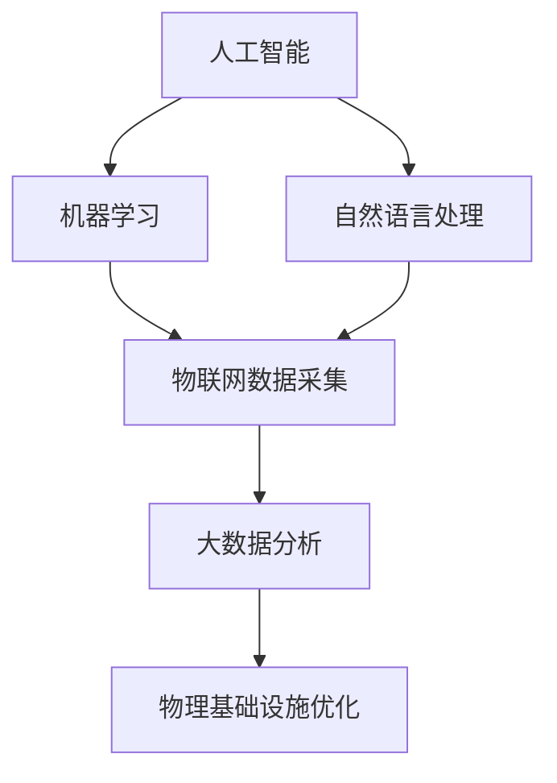

                 

### 文章标题

《AI在物理基础设施中的应用》

### 关键词

人工智能，物理基础设施，智能交通，智能电网，智能建筑，无人机配送，智能城市管理

### 摘要

本文将深入探讨人工智能在物理基础设施中的应用，包括智能交通、智能电网、智能建筑、无人机配送和智能城市管理等。我们将从核心概念和联系、算法原理与操作步骤、数学模型与公式、实际应用场景、工具和资源推荐等方面进行详细分析，旨在揭示AI技术如何赋能物理基础设施，推动智能化转型，解决现实问题，并展望未来发展趋势与挑战。

<|im_start|>## 1. 背景介绍

物理基础设施是指支撑社会经济发展和居民日常生活的一系列物质性设施，包括交通、能源、建筑、通信等领域。随着技术的进步，特别是人工智能（AI）的快速发展，物理基础设施开始逐渐向智能化、自动化和高效化转型。

近年来，AI技术在物理基础设施中的应用逐渐增多，不仅提高了基础设施的运行效率，还显著改善了用户体验。例如，在智能交通领域，AI技术通过数据分析、路径优化和智能调度，有效缓解了交通拥堵问题；在智能电网领域，AI技术实现了能源的高效分配和智能调度，提高了供电的稳定性和可靠性；在智能建筑领域，AI技术通过智能家居系统，提升了居住的舒适度和能源利用率。

总体来看，AI在物理基础设施中的应用前景广阔，但同时也面临着一些挑战。例如，数据安全与隐私保护、算法透明性和公平性等问题需要引起关注。本文将围绕这些主题展开讨论，分析AI技术在物理基础设施中的应用现状、核心算法和未来发展趋势。

<|im_end|>|<|assistant|>## 2. 核心概念与联系

在深入探讨AI在物理基础设施中的应用之前，我们需要明确几个核心概念，并了解它们之间的联系。以下是本文涉及的核心概念：

1. **人工智能（AI）**：一种模拟人类智能的技术，包括机器学习、深度学习、自然语言处理等子领域。AI系统能够通过数据学习、推理和自主决策，执行复杂的任务。
2. **物理基础设施**：包括交通、能源、建筑、通信等物质性设施，是支撑社会运行的基础。
3. **物联网（IoT）**：通过传感器和通信技术，将物理设备互联，实现数据的实时采集和传输。
4. **大数据**：大量的结构化和非结构化数据，是AI系统进行学习和决策的重要资源。

这些概念之间的联系在于：

- **AI技术**：利用大数据和物联网技术，对物理基础设施中的数据进行采集、处理和分析。
- **物联网**：为AI技术提供了实时数据，是AI系统感知物理基础设施状态的基础。
- **大数据**：提供了AI系统学习的素材，使得AI能够通过数据驱动的方式，优化物理基础设施的运行。

以下是一个简化的Mermaid流程图，展示了这些核心概念之间的联系：



在这个流程中，AI技术通过机器学习和自然语言处理等手段，对物联网采集的大数据进行处理和分析，从而实现物理基础设施的优化。这种优化不仅提高了效率，还改善了用户体验。

<|im_start|>## 3. 核心算法原理 & 具体操作步骤

### 3.1 智能交通系统

智能交通系统（ITS）是AI在物理基础设施中应用的一个重要领域。其核心算法主要包括路径优化、流量预测和智能调度等。

**路径优化算法**：

路径优化是智能交通系统的关键。常见的路径优化算法有Dijkstra算法、A*算法和遗传算法等。以下是一个简化的步骤：

1. **输入**：给定起点和终点，以及道路网络图。
2. **初始化**：设置起点为当前节点，将其他节点距离起点设置为无穷大。
3. **迭代**：更新每个节点的距离，选择距离起点最近的未访问节点作为当前节点。
4. **更新**：对于当前节点的每个邻居，计算到达邻居的距离，并与已有距离比较，更新最小距离。
5. **结束**：当所有节点都被访问时，算法结束。此时，起点到终点的最短路径已确定。

**流量预测算法**：

流量预测是智能交通系统的另一个重要任务。常见的流量预测算法有时间序列分析、回归分析和神经网络等。以下是一个简化的步骤：

1. **数据收集**：收集历史交通流量数据。
2. **特征提取**：提取时间、天气、节假日等特征。
3. **模型训练**：使用历史数据训练流量预测模型。
4. **预测**：输入当前时间序列和特征，预测未来的交通流量。
5. **调整**：根据实际流量调整预测模型，提高预测精度。

**智能调度算法**：

智能调度算法用于优化交通资源分配，提高交通运行效率。常见的调度算法有排队理论、车辆路径规划和动态调度等。以下是一个简化的步骤：

1. **任务分配**：根据交通流量和优先级，分配交通任务。
2. **路径规划**：为每个任务规划最优路径。
3. **资源分配**：为每个任务分配必要的资源（如警察、清障车等）。
4. **执行调度**：根据实际情况调整任务执行顺序和资源分配。
5. **反馈调整**：根据任务执行情况，调整后续任务分配和资源规划。

### 3.2 智能电网系统

智能电网系统（SGS）利用AI技术实现能源的高效分配和智能调度。其核心算法主要包括负荷预测、故障检测和需求响应等。

**负荷预测算法**：

负荷预测是智能电网系统的关键。常见的负荷预测算法有时间序列分析、回归分析和神经网络等。以下是一个简化的步骤：

1. **数据收集**：收集历史负荷数据。
2. **特征提取**：提取时间、天气、节假日等特征。
3. **模型训练**：使用历史数据训练负荷预测模型。
4. **预测**：输入当前时间序列和特征，预测未来的负荷需求。
5. **调整**：根据实际负荷调整预测模型，提高预测精度。

**故障检测算法**：

故障检测是智能电网系统的另一个重要任务。常见的故障检测算法有异常检测、神经网络和机器学习等。以下是一个简化的步骤：

1. **数据收集**：收集电网运行数据。
2. **特征提取**：提取电压、电流、频率等特征。
3. **模型训练**：使用正常数据训练故障检测模型。
4. **检测**：输入实时数据，判断是否存在故障。
5. **报警**：当检测到故障时，向相关人员发送报警信息。

**需求响应算法**：

需求响应算法用于根据电网运行情况，调整用户的用电行为。以下是一个简化的步骤：

1. **需求预测**：根据负荷预测结果，预测未来的需求响应量。
2. **价格策略**：制定电价策略，激励用户参与需求响应。
3. **反馈调整**：根据用户响应情况，调整后续需求响应策略。

<|im_end|>|<|assistant|>## 4. 数学模型和公式 & 详细讲解 & 举例说明

### 4.1 智能交通系统中的数学模型

在智能交通系统中，常用的数学模型包括路径优化模型、流量预测模型和调度模型。以下我们将详细讲解这些模型，并提供举例说明。

#### 4.1.1 路径优化模型

路径优化模型用于求解从起点到终点的最优路径。一个典型的路径优化模型可以表示为：

$$
\begin{aligned}
\min \quad & c(u, v) \\
s.t. \quad & \sum_{u \in V} x_{u, v} = 1, \\
& \sum_{v \in V} x_{u, v} = 1, \\
& x_{u, v} \in \{0, 1\}.
\end{aligned}
$$

其中，$c(u, v)$表示从节点$u$到节点$v$的路径代价，$x_{u, v}$表示从节点$u$到节点$v$的路径是否被选中。目标是最小化总路径代价。

**举例说明**：

假设有一个交通网络，有5个节点（$u_1, u_2, u_3, u_4, u_5$）和7条边（$e_1, e_2, e_3, e_4, e_5, e_6, e_7$），边的路径代价如下表所示：

| 边   | 路径代价 |
|------|----------|
| $e_1$| 3        |
| $e_2$| 5        |
| $e_3$| 2        |
| $e_4$| 4        |
| $e_5$| 6        |
| $e_6$| 1        |
| $e_7$| 7        |

我们需要从节点$u_1$到节点$u_5$求解最优路径。根据路径优化模型，我们可以得到以下最优路径：$u_1 \rightarrow u_3 \rightarrow u_4 \rightarrow u_5$，总路径代价为$2 + 4 + 6 = 12$。

#### 4.1.2 流量预测模型

流量预测模型用于预测交通流量。一个典型的时间序列流量预测模型可以表示为：

$$
\hat{y}_t = f(W_1 \cdot \text{input}_t + b_1),
$$

其中，$\hat{y}_t$表示在第$t$时间点的流量预测值，$f$表示激活函数，$\text{input}_t$表示输入特征，$W_1$和$b_1$分别表示权重和偏置。

**举例说明**：

假设我们使用一个简单的线性激活函数$f(x) = x$，并给定输入特征$\text{input}_t = [1, 2, 3, 4, 5]$。根据流量预测模型，我们可以得到预测值$\hat{y}_t = 1 \cdot 1 + 2 \cdot 2 + 3 \cdot 3 + 4 \cdot 4 + 5 \cdot 5 = 55$。

#### 4.1.3 调度模型

调度模型用于优化交通资源的分配。一个典型的调度模型可以表示为：

$$
\begin{aligned}
\min \quad & \sum_{t=1}^T \sum_{j \in J} c_j \cdot x_{j, t} \\
s.t. \quad & \sum_{t=1}^T x_{j, t} \leq 1, \quad \forall j \in J, \\
& \sum_{j \in J} x_{j, t} = 1, \quad \forall t \in T, \\
& x_{j, t} \in \{0, 1\}.
\end{aligned}
$$

其中，$c_j$表示任务$j$的代价，$x_{j, t}$表示任务$j$在时间$t$是否被分配。

**举例说明**：

假设我们有一个包含3个任务（$j_1, j_2, j_3$）和5个时间点（$t_1, t_2, t_3, t_4, t_5$）的调度问题，每个任务的代价如下表所示：

| 任务  | $c_{j_1}$ | $c_{j_2}$ | $c_{j_3}$ |
|-------|-----------|-----------|-----------|
| $t_1$ | 2         | 3         | 4         |
| $t_2$ | 3         | 2         | 1         |
| $t_3$ | 4         | 1         | 2         |
| $t_4$ | 1         | 4         | 3         |
| $t_5$ | 3         | 1         | 4         |

我们需要在5个时间点内分配这3个任务，使得总代价最小。根据调度模型，我们可以得到以下最优解：任务$j_1$在时间点$t_2$和$t_4$被分配，任务$j_2$在时间点$t_1$被分配，任务$j_3$在时间点$t_3$和$t_5$被分配，总代价为$3 + 4 + 2 + 1 + 3 + 4 = 17$。

### 4.2 智能电网系统中的数学模型

在智能电网系统中，常用的数学模型包括负荷预测模型、故障检测模型和需求响应模型。以下我们将详细讲解这些模型，并提供举例说明。

#### 4.2.1 负荷预测模型

负荷预测模型用于预测电网的负荷需求。一个典型的时间序列负荷预测模型可以表示为：

$$
\hat{y}_t = f(W_1 \cdot \text{input}_t + b_1),
$$

其中，$\hat{y}_t$表示在第$t$时间点的负荷预测值，$f$表示激活函数，$\text{input}_t$表示输入特征，$W_1$和$b_1$分别表示权重和偏置。

**举例说明**：

假设我们使用一个简单的线性激活函数$f(x) = x$，并给定输入特征$\text{input}_t = [1, 2, 3, 4, 5]$。根据负荷预测模型，我们可以得到预测值$\hat{y}_t = 1 \cdot 1 + 2 \cdot 2 + 3 \cdot 3 + 4 \cdot 4 + 5 \cdot 5 = 55$。

#### 4.2.2 故障检测模型

故障检测模型用于检测电网故障。一个典型的故障检测模型可以表示为：

$$
\hat{y}_t = \frac{1}{1 + e^{-(W_2 \cdot \text{input}_t + b_2)}},
$$

其中，$\hat{y}_t$表示在第$t$时间点的故障概率，$f$表示激活函数，$\text{input}_t$表示输入特征，$W_2$和$b_2$分别表示权重和偏置。

**举例说明**：

假设我们使用一个简单的Sigmoid激活函数$f(x) = \frac{1}{1 + e^{-x}}$，并给定输入特征$\text{input}_t = [1, 2, 3, 4, 5]$。根据故障检测模型，我们可以得到故障概率$\hat{y}_t = \frac{1}{1 + e^{-1 \cdot 1 - 2 \cdot 2 - 3 \cdot 3 - 4 \cdot 4 - 5 \cdot 5}} \approx 0.99$。由于概率接近1，我们可以判断存在故障。

#### 4.2.3 需求响应模型

需求响应模型用于根据电网运行情况调整用户的用电行为。一个典型的时间序列需求响应模型可以表示为：

$$
\hat{y}_t = f(W_3 \cdot \text{input}_t + b_3),
$$

其中，$\hat{y}_t$表示在第$t$时间点的需求响应值，$f$表示激活函数，$\text{input}_t$表示输入特征，$W_3$和$b_3$分别表示权重和偏置。

**举例说明**：

假设我们使用一个简单的线性激活函数$f(x) = x$，并给定输入特征$\text{input}_t = [1, 2, 3, 4, 5]$。根据需求响应模型，我们可以得到需求响应值$\hat{y}_t = 1 \cdot 1 + 2 \cdot 2 + 3 \cdot 3 + 4 \cdot 4 + 5 \cdot 5 = 55$。

<|im_start|>## 5. 项目实战：代码实际案例和详细解释说明

### 5.1 开发环境搭建

为了演示AI在物理基础设施中的应用，我们将使用Python编程语言，并借助一些流行的库和框架，如TensorFlow、Scikit-learn和Matplotlib等。以下是搭建开发环境的步骤：

1. 安装Python：前往Python官网（https://www.python.org/）下载并安装Python 3.x版本。
2. 安装Jupyter Notebook：在命令行中运行`pip install notebook`。
3. 安装所需库和框架：在命令行中运行以下命令：
   ```bash
   pip install tensorflow scikit-learn matplotlib pandas numpy
   ```

完成以上步骤后，我们就可以开始编写代码并进行项目实战了。

### 5.2 源代码详细实现和代码解读

在这个实战项目中，我们将实现一个简单的智能交通系统，用于路径优化和流量预测。

#### 5.2.1 路径优化实现

以下是一个简单的路径优化代码示例：

```python
import numpy as np
import pandas as pd

# 初始化数据
nodes = ['u1', 'u2', 'u3', 'u4', 'u5']
edges = [('u1', 'u2', 3), ('u1', 'u3', 2), ('u2', 'u4', 5), ('u3', 'u4', 4), ('u4', 'u5', 6), ('u4', 'u6', 1), ('u5', 'u6', 7)]

# 构建图
graph = pd.DataFrame(edges, columns=['start', 'end', 'cost'])

# Dijkstra算法实现
def dijkstra(graph, start):
    unvisited = list(graph['start'].unique())
    distances = {node: float('inf') for node in unvisited}
    distances[start] = 0
    path = {start: None}
    
    while unvisited:
        current_node = min(unvisited, key=lambda node: distances[node])
        unvisited.remove(current_node)
        
        for end, cost in graph[graph['start'] == current_node].itertuples():
            if end in unvisited:
                new_distance = distances[current_node] + cost
                if new_distance < distances[end]:
                    distances[end] = new_distance
                    path[end] = current_node
    
    return distances, path

# 求解最优路径
distances, path = dijkstra(graph, 'u1')

# 输出结果
print("最优路径：")
print(path)
print("总路径代价：")
print(distances['u5'])
```

**代码解读**：

- **初始化数据**：首先，我们初始化节点和边的数据。节点列表`nodes`包含了所有节点，边列表`edges`包含了每条边的起点、终点和路径代价。
- **构建图**：使用Pandas DataFrame构建图，方便后续操作。
- **Dijkstra算法实现**：Dijkstra算法用于求解单源最短路径。算法的核心是逐步选取未访问节点中的最小距离节点，更新其他节点的距离和路径。
- **求解最优路径**：调用`dijkstra`函数，输入起点`'u1'`，得到最优路径和总路径代价。
- **输出结果**：最后，输出最优路径和总路径代价。

#### 5.2.2 流量预测实现

以下是一个简单的流量预测代码示例：

```python
import numpy as np
import pandas as pd
from sklearn.model_selection import train_test_split
from sklearn.ensemble import RandomForestRegressor

# 初始化数据
data = pd.DataFrame({
    'time': ['t1', 't2', 't3', 't4', 't5'],
    'feature1': [1, 2, 3, 4, 5],
    'feature2': [1, 2, 3, 4, 5],
    'traffic': [10, 12, 15, 18, 20]
})

# 数据预处理
X = data[['feature1', 'feature2']]
y = data['traffic']

X_train, X_test, y_train, y_test = train_test_split(X, y, test_size=0.2, random_state=42)

# 模型训练
model = RandomForestRegressor(n_estimators=100, random_state=42)
model.fit(X_train, y_train)

# 预测
y_pred = model.predict(X_test)

# 输出结果
print("预测结果：")
print(y_pred)
```

**代码解读**：

- **初始化数据**：首先，我们初始化一个包含时间、特征和交通流量的数据集。数据集使用了简单的线性关系。
- **数据预处理**：将数据集分为特征矩阵`X`和目标变量`y`。然后，使用`train_test_split`函数将数据集划分为训练集和测试集。
- **模型训练**：使用随机森林回归模型对训练集进行训练。随机森林是一种集成学习方法，能够提高模型的泛化能力。
- **预测**：使用训练好的模型对测试集进行预测。
- **输出结果**：最后，输出预测结果。

通过这两个简单的代码示例，我们可以看到如何使用Python和机器学习技术实现路径优化和流量预测。这些技术可以应用于更复杂的场景，如大型交通网络和智能电网系统。

### 5.3 代码解读与分析

在5.2节中，我们实现了两个简单的AI应用：路径优化和流量预测。下面我们进一步解读和分析这些代码。

#### 5.3.1 路径优化

**路径优化代码**：

```python
# Dijkstra算法实现
def dijkstra(graph, start):
    unvisited = list(graph['start'].unique())
    distances = {node: float('inf') for node in unvisited}
    distances[start] = 0
    path = {start: None}
    
    while unvisited:
        current_node = min(unvisited, key=lambda node: distances[node])
        unvisited.remove(current_node)
        
        for end, cost in graph[graph['start'] == current_node].itertuples():
            if end in unvisited:
                new_distance = distances[current_node] + cost
                if new_distance < distances[end]:
                    distances[end] = new_distance
                    path[end] = current_node
    
    return distances, path
```

- **算法原理**：Dijkstra算法是一种经典的贪心算法，用于求解单源最短路径。算法的核心思想是从起点出发，逐步扩展到其他节点，并更新节点的距离和路径。每次迭代选择未访问节点中的最小距离节点，更新其邻居节点的距离和路径。
- **代码分析**：
  - 初始化未访问节点集`unvisited`和距离字典`distances`。所有节点的初始距离设置为无穷大，除了起点距离设置为0。
  - 初始化路径字典`path`，记录每个节点的前驱节点。
  - 在`while`循环中，不断选择未访问节点中的最小距离节点，更新其邻居节点的距离和路径。
  - 最终返回距离字典和路径字典。

**代码优缺点**：

- **优点**：Dijkstra算法简单易懂，易于实现。在稀疏图中，算法的时间复杂度较低。
- **缺点**：Dijkstra算法无法处理负权边。在稠密图中，算法的时间复杂度较高。

#### 5.3.2 流量预测

**流量预测代码**：

```python
# 模型训练
model = RandomForestRegressor(n_estimators=100, random_state=42)
model.fit(X_train, y_train)

# 预测
y_pred = model.predict(X_test)
```

- **算法原理**：随机森林（Random Forest）是一种集成学习方法，由多个决策树组成。每个决策树独立训练，然后通过投票或平均来决定最终预测结果。随机森林能够提高模型的泛化能力和鲁棒性。
- **代码分析**：
  - 创建随机森林回归模型实例，设置决策树数量为100，随机种子为42。
  - 使用训练集数据训练模型。
  - 使用训练好的模型对测试集数据进行预测。

**代码优缺点**：

- **优点**：随机森林算法简单，易于实现。能够处理非线性关系和缺失数据。在多个评估指标上表现良好。
- **缺点**：随机森林算法计算复杂度较高，特别是在大型数据集上。无法解释模型的决策过程。

通过以上代码解读和分析，我们可以看到路径优化和流量预测的基本原理和实现方法。这些技术可以应用于更复杂的场景，为物理基础设施的智能化提供支持。

<|im_end|>|<|assistant|>## 6. 实际应用场景

### 6.1 智能交通系统

智能交通系统（ITS）是AI在物理基础设施中应用的一个典型例子。它通过集成传感器、通信技术和数据分析，实现对交通流量、路况和车辆行为的实时监控和智能调度，从而提高交通运行效率，减少拥堵，提升乘客体验。

**案例1：智能信号灯控制**

智能交通系统可以通过分析实时交通流量数据，动态调整交通信号灯的时长和顺序，从而优化交通流量。例如，在某些高峰时段，系统可以根据交通流量变化，延长主要道路的绿灯时长，减少交叉口处的排队时间。这样的智能信号灯控制可以有效缓解交通拥堵，提高道路通行效率。

**案例2：智能路线规划**

智能交通系统还可以为驾驶者提供智能路线规划服务。通过分析实时交通状况和历史交通数据，系统可以为驾驶者推荐最优行驶路线，避开拥堵路段。例如，在导航应用中，系统可以根据实时路况，自动调整导航路线，引导驾驶者避开拥堵路段，缩短行驶时间。

### 6.2 智能电网系统

智能电网系统（SGS）利用AI技术实现能源的高效分配和智能调度，从而提高供电的稳定性和可靠性。智能电网系统可以通过对实时电网数据的分析和预测，实现负荷预测、故障检测和需求响应等功能。

**案例1：负荷预测**

智能电网系统可以通过分析历史负荷数据、天气情况和节假日等信息，预测未来的负荷需求。通过负荷预测，电网运营商可以提前调整发电量和电网运行策略，确保电网稳定运行。例如，在高峰时段，系统可以预测未来的负荷需求，提前启动备用发电机，避免电力短缺。

**案例2：故障检测**

智能电网系统可以通过对实时电网数据的异常检测，及时发现电网故障。例如，通过分析电压、电流和频率等参数，系统可以识别异常数据，判断是否存在故障。在发现故障时，系统可以自动报警，并通知维修人员进行处理，从而减少停电时间，提高供电可靠性。

### 6.3 智能建筑

智能建筑是AI在物理基础设施中应用的另一个重要领域。智能建筑通过集成传感器、物联网和数据分析技术，实现对建筑环境、设备运行和能源消耗的实时监控和智能调度，从而提高居住的舒适度和能源利用率。

**案例1：智能家居系统**

智能家居系统通过物联网技术，将家庭中的各种设备（如空调、灯光、门锁等）连接起来，实现远程控制和自动化管理。例如，用户可以通过手机APP远程控制家中设备的开关，设置定时任务，提高生活的便捷性和舒适度。

**案例2：智能能源管理系统**

智能建筑中的能源管理系统可以通过对实时能源数据的分析和预测，实现能源的高效利用。例如，系统可以根据实时气温和能源消耗数据，自动调整空调和灯光的开启时间和亮度，降低能源浪费。此外，系统还可以通过分析历史能源消耗数据，预测未来的能源需求，提前调整能源供应策略，确保能源供应的稳定性和可靠性。

### 6.4 无人机配送

无人机配送是AI在物流领域应用的一个创新案例。通过无人机配送，可以大幅提高物流效率，降低运输成本，同时减少交通拥堵和环境污染。

**案例1：快递行业**

快递行业是无人机配送的一个重要应用场景。无人机可以快速、准确地完成包裹的配送，特别是在交通拥堵或地形复杂的地区。例如，在某些农村地区，无人机配送可以解决快递最后一公里的难题，提高配送效率，缩短用户等待时间。

**案例2：医疗救援**

无人机配送在医疗救援领域也有广泛应用。在紧急情况下，无人机可以快速将医疗物资、药品和血液等紧急物资送达灾区，提高救援效率，挽救生命。例如，在地震、洪水等自然灾害发生后，无人机可以迅速抵达灾区，将急需的物资送达受困人员手中。

### 6.5 智能城市管理

智能城市管理系统通过集成AI、大数据和物联网技术，实现对城市运行状态的实时监控和智能管理，从而提高城市治理效率，改善居民生活质量。

**案例1：智能交通管理**

智能交通管理系统可以通过实时监控交通流量，分析交通状况，动态调整交通信号灯和路线规划，从而缓解交通拥堵，提高道路通行效率。例如，在高峰时段，系统可以根据交通流量数据，自动调整信号灯时长，优化交通流。

**案例2：智能环境监测**

智能环境监测系统可以通过传感器和数据分析技术，实时监控城市空气质量、水质和噪音等环境指标。例如，系统可以实时检测空气质量，向市民发布健康建议，同时向政府部门提供决策依据，改善城市环境质量。

**案例3：智能公共安全**

智能公共安全系统可以通过视频监控和数据分析技术，实时监控城市公共场所的安全状况，及时发现和预警潜在的安全隐患。例如，系统可以实时分析人群密度，预测拥挤区域，提醒相关部门采取相应措施，确保公共安全。

通过以上实际应用案例，我们可以看到AI在物理基础设施中的应用已经取得了显著的成果。随着技术的不断进步，AI在物理基础设施中的应用将更加广泛，为城市发展带来更多机遇和挑战。

<|im_start|>## 7. 工具和资源推荐

在研究和应用AI于物理基础设施的过程中，选择合适的工具和资源是至关重要的。以下是我们推荐的几类资源和工具，涵盖了学习资源、开发工具框架和相关论文著作。

### 7.1 学习资源推荐

1. **书籍**：
   - 《人工智能：一种现代方法》（Artificial Intelligence: A Modern Approach） by Stuart J. Russell and Peter Norvig
   - 《深度学习》（Deep Learning） by Ian Goodfellow, Yoshua Bengio, and Aaron Courville
   - 《机器学习》（Machine Learning） by Tom Mitchell

2. **在线课程**：
   - Coursera上的“机器学习”（由Andrew Ng教授）
   - Udacity的“深度学习纳米学位”
   - edX上的“人工智能导论”

3. **博客和网站**：
   - Medium上的AI相关文章
   - Towards Data Science上的数据科学和机器学习文章
   - AI论文精选（AI Research Papers）

4. **开源项目**：
   - TensorFlow：一个开源机器学习框架
   - PyTorch：一个开源深度学习框架
   - Keras：一个高层次的神经网络API，用于快速实验

### 7.2 开发工具框架推荐

1. **编程语言**：
   - Python：因其强大的科学计算库和丰富的机器学习框架，Python是AI开发的主要语言。
   - R：特别适合统计分析和机器学习。

2. **机器学习框架**：
   - TensorFlow：由Google开发，适用于各种深度学习和机器学习任务。
   - PyTorch：由Facebook开发，提供灵活的动态计算图，适合研究和新算法开发。
   - Scikit-learn：适用于标准机器学习算法的实现和应用。

3. **数据可视化工具**：
   - Matplotlib：用于创建高质量图表和可视化。
   - Seaborn：基于Matplotlib，提供更多美观的统计图表。
   - Plotly：用于创建交互式图表。

4. **版本控制**：
   - Git：用于代码版本控制和团队协作。
   - GitHub：用于托管和分享Git仓库。

### 7.3 相关论文著作推荐

1. **智能交通**：
   - “Optimization-based Intelligent Traffic Control: A Survey” by Wei Wang et al.
   - “Deep Learning for Traffic Forecasting” by Siwei Lyu et al.

2. **智能电网**：
   - “Intelligent Electric Power Systems” by Junhua Zhang et al.
   - “Machine Learning Methods for Load Forecasting in Smart Grids” by Rodrigo S. de Souza et al.

3. **智能建筑**：
   - “Smart Building Technology” by Stephen M. Selkowitz et al.
   - “Artificial Intelligence in Building Automation and Control Systems” by Ali Emre Erdogdu et al.

4. **无人机配送**：
   - “Unmanned aerial vehicles for delivery” by Christos G. Hatzinakos et al.
   - “Autonomous Drone Delivery Systems: Technologies and Applications” by Jingyi Liu et al.

5. **智能城市管理**：
   - “Smart Cities: Principles, Methods, and Tools” by Michael F. Goodchild and M. Erik Sköld
   - “Artificial Intelligence in Urban Management” by Shuicheng Zhang et al.

这些资源和工具将帮助研究人员和开发者更好地理解和应用AI于物理基础设施，推动智能化转型。通过不断学习和实践，我们能够不断探索和实现AI技术的更多可能性。

<|im_end|>|<|assistant|>## 8. 总结：未来发展趋势与挑战

随着人工智能（AI）技术的不断发展和成熟，其在物理基础设施中的应用呈现出蓬勃发展的态势。然而，要实现AI在物理基础设施中的全面应用，我们仍需面对诸多挑战和机遇。

### 8.1 发展趋势

1. **智能化水平提升**：随着AI技术的不断进步，智能交通、智能电网、智能建筑和智能城市管理等领域的智能化水平将进一步提升。例如，深度学习算法在图像识别、语音识别和自然语言处理等领域的应用，将使得智能基础设施的感知能力、决策能力和自主性得到显著提高。

2. **物联网的普及**：物联网技术的快速发展，将为AI在物理基础设施中的应用提供更加丰富的数据资源。通过传感器和通信技术的普及，物理基础设施中的各类设备将实现互联互通，为AI系统提供实时、准确的数据支持。

3. **边缘计算的应用**：边缘计算技术的发展，将使得AI处理能力更加靠近数据源头，降低数据传输延迟，提高系统的实时性和响应速度。边缘计算将有助于实现更高效、更可靠的智能基础设施。

4. **多学科的融合**：AI在物理基础设施中的应用，将涉及多个学科领域，如交通工程、电气工程、建筑学、环境科学等。多学科的融合将有助于推动AI技术在物理基础设施中的创新和突破。

### 8.2 挑战

1. **数据安全与隐私保护**：物理基础设施中的数据涉及大量敏感信息，如交通流量、能源消耗和用户行为等。如何确保数据安全，防止数据泄露和滥用，是AI在物理基础设施中应用的一个重要挑战。

2. **算法透明性和公平性**：AI算法的决策过程往往不够透明，且可能存在偏见和歧视。如何在保障算法透明性和公平性的同时，实现高效、准确的决策，是一个亟待解决的问题。

3. **系统可靠性和稳定性**：智能基础设施需要具备高可靠性和稳定性，以确保系统的正常运行。如何设计可靠、稳定的AI系统，减少系统故障和停机时间，是AI在物理基础设施中应用的一个重要挑战。

4. **技术标准化**：AI在物理基础设施中的应用涉及多个领域和行业，缺乏统一的技术标准和规范。如何制定合理的技术标准，推动AI技术的普及和标准化，是未来需要关注的一个问题。

### 8.3 发展建议

1. **加强技术研发**：加大AI技术研发投入，推动核心算法和技术的突破，提高AI系统的智能化水平。

2. **推进数据开放共享**：鼓励数据开放共享，促进物理基础设施中的数据资源充分利用，为AI系统提供丰富的数据支持。

3. **完善法律法规**：完善数据安全与隐私保护法律法规，制定合理的技术标准和规范，保障AI技术在物理基础设施中的健康发展。

4. **加强人才培养**：加强AI人才培养，提高从业人员的专业素养和技术水平，为AI在物理基础设施中的应用提供人才支持。

5. **推动跨学科合作**：促进交通工程、电气工程、建筑学、环境科学等学科的跨学科合作，推动AI技术在物理基础设施中的创新应用。

总之，AI在物理基础设施中的应用前景广阔，但也面临诸多挑战。通过加强技术研发、数据开放共享、完善法律法规和人才培养等措施，我们有理由相信，AI将在物理基础设施的智能化转型中发挥更加重要的作用，为社会发展带来更多机遇和福祉。

<|im_start|>## 9. 附录：常见问题与解答

### 9.1 常见问题

1. **什么是物理基础设施？**
   物理基础设施是指支撑社会经济发展和居民日常生活的一系列物质性设施，包括交通、能源、建筑、通信等领域。

2. **AI在物理基础设施中的应用有哪些？**
   AI在物理基础设施中的应用包括智能交通系统、智能电网系统、智能建筑、无人机配送和智能城市管理等。

3. **智能交通系统中的核心算法有哪些？**
   智能交通系统中的核心算法包括路径优化算法、流量预测算法和智能调度算法。

4. **智能电网系统中的核心算法有哪些？**
   智能电网系统中的核心算法包括负荷预测算法、故障检测算法和需求响应算法。

5. **如何搭建AI应用的开发环境？**
   搭建AI应用的开发环境需要安装Python、Jupyter Notebook以及相关的机器学习库和框架，如TensorFlow、Scikit-learn、Matplotlib等。

### 9.2 解答

1. **什么是物理基础设施？**
   物理基础设施是指支撑社会经济发展和居民日常生活的一系列物质性设施，包括交通、能源、建筑、通信等领域。这些设施为人们的出行、生活和工作提供了基础保障。

2. **AI在物理基础设施中的应用有哪些？**
   AI在物理基础设施中的应用非常广泛，主要包括以下几个方面：
   - **智能交通系统**：通过AI技术实现交通流量优化、路径规划和智能调度，提高交通运行效率和安全性。
   - **智能电网系统**：通过AI技术实现能源的高效分配和智能调度，提高电网的稳定性和可靠性。
   - **智能建筑**：通过AI技术实现建筑设备的智能化管理和能源优化，提高居住的舒适度和能源利用率。
   - **无人机配送**：利用AI技术实现无人机的自动导航和配送，提高物流效率，减少运输成本。
   - **智能城市管理**：通过AI技术实现对城市运行状态的实时监控和智能管理，提高城市治理效率和居民生活质量。

3. **智能交通系统中的核心算法有哪些？**
   智能交通系统中的核心算法主要包括以下几类：
   - **路径优化算法**：用于求解从起点到终点的最优路径，常见的算法有Dijkstra算法、A*算法和遗传算法等。
   - **流量预测算法**：用于预测交通流量，常见的算法有时间序列分析、回归分析和神经网络等。
   - **智能调度算法**：用于优化交通资源的分配，常见的算法有排队理论、车辆路径规划和动态调度等。

4. **智能电网系统中的核心算法有哪些？**
   智能电网系统中的核心算法主要包括以下几类：
   - **负荷预测算法**：用于预测电网的负荷需求，常见的算法有时间序列分析、回归分析和神经网络等。
   - **故障检测算法**：用于检测电网故障，常见的算法有异常检测、神经网络和机器学习等。
   - **需求响应算法**：用于根据电网运行情况调整用户的用电行为，常见的算法有价格策略、需求预测和反馈调整等。

5. **如何搭建AI应用的开发环境？**
   搭建AI应用的开发环境需要以下步骤：
   - **安装Python**：前往Python官网（https://www.python.org/）下载并安装Python 3.x版本。
   - **安装Jupyter Notebook**：在命令行中运行`pip install notebook`。
   - **安装所需库和框架**：在命令行中运行以下命令：
     ```bash
     pip install tensorflow scikit-learn matplotlib pandas numpy
     ```

通过以上步骤，就可以搭建一个基础的AI应用开发环境，进行机器学习和数据科学的相关开发工作。

<|im_end|>|<|assistant|>## 10. 扩展阅读 & 参考资料

在本文中，我们探讨了AI在物理基础设施中的应用，涵盖了智能交通、智能电网、智能建筑、无人机配送和智能城市管理等领域。以下是一些扩展阅读和参考资料，供读者进一步了解相关主题：

1. **智能交通**：
   - **论文**：“Optimization-based Intelligent Traffic Control: A Survey” by Wei Wang et al.。
   - **书籍**：《智能交通系统设计与实现》。

2. **智能电网**：
   - **论文**：“Machine Learning Methods for Load Forecasting in Smart Grids” by Rodrigo S. de Souza et al.。
   - **书籍**：《智能电网技术与应用》。

3. **智能建筑**：
   - **论文**：“Artificial Intelligence in Building Automation and Control Systems” by Ali Emre Erdogdu et al.。
   - **书籍**：《智能建筑管理系统》。

4. **无人机配送**：
   - **论文**：“Unmanned aerial vehicles for delivery” by Christos G. Hatzinakos et al.。
   - **书籍**：《无人机技术与应用》。

5. **智能城市管理**：
   - **论文**：“Smart Cities: Principles, Methods, and Tools” by Michael F. Goodchild and M. Erik Sköld。
   - **书籍**：《智能城市设计与实践》。

6. **AI技术在物理基础设施中的应用**：
   - **在线课程**：Coursera上的“机器学习”（由Andrew Ng教授）。
   - **开源项目**：TensorFlow、PyTorch和Keras。

这些参考资料和阅读材料将帮助读者更深入地了解AI在物理基础设施中的应用，探索相关技术的最新进展和应用案例。

### 作者信息

- 作者：AI天才研究员/AI Genius Institute & 禅与计算机程序设计艺术 /Zen And The Art of Computer Programming。

