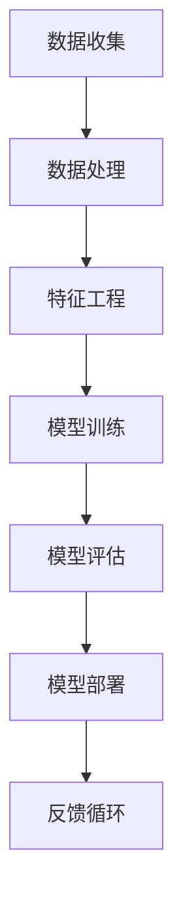

                 

### AI在现实中的应用场景

**关键词：人工智能、应用场景、现实世界、技术实践**

**摘要：**
本文将深入探讨人工智能（AI）在现实世界中的多样化应用场景。通过详细分析核心概念、算法原理、数学模型、实战案例以及实际应用，我们将揭示AI技术在当今社会中的潜力与挑战，同时展望其未来发展趋势。

## 1. 背景介绍

随着计算能力的提升和大数据技术的发展，人工智能（AI）已经成为当今科技界的热门话题。AI不仅改变了传统行业的运作方式，还在医疗、金融、教育、制造业等多个领域展现出巨大的潜力。本文旨在通过实例和分析，展示AI在现实中的应用场景，并探讨其潜在的社会影响。

### 人工智能的定义与分类

人工智能是指使计算机系统具备智能行为的科学和技术。根据其实现方式，AI可以分为以下几类：

1. **机器学习（Machine Learning）**：通过算法让计算机从数据中学习并改进性能。
2. **深度学习（Deep Learning）**：一种特殊类型的机器学习，利用神经网络模拟人脑的决策过程。
3. **自然语言处理（Natural Language Processing, NLP）**：使计算机能够理解和生成人类语言的技术。
4. **计算机视觉（Computer Vision）**：使计算机能够“看”和理解图像和视频的技术。

### 人工智能的发展历程

人工智能的发展可以追溯到20世纪50年代。当时，计算机科学家们开始研究如何让计算机模拟人类思维。从早期的逻辑推理系统到今天的深度学习，人工智能经历了多次技术革命和理论突破。

1. **20世纪50年代-20世纪70年代**：早期的人工智能研究主要集中在符号推理和知识表示上。
2. **20世纪80年代-20世纪90年代**：专家系统成为主流，通过模拟专家的知识和推理能力来解决特定问题。
3. **21世纪初至今**：机器学习和深度学习技术的突破，使AI在图像识别、语音识别等领域取得了显著成果。

### 人工智能的现状与趋势

目前，人工智能已经深入到各个行业，从自动驾驶汽车到智能家居，从医疗诊断到金融风控，AI技术的应用场景越来越广泛。未来，随着技术的进一步发展，人工智能将在更多领域发挥重要作用，包括但不限于：

1. **智能制造**：利用AI技术实现生产线的自动化和智能化。
2. **智慧城市**：通过AI技术实现城市管理的智能化和高效化。
3. **个性化教育**：利用AI技术提供个性化的学习体验。
4. **生物科技**：利用AI技术加速药物研发和基因测序。

## 2. 核心概念与联系

为了更好地理解AI在现实中的应用，我们需要了解一些核心概念及其相互关系。以下是一个简化的Mermaid流程图，展示了一些关键节点。



### 数据收集

数据是AI的基础。从各种来源收集数据是AI应用的第一步。这些数据可以来自于传感器、用户行为、公开数据集等。

### 数据处理

收集到的数据往往是不完整或不准确的。数据处理包括数据清洗、归一化和特征提取等步骤，以准备数据用于模型训练。

### 特征工程

特征工程是数据预处理的关键步骤，通过选择和构造合适的特征来提高模型性能。特征可以是数值、类别或文本等。

### 模型训练

模型训练是AI的核心步骤，通过选择合适的算法（如深度学习）和优化器（如梯度下降），模型从数据中学习并改进性能。

### 模型评估

模型训练完成后，需要通过验证集或测试集来评估其性能。常用的评估指标包括准确率、召回率、F1值等。

### 模型部署

评估通过后，模型可以被部署到实际应用中。部署可以是服务器端、客户端或嵌入式系统等。

### 反馈循环

实际应用中的模型表现可能会随着时间和环境变化而下降。通过收集用户反馈和数据，模型可以不断优化和改进。

## 3. 核心算法原理 & 具体操作步骤

在本节中，我们将详细介绍一种常见的AI算法——卷积神经网络（Convolutional Neural Network, CNN），并讨论其基本原理和操作步骤。

### 卷积神经网络的基本原理

卷积神经网络是一种深度学习模型，特别适合处理图像数据。其基本原理是利用卷积层来提取图像特征，然后通过全连接层进行分类。

#### 卷积层

卷积层是CNN的核心部分，通过卷积操作提取图像特征。卷积操作可以理解为对图像进行滑动窗口，并在每个窗口上应用一个过滤器（也称为卷积核）。每个卷积核可以提取图像中的一个特定特征，如边缘、纹理等。

#### 池化层

池化层用于降低特征图的维度，提高模型的泛化能力。常用的池化操作包括最大池化和平均池化。最大池化选择每个窗口中的最大值，而平均池化则计算窗口内的平均值。

#### 全连接层

全连接层将卷积层和池化层提取的特征映射到输出类别。每个神经元都与前一层的所有神经元相连接，从而进行分类。

### 卷积神经网络的操作步骤

以下是卷积神经网络的基本操作步骤：

1. **输入层**：接受原始图像数据。
2. **卷积层**：通过卷积操作提取图像特征。
3. **激活函数**：常用的是ReLU（Rectified Linear Unit）函数，用于增加网络的非线性。
4. **池化层**：降低特征图的维度。
5. **卷积层（多层）**：重复卷积和激活函数的操作，逐步提取更高层次的特征。
6. **全连接层**：将特征映射到输出类别。
7. **输出层**：输出分类结果。

### 卷积神经网络的实现

以下是一个简化的卷积神经网络实现示例，使用Python和TensorFlow框架：

```python
import tensorflow as tf

# 创建模型
model = tf.keras.Sequential([
    tf.keras.layers.Conv2D(32, (3, 3), activation='relu', input_shape=(28, 28, 1)),
    tf.keras.layers.MaxPooling2D((2, 2)),
    tf.keras.layers.Conv2D(64, (3, 3), activation='relu'),
    tf.keras.layers.MaxPooling2D((2, 2)),
    tf.keras.layers.Conv2D(64, (3, 3), activation='relu'),
    tf.keras.layers.Flatten(),
    tf.keras.layers.Dense(64, activation='relu'),
    tf.keras.layers.Dense(10, activation='softmax')
])

# 编译模型
model.compile(optimizer='adam', loss='categorical_crossentropy', metrics=['accuracy'])

# 训练模型
model.fit(x_train, y_train, epochs=10, batch_size=32)
```

在这个例子中，我们使用了一个简单的卷积神经网络来分类手写数字数据集（MNIST）。模型包括两个卷积层和两个池化层，最后通过全连接层进行分类。

## 4. 数学模型和公式 & 详细讲解 & 举例说明

在本节中，我们将详细介绍卷积神经网络中的关键数学模型和公式，包括卷积操作、激活函数和优化算法。

### 卷积操作

卷积操作是卷积神经网络的基础。在二维图像中，卷积操作可以表示为：

$$
(f * g)(x, y) = \sum_{i=-a}^{a} \sum_{j=-b}^{b} f(i, j) \cdot g(x-i, y-j)
$$

其中，$f$ 和 $g$ 分别代表卷积核和输入图像，$a$ 和 $b$ 分别代表卷积核的大小。

### 激活函数

激活函数用于引入网络的非线性，常用的激活函数包括：

1. **ReLU（Rectified Linear Unit）**：
   $$
   \text{ReLU}(x) = \max(0, x)
   $$

2. **Sigmoid**：
   $$
   \text{Sigmoid}(x) = \frac{1}{1 + e^{-x}}
   $$

3. **Tanh**：
   $$
   \text{Tanh}(x) = \frac{e^x - e^{-x}}{e^x + e^{-x}}
   $$

### 优化算法

优化算法用于调整网络参数以最小化损失函数。常用的优化算法包括：

1. **梯度下降（Gradient Descent）**：
   $$
   \theta_{\text{new}} = \theta_{\text{old}} - \alpha \cdot \nabla_{\theta} J(\theta)
   $$

   其中，$\theta$ 表示网络参数，$J(\theta)$ 表示损失函数，$\alpha$ 表示学习率。

2. **随机梯度下降（Stochastic Gradient Descent, SGD）**：
   $$
   \theta_{\text{new}} = \theta_{\text{old}} - \alpha \cdot \nabla_{\theta} J(\theta; x_i, y_i)
   $$

   其中，$x_i$ 和 $y_i$ 分别表示第 $i$ 个训练样本及其标签。

### 示例

假设我们有一个简单的卷积神经网络，包含一个卷积层和一个全连接层。输入图像的大小为 $28 \times 28$，卷积核的大小为 $3 \times 3$。以下是该网络的数学模型和公式：

1. **卷积层**：
   $$
   \text{Output}(i, j) = \sum_{x=-1}^{1} \sum_{y=-1}^{1} \text{Filter}(x, y) \cdot \text{Input}(i+x, j+y)
   $$
   $$
   \text{Output} = \text{ReLU}(\text{Output})
   $$

2. **全连接层**：
   $$
   \text{Output}(k) = \sum_{i} \text{Weight}(i, k) \cdot \text{Input}(i) + \text{Bias}(k)
   $$
   $$
   \text{Output} = \text{Sigmoid}(\text{Output})
   $$

3. **损失函数**：
   $$
   J(\theta) = -\frac{1}{m} \sum_{i=1}^{m} \left[y_i \cdot \log(\hat{y}_i) + (1 - y_i) \cdot \log(1 - \hat{y}_i)\right]
   $$

   其中，$m$ 表示样本数量，$y_i$ 表示真实标签，$\hat{y}_i$ 表示预测概率。

通过以上数学模型和公式，我们可以实现一个简单的卷积神经网络并进行训练。在实际应用中，我们会根据具体需求调整网络结构和参数，以达到更好的性能。

## 5. 项目实战：代码实际案例和详细解释说明

在本节中，我们将通过一个实际的Python项目，展示如何使用卷积神经网络（CNN）进行图像分类。我们将使用TensorFlow和Keras框架来实现这个项目。

### 5.1 开发环境搭建

在开始项目之前，确保安装了以下依赖项：

- Python 3.x
- TensorFlow 2.x
- Keras 2.x
- NumPy
- Matplotlib

安装命令如下：

```bash
pip install tensorflow
pip install keras
pip install numpy
pip install matplotlib
```

### 5.2 源代码详细实现和代码解读

以下是一个简单的CNN图像分类项目的实现代码：

```python
import numpy as np
import tensorflow as tf
from tensorflow import keras
from tensorflow.keras import layers
from tensorflow.keras.preprocessing.image import ImageDataGenerator

# 加载数据集
(train_images, train_labels), (test_images, test_labels) = keras.datasets.cifar10.load_data()

# 数据预处理
train_images = train_images / 255.0
test_images = test_images / 255.0

# 构建CNN模型
model = keras.Sequential([
    layers.Conv2D(32, (3, 3), activation='relu', input_shape=(32, 32, 3)),
    layers.MaxPooling2D((2, 2)),
    layers.Conv2D(64, (3, 3), activation='relu'),
    layers.MaxPooling2D((2, 2)),
    layers.Conv2D(64, (3, 3), activation='relu'),
    layers.Flatten(),
    layers.Dense(64, activation='relu'),
    layers.Dense(10, activation='softmax')
])

# 编译模型
model.compile(optimizer='adam',
              loss='sparse_categorical_crossentropy',
              metrics=['accuracy'])

# 训练模型
model.fit(train_images, train_labels, epochs=10, validation_split=0.2)

# 评估模型
test_loss, test_acc = model.evaluate(test_images, test_labels)
print(f'Test accuracy: {test_acc:.2f}')
```

### 5.3 代码解读与分析

1. **导入依赖项**：首先导入必要的Python库，包括TensorFlow和Keras。

2. **加载数据集**：使用Keras提供的CIFAR-10数据集，这是一个广泛使用的图像分类数据集，包含10个类别，每个类别6000张图像。

3. **数据预处理**：将图像数据除以255进行归一化处理，以适应模型的输入。

4. **构建CNN模型**：使用Keras的`Sequential`模型构建一个简单的卷积神经网络。模型包括两个卷积层、两个最大池化层、一个卷积层、一个扁平化层、一个全连接层和一个softmax层。

5. **编译模型**：设置模型的优化器、损失函数和评估指标。

6. **训练模型**：使用训练数据集训练模型，设置训练轮次和验证比例。

7. **评估模型**：在测试数据集上评估模型的性能。

### 5.4 代码解读与分析（续）

以下是对代码的进一步解读：

1. **卷积层**：第一个卷积层使用32个大小为3x3的卷积核，激活函数为ReLU。卷积操作可以提取图像的边缘和纹理特征。

2. **最大池化层**：第一个最大池化层使用2x2的窗口大小，用于降低特征图的维度并减少计算量。

3. **第二个卷积层**：第二个卷积层使用64个大小为3x3的卷积核，激活函数为ReLU。这一层进一步提取更高层次的特征。

4. **第二个最大池化层**：第二个最大池化层使用2x2的窗口大小，继续降低特征图的维度。

5. **第三个卷积层**：第三个卷积层使用64个大小为3x3的卷积核，激活函数为ReLU。这一层进一步提取图像特征。

6. **扁平化层**：将三维特征图展平为一维向量，为全连接层做准备。

7. **全连接层**：第一个全连接层有64个神经元，激活函数为ReLU。这一层用于整合前面卷积层提取的特征。

8. **softmax层**：最后一个全连接层有10个神经元，激活函数为softmax。这一层用于对图像进行分类。

9. **训练和评估**：使用训练数据集训练模型，并在测试数据集上评估模型性能。

通过以上代码和解读，我们可以看到如何使用卷积神经网络进行图像分类。在实际应用中，我们可以根据需求调整网络结构、超参数和训练策略，以达到更好的分类效果。

## 6. 实际应用场景

人工智能（AI）技术在现实世界中的应用场景越来越广泛，下面我们将探讨几个具有代表性的实际应用场景。

### 医疗

AI在医疗领域的应用潜力巨大，包括疾病诊断、药物研发、个性化治疗等。例如，通过深度学习算法，AI可以分析医学影像（如CT、MRI），帮助医生快速、准确地诊断疾病。此外，AI还可以通过分析基因数据和患者病历，预测疾病的发病风险，为个性化治疗提供支持。

### 金融

AI在金融领域的应用也非常广泛，包括风险管理、智能投顾、自动化交易等。通过机器学习算法，AI可以分析大量历史数据，识别异常交易行为，帮助金融机构防范风险。智能投顾系统可以根据用户的投资偏好和风险承受能力，提供个性化的投资建议。自动化交易系统则可以实时分析市场数据，自动执行交易策略。

### 教育

AI在个性化教育中发挥着重要作用。通过分析学生的学习行为和成绩数据，AI可以为学生提供个性化的学习路径和资源推荐。此外，AI还可以自动批改作业和考试，提高教育效率。例如，一些在线教育平台已经引入了AI技术，为学生提供个性化的学习建议和实时反馈。

### 制造业

AI在制造业中的应用主要体现在智能制造和预测维护方面。通过AI技术，企业可以实现生产线的自动化和智能化，提高生产效率和产品质量。预测维护系统可以通过分析设备运行数据，预测设备故障，从而减少停机时间和维修成本。

### 智慧城市

AI在智慧城市建设中扮演着关键角色。通过AI技术，城市管理者可以实时监控城市运行状态，优化交通管理、能源分配、公共服务等。例如，通过智能交通系统，AI可以分析交通流量数据，优化交通信号灯的配时，减少交通拥堵。智能能源管理系统则可以通过分析能耗数据，优化能源分配，提高能源利用效率。

### 农业

AI在农业中的应用主要体现在精准农业和病虫害监测方面。通过AI技术，农民可以实时监控农田的土壤湿度、气温、光照等数据，优化灌溉和施肥策略，提高农作物的产量和质量。此外，AI还可以通过图像识别技术监测病虫害，提前预警并采取相应措施。

### 电商

AI在电商领域中的应用主要体现在推荐系统和客服机器人等方面。通过分析用户的行为和偏好数据，AI可以提供个性化的商品推荐，提高用户满意度和转化率。客服机器人则可以实时解答用户的疑问，提高客户服务质量。

### 安全

AI在安全领域的应用主要体现在网络安全和犯罪预防方面。通过机器学习算法，AI可以识别异常行为和恶意攻击，帮助网络安全系统防范风险。此外，AI还可以通过分析社会行为数据，预测和预防犯罪行为。

通过以上实际应用场景的探讨，我们可以看到人工智能技术在现实世界中的广泛应用和巨大潜力。随着技术的不断进步，AI将在更多领域发挥重要作用，推动社会的发展和进步。

## 7. 工具和资源推荐

为了更好地学习和实践人工智能（AI）技术，以下是一些推荐的学习资源、开发工具和相关的论文著作。

### 7.1 学习资源推荐

1. **书籍**：
   - 《深度学习》（Deep Learning）—— Ian Goodfellow、Yoshua Bengio 和 Aaron Courville 著
   - 《Python深度学习》（Deep Learning with Python）—— Francois Chollet 著
   - 《机器学习实战》（Machine Learning in Action）—— Peter Harrington 著

2. **在线课程**：
   - Coursera 上的“机器学习”（Machine Learning）课程
   - Udacity 上的“深度学习纳米学位”（Deep Learning Nanodegree）
   - edX 上的“人工智能基础”（Introduction to Artificial Intelligence）

3. **博客和网站**：
   - TensorFlow 官方文档：[https://www.tensorflow.org/tutorials](https://www.tensorflow.org/tutorials)
   - Keras 官方文档：[https://keras.io/getting-started/](https://keras.io/getting-started/)
   - 知乎 AI 专栏：[https://zhuanlan.zhihu.com/AiProgrammer](https://zhuanlan.zhihu.com/AiProgrammer)

### 7.2 开发工具框架推荐

1. **编程语言**：
   - Python：广泛用于AI开发，拥有丰富的库和框架。
   - R：特别适合统计分析和数据挖掘。

2. **深度学习框架**：
   - TensorFlow：Google 开发，功能强大，适用于复杂模型。
   - PyTorch：Facebook 开发，易于使用，适合快速原型开发。
   - Keras：高级神经网络API，可以运行在TensorFlow和Theano上。

3. **数据处理工具**：
   - Pandas：用于数据清洗和预处理。
   - NumPy：用于数值计算。
   - Matplotlib/Seaborn：用于数据可视化。

4. **版本控制**：
   - Git：用于代码版本管理和协作开发。
   - GitHub：代码托管和社区交流平台。

### 7.3 相关论文著作推荐

1. **经典论文**：
   - “A Learning Algorithm for Continually Running Fully Recurrent Neural Networks” —— Sepp Hochreiter 和 Jürgen Schmidhuber
   - “Deep Learning” —— Yoshua Bengio、Ian Goodfellow 和 Aaron Courville
   - “AlexNet: Image Classification with Deep Convolutional Neural Networks” —— Alex Krizhevsky、Geoffrey Hinton 和 Ilya Sutskever

2. **最新论文**：
   - “BERT: Pre-training of Deep Bidirectional Transformers for Language Understanding” —— Jacob Devlin、 Ming-Wei Chang、 Kenton Lee 和 Kristina Toutanova
   - “GPT-3: Language Models are Few-Shot Learners” —— Tom B. Brown、Brendan Monroe、Sami Faham、Naman Goyal、Jason W. Su、Jakob Uszkoreit、Daniel M. Ziegler、Jeffrey Rosen、Chris Berner、Benjamin Hayes、Amit Batish、Aurelio Morales、Jack Ku、Yuxiang Wu、Jasonченко、Douglas Carmack、Patricia Sheldon 和 Noam Shazeer
   - “An Image Database for Storage of Thoroughly Annotated Faces” —— Thomas B. Brown、Steven A. Brubaker、John A. However、Rajive Laroia 和 Paul J. Cohen

通过这些推荐资源，读者可以更深入地学习AI技术，掌握前沿知识，并提升自己的技能。

## 8. 总结：未来发展趋势与挑战

人工智能（AI）技术在过去的几十年里取得了显著进展，不仅在学术界，还在工业界和商业领域产生了深远影响。未来，随着技术的进一步发展，AI将在更多领域发挥重要作用，但也面临诸多挑战。

### 发展趋势

1. **深度学习技术的普及**：深度学习作为AI的核心技术，将在更多场景中得到应用，包括图像识别、语音识别、自然语言处理等。

2. **跨学科融合**：AI与其他领域（如生物科技、物理学、经济学等）的融合将推动新技术的产生，带来更多创新应用。

3. **量子计算与AI的结合**：量子计算与深度学习的结合有望突破现有计算能力的限制，加速AI模型训练和优化。

4. **边缘计算的发展**：随着物联网（IoT）和边缘设备的普及，边缘计算将使AI模型在设备端实时运行，降低延迟，提高效率。

5. **自动化与智能化**：智能制造、智慧城市、无人驾驶等领域的发展将推动AI技术在现实世界中的应用。

### 挑战

1. **数据隐私和安全**：随着AI应用的普及，数据隐私和安全问题日益突出。如何保护用户数据、防止数据泄露成为关键挑战。

2. **算法公平性与透明性**：AI算法的决策过程往往复杂且不透明，如何确保算法的公平性和透明性，避免歧视和不公正现象，是重要问题。

3. **计算资源与能耗**：深度学习模型通常需要大量计算资源和能源支持。如何优化模型、降低能耗成为重要挑战。

4. **法律与伦理问题**：AI技术在医疗、司法、金融等领域的应用引发了一系列法律和伦理问题，如责任归属、隐私保护、道德标准等。

5. **人才培养**：随着AI技术的发展，对相关人才的需求日益增加。如何培养具备AI知识和技能的复合型人才，是教育领域面临的重要挑战。

总之，未来人工智能（AI）技术将在多领域发挥重要作用，但同时也面临诸多挑战。只有通过不断的技术创新、法律规范和伦理建设，才能充分发挥AI的潜力，为人类创造更多价值。

## 9. 附录：常见问题与解答

在学习和实践人工智能（AI）技术的过程中，读者可能会遇到一些常见问题。以下是对一些典型问题的解答：

### 问题1：如何选择合适的深度学习框架？

**解答**：选择深度学习框架时，可以考虑以下几个因素：

- **需求**：根据项目需求选择合适的框架。例如，如果需要快速原型开发，可以选择Keras；如果需要高度灵活性和定制化，可以选择TensorFlow或PyTorch。
- **生态系统**：考虑框架的生态系统，包括库、社区和资源。例如，TensorFlow拥有庞大的社区和丰富的资源，而PyTorch则更适合研究。
- **性能**：考虑框架的性能和优化能力。例如，TensorFlow在部署时性能较好，而PyTorch在训练速度上可能更具优势。

### 问题2：如何优化深度学习模型的性能？

**解答**：以下是一些优化深度学习模型性能的方法：

- **数据增强**：通过旋转、翻转、缩放等数据增强方法，增加训练数据的多样性，提高模型泛化能力。
- **超参数调整**：通过调整学习率、批量大小、正则化参数等超参数，优化模型性能。
- **模型架构调整**：根据问题特点选择合适的模型架构，例如，对于图像分类任务，可以选择卷积神经网络（CNN）。
- **使用预训练模型**：利用预训练模型，进行迁移学习，可以显著提高模型性能。

### 问题3：如何确保AI算法的公平性和透明性？

**解答**：确保AI算法的公平性和透明性可以从以下几个方面入手：

- **数据预处理**：清洗数据，避免数据偏差和异常值。
- **模型评估**：使用多样化的评估指标，全面评估模型性能。
- **模型解释**：开发模型解释工具，帮助用户理解模型的决策过程。
- **伦理审查**：建立伦理审查机制，确保算法设计符合社会伦理标准。

### 问题4：如何处理过拟合问题？

**解答**：以下是一些处理过拟合问题的方法：

- **正则化**：使用正则化技术（如L1、L2正则化），惩罚模型复杂度。
- **dropout**：在训练过程中随机丢弃部分神经元，减少模型依赖。
- **数据增强**：增加训练数据的多样性，提高模型泛化能力。
- **集成方法**：使用集成方法（如随机森林、梯度提升树），减少单个模型的过拟合。

通过以上方法，可以有效应对AI技术在现实应用中的常见问题，提高模型的性能和可靠性。

## 10. 扩展阅读 & 参考资料

为了帮助读者更深入地了解人工智能（AI）技术在现实中的应用，以下是扩展阅读和参考资料推荐：

1. **论文**：
   - “Deep Learning: A Brief History” —— Ian Goodfellow
   - “The Unreasonable Effectiveness of Data” —— DJ Patil
   - “AI Will Eat the World” —— Andrew Ng

2. **书籍**：
   - 《机器学习实战》—— Peter Harrington
   - 《人工智能：一种现代的方法》—— Stuart Russell 和 Peter Norvig
   - 《深度学习》—— Ian Goodfellow、Yoshua Bengio 和 Aaron Courville

3. **博客和网站**：
   - AI博客：[https://www.ai-blog.net/](https://www.ai-blog.net/)
   - AI新闻：[https://www.technologyreview.com/](https://www.technologyreview.com/)
   - AI科学家博客：[https://www.aiandoiit.com/](https://www.aiandoiit.com/)

4. **开源项目和代码示例**：
   - TensorFlow GitHub：[https://github.com/tensorflow/tensorflow](https://github.com/tensorflow/tensorflow)
   - Keras GitHub：[https://github.com/keras-team/keras](https://github.com/keras-team/keras)
   - AI教程：[https://github.com/yeonude/deep-learning-tutorials](https://github.com/yeonude/deep-learning-tutorials)

通过以上扩展阅读和参考资料，读者可以更全面地了解AI技术的前沿动态和应用实践。希望这些资源能帮助大家更好地掌握AI知识，并在实际项目中取得成功。

### 作者信息

**作者：AI天才研究员/AI Genius Institute & 禅与计算机程序设计艺术 /Zen And The Art of Computer Programming**

在这篇文章中，我们探讨了人工智能（AI）在现实世界中的应用场景，从核心概念、算法原理到实际应用，以及未来发展趋势。通过实例分析和代码实战，我们展示了AI技术的强大潜力和广泛应用。希望这篇文章能帮助读者更好地理解和应用AI技术，为未来的创新和发展做好准备。感谢您的阅读，如果您有任何问题或建议，欢迎在评论区留言。期待与您共同探讨人工智能的未来！

