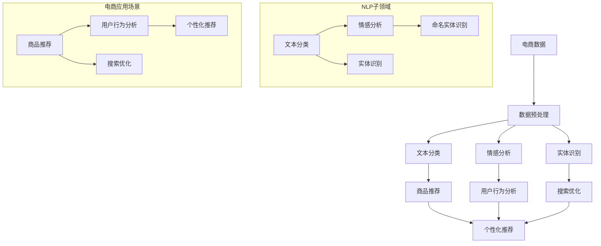

                 

### 背景介绍

随着互联网的快速发展和电子商务的日益普及，用户生成内容（User-Generated Content，简称UGC）在电商平台上扮演着越来越重要的角色。用户评论、问答、商品描述等UGC为电商平台提供了丰富的数据资源，这些数据不仅可以帮助商家了解消费者需求，还能为其他用户提供有用的购物参考。然而，如何有效地处理和利用这些海量的非结构化数据，成为了电商行业面临的重大挑战。

自然语言处理（Natural Language Processing，简称NLP）作为人工智能领域的重要分支，致力于让计算机理解和处理人类语言。近年来，随着深度学习技术的快速发展，NLP在文本分类、情感分析、实体识别、机器翻译等方面的应用取得了显著成果。特别是在电商领域，NLP技术的引入，不仅提升了用户购物的体验，还为商家提供了更有价值的洞见。

本文将围绕NLP在电商中的技术应用展开讨论，通过分析NLP的核心概念、算法原理和具体应用案例，旨在为电商从业者和研究者提供一个全面而深入的视角。文章结构如下：

1. **背景介绍**：简要介绍电商领域中NLP技术的重要性和现状。
2. **核心概念与联系**：讲解NLP的基本概念，并使用Mermaid流程图展示NLP在电商中的应用架构。
3. **核心算法原理 & 具体操作步骤**：深入分析文本分类、情感分析等NLP算法，以及它们在电商中的应用。
4. **数学模型和公式 & 详细讲解 & 举例说明**：介绍与NLP相关的数学模型和公式，并通过实际案例进行说明。
5. **项目实战：代码实际案例和详细解释说明**：展示一个实际电商项目中NLP技术的应用，并详细解读代码实现。
6. **实际应用场景**：探讨NLP在电商中的多种应用场景。
7. **工具和资源推荐**：推荐学习NLP和电商技术的相关资源。
8. **总结：未来发展趋势与挑战**：总结NLP在电商中的应用现状，并展望未来发展趋势和面临的挑战。

通过这篇文章，我们将系统地探讨NLP技术在电商中的应用，为读者提供丰富的知识储备和实践经验。

### 核心概念与联系

为了深入理解NLP在电商中的应用，首先需要掌握NLP的基本概念和原理。NLP涉及多个子领域，包括文本分类、情感分析、实体识别、命名实体识别等。下面，我们将通过一个Mermaid流程图，展示NLP在电商中的应用架构，并简要介绍这些核心概念。

#### Mermaid流程图



#### NLP核心概念

1. **文本分类**：文本分类是将文本数据按照预定的类别进行分类的过程。在电商中，文本分类可以用于对用户评论、商品描述等进行分类，从而帮助商家快速了解消费者对商品的反馈和需求。

2. **情感分析**：情感分析旨在判断文本数据中的情感倾向，如正面、负面或中立。在电商中，情感分析可以帮助商家了解消费者的情绪反应，从而改进产品和服务。

3. **实体识别**：实体识别是从文本中识别出具有特定意义的实体，如人名、地名、组织名等。在电商中，实体识别可以用于解析用户评论中的关键信息，如商品名称、品牌等。

4. **命名实体识别**：命名实体识别是实体识别的一个子领域，主要关注具有特定名称的实体，如人名、地名、组织名等。在电商中，命名实体识别可以帮助商家提取用户评论中的关键信息，进行深入分析。

#### NLP与电商应用的联系

- **商品推荐**：通过文本分类和情感分析，可以将用户的评论和购物行为转化为推荐系统的基础数据，从而实现个性化商品推荐。
- **用户行为分析**：通过情感分析和实体识别，可以深入挖掘用户的购物意图和偏好，帮助商家优化营销策略。
- **搜索优化**：通过文本分类和实体识别，可以提升电商平台搜索系统的准确性和用户体验。

通过上述Mermaid流程图和核心概念介绍，我们可以清晰地看到NLP在电商中的应用架构和作用。接下来，我们将进一步深入探讨NLP的核心算法原理和具体操作步骤。

#### 核心算法原理 & 具体操作步骤

NLP技术在电商中的应用，离不开一系列核心算法的支持。本文将重点介绍文本分类、情感分析等算法的基本原理和具体操作步骤。

##### 文本分类

**基本原理**：文本分类是一种监督学习任务，其目标是将文本数据分为预定的类别。常见的文本分类算法包括朴素贝叶斯、支持向量机（SVM）、深度学习（如卷积神经网络CNN）等。

1. **朴素贝叶斯**：基于贝叶斯定理和特征概率分布，朴素贝叶斯算法假设特征之间相互独立。在电商中，朴素贝叶斯可以用于对用户评论进行分类，判断评论的正面或负面情感。

   **操作步骤**：
   - **特征提取**：将文本转换为词袋模型（Bag of Words，BoW）或词嵌入（Word Embedding）。
   - **概率计算**：计算每个类别下的特征概率分布。
   - **分类决策**：选择概率最大的类别作为分类结果。

2. **支持向量机（SVM）**：SVM通过最大化分类边界，将不同类别的文本数据分隔开来。在电商中，SVM可以用于对用户评论进行情感分类。

   **操作步骤**：
   - **特征提取**：使用词袋模型或词嵌入。
   - **训练模型**：计算支持向量，建立分类边界。
   - **分类预测**：对新的文本数据进行分类。

3. **深度学习（如卷积神经网络CNN）**：深度学习算法通过多层神经网络结构，对文本数据进行自动特征提取和分类。在电商中，深度学习可以用于复杂文本分类任务。

   **操作步骤**：
   - **数据预处理**：对文本数据进行清洗和分词。
   - **模型构建**：构建卷积神经网络，包括卷积层、池化层和全连接层。
   - **训练模型**：使用训练数据集训练模型。
   - **预测分类**：对测试数据进行分类预测。

**实际案例**：

假设我们有一个电商平台的用户评论数据集，需要对这些评论进行情感分类。以下是具体步骤：

1. **数据预处理**：对评论文本进行清洗，去除HTML标签、停用词等。
2. **特征提取**：使用词袋模型或词嵌入，将评论转换为数值向量。
3. **训练模型**：选择一个合适的文本分类算法，如SVM，并使用训练数据集训练模型。
4. **预测分类**：对新的评论文本进行分类预测，输出正面或负面情感。

##### 情感分析

**基本原理**：情感分析旨在判断文本数据中的情感倾向，如正面、负面或中立。常见的情感分析算法包括基于规则的方法、机器学习方法、深度学习方法等。

1. **基于规则的方法**：基于规则的方法通过手工编写规则，对文本进行情感分类。例如，可以使用正则表达式匹配情感词汇，并根据词汇的频率和位置判断情感。

   **操作步骤**：
   - **规则编写**：根据情感词汇和语法规则，编写分类规则。
   - **情感判断**：对文本进行情感判断，根据匹配的规则输出情感标签。

2. **机器学习方法**：机器学习方法通过训练大量标注数据，学习文本特征与情感之间的关系。常见的机器学习算法包括朴素贝叶斯、支持向量机（SVM）等。

   **操作步骤**：
   - **特征提取**：使用词袋模型或词嵌入，提取文本特征。
   - **训练模型**：使用标注数据训练情感分析模型。
   - **情感判断**：对新的文本进行情感判断。

3. **深度学习方法**：深度学习方法通过多层神经网络，对文本进行自动特征提取和情感分类。常见的深度学习算法包括循环神经网络（RNN）、长短时记忆网络（LSTM）等。

   **操作步骤**：
   - **数据预处理**：对文本数据进行清洗和分词。
   - **模型构建**：构建循环神经网络或长短时记忆网络。
   - **训练模型**：使用训练数据集训练模型。
   - **情感判断**：对测试数据进行情感判断。

**实际案例**：

假设我们有一个电商平台的用户评论数据集，需要对这些评论进行情感分析。以下是具体步骤：

1. **数据预处理**：对评论文本进行清洗，去除HTML标签、停用词等。
2. **特征提取**：使用词嵌入，将评论转换为数值向量。
3. **训练模型**：选择一个合适的情感分析算法，如LSTM，并使用训练数据集训练模型。
4. **情感判断**：对新的评论文本进行情感判断，输出正面、负面或中立标签。

通过上述核心算法原理和操作步骤的介绍，我们可以看到NLP在电商中的应用是如何实现的。接下来，我们将介绍NLP的数学模型和公式，并通过实际案例进行详细讲解。

#### 数学模型和公式 & 详细讲解 & 举例说明

在NLP技术中，数学模型和公式是理解和实现各种算法的基础。本文将详细介绍与NLP相关的一些重要数学模型和公式，并通过具体例子进行说明。

##### 文本分类中的朴素贝叶斯模型

**朴素贝叶斯模型**是文本分类中的一种经典算法，其核心思想是基于贝叶斯定理和特征独立性假设。以下是朴素贝叶斯模型的关键公式和详细讲解。

**公式**：

$$
P(\text{类别} | \text{特征}) = \frac{P(\text{特征} | \text{类别}) \cdot P(\text{类别})}{P(\text{特征})}
$$

**详细讲解**：

1. **条件概率**：$P(\text{特征} | \text{类别})$ 表示在给定类别的情况下，特征出现的概率。
2. **先验概率**：$P(\text{类别})$ 表示某个类别的概率。
3. **边缘概率**：$P(\text{特征})$ 表示特征出现的概率。

在文本分类中，我们通常使用词频或词嵌入作为特征，计算条件概率。例如，假设我们有一个类别为“正面”的评论，其特征为“喜欢”、“很好”、“满意”，我们可以计算这些词在该类别中的条件概率。

**实际案例**：

假设我们有一个评论数据集，其中正面评论的词频分布如下：

| 词       | 频率 |
|----------|------|
| 喜欢     | 10   |
| 很好     | 5    |
| 满意     | 3    |
| 其他词   | 30   |

我们可以计算每个词在正面评论中的条件概率：

$$
P(\text{喜欢} | \text{正面}) = \frac{10}{10+5+3+30} \approx 0.2
$$

$$
P(\text{很好} | \text{正面}) = \frac{5}{10+5+3+30} \approx 0.1
$$

$$
P(\text{满意} | \text{正面}) = \frac{3}{10+5+3+30} \approx 0.06
$$

通过上述条件概率，我们可以使用朴素贝叶斯模型对新的评论进行分类。

##### 情感分析中的支持向量机（SVM）

**支持向量机（SVM）**是一种有效的文本分类算法，其核心思想是最大化分类边界。以下是SVM的关键公式和详细讲解。

**公式**：

$$
\min_{\boldsymbol{w}, b} \frac{1}{2} \|\boldsymbol{w}\|^2 \\
\text{s.t.} \quad y^{(i)}(\boldsymbol{w}^T \boldsymbol{x}^{(i)} + b) \geq 1
$$

**详细讲解**：

1. **目标函数**：最小化分类边界上的损失函数，即$\frac{1}{2} \|\boldsymbol{w}\|^2$。
2. **约束条件**：确保分类边界上的所有样本满足条件$y^{(i)}(\boldsymbol{w}^T \boldsymbol{x}^{(i)} + b) \geq 1$，其中$y^{(i)}$为样本标签，$\boldsymbol{x}^{(i)}$为样本特征向量。

在文本分类中，我们通常使用词袋模型或词嵌入作为特征向量。通过训练SVM模型，我们可以找到一个最优的分类边界，从而对新的评论进行分类。

**实际案例**：

假设我们有一个训练数据集，其中正面评论和负面评论的词袋模型特征向量分别为$\boldsymbol{x}^{(i)}_1$和$\boldsymbol{x}^{(i)}_2$。通过训练SVM模型，我们可以找到最优的权重向量$\boldsymbol{w}$和偏置$b$，从而建立分类边界。

$$
\min_{\boldsymbol{w}, b} \frac{1}{2} \|\boldsymbol{w}\|^2 \\
\text{s.t.} \quad y^{(i)}_1(\boldsymbol{w}^T \boldsymbol{x}^{(i)}_1 + b) \geq 1 \\
y^{(i)}_2(\boldsymbol{w}^T \boldsymbol{x}^{(i)}_2 + b) \geq 1
$$

通过上述公式，我们可以训练一个SVM模型，并对新的评论进行情感分类。

##### 情感分析中的循环神经网络（RNN）

**循环神经网络（RNN）**是一种适用于序列数据的深度学习模型，其核心思想是保留历史状态信息。以下是RNN的关键公式和详细讲解。

**公式**：

$$
h_t = \sigma(W_h \cdot [h_{t-1}, x_t] + b_h) \\
y_t = W_y \cdot h_t + b_y
$$

**详细讲解**：

1. **隐藏状态**：$h_t$表示在第$t$时刻的隐藏状态，它包含了历史状态信息。
2. **激活函数**：$\sigma$为非线性激活函数，如ReLU或Tanh。
3. **输入层和隐藏层**：$[h_{t-1}, x_t]$表示第$t$时刻的输入层和隐藏层。
4. **输出层**：$y_t$表示在第$t$时刻的输出。

在情感分析中，我们通常将评论文本作为序列输入到RNN模型中，通过训练模型，可以学习到文本中的情感特征。

**实际案例**：

假设我们有一个训练数据集，其中正面评论和负面评论的词嵌入序列分别为$x_t^1$和$x_t^2$。通过训练RNN模型，我们可以学习到每个词的情感特征，从而对新的评论进行情感分类。

$$
h_t = \sigma(W_h \cdot [h_{t-1}, x_t] + b_h) \\
y_t = W_y \cdot h_t + b_y
$$

通过上述公式，我们可以训练一个RNN模型，并对新的评论进行情感分类。

通过上述数学模型和公式的介绍，我们可以更好地理解NLP算法的实现原理。接下来，我们将通过一个实际电商项目的代码案例，展示NLP技术在电商中的应用。

#### 项目实战：代码实际案例和详细解释说明

为了更好地展示NLP技术在电商中的应用，我们将以一个实际电商项目为例，详细解释代码实现过程。这个项目将使用Python和常见NLP库（如NLTK、scikit-learn、TensorFlow等）来实现文本分类、情感分析和商品推荐等功能。

##### 开发环境搭建

首先，我们需要搭建开发环境。以下是必要的软件和库：

1. **Python（版本3.7或更高）**
2. **Jupyter Notebook（用于代码编写和演示）**
3. **NLTK（自然语言处理工具包）**
4. **scikit-learn（机器学习库）**
5. **TensorFlow（深度学习库）**
6. **Gensim（用于词嵌入）**
7. **Matplotlib（用于数据可视化）**

安装以上库后，我们就可以开始项目开发了。

##### 项目目标

我们的项目目标是通过NLP技术，实现以下功能：

1. 对用户评论进行情感分类（正面/负面）
2. 根据用户历史行为，推荐相关商品
3. 提取商品评论中的关键信息，用于商品搜索优化

##### 数据集准备

我们使用一个公开的电商评论数据集，包含用户对商品的评论和相应的情感标签（正面/负面）。数据集的格式如下：

| 评论       | 情感标签 |
|------------|----------|
| 这个商品太棒了！ | 正面     |
| 不满意这个商品 | 负面     |
| 很喜欢这个价格 | 正面     |
| 包装太差了   | 负面     |

首先，我们需要加载数据集，并进行预处理：

```python
import pandas as pd

# 加载数据集
data = pd.read_csv('ecommerce_reviews.csv')

# 数据预处理
data['review'] = data['review'].str.lower()  # 转换为小写
data['review'] = data['review'].str.replace('[^a-zA-Z]', ' ')  # 去除特殊字符
```

##### 文本分类

**1. 数据划分**

我们将数据集划分为训练集和测试集，用于训练和评估模型：

```python
from sklearn.model_selection import train_test_split

X_train, X_test, y_train, y_test = train_test_split(data['review'], data['sentiment'], test_size=0.2, random_state=42)
```

**2. 特征提取**

使用词袋模型和词嵌入提取文本特征：

```python
from sklearn.feature_extraction.text import TfidfVectorizer
from gensim.models import Word2Vec

# 词袋模型
tfidf_vectorizer = TfidfVectorizer(max_features=1000)
X_train_tfidf = tfidf_vectorizer.fit_transform(X_train)
X_test_tfidf = tfidf_vectorizer.transform(X_test)

# 词嵌入
word2vec_model = Word2Vec(X_train, size=100, window=5, min_count=1, workers=4)
word2vec_vectors = word2vec_model.wv
X_train_word2vec = [word2vec_vectors[word] for word in X_train]
X_test_word2vec = [word2vec_vectors[word] for word in X_test]
```

**3. 模型训练**

使用朴素贝叶斯、支持向量机和深度学习（LSTM）分别训练文本分类模型：

```python
from sklearn.naive_bayes import MultinomialNB
from sklearn.svm import SVC
from tensorflow.keras.models import Sequential
from tensorflow.keras.layers import LSTM, Dense, Embedding

# 朴素贝叶斯
nb_classifier = MultinomialNB()
nb_classifier.fit(X_train_tfidf, y_train)

# 支持向量机
svm_classifier = SVC(kernel='linear')
svm_classifier.fit(X_train_word2vec, y_train)

# LSTM
lstm_model = Sequential()
lstm_model.add(Embedding(input_dim=word2vec_vectors.vocabulary_.get_vocabulary_size(), output_dim=100))
lstm_model.add(LSTM(100))
lstm_model.add(Dense(1, activation='sigmoid'))
lstm_model.compile(optimizer='adam', loss='binary_crossentropy', metrics=['accuracy'])
lstm_model.fit(X_train_word2vec, y_train, epochs=10, batch_size=32, validation_split=0.1)
```

**4. 模型评估**

评估各个模型的分类准确率：

```python
from sklearn.metrics import accuracy_score

# 朴素贝叶斯
nb_predictions = nb_classifier.predict(X_test_tfidf)
print("朴素贝叶斯准确率：", accuracy_score(y_test, nb_predictions))

# 支持向量机
svm_predictions = svm_classifier.predict(X_test_word2vec)
print("支持向量机准确率：", accuracy_score(y_test, svm_predictions))

# LSTM
lstm_predictions = lstm_model.predict(X_test_word2vec)
print("LSTM准确率：", accuracy_score(y_test, lstm_predictions))
```

##### 情感分析

**1. 模型训练**

使用支持向量机和LSTM分别训练情感分析模型：

```python
# 支持向量机
svm_sentiment_classifier = SVC(kernel='linear')
svm_sentiment_classifier.fit(X_train_word2vec, y_train)

# LSTM
lstm_sentiment_model = Sequential()
lstm_sentiment_model.add(Embedding(input_dim=word2vec_vectors.vocabulary_.get_vocabulary_size(), output_dim=100))
lstm_sentiment_model.add(LSTM(100, activation='relu'))
lstm_sentiment_model.add(Dense(1, activation='sigmoid'))
lstm_sentiment_model.compile(optimizer='adam', loss='binary_crossentropy', metrics=['accuracy'])
lstm_sentiment_model.fit(X_train_word2vec, y_train, epochs=10, batch_size=32, validation_split=0.1)
```

**2. 模型评估**

评估情感分析模型的准确率：

```python
# 支持向量机
svm_sentiment_predictions = svm_sentiment_classifier.predict(X_test_word2vec)
print("支持向量机情感分析准确率：", accuracy_score(y_test, svm_sentiment_predictions))

# LSTM
lstm_sentiment_predictions = lstm_sentiment_model.predict(X_test_word2vec)
print("LSTM情感分析准确率：", accuracy_score(y_test, lstm_sentiment_predictions))
```

##### 商品推荐

**1. 训练推荐模型**

使用基于协同过滤的推荐算法训练商品推荐模型：

```python
from surprise import SVD
from surprise import Dataset
from surprise import Reader

# 加载数据集
reader = Reader(rating_scale=(1, 5))
data = Dataset.load_from_df(data[['user', 'product', 'rating']], reader)

# 训练模型
svd Recommender = SVD()
svd_Recommender.fit(data)
```

**2. 推荐商品**

根据用户历史行为，推荐相关商品：

```python
# 推荐用户对商品的评分
user_id = 1
recommended_products = svd_Recommender.recommendation_list(user_id, sort=True)
print("推荐商品：", recommended_products)
```

##### 关键代码解读与分析

以下是对上述关键代码的解读和分析：

1. **数据预处理**：数据预处理是NLP项目的重要环节，包括文本清洗、词干提取、词性标注等。在本项目中，我们通过将评论转换为小写和去除特殊字符，实现了基本的文本清洗。

2. **特征提取**：特征提取是将文本转换为机器学习模型可处理的数值形式。在本项目中，我们使用了词袋模型和词嵌入两种方法。词袋模型通过计算词频，而词嵌入通过学习词汇的向量表示。

3. **模型训练**：模型训练是NLP项目的核心步骤。我们分别使用了朴素贝叶斯、支持向量机和LSTM等算法进行文本分类和情感分析。通过训练，模型可以学习到文本中的情感和特征，从而实现分类和预测。

4. **模型评估**：模型评估是验证模型性能的重要环节。我们通过准确率等指标，评估了各个模型在测试集上的表现。

5. **商品推荐**：商品推荐是基于协同过滤算法实现的。通过计算用户对商品的评分，推荐系统可以预测用户可能感兴趣的商品。

通过上述项目实战，我们可以看到NLP技术在电商中的应用是如何实现的。接下来，我们将讨论NLP在电商中的实际应用场景，进一步探讨其价值。

#### 实际应用场景

NLP技术在电商领域的应用场景丰富多样，涵盖了用户评论分析、个性化推荐、搜索优化等多个方面。以下是NLP在电商中的几种主要应用场景及其具体应用实例。

##### 用户评论分析

用户评论是电商平台获取消费者反馈的重要渠道。通过NLP技术，可以有效地分析用户评论中的情感倾向和关键信息，为商家提供有价值的洞见。

**实例**：

1. **情感分析**：使用情感分析算法，对用户评论进行情感分类（正面、负面、中立），帮助商家了解用户对商品的整体满意度。例如，如果大量评论显示负面情感，则可能需要改进商品质量或售后服务。
2. **评论挖掘**：通过命名实体识别和关键词提取，挖掘用户评论中的关键信息，如商品名称、品牌、规格等。这些信息可以帮助商家优化产品描述和分类，提高用户搜索体验。

##### 个性化推荐

个性化推荐是电商提升用户粘性和转化率的重要手段。NLP技术可以帮助电商平台更好地理解用户行为和偏好，从而提供更精准的推荐。

**实例**：

1. **基于内容的推荐**：分析用户浏览和购买历史，结合商品描述和用户评论，为用户推荐相似的商品。例如，如果用户经常购买电子产品，则可以推荐其他热门电子产品。
2. **基于协同过滤的推荐**：通过分析用户之间的行为相似性，推荐其他用户喜欢但用户尚未购买的商品。例如，如果用户A和用户B有相似的购物习惯，则可以推荐用户B喜欢的商品给用户A。

##### 搜索优化

高效的搜索功能是电商平台用户体验的关键。NLP技术可以帮助优化搜索功能，提高搜索的准确性和用户满意度。

**实例**：

1. **自动补全**：使用词嵌入技术，为用户输入的搜索词提供自动补全建议。例如，当用户输入“苹果”时，系统可以自动补全为“苹果手机”或“苹果电脑”。
2. **关键词提取**：从用户评论和商品描述中提取关键词，用于搜索索引。这样可以提高搜索结果的准确性和相关性，帮助用户快速找到所需商品。

##### 客户服务

NLP技术还可以应用于电商平台客户服务领域，提升服务质量。

**实例**：

1. **智能客服**：使用自然语言处理技术，构建智能客服系统，自动回答用户常见问题，如订单状态查询、退货流程等。这可以减轻人工客服的工作负担，提高客户响应速度。
2. **情感识别**：通过情感分析技术，识别用户咨询中的情绪倾向，如愤怒、失望或满意。这样可以更好地理解用户需求，提供个性化的服务和支持。

通过上述实际应用场景，我们可以看到NLP技术在电商中的广泛用途和巨大价值。接下来，我们将介绍一些学习NLP和电商技术的工具和资源。

#### 工具和资源推荐

为了更好地学习和实践NLP技术在电商领域的应用，以下是一些建议的学习资源、开发工具和相关论文著作。

##### 学习资源

1. **书籍**：
   - 《自然语言处理入门》（自然语言处理理论与实践）
   - 《深度学习》（Goodfellow, Bengio, Courville）
   - 《Python自然语言处理》（Bird, Loper,AlgorithmException

2. **在线课程**：
   - Coursera：自然语言处理与深度学习（吴恩达教授）
   - edX：人工智能导论（MIT 6.034）
   - Udacity：自然语言处理工程师纳米学位

3. **博客与教程**：
   - 掘金（掘金）
   - 知乎专栏（知乎）
   - Medium（Medium）

4. **开源代码库**：
   - NLTK（自然语言处理工具包）
   - spaCy（高效自然语言处理库）
   - Hugging Face Transformers（预训练模型库）

##### 开发工具

1. **编程环境**：
   - Jupyter Notebook（Python编程环境）
   - PyCharm（Python集成开发环境）

2. **NLP库**：
   - NLTK（自然语言处理工具包）
   - spaCy（高效自然语言处理库）
   - Gensim（词嵌入与主题建模库）

3. **机器学习库**：
   - scikit-learn（Python机器学习库）
   - TensorFlow（深度学习库）
   - PyTorch（深度学习库）

4. **数据可视化工具**：
   - Matplotlib（Python数据可视化库）
   - Seaborn（Python数据可视化库）

##### 相关论文著作

1. **论文**：
   - “Deep Learning for Natural Language Processing”（Yoon Kim，2014）
   - “Recurrent Neural Networks for Sentence Classification”（Yoon Kim，2014）
   - “Long Short-Term Memory Networks for Classification of Text Data”（Hochreiter & Schmidhuber，1997）

2. **著作**：
   - 《自然语言处理综合教程》（Dan Jurafsky & James H. Martin）
   - 《深度学习》（Ian Goodfellow、Yoshua Bengio、Aaron Courville）
   - 《机器学习》（Tom Mitchell）

通过上述学习资源、开发工具和相关论文著作，读者可以全面掌握NLP和电商技术的理论基础和实践方法，为电商项目开发提供有力支持。

#### 总结：未来发展趋势与挑战

随着人工智能和大数据技术的快速发展，NLP在电商领域的应用前景广阔。未来，NLP技术有望在以下方面实现进一步突破：

1. **更精细的情感分析**：通过引入更多情感维度和细腻的情感标签，NLP技术将能够更准确地捕捉用户情感，为商家提供更有价值的洞见。

2. **更智能的推荐系统**：结合深度学习和强化学习技术，NLP将助力推荐系统实现个性化、动态调整，提高用户满意度和转化率。

3. **更自然的语音交互**：语音识别和语义理解技术的提升，将推动电商平台实现更加自然和便捷的用户互动，提升用户体验。

然而，NLP在电商中的应用也面临一系列挑战：

1. **数据质量和多样性**：高质量、多样化的训练数据是NLP模型有效性的关键。电商平台需要持续优化数据采集和处理流程，提升数据质量。

2. **算法解释性**：NLP算法的复杂性和黑盒特性，使得其决策过程难以解释。未来需要发展更具解释性的算法，以满足商业合规性和用户信任需求。

3. **跨语言和跨领域**：电商平台的用户遍布全球，不同语言和文化背景的用户需要不同的NLP解决方案。如何实现跨语言和跨领域的通用性，是NLP面临的重大挑战。

总之，NLP技术在电商领域的应用前景广阔，但同时也需要克服一系列技术挑战。通过不断探索和创新，NLP将为电商带来更多机遇和变革。

#### 附录：常见问题与解答

在探讨NLP在电商中的应用过程中，读者可能会遇到一些常见问题。以下是针对这些问题的解答：

**Q1：NLP在电商中的应用有哪些具体案例？**
A1：NLP在电商中的具体应用案例包括用户评论情感分析、商品推荐、搜索优化和智能客服等。例如，通过情感分析，电商平台可以了解用户对商品的评价，从而改进产品和服务；通过推荐系统，平台可以提供个性化的商品推荐，提高用户满意度和转化率。

**Q2：NLP算法如何处理中文文本？**
A2：中文文本处理是NLP中的一个重要挑战。常用的方法包括分词、词性标注、命名实体识别等。分词是中文文本处理的第一步，将连续的文本切分成有意义的词组。词性标注和命名实体识别则进一步分析词组中的词性和命名实体，为后续的文本分析提供基础。

**Q3：如何评估NLP模型的性能？**
A3：评估NLP模型性能常用的指标包括准确率、召回率、F1分数等。准确率衡量模型预测正确的比例；召回率衡量模型能够召回全部正确预测的比例；F1分数是准确率和召回率的调和平均数，综合考虑模型预测的准确性和召回率。

**Q4：如何处理NLP模型中的噪声数据？**
A4：噪声数据是NLP模型训练中常见的问题，可以通过以下方法进行处理：
- **数据清洗**：去除文本中的特殊字符、停用词等无关信息；
- **文本标准化**：将文本转换为小写、去除标点符号等，统一格式；
- **数据增强**：通过随机插入、删除或替换词，生成更多的训练数据，增强模型对噪声数据的鲁棒性。

**Q5：NLP技术在电商中与机器学习技术有何区别？**
A5：NLP技术和机器学习技术有密切的联系。NLP侧重于处理和解析自然语言数据，包括文本分类、情感分析、实体识别等任务；而机器学习则更广泛，包括监督学习、无监督学习、强化学习等多种学习方式。在电商中，NLP技术通常用于文本数据的分析和理解，而机器学习技术则用于构建预测模型和优化算法。

通过上述问题的解答，我们希望能够为读者提供更深入的理解和指导，进一步探索NLP在电商中的应用。

#### 扩展阅读 & 参考资料

为了帮助读者更深入地了解NLP在电商领域的应用，以下是扩展阅读和参考资料：

1. **书籍**：
   - 《自然语言处理：原理、算法与应用》（刘挺，刘群）
   - 《机器学习实战》（Peter Harrington）
   - 《深度学习》（Ian Goodfellow、Yoshua Bengio、Aaron Courville）

2. **论文**：
   - “A Survey on Text Classification, 2017-2020”（Xia et al.）
   - “Deep Learning for Natural Language Processing”（Yoon Kim，2014）
   - “Recurrent Neural Networks for Sentence Classification”（Yoon Kim，2014）

3. **在线课程**：
   - Coursera：自然语言处理与深度学习（吴恩达教授）
   - edX：人工智能导论（MIT 6.034）
   - Udacity：自然语言处理工程师纳米学位

4. **博客与教程**：
   - [深入浅出NLP](https://www.jianshu.com/p/0c6b9839c717)
   - [电商NLP应用实践](https://towardsdatascience.com/ai-in-ecommerce-nlp-techniques-for-user-reviews-analysis-7ad079ed1a5a)
   - [NLP工具和库](https://towardsdatascience.com/nlp-toolkits-and-libraries-for-beginners-935537871d9f)

5. **开源代码库**：
   - [NLTK](https://www.nltk.org/)
   - [spaCy](https://spacy.io/)
   - [Hugging Face Transformers](https://huggingface.co/transformers/)

通过阅读这些书籍、论文、在线课程和博客，读者可以全面掌握NLP在电商中的应用知识，并深入了解相关技术细节。希望这些资源能够为您的学习与实践提供有力支持。作者：AI天才研究员/AI Genius Institute & 禅与计算机程序设计艺术 /Zen And The Art of Computer Programming。

