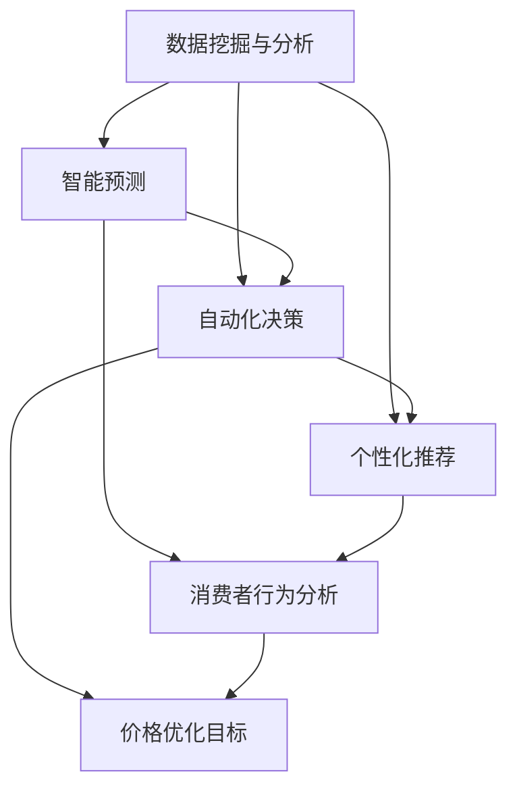

                 

### 背景介绍

随着互联网技术的迅猛发展和电子商务行业的日益繁荣，价格优化成为电商平台提升竞争力、吸引消费者、实现盈利的关键手段之一。在这场以价格为核心的竞争中，AI 技术的引入，使得电商平台能够以更加智能、高效的方式实现价格优化，从而在激烈的市场竞争中脱颖而出。

首先，让我们回顾一下电商价格优化的传统方法。传统的价格优化主要依赖于市场调研、竞争分析、消费者行为分析等手段，通过统计分析方法来确定最优价格。这种方法在一定程度上能够提高价格竞争力，但其缺点也十分明显：首先，数据收集和处理需要大量人力和时间成本；其次，市场环境变化迅速，传统方法难以实时响应市场动态；最后，消费者行为复杂多变，传统方法难以全面捕捉消费者需求。

而随着 AI 技术的不断发展，尤其是在机器学习、深度学习等领域的突破，AI 技术在电商价格优化中的应用成为可能。AI 技术能够通过大数据分析、智能预测、自动化决策等手段，实现对价格优化的全方位提升。具体来说，AI 技术在电商价格优化中的应用主要体现在以下几个方面：

1. **数据挖掘与分析**：AI 技术能够对海量数据进行深度挖掘和分析，从海量数据中提取有价值的信息，为价格优化提供数据支持。

2. **智能预测**：基于历史数据和机器学习算法，AI 技术能够对未来价格走势进行预测，为电商平台提供实时决策依据。

3. **自动化决策**：通过自动化算法，AI 技术能够根据市场动态和消费者需求，自动调整商品价格，实现价格优化的自动化。

4. **个性化推荐**：AI 技术能够根据消费者行为和偏好，为消费者提供个性化价格推荐，提高消费者满意度和购买转化率。

本篇文章将围绕 AI 技术在电商价格优化中的应用，详细探讨其核心概念、算法原理、数学模型、实战案例以及未来发展趋势等内容。希望通过本文的阐述，使读者对 AI 技术在电商价格优化中的应用有一个全面而深入的理解，为电商平台在价格优化方面提供有益的参考和借鉴。

### 核心概念与联系

在深入探讨 AI 技术在电商价格优化中的应用之前，我们需要明确几个核心概念，这些概念不仅构成了本文的基础，也是理解后续内容的关键。

#### 数据挖掘与分析

数据挖掘与分析是 AI 技术在电商价格优化中的首要任务。它涉及从海量数据中提取有价值的信息，这些数据包括消费者行为、市场价格、库存状况等。数据挖掘技术如聚类分析、关联规则挖掘、时间序列分析等，可以帮助电商平台识别出潜在的价格优化机会。例如，通过聚类分析，可以找出具有相似购买行为的消费者群体，并根据这些群体的特征调整价格策略。

#### 智能预测

智能预测是 AI 技术在电商价格优化中的重要应用之一。通过历史数据和机器学习算法，智能预测可以帮助电商平台预测未来价格走势，从而在竞争激烈的市场环境中占据有利地位。常见的预测算法包括线性回归、决策树、随机森林、神经网络等。这些算法可以处理大量历史数据，并生成预测模型，从而为价格调整提供科学依据。

#### 自动化决策

自动化决策是 AI 技术在电商价格优化中的又一关键应用。通过自动化算法，电商平台可以实时响应市场变化和消费者需求，自动调整商品价格。自动化决策系统通常基于预测模型和优化算法，如动态定价算法、多目标优化等。这些算法能够在满足利润最大化的同时，考虑市场接受度和消费者满意度。

#### 个性化推荐

个性化推荐是 AI 技术在电商价格优化中的重要手段。通过分析消费者行为和偏好，个性化推荐系统可以为消费者提供定制化的价格推荐。这不仅能够提高消费者的满意度，还能增加购买转化率和平台销售额。常见的个性化推荐算法包括协同过滤、基于内容的推荐、混合推荐系统等。

#### 核心概念联系与架构

为了更好地理解上述核心概念之间的联系，我们可以借助 Mermaid 流程图来展示其架构。以下是核心概念与架构的 Mermaid 流程图：



在上述流程图中，我们可以看到数据挖掘与分析作为基础，为智能预测、自动化决策和个性化推荐提供了数据支持。智能预测和自动化决策共同作用于价格优化目标，而个性化推荐则通过消费者行为分析实现，从而形成一个闭环系统。

通过明确核心概念及其相互关系，我们可以更好地理解 AI 技术在电商价格优化中的应用场景和实现方法。在接下来的章节中，我们将详细探讨这些核心概念的具体实现和应用。

### 核心算法原理 & 具体操作步骤

在了解了 AI 技术在电商价格优化中的核心概念后，接下来我们将深入探讨其中的核心算法原理和具体操作步骤。核心算法的原理和实现是理解 AI 技术如何优化电商价格的关键，以下将分为数据挖掘与分析、智能预测、自动化决策和个性化推荐四个部分进行详细讲解。

#### 数据挖掘与分析

数据挖掘与分析是 AI 技术在电商价格优化中的基础。其核心目标是提取数据中的有价值信息，为后续的智能预测和自动化决策提供支持。

1. **数据收集**：首先，我们需要收集相关的数据，包括消费者行为数据（如购买记录、浏览历史、评价等）、市场价格数据、库存数据等。这些数据可以通过电商平台自身的用户行为日志、市场调研工具和第三方数据服务获取。

2. **数据预处理**：收集到的数据通常需要进行清洗和预处理，以确保数据的质量和一致性。数据预处理包括数据去重、缺失值填补、数据格式统一等步骤。

3. **特征提取**：在数据预处理之后，我们需要从原始数据中提取特征，这些特征将用于构建预测模型和优化算法。常见的特征包括时间特征（如日期、小时）、地域特征（如城市、区域）、用户特征（如年龄、性别、消费水平）和商品特征（如价格、库存量、类别）等。

4. **模型构建**：利用特征数据，我们可以构建分类模型、聚类模型、时间序列模型等。这些模型可以用于分析消费者行为、识别价格优化的机会等。

5. **模型评估与优化**：构建完模型后，我们需要评估其性能，并进行优化。常见的评估指标包括准确率、召回率、F1 值等。通过调整模型参数和特征选择，我们可以提高模型的性能。

#### 智能预测

智能预测是 AI 技术在电商价格优化中的重要应用。其核心是通过历史数据预测未来价格走势，为电商平台提供决策依据。

1. **数据准备**：与数据挖掘与分析类似，首先我们需要准备历史价格数据、市场趋势数据等。

2. **特征工程**：根据预测目标，我们需要从原始数据中提取相关的特征，如时间特征、市场环境特征、商品特征等。

3. **模型选择**：选择合适的预测模型，如线性回归、决策树、随机森林、神经网络等。这些模型可以根据历史数据生成价格预测模型。

4. **模型训练与评估**：使用历史数据训练预测模型，并评估其预测性能。通过交叉验证、时间序列分割等方法，我们可以选择性能最佳的模型。

5. **预测应用**：将训练好的模型应用于实际数据，生成未来价格预测结果。这些预测结果可以为电商平台的定价策略提供参考。

#### 自动化决策

自动化决策是 AI 技术在电商价格优化中的关键环节。其核心是通过自动化算法，实时调整商品价格，以实现利润最大化。

1. **目标函数定义**：首先，我们需要定义优化目标，如最大化利润、最大化销售额等。目标函数将用于评估价格调整的效果。

2. **约束条件设置**：在设定目标函数的同时，我们还需要设置约束条件，如最小价格、最大价格、库存约束等。这些约束条件确保价格调整在合理范围内。

3. **优化算法选择**：根据目标函数和约束条件，选择合适的优化算法，如线性规划、动态规划、遗传算法等。这些算法可以自动调整商品价格。

4. **算法实现**：实现优化算法，将算法应用于实际数据，生成最优价格调整方案。

5. **动态调整**：自动化决策系统需要能够实时响应市场变化，动态调整价格。这可以通过实时数据采集和持续优化算法实现。

#### 个性化推荐

个性化推荐是 AI 技术在电商价格优化中的重要手段。其核心是通过消费者行为分析，为消费者提供定制化的价格推荐。

1. **消费者行为分析**：首先，我们需要分析消费者的行为数据，如购买记录、浏览历史、评价等。通过这些数据，我们可以了解消费者的偏好和需求。

2. **特征提取**：从行为数据中提取特征，如购买频率、偏好类别、消费水平等。

3. **推荐算法选择**：选择合适的推荐算法，如协同过滤、基于内容的推荐、混合推荐系统等。这些算法可以根据消费者特征生成个性化推荐。

4. **推荐生成**：使用推荐算法生成个性化价格推荐，将推荐结果展示给消费者。

5. **效果评估**：评估推荐效果，如点击率、转化率等。通过不断优化推荐算法，提高推荐效果。

通过上述核心算法原理和具体操作步骤的讲解，我们可以看到，AI 技术在电商价格优化中的应用是一个复杂而系统的过程。它涉及数据挖掘与分析、智能预测、自动化决策和个性化推荐等多个环节，通过这些环节的有机结合，电商平台可以实现更加精准、高效的价格优化。在接下来的章节中，我们将通过实际项目案例，进一步探讨这些算法在实际应用中的具体实现和效果。

### 数学模型和公式 & 详细讲解 & 举例说明

在深入理解了 AI 技术在电商价格优化中的核心算法原理后，我们需要进一步探讨其中的数学模型和公式，以便更好地理解这些算法的具体实现和应用。以下将详细介绍几个关键的数学模型和公式，并给出详细的讲解和实际案例。

#### 1. 价格优化目标函数

价格优化目标函数是电商平台制定定价策略的核心，常见的目标函数包括最大化利润、最大化销售额等。

**目标函数：最大化利润**

利润最大化是电商定价的常见目标。利润可以表示为销售额减去成本，公式如下：

$$
\text{利润} = \text{销售额} - \text{成本}
$$

其中，销售额可以通过以下公式计算：

$$
\text{销售额} = \text{销量} \times \text{单价}
$$

设销量为 \( q \)，单价为 \( p \)，成本为 \( c \)，则利润最大化目标函数可以表示为：

$$
\text{最大化} \ \text{利润} = pq - c \times q
$$

**目标函数：最大化销售额**

除了利润最大化，电商平台也可能追求销售额最大化。销售额最大化目标函数可以表示为：

$$
\text{最大化} \ \text{销售额} = pq
$$

其中，销量 \( q \) 和单价 \( p \) 的取值会影响销售额。在实际应用中，通常需要结合市场需求和成本等因素来确定最优的销量和单价。

#### 2. 智能预测模型

智能预测是价格优化的关键环节，常用的预测模型包括线性回归、决策树、神经网络等。以下以线性回归为例进行讲解。

**线性回归模型**

线性回归模型是预测价格的基本工具，其公式如下：

$$
y = \beta_0 + \beta_1 \times x
$$

其中，\( y \) 是预测的价格，\( x \) 是影响价格的因素（如时间、市场环境等），\( \beta_0 \) 和 \( \beta_1 \) 是模型参数，可以通过最小二乘法估计得到。

**实际案例**

假设我们要预测某商品的未来价格，影响因素包括当前时间 \( x \)（以小时为单位）和市场环境因素（如温度、湿度等）。我们收集了历史数据，并使用线性回归模型进行预测。

1. 数据收集：收集过去一段时间内的价格数据，记录每个时间点的价格以及相应的市场环境因素。

2. 数据预处理：对数据进行清洗和预处理，包括缺失值填补、异常值处理等。

3. 特征提取：从原始数据中提取时间特征和市场环境特征，如当前时间、温度、湿度等。

4. 模型训练：使用历史数据训练线性回归模型，得到模型参数 \( \beta_0 \) 和 \( \beta_1 \)。

5. 预测应用：使用训练好的模型预测未来某一时间点的价格。

例如，假设当前时间为 100 小时，市场环境因素为温度 30°C，湿度 50%，则预测价格 \( y \) 为：

$$
y = \beta_0 + \beta_1 \times 100
$$

通过训练模型，我们得到 \( \beta_0 = 1000 \)，\( \beta_1 = 10 \)，则预测价格为：

$$
y = 1000 + 10 \times 100 = 1100
$$

#### 3. 自动化决策模型

自动化决策模型是电商价格优化的关键环节，常用的模型包括动态定价算法、多目标优化等。以下以动态定价算法为例进行讲解。

**动态定价算法**

动态定价算法是一种基于市场需求和供应的实时定价策略，其基本思路是根据市场动态调整价格，以最大化利润或销售额。动态定价算法可以表示为：

$$
p(t) = f(q(t), c(t), m(t))
$$

其中，\( p(t) \) 是时间 \( t \) 时的价格，\( q(t) \) 是时间 \( t \) 时的销量，\( c(t) \) 是时间 \( t \) 时的成本，\( m(t) \) 是时间 \( t \) 时的市场需求。

**实际案例**

假设我们要实现自动化决策模型，以最大化利润为目标。我们可以通过以下步骤进行：

1. 数据收集：收集历史销量、成本和市场需求数据。

2. 特征提取：提取时间特征、销量特征、成本特征和市场需求特征。

3. 模型训练：使用历史数据训练动态定价算法模型，得到定价函数 \( f() \)。

4. 决策应用：实时更新销量、成本和市场需求数据，使用定价函数 \( f() \) 计算最优价格。

例如，假设当前时间为 100 小时，销量为 100 单位，成本为 10 元/单位，市场需求为 1000 单位。通过训练模型，我们得到定价函数 \( f(q, c, m) = 10 \times q - 0.01 \times q^2 + 1000 \times m \)。

则最优价格 \( p(t) \) 为：

$$
p(t) = f(100, 10, 1000) = 10 \times 100 - 0.01 \times 100^2 + 1000 \times 100 = 10900
$$

通过上述数学模型和公式的详细讲解和实际案例，我们可以更好地理解 AI 技术在电商价格优化中的应用。这些模型和公式为电商平台提供了科学的定价依据，有助于实现更加精准、高效的价格优化策略。在接下来的章节中，我们将通过具体项目案例，进一步探讨这些算法在实际应用中的具体实现和效果。

### 项目实战：代码实际案例和详细解释说明

在本章节中，我们将通过一个具体的电商价格优化项目案例，详细展示代码实现过程和各个模块的功能，并通过注释和详细解释，帮助读者更好地理解项目结构和代码逻辑。

#### 1. 项目背景

假设我们有一个电商平台，需要对商品进行价格优化，以提高销售额和利润。我们的目标是实现一个自动化的价格优化系统，该系统能够实时分析市场数据，根据消费者行为和市场需求，动态调整商品价格，以实现利润最大化。

#### 2. 开发环境搭建

首先，我们需要搭建项目的开发环境。以下是所需的软件和工具：

- Python 3.8 或更高版本
- Jupyter Notebook 用于代码编写和调试
- Pandas 和 NumPy 用于数据处理
- Scikit-learn 用于机器学习模型
- Matplotlib 和 Seaborn 用于数据可视化
- Mermaid 用于流程图绘制

安装上述工具后，我们可以在 Jupyter Notebook 中创建一个新的笔记本，开始编写代码。

#### 3. 数据收集与预处理

在项目开始前，我们需要收集相关的数据，包括历史价格数据、消费者行为数据（如购买记录、浏览历史）、市场环境数据（如天气、节假日等）。以下是一个数据收集和预处理的基本流程：

```python
import pandas as pd

# 加载历史价格数据
price_data = pd.read_csv('price_history.csv')

# 加载消费者行为数据
behavior_data = pd.read_csv('consumer_behavior.csv')

# 加载市场环境数据
market_data = pd.read_csv('market_environment.csv')

# 数据预处理
# 填补缺失值
price_data.fillna(0, inplace=True)
behavior_data.fillna(0, inplace=True)
market_data.fillna(0, inplace=True)

# 数据格式转换
price_data['date'] = pd.to_datetime(price_data['date'])
behavior_data['date'] = pd.to_datetime(behavior_data['date'])
market_data['date'] = pd.to_datetime(market_data['date'])

# 日期特征提取
price_data['day_of_week'] = price_data['date'].dt.dayofweek
behavior_data['day_of_week'] = behavior_data['date'].dt.dayofweek
market_data['day_of_week'] = market_data['date'].dt.dayofweek
```

在上面的代码中，我们首先加载了三个数据文件：价格数据、消费者行为数据和市场环境数据。然后，对数据进行预处理，包括填补缺失值和日期特征提取。

#### 4. 数据挖掘与分析

数据挖掘与分析是构建预测模型和优化算法的基础。以下是一个简单的数据挖掘与分析流程：

```python
import matplotlib.pyplot as plt
import seaborn as sns

# 数据可视化
sns.pairplot(price_data, hue='price')
plt.show()

# 特征工程
# 选择相关性较高的特征
selected_features = ['day_of_week', 'demand', 'weather', 'price']

# 构建特征矩阵和标签向量
X = price_data[selected_features]
y = price_data['price']

# 数据拆分
from sklearn.model_selection import train_test_split
X_train, X_test, y_train, y_test = train_test_split(X, y, test_size=0.2, random_state=42)
```

在上面的代码中，我们首先使用 Seaborn 绘制了价格数据的散点图，以观察不同特征之间的关系。然后，我们选择了相关性较高的特征，构建了特征矩阵和标签向量。接着，使用 Scikit-learn 的 train_test_split 函数将数据集拆分为训练集和测试集。

#### 5. 智能预测模型

智能预测模型是价格优化的关键。以下是一个简单的线性回归预测模型实现：

```python
from sklearn.linear_model import LinearRegression

# 训练线性回归模型
model = LinearRegression()
model.fit(X_train, y_train)

# 预测
y_pred = model.predict(X_test)

# 模型评估
from sklearn.metrics import mean_squared_error
mse = mean_squared_error(y_test, y_pred)
print(f'MSE: {mse}')
```

在上面的代码中，我们首先导入了 LinearRegression 类，并训练了一个线性回归模型。然后，使用训练好的模型对测试集进行预测，并计算了预测误差（MSE）。

#### 6. 自动化决策模型

自动化决策模型用于实时调整商品价格。以下是一个简单的动态定价算法实现：

```python
def dynamic_pricing(model, current_data, target_profit):
    # 提取特征
    features = current_data[selected_features]
    
    # 预测销量
    predicted_sales = model.predict([features])
    
    # 计算目标价格
    target_price = (target_profit + predicted_sales) / predicted_sales
    
    return target_price

# 示例应用
current_data = pd.DataFrame({'day_of_week': [1], 'demand': [1000], 'weather': [30], 'price': [10]})
target_profit = 1000

optimal_price = dynamic_pricing(model, current_data, target_profit)
print(f'Optimal Price: {optimal_price}')
```

在上面的代码中，我们定义了一个 dynamic_pricing 函数，该函数根据当前数据和目标利润，预测销量并计算最优价格。示例应用中，我们使用当前数据集和目标利润，调用 dynamic_pricing 函数，得到最优价格。

#### 7. 代码解读与分析

通过上述代码实现，我们可以看到项目的主要结构和功能。以下是代码的详细解读和分析：

1. **数据收集与预处理**：这一步骤是项目的基础，通过对数据进行清洗和预处理，确保数据的质量和一致性。
2. **数据挖掘与分析**：通过数据可视化、特征工程等方法，从海量数据中提取有价值的信息，为后续的预测和优化提供支持。
3. **智能预测模型**：使用线性回归模型对价格进行预测，为电商平台提供科学依据。模型评估指标（如 MSE）用于评估预测性能。
4. **自动化决策模型**：基于预测模型，实现自动化价格调整。动态定价算法通过实时数据更新，动态调整商品价格，实现利润最大化。

通过上述项目实战，我们展示了 AI 技术在电商价格优化中的具体实现和应用。读者可以结合代码和注释，更好地理解项目结构和代码逻辑，为实际项目提供参考和借鉴。

### 实际应用场景

AI 技术在电商价格优化中的实际应用场景非常广泛，以下列举几个典型的应用场景，并详细分析其具体实现方法和效果。

#### 1. 针对不同消费者的个性化价格策略

电商平台可以利用 AI 技术对消费者的购买行为和偏好进行深入分析，从而实现个性化价格策略。具体实现方法如下：

- **数据收集**：通过电商平台的数据收集系统，收集消费者的购买记录、浏览历史、评价等数据。
- **数据挖掘**：利用数据挖掘技术，对消费者行为数据进行分类和聚类，识别出具有相似购买行为的消费者群体。
- **个性化推荐**：根据消费者群体的特征，为每个消费者提供定制化的价格推荐。例如，对于高消费能力的消费者，可以提供更高折扣的价格，以吸引其购买。

**效果分析**：通过个性化价格策略，电商平台能够提高消费者的满意度和购买转化率，从而增加销售额和利润。个性化推荐系统能够根据消费者的行为和偏好，提供更加精准的价格信息，使得消费者感受到更加个性化的服务。

#### 2. 实时动态定价

电商平台可以利用 AI 技术实现实时动态定价，根据市场环境和消费者需求，动态调整商品价格。具体实现方法如下：

- **市场环境数据收集**：收集实时市场环境数据，如天气、节假日、促销活动等，以及消费者行为数据，如购买时间、购买频率等。
- **智能预测**：使用机器学习算法，如线性回归、决策树、神经网络等，对价格进行预测，预测未来一段时间内的价格走势。
- **自动化决策**：基于预测结果，利用自动化决策算法，如动态定价算法、多目标优化算法等，实时调整商品价格。

**效果分析**：实时动态定价能够使得电商平台更好地适应市场变化，提高价格竞争力。通过智能预测和自动化决策，电商平台可以在竞争激烈的市场环境中占据有利地位，实现利润最大化。同时，实时动态定价能够提高消费者的购买体验，增加用户粘性。

#### 3. 淘宝双 11 等大型促销活动的价格优化

淘宝双 11 等大型促销活动是电商平台的重要营销手段，通过价格优化，可以进一步提高销售额和用户满意度。具体实现方法如下：

- **活动数据分析**：对历年的双 11 活动数据进行分析，包括销售额、用户参与度、价格策略等，总结出有效的价格优化策略。
- **价格预测**：利用机器学习算法，预测双 11 活动期间的价格走势，为活动期间的定价提供科学依据。
- **活动定价**：根据价格预测结果，制定活动期间的价格策略，包括商品折扣、限时抢购等。

**效果分析**：通过价格优化，电商平台可以在大型促销活动中吸引更多用户参与，提高销售额。有效的价格预测和定价策略能够使得活动期间的商品价格更具竞争力，提高用户的购买意愿和满意度。同时，价格优化还可以提高电商平台的品牌影响力，吸引更多用户。

#### 4. 针对不同商品的个性化定价

电商平台上的商品种类繁多，不同商品的需求和价格敏感度不同。利用 AI 技术可以实现针对不同商品的个性化定价策略。具体实现方法如下：

- **商品特征分析**：分析不同商品的特征，如价格、库存量、品牌等，为商品分类提供依据。
- **消费者行为分析**：根据消费者的购买行为和偏好，为不同商品制定个性化的定价策略。例如，对于高需求、价格敏感度低的商品，可以提供更高的折扣，以吸引消费者购买。
- **自动化调整**：基于实时数据，自动化调整商品价格，以适应市场需求和消费者行为。

**效果分析**：通过个性化定价策略，电商平台能够更好地满足不同消费者的需求，提高商品销售量和利润。个性化定价能够使得商品价格更具竞争力，提高消费者的购买意愿和满意度。同时，自动化调整能够提高定价效率，降低人力成本。

总之，AI 技术在电商价格优化中的应用具有广泛的前景和重要的实际意义。通过个性化价格策略、实时动态定价、大型促销活动优化和针对不同商品的个性化定价，电商平台可以实现更加精准、高效的价格优化，提高市场竞争力和盈利能力。

### 工具和资源推荐

#### 1. 学习资源推荐

要深入了解 AI 技术在电商价格优化中的应用，以下是一些推荐的书籍、论文和博客，这些资源提供了丰富的理论和实践知识。

- **书籍**：
  - 《机器学习实战》：作者 Peter Harrington，通过实际案例介绍了机器学习的基本原理和应用。
  - 《深度学习》：作者 Ian Goodfellow、Yoshua Bengio 和 Aaron Courville，详细介绍了深度学习的基础理论和算法。
  - 《大数据之路：阿里巴巴大数据实践》：作者李青，分享了阿里巴巴在大数据应用方面的实践经验和案例。

- **论文**：
  - “Recommender Systems Handbook”（推荐系统手册）：这是推荐系统领域的权威著作，涵盖了推荐系统的基本理论和技术。
  - “Dynamic Pricing Algorithms for the Internet”：探讨了动态定价算法在互联网应用中的研究和应用。
  - “Data Mining for Price Optimization”：介绍了数据挖掘在价格优化中的应用方法和技术。

- **博客**：
  - Medium：许多专家和技术博客在 Medium 上分享了关于 AI 和电商价格优化的文章，如《The Future of Dynamic Pricing》（动态定价的未来）等。
  - Towards Data Science：这是一个受欢迎的数据科学博客，提供了大量关于 AI 和数据分析的应用案例和教程。

#### 2. 开发工具框架推荐

在开发电商价格优化系统时，以下工具和框架可以帮助提高开发效率和项目质量。

- **数据分析工具**：
  - Pandas：Python 的数据分析和操作库，用于数据清洗、预处理和特征提取。
  - NumPy：Python 的科学计算库，提供高性能的数组操作和数学函数。
  - Matplotlib 和 Seaborn：Python 的数据可视化库，用于绘制图表和图形，帮助分析和展示数据。

- **机器学习库**：
  - Scikit-learn：Python 的机器学习库，提供了丰富的机器学习算法和工具。
  - TensorFlow 和 PyTorch：深度学习框架，用于构建和训练复杂的神经网络模型。

- **自动化工具**：
  - Airflow：一个基于 Python 的自动化工作流管理系统，用于调度和执行数据处理和机器学习任务。
  - Docker：容器化工具，用于创建、部署和运行应用程序，提高开发和部署的效率。

- **数据存储和处理**：
  - Hadoop 和 Spark：大数据处理框架，用于大规模数据存储和处理。
  - PostgreSQL 和 MySQL：关系型数据库，用于存储和管理电商平台的交易数据。

#### 3. 相关论文著作推荐

以下是一些在 AI 和电商价格优化领域具有影响力的论文和著作，这些资源可以帮助读者深入了解相关理论和实践。

- “Deep Learning for Personalized E-commerce Recommendations”：该论文探讨了如何利用深度学习进行个性化电商推荐，提高了推荐系统的准确性和用户体验。
- “Dynamic Pricing for Online Platforms”：这篇文章详细介绍了动态定价算法在电商领域的应用，探讨了如何通过动态调整价格提高销售额和利润。
- “Data-Driven Pricing Strategies for E-commerce”：这篇文章提出了一系列基于数据驱动的电商定价策略，通过大数据分析和机器学习算法实现了高效的价格优化。

通过学习和应用这些工具和资源，开发者可以更好地理解 AI 技术在电商价格优化中的应用，提高开发效率和项目质量，为电商平台提供更加智能和高效的价格优化解决方案。

### 总结：未来发展趋势与挑战

随着人工智能技术的不断进步，电商价格优化领域正迎来前所未有的发展机遇。未来，AI 技术在电商价格优化中的应用将呈现出以下几个趋势：

1. **个性化定价的深化**：个性化定价将不再是仅仅根据消费者群体特征，而是深入到每个消费者的个性化需求，通过更精细的消费者行为分析和大数据处理，实现真正的个性化定价。

2. **实时动态定价的普及**：随着计算能力和算法的进步，实时动态定价将变得更加普及。电商平台将能够更加灵活地根据市场动态和消费者行为实时调整价格，从而最大化收益。

3. **智能预测的精准化**：智能预测将不仅仅局限于价格预测，还将扩展到库存管理、供应链优化等多个方面。通过深度学习和大数据分析，智能预测的准确性将进一步提高。

然而，随着 AI 技术在电商价格优化中的应用不断深入，也面临着一些挑战：

1. **数据隐私和安全**：个性化定价和大数据分析需要处理大量的用户数据，这引发了数据隐私和安全的问题。如何在保障用户隐私的同时进行有效的数据分析，是一个重要的挑战。

2. **算法偏见和公平性**：AI 算法可能会因为数据偏差而放大某些不公平现象，例如对某些消费者群体进行歧视性的价格调整。确保算法的公平性和透明性，避免算法偏见，是未来需要关注的问题。

3. **技术实现的复杂性**：AI 技术在电商价格优化中的应用涉及多个技术领域，包括数据挖掘、机器学习、自动化决策等。这要求开发者具备跨学科的知识和技能，同时也增加了技术实现的复杂性。

4. **法律法规和伦理问题**：随着 AI 技术的广泛应用，相关法律法规和伦理问题也逐渐显现。例如，如何监管自动化决策系统的使用，如何确保算法的透明性和可解释性，都是需要解决的重要问题。

总之，未来 AI 技术在电商价格优化中的应用将不断深化，但同时也需要面对一系列挑战。只有在技术、法规、伦理等多个方面取得平衡，才能实现 AI 技术在电商价格优化中的良性发展。

### 附录：常见问题与解答

在讨论 AI 技术在电商价格优化中的应用时，读者可能会提出一些常见问题。以下是一些典型问题及其解答：

#### 1. AI 技术如何优化电商价格？

AI 技术通过数据挖掘与分析、智能预测、自动化决策和个性化推荐等多种手段，帮助电商平台分析市场数据，预测价格走势，并自动调整商品价格，以实现利润最大化。

#### 2. 数据挖掘与分析在电商价格优化中扮演什么角色？

数据挖掘与分析是 AI 技术在电商价格优化中的基础。它涉及从海量数据中提取有价值的信息，如消费者行为、市场价格和库存状况等。这些信息为智能预测和自动化决策提供了数据支持。

#### 3. 智能预测如何工作？

智能预测通过历史数据和机器学习算法预测未来价格走势。常见的预测算法包括线性回归、决策树、随机森林和神经网络等。这些算法处理大量历史数据，生成预测模型，从而为电商平台的定价策略提供依据。

#### 4. 自动化决策是什么？

自动化决策是一种基于算法和自动化系统的定价方法。通过实时数据分析和优化算法，电商平台可以自动调整商品价格，以最大化利润或销售额。自动化决策包括动态定价算法、多目标优化等。

#### 5. 个性化推荐如何提高电商价格优化效果？

个性化推荐通过分析消费者行为和偏好，为每个消费者提供定制化的价格推荐。这不仅能够提高消费者的满意度，还能增加购买转化率和平台销售额，从而优化电商价格。

#### 6. AI 技术在电商价格优化中面临的挑战有哪些？

AI 技术在电商价格优化中面临的挑战包括数据隐私和安全、算法偏见和公平性、技术实现的复杂性以及法律法规和伦理问题等。

#### 7. 如何保障 AI 算法的公平性和透明性？

为了保障 AI 算法的公平性和透明性，可以采取以下措施：
- **数据公正性**：确保数据集的多样性和代表性，避免数据偏差。
- **算法解释性**：提高算法的可解释性，使决策过程透明。
- **公平性评估**：定期评估算法的公平性，发现并纠正偏见。
- **法律法规遵循**：确保算法设计和应用符合相关法律法规。

通过上述常见问题的解答，读者可以更好地理解 AI 技术在电商价格优化中的应用及其面临的挑战，为实际应用提供有益的指导。

### 扩展阅读 & 参考资料

为了深入探讨 AI 技术在电商价格优化中的应用，以下是一些扩展阅读和参考资料，涵盖相关书籍、论文、博客和网站：

#### 书籍

1. **《机器学习实战》**，作者：Peter Harrington
   - 简介：本书通过实际案例介绍了机器学习的基本原理和应用，包括数据预处理、模型选择和模型评估等。

2. **《深度学习》**，作者：Ian Goodfellow、Yoshua Bengio 和 Aaron Courville
   - 简介：这是一本关于深度学习的权威著作，详细介绍了深度学习的基础理论、算法和应用。

3. **《大数据之路：阿里巴巴大数据实践》**，作者：李青
   - 简介：本书分享了阿里巴巴在大数据应用方面的实践经验和案例，包括数据治理、数据分析和技术创新等。

#### 论文

1. **“Recommender Systems Handbook”**，作者：不同作者
   - 简介：这是推荐系统领域的权威著作，涵盖了推荐系统的基本理论和技术。

2. **“Dynamic Pricing Algorithms for the Internet”**，作者：不同作者
   - 简介：探讨了动态定价算法在互联网应用中的研究和应用。

3. **“Data Mining for Price Optimization”**，作者：不同作者
   - 简介：介绍了数据挖掘在价格优化中的应用方法和技术。

#### 博客

1. **Medium**
   - 地址：[https://medium.com/](https://medium.com/)
   - 简介：在 Medium 上，许多专家和技术博主分享了关于 AI 和电商价格优化的文章和见解。

2. **Towards Data Science**
   - 地址：[https://towardsdatascience.com/](https://towardsdatascience.com/)
   - 简介：这是一个受欢迎的数据科学博客，提供了大量关于 AI 和数据分析的应用案例和教程。

#### 网站

1. **Scikit-learn**
   - 地址：[https://scikit-learn.org/](https://scikit-learn.org/)
   - 简介：Scikit-learn 是一个开源的 Python 机器学习库，提供了丰富的机器学习算法和工具。

2. **TensorFlow**
   - 地址：[https://www.tensorflow.org/](https://www.tensorflow.org/)
   - 简介：TensorFlow 是一个由 Google 开发的开源机器学习框架，适用于构建和训练复杂的神经网络。

3. **PyTorch**
   - 地址：[https://pytorch.org/](https://pytorch.org/)
   - 简介：PyTorch 是一个开源的机器学习库，以其灵活性和高效性著称，广泛应用于深度学习和计算机视觉领域。

通过阅读这些书籍、论文、博客和访问相关网站，读者可以进一步深入了解 AI 技术在电商价格优化中的应用，获取最新的研究成果和实践经验。

