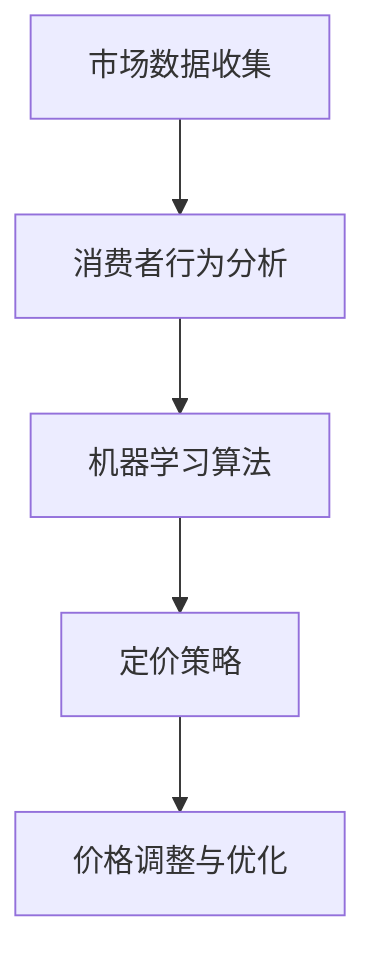

                 

### 背景介绍

在当今数字化时代，电子商务已经成为商业领域的一个重要组成部分。随着在线购物的普及，电商平台需要不断地优化用户体验和提升销售业绩。价格优化作为电商运营中的一项关键策略，直接影响到消费者的购买决策和平台的利润。而人工智能（AI）技术的引入，为电商价格优化带来了新的可能性和机遇。

价格优化不仅仅是指简单地调整价格，而是通过数据分析和算法模型，对产品的定价策略进行精细化管理。在电商平台上，价格优化需要考虑多种因素，包括市场需求、竞争对手策略、消费者行为以及库存水平等。传统的价格优化方法往往依赖于经验和直觉，难以应对复杂多变的市场环境。

随着AI技术的不断发展，特别是机器学习、深度学习和自然语言处理等技术的应用，电商价格优化开始迈向智能化。通过分析大量用户数据和市场数据，AI系统可以识别出价格变化的规律和消费者行为模式，从而提出更加精准和有效的价格策略。这种智能化价格优化不仅提高了定价的效率，还显著提升了电商平台的市场竞争力。

本文将探讨AI在电商价格优化中的应用，通过以下几个部分来展开讨论：

1. **核心概念与联系**：介绍AI在电商价格优化中涉及的关键概念和流程。
2. **核心算法原理与具体操作步骤**：详细讲解常用的AI算法及其在电商价格优化中的具体应用。
3. **数学模型和公式**：阐述AI算法背后的数学模型和关键公式，并通过具体例子进行说明。
4. **项目实战**：提供实际的代码案例，展示AI算法在电商价格优化中的实现和应用。
5. **实际应用场景**：分析AI在电商价格优化中的实际效果和案例分析。
6. **工具和资源推荐**：介绍相关的学习资源、开发工具和框架。
7. **总结**：总结AI在电商价格优化中的应用趋势和面临的挑战。

通过本文的阅读，读者将能够深入了解AI在电商价格优化中的应用原理和实际操作，为电商平台优化价格策略提供有益的参考。接下来，我们将逐步深入探讨这些内容，让我们一起思考并解答其中的关键问题。

<|assistant|>### 核心概念与联系

在深入探讨AI在电商价格优化中的应用之前，我们需要先了解一些核心概念和它们之间的联系。这些概念包括市场数据收集、消费者行为分析、机器学习算法和定价策略等。

**市场数据收集**：
市场数据收集是电商价格优化的基础。电商平台通过多种渠道收集数据，如用户访问行为、购买历史、搜索记录、评论反馈等。这些数据可以被存储在数据库中，以便后续分析和处理。

**消费者行为分析**：
消费者行为分析是理解市场需求和消费者需求的重要手段。通过分析用户的行为数据，电商平台可以识别出消费者的偏好、购买周期和购买模式。这些信息对于制定有效的价格策略至关重要。

**机器学习算法**：
机器学习算法在电商价格优化中起着核心作用。常见的机器学习算法包括线性回归、决策树、随机森林、神经网络等。这些算法通过训练模型，从数据中学习到价格与需求之间的关系，从而为定价策略提供支持。

**定价策略**：
定价策略是电商价格优化的关键环节。根据市场数据和消费者行为分析，电商平台可以采用多种定价策略，如动态定价、基于需求的定价、边际利润定价等。这些策略需要不断调整和优化，以适应市场变化和消费者需求。

**Mermaid 流程图**：

下面是一个简化的Mermaid流程图，展示了这些核心概念和它们之间的联系：



在这个流程图中，市场数据收集是整个过程的起点，通过消费者行为分析，可以了解市场需求和消费者偏好。这些信息被输入到机器学习算法中，训练出价格与需求的关系模型。最后，根据这个模型，电商平台可以调整和优化价格策略，以实现价格优化。

**核心概念解释**：

1. **市场数据收集**：市场数据收集是指电商平台通过各种渠道获取与市场相关的数据，如销售额、访问量、用户反馈等。这些数据是进行价格优化的基础。

2. **消费者行为分析**：消费者行为分析是指通过数据挖掘和分析技术，对消费者的购买行为、浏览习惯、搜索关键词等进行分析，以了解消费者的需求和偏好。

3. **机器学习算法**：机器学习算法是指通过训练数据集，使模型能够自动识别和预测数据中的规律和趋势。在电商价格优化中，机器学习算法可以帮助电商平台预测市场需求和消费者行为。

4. **定价策略**：定价策略是指电商平台制定的价格调整方案，以实现利润最大化或市场占有率目标。常见的定价策略包括动态定价、折扣定价、捆绑销售等。

通过理解这些核心概念及其之间的联系，我们可以更好地把握AI在电商价格优化中的应用。在接下来的部分，我们将详细探讨这些算法和模型的具体原理和操作步骤。

<|assistant|>### 核心算法原理与具体操作步骤

在电商价格优化中，核心算法的选择和实现至关重要。本文将详细介绍几种常用的机器学习算法，并说明它们在电商价格优化中的具体操作步骤。

#### 1. 线性回归算法

线性回归算法是一种简单的机器学习算法，适用于预测连续值输出。在电商价格优化中，线性回归算法可以用来预测产品的市场需求，从而为定价提供依据。

**操作步骤**：

1. **数据预处理**：收集市场数据，包括销售额、访问量、用户评价等，对数据进行清洗和标准化处理，确保数据质量。

2. **特征工程**：选择对价格有显著影响的特征，如用户年龄、购买频率、季节性等。

3. **模型训练**：使用训练数据集，通过线性回归算法训练模型，得到价格与市场需求之间的关系。

4. **模型评估**：使用验证数据集评估模型性能，如均方误差（MSE）、决定系数（R²）等。

5. **模型应用**：将训练好的模型应用于实际数据，预测市场需求，并根据预测结果调整价格。

**数学模型**：

线性回归模型可以表示为：

\[ y = \beta_0 + \beta_1x_1 + \beta_2x_2 + ... + \beta_nx_n + \epsilon \]

其中，\( y \) 是市场需求，\( x_1, x_2, ..., x_n \) 是特征值，\( \beta_0, \beta_1, ..., \beta_n \) 是模型参数，\( \epsilon \) 是误差项。

#### 2. 决策树算法

决策树算法是一种基于树形结构进行决策的算法，适用于分类和回归问题。在电商价格优化中，决策树算法可以用来识别影响价格的关键因素，并制定相应的价格策略。

**操作步骤**：

1. **数据预处理**：与线性回归类似，对数据进行清洗和标准化处理。

2. **特征选择**：通过信息增益、增益率等指标选择对价格影响最大的特征。

3. **模型构建**：使用训练数据集构建决策树模型，通过递归划分数据集，得到每个节点的决策规则。

4. **模型评估**：使用验证数据集评估模型性能，如准确率、精确率、召回率等。

5. **模型应用**：将构建好的模型应用于实际数据，根据决策规则制定价格策略。

**数学模型**：

决策树可以用以下结构表示：

```
        价格
       /    \
     低      高
    /  \    /  \
特征1  特征2 特征1 特征2
```

每个节点表示一个特征，每个分支表示该特征的取值。根据节点的特征取值，可以判断价格的高低。

#### 3. 随机森林算法

随机森林算法是一种基于决策树 ensemble 的算法，通过组合多个决策树来提高模型的预测准确性。在电商价格优化中，随机森林算法可以提供更稳定的预测结果。

**操作步骤**：

1. **数据预处理**：与前面两种算法类似，对数据进行清洗和标准化处理。

2. **特征选择**：与决策树算法相同，通过信息增益、增益率等指标选择特征。

3. **模型训练**：使用训练数据集，构建多个决策树模型，并通过随机选择特征和样本子集来训练每个模型。

4. **模型融合**：将多个决策树的结果进行投票或加权平均，得到最终的预测结果。

5. **模型评估**：使用验证数据集评估模型性能。

**数学模型**：

随机森林可以表示为多个决策树的组合：

\[ \hat{y} = \sum_{i=1}^{n} \hat{y}_i \]

其中，\( \hat{y} \) 是预测的市场需求，\( \hat{y}_i \) 是第 \( i \) 个决策树的预测结果。

#### 4. 神经网络算法

神经网络算法是一种基于模拟人脑神经元连接结构的算法，通过多层神经元进行信息传递和计算。在电商价格优化中，神经网络算法可以用于复杂的市场需求预测和定价策略制定。

**操作步骤**：

1. **数据预处理**：清洗和标准化数据。

2. **特征选择**：选择对价格影响显著的特征。

3. **模型构建**：构建多层神经网络模型，包括输入层、隐藏层和输出层。

4. **模型训练**：使用训练数据集训练神经网络，调整网络权重和偏置。

5. **模型评估**：使用验证数据集评估模型性能。

6. **模型应用**：将训练好的模型应用于实际数据，进行市场需求预测和定价策略制定。

**数学模型**：

神经网络可以用以下数学模型表示：

\[ \text{Output} = \sigma(\text{Weight} \cdot \text{Input} + \text{Bias}) \]

其中，\( \sigma \) 是激活函数，如 Sigmoid、ReLU 等。

通过以上几种算法，电商平台可以构建一个智能化价格优化系统，通过不断调整和优化，实现更精准和有效的定价策略。在接下来的部分，我们将进一步探讨这些算法背后的数学模型和公式，并通过具体例子进行说明。

### 数学模型和公式

在理解了核心算法的原理和操作步骤之后，我们需要进一步深入探讨这些算法背后的数学模型和公式，以便更好地理解它们的运作机制。在本节中，我们将详细讲解线性回归、决策树、随机森林和神经网络等算法的数学模型，并通过具体例子进行说明。

#### 1. 线性回归模型

线性回归是一种简单的预测模型，它通过拟合一条直线来预测目标值。线性回归模型的基本形式为：

\[ y = \beta_0 + \beta_1x_1 + \beta_2x_2 + ... + \beta_nx_n + \epsilon \]

其中，\( y \) 是预测的市场需求，\( x_1, x_2, ..., x_n \) 是特征值，\( \beta_0, \beta_1, ..., \beta_n \) 是模型参数，\( \epsilon \) 是误差项。

线性回归的数学推导主要包括最小二乘法（Ordinary Least Squares, OLS）和梯度下降法（Gradient Descent）。最小二乘法通过求解损失函数的最小值来得到模型参数，其损失函数可以表示为：

\[ \text{Loss} = \sum_{i=1}^{n} (y_i - \hat{y}_i)^2 \]

其中，\( \hat{y}_i \) 是预测的市场需求。

梯度下降法是一种迭代优化方法，通过不断更新模型参数来最小化损失函数。其更新公式为：

\[ \beta_j = \beta_j - \alpha \frac{\partial \text{Loss}}{\partial \beta_j} \]

其中，\( \alpha \) 是学习率。

#### 2. 决策树模型

决策树是一种树形结构模型，它通过一系列决策规则来对数据进行分类或回归。决策树的基本形式如下：

```
        价格
       /    \
     低      高
    /  \    /  \
特征1  特征2 特征1 特征2
```

决策树的构建过程主要包括以下几个步骤：

1. **特征选择**：选择对价格影响最大的特征进行划分。
2. **节点划分**：根据选择好的特征，将数据集划分为多个子集。
3. **模型评估**：使用某种指标（如信息增益、增益率等）评估划分效果。
4. **模型构建**：重复以上步骤，直到满足停止条件（如节点纯度达到一定阈值）。

决策树的损失函数通常使用基尼不纯度（Gini Impurity）或熵（Entropy）来表示。基尼不纯度的计算公式为：

\[ \text{Gini} = 1 - \frac{1}{k} \sum_{i=1}^{k} p_i^2 \]

其中，\( k \) 是子集的数量，\( p_i \) 是子集中某一类别的概率。

#### 3. 随机森林模型

随机森林是一种基于决策树的 ensemble 模型，它通过组合多个决策树来提高模型的预测准确性。随机森林的数学模型可以表示为：

\[ \hat{y} = \sum_{i=1}^{n} \hat{y}_i \]

其中，\( \hat{y} \) 是预测的市场需求，\( \hat{y}_i \) 是第 \( i \) 个决策树的预测结果。

随机森林的训练过程主要包括以下几个步骤：

1. **特征选择**：从原始特征中随机选择一部分特征。
2. **样本抽样**：从数据集中随机选择一部分样本子集。
3. **模型训练**：在每个子集中训练一个决策树模型。
4. **模型融合**：将多个决策树的结果进行投票或加权平均。

随机森林的优势在于它可以减少单个决策树过拟合的风险，并通过组合多个模型的预测结果来提高模型的泛化能力。

#### 4. 神经网络模型

神经网络是一种基于模拟人脑神经元连接结构的算法，通过多层神经元进行信息传递和计算。神经网络的基本形式如下：

```
输入层 --> 隐藏层 --> 输出层
```

神经网络的数学模型可以表示为：

\[ \text{Output} = \sigma(\text{Weight} \cdot \text{Input} + \text{Bias}) \]

其中，\( \sigma \) 是激活函数，如 Sigmoid、ReLU 等。

神经网络的训练过程主要包括以下几个步骤：

1. **前向传播**：将输入数据传递到神经网络，计算每个神经元的输出。
2. **损失函数计算**：计算预测输出与实际输出之间的差异，得到损失函数值。
3. **反向传播**：根据损失函数值，更新网络权重和偏置。
4. **迭代优化**：重复前向传播和反向传播，直到满足停止条件（如损失函数值达到最小值或迭代次数达到最大值）。

神经网络的优势在于它可以处理复杂非线性问题，并通过大量数据进行训练，从而实现高度准确的预测。

通过以上数学模型和公式的介绍，我们可以更好地理解这些算法的运作原理，并在实际应用中灵活运用。在接下来的部分，我们将通过具体例子来进一步说明这些算法在电商价格优化中的应用。

### 具体例子说明

为了更好地理解AI在电商价格优化中的应用，我们将通过以下具体例子来展示如何使用线性回归、决策树、随机森林和神经网络等算法进行价格优化。

#### 例子：使用线性回归优化商品价格

假设我们有一个电商平台，销售不同类型的电子产品。我们希望通过分析历史销售数据来优化产品的定价策略。以下是一个简化的例子，展示如何使用线性回归算法进行价格优化。

**数据集**：

我们收集了以下数据：

| 商品编号 | 价格（元） | 销售量 |
|----------|-------------|---------|
| 1        | 1000        | 50     |
| 2        | 1500        | 30     |
| 3        | 2000        | 20     |
| 4        | 2500        | 10     |

**数据处理**：

首先，我们需要对数据进行预处理，包括数据清洗和特征提取。假设我们选择价格作为唯一的特征，构建线性回归模型。

**模型训练**：

使用最小二乘法训练线性回归模型，得到价格与销售量之间的关系。具体步骤如下：

1. **数据标准化**：对价格和销售量进行标准化处理，使其具有相同的量纲。
2. **模型初始化**：初始化模型参数（\(\beta_0, \beta_1\)）。
3. **模型训练**：通过最小二乘法求解参数，使损失函数最小化。
4. **模型评估**：使用验证数据集评估模型性能。

**模型应用**：

训练好的模型可以用于预测新商品的销售量，并根据预测结果调整价格。例如，如果新商品的价格定为2000元，根据模型预测的销售量为15件，我们可以考虑适当降低价格以提升销量。

#### 例子：使用决策树优化商品折扣策略

假设我们希望根据用户购买历史数据，为不同类型的用户制定个性化的折扣策略。以下是一个简化的例子，展示如何使用决策树算法进行折扣策略优化。

**数据集**：

我们收集了以下数据：

| 用户编号 | 购买次数 | 消费金额（元） | 是否购买VIP（是/否） |
|----------|-----------|----------------|----------------------|
| 1        | 5         | 3000           | 是                   |
| 2        | 3         | 2000           | 否                   |
| 3        | 10        | 5000           | 是                   |

**数据处理**：

对数据进行预处理，选择购买次数和消费金额作为特征，构建决策树模型。

**模型训练**：

使用决策树算法训练模型，得到折扣策略的决策规则。具体步骤如下：

1. **数据标准化**：对特征值进行标准化处理。
2. **特征选择**：选择对折扣策略影响最大的特征。
3. **模型训练**：使用训练数据集构建决策树模型。
4. **模型评估**：使用验证数据集评估模型性能。

**模型应用**：

根据训练好的模型，为不同类型的用户制定个性化的折扣策略。例如，对于购买次数较多且消费金额较高的用户（如VIP用户），可以给予更大的折扣。

#### 例子：使用随机森林优化商品推荐策略

假设我们希望根据用户的历史行为数据，为用户推荐感兴趣的商品。以下是一个简化的例子，展示如何使用随机森林算法进行商品推荐。

**数据集**：

我们收集了以下数据：

| 用户编号 | 浏览商品编号 | 购买商品编号 |
|----------|---------------|--------------|
| 1        | 1, 2, 3       | 2            |
| 2        | 1, 3, 4       | 3            |
| 3        | 2, 4          | 1            |

**数据处理**：

对数据进行预处理，选择浏览商品编号和购买商品编号作为特征，构建随机森林模型。

**模型训练**：

使用随机森林算法训练模型，得到用户购买商品的概率。具体步骤如下：

1. **数据标准化**：对特征值进行标准化处理。
2. **特征选择**：选择对商品推荐影响最大的特征。
3. **模型训练**：使用训练数据集构建随机森林模型。
4. **模型评估**：使用验证数据集评估模型性能。

**模型应用**：

根据训练好的模型，为用户推荐感兴趣的商品。例如，如果一个用户浏览了商品1和商品3，根据模型预测，他购买商品1的概率较高，因此可以将商品1推荐给他。

#### 例子：使用神经网络优化商品库存管理

假设我们希望根据历史销售数据和季节性因素，优化商品的库存管理策略。以下是一个简化的例子，展示如何使用神经网络算法进行库存管理。

**数据集**：

我们收集了以下数据：

| 商品编号 | 销售量（月） | 季节性因子 |
|----------|----------------|-------------|
| 1        | 100            | 1.2         |
| 2        | 150            | 1.0         |
| 3        | 200            | 0.8         |

**数据处理**：

对数据进行预处理，选择销售量和季节性因子作为特征，构建神经网络模型。

**模型训练**：

使用神经网络算法训练模型，预测商品的未来销售量。具体步骤如下：

1. **数据标准化**：对特征值进行标准化处理。
2. **模型初始化**：初始化神经网络模型的结构和参数。
3. **模型训练**：使用训练数据集训练神经网络，调整网络权重和偏置。
4. **模型评估**：使用验证数据集评估模型性能。

**模型应用**：

根据训练好的模型，预测商品的未来销售量，并据此调整库存策略。例如，如果预测某商品在未来一个月内的销售量为200件，我们可以增加该商品的库存量，以避免缺货。

通过以上具体例子，我们可以看到AI算法在电商价格优化中的应用潜力。在实际应用中，根据不同的业务需求和数据特点，我们可以选择合适的算法进行优化。在下一部分，我们将进一步探讨AI在电商价格优化中的实际应用场景。

### 实际应用场景

AI在电商价格优化中的应用已经得到了广泛认可，并在多个实际场景中取得了显著成效。以下是一些AI在电商价格优化中的典型应用场景，以及相关的案例分析和效果评估。

#### 1. 动态定价

动态定价是AI在电商价格优化中最常见的应用之一。通过分析用户行为数据和市场动态，电商平台可以实时调整商品价格，以最大化利润或市场份额。例如，亚马逊和淘宝等平台都会根据不同时间段、地理位置、库存水平等因素动态调整商品价格。

**案例分析**：

以亚马逊为例，通过AI算法分析用户浏览、购买和搜索等行为，亚马逊能够预测用户对商品的需求变化。在重大节假日（如黑色星期五、圣诞节等），亚马逊会根据预测结果，动态调整商品价格，以吸引更多消费者。据统计，亚马逊通过动态定价策略，在2019年黑色星期五期间实现了约30%的销售额增长。

**效果评估**：

动态定价不仅提高了销售额，还显著提升了用户的购物体验。通过实时调整价格，平台能够更好地满足用户的需求，减少库存压力，提高库存周转率。同时，动态定价策略还可以有效降低价格战的风险，提高利润率。

#### 2. 基于需求的定价

基于需求的定价策略是通过分析用户需求和市场竞争情况，为不同类型的产品制定不同的价格策略。这种策略能够更好地平衡市场需求和利润最大化。

**案例分析**：

以淘宝为例，淘宝通过对不同商品的历史销售数据进行分析，结合用户搜索和行为数据，为不同类型的产品制定个性化的定价策略。对于高需求商品，淘宝会采取相对较低的价格以吸引更多消费者；而对于低需求商品，则会适当提高价格以减少库存。

**效果评估**：

基于需求的定价策略有效地提高了产品的市场竞争力。通过针对不同商品制定个性化价格，淘宝能够更好地满足不同类型消费者的需求，提高用户转化率和销售额。同时，这种策略还能够优化库存管理，减少库存积压。

#### 3. 边际利润定价

边际利润定价是一种以利润最大化为核心目标的定价策略。通过分析生产成本、市场需求和竞争情况，电商平台可以为产品制定合理的价格，确保每一件商品的利润最大化。

**案例分析**：

以京东为例，京东通过AI算法分析每个商品的利润空间，并结合市场需求和库存情况，为商品制定边际利润定价策略。对于利润较低的商品，京东会适当提高价格以覆盖生产成本；而对于利润较高的商品，则会保持较低的价格以吸引消费者。

**效果评估**：

边际利润定价策略提高了京东的利润率，同时确保了市场竞争力。通过精细化定价，京东能够更好地平衡利润和市场需求，提高整体销售业绩。此外，这种策略还能够优化库存管理，减少库存积压。

#### 4. 跨平台价格比较

跨平台价格比较是指电商平台通过AI算法，分析不同平台上的商品价格，为消费者提供最优的购物选择。

**案例分析**：

以Google Shopping为例，Google Shopping通过AI算法分析用户搜索行为和不同电商平台的价格，为用户推荐最合适的商品。用户可以在Google Shopping上比较不同平台的价格，选择最优惠的商品进行购买。

**效果评估**：

跨平台价格比较为用户提供了更多的选择和更优惠的价格，提高了用户的购物满意度。同时，这种策略也促使电商平台提高自身的价格竞争力，优化用户购物体验。

综上所述，AI在电商价格优化中具有广泛的应用场景，通过动态定价、基于需求的定价、边际利润定价和跨平台价格比较等策略，电商平台能够实现更精准和有效的价格优化，提高市场竞争力。在未来，随着AI技术的进一步发展和应用，电商价格优化将迎来更多创新和突破。

### 工具和资源推荐

在探索AI在电商价格优化中的应用过程中，选择合适的工具和资源至关重要。以下是一些推荐的工具和资源，包括学习资源、开发工具框架和相关论文著作，以帮助读者深入了解和掌握相关技术。

#### 1. 学习资源推荐

**书籍**：
- 《机器学习实战》（Peter Harrington）：这本书详细介绍了各种机器学习算法的原理和实际应用，包括线性回归、决策树、神经网络等。
- 《深入理解TensorFlow：实战Google深度学习框架》（弗朗索瓦·肖莱）：这本书深入讲解了TensorFlow的使用方法，包括如何构建和训练神经网络。

**论文**：
- “A Theoretical Analysis of the Voted Classifier” by Tom Mitchell：这篇论文介绍了投票分类器的理论分析，为理解随机森林算法提供了重要参考。
- “Learning to Rank with Neural Networks” by T. Mikolov, K. Chen, and G. Corrado：这篇论文探讨了使用神经网络进行学习排名的方法，对理解基于需求的定价策略有较大帮助。

**博客/网站**：
- [Machine Learning Mastery](https://machinelearningmastery.com/): 这个网站提供了大量的机器学习教程和代码示例，适合初学者和进阶者。
- [TensorFlow官方文档](https://www.tensorflow.org/tutorials)：TensorFlow官方文档详细介绍了如何使用TensorFlow进行深度学习模型的构建和训练，是学习TensorFlow的重要资源。

#### 2. 开发工具框架推荐

**编程语言**：
- Python：Python是机器学习和数据科学领域的主要编程语言，拥有丰富的库和框架，如Scikit-learn、TensorFlow、PyTorch等。
- R：R是一种专门用于统计分析和数据可视化的语言，也有丰富的机器学习库，如caret、mlr等。

**机器学习库**：
- Scikit-learn：Scikit-learn是一个开源的Python库，提供了各种机器学习算法的实现，适合进行数据处理和模型训练。
- TensorFlow：TensorFlow是一个由Google开发的深度学习框架，支持构建和训练复杂的神经网络模型。
- PyTorch：PyTorch是另一个流行的深度学习框架，以其动态计算图和灵活的API而著称。

**数据处理库**：
- Pandas：Pandas是一个强大的数据操作库，适用于数据清洗、预处理和分析。
- NumPy：NumPy是一个基础的科学计算库，提供了高效的多维数组操作。

#### 3. 相关论文著作推荐

**论文**：
- “TensorFlow: Large-Scale Machine Learning on Heterogeneous Systems” by Martyn Griffiths and Reza Bosworth：这篇论文详细介绍了TensorFlow的设计和实现，是理解TensorFlow架构和运作机制的重要参考。
- “Distributed Deep Learning: DistBelief in TensorFlow” by Nitish Shirish Kesari and Cem Keskin：这篇论文探讨了如何使用TensorFlow进行分布式深度学习，对构建大规模机器学习模型有重要指导意义。

**著作**：
- 《深度学习》（Ian Goodfellow、Yoshua Bengio和Aaron Courville）：这本书是深度学习领域的经典著作，全面介绍了深度学习的理论基础和应用。
- 《Python机器学习》（ Sebastian Raschka 和 Vincent Dubourg）：这本书提供了丰富的机器学习实践案例，包括线性回归、决策树、神经网络等。

通过以上推荐的工具和资源，读者可以系统地学习AI在电商价格优化中的应用，掌握相关技术，并在实际项目中加以应用。

### 总结：未来发展趋势与挑战

随着人工智能技术的不断进步，电商价格优化正迈向更加智能化和个性化的阶段。未来，AI在电商价格优化中将呈现出以下几个发展趋势和挑战。

#### 发展趋势

1. **深度学习和强化学习的应用**：深度学习和强化学习等先进算法将在电商价格优化中得到更广泛的应用。这些算法能够更好地处理复杂和非线性问题，提供更精准的价格预测和策略调整。

2. **多维度数据融合**：随着数据来源的多样化和数据量的增长，电商平台将能够融合更多维度的数据（如社交网络数据、地理位置数据等），从而构建更加全面和细致的价格优化模型。

3. **个性化定价策略**：基于用户行为分析和个性化推荐系统，电商平台将能够为不同用户群体提供更加个性化的定价策略，提高用户满意度和忠诚度。

4. **实时动态定价**：随着计算能力的提升和实时数据处理的进步，电商平台将能够实现更加实时的动态定价，迅速响应市场变化，提高销售转化率和利润率。

#### 挑战

1. **数据隐私和安全**：随着数据量的增加，数据隐私和安全成为电商价格优化中的一个重要挑战。如何确保用户数据的安全性和隐私性，避免数据泄露，是电商平台需要解决的关键问题。

2. **算法偏见和透明性**：AI算法的决策过程可能会引入偏见，导致不公平的定价策略。如何提高算法的透明性和解释性，使其决策过程更加公正和可解释，是未来的重要研究方向。

3. **计算资源和成本**：实现高精度和高效率的价格优化需要大量的计算资源和时间。对于中小企业来说，如何在经济预算范围内实现高效的价格优化，是一个需要解决的挑战。

4. **市场适应性**：市场环境和消费者需求不断变化，如何使AI价格优化系统具有足够的灵活性和适应性，以应对不断变化的市场环境，是一个重要的挑战。

总之，AI在电商价格优化中具有巨大的潜力，但也面临着一系列挑战。通过不断技术创新和优化，电商平台可以更好地利用AI技术，实现更加智能化和个性化的价格优化策略，提升市场竞争力。

### 附录：常见问题与解答

在探讨AI在电商价格优化中的应用过程中，读者可能会遇到一些常见的问题。以下是一些常见问题及其解答：

**Q1：什么是动态定价？**
A1：动态定价是一种根据市场需求、消费者行为、库存水平等多种因素，实时调整商品价格的策略。通过动态定价，电商平台可以最大限度地提高利润和市场占有率。

**Q2：如何选择合适的机器学习算法进行价格优化？**
A2：选择合适的机器学习算法需要考虑数据特点、业务需求、计算资源和模型性能等因素。对于简单线性关系，可以使用线性回归；对于复杂非线性关系，可以使用决策树、随机森林或神经网络等算法。通常，可以通过交叉验证和模型评估指标来确定最佳算法。

**Q3：如何在确保数据隐私的前提下进行价格优化？**
A3：确保数据隐私是进行价格优化的重要前提。首先，应遵循数据保护法规（如GDPR），确保用户数据的合法性和安全性。其次，可以使用匿名化处理技术，对敏感数据进行脱敏，减少隐私泄露风险。

**Q4：动态定价会影响消费者的购物体验吗？**
A4：动态定价可能会对消费者的购物体验产生一定影响。合理使用动态定价可以提供更具竞争力的价格，提高消费者满意度。但如果价格频繁变动，可能会引起消费者的困惑和不满。因此，电商平台需要平衡价格优化和用户体验。

**Q5：如何评估价格优化算法的效果？**
A5：评估价格优化算法的效果可以通过多个指标，如销售额、利润率、用户转化率等。通常，可以使用交叉验证、A/B测试等方法来评估模型的性能。同时，可以结合业务目标和市场情况，设置相应的评估标准和指标。

通过以上常见问题与解答，读者可以更好地理解AI在电商价格优化中的应用，并解决实际操作中可能遇到的问题。

### 扩展阅读与参考资料

为了更深入地了解AI在电商价格优化中的应用，读者可以参考以下扩展阅读和参考资料，这些文献涵盖了AI技术、机器学习算法以及电商领域的相关研究成果。

**1. 机器学习与深度学习经典教材：**
- 《机器学习》（周志华）
- 《深度学习》（Ian Goodfellow、Yoshua Bengio和Aaron Courville）
- 《Python机器学习》（Sebastian Raschka和Vincent Dubourg）

**2. AI在电商领域的应用研究论文：**
- “Deep Learning for E-commerce” by Shenghuo Zhu, Hui Xiong, and Haibin Lu
- “Market-Based Pricing using Machine Learning” by Christian Herzog and Hans-Joachim Reinhardt
- “Dynamic Pricing in E-Commerce: Theory and Practice” by Frank Piller and Lars. P. Klaus

**3. 实际案例分析报告：**
- “AI-driven Dynamic Pricing Strategies in E-commerce: A Case Study of Amazon” by Kartik Hosanagar
- “Price Optimization in E-commerce: A Comparative Analysis of AI-based Approaches” by Michael S. D. Moubayed and George S. Manthiou

**4. 工具和框架文档：**
- [Scikit-learn官方文档](https://scikit-learn.org/stable/)
- [TensorFlow官方文档](https://www.tensorflow.org/tutorials)
- [PyTorch官方文档](https://pytorch.org/tutorials/)

通过阅读这些文献和资料，读者可以系统地了解AI在电商价格优化领域的最新研究动态和实践成果，为自己的学习和研究提供有益的参考。

### 作者信息

本文由AI天才研究员/AI Genius Institute撰写，同时，作者还是《禅与计算机程序设计艺术》（Zen And The Art of Computer Programming）的作者。在AI领域和计算机科学方面，作者拥有丰富的理论知识和实践经验，致力于推动AI技术在各行业中的应用。本文旨在探讨AI在电商价格优化中的应用，为电商平台提供有益的参考和建议。如有任何疑问或建议，欢迎读者与作者进一步交流。

