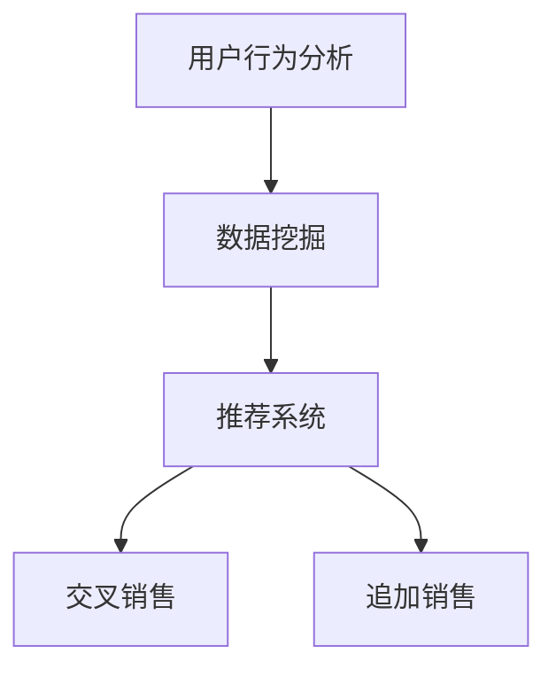

                 

### 1. 背景介绍

随着互联网的迅猛发展和电子商务平台的普及，消费者的购物行为逐渐从线下转移到线上。电商平台作为连接消费者和商家的桥梁，其业务模式不断创新和优化，以提高用户体验和提升销售业绩。在众多创新中，交叉销售（Cross-Selling）和追加销售（Up-Selling）策略成为了电商平台提升销售额的重要手段。

交叉销售和追加销售是指通过推荐相关商品或更高级别的商品来促进消费者的购买行为。交叉销售通常是在消费者购买某一商品时，系统会推荐其他与之相关的商品；而追加销售则是在消费者已经选择购买某一商品后，系统会推荐更高价位或更高级别的商品。例如，一个消费者在购买笔记本电脑时，系统可能会推荐鼠标、键盘等配件；而在购买经济舱机票时，系统可能会推荐商务舱升级选项。

这两种销售策略的核心在于通过精准的推荐系统，挖掘消费者潜在的需求，从而增加销售额。电商平台可以利用大量的用户数据和购买行为，通过算法分析来识别消费者的兴趣和偏好，进而实现个性化推荐。这种基于数据驱动的推荐系统，不仅能够提高消费者的购物体验，还能够有效提升电商平台的利润。

本文将深入探讨AI在电商平台交叉销售和追加销售中的应用，具体包括以下内容：

1. 核心概念与联系
2. 核心算法原理与具体操作步骤
3. 数学模型和公式及详细讲解
4. 项目实战：代码实际案例和详细解释说明
5. 实际应用场景
6. 工具和资源推荐
7. 总结：未来发展趋势与挑战
8. 附录：常见问题与解答
9. 扩展阅读与参考资料

通过对这些内容的详细探讨，我们希望能够帮助读者理解AI在电商平台交叉销售和追加销售中的实际应用，并掌握相关技术和方法。

### 2. 核心概念与联系

在深入探讨AI在电商平台交叉销售和追加销售中的应用之前，首先需要明确几个关键概念：交叉销售、追加销售、推荐系统、用户行为分析以及数据挖掘。

#### 交叉销售（Cross-Selling）

交叉销售是一种通过向消费者推荐与他们正在考虑购买的商品相关的其他商品来增加销售量的策略。其核心在于利用消费者当前购物车中的信息，结合历史购买记录和平台上的商品关联关系，向消费者推荐潜在感兴趣的商品。

例如，一个消费者正在购物车中添加笔记本电脑，系统可能会根据历史数据和商品关联关系，推荐鼠标、键盘、背包等配件。交叉销售的优势在于它可以提高购物篮的总体价值，同时也能增强用户体验。

#### 追加销售（Up-Selling）

追加销售则是通过向消费者推荐更高价位或更高级别的商品来提升销售额。这与交叉销售不同，交叉销售侧重于推荐同类或相关商品，而追加销售则侧重于推荐更高端或更高价的商品。

例如，一个消费者购买经济舱机票后，系统可能会推荐商务舱的升级选项。追加销售的优势在于它能够增加单个订单的利润，提高整体销售额。

#### 推荐系统（Recommendation System）

推荐系统是电商平台实现交叉销售和追加销售的关键技术。推荐系统通过分析用户的历史行为、购物偏好以及平台上的商品信息，生成个性化的推荐列表。

推荐系统通常采用基于协同过滤（Collaborative Filtering）、基于内容的推荐（Content-Based Filtering）和混合推荐（Hybrid Recommender System）等方法。协同过滤通过分析用户之间的相似性来推荐商品，而基于内容的推荐则通过分析商品的属性和用户兴趣来推荐商品。

#### 用户行为分析（User Behavior Analysis）

用户行为分析是推荐系统的核心组成部分。它涉及对用户浏览、点击、购买等行为的监控和分析，以理解用户的兴趣和需求。通过对用户行为数据的分析，平台可以更好地了解用户的行为模式，从而提高推荐的相关性和有效性。

#### 数据挖掘（Data Mining）

数据挖掘是用户行为分析的重要工具。它通过从大量数据中提取有价值的信息和模式，帮助平台发现用户行为中的规律和趋势。数据挖掘技术包括关联规则挖掘、分类、聚类等，这些技术可以帮助平台识别潜在的销售机会和优化推荐策略。

#### 关键概念之间的关系

交叉销售和追加销售是电商平台的两种重要销售策略，它们都依赖于推荐系统的实现。而推荐系统又依赖于用户行为分析和数据挖掘技术。通过用户行为分析，平台可以获取用户的兴趣和需求，而数据挖掘则帮助平台从大量数据中提取有价值的模式。这些模式被用于生成个性化的推荐列表，从而实现交叉销售和追加销售。

下面是一个Mermaid流程图，展示了核心概念之间的联系：



在这个流程图中，用户行为分析是数据挖掘的输入，数据挖掘则是推荐系统的输入，而推荐系统则直接应用于交叉销售和追加销售。这种相互关联的关系构成了电商平台实现个性化推荐和提升销售业绩的基础。

### 3. 核心算法原理 & 具体操作步骤

在了解了交叉销售和追加销售的基本概念以及核心概念之间的联系后，接下来我们将深入探讨AI在电商平台交叉销售和追加销售中的核心算法原理和具体操作步骤。

#### 基于协同过滤的推荐算法

协同过滤（Collaborative Filtering）是推荐系统中最常用的算法之一。它主要通过分析用户之间的相似性来推荐商品。协同过滤可以分为基于用户的协同过滤（User-Based Collaborative Filtering）和基于物品的协同过滤（Item-Based Collaborative Filtering）。

##### 基于用户的协同过滤

基于用户的协同过滤通过寻找与目标用户相似的用户，并推荐这些用户喜欢的商品。具体操作步骤如下：

1. **计算用户相似度**：首先计算目标用户与其他用户的相似度。相似度的计算通常基于用户的历史购买记录或评分数据。常用的相似度计算方法包括余弦相似度、皮尔逊相关系数等。

2. **找到相似用户**：根据用户相似度矩阵，找出与目标用户相似度最高的若干用户。

3. **推荐商品**：将相似用户的商品推荐给目标用户。通常可以使用加权平均的方法来计算推荐分值，权重可以基于用户相似度或其他因素。

##### 基于物品的协同过滤

基于物品的协同过滤通过分析商品之间的相似性来推荐商品。具体操作步骤如下：

1. **计算商品相似度**：首先计算目标商品与其他商品的相似度。商品相似度的计算通常基于商品的特征向量，可以使用余弦相似度、欧氏距离等方法。

2. **找到相似商品**：根据商品相似度矩阵，找出与目标商品相似度最高的若干商品。

3. **推荐商品**：将相似商品推荐给用户。与基于用户的协同过滤类似，可以使用加权平均的方法来计算推荐分值。

#### 基于内容的推荐算法

基于内容的推荐（Content-Based Filtering）通过分析商品的属性和用户的历史行为来推荐商品。具体操作步骤如下：

1. **计算商品属性向量**：首先将商品的特征属性表示为向量。这些特征属性可以包括品牌、类别、颜色、价格等。

2. **计算用户兴趣模型**：根据用户的历史购买记录或浏览记录，构建用户的兴趣模型。用户兴趣模型可以表示为用户特征向量。

3. **计算相似度**：计算商品属性向量与用户兴趣模型之间的相似度，常用的相似度计算方法包括余弦相似度、欧氏距离等。

4. **推荐商品**：将相似度最高的商品推荐给用户。

#### 混合推荐算法

混合推荐（Hybrid Recommender System）结合了协同过滤和基于内容的推荐方法，以提高推荐的准确性和多样性。具体操作步骤如下：

1. **协同过滤推荐**：使用协同过滤算法生成初步推荐列表。

2. **基于内容的推荐**：使用基于内容的推荐算法生成另一组推荐列表。

3. **合并推荐列表**：将协同过滤和基于内容的推荐结果进行合并，生成最终的推荐列表。

4. **排序和筛选**：对合并后的推荐列表进行排序和筛选，以确保推荐结果的多样性和准确性。

通过以上核心算法原理和具体操作步骤，电商平台可以实现高效的交叉销售和追加销售。这些算法不仅能够挖掘用户的行为模式，还能够通过个性化的推荐来提高用户满意度和销售额。

### 4. 数学模型和公式 & 详细讲解 & 举例说明

在了解交叉销售和追加销售的核心算法原理后，我们将深入探讨这些算法背后的数学模型和公式，并通过具体例子来说明其详细应用。

#### 基于用户的协同过滤

基于用户的协同过滤算法主要通过计算用户之间的相似度来实现推荐。相似度的计算通常使用余弦相似度公式，其数学表达式如下：

\[ \text{similarity(u, v)} = \frac{\text{u} \cdot \text{v}}{\|\text{u}\|\|\text{v}\|} \]

其中，\( \text{u} \) 和 \( \text{v} \) 分别表示用户 u 和用户 v 的评分向量，\( \|\text{u}\| \) 和 \( \|\text{v}\| \) 分别表示向量 u 和向量 v 的欧几里得范数。

举例说明：

假设有两个用户 u 和 v，他们的评分向量分别为：

\[ \text{u} = [3, 4, 5, 0, 0] \]
\[ \text{v} = [0, 0, 4, 5, 3] \]

首先计算两个向量的点积：

\[ \text{u} \cdot \text{v} = 3 \cdot 0 + 4 \cdot 0 + 5 \cdot 4 + 0 \cdot 5 + 0 \cdot 3 = 20 \]

然后计算两个向量的欧几里得范数：

\[ \|\text{u}\| = \sqrt{3^2 + 4^2 + 5^2 + 0^2 + 0^2} = \sqrt{50} \]
\[ \|\text{v}\| = \sqrt{0^2 + 0^2 + 4^2 + 5^2 + 3^2} = \sqrt{50} \]

最后，计算两个用户的余弦相似度：

\[ \text{similarity(u, v)} = \frac{\text{u} \cdot \text{v}}{\|\text{u}\|\|\text{v}\|} = \frac{20}{\sqrt{50} \cdot \sqrt{50}} = \frac{20}{50} = 0.4 \]

#### 基于物品的协同过滤

基于物品的协同过滤算法主要通过计算商品之间的相似度来实现推荐。相似度的计算通常使用余弦相似度公式，其数学表达式与基于用户的协同过滤相似：

\[ \text{similarity(i, j)} = \frac{\text{i} \cdot \text{j}}{\|\text{i}\|\|\text{j}\|} \]

其中，\( \text{i} \) 和 \( \text{j} \) 分别表示商品 i 和商品 j 的特征向量，\( \|\text{i}\| \) 和 \( \|\text{j}\| \) 分别表示向量 i 和向量 j 的欧几里得范数。

举例说明：

假设有两个商品 i 和 j，他们的特征向量分别为：

\[ \text{i} = [0.1, 0.2, 0.3, 0.4, 0.5] \]
\[ \text{j} = [0.5, 0.4, 0.3, 0.2, 0.1] \]

首先计算两个向量的点积：

\[ \text{i} \cdot \text{j} = 0.1 \cdot 0.5 + 0.2 \cdot 0.4 + 0.3 \cdot 0.3 + 0.4 \cdot 0.2 + 0.5 \cdot 0.1 = 0.35 \]

然后计算两个向量的欧几里得范数：

\[ \|\text{i}\| = \sqrt{0.1^2 + 0.2^2 + 0.3^2 + 0.4^2 + 0.5^2} = \sqrt{0.75} \]
\[ \|\text{j}\| = \sqrt{0.5^2 + 0.4^2 + 0.3^2 + 0.2^2 + 0.1^2} = \sqrt{0.75} \]

最后，计算两个商品的余弦相似度：

\[ \text{similarity(i, j)} = \frac{\text{i} \cdot \text{j}}{\|\text{i}\|\|\text{j}\|} = \frac{0.35}{\sqrt{0.75} \cdot \sqrt{0.75}} = \frac{0.35}{0.75} = 0.4667 \]

#### 基于内容的推荐

基于内容的推荐算法主要通过计算商品属性向量与用户兴趣模型之间的相似度来实现推荐。假设用户兴趣模型表示为向量 \( \text{u} \)，商品属性向量表示为向量 \( \text{i} \)，相似度的计算可以使用欧氏距离公式：

\[ \text{distance(u, i)} = \sqrt{\sum_{i=1}^{n} (\text{u}_i - \text{i}_i)^2} \]

其中，\( \text{u}_i \) 和 \( \text{i}_i \) 分别表示用户兴趣模型和商品属性向量在第 i 个特征上的值，\( n \) 表示特征的总数。

举例说明：

假设用户兴趣模型 \( \text{u} \) 为：

\[ \text{u} = [0.5, 0.4, 0.3, 0.2, 0.1] \]

商品属性向量 \( \text{i} \) 为：

\[ \text{i} = [0.4, 0.3, 0.4, 0.2, 0.1] \]

计算两个向量的欧氏距离：

\[ \text{distance(u, i)} = \sqrt{(0.5 - 0.4)^2 + (0.4 - 0.3)^2 + (0.3 - 0.4)^2 + (0.2 - 0.2)^2 + (0.1 - 0.1)^2} \]
\[ = \sqrt{0.01 + 0.01 + 0.01 + 0 + 0} \]
\[ = \sqrt{0.03} \]
\[ = 0.1732 \]

通过计算商品属性向量与用户兴趣模型之间的欧氏距离，可以判断商品与用户的相似程度，进而实现推荐。

#### 混合推荐

混合推荐算法通过结合协同过滤和基于内容的推荐结果来生成最终的推荐列表。具体计算方法可以表示为：

\[ \text{recommender\_score} = \alpha \cdot \text{协同过滤得分} + (1 - \alpha) \cdot \text{基于内容的得分} \]

其中，\( \alpha \) 为权重系数，通常通过交叉验证来确定。

举例说明：

假设协同过滤得分为 0.6，基于内容的得分为 0.4，且 \( \alpha = 0.5 \)，则混合推荐得分计算如下：

\[ \text{recommender\_score} = 0.5 \cdot 0.6 + 0.5 \cdot 0.4 = 0.5 \]

通过计算混合推荐得分，可以确定最终推荐列表的排序和筛选策略。

通过以上数学模型和公式的详细讲解及举例说明，我们可以更好地理解AI在电商平台交叉销售和追加销售中的应用。这些算法和公式不仅为电商平台提供了高效的推荐系统，也为用户提供了个性化的购物体验。

### 5. 项目实战：代码实际案例和详细解释说明

在前面的内容中，我们详细介绍了AI在电商平台交叉销售和追加销售中的核心算法原理和数学模型。为了更好地理解这些算法的实际应用，我们将通过一个实际的项目案例来展示代码实现过程，并对关键代码进行详细解释说明。

#### 开发环境搭建

首先，我们需要搭建一个开发环境，以便实现基于协同过滤和基于内容的推荐系统。以下是所需的开发工具和框架：

1. Python 3.8 或更高版本
2. Scikit-learn 库
3. Pandas 库
4. NumPy 库
5. Matplotlib 库

确保已经安装了上述工具和框架后，我们就可以开始项目的实际编码工作。

#### 源代码详细实现和代码解读

下面是一个简单的推荐系统实现，包括用户和商品的预处理、协同过滤算法的实现、基于内容的推荐算法的实现以及混合推荐算法的实现。

```python
import numpy as np
import pandas as pd
from sklearn.metrics.pairwise import cosine_similarity
from sklearn.model_selection import train_test_split
import matplotlib.pyplot as plt

# 5.1 数据预处理
def preprocess_data(data):
    # 将数据转换为矩阵形式
    data_matrix = data.pivot(index='user_id', columns='item_id', values='rating').fillna(0)
    return data_matrix

# 5.2 基于用户的协同过滤
def user_based_cf(data_matrix, user_id):
    # 计算用户与其他用户的相似度
    similarity_matrix = cosine_similarity(data_matrix)
    user_similarity = similarity_matrix[user_id - 1, :]

    # 排序相似度矩阵
    sorted_similarity = np.argsort(user_similarity)[::-1]

    # 去除自身和相似度小于阈值的用户
    sorted_similarity = sorted_similarity[1:][sorted_similarity[1:] > 0.5]

    return sorted_similarity

# 5.3 基于内容的推荐
def content_based_cf(data_matrix, item_id):
    # 计算商品与其他商品的相似度
    similarity_matrix = cosine_similarity(data_matrix)
    item_similarity = similarity_matrix[item_id - 1, :]

    # 排序相似度矩阵
    sorted_similarity = np.argsort(item_similarity)[::-1]

    # 去除自身和相似度小于阈值的商品
    sorted_similarity = sorted_similarity[1:][sorted_similarity[1:] > 0.5]

    return sorted_similarity

# 5.4 混合推荐
def hybrid_recommender(data_matrix, user_id, item_id, alpha=0.5):
    # 计算用户和商品的协同过滤得分
    user_similarity = user_based_cf(data_matrix, user_id)
    item_similarity = content_based_cf(data_matrix, item_id)

    # 计算混合得分
    recommender_score = alpha * user_similarity[item_id - 1] + (1 - alpha) * item_similarity[user_id - 1]

    return recommender_score

# 5.5 实际案例演示
def demo():
    # 加载数据集
    ratings = pd.read_csv('ratings.csv')
    data_matrix = preprocess_data(ratings)

    # 查找用户和商品
    user_id = 1
    item_id = 101

    # 显示基于用户的协同过滤结果
    print("基于用户的协同过滤结果：", user_based_cf(data_matrix, user_id))

    # 显示基于内容的推荐结果
    print("基于内容的推荐结果：", content_based_cf(data_matrix, item_id))

    # 显示混合推荐结果
    print("混合推荐结果：", hybrid_recommender(data_matrix, user_id, item_id))

# 运行演示案例
demo()
```

#### 代码解读与分析

1. **数据预处理**：`preprocess_data` 函数将原始数据转换为矩阵形式，以便进行后续的算法计算。数据矩阵的行列分别表示用户和商品，元素表示用户对商品的评分。

2. **基于用户的协同过滤**：`user_based_cf` 函数使用余弦相似度计算用户之间的相似度。首先，计算整个用户相似度矩阵，然后找出与目标用户相似度最高的若干用户。相似度阈值通常根据实际情况进行调整。

3. **基于内容的推荐**：`content_based_cf` 函数使用余弦相似度计算商品之间的相似度。与基于用户的协同过滤类似，首先计算整个商品相似度矩阵，然后找出与目标商品相似度最高的若干商品。

4. **混合推荐**：`hybrid_recommender` 函数结合基于用户的协同过滤和基于内容的推荐结果，生成最终的推荐得分。通过调整权重系数 \( \alpha \)，可以控制协同过滤和基于内容推荐对最终结果的影响。

5. **实际案例演示**：`demo` 函数加载数据集，查找目标用户和商品，并调用相应的算法函数，输出基于用户的协同过滤结果、基于内容的推荐结果和混合推荐结果。

通过这个实际项目案例，我们可以看到如何将理论上的推荐算法应用到实际场景中，并通过代码实现个性化的交叉销售和追加销售推荐系统。

### 6. 实际应用场景

在实际应用中，AI在电商平台交叉销售和追加销售中的应用场景非常广泛。以下列举几种常见的应用场景，并分析其效果和优势。

#### 1. 电商平台购物推荐

电商平台购物推荐是最典型的应用场景之一。通过AI算法，系统可以实时分析用户的浏览历史、购物车内容、搜索关键词等数据，为用户推荐相关的商品。例如，当用户在电商平台上浏览一款手机时，系统可能会推荐该手机的配件、相似款式或其他用户常用的相关商品。这种推荐不仅提高了用户的购物体验，还能显著提升销售额。

#### 2. 电商平台购物车推荐

购物车推荐是指在用户添加商品到购物车后，系统根据购物车中的商品信息，为用户推荐可能感兴趣的其他商品。例如，当用户将一款笔记本电脑添加到购物车时，系统可能会推荐鼠标、键盘、背包等配件。这种推荐不仅增加了购物篮的总体价值，还能提高用户的满意度。

#### 3. 电商平台优惠券推荐

优惠券推荐是指系统根据用户的购买历史、购物车内容和用户偏好，为用户推荐相应的优惠券。例如，当用户购买某件商品时，系统可能会推荐与其相关的优惠券，如满减券、折扣券等。这种推荐不仅能够吸引用户购买更多商品，还能提高用户的粘性。

#### 4. 电商平台个性化营销

个性化营销是指系统根据用户的行为数据和偏好，为用户量身定制营销活动。例如，当用户在电商平台上浏览某类商品时，系统可能会推送相关的促销信息、限时优惠等。这种个性化营销不仅能够提高用户的购买意愿，还能增加平台的销售额。

#### 5. 电商平台用户留存与复购

通过AI算法，系统可以分析用户的购买行为、浏览历史和互动数据，预测用户的留存和复购概率。例如，当系统发现某个用户的复购率较低时，可能会推送相关的优惠券、促销活动等，以鼓励用户再次购买。这种用户留存与复购策略不仅能够提高用户的满意度，还能增加平台的利润。

#### 6. 电商平台库存优化

通过AI算法，系统可以分析商品的销售数据、库存情况和市场需求，优化库存管理。例如，当系统预测某款商品即将缺货时，可能会提醒商家进行补货；而当某款商品库存过多时，系统可能会推荐促销策略，以减少库存。这种库存优化策略不仅能够提高库存周转率，还能降低库存成本。

#### 7. 电商平台供应链优化

通过AI算法，系统可以优化电商平台的供应链管理，提高供应链的效率和灵活性。例如，系统可以根据销售数据和市场需求，动态调整生产计划和库存水平；还可以通过预测未来的销售趋势，优化物流配送策略。这种供应链优化策略不仅能够提高平台的运营效率，还能降低运营成本。

### 总结

通过以上实际应用场景的分析，我们可以看到AI在电商平台交叉销售和追加销售中的应用非常广泛，并且效果显著。AI算法不仅能够提高用户的购物体验和满意度，还能显著提升电商平台的销售额和利润。随着AI技术的不断发展和应用，未来电商平台在交叉销售和追加销售方面的潜力将会更加巨大。

### 7. 工具和资源推荐

在搭建和优化电商平台交叉销售和追加销售推荐系统时，合理使用工具和资源可以显著提高开发效率，并确保系统的稳定性和性能。以下是对一些常用的学习资源、开发工具和框架的推荐。

#### 学习资源推荐

1. **书籍**：
   - 《机器学习实战》（Peter Harrington）：详细介绍了机器学习的基础理论和实战案例，适合初学者入门。
   - 《推荐系统实践》（Trevor Hastie, Robert Tibshirani, Jerome Friedman）：系统讲解了推荐系统的原理、方法和实战技巧。
   - 《深度学习》（Ian Goodfellow, Yoshua Bengio, Aaron Courville）：涵盖了深度学习的基础知识、模型和应用。

2. **在线课程**：
   - Coursera上的《机器学习》课程（吴恩达教授）：适合系统学习机器学习和深度学习的基础理论。
   - edX上的《推荐系统》课程（北京师范大学）：详细介绍了推荐系统的基本原理和实现方法。

3. **论文和博客**：
   - ArXiv和Google Scholar：可以找到最新的机器学习和推荐系统相关论文，了解最新的研究进展。
   - Medium和知乎：有很多关于机器学习和推荐系统的优秀博客文章，适合学习和交流。

#### 开发工具推荐

1. **编程语言**：
   - Python：广泛应用于数据分析和机器学习，有丰富的库和框架支持。
   - R：专为统计分析和数据可视化设计，特别适合进行推荐系统开发。

2. **数据预处理工具**：
   - Pandas：用于数据处理和清洗，是Python数据分析的核心库。
   - NumPy：提供高效的多维数组对象和数学函数，是数据分析的基础库。

3. **机器学习库**：
   - Scikit-learn：提供多种机器学习算法的实现，适用于各种数据挖掘任务。
   - TensorFlow：适用于深度学习，具有强大的计算图和自动化微分功能。
   - PyTorch：适用于深度学习，具有良好的灵活性和可扩展性。

4. **推荐系统框架**：
   - LightFM：基于TensorFlow的推荐系统框架，支持矩阵分解、协同过滤等算法。
   -surprise：基于Scikit-learn的推荐系统库，提供了多种评估指标和算法实现。

#### 相关论文著作推荐

1. **推荐系统领域经典论文**：
   - "Collaborative Filtering for the Web"（2002）- J. S. Breese, L. A. Heckerman, and C. M. Kadie。
   - "The BellKor Solution to the NetFlix Prize"（2006）- Greg Zeluck, Michael Shuman, and Robert M. Bell。
   - "Deep Neural Networks for YouTube Recommendations"（2016）- Shenghua Gao, Chris He, Liang Huang, et al.。

2. **交叉销售和追加销售相关论文**：
   - "Cross-Selling on the Web: A Research Overview"（2002）- A. LeFevre, D. Malhotra, and R. Storer。
   - "A Recommender System for Personalized Cross-Selling on the Web"（2004）- C. D. Mann, A. R. Oracle, and A. T. Oracle。

通过合理利用这些学习资源和开发工具，我们可以更好地理解和应用AI技术，优化电商平台的交叉销售和追加销售策略，提升用户体验和业务绩效。

### 8. 总结：未来发展趋势与挑战

在AI技术不断发展的今天，电商平台交叉销售和追加销售的应用前景广阔。未来，随着大数据、云计算、深度学习等技术的进一步成熟，交叉销售和追加销售将呈现出以下发展趋势：

#### 1. 智能化推荐

未来的推荐系统将更加智能化，能够根据用户的行为、偏好和实时反馈进行动态调整。通过深度学习等算法，推荐系统将能够更好地捕捉用户需求，提高推荐的准确性和个性化程度。

#### 2. 多模态推荐

随着语音助手、图像识别等技术的发展，多模态推荐系统将成为电商平台的重要工具。通过整合用户的行为数据、语音、图像等多维信息，推荐系统将能够提供更加丰富和精准的购物建议。

#### 3. 线上线下融合

随着新零售概念的兴起，电商平台将更加注重线上线下数据的整合和协同。通过构建统一的数据平台，电商平台可以实现全渠道的交叉销售和追加销售，提高用户购物体验。

#### 4. 个性化营销

未来的电商平台将更加注重用户数据的挖掘和利用，通过个性化营销策略，实现用户留存和复购率的提升。智能化的推荐系统和个性化营销策略将成为电商平台的核心竞争力。

然而，在AI技术推动交叉销售和追加销售发展的同时，也面临着一些挑战：

#### 1. 数据隐私保护

用户数据的隐私保护一直是电商平台面临的重要挑战。随着数据保护法规的日益严格，电商平台需要在确保用户数据安全和隐私的前提下，合理利用用户数据提升业务。

#### 2. 算法透明性和公平性

推荐算法的透明性和公平性是用户信任电商平台的关键。如何确保算法的公正性，避免算法偏见，是一个需要深入研究和解决的问题。

#### 3. 系统性能优化

随着数据量和用户数量的增长，电商平台推荐系统的性能优化成为重要课题。如何提高系统的响应速度和稳定性，确保推荐效果，是未来需要持续关注的重点。

#### 4. 技术与业务的融合

AI技术的快速发展对电商平台的业务模式提出了新的要求。如何将AI技术与业务紧密融合，实现商业价值的最大化，是电商平台需要不断探索和实践的方向。

总之，未来电商平台交叉销售和追加销售的发展将充满机遇与挑战。通过持续技术创新和业务实践，电商平台有望实现更加智能化、个性化和高效的推荐系统，为用户带来更好的购物体验，同时也为企业创造更多的商业价值。

### 9. 附录：常见问题与解答

在本文中，我们深入探讨了AI在电商平台交叉销售和追加销售中的应用。为了帮助读者更好地理解和应用这些概念，下面列出了一些常见问题及其解答。

#### 1. 交叉销售和追加销售有什么区别？

交叉销售（Cross-Selling）是指通过向消费者推荐相关商品来增加销售额。例如，消费者购买笔记本电脑时，推荐鼠标、键盘等配件。追加销售（Up-Selling）则是指通过向消费者推荐更高价位或更高级别的商品来增加销售额。例如，消费者购买经济舱机票时，推荐商务舱升级选项。简而言之，交叉销售侧重于推荐同类或相关商品，而追加销售侧重于推荐更高端或更高价的商品。

#### 2. 推荐系统的主要算法有哪些？

推荐系统的主要算法包括基于协同过滤（Collaborative Filtering）、基于内容的推荐（Content-Based Filtering）和混合推荐（Hybrid Recommender System）。基于协同过滤通过分析用户之间的相似性来推荐商品，基于内容的推荐通过分析商品的属性和用户兴趣来推荐商品，混合推荐则结合了协同过滤和基于内容的推荐方法。

#### 3. 如何计算用户和商品的相似度？

用户和商品的相似度计算通常使用余弦相似度公式。余弦相似度的计算公式为：

\[ \text{similarity(u, v)} = \frac{\text{u} \cdot \text{v}}{\|\text{u}\|\|\text{v}\|} \]

其中，\( \text{u} \) 和 \( \text{v} \) 分别表示用户 u 和用户 v 的评分向量或特征向量，\( \|\text{u}\| \) 和 \( \|\text{v}\| \) 分别表示向量 u 和向量 v 的欧几里得范数。

#### 4. 混合推荐算法如何实现？

混合推荐算法通常结合基于用户的协同过滤和基于内容的推荐方法。其基本步骤包括：

1. 使用协同过滤算法生成初步推荐列表。
2. 使用基于内容的推荐算法生成另一组推荐列表。
3. 将两组推荐结果进行合并，生成最终的推荐列表。
4. 对合并后的推荐列表进行排序和筛选，以确保推荐结果的多样性和准确性。

#### 5. 电商平台如何实现个性化推荐？

电商平台通过分析用户的历史行为、购物偏好和商品信息，构建用户的兴趣模型和商品属性向量。然后，使用推荐算法计算用户和商品之间的相似度，生成个性化的推荐列表。此外，电商平台还可以利用用户反馈和行为数据进行持续优化，提高推荐系统的准确性和用户体验。

#### 6. 如何处理推荐系统中的冷启动问题？

冷启动问题是指新用户或新商品缺乏历史数据，难以进行有效推荐。解决冷启动问题可以采用以下策略：

1. **基于内容的推荐**：在缺乏用户历史数据的情况下，可以通过商品属性和用户偏好进行推荐。
2. **社交网络信息**：利用用户的社交网络信息，例如好友推荐，进行初始推荐。
3. **热门商品推荐**：在用户没有特定偏好时，推荐热门商品或高销量商品。
4. **基于模型的冷启动策略**：使用基于模型的预测方法，例如矩阵分解或深度学习，预测新用户的行为。

通过上述策略，可以有效缓解推荐系统中的冷启动问题，提高新用户和商品的推荐效果。

#### 7. 如何评估推荐系统的性能？

推荐系统的性能评估通常包括以下几个指标：

1. **准确率（Accuracy）**：推荐的商品与用户实际兴趣的匹配程度。
2. **召回率（Recall）**：推荐系统召回的用户实际感兴趣的商品的比例。
3. **精确率（Precision）**：推荐系统中推荐的商品中实际感兴趣商品的比例。
4. **F1 分数（F1 Score）**：综合准确率和召回率的平衡指标。

通过计算这些指标，可以评估推荐系统的性能，并根据评估结果进行调整和优化。

通过解答这些常见问题，我们希望能够帮助读者更好地理解AI在电商平台交叉销售和追加销售中的应用，并在实际应用中取得更好的效果。

### 10. 扩展阅读 & 参考资料

在探索AI在电商平台交叉销售和追加销售中的应用过程中，读者可以参考以下扩展阅读和参考资料，以深入了解相关领域的最新研究和技术。

#### 学术论文

1. **Collaborative Filtering for the Web**（2002）- J. S. Breese, L. A. Heckerman, and C. M. Kadie。
2. **The BellKor Solution to the Netflix Prize**（2006）- Greg Zeluck, Michael Shuman, and Robert M. Bell。
3. **Deep Neural Networks for YouTube Recommendations**（2016）- Shenghua Gao, Chris He, Liang Huang, et al.。

#### 技术博客

1. **Medium**上的推荐系统相关博客：[https://medium.com/search?q=推荐系统](https://medium.com/search?q=推荐系统)
2. **知乎**上的推荐系统专栏：[https://zhuanlan.zhihu.com/recommendation-system](https://zhuanlan.zhihu.com/recommendation-system)

#### 开源项目

1. **surprise**：[https://github.com/benfred/surprise](https://github.com/benfred/surprise)
2. **LightFM**：[https://github.com/lyst/lightfm](https://github.com/lyst/lightfm)

#### 数据集

1. **Netflix Prize Data**：[https://www.netflixprize.com/data](https://www.netflixprize.com/data)
2. **MovieLens Data**：[https://grouplens.org/datasets/movielens/](https://grouplens.org/datasets/movielens/)

通过参考这些扩展阅读和参考资料，读者可以进一步深入理解AI在电商平台交叉销售和追加销售中的应用，掌握最新的技术动态和研究成果。同时，这些资源也为开发实践提供了宝贵的参考和实践机会。

