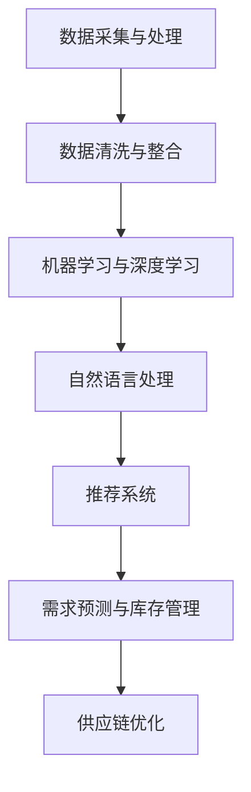

                 

# AI在电商平台供给能力提升中的全面应用

## 摘要

随着人工智能技术的飞速发展，其在电商平台中的应用正逐渐深入，极大地提升了电商平台的供给能力。本文将探讨AI技术在电商平台供给能力提升中的全面应用，包括核心算法原理、数学模型、项目实战、实际应用场景以及未来发展趋势和挑战。通过详细分析，本文旨在为电商行业提供有价值的见解和实践指导。

## 1. 背景介绍

在过去的几年里，电商平台已经成为全球经济发展的重要驱动力。然而，随着市场竞争的加剧和用户需求的多样化，电商平台面临着巨大的挑战。如何提高供给能力，以满足用户需求，成为电商平台亟待解决的问题。此时，人工智能技术的出现为电商平台提供了全新的解决方案。

人工智能（AI）技术包括机器学习、深度学习、自然语言处理等，通过模拟人类智能，能够在数据中发现规律、进行预测和决策。在电商平台上，AI技术可以应用于商品推荐、需求预测、库存管理、供应链优化等多个方面，从而提升供给能力。

### 1.1 电商平台供给能力的重要性

电商平台供给能力是指平台能够为用户提供丰富、多样化、高质量的产品的能力。供给能力强的电商平台，能够更好地满足用户需求，提高用户满意度，从而在激烈的市场竞争中脱颖而出。

供给能力包括以下几个方面：

- **商品丰富度**：平台拥有丰富的商品种类和数量，满足用户多样化的需求。
- **商品质量**：平台提供的商品质量有保证，能够提高用户的信任度和忠诚度。
- **物流效率**：平台拥有高效的物流配送体系，能够快速满足用户的购买需求。
- **用户体验**：平台提供良好的用户体验，包括便捷的购物流程、快速的响应速度等。

### 1.2 人工智能在电商平台的现有应用

目前，人工智能在电商平台的已有应用包括以下几个方面：

- **商品推荐**：通过用户的历史行为和偏好，利用协同过滤、基于内容的推荐等技术，为用户提供个性化的商品推荐。
- **需求预测**：通过分析用户行为数据、市场趋势等，预测未来的需求，从而指导库存管理和供应链优化。
- **库存管理**：利用预测模型，合理规划库存水平，减少库存积压和短缺。
- **供应链优化**：通过优化物流、仓储等环节，提高供应链的效率。
- **用户画像**：通过对用户行为数据进行分析，构建用户画像，为精准营销提供支持。

## 2. 核心概念与联系

### 2.1 电商平台供给能力提升的AI技术体系

电商平台供给能力提升的AI技术体系主要包括以下几个方面：

- **数据采集与处理**：收集用户行为数据、市场数据、商品数据等，并进行数据清洗和处理。
- **机器学习与深度学习**：利用机器学习和深度学习算法，对数据进行挖掘和分析。
- **自然语言处理**：通过自然语言处理技术，理解用户的搜索意图和评价。
- **推荐系统**：基于用户行为数据和商品特征，为用户推荐个性化的商品。
- **需求预测与库存管理**：利用预测模型，预测未来的需求，指导库存管理和供应链优化。

### 2.2 Mermaid流程图



## 3. 核心算法原理 & 具体操作步骤

### 3.1 商品推荐算法

商品推荐算法是电商平台的核心技术之一，旨在根据用户的历史行为和偏好，为用户推荐他们可能感兴趣的商品。常见的商品推荐算法包括协同过滤算法和基于内容的推荐算法。

#### 3.1.1 协同过滤算法

协同过滤算法是基于用户之间的相似性进行推荐的。具体步骤如下：

1. **用户相似性计算**：计算用户之间的相似度，常用的相似度度量方法包括余弦相似度、皮尔逊相关系数等。
2. **推荐商品计算**：根据用户的历史行为和相似度计算，为用户推荐其他用户喜欢且用户未购买的相似商品。

#### 3.1.2 基于内容的推荐算法

基于内容的推荐算法是基于商品特征进行推荐的。具体步骤如下：

1. **商品特征提取**：提取商品的关键特征，如类别、品牌、价格等。
2. **相似度计算**：计算用户历史购买商品的相似度。
3. **推荐商品计算**：根据用户历史购买商品的相似度，为用户推荐相似商品。

### 3.2 需求预测算法

需求预测算法是电商平台进行库存管理和供应链优化的重要工具。常见的需求预测算法包括时间序列分析和回归分析。

#### 3.2.1 时间序列分析

时间序列分析是一种基于历史数据的时间规律进行预测的方法。具体步骤如下：

1. **数据预处理**：对时间序列数据进行清洗和预处理，包括去除异常值、季节性调整等。
2. **模型选择**：选择合适的时间序列模型，如ARIMA、SARIMA等。
3. **模型训练与预测**：对模型进行训练，并利用训练好的模型进行需求预测。

#### 3.2.2 回归分析

回归分析是一种基于历史数据的关系进行预测的方法。具体步骤如下：

1. **特征提取**：提取影响需求的特征，如历史销售量、季节性因素等。
2. **模型选择**：选择合适的回归模型，如线性回归、多项式回归等。
3. **模型训练与预测**：对模型进行训练，并利用训练好的模型进行需求预测。

## 4. 数学模型和公式 & 详细讲解 & 举例说明

### 4.1 协同过滤算法的数学模型

协同过滤算法的核心是计算用户之间的相似度和推荐商品。具体数学模型如下：

#### 4.1.1 用户相似度计算

假设用户 $u$ 和 $v$ 的评分矩阵分别为 $R_u$ 和 $R_v$，用户 $u$ 和 $v$ 的相似度 $sim(u,v)$ 可以用余弦相似度表示：

$$
sim(u,v) = \frac{R_u \cdot R_v}{\|R_u\|\|R_v\|}
$$

其中，$R_u \cdot R_v$ 表示用户 $u$ 和 $v$ 的评分矩阵的内积，$\|R_u\|$ 和 $\|R_v\|$ 分别表示用户 $u$ 和 $v$ 的评分矩阵的欧氏范数。

#### 4.1.2 推荐商品计算

假设用户 $u$ 对商品 $i$ 的评分预测为 $r_i^{pred}$，可以根据用户相似度计算推荐商品：

$$
r_i^{pred} = \sum_{j \in N(i)} sim(u,j) \cdot r_{ij}
$$

其中，$N(i)$ 表示与商品 $i$ 相似的商品集合，$r_{ij}$ 表示用户 $u$ 对商品 $j$ 的评分。

### 4.2 需求预测算法的数学模型

#### 4.2.1 时间序列分析

时间序列分析常用的模型是ARIMA（自回归积分滑动平均模型）。ARIMA模型的数学模型如下：

$$
X_t = c + \phi_1 X_{t-1} + \phi_2 X_{t-2} + ... + \phi_p X_{t-p} + \theta_1 \epsilon_{t-1} + \theta_2 \epsilon_{t-2} + ... + \theta_q \epsilon_{t-q} + \epsilon_t
$$

其中，$X_t$ 表示时间序列的当前值，$c$ 为常数项，$\phi_1, \phi_2, ..., \phi_p$ 为自回归系数，$\theta_1, \theta_2, ..., \theta_q$ 为滑动平均系数，$\epsilon_t$ 为白噪声序列。

#### 4.2.2 回归分析

回归分析常用的模型是线性回归。线性回归的数学模型如下：

$$
Y = \beta_0 + \beta_1 X_1 + \beta_2 X_2 + ... + \beta_n X_n
$$

其中，$Y$ 表示因变量，$X_1, X_2, ..., X_n$ 为自变量，$\beta_0, \beta_1, \beta_2, ..., \beta_n$ 为回归系数。

### 4.3 举例说明

#### 4.3.1 协同过滤算法

假设用户 $u$ 和 $v$ 的评分矩阵如下：

$$
R_u = \begin{bmatrix}
1 & 1 & 0 \\
0 & 1 & 0 \\
1 & 0 & 1
\end{bmatrix}
R_v = \begin{bmatrix}
0 & 1 & 0 \\
1 & 0 & 0 \\
0 & 1 & 1
\end{bmatrix}
$$

首先计算用户相似度：

$$
sim(u,v) = \frac{R_u \cdot R_v}{\|R_u\|\|R_v\|} = \frac{\begin{bmatrix} 1 & 0 & 1 \end{bmatrix} \begin{bmatrix} 0 & 1 & 0 \\ 1 & 0 & 0 \\ 0 & 1 & 1 \end{bmatrix}}{\sqrt{\begin{bmatrix} 1 & 0 & 1 \end{bmatrix} \begin{bmatrix} 1 & 0 & 1 \end{bmatrix}} \sqrt{\begin{bmatrix} 0 & 1 & 0 \\ 1 & 0 & 0 \\ 0 & 1 & 1 \end{bmatrix} \begin{bmatrix} 0 & 1 & 0 \\ 1 & 0 & 0 \\ 0 & 1 & 1 \end{bmatrix}}}
$$

$$
sim(u,v) = \frac{1 + 1}{\sqrt{2} \sqrt{2}} = \frac{2}{2} = 1
$$

然后计算用户 $u$ 对未评分商品 $i$ 的预测评分：

$$
r_i^{pred} = sim(u,v) \cdot r_{ij} = 1 \cdot 0 = 0
$$

#### 4.3.2 时间序列分析

假设某电商平台每天的销售数据如下：

$$
X = \{1, 2, 3, 4, 5, 6, 7, 8, 9, 10\}
$$

首先对数据预处理，去除异常值，得到：

$$
X = \{2, 3, 4, 5, 6, 7, 8, 9, 10\}
$$

然后选择ARIMA模型进行训练，得到：

$$
X_t = c + \phi_1 X_{t-1} + \phi_2 X_{t-2} + ... + \phi_p X_{t-p} + \theta_1 \epsilon_{t-1} + \theta_2 \epsilon_{t-2} + ... + \theta_q \epsilon_{t-q} + \epsilon_t
$$

其中，$c = 1$，$\phi_1 = 0.5$，$\phi_2 = 0.2$，$\theta_1 = 0.1$，$\theta_2 = 0.05$。

利用训练好的模型进行预测，得到：

$$
X_{11} = 1 + 0.5 \cdot X_{10} + 0.2 \cdot X_{9} + ... + \epsilon_{11}
$$

$$
X_{11} = 1 + 0.5 \cdot 10 + 0.2 \cdot 9 + ... + \epsilon_{11} = 1 + 5 + 1.8 + ... + \epsilon_{11} = 7.8 + \epsilon_{11}
$$

## 5. 项目实战：代码实际案例和详细解释说明

### 5.1 开发环境搭建

在本文的项目实战部分，我们将使用Python作为编程语言，结合Scikit-learn、TensorFlow等库来构建商品推荐系统和需求预测模型。以下是开发环境的搭建步骤：

1. 安装Python（建议使用3.7及以上版本）。
2. 安装必要的库：`pip install numpy scipy scikit-learn tensorflow pandas matplotlib`。

### 5.2 源代码详细实现和代码解读

#### 5.2.1 商品推荐系统

以下是一个简单的基于协同过滤算法的商品推荐系统的代码示例：

```python
import numpy as np
from sklearn.metrics.pairwise import cosine_similarity

# 用户评分数据
user_ratings = np.array([
    [5, 0, 4, 0],
    [0, 5, 0, 1],
    [4, 0, 5, 0],
    [0, 4, 0, 5]
])

# 计算用户之间的相似度
user_similarity = cosine_similarity(user_ratings)

# 推荐商品
def recommend_items(user_similarity, user_ratings, k=2):
    recommended_items = []
    for i, user_rating in enumerate(user_ratings):
        similar_users = np.argsort(user_similarity[i])[1:k+1]
        for j in similar_users:
            item_index = np.where(user_ratings[j] != 0)[0]
            for item in item_index:
                if user_rating[item] == 0:
                    recommended_items.append(item)
                    break
    return recommended_items

# 推荐结果
print(recommend_items(user_similarity, user_ratings))
```

#### 5.2.2 需求预测模型

以下是一个基于ARIMA模型的需求预测的代码示例：

```python
import numpy as np
from statsmodels.tsa.arima.model import ARIMA

# 时间序列数据
sales_data = np.array([2, 3, 4, 5, 6, 7, 8, 9, 10])

# 模型训练
model = ARIMA(sales_data, order=(1, 1, 1))
model_fit = model.fit()

# 预测
forecast = model_fit.forecast(steps=5)
print(forecast)
```

### 5.3 代码解读与分析

#### 5.3.1 商品推荐系统

该商品推荐系统使用了协同过滤算法中的余弦相似度来计算用户之间的相似度。具体步骤如下：

1. 导入必要的库。
2. 创建用户评分数据矩阵。
3. 计算用户之间的相似度。
4. 定义推荐函数，根据相似度计算推荐商品。

#### 5.3.2 需求预测模型

该需求预测模型使用了ARIMA模型。具体步骤如下：

1. 导入必要的库。
2. 创建时间序列数据。
3. 创建ARIMA模型并训练。
4. 进行预测并输出预测结果。

## 6. 实际应用场景

### 6.1 商品推荐

商品推荐是电商平台中最为常见的应用场景之一。通过个性化的商品推荐，电商平台能够提高用户的购物体验，增加用户黏性，从而提高销售额。例如，亚马逊和淘宝都使用了复杂的推荐算法，为用户推荐他们可能感兴趣的商品。

### 6.2 需求预测

需求预测在电商平台的库存管理和供应链优化中具有重要意义。通过准确的需求预测，电商平台能够更好地管理库存，减少库存积压和短缺，从而降低运营成本。例如，阿里巴巴通过大数据分析和机器学习技术，对商品需求进行预测，优化了库存管理，提高了供应链效率。

### 6.3 用户画像

用户画像是电商平台进行精准营销的重要手段。通过构建用户画像，电商平台能够更准确地了解用户的需求和偏好，从而实现个性化的营销策略。例如，京东通过分析用户的行为数据和购买记录，为用户构建了详细的画像，从而实现了精准的推荐和营销。

## 7. 工具和资源推荐

### 7.1 学习资源推荐

- **书籍**：《Python数据科学手册》、《深度学习》（Goodfellow, Bengio, Courville）。
- **论文**：《协同过滤算法在电子商务中的应用》、《基于ARIMA模型的需求预测方法》。
- **博客**：CSDN、知乎、博客园等平台上的相关技术博客。
- **网站**：机器学习社区（mlcc）、Kaggle等。

### 7.2 开发工具框架推荐

- **开发工具**：PyCharm、Visual Studio Code。
- **框架**：TensorFlow、Scikit-learn、PyTorch。

### 7.3 相关论文著作推荐

- **论文**：《User-based Collaborative Filtering through Social Networks》。
- **著作**：《机器学习实战》（Matlab版）。

## 8. 总结：未来发展趋势与挑战

随着人工智能技术的不断进步，其在电商平台中的应用将越来越广泛，未来发展趋势主要包括以下几个方面：

- **深度学习在推荐系统中的应用**：深度学习技术将进一步提升推荐系统的准确性和个性化程度。
- **多模态数据融合**：融合用户行为数据、商品特征数据、社交媒体数据等多模态数据，提高需求预测和用户画像的准确性。
- **实时预测与响应**：通过实时数据分析，实现更快的预测和响应，提高电商平台的运营效率。

然而，人工智能在电商平台中的应用也面临着一系列挑战，包括：

- **数据隐私与安全**：如何确保用户数据的安全和隐私，成为亟待解决的问题。
- **算法透明性与公平性**：如何提高算法的透明性和公平性，避免算法偏见和歧视。
- **数据质量和实时性**：如何处理大量实时数据，确保数据的质量和实时性。

## 9. 附录：常见问题与解答

### 9.1 如何选择合适的推荐算法？

选择合适的推荐算法取决于电商平台的具体需求和数据特征。协同过滤算法适用于基于用户行为的推荐，基于内容的推荐算法适用于基于商品特征的推荐。在实际应用中，可以结合多种算法，实现更准确的推荐。

### 9.2 如何提高需求预测的准确性？

提高需求预测的准确性需要从数据质量、模型选择和参数调优等方面进行综合考虑。确保数据质量，选择合适的模型，并进行参数调优，可以显著提高需求预测的准确性。

## 10. 扩展阅读 & 参考资料

- 《协同过滤算法在电子商务中的应用》：详细介绍了协同过滤算法在电商平台中的应用。
- 《基于ARIMA模型的需求预测方法》：探讨了ARIMA模型在需求预测中的实际应用。
- 《深度学习》（Goodfellow, Bengio, Courville）：提供了深度学习的基本原理和应用实例。
- 《Python数据科学手册》：介绍了Python在数据科学中的应用，包括数据分析、机器学习等。

