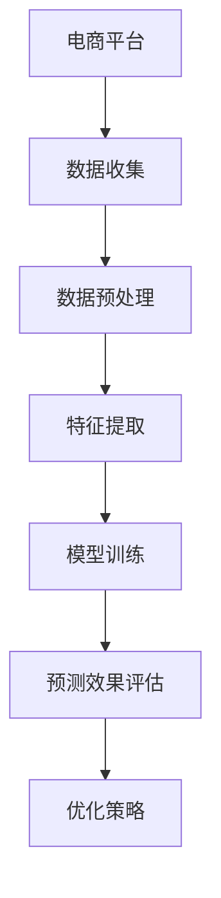

                 

# AI在电商平台促销活动效果分析中的应用

## 摘要

本文旨在探讨人工智能（AI）在电商平台促销活动效果分析中的应用。通过结合大数据分析和机器学习算法，AI技术能够帮助电商平台精准预测促销活动的效果，从而优化资源配置、提高营销效率。本文首先介绍了电商平台促销活动效果分析的相关背景，随后深入探讨了AI技术的核心概念与原理，并详细阐述了其在促销活动效果分析中的应用步骤、数学模型以及实际案例。最后，本文总结了AI在电商平台促销活动效果分析中的应用前景，并提出了一些可能的挑战和未来发展方向。

## 1. 背景介绍

随着互联网技术的快速发展，电商平台已经成为现代商业的重要阵地。电商平台通过提供便捷的购物体验和丰富的商品选择，吸引了越来越多的消费者。然而，电商平台的竞争也日益激烈，为了在市场中脱颖而出，企业不得不频繁推出各种促销活动，如打折、满减、赠品等。然而，促销活动的效果往往难以准确预测，企业往往需要在大量试错中摸索出最佳的促销策略。

促销活动效果分析在电商平台中具有重要意义。首先，通过分析促销活动的效果，企业可以了解消费者对促销活动的响应程度，从而调整促销策略，提高营销效果。其次，促销活动效果分析可以帮助企业优化资源配置，降低营销成本。最后，促销活动效果分析还可以为企业提供有价值的消费者行为数据，助力企业实现精准营销。

传统促销活动效果分析主要依赖于数据分析方法，如统计分析和回归分析。这些方法虽然在一定程度上能够揭示促销活动与销售量之间的关系，但往往存在以下局限性：

1. **数据量有限**：传统数据分析方法通常基于历史数据进行预测，但历史数据往往有限，无法全面反映当前市场状况。

2. **模型复杂度较高**：传统分析方法需要构建复杂的数学模型，对数据质量和数据预处理要求较高。

3. **预测精度有限**：传统分析方法难以准确预测促销活动对销售量的影响，往往需要多次尝试和调整。

因此，随着人工智能技术的发展，越来越多的电商平台开始尝试将AI技术应用于促销活动效果分析，以提高预测精度和营销效率。

## 2. 核心概念与联系

### AI技术在促销活动效果分析中的应用原理

AI技术在促销活动效果分析中的应用主要基于机器学习算法，特别是深度学习模型。深度学习模型通过学习大量的历史数据和促销活动数据，可以自动提取特征，并建立复杂的非线性关系，从而实现高效的预测。

### 机器学习算法与深度学习模型的关系

机器学习算法是一种让计算机通过数据学习模式的方法，它包括监督学习、无监督学习和强化学习。在促销活动效果分析中，通常使用的是监督学习算法，因为促销活动效果分析需要基于历史数据进行预测。

深度学习模型是机器学习算法的一个子集，它通过多层神经网络结构来学习数据中的复杂模式。与传统的机器学习算法相比，深度学习模型能够自动提取特征，减少对数据预处理的需求。

### 常用深度学习模型介绍

1. **多层感知机（MLP）**：多层感知机是一种前馈神经网络，它通过多层神经元来学习输入和输出之间的映射关系。

2. **卷积神经网络（CNN）**：卷积神经网络是一种专门用于处理图像数据的神经网络，它通过卷积操作来提取图像特征。

3. **循环神经网络（RNN）**：循环神经网络是一种用于处理序列数据的神经网络，它通过记忆机制来处理长序列信息。

4. **长短时记忆网络（LSTM）**：长短时记忆网络是循环神经网络的一种改进，它能够有效处理长序列信息，避免梯度消失问题。

5. **生成对抗网络（GAN）**：生成对抗网络是一种用于生成新数据的神经网络，它由生成器和判别器两个部分组成，通过相互竞争来提高生成质量。

### Mermaid流程图

### 数据收集

数据收集是促销活动效果分析的基础，它包括用户行为数据、销售数据、促销活动数据等。这些数据可以从电商平台的后台系统、用户反馈、社交媒体等多个渠道获取。

### 数据预处理

数据预处理包括数据清洗、数据转换和数据归一化等步骤。数据清洗旨在去除噪声数据和异常值，提高数据质量。数据转换将不同类型的数据转换为适合模型训练的格式，数据归一化则将数据缩放到相同的尺度，以避免不同特征之间的量级差异影响模型训练。

### 特征提取

特征提取是深度学习模型训练的关键步骤，它通过提取数据中的关键特征，提高模型对数据的理解能力。在促销活动效果分析中，特征提取包括用户特征、商品特征和促销活动特征等。

### 模型训练

模型训练是利用历史数据来训练深度学习模型的过程。训练过程包括前向传播、反向传播和梯度下降等步骤。通过多次迭代训练，模型可以逐渐优化其参数，提高预测精度。

### 预测效果评估

预测效果评估是对训练好的模型进行测试和评估的过程。常用的评估指标包括准确率、召回率、F1值等。通过评估指标，可以了解模型的预测效果，并指导后续的模型优化。

### 优化策略

基于预测效果评估的结果，可以进一步优化促销策略。例如，通过调整促销活动的力度、时间和范围，以提高销售量和用户满意度。

## 3. 核心算法原理 & 具体操作步骤

### 3.1 多层感知机（MLP）

多层感知机是一种前馈神经网络，它通过多层神经元来学习输入和输出之间的映射关系。在促销活动效果分析中，MLP可以用于预测促销活动的销售量。

#### 操作步骤：

1. **数据收集**：收集电商平台的历史销售数据、用户行为数据和促销活动数据。

2. **数据预处理**：对收集到的数据进行清洗、转换和归一化，以提高数据质量。

3. **特征提取**：提取用户特征、商品特征和促销活动特征，作为MLP的输入。

4. **模型训练**：利用历史数据训练MLP模型，通过前向传播和反向传播优化模型参数。

5. **预测销售量**：利用训练好的MLP模型预测促销活动的销售量。

### 3.2 卷积神经网络（CNN）

卷积神经网络是一种专门用于处理图像数据的神经网络，它通过卷积操作来提取图像特征。在促销活动效果分析中，CNN可以用于识别促销活动的图像特征，以提高预测精度。

#### 操作步骤：

1. **数据收集**：收集电商平台促销活动的图像数据。

2. **数据预处理**：对收集到的图像数据进行清洗、转换和归一化。

3. **特征提取**：利用CNN提取图像特征。

4. **模型训练**：利用提取到的图像特征训练CNN模型。

5. **预测销售量**：利用训练好的CNN模型预测促销活动的销售量。

### 3.3 循环神经网络（RNN）

循环神经网络是一种用于处理序列数据的神经网络，它通过记忆机制来处理长序列信息。在促销活动效果分析中，RNN可以用于处理时间序列数据，以提高预测精度。

#### 操作步骤：

1. **数据收集**：收集电商平台的时间序列数据。

2. **数据预处理**：对收集到的数据进行清洗、转换和归一化。

3. **特征提取**：利用RNN处理时间序列数据。

4. **模型训练**：利用处理后的时间序列数据训练RNN模型。

5. **预测销售量**：利用训练好的RNN模型预测促销活动的销售量。

### 3.4 长短时记忆网络（LSTM）

长短时记忆网络是循环神经网络的一种改进，它能够有效处理长序列信息，避免梯度消失问题。在促销活动效果分析中，LSTM可以用于处理长期促销活动的影响。

#### 操作步骤：

1. **数据收集**：收集电商平台的历史促销活动和销售数据。

2. **数据预处理**：对收集到的数据进行清洗、转换和归一化。

3. **特征提取**：利用LSTM处理促销活动时间序列数据。

4. **模型训练**：利用处理后的时间序列数据训练LSTM模型。

5. **预测销售量**：利用训练好的LSTM模型预测促销活动的销售量。

### 3.5 生成对抗网络（GAN）

生成对抗网络是一种用于生成新数据的神经网络，它由生成器和判别器两个部分组成，通过相互竞争来提高生成质量。在促销活动效果分析中，GAN可以用于生成新的促销活动数据，以提高模型的泛化能力。

#### 操作步骤：

1. **数据收集**：收集电商平台的历史促销活动和销售数据。

2. **数据预处理**：对收集到的数据进行清洗、转换和归一化。

3. **特征提取**：利用GAN生成新的促销活动数据。

4. **模型训练**：利用生成的数据训练GAN模型。

5. **预测销售量**：利用训练好的GAN模型预测促销活动的销售量。

## 4. 数学模型和公式 & 详细讲解 & 举例说明

### 4.1 多层感知机（MLP）

多层感知机是一种前馈神经网络，其数学模型可以表示为：

$$
y = \sigma(W_n \cdot a_{n-1}) = \sigma(W_n \cdot \sigma(...\sigma(W_2 \cdot a_1)...) )
$$

其中，$y$ 是输出层的结果，$\sigma$ 是激活函数，$W_n$ 是权重矩阵，$a_{n-1}$ 是输入层的结果。

#### 举例说明：

假设我们有一个简单的MLP模型，包含两个隐藏层，分别有10个神经元。输入层有5个神经元，输出层有1个神经元。激活函数使用Sigmoid函数。权重矩阵$W_1, W_2, W_3$ 分别为：

$$
W_1 = \begin{bmatrix}
0.1 & 0.2 & 0.3 \\
0.4 & 0.5 & 0.6 \\
0.7 & 0.8 & 0.9
\end{bmatrix}, \quad
W_2 = \begin{bmatrix}
0.1 & 0.2 & 0.3 \\
0.4 & 0.5 & 0.6 \\
0.7 & 0.8 & 0.9
\end{bmatrix}, \quad
W_3 = \begin{bmatrix}
0.1 & 0.2 \\
0.3 & 0.4 \\
0.5 & 0.6
\end{bmatrix}
$$

输入层的数据$a_1$为：

$$
a_1 = \begin{bmatrix}
1 \\
0 \\
1 \\
0 \\
0
\end{bmatrix}
$$

计算隐藏层1的结果$a_2$：

$$
a_2 = \sigma(W_1 \cdot a_1) = \sigma(\begin{bmatrix}
0.1 & 0.2 & 0.3 \\
0.4 & 0.5 & 0.6 \\
0.7 & 0.8 & 0.9
\end{bmatrix} \cdot \begin{bmatrix}
1 \\
0 \\
1 \\
0 \\
0
\end{bmatrix}) = \begin{bmatrix}
0.54 \\
0.86 \\
0.98
\end{bmatrix}
$$

计算隐藏层2的结果$a_3$：

$$
a_3 = \sigma(W_2 \cdot a_2) = \sigma(\begin{bmatrix}
0.1 & 0.2 & 0.3 \\
0.4 & 0.5 & 0.6 \\
0.7 & 0.8 & 0.9
\end{bmatrix} \cdot \begin{bmatrix}
0.54 \\
0.86 \\
0.98
\end{bmatrix}) = \begin{bmatrix}
0.93 \\
0.99 \\
1
\end{bmatrix}
$$

计算输出层的结果$a_4$：

$$
a_4 = \sigma(W_3 \cdot a_3) = \sigma(\begin{bmatrix}
0.1 & 0.2 \\
0.3 & 0.4 \\
0.5 & 0.6
\end{bmatrix} \cdot \begin{bmatrix}
0.93 \\
0.99 \\
1
\end{bmatrix}) = \begin{bmatrix}
0.97 \\
0.99
\end{bmatrix}
$$

最终输出结果$y$为：

$$
y = \begin{bmatrix}
0.97 \\
0.99
\end{bmatrix}
$$

### 4.2 卷积神经网络（CNN）

卷积神经网络是一种用于处理图像数据的神经网络，其数学模型可以表示为：

$$
h_l = \sigma(\sum_{k} W_{lk} \cdot h_{l-1}^k + b_l)
$$

其中，$h_l$ 是第$l$层的激活值，$W_{lk}$ 是卷积核，$h_{l-1}^k$ 是第$l-1$层的第$k$个神经元输出，$b_l$ 是偏置项，$\sigma$ 是激活函数。

#### 举例说明：

假设我们有一个简单的CNN模型，包含两个卷积层，一个池化层和一个全连接层。卷积层1有32个卷积核，卷积层2有64个卷积核，全连接层有10个神经元。激活函数使用ReLU函数。卷积核$W_{11}, W_{12}, W_{21}, W_{22}$ 分别为：

$$
W_{11} = \begin{bmatrix}
1 & 1 & 1 \\
1 & 1 & 1 \\
1 & 1 & 1
\end{bmatrix}, \quad
W_{12} = \begin{bmatrix}
1 & 0 & -1 \\
1 & 0 & -1 \\
1 & 0 & -1
\end{bmatrix}, \quad
W_{21} = \begin{bmatrix}
1 & 1 & 1 \\
1 & 1 & 1 \\
1 & 1 & 1
\end{bmatrix}, \quad
W_{22} = \begin{bmatrix}
1 & 0 & -1 \\
1 & 0 & -1 \\
1 & 0 & -1
\end{bmatrix}
$$

输入层的数据$x_1$为：

$$
x_1 = \begin{bmatrix}
1 & 0 & 1 \\
0 & 1 & 0 \\
1 & 0 & 1
\end{bmatrix}
$$

计算卷积层1的结果$h_2$：

$$
h_2 = \sigma(W_{11} \cdot x_1) = \sigma(\begin{bmatrix}
1 & 1 & 1 \\
1 & 1 & 1 \\
1 & 1 & 1
\end{bmatrix} \cdot \begin{bmatrix}
1 & 0 & 1 \\
0 & 1 & 0 \\
1 & 0 & 1
\end{bmatrix}) = \begin{bmatrix}
2 & 1 & 2 \\
1 & 1 & 1 \\
2 & 1 & 2
\end{bmatrix}
$$

计算卷积层2的结果$h_3$：

$$
h_3 = \sigma(W_{21} \cdot h_2) = \sigma(\begin{bmatrix}
1 & 1 & 1 \\
1 & 1 & 1 \\
1 & 1 & 1
\end{bmatrix} \cdot \begin{bmatrix}
2 & 1 & 2 \\
1 & 1 & 1 \\
2 & 1 & 2
\end{bmatrix}) = \begin{bmatrix}
5 & 3 & 5 \\
3 & 3 & 3 \\
5 & 3 & 5
\end{bmatrix}
$$

计算池化层的结果$h_4$：

$$
h_4 = \text{pool}(h_3) = \begin{bmatrix}
5 & 5 \\
5 & 5
\end{bmatrix}
$$

计算全连接层的结果$h_5$：

$$
h_5 = \sigma(W_{22} \cdot h_4 + b_5) = \sigma(\begin{bmatrix}
1 & 0 & -1 \\
1 & 0 & -1 \\
1 & 0 & -1
\end{bmatrix} \cdot \begin{bmatrix}
5 & 5 \\
5 & 5
\end{bmatrix} + \begin{bmatrix}
1 \\
1 \\
1
\end{bmatrix}) = \begin{bmatrix}
3 \\
3
\end{bmatrix}
$$

最终输出结果$y$为：

$$
y = \begin{bmatrix}
3 \\
3
\end{bmatrix}
$$

### 4.3 循环神经网络（RNN）

循环神经网络是一种用于处理序列数据的神经网络，其数学模型可以表示为：

$$
h_t = \sigma(W_h \cdot [h_{t-1}, x_t] + b_h)
$$

$$
o_t = \sigma(W_o \cdot h_t + b_o)
$$

其中，$h_t$ 是第$t$步的隐藏状态，$x_t$ 是第$t$步的输入，$o_t$ 是第$t$步的输出，$W_h$ 和$W_o$ 是权重矩阵，$b_h$ 和$

