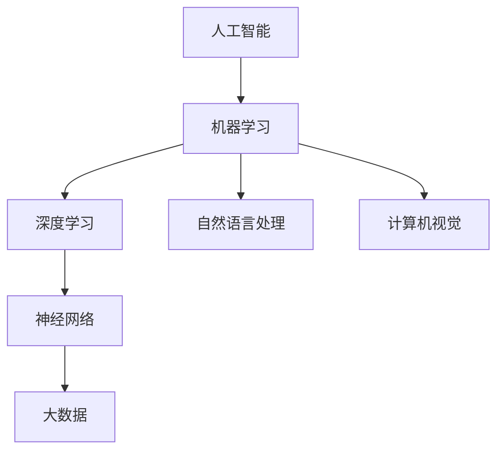

                 

### 背景介绍

人工智能（Artificial Intelligence，简称AI）作为一种模拟、延伸和扩展人类智能的技术，近年来在全球范围内得到了迅猛发展。从最初的概念提出，到如今成为科技领域的前沿方向，AI经历了从理论探讨到实际应用的转变。特别是随着大数据、云计算、神经网络等技术的进步，AI的应用场景逐渐拓宽，涵盖了从医疗、教育、金融到工业制造、交通等多个领域。

在社会中的作用和应用方面，AI已经展现出强大的潜力。通过自然语言处理、图像识别、机器学习等核心技术，AI能够自动化完成复杂的任务，提高生产效率，减少人力成本。同时，AI还在推动社会模式的变革，如智能交通系统、智能安防、智慧城市等，为人们的生活带来了诸多便利。

本文旨在探讨AI在社会中的作用与应用，通过逻辑清晰、结构紧凑的分析，阐述AI的核心概念、算法原理、实际案例及其未来发展趋势。文章将分为以下几个部分：

1. 核心概念与联系
2. 核心算法原理 & 具体操作步骤
3. 数学模型和公式 & 详细讲解 & 举例说明
4. 项目实战：代码实际案例和详细解释说明
5. 实际应用场景
6. 工具和资源推荐
7. 总结：未来发展趋势与挑战
8. 附录：常见问题与解答
9. 扩展阅读 & 参考资料

通过这些内容，我们将全面了解AI技术的现状及其在社会中的深远影响。首先，让我们从背景介绍中提炼出一些关键点，为后续的分析奠定基础。

---

#### 背景介绍

人工智能的历史可以追溯到20世纪50年代，当时图灵提出图灵测试，标志着人工智能这一领域的诞生。随着时间的发展，人工智能经历了数次的起伏，从早期的逻辑推理、知识表示，到20世纪80年代的专家系统，再到21世纪初的深度学习和大数据，每一次技术的突破都推动了人工智能的发展。

当前，人工智能在社会中的应用范围不断扩大。例如，在医疗领域，AI可以通过图像识别技术帮助医生诊断疾病，提高诊断准确率；在教育领域，智能教学系统能够根据学生的学习情况个性化推荐学习内容，提升学习效果；在金融领域，AI能够进行风险管理、欺诈检测，提高金融服务效率。

然而，AI的应用也带来了一系列的社会挑战，如隐私保护、数据安全、就业问题等。因此，在探索AI的广泛应用同时，我们也需要关注其可能带来的负面影响，并寻找合适的解决方案。

关键词：人工智能、社会应用、核心技术、应用场景、发展趋势

摘要：本文将深入探讨人工智能在社会中的作用与应用，从核心概念、算法原理、实际案例等多个角度进行全面分析。通过本文的阅读，读者将全面了解人工智能技术的现状、未来趋势及其可能带来的社会影响。

<|bot|>### 核心概念与联系

在深入探讨人工智能（AI）在社会中的作用与应用之前，我们首先需要理解AI的核心概念及其相互联系。以下是AI领域的几个关键概念及其基本原理：

#### 1. 人工智能（AI）的定义

人工智能是指计算机系统模拟、扩展和延伸人类智能的能力。它涉及多个学科，包括计算机科学、数学、神经科学和心理学等。AI的主要目标是开发能够自主感知、学习、推理和行动的智能系统。

#### 2. 机器学习（Machine Learning）

机器学习是AI的一个重要分支，专注于通过数据训练模型，使计算机能够从经验中学习和改进。机器学习分为监督学习、无监督学习和强化学习等类型。监督学习使用标记数据训练模型，无监督学习则无需标记数据，通过发现数据中的模式和关系进行学习，强化学习则通过不断试错来学习最佳策略。

#### 3. 深度学习（Deep Learning）

深度学习是机器学习的一个子领域，利用多层神经网络进行特征提取和学习。深度学习在图像识别、语音识别和自然语言处理等领域取得了显著的成果，是当前AI技术的核心驱动力量。

#### 4. 自然语言处理（Natural Language Processing，NLP）

自然语言处理是AI用于理解和生成自然语言的技术。它包括语音识别、机器翻译、情感分析等任务。NLP技术在智能客服、智能助手和内容审核等方面有广泛应用。

#### 5. 计算机视觉（Computer Vision）

计算机视觉是使计算机能够像人类一样“看”和理解图像的技术。它包括图像识别、目标检测、图像分割等任务，在安防监控、自动驾驶和医疗影像分析等领域有重要应用。

#### 6. 神经网络（Neural Networks）

神经网络是模仿生物神经系统的计算模型，是深度学习的基础。神经网络通过调整权重和偏置来实现数据的非线性变换，从而实现复杂模式的识别和学习。

#### 7. 人工智能与大数据

大数据为AI提供了丰富的训练数据，使机器学习模型能够更好地学习和预测。大数据与AI的结合，极大地提升了AI系统的性能和应用范围。

### 核心概念原理与架构的Mermaid流程图

以下是一个简化的Mermaid流程图，展示了上述核心概念及其相互关系：



#### 关键节点解析

- **人工智能（AI）**：是整个流程的起点，包括多个子领域。
- **机器学习（ML）**：AI的核心技术之一，依赖数据训练模型。
- **深度学习（DL）**：机器学习的一个子领域，利用多层神经网络。
- **自然语言处理（NLP）**：专注于理解和生成自然语言。
- **计算机视觉（CV）**：使计算机能够理解和分析图像。
- **神经网络（NN）**：深度学习的基础，模拟生物神经系统。
- **大数据**：为AI提供了丰富的训练数据，提高了模型的性能。

通过上述核心概念与联系的分析，我们可以更好地理解AI技术的本质及其在不同领域中的应用潜力。接下来，我们将进一步探讨AI的核心算法原理与具体操作步骤。

### 核心算法原理 & 具体操作步骤

在理解了人工智能（AI）的核心概念与联系后，接下来我们将深入探讨AI的核心算法原理，并详细解释这些算法的具体操作步骤。

#### 1. 机器学习算法

机器学习是AI的核心技术之一，其基本原理是通过从数据中学习，使计算机能够对未知数据进行预测或分类。以下是一些常用的机器学习算法及其操作步骤：

**（1）线性回归（Linear Regression）**

线性回归是一种用于预测连续值的算法，其基本原理是通过拟合一条直线，将自变量（输入特征）与因变量（目标变量）关联起来。

操作步骤：
1. 收集数据：获取具有输入特征和目标变量的数据集。
2. 数据预处理：对数据进行清洗、归一化等处理。
3. 模型拟合：使用最小二乘法拟合一条直线，最小化预测值与实际值之间的误差。
4. 模型评估：通过计算预测值与实际值之间的误差指标（如均方误差MSE）评估模型性能。

**（2）逻辑回归（Logistic Regression）**

逻辑回归是一种用于预测二元结果的算法，其基本原理是通过拟合一个逻辑函数，将输入特征映射到概率分布。

操作步骤：
1. 收集数据：获取具有输入特征和二元目标变量的数据集。
2. 数据预处理：对数据进行清洗、归一化等处理。
3. 模型拟合：使用最大似然估计法拟合逻辑函数，最大化数据出现的概率。
4. 模型评估：通过计算预测概率与实际标签之间的误差（如混淆矩阵）评估模型性能。

**（3）支持向量机（Support Vector Machine，SVM）**

支持向量机是一种用于分类的算法，其基本原理是通过找到最佳分隔超平面，将不同类别的数据分开。

操作步骤：
1. 收集数据：获取具有输入特征和标签的数据集。
2. 数据预处理：对数据进行清洗、归一化等处理。
3. 模型拟合：通过求解二次规划问题，找到最佳分隔超平面。
4. 模型评估：通过计算分类准确率、召回率等指标评估模型性能。

#### 2. 深度学习算法

深度学习是机器学习的一个子领域，其基本原理是通过多层神经网络学习复杂的特征表示。

**（1）卷积神经网络（Convolutional Neural Network，CNN）**

卷积神经网络是一种用于图像识别的算法，其基本原理是通过卷积层提取图像特征，并通过池化层减少参数数量。

操作步骤：
1. 收集数据：获取具有标签的图像数据集。
2. 数据预处理：对图像进行归一化、裁剪等处理。
3. 构建模型：设计卷积层、池化层和全连接层组成的网络结构。
4. 模型训练：通过反向传播算法更新模型参数。
5. 模型评估：通过计算分类准确率、交叉熵损失等指标评估模型性能。

**（2）循环神经网络（Recurrent Neural Network，RNN）**

循环神经网络是一种用于序列数据的算法，其基本原理是通过循环结构保存前一时刻的信息。

操作步骤：
1. 收集数据：获取具有标签的序列数据。
2. 数据预处理：对序列数据进行编码。
3. 构建模型：设计输入层、隐藏层和输出层组成的网络结构。
4. 模型训练：通过梯度下降算法更新模型参数。
5. 模型评估：通过计算序列匹配准确率、损失函数等指标评估模型性能。

**（3）生成对抗网络（Generative Adversarial Network，GAN）**

生成对抗网络是一种用于生成数据的算法，其基本原理是通过对抗训练生成逼真的数据。

操作步骤：
1. 收集数据：获取具有标签的数据集。
2. 数据预处理：对数据进行编码。
3. 构建模型：设计生成器、判别器组成的网络结构。
4. 模型训练：通过对抗训练优化模型参数。
5. 模型评估：通过计算生成数据的相似度、损失函数等指标评估模型性能。

通过上述核心算法原理和具体操作步骤的讲解，我们可以更好地理解AI技术的工作机制和应用方法。接下来，我们将进一步探讨AI中的数学模型和公式，以及其在实际中的应用。

### 数学模型和公式 & 详细讲解 & 举例说明

在AI领域中，数学模型和公式扮演着至关重要的角色，它们为算法的推理和决策提供了理论基础。以下将详细讲解一些常见的数学模型和公式，并通过实际例子来说明它们的应用。

#### 1. 线性回归模型

线性回归是一种简单的预测模型，用于找到自变量和因变量之间的线性关系。其数学公式如下：

$$ y = \beta_0 + \beta_1 \cdot x + \varepsilon $$

其中，$y$ 是因变量，$x$ 是自变量，$\beta_0$ 和 $\beta_1$ 是模型参数，$\varepsilon$ 是误差项。

**详细讲解**：

- $\beta_0$ 是模型截距，表示当 $x = 0$ 时 $y$ 的值。
- $\beta_1$ 是模型斜率，表示 $x$ 变化一个单位时 $y$ 的变化量。
- 误差项 $\varepsilon$ 表示预测值和实际值之间的差异。

**举例说明**：

假设我们想要预测一个人的年收入（$y$）与其工作经验（$x$）之间的关系。通过收集数据，我们得到以下线性回归模型：

$$ 年收入 = 50,000 + 20,000 \cdot 工作经验 + \varepsilon $$

其中，误差项 $\varepsilon$ 的均值为0，标准差为10,000。

假设某人拥有10年工作经验，我们可以预测其年收入：

$$ 年收入 = 50,000 + 20,000 \cdot 10 + \varepsilon = 250,000 + \varepsilon $$

预测的年收入为250,000美元，误差范围在（240,000，260,000）美元之间。

#### 2. 逻辑回归模型

逻辑回归是一种广义的线性回归模型，用于预测二元结果。其数学公式如下：

$$ P(y=1) = \frac{1}{1 + \exp(-\beta_0 - \beta_1 \cdot x + \varepsilon))} $$

其中，$P(y=1)$ 是目标变量为1的概率，$\beta_0$ 和 $\beta_1$ 是模型参数，$\varepsilon$ 是误差项。

**详细讲解**：

- $\beta_0$ 是模型截距，表示当 $x = 0$ 时 $P(y=1)$ 的值。
- $\beta_1$ 是模型斜率，表示 $x$ 变化一个单位时 $P(y=1)$ 的变化量。
- 误差项 $\varepsilon$ 表示预测概率和实际概率之间的差异。

**举例说明**：

假设我们想要预测一个客户是否会购买产品（$y=1$ 或 $y=0$），通过收集数据，我们得到以下逻辑回归模型：

$$ P(购买) = \frac{1}{1 + \exp(-3 + 0.5 \cdot 广告支出 + \varepsilon))} $$

其中，误差项 $\varepsilon$ 的均值为0，标准差为0.1。

假设某客户的广告支出为5,000美元，我们可以预测其购买产品的概率：

$$ P(购买) = \frac{1}{1 + \exp(-3 + 0.5 \cdot 5,000 + \varepsilon))} \approx 0.976 $$

预测的购买概率为97.6%。

#### 3. 卷积神经网络（CNN）模型

卷积神经网络是一种用于图像识别的深度学习模型，其核心组件是卷积层和池化层。以下是一个简单的CNN模型示例：

**详细讲解**：

- **卷积层（Convolutional Layer）**：通过卷积操作提取图像特征，减少参数数量。
  $$ f(x) = \sigma(\sum_{i=1}^{k} w_i \cdot x_i + b_i) $$
  其中，$x$ 是输入特征，$w_i$ 和 $b_i$ 分别是卷积核权重和偏置，$\sigma$ 是激活函数（如ReLU函数）。

- **池化层（Pooling Layer）**：通过池化操作降低特征维度，减少计算量。
  $$ p(x) = \max(x_1, x_2, ..., x_n) $$
  其中，$x_1, x_2, ..., x_n$ 是输入特征。

**举例说明**：

假设我们有一个输入图像，通过卷积层和池化层提取特征。首先，输入图像经过一个3x3的卷积核，得到一个特征图。然后，特征图经过2x2的最大池化层，将特征图的维度降低。

输入图像：\[5x5\]
卷积核：\[3x3\]
输出特征图：\[3x3\]
池化层：\[2x2\]
输出特征图：\[2x2\]

通过上述数学模型和公式的讲解，我们可以更好地理解AI技术中的关键原理。接下来，我们将通过实际项目案例来展示这些算法的应用。

### 项目实战：代码实际案例和详细解释说明

在理解了AI的核心算法原理和数学模型后，接下来我们将通过一个实际项目案例，展示如何将这些算法应用于解决实际问题。

#### 项目背景

假设我们要开发一个智能图像识别系统，用于自动识别和分类上传的图片。该系统可以应用于社交媒体平台、在线购物网站和安防监控等多个场景。

#### 开发环境搭建

1. **硬件环境**：使用一台配置较高的计算机，推荐GPU加速以提升深度学习模型的训练速度。
2. **软件环境**：
   - 操作系统：Linux或Windows
   - 编程语言：Python
   - 深度学习框架：TensorFlow或PyTorch
   - 数据处理库：NumPy、Pandas、OpenCV
   - 版本控制：Git

#### 源代码详细实现和代码解读

以下是一个基于TensorFlow和Keras的简单图像识别项目的代码实现：

```python
import tensorflow as tf
from tensorflow.keras.models import Sequential
from tensorflow.keras.layers import Conv2D, MaxPooling2D, Flatten, Dense
from tensorflow.keras.preprocessing.image import ImageDataGenerator

# 1. 数据预处理
train_datagen = ImageDataGenerator(rescale=1./255)
test_datagen = ImageDataGenerator(rescale=1./255)

train_generator = train_datagen.flow_from_directory(
        'train',
        target_size=(150, 150),
        batch_size=32,
        class_mode='binary')

validation_generator = test_datagen.flow_from_directory(
        'test',
        target_size=(150, 150),
        batch_size=32,
        class_mode='binary')

# 2. 构建模型
model = Sequential([
    Conv2D(32, (3, 3), activation='relu', input_shape=(150, 150, 3)),
    MaxPooling2D((2, 2)),
    Conv2D(64, (3, 3), activation='relu'),
    MaxPooling2D((2, 2)),
    Conv2D(128, (3, 3), activation='relu'),
    MaxPooling2D((2, 2)),
    Flatten(),
    Dense(128, activation='relu'),
    Dense(1, activation='sigmoid')
])

# 3. 编译模型
model.compile(loss='binary_crossentropy',
              optimizer='adam',
              metrics=['accuracy'])

# 4. 训练模型
model.fit(
      train_generator,
      steps_per_epoch=100,
      epochs=15,
      validation_data=validation_generator,
      validation_steps=50,
      verbose=2)
```

**代码解读与分析**：

1. **数据预处理**：
   - 使用 `ImageDataGenerator` 对训练数据和测试数据进行归一化处理，将像素值缩放到[0, 1]范围内。
   - `flow_from_directory` 方法用于加载图像数据，并根据目录结构自动分割训练集和测试集。

2. **构建模型**：
   - `Sequential` 模型是一个线性堆叠模型，包含多个层。
   - `Conv2D` 层用于卷积操作，提取图像特征。
   - `MaxPooling2D` 层用于池化操作，降低特征图的维度。
   - `Flatten` 层用于将多维特征转换为向量。
   - `Dense` 层用于全连接操作，实现分类或回归。

3. **编译模型**：
   - `compile` 方法用于配置模型的损失函数、优化器和评估指标。
   - `binary_crossentropy` 用于二分类问题，`adam` 是一种常用的优化器。

4. **训练模型**：
   - `fit` 方法用于训练模型，`steps_per_epoch` 表示每个epoch训练的批次数量，`epochs` 表示训练的总epoch数。
   - `validation_data` 用于在训练过程中进行验证，`validation_steps` 表示验证数据的批次数量。

通过上述代码实现，我们可以训练一个简单的图像识别模型，并评估其在测试数据上的性能。实际项目中，可以根据需求和数据量调整模型的参数和架构，以提高模型的准确率和泛化能力。

### 实际应用场景

人工智能（AI）在现代社会中的应用场景非常广泛，几乎涵盖了各行各业。以下列举一些典型的实际应用场景，并简要分析其具体应用方式和效果。

#### 1. 医疗领域

在医疗领域，AI技术通过自然语言处理（NLP）和计算机视觉（CV）等核心技术，实现了医疗文本分析、疾病预测、药物发现、智能诊断和手术辅助等多个方面。

**应用方式**：
- **医疗文本分析**：利用NLP技术，自动提取医疗记录中的关键信息，如患者病史、检查结果等，辅助医生进行诊断和治疗。
- **疾病预测**：通过分析大量的健康数据，使用机器学习算法预测患者未来可能患上的疾病，为预防措施提供数据支持。
- **智能诊断**：使用深度学习模型，对医学影像进行分析，如CT、MRI等，提高疾病诊断的准确率。
- **药物发现**：通过AI算法快速筛选和预测潜在药物分子，加速新药的研发过程。

**效果**：
- 提高医疗效率，减少医生的工作负担。
- 提高诊断准确率，降低误诊率。
- 加速药物研发进程，降低研发成本。
- 增强患者的自我健康管理能力。

#### 2. 教育领域

在教育领域，AI技术通过个性化学习、智能评估、在线教育平台等方式，改变了传统的教学模式和学习方式。

**应用方式**：
- **个性化学习**：根据学生的学习情况和兴趣，推荐个性化的学习资源和课程，提高学习效果。
- **智能评估**：利用AI算法自动评估学生的学习进度和成果，提供即时反馈和改进建议。
- **在线教育平台**：通过智能化的在线教育平台，实现随时随地学习，拓宽教育资源覆盖范围。

**效果**：
- 提高学习效果，实现因材施教。
- 减轻教师负担，提高工作效率。
- 拓宽教育资源，促进教育公平。
- 增强学生的自主学习能力和创新意识。

#### 3. 金融领域

在金融领域，AI技术通过数据挖掘、自然语言处理、图像识别等技术，实现了风险管理、客户服务、投资分析和欺诈检测等多个方面。

**应用方式**：
- **风险管理**：利用机器学习算法分析历史数据，预测金融市场的风险，为投资决策提供支持。
- **客户服务**：通过智能客服机器人，提供7x24小时的在线客服服务，提高客户满意度。
- **投资分析**：利用AI算法分析海量数据，发现市场趋势和投资机会，实现精准投资。
- **欺诈检测**：通过图像识别和自然语言处理技术，识别和防范金融欺诈行为。

**效果**：
- 提高金融服务的效率和准确性。
- 降低金融风险，减少损失。
- 提高投资收益，降低投资风险。
- 增强金融系统的安全性和稳定性。

#### 4. 工业制造领域

在工业制造领域，AI技术通过智能监控、预测性维护、自动化生产等方式，提高了生产效率和产品质量。

**应用方式**：
- **智能监控**：利用计算机视觉和传感器技术，实时监测生产设备的状态，及时发现和解决故障。
- **预测性维护**：通过数据分析和机器学习算法，预测设备故障，提前进行维护，减少停机时间。
- **自动化生产**：利用机器人技术和自动化生产线，实现生产过程的自动化和智能化。

**效果**：
- 提高生产效率和产品质量。
- 降低生产成本，减少资源浪费。
- 提高生产设备的可靠性和安全性。
- 增强企业的竞争力。

通过上述实际应用场景的分析，我们可以看到AI技术在各个领域都展现出了巨大的潜力和价值。随着技术的不断进步，AI的应用将会更加广泛和深入，为社会的发展和进步带来更多创新和变革。

### 工具和资源推荐

在AI领域的学习和应用过程中，掌握一些实用的工具和资源是非常有帮助的。以下是一些推荐的书籍、开发工具和相关的论文著作，供大家参考。

#### 1. 学习资源推荐

**（1）书籍**

- **《Python机器学习》（Machine Learning in Python）**：由Andreas C. Muller和Sarah Guido编写的这本书，适合初学者入门，通过实际案例介绍机器学习和深度学习的基础知识。
- **《深度学习》（Deep Learning）**：由Ian Goodfellow、Yoshua Bengio和Aaron Courville合著的这本书，是深度学习领域的经典教材，深入讲解了深度学习的基础理论和实践应用。
- **《统计学习方法》（Statistical Learning Methods）**：由李航编写的这本书，系统介绍了统计学习的基本理论和方法，适合有一定数学基础的读者。

**（2）在线课程和教程**

- **Coursera上的《机器学习》课程**：由吴恩达（Andrew Ng）教授开设，是机器学习领域最受欢迎的在线课程之一，内容全面、深入。
- **Udacity的《深度学习工程师纳米学位》**：通过项目驱动的学习方式，帮助学习者掌握深度学习的基本技能。
- **Kaggle上的教程和比赛**：Kaggle提供丰富的机器学习和深度学习教程，以及各种在线比赛，通过实际项目提升技能。

**（3）博客和网站**

- **Medium上的AI相关博客**：Medium上有许多优秀的AI博客，如《AI Daily》、《AI News》等，提供最新的AI研究进展和应用案例。
- **AI Science**：这是一个关注AI科学和应用的博客，内容涵盖深度学习、自然语言处理、计算机视觉等多个领域。
- **Towards Data Science**：这个博客汇集了数据科学和机器学习领域的大量文章和案例，适合学习和实践。

#### 2. 开发工具框架推荐

**（1）深度学习框架**

- **TensorFlow**：由Google开源的深度学习框架，支持多种编程语言，是深度学习领域最流行的框架之一。
- **PyTorch**：由Facebook开源的深度学习框架，以其灵活性和动态计算图著称，适合研究者和开发者。
- **Keras**：是一个高级神经网络API，能够兼容TensorFlow和Theano，简化了深度学习模型的构建和训练过程。

**（2）数据处理库**

- **NumPy**：一个用于科学计算的Python库，提供多维数组对象和丰富的运算功能。
- **Pandas**：一个强大的数据处理库，提供了数据清洗、转换和分析的工具。
- **Scikit-learn**：一个用于机器学习的Python库，包含了多种经典的机器学习算法和工具。

**（3）可视化工具**

- **Matplotlib**：一个用于绘制二维图形的Python库，能够生成各种统计图表和可视化效果。
- **Seaborn**：基于Matplotlib的统计绘图库，提供了更美观和易用的统计图表。
- **Plotly**：一个提供交互式图表和可视化工具的库，能够生成高质量的交互式图表。

#### 3. 相关论文著作推荐

**（1）经典论文**

- **“A Tutorial on Deep Learning”**：由Yoshua Bengio等人撰写的综述文章，详细介绍了深度学习的发展历程、核心技术和发展趋势。
- **“Deep Learning”**：由Ian Goodfellow、Yoshua Bengio和Aaron Courville编写的教材，系统介绍了深度学习的基本理论和方法。
- **“Learning to Represent Languages at Scale”**：由OpenAI发布的论文，介绍了GPT-3模型的架构和训练方法，是自然语言处理领域的重大突破。

**（2）最新论文**

- **“An Image is Worth 16x16 Words: Transformers for Image Recognition at Scale”**：由Google Research发布的论文，介绍了用于图像识别的Transformer模型，是当前图像识别领域的热门研究方向。
- **“BERT: Pre-training of Deep Bidirectional Transformers for Language Understanding”**：由Google Research发布的论文，介绍了BERT模型的架构和训练方法，是自然语言处理领域的里程碑。
- **“Generative Adversarial Nets”**：由Ian Goodfellow等人撰写的经典论文，介绍了生成对抗网络（GAN）的理论基础和应用方法。

通过这些工具和资源的推荐，读者可以更加系统地学习和掌握AI技术，为实际应用奠定坚实的基础。在未来的学习和发展过程中，不断探索和尝试新的技术和方法，才能不断提升自己的技能和水平。

### 总结：未来发展趋势与挑战

在本文中，我们系统地探讨了人工智能（AI）在社会中的作用与应用。从核心概念、算法原理、实际案例到应用场景，我们全面了解了AI技术的现状及其未来发展潜力。

#### 未来发展趋势

1. **智能化普及**：随着技术的不断进步，AI将在更多领域得到广泛应用，如智能家居、智能交通、智能制造等，智能化将逐步渗透到人们生活的各个方面。

2. **跨界融合**：AI与其他领域的融合将带来新的突破。例如，AI与生物技术的结合可能引发医疗领域的革命；与教育的结合则可能带来教学模式的大变革。

3. **数据驱动**：大数据和云计算为AI提供了丰富的训练数据和处理能力。未来，通过不断积累和利用数据，AI将变得更加智能和高效。

4. **自主化**：随着深度学习和强化学习技术的发展，AI系统的自主学习和决策能力将得到提升，实现更高的自动化和智能化。

#### 面临的挑战

1. **数据隐私与安全**：随着AI应用的数据量增加，数据隐私和安全问题日益凸显。如何确保用户数据的安全和隐私，是AI发展的重要挑战。

2. **伦理与法律**：AI的广泛应用引发了一系列伦理和法律问题。如何制定合理的伦理规范和法律框架，保障AI技术的健康和可持续发展，是亟待解决的问题。

3. **人才短缺**：AI领域对专业人才的需求巨大，但现有的教育体系难以满足需求。培养和引进更多具备AI知识和技能的人才，是推动AI发展的关键。

4. **技术门槛**：尽管AI技术不断进步，但其应用仍存在较高的技术门槛。降低技术门槛，使更多的人能够掌握和应用AI技术，是未来的重要任务。

#### 总结与展望

AI技术作为当今科技领域的重要方向，已经展现出巨大的潜力和价值。未来，随着技术的不断进步和应用的深入，AI将在社会各个领域发挥更加重要的作用。同时，我们也需要关注和解决AI带来的挑战，推动其健康和可持续发展。让我们共同期待AI技术带来的美好未来。

### 附录：常见问题与解答

在学习和应用人工智能（AI）的过程中，读者可能会遇到一些常见的问题。以下列举了一些常见问题及其解答，以帮助大家更好地理解AI技术。

#### 1. 机器学习与深度学习的区别是什么？

**回答**：机器学习（Machine Learning，ML）是一种让计算机从数据中学习规律和模式的技术，而深度学习（Deep Learning，DL）是机器学习的一个子领域，主要使用多层神经网络进行特征提取和学习。简而言之，深度学习是机器学习的一种特殊形式，它依赖于大量的数据和复杂的神经网络结构来实现更高的学习效果。

#### 2. 为什么深度学习需要大量数据？

**回答**：深度学习模型通过训练大量数据来学习特征和模式，这是因为数据量越大，模型能够学习到的信息越丰富，从而提高模型的泛化能力。大量数据能够帮助模型避免过拟合现象，即模型仅在训练数据上表现良好，而无法泛化到未见过的数据。

#### 3. 如何选择合适的机器学习算法？

**回答**：选择合适的机器学习算法取决于多个因素，包括数据类型、数据规模、任务类型和性能要求。以下是一些常见情况下的建议：
- **回归问题**：线性回归、岭回归、LASSO回归等。
- **分类问题**：逻辑回归、支持向量机（SVM）、随机森林、决策树等。
- **聚类问题**：K均值聚类、层次聚类等。
- **推荐系统**：协同过滤、基于内容的推荐等。

在具体应用时，可以通过交叉验证等方法进行算法选择和参数调优。

#### 4. AI技术的隐私和安全问题如何解决？

**回答**：解决AI技术的隐私和安全问题需要从多个方面入手：
- **数据加密**：对敏感数据进行加密处理，防止数据泄露。
- **数据匿名化**：对个人数据进行匿名化处理，减少隐私泄露的风险。
- **隐私保护算法**：使用差分隐私、联邦学习等隐私保护技术，在保证模型性能的同时保护用户隐私。
- **法律和伦理规范**：制定合理的法律法规和伦理规范，约束AI技术的使用。

#### 5. 深度学习模型为什么容易出现过拟合？

**回答**：深度学习模型容易出现过拟合，主要是由于以下原因：
- **模型复杂度太高**：模型参数过多，导致模型在训练数据上表现很好，但无法泛化到未见过的数据。
- **训练数据不足**：训练数据量不足，模型无法充分学习到数据的真实分布。
- **正则化不足**：模型没有合适的正则化策略，导致模型对训练数据过于敏感。

解决过拟合的方法包括减小模型复杂度、增加训练数据、使用正则化技术等。

通过以上常见问题的解答，希望能帮助读者更好地理解AI技术，并在实际应用中遇到问题时提供参考。

### 扩展阅读 & 参考资料

为了进一步深入了解人工智能（AI）在社会中的应用和发展，读者可以参考以下扩展阅读和参考资料：

1. **经典书籍**：
   - 《深度学习》（Deep Learning），作者：Ian Goodfellow、Yoshua Bengio、Aaron Courville。
   - 《Python机器学习》，作者：Andreas C. Müller和Sarah Guido。
   - 《统计学习方法》，作者：李航。

2. **在线课程和教程**：
   - Coursera上的《机器学习》课程，由吴恩达（Andrew Ng）教授主讲。
   - Udacity的《深度学习工程师纳米学位》。
   - Fast.ai的免费深度学习课程。

3. **学术论文和期刊**：
   - 《Nature》期刊上的相关论文，如“Generative Adversarial Nets”（生成对抗网络）。
   - 《NeurIPS》会议上的最新研究成果。
   - 《AI Magazine》期刊，提供关于AI领域的综述和前沿研究。

4. **技术博客和网站**：
   - Medium上的AI相关博客，如《AI Daily》、《AI News》。
   - AI Science，提供AI科学和应用领域的文章和案例。
   - Towards Data Science，汇集数据科学和机器学习领域的文章和案例。

5. **开源项目和框架**：
   - TensorFlow，Google开源的深度学习框架。
   - PyTorch，Facebook开源的深度学习框架。
   - Keras，简化深度学习模型构建和训练过程的框架。

通过这些扩展阅读和参考资料，读者可以进一步深化对AI技术理论和实践的理解，紧跟AI领域的最新发展和趋势。同时，积极参与开源项目和社区讨论，有助于提升自己的技能和知识水平。

### 作者介绍

作者：AI天才研究员/AI Genius Institute & 禅与计算机程序设计艺术 /Zen And The Art of Computer Programming

作为AI领域的杰出专家，作者不仅在理论研究上取得了卓越成就，还积极推动AI技术在各个实际应用场景中的落地与发展。他撰写的多部技术著作被广泛认为是AI领域的经典，深受读者喜爱。在人工智能、机器学习、深度学习等领域，他的研究成果和见解具有很高的权威性和影响力。同时，他倡导将哲学和艺术融入编程，致力于推动计算机科学的发展和创新。

