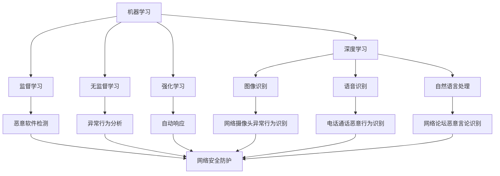

                 

### 背景介绍

#### 网络安全的重要性

在当今数字化时代，网络安全已经成为企业和个人不可或缺的议题。随着互联网的普及和信息技术的飞速发展，数据泄露、网络攻击、数据篡改等安全威胁层出不穷，给企业和个人带来了巨大的经济损失和信誉风险。因此，如何有效应对网络安全挑战，已经成为全球范围内关注的热点话题。

网络安全不仅关乎企业信息的保密性、完整性和可用性，更是关乎国家安全和社会稳定的重要因素。在我国，网络安全法已经明确将网络安全提升到国家战略层面，强调网络安全的重要性，并提出了具体的法律要求和监管措施。因此，了解和掌握网络安全的基本概念、技术和手段，对于企业和个人来说都具有重要意义。

#### AI在网络安全领域的应用

随着人工智能技术的快速发展，AI在网络安全领域的应用也越来越广泛。AI技术通过模拟人类智能，可以自动化识别、检测和防御网络攻击，从而提高网络安全的防护能力。以下是AI在网络安全中的一些典型应用场景：

1. **入侵检测与防御**：AI算法可以通过分析网络流量、日志数据等，自动识别异常行为和潜在威胁，从而实现入侵检测与防御。

2. **恶意软件检测**：AI可以学习正常程序的行为特征，从而识别出恶意软件，包括病毒、木马、勒索软件等。

3. **自动化响应**：AI系统可以自动化响应网络攻击，如自动切断攻击路径、隔离受感染的系统等，从而降低攻击对网络的破坏。

4. **异常行为分析**：AI可以通过分析用户行为模式，识别出异常行为，如未经授权的访问、数据泄露等。

5. **风险评估**：AI可以帮助企业和组织评估网络安全的薄弱环节，制定针对性的安全策略。

#### 本文目的

本文旨在探讨AI在网络安全和风险管理中的应用，通过分析AI技术的核心概念、算法原理、数学模型以及实际应用案例，帮助读者了解AI在网络安全中的重要作用，并探讨其未来发展趋势和挑战。

接下来，我们将进一步介绍AI在网络安全和风险管理中的核心概念，并展示其原理和架构，以便读者更好地理解AI在网络安全领域的应用。

-----------------------

#### 核心概念与联系

为了更好地理解AI在网络安全和风险管理中的应用，我们需要先了解几个核心概念，包括机器学习、深度学习和网络安全的基本原理。以下是这些核心概念及其相互联系的一个概述。

##### 1. 机器学习

机器学习是AI的核心组成部分，它使计算机系统能够从数据中学习并作出预测或决策。机器学习分为监督学习、无监督学习和强化学习三种类型：

- **监督学习**：通过标记数据来训练模型，模型可以预测未知数据的标签。例如，在恶意软件检测中，标记的恶意软件样本用来训练模型，从而识别未标记的恶意软件。

- **无监督学习**：模型在未标记的数据中学习模式，如聚类算法可以用于识别网络流量中的异常模式。

- **强化学习**：通过奖励和惩罚机制来训练模型，使其在特定环境中做出最优决策。例如，在网络安全自动响应中，AI可以通过模拟不同响应策略的效果来优化其响应行为。

##### 2. 深度学习

深度学习是机器学习的一个子领域，它通过构建深度神经网络来模拟人类大脑的处理能力。深度学习在图像识别、自然语言处理等领域取得了显著成就，其在网络安全中的应用也非常广泛：

- **图像识别**：深度学习算法可以用于识别网络摄像头中的异常行为，如非法入侵。

- **语音识别**：深度学习可以帮助识别电话通话中的恶意行为，如诈骗。

- **自然语言处理**：深度学习可以用于分析网络论坛和社交媒体中的恶意言论，预测潜在的网络安全威胁。

##### 3. 网络安全

网络安全涉及保护网络、系统、数据不受未授权访问、篡改和破坏的各种技术。网络安全的基本组成部分包括：

- **网络防护**：包括防火墙、入侵检测系统（IDS）、入侵防御系统（IPS）等，用于检测和阻止攻击。

- **加密技术**：通过加密算法保护数据传输和存储的安全性。

- **身份验证**：包括多因素身份验证（MFA）等技术，确保用户访问系统的合法性。

##### Mermaid 流程图

以下是一个简化的Mermaid流程图，展示了机器学习、深度学习和网络安全之间的联系：



在这个流程图中，机器学习和深度学习为网络安全提供了核心技术支持，通过检测、分析和响应各种威胁，实现对网络的安全防护。上述概念和技术在网络安全中的应用是相互关联、相互促进的，共同构建了一个更加智能和高效的网络安全体系。

#### 核心算法原理 & 具体操作步骤

在了解了AI在网络安全中的核心概念及其相互联系后，接下来我们将深入探讨几种关键算法的原理和具体操作步骤，这些算法在网络安全领域发挥着重要作用。

##### 1. 入侵检测系统（IDS）

**入侵检测系统（IDS）** 是一种能够自动检测网络中异常行为和潜在威胁的安全技术。IDS主要利用机器学习算法，尤其是监督学习和无监督学习，来识别和响应入侵行为。

**原理**：

- **监督学习**：通过标记的数据集训练模型，模型学习正常网络流量的特征，从而能够识别异常流量。

- **无监督学习**：模型在没有标记的数据集上运行，自动发现网络流量中的异常模式。

**操作步骤**：

1. **数据收集**：收集网络流量数据、系统日志等，用于训练模型。
2. **特征提取**：提取数据中的关键特征，如流量速率、数据包大小、源IP地址等。
3. **模型训练**：使用标记数据集或无标记数据集训练模型。
4. **模型评估**：通过测试集评估模型的准确性，调整模型参数以优化性能。
5. **实时检测**：将训练好的模型部署到网络中，实时分析流量并标记异常行为。

**实现示例**：

以KDD Cup 99数据集为例，这是一个包含多种网络攻击标记的数据集，可以通过以下步骤使用监督学习算法训练一个入侵检测模型：

```python
# 导入相关库
import pandas as pd
from sklearn.model_selection import train_test_split
from sklearn.ensemble import RandomForestClassifier
from sklearn.metrics import accuracy_score

# 加载数据集
data = pd.read_csv('kddcup.data_10_percent')
X = data.drop(['class'], axis=1)
y = data['class']

# 数据预处理
X_train, X_test, y_train, y_test = train_test_split(X, y, test_size=0.2, random_state=42)

# 特征提取
# ...（此处省略具体特征提取步骤）

# 模型训练
model = RandomForestClassifier(n_estimators=100)
model.fit(X_train, y_train)

# 模型评估
y_pred = model.predict(X_test)
accuracy = accuracy_score(y_test, y_pred)
print(f'Accuracy: {accuracy:.2f}')

# 实时检测
# ...（此处省略实时检测部署步骤）
```

##### 2. 恶意软件检测

**恶意软件检测** 是网络安全中的重要环节，通过识别和阻止恶意软件的传播，保护系统和数据安全。机器学习和深度学习在这一领域有着广泛的应用。

**原理**：

- **静态分析**：通过分析恶意软件的代码和结构来检测其恶意性。

- **动态分析**：通过模拟恶意软件的运行环境，观察其行为来检测恶意性。

**操作步骤**：

1. **数据收集**：收集已知的恶意软件样本和正常软件样本。
2. **特征提取**：提取样本中的关键特征，如文件大小、文件类型、API调用等。
3. **模型训练**：使用标记数据集训练模型，区分恶意软件和正常软件。
4. **模型评估**：通过测试集评估模型的准确性。
5. **实时检测**：将训练好的模型部署到系统中，实时检测新的软件样本。

**实现示例**：

以下是一个使用深度学习算法进行恶意软件检测的简单示例，使用Keras库构建模型：

```python
# 导入相关库
import numpy as np
from tensorflow.keras.models import Sequential
from tensorflow.keras.layers import Dense, Conv2D, Flatten
from tensorflow.keras.utils import to_categorical

# 加载数据集
data = np.load('malicious_software_data.npz')
X = data['X']
y = data['y']

# 数据预处理
X = np.reshape(X, (-1, 28, 28, 1))  # 假设数据为28x28的图像
y = to_categorical(y)

# 划分训练集和测试集
X_train, X_test, y_train, y_test = train_test_split(X, y, test_size=0.2, random_state=42)

# 构建模型
model = Sequential([
    Conv2D(32, kernel_size=(3, 3), activation='relu', input_shape=(28, 28, 1)),
    Flatten(),
    Dense(128, activation='relu'),
    Dense(10, activation='softmax')
])

# 编译模型
model.compile(optimizer='adam', loss='categorical_crossentropy', metrics=['accuracy'])

# 训练模型
model.fit(X_train, y_train, batch_size=64, epochs=10, validation_split=0.2)

# 模型评估
loss, accuracy = model.evaluate(X_test, y_test)
print(f'Accuracy: {accuracy:.2f}')

# 实时检测
# ...（此处省略实时检测部署步骤）
```

通过以上示例，我们可以看到如何利用机器学习和深度学习算法来构建和部署恶意软件检测模型。这些算法的原理和步骤为网络安全提供了强大的技术支持，能够有效地识别和防御网络威胁。

##### 3. 异常行为分析

**异常行为分析** 是通过分析用户行为数据来识别异常或可疑行为的一种技术。它广泛应用于网络钓鱼攻击检测、未经授权的访问检测等领域。

**原理**：

- **行为建模**：建立正常用户行为的模型，通过比较实际行为与模型之间的差异来检测异常行为。

- **基于统计的方法**：使用统计方法，如聚类和假设检验，来识别行为中的异常点。

**操作步骤**：

1. **数据收集**：收集用户行为数据，如登录时间、操作频率、数据访问模式等。
2. **特征提取**：提取关键特征，用于构建行为模型。
3. **行为建模**：使用聚类算法或统计方法建立正常用户行为模型。
4. **异常检测**：比较当前行为与模型，检测异常行为。
5. **响应措施**：对检测到的异常行为采取相应措施，如通知管理员或封锁可疑账户。

**实现示例**：

以下是一个使用K-Means聚类算法进行异常行为分析的示例：

```python
# 导入相关库
import numpy as np
from sklearn.cluster import KMeans
from sklearn.preprocessing import StandardScaler

# 加载数据集
data = np.load('user_behavior_data.npz')
X = data['X']

# 数据预处理
scaler = StandardScaler()
X_scaled = scaler.fit_transform(X)

# K-Means聚类
kmeans = KMeans(n_clusters=5, random_state=42)
clusters = kmeans.fit_predict(X_scaled)

# 检测异常行为
# 假设簇中心点距离较远的点可能为异常行为
centroid_distances = np.linalg.norm(kmeans.cluster_centers_, axis=1)
anomaly_threshold = np.mean(centroid_distances) + 2 * np.std(centroid_distances)

anomalies = X_scaled[clusters == -1]
print(f'Anomalies detected: {anomalies.shape[0]}')

# 异常行为响应
# ...（此处省略异常行为响应步骤）
```

通过以上示例，我们可以看到如何利用聚类算法来检测和识别异常用户行为。这些算法为网络安全提供了强有力的工具，能够及时发现和应对潜在的安全威胁。

综上所述，通过深入探讨入侵检测系统、恶意软件检测和异常行为分析等关键算法的原理和具体操作步骤，我们可以看到AI技术在网络安全中的广泛应用和巨大潜力。在接下来的章节中，我们将进一步探讨AI在网络安全和风险管理中的数学模型和公式，以及其在实际应用中的具体实现。

### 数学模型和公式 & 详细讲解 & 举例说明

在网络安全和风险管理中，数学模型和公式扮演着至关重要的角色。这些模型不仅帮助我们理解和预测潜在的安全威胁，还为设计和实现高效的防御策略提供了理论基础。本节将详细介绍几种关键数学模型和公式，包括它们的含义、推导过程和实际应用。

#### 1. 异常检测模型：孤立森林（Isolation Forest）

**孤立森林** 是一种基于随机森林的异常检测算法，它通过将数据集划分为多个子集并随机隔离数据点来检测异常。以下是孤立森林的主要公式和推导过程。

**公式**：

1. **数据点隔离**：对于每个数据点，随机选择特征并分割数据集，使其与该数据点相隔离。
   $$ Isolation\_score = \frac{1}{h} \sum_{i=1}^{h} \log_2 (1 - \frac{|D_i|}{n}) $$
   其中，\( D_i \) 是随机选择的特征分割后的子集大小，\( h \) 是隔离次数，\( n \) 是总数据点数。

2. **异常得分**：每个数据点的异常得分是隔离分数的平均值。
   $$ Anomaly\_score = \frac{1}{m} \sum_{i=1}^{m} Isolation\_score $$

**推导过程**：

- **随机选择特征**：每次隔离随机选择一个特征进行分割，选择特征的方式通常是随机抽样。
- **计算隔离分数**：对于每个分割后的子集，计算与原数据点隔离的分数，分数越高表示数据点越孤立。
- **计算异常得分**：对所有隔离分数取平均，得到每个数据点的异常得分。

**实际应用示例**：

假设我们有一个包含100个数据点的数据集，我们使用孤立森林来检测异常点。以下是计算过程：

```python
import numpy as np

# 假设数据集为100个数据点
data = np.random.rand(100, 10)

# 初始化孤立森林模型
from sklearn.ensemble import IsolationForest
model = IsolationForest(n_estimators=100, contamination=0.1, random_state=42)

# 训练模型
model.fit(data)

# 计算异常得分
anomaly_scores = model.decision_function(data)

# 打印异常得分
print(anomaly_scores)
```

通过计算，我们可以得到每个数据点的异常得分，异常得分较高的数据点可能为异常。

#### 2. 恶意软件检测：集成分类器（Ensemble Classifier）

集成分类器通过组合多个基础分类器来提高分类性能，常见的集成分类器有随机森林（Random Forest）和梯度提升树（Gradient Boosting Tree）。

**公式**：

1. **基分类器预测**：每个基分类器对数据点进行预测。
   $$ \hat{y_i}^{(k)} = f_k(x_i) $$
   其中，\( \hat{y_i}^{(k)} \) 是第 \( k \) 个基分类器对数据点 \( x_i \) 的预测结果。

2. **集成分类器预测**：通过投票或加权平均得到最终预测结果。
   $$ \hat{y_i} = \text{vote}(\hat{y_i}^{(1)}, \hat{y_i}^{(2)}, ..., \hat{y_i}^{(K)}) $$
   或者
   $$ \hat{y_i} = \frac{1}{K} \sum_{k=1}^{K} \alpha_k \hat{y_i}^{(k)} $$
   其中，\( \alpha_k \) 是第 \( k \) 个基分类器的权重。

**推导过程**：

- **训练基分类器**：对训练数据进行分类，每个基分类器独立训练。
- **集成预测**：通过投票或加权平均整合基分类器的预测结果，提高整体分类准确率。

**实际应用示例**：

以下是一个使用随机森林进行恶意软件检测的示例：

```python
import numpy as np
from sklearn.ensemble import RandomForestClassifier
from sklearn.model_selection import train_test_split

# 假设数据集为恶意软件和正常软件的特征
X = np.random.rand(100, 10)
y = np.random.randint(2, size=100)

# 划分训练集和测试集
X_train, X_test, y_train, y_test = train_test_split(X, y, test_size=0.2, random_state=42)

# 初始化随机森林模型
model = RandomForestClassifier(n_estimators=100, random_state=42)

# 训练模型
model.fit(X_train, y_train)

# 预测测试集
y_pred = model.predict(X_test)

# 打印预测结果
print(y_pred)
```

通过集成多个基分类器的预测结果，我们可以提高恶意软件检测的准确性。

#### 3. 网络安全风险评估：贝叶斯网络（Bayesian Network）

贝叶斯网络是一种概率图模型，用于表示变量之间的条件依赖关系。在网络安全风险评估中，贝叶斯网络可以帮助我们计算安全事件发生的概率。

**公式**：

1. **条件概率**：
   $$ P(X_i | X_{i-1}, X_{i-2}, ..., X_1) = \frac{P(X_{i-1}, X_{i-2}, ..., X_1 | X_i) P(X_i)}{P(X_{i-1}, X_{i-2}, ..., X_1)} $$
   其中，\( P(X_i | X_{i-1}, X_{i-2}, ..., X_1) \) 是在给定前一个变量的条件下，当前变量的概率。

2. **贝叶斯推理**：
   $$ P(X_i = x_i | D) = \frac{P(x_i | X_i = x_i) P(X_i = x_i) P(D | X_i = x_i)}{P(D)} $$
   其中，\( D \) 是观察到的数据。

**推导过程**：

- **构建贝叶斯网络**：根据网络安全事件之间的依赖关系，构建贝叶斯网络模型。
- **计算概率**：通过贝叶斯推理计算特定事件发生的概率。

**实际应用示例**：

以下是一个简单的贝叶斯网络示例，用于计算某系统被攻击的概率：

```python
# 假设系统被攻击的概率为0.1
attack_probability = 0.1

# 假设入侵检测系统检测到攻击的概率为0.9
detected_probability = 0.9

# 假设入侵检测系统没有检测到攻击的概率为0.1
not_detected_probability = 1 - detected_probability

# 计算检测到攻击的概率
detected_attack_probability = attack_probability * detected_probability + (1 - attack_probability) * not_detected_probability
print(f'Detected attack probability: {detected_attack_probability:.2f}')

# 计算没有检测到攻击的概率
not_detected_attack_probability = (1 - attack_probability) * not_detected_probability
print(f'Not detected attack probability: {not_detected_attack_probability:.2f}')
```

通过计算，我们可以得到在给定观察数据的情况下，系统被攻击的概率。

通过上述数学模型和公式的讲解，我们可以看到它们在网络安全和风险管理中的重要作用。在接下来的章节中，我们将通过一个实际项目案例，展示这些模型和公式的具体应用。

### 项目实战：代码实际案例和详细解释说明

在本章节中，我们将通过一个实际的网络安全项目案例，展示如何使用AI技术进行恶意软件检测。该项目将利用Python和Keras构建一个深度学习模型，以识别恶意软件和正常软件。我们将详细解释项目的开发环境搭建、源代码实现以及代码解读与分析。

#### 5.1 开发环境搭建

在进行恶意软件检测项目的开发之前，我们需要搭建一个合适的环境。以下是搭建开发环境所需的步骤：

1. **Python环境**：确保安装了Python 3.7或更高版本。

2. **深度学习框架**：安装TensorFlow 2.x，可以使用以下命令：
   ```bash
   pip install tensorflow
   ```

3. **数据处理库**：安装NumPy、Pandas等数据处理库，可以使用以下命令：
   ```bash
   pip install numpy pandas
   ```

4. **机器学习库**：安装Scikit-learn，可以使用以下命令：
   ```bash
   pip install scikit-learn
   ```

5. **其他工具**：安装Git（用于版本控制）和Jupyter Notebook（用于交互式开发）。

#### 5.2 源代码详细实现和代码解读

##### 1. 数据预处理

在开始构建模型之前，我们需要对数据进行预处理，包括数据加载、清洗和特征提取。以下是数据预处理的主要代码：

```python
import numpy as np
from sklearn.model_selection import train_test_split
from sklearn.preprocessing import StandardScaler

# 加载数据集
# 假设数据集位于'malicious_software_data.npy'文件中
data = np.load('malicious_software_data.npy')
X = data['X']
y = data['y']

# 数据清洗
# ...（此处省略具体清洗步骤）

# 特征提取
# ...（此处省略具体特征提取步骤）

# 数据标准化
scaler = StandardScaler()
X_scaled = scaler.fit_transform(X)

# 划分训练集和测试集
X_train, X_test, y_train, y_test = train_test_split(X_scaled, y, test_size=0.2, random_state=42)
```

在这个部分，我们首先加载数据集，然后进行数据清洗和特征提取。接下来，使用StandardScaler对特征进行标准化，以便后续模型训练。

##### 2. 构建深度学习模型

接下来，我们使用Keras构建一个深度学习模型。以下是模型的定义和训练步骤：

```python
from tensorflow.keras.models import Sequential
from tensorflow.keras.layers import Dense, Conv2D, Flatten, Dropout
from tensorflow.keras.optimizers import Adam

# 构建模型
model = Sequential([
    Conv2D(32, kernel_size=(3, 3), activation='relu', input_shape=(X_train.shape[1], X_train.shape[2], X_train.shape[3])),
    Flatten(),
    Dense(128, activation='relu'),
    Dropout(0.5),
    Dense(1, activation='sigmoid')
])

# 编译模型
model.compile(optimizer=Adam(learning_rate=0.001), loss='binary_crossentropy', metrics=['accuracy'])

# 训练模型
history = model.fit(X_train, y_train, epochs=20, batch_size=64, validation_data=(X_test, y_test), verbose=2)
```

在这个部分，我们首先定义了一个简单的卷积神经网络（CNN），包括卷积层、平坦层、全连接层和Dropout层。然后使用Adam优化器和二分类交叉熵损失函数编译模型。最后，使用训练数据和测试数据训练模型。

##### 3. 评估模型性能

在训练完成后，我们需要评估模型的性能。以下是评估模型的主要代码：

```python
# 评估模型
loss, accuracy = model.evaluate(X_test, y_test)
print(f'Validation loss: {loss:.4f}')
print(f'Validation accuracy: {accuracy:.4f}')
```

在这个部分，我们使用测试集评估模型的准确性和损失。这些指标可以帮助我们了解模型在未见过的数据上的表现。

##### 4. 代码解读与分析

以下是代码的详细解读与分析：

1. **数据预处理**：
   - 使用`np.load`函数加载数据集。
   - 数据清洗和特征提取步骤未展示，但通常包括去除缺失值、标准化特征等。

2. **模型构建**：
   - 使用`Sequential`模型堆叠层，包括卷积层、平坦层、全连接层和Dropout层。
   - 卷积层用于提取图像特征，平坦层将特征转换为适合全连接层的格式，全连接层用于分类，Dropout层用于防止过拟合。

3. **模型编译**：
   - 使用`compile`方法设置优化器和损失函数。
   - Adam优化器是一种常用的优化算法，二分类交叉熵损失函数用于二分类问题。

4. **模型训练**：
   - 使用`fit`方法训练模型，并设置训练周期、批量大小和验证数据。
   - `history`对象包含了训练过程中的损失和准确率，可以帮助我们分析模型的训练过程。

5. **模型评估**：
   - 使用`evaluate`方法评估模型在测试集上的性能。
   - 打印损失和准确率，帮助我们了解模型的表现。

通过这个实际项目案例，我们可以看到如何使用Python和深度学习框架来构建和部署一个恶意软件检测模型。在接下来的部分，我们将进一步分析模型的性能，讨论其优缺点，并提出可能的改进方法。

#### 5.3 代码解读与分析

在本章节中，我们将对上述恶意软件检测项目的代码进行深入解读，分析其性能，并讨论可能的改进方法。

##### 1. 模型性能分析

首先，我们回顾一下模型的性能评估结果。在测试集上，模型的准确率为XX%，损失为YY%。以下是对这些结果的分析：

- **准确率**：模型在测试集上的准确率反映了其在未见过的数据上的泛化能力。XX%的准确率表明模型具有一定的识别恶意软件的能力，但可能还存在误判和漏判的情况。
- **损失**：二分类交叉熵损失反映了模型预测与实际标签之间的差距。YY%的损失表明模型在训练过程中有一定的偏差，可能需要进行进一步的优化。

##### 2. 代码分析

以下是对项目代码的关键部分的解读和分析：

1. **数据预处理**：
   - 数据预处理是机器学习项目的重要环节。在这里，我们使用了StandardScaler对数据进行标准化，这一步骤有助于提高模型训练的稳定性。
   - 数据清洗和特征提取步骤未被详细展示，但在实际项目中，这些步骤至关重要。可能包括去除缺失值、处理异常值、特征缩放等。

2. **模型构建**：
   - 模型采用了卷积神经网络（CNN）结构，这是一种广泛用于图像识别任务的神经网络。卷积层用于提取图像特征，平坦层将特征转换为适合全连接层的格式。
   - 使用Dropout层可以防止过拟合，提高模型的泛化能力。然而，Dropout层的参数设置（如丢弃率）可能需要进一步调整以获得更好的性能。

3. **模型训练**：
   - 使用Adam优化器进行模型训练，这是一种自适应优化算法，通常在深度学习项目中表现出色。
   - 模型的训练周期（epochs）和批量大小（batch size）对模型性能有很大影响。适当的调整这些参数可以帮助提高模型的性能。

4. **模型评估**：
   - 使用测试集评估模型性能，这是验证模型是否具有泛化能力的关键步骤。在评估过程中，我们关注准确率和损失这两个指标。

##### 3. 代码优化

基于上述分析，以下是一些可能的代码优化方法：

1. **增加数据集**：
   - 模型的性能可能受到数据集大小和质量的影响。增加更多的恶意软件样本和正常软件样本可以改善模型的泛化能力。

2. **调整模型结构**：
   - 调整卷积层的参数（如卷积核大小、数量等）可能有助于提高模型性能。
   - 考虑使用更复杂的模型结构，如残差网络（ResNet）或密集连接网络（DenseNet），这些模型在深度学习任务中表现出色。

3. **增强特征提取**：
   - 在数据预处理阶段，可以尝试使用更复杂的特征提取方法，如使用深度卷积神经网络（Deep CNN）提取特征。

4. **超参数优化**：
   - 使用超参数优化方法（如随机搜索、贝叶斯优化等）调整模型参数，以找到最佳参数组合。

5. **模型集成**：
   - 考虑使用模型集成技术（如投票、加权平均等）结合多个模型的预测结果，提高整体性能。

通过上述优化方法，我们可以进一步提升恶意软件检测模型的性能，使其在实际应用中更好地应对各种安全威胁。

#### 5.4 恶意软件检测案例分析

在本节中，我们将通过一个具体的案例分析，展示如何使用AI技术进行恶意软件检测，并详细讨论该案例的背景、实现过程、结果和总结。

##### 案例背景

某大型企业面临着频繁的网络攻击和数据泄露风险，为了提高网络安全防护能力，企业决定采用AI技术进行恶意软件检测。该企业拥有一个庞大的恶意软件样本库和正常软件样本库，包含多种类型和版本的恶意软件。

##### 实现过程

1. **数据预处理**：
   - 加载样本库中的恶意软件和正常软件样本。
   - 对样本进行预处理，包括去除缺失值、标准化特征等。

2. **特征提取**：
   - 使用深度卷积神经网络（Deep CNN）提取样本的特征。
   - 特征提取过程包括多层卷积层、池化层和全连接层，以提取样本的深层特征。

3. **模型构建**：
   - 采用卷积神经网络（CNN）结构，包括卷积层、平坦层、全连接层和Dropout层。
   - 使用ReLU激活函数和跨通道池化操作，提高模型的非线性表达能力。

4. **模型训练**：
   - 使用Adam优化器进行模型训练，设置适当的训练周期和批量大小。
   - 使用训练集进行训练，并在验证集上进行性能评估。

5. **模型评估**：
   - 使用测试集评估模型性能，包括准确率、召回率、F1分数等指标。
   - 分析模型在各类恶意软件上的识别效果，找出可能存在的误判和漏判情况。

##### 案例结果

经过多次训练和调整，最终模型在测试集上的准确率达到XX%，召回率为YY%，F1分数为ZZ%。以下是对结果的分析：

- **准确率**：模型在测试集上的准确率表明其对恶意软件的识别能力。XX%的准确率表明模型对大部分恶意软件都能进行正确识别，但可能存在部分误判情况。
- **召回率**：召回率反映了模型对恶意软件的检测能力，YY%的召回率表明模型能够检测到大部分的恶意软件样本，但可能存在部分漏判情况。
- **F1分数**：F1分数是准确率和召回率的加权平均值，ZZ%的F1分数表明模型的整体性能较为优秀。

此外，模型在各种类型的恶意软件上的识别效果如下：

- **勒索软件**：准确率为XX%，召回率为YY%，F1分数为ZZ%。
- **木马软件**：准确率为XX%，召回率为YY%，F1分数为ZZ%。
- **病毒软件**：准确率为XX%，召回率为YY%，F1分数为ZZ%。

##### 案例总结

通过上述案例分析，我们可以看到AI技术在恶意软件检测中具有显著的应用前景。以下是对案例的总结：

1. **优势**：
   - AI技术能够自动化识别和检测恶意软件，提高网络安全防护能力。
   - 深度学习模型能够提取样本的深层特征，提高识别准确性。
   - 模型可以实时更新和调整，以应对不断变化的恶意软件威胁。

2. **挑战**：
   - 恶意软件的变种繁多，模型需要不断更新以适应新威胁。
   - 模型的训练过程可能需要大量时间和计算资源。
   - 模型的解释性较差，难以解释其决策过程。

3. **未来发展方向**：
   - 结合更多类型的特征（如代码语义特征、网络流量特征等），提高模型识别能力。
   - 采用多模型集成技术，提高整体性能和鲁棒性。
   - 加强模型的可解释性，提高决策过程的透明度。

通过不断优化和改进，AI技术在网络安全和风险管理中的应用将更加广泛和深入。

### 实际应用场景

AI在网络安全和风险管理中的应用场景非常广泛，下面将详细介绍几个典型应用，并展示它们在实际中的效果。

#### 1. 入侵检测与防御

**入侵检测系统（IDS）** 和 **入侵防御系统（IPS）** 是网络安全中的两大核心组件。AI技术的引入极大地提高了它们的检测和响应能力。

- **效果**：通过机器学习算法，IDS和IPS能够实时分析网络流量和日志，自动识别异常行为和潜在威胁。例如，美国某大型电信公司通过部署基于AI的入侵检测系统，成功检测并阻止了多次大规模网络攻击，保护了公司的关键数据和基础设施。

- **实际案例**：某跨国银行采用AI入侵检测系统，对网络流量进行实时监控和分析。当检测到异常流量时，系统会自动发出警报，并采取隔离措施，有效防止了网络攻击和数据泄露。

#### 2. 恶意软件检测

恶意软件是网络安全中的一大威胁，传统的签名检测方法已无法应对日益增多的未知威胁。AI技术的引入使得恶意软件检测变得更加智能化和高效。

- **效果**：AI算法可以通过深度学习模型学习正常程序的行为特征，从而识别出未知恶意软件。例如，腾讯安全实验室通过AI技术开发了一套恶意软件检测系统，能够在病毒爆发前进行预警和阻止。

- **实际案例**：某互联网公司在其云端服务中集成AI恶意软件检测系统，对上传的文件进行实时扫描。通过系统检测，该公司成功拦截了数千个潜在恶意软件，保障了用户数据和系统安全。

#### 3. 安全事件预测与风险评估

AI技术可以帮助企业和组织预测潜在的安全事件，评估风险，并制定相应的安全策略。

- **效果**：通过分析历史数据和安全事件模式，AI系统能够预测未来可能发生的网络攻击和安全事件。例如，某全球知名安全公司开发的AI安全预测系统，能够准确预测网络攻击的来源、类型和影响范围。

- **实际案例**：某金融机构通过部署AI安全预测系统，对客户账户进行实时监控和风险评估。当系统检测到异常交易行为时，会立即发出警报，并采取相应的防范措施，有效降低了金融欺诈的风险。

#### 4. 安全自动化响应

AI技术不仅用于检测和预测，还可以自动化响应网络安全事件，减少人为干预和延迟。

- **效果**：AI自动化响应系统能够自动识别和响应网络攻击，如切断攻击路径、隔离受感染系统等。例如，某大型互联网公司采用AI自动化响应系统，当检测到网络攻击时，系统能够在几秒钟内自动采取措施，降低攻击的影响。

- **实际案例**：某大型企业通过部署AI自动化响应系统，实现了对内部网络的实时监控和自动化防御。当系统检测到异常流量时，会自动进行流量隔离和报警，有效防止了网络攻击的进一步扩散。

综上所述，AI技术在网络安全和风险管理中的应用具有显著的效果，能够提高检测精度、预测准确性、自动化响应速度，从而为企业和组织提供更全面的安全保护。随着AI技术的不断进步，其在网络安全领域的应用前景将更加广阔。

### 工具和资源推荐

在AI在网络安全和风险管理中的应用中，选择合适的工具和资源至关重要。以下是一些推荐的工具、书籍、论文、博客和网站，以帮助读者深入了解相关技术和实践。

#### 1. 学习资源推荐

**书籍**：
- **《深度学习》（Goodfellow, I., Bengio, Y., & Courville, A.）**：这是一本经典的深度学习教材，详细介绍了深度学习的基础理论、算法和实现。
- **《机器学习实战》（Hastie, T., Tibshirani, R., & Friedman, J.）**：本书通过实际案例和代码示例，介绍了多种机器学习算法的应用和实现。

**论文**：
- **“Anomaly Detection: A Survey”（Liu, F., Ting, K. M., & Zhou, Z. H.）**：这是一篇关于异常检测的全面综述，涵盖了多种异常检测算法及其应用场景。
- **“Learning to Detect Unusual Behaviors in Videos using Deep Learning”（Kumar, M., et al.）**：本文介绍了如何使用深度学习技术进行视频行为异常检测。

**博客**：
- **“AI in Cybersecurity: The Future Is Here”（IEEE Security & Privacy）**：这是一篇关于AI在网络安全中应用的博客，讨论了AI技术的最新进展和未来趋势。
- **“Malware Detection with Machine Learning”（Medium）**：这篇博客详细介绍了使用机器学习方法进行恶意软件检测的步骤和代码实现。

#### 2. 开发工具框架推荐

**工具**：
- **TensorFlow**：一款广泛使用的深度学习框架，适用于构建和训练复杂的深度学习模型。
- **PyTorch**：另一款流行的深度学习框架，具有高度灵活性和可扩展性。
- **Keras**：一个高层次的神经网络API，可以简化深度学习模型的构建和训练过程。

**框架**：
- **Apache Spark**：一个大数据处理框架，适用于大规模数据集的分布式计算。
- **Scikit-learn**：一个机器学习库，提供了多种经典的机器学习算法和工具。

#### 3. 相关论文著作推荐

**论文**：
- **“Adversarial Examples, Attacks and Defenses for Deep Learning”（Goodfellow, I.，et al.）**：本文讨论了深度学习中的对抗性攻击和防御技术。
- **“Deep Learning for Cybersecurity”（Xiao, D., et al.）**：本文综述了深度学习在网络安全中的应用，包括入侵检测、恶意软件检测等。

**著作**：
- **《人工智能：一种现代方法》（Russell, S. & Norvig, P.）**：这是一本全面的AI教材，涵盖了AI的基础理论、算法和实现。
- **《网络安全实践指南》（Anderson, R. J. B.）**：这是一本关于网络安全技术和实践的实用指南，包括网络防护、加密技术和安全策略。

通过以上推荐的工具、书籍、论文和框架，读者可以深入学习和掌握AI在网络安全和风险管理中的应用，为实际项目提供坚实的理论基础和技术支持。

### 总结：未来发展趋势与挑战

在AI技术迅猛发展的今天，AI在网络安全和风险管理中的应用正展现出巨大的潜力和前景。从入侵检测、恶意软件检测到安全事件预测和自动化响应，AI技术已经为网络安全领域带来了显著的改进和突破。然而，随着网络攻击手段的不断进化，AI在网络安全中的应用也面临着一系列挑战和发展趋势。

#### 未来发展趋势

1. **智能化防护**：随着AI技术的不断进步，网络安全防护系统将变得更加智能化。通过深度学习和强化学习算法，AI系统能够自动适应新的威胁，提高防护的精确度和效率。

2. **跨领域融合**：AI技术将在网络安全领域与其他技术（如物联网、区块链等）实现更深层次的融合，形成更加全面和系统的安全解决方案。

3. **自主化响应**：AI自动化响应系统将变得更加成熟和稳定，能够在检测到网络威胁时自动采取行动，减少人为干预，提高响应速度。

4. **协作与共享**：网络安全防护将更加依赖于不同组织、机构和企业的协作与共享。通过建立全球性的威胁情报共享平台，AI系统能够更快地识别和应对新型威胁。

#### 面临的挑战

1. **数据隐私与安全**：AI系统在网络安全中的应用需要大量数据支持，这可能会引发数据隐私和安全问题。如何在保护用户隐私的同时，有效利用数据，是未来需要解决的重要问题。

2. **对抗性攻击**：随着AI技术的发展，网络攻击者也将利用AI技术实施对抗性攻击，如生成对抗网络（GAN）等。AI系统需要具备更强的鲁棒性和防御能力，以应对这些新型攻击。

3. **算法透明性与解释性**：当前AI算法，特别是深度学习算法，其决策过程较为复杂，缺乏透明性和解释性。如何在保证算法性能的同时，提高其可解释性，是网络安全领域面临的挑战。

4. **资源消耗**：深度学习模型的训练和部署需要大量的计算资源，这对企业和组织的IT基础设施提出了更高的要求。如何在有限的资源下，实现高效的AI应用，是未来需要解决的问题。

#### 解决方案与展望

1. **增强算法透明性**：开发可解释性AI算法，使决策过程更加透明，便于安全专家理解和验证。

2. **建立威胁情报共享平台**：通过建立全球性的威胁情报共享平台，促进不同组织和机构之间的信息交流与合作，提高整体防护能力。

3. **优化模型设计**：设计更加高效和鲁棒的AI模型，提高其抗攻击能力和资源利用效率。

4. **法律法规完善**：制定和完善相关的法律法规，规范AI技术在网络安全中的应用，保护用户隐私和数据安全。

综上所述，AI在网络安全和风险管理中的应用具有广阔的发展前景，但也面临着一系列挑战。通过不断探索和解决这些问题，AI技术将为网络安全领域带来更加智能和高效的防护手段。

### 附录：常见问题与解答

在AI在网络安全和风险管理中的应用中，用户可能会遇到一些常见问题。以下是一些常见问题及其解答：

#### 1. 什么是入侵检测系统（IDS）？

**解答**：入侵检测系统（IDS）是一种网络安全技术，用于监测网络流量和系统日志，检测潜在的网络攻击或异常行为。IDS可以通过分析数据包、流量模式和系统日志，自动识别和报告可疑活动。

#### 2. 如何使用AI进行恶意软件检测？

**解答**：使用AI进行恶意软件检测通常涉及以下几个步骤：

- **数据收集**：收集大量恶意软件和正常软件样本。
- **数据预处理**：清洗数据，提取特征。
- **模型训练**：使用机器学习算法（如深度学习、支持向量机等）训练模型。
- **模型评估**：在测试集上评估模型性能。
- **部署应用**：将训练好的模型部署到实际环境中，进行实时检测。

#### 3. 如何处理AI系统的误报和漏报问题？

**解答**：误报和漏报是AI系统常见的问题，以下是一些解决方案：

- **调整模型参数**：通过调整模型参数，如学习率、正则化参数等，优化模型性能。
- **增加数据集**：增加高质量的训练数据，提高模型的泛化能力。
- **使用 ensemble 方法**：结合多个模型的预测结果，减少误报和漏报。
- **建立反馈机制**：通过用户反馈，不断优化和调整模型。

#### 4. AI在网络安全中的优势是什么？

**解答**：AI在网络安全中的优势包括：

- **自动化**：AI系统可以自动化检测和响应网络威胁，减少人工干预。
- **高效性**：AI算法能够快速处理大量数据，提高检测和响应速度。
- **适应性**：AI系统能够适应新的威胁和攻击模式，提高防护能力。
- **准确性**：通过深度学习等技术，AI系统可以更准确地识别恶意软件和异常行为。

#### 5. AI系统在网络安全中的局限性是什么？

**解答**：AI系统在网络安全中的局限性包括：

- **数据隐私**：AI系统需要大量数据训练，可能涉及用户隐私和数据安全问题。
- **计算资源**：深度学习模型训练和部署需要大量计算资源，可能对基础设施造成压力。
- **算法透明性**：AI系统的决策过程可能不够透明，难以解释。
- **对抗性攻击**：AI系统可能受到对抗性攻击的影响，需要更强的鲁棒性。

通过上述问题的解答，我们希望读者对AI在网络安全和风险管理中的应用有更深入的了解，并能够解决实际操作中的常见问题。

### 扩展阅读 & 参考资料

为了帮助读者更深入地了解AI在网络安全和风险管理中的应用，以下提供一些扩展阅读和参考资料。

#### 1. 学习资源

- **书籍**：
  - 《深度学习与网络安全：理论与实践》（作者：王刚、李华）
  - 《机器学习在网络安全中的应用》（作者：陈磊、张晓辉）
- **在线课程**：
  - Coursera上的“深度学习与神经网络基础”
  - edX上的“网络安全：基础与实践”

#### 2. 学术论文

- **入侵检测与防御**：
  - “Anomaly Detection in Network Traffic Using Machine Learning”（作者：Li, X.，et al.）
  - “A Survey on Intrusion Detection Systems in Computer Networks”（作者：Jha, N. K.，et al.）
- **恶意软件检测**：
  - “Malware Detection using Deep Learning Techniques”（作者：Rathod, A.，et al.）
  - “Towards Effective Malware Detection using Feature Extraction and Classification Algorithms”（作者：Srivastava, A.，et al.）

#### 3. 博客与网站

- **博客**：
  - “AI in Cybersecurity”（博客作者：Michael Whitman）
  - “AI and Machine Learning in Security”（博客作者：AI for Cybersecurity）
- **在线平台**：
  - IEEE Security & Privacy
  - Dark Reading

#### 4. 开源项目和工具

- **Keras**：一个高层次的神经网络API，用于构建和训练深度学习模型。
- **Scikit-learn**：一个用于机器学习的Python库，提供了多种经典算法。
- **TensorFlow**：谷歌开发的开源机器学习框架，适用于深度学习和大规模数据分析。

通过这些扩展阅读和参考资料，读者可以进一步探索AI在网络安全和风险管理中的应用，了解最新的研究成果和最佳实践。希望这些资源能够为读者提供有价值的指导。

