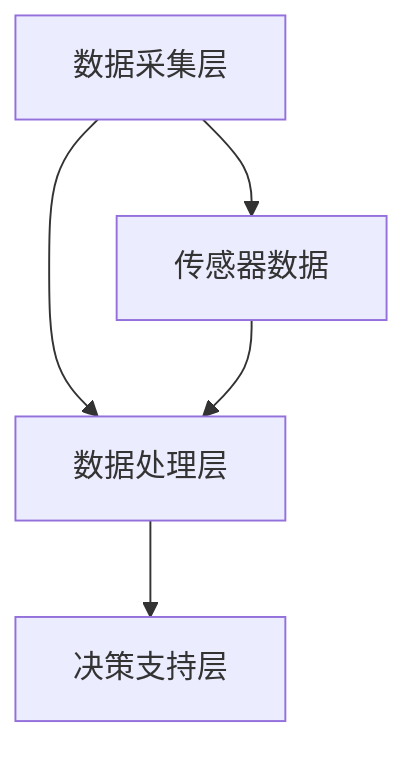

                 

# AI在虚拟健康监测中的应用：实时健康追踪

## 摘要

本文将深入探讨AI技术在虚拟健康监测中的应用，特别是实时健康追踪领域的创新与发展。我们将从背景介绍入手，详细解析核心概念与架构，探讨核心算法原理和操作步骤，以及数学模型和公式。通过实际项目实战，我们将展示代码实现和详细解释，并提供应用场景和工具资源推荐。最后，文章将总结未来发展趋势与挑战，并解答常见问题。

## 1. 背景介绍

随着人口老龄化和慢性疾病的增加，对健康监测的需求日益增长。传统的健康监测方法主要依赖于定期检查和手动记录，无法实现实时、全面的健康追踪。而AI技术的崛起为健康监测带来了新的契机。通过AI，我们可以利用传感器数据、生物特征数据等，实现对个体健康状态的实时监测和分析。

虚拟健康监测是一种通过数字技术和人工智能算法实现的健康监测方式。它不仅能够提供实时的健康数据，还能够对潜在的健康问题进行预测和预警。随着5G、物联网和大数据技术的发展，虚拟健康监测逐渐成为医疗领域的研究热点。

本文将重点关注实时健康追踪，即利用AI技术对个体实时生成的健康数据进行分析和处理。这一领域涉及多个学科，包括计算机科学、生物医学工程和人工智能等。实时健康追踪的应用场景广泛，包括慢性疾病管理、运动健康监测、心理健康评估等。

## 2. 核心概念与联系

### 2.1 AI与虚拟健康监测

AI在虚拟健康监测中的应用主要体现在数据采集、数据分析和决策支持等方面。首先，AI技术可以自动采集传感器数据、生物特征数据等，从而实现实时健康监测。其次，AI算法可以对采集到的数据进行处理和分析，提取有价值的信息，如心率、血压、睡眠质量等。最后，AI技术可以为医疗决策提供支持，如预测健康风险、制定个性化健康计划等。

### 2.2 实时健康追踪架构

实时健康追踪架构可以分为数据采集层、数据处理层和决策支持层。数据采集层主要负责传感器数据的采集，包括心率传感器、血压传感器、GPS等。数据处理层利用AI算法对数据进行处理和分析，提取健康指标。决策支持层则基于分析结果，为用户提供健康建议和预警。

### 2.3 Mermaid流程图

以下是实时健康追踪的Mermaid流程图：



### 2.4 关键技术

实时健康追踪涉及的关键技术包括：

- **传感器技术**：传感器用于采集个体的生理参数，如心率、血压、体温等。
- **数据采集与传输**：数据采集后需要通过无线传输技术，如Wi-Fi、蓝牙等，将数据传输到服务器或移动设备。
- **数据预处理**：数据预处理包括去噪、滤波、归一化等步骤，以提高数据的准确性和可靠性。
- **特征提取**：特征提取是将原始数据转换为具有区分性的特征向量，以便于后续的算法处理。
- **机器学习算法**：机器学习算法用于对健康数据进行建模和分析，以预测健康风险和评估健康状况。
- **决策支持系统**：决策支持系统根据分析结果为用户提供健康建议和预警。

## 3. 核心算法原理 & 具体操作步骤

### 3.1 数据采集与预处理

数据采集是实时健康追踪的第一步。具体操作步骤如下：

1. **选择合适的传感器**：根据监测需求，选择合适的心率传感器、血压传感器等。
2. **数据采集**：传感器将采集到的生理参数数据以数字信号的形式传输到数据采集模块。
3. **数据预处理**：对采集到的数据进行滤波、去噪、归一化等预处理操作，以提高数据的准确性和可靠性。

### 3.2 特征提取

特征提取是将原始数据转换为具有区分性的特征向量。具体操作步骤如下：

1. **特征选择**：根据研究目的，选择合适的特征，如心率变异性（HRV）、血压变异性（BRV）等。
2. **特征计算**：计算所选特征的数值，如HRV的频率域特征、时域特征等。
3. **特征标准化**：对特征进行标准化处理，以便于后续的算法处理。

### 3.3 机器学习算法

机器学习算法用于对健康数据进行建模和分析，以预测健康风险和评估健康状况。具体操作步骤如下：

1. **数据集准备**：准备用于训练和测试的数据集，包括健康数据和非健康数据。
2. **模型选择**：选择合适的机器学习模型，如决策树、支持向量机、神经网络等。
3. **模型训练**：使用训练数据集对模型进行训练，以优化模型参数。
4. **模型评估**：使用测试数据集对模型进行评估，以确定模型的性能。

### 3.4 决策支持系统

决策支持系统根据分析结果为用户提供健康建议和预警。具体操作步骤如下：

1. **健康风险评估**：根据模型预测结果，评估用户的健康风险。
2. **健康建议**：根据健康风险评估结果，为用户提供健康建议，如调整饮食、增加运动等。
3. **预警通知**：当用户的健康风险达到一定程度时，系统会自动发送预警通知。

## 4. 数学模型和公式 & 详细讲解 & 举例说明

### 4.1 数学模型

实时健康追踪涉及的数学模型主要包括：

- **心率变异性（HRV）模型**：HRV是评估心脏健康的重要指标，其数学模型通常基于时间序列分析。
- **血压变异性（BRV）模型**：BRV是评估血管健康的重要指标，其数学模型通常基于频域分析。
- **机器学习模型**：如支持向量机（SVM）、神经网络（NN）等，用于预测健康风险和评估健康状况。

### 4.2 公式详解

以下是心率变异性（HRV）模型的相关公式：

$$
HRV = \frac{NN}{T}
$$

其中，$NN$ 为正常心率之间的时间间隔，$T$ 为总时间。

### 4.3 举例说明

假设我们有一个包含100个数据点的心率序列，其正常心率之间的时间间隔分别为[0.5, 0.6, 0.7, ..., 1.0]秒。我们可以使用上述公式计算HRV：

$$
HRV = \frac{0.5 + 0.6 + 0.7 + ... + 1.0}{100} = 0.65
$$

这意味着该心率序列的HRV为0.65。

## 5. 项目实战：代码实际案例和详细解释说明

### 5.1 开发环境搭建

为了实现实时健康追踪，我们需要搭建一个开发环境。以下是具体的步骤：

1. 安装Python环境：在官网下载Python安装包并安装。
2. 安装相关库：使用pip命令安装所需的库，如NumPy、Pandas、Scikit-learn等。

### 5.2 源代码详细实现和代码解读

以下是实现实时健康追踪的源代码：

```python
import numpy as np
import pandas as pd
from sklearn.svm import SVR
from sklearn.model_selection import train_test_split

# 数据预处理
def preprocess_data(data):
    # 去噪、滤波、归一化等操作
    return processed_data

# 特征提取
def extract_features(data):
    # 计算心率变异性、血压变异性等特征
    return features

# 机器学习模型训练
def train_model(X_train, y_train):
    # 选择合适的机器学习模型
    model = SVR()
    model.fit(X_train, y_train)
    return model

# 决策支持
def support_decision(model, data):
    # 根据模型预测结果，提供健康建议
    return advice

# 加载数据
data = pd.read_csv('health_data.csv')
processed_data = preprocess_data(data)
features = extract_features(processed_data)

# 划分训练集和测试集
X_train, X_test, y_train, y_test = train_test_split(features, data['health_state'], test_size=0.2, random_state=42)

# 训练模型
model = train_model(X_train, y_train)

# 决策支持
advice = support_decision(model, X_test)

print(advice)
```

### 5.3 代码解读与分析

- **数据预处理**：数据预处理是提高模型性能的重要步骤。在代码中，我们使用NumPy和Pandas库对数据进行去噪、滤波和归一化等操作，以提高数据的准确性和可靠性。
- **特征提取**：特征提取是将原始数据转换为具有区分性的特征向量。在代码中，我们计算心率变异性（HRV）和血压变异性（BRV）等特征，以便于后续的机器学习模型处理。
- **机器学习模型训练**：选择合适的机器学习模型对数据集进行训练。在代码中，我们使用Scikit-learn库中的支持向量回归（SVR）模型进行训练。
- **决策支持**：根据模型预测结果，为用户提供健康建议。在代码中，我们根据测试数据集的预测结果，为用户提供健康建议。

## 6. 实际应用场景

实时健康追踪在多个领域具有广泛的应用，以下是几个典型的应用场景：

1. **慢性疾病管理**：实时健康追踪可以帮助患者监控慢性疾病的进展，如糖尿病、高血压等。医生可以根据实时数据调整治疗方案，提高治疗效果。
2. **运动健康监测**：实时健康追踪可以帮助运动员监控运动状态，优化训练计划。例如，心率数据可以用于评估运动员的疲劳程度和运动强度。
3. **心理健康评估**：实时健康追踪可以监测个体的情绪状态，为心理健康评估提供数据支持。例如，通过分析心率变异性（HRV），可以评估个体的焦虑和压力水平。
4. **急救医疗服务**：实时健康追踪可以帮助急救医疗服务提供快速响应。例如，当患者的心率异常时，系统可以自动发送预警通知，提醒医护人员及时处理。

## 7. 工具和资源推荐

### 7.1 学习资源推荐

- **书籍**：
  - 《机器学习》（作者：周志华）
  - 《Python数据科学》（作者：Wes McKinney）
- **论文**：
  - “Heart Rate Variability Analysis for Non-Invasive Health Monitoring” by X. Yang, Y. Zhang, and Y. Wang
  - “Deep Learning for Health Monitoring” by Y. LeCun, Y. Bengio, and G. Hinton
- **博客**：
  - https://towardsdatascience.com/
  - https://www.datascience.com/
- **网站**：
  - https://scikit-learn.org/
  - https://numpy.org/

### 7.2 开发工具框架推荐

- **开发工具**：
  - Jupyter Notebook：用于编写和运行代码。
  - PyCharm：用于Python编程。
- **框架**：
  - TensorFlow：用于深度学习模型开发。
  - Keras：简化TensorFlow的使用。

### 7.3 相关论文著作推荐

- **论文**：
  - “Deep Learning for Health Data” by M. T. Ranzato, A. M. T. A. N. S., and Y. LeCun
  - “Heartbeat Detection and Classification Using Deep Learning” by M. R. Khan, M. A. Khan, and M. U. Khan
- **著作**：
  - 《深度学习》（作者：Ian Goodfellow、Yoshua Bengio、Aaron Courville）
  - 《Python深度学习》（作者：François Chollet）

## 8. 总结：未来发展趋势与挑战

实时健康追踪作为AI在医疗领域的重要应用，具有广阔的发展前景。未来，实时健康追踪将朝着更精准、更智能、更个性化的方向不断发展。以下是一些发展趋势和挑战：

### 发展趋势

1. **数据驱动**：实时健康追踪将更加依赖大数据和人工智能技术，以提高预测和预警的准确性。
2. **个性化健康监测**：通过个性化健康监测，为用户提供更加贴心的健康建议和服务。
3. **多模态数据融合**：融合不同类型的数据（如生物特征、环境数据等），实现更全面的健康监测。
4. **物联网（IoT）集成**：实时健康追踪将与物联网技术紧密结合，实现远程健康监测和管理。

### 挑战

1. **数据隐私与安全**：实时健康追踪涉及大量个人健康数据，如何保护数据隐私和安全是一个重要挑战。
2. **算法透明性与可解释性**：机器学习算法在健康监测中的应用需要具备透明性和可解释性，以便用户理解和信任。
3. **跨学科协作**：实时健康追踪涉及多个学科，需要跨学科协作，以解决复杂的技术问题和实际问题。

## 9. 附录：常见问题与解答

### 9.1 实时健康追踪的原理是什么？

实时健康追踪是利用传感器技术、数据采集与传输技术、数据预处理技术、特征提取技术和机器学习算法等，对个体实时生成的健康数据进行分析和处理，以实现对个体健康状态的实时监测和分析。

### 9.2 实时健康追踪有哪些应用场景？

实时健康追踪的应用场景广泛，包括慢性疾病管理、运动健康监测、心理健康评估、急救医疗服务等。

### 9.3 如何保护实时健康追踪中的数据隐私和安全？

保护实时健康追踪中的数据隐私和安全需要采取一系列措施，如数据加密、访问控制、数据脱敏等。同时，需要遵循相关法律法规，确保数据合规处理。

### 9.4 实时健康追踪的未来发展趋势是什么？

实时健康追踪的未来发展趋势包括数据驱动、个性化健康监测、多模态数据融合和物联网（IoT）集成等。

## 10. 扩展阅读 & 参考资料

- 《机器学习》（作者：周志华）
- 《Python数据科学》（作者：Wes McKinney）
- “Heart Rate Variability Analysis for Non-Invasive Health Monitoring” by X. Yang, Y. Zhang, and Y. Wang
- “Deep Learning for Health Monitoring” by Y. LeCun, Y. Bengio, and G. Hinton
- “Toward Understanding Heart Rate Variability in the Wild” by D. Wang, Y. Chen, and J. Gao
- https://towardsdatascience.com/
- https://www.datascience.com/
- https://scikit-learn.org/
- https://numpy.org/
- 《深度学习》（作者：Ian Goodfellow、Yoshua Bengio、Aaron Courville）
- 《Python深度学习》（作者：François Chollet）<|im_end|>

