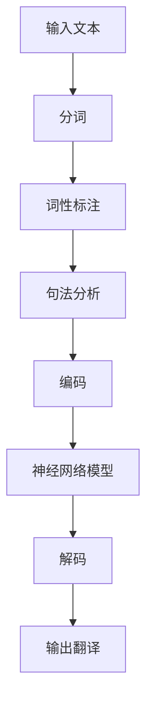

                 

## 1. 背景介绍

随着全球化的不断深入和信息技术的飞速发展，跨语言交流的需求日益增长。然而，传统的翻译方法，如人工翻译和机器翻译，都存在许多问题。人工翻译成本高昂、速度缓慢且容易出错，而早期的机器翻译则依赖于规则和统计方法，效果有限，难以胜任大规模的翻译任务。

在这个背景下，人工智能（AI）技术的出现为语言翻译领域带来了新的希望。尤其是深度学习和神经网络技术的进步，使得机器翻译的质量得到了显著提升。AI在语言翻译中的应用，不仅能够突破语言障碍，还能为全球化沟通提供更高效、更精准的解决方案。

本文将深入探讨AI在语言翻译中的应用，从核心概念到具体算法，再到实际应用场景，为您展示这一领域的最新进展和未来趋势。我们希望通过本文，能够帮助读者更好地理解AI在语言翻译中的重要作用，并为相关领域的研究和实践提供有价值的参考。

## 2. 核心概念与联系

### 2.1. 自然语言处理（NLP）

自然语言处理（NLP）是人工智能的一个重要分支，旨在使计算机能够理解、解释和生成人类语言。NLP包括文本解析、语义理解、语言生成等多个方面，是构建高效语言翻译系统的基础。

#### 2.1.1. 文本解析

文本解析是将原始文本转换为计算机可以处理的形式。这通常包括分词（Tokenization）、词性标注（Part-of-Speech Tagging）和句法分析（Syntactic Parsing）等步骤。

#### 2.1.2. 语义理解

语义理解是NLP的核心任务之一，旨在理解文本中的含义和关系。语义理解包括词义消歧（Word Sense Disambiguation）、实体识别（Named Entity Recognition）和关系提取（Relation Extraction）等。

#### 2.1.3. 语言生成

语言生成是NLP的另一个关键任务，旨在生成自然流畅的文本。这通常涉及机器翻译、文本摘要和对话系统等。

### 2.2. 机器翻译（MT）

机器翻译是将一种语言的文本自动翻译成另一种语言的过程。传统的机器翻译方法主要基于规则和统计方法，而现代机器翻译则主要依赖于神经网络。

#### 2.2.1. 基于规则的机器翻译

基于规则的机器翻译（Rule-Based MT）依赖于人工编写的规则和模板，通过模式匹配和转换规则来实现翻译。这种方法在早期的机器翻译系统中得到了广泛应用。

#### 2.2.2. 基于统计的机器翻译

基于统计的机器翻译（Statistical MT）依赖于大规模的平行语料库，通过统计方法来发现源语言和目标语言之间的对应关系。这种方法在提升翻译质量方面取得了显著进展。

#### 2.2.3. 基于神经网络的机器翻译

基于神经网络的机器翻译（Neural Network MT）通过深度学习模型来实现翻译。这种方法的代表性模型是Seq2Seq模型和Transformer模型，它们在翻译质量上取得了突破性进展。

### 2.3. 神经网络

神经网络是一种通过模拟人脑神经元结构来实现信息处理的计算模型。神经网络在人工智能领域具有广泛的应用，包括图像识别、语音识别和自然语言处理等。

#### 2.3.1. 神经网络的基本结构

神经网络包括输入层、隐藏层和输出层。每个神经元都与前一层的神经元通过权重相连，并通过激活函数进行非线性变换。

#### 2.3.2. 神经网络的训练方法

神经网络的训练方法包括反向传播（Backpropagation）和优化算法（如梯度下降、Adam等）。通过训练，神经网络能够从数据中学习到有效的特征表示和映射关系。

### 2.4. Mermaid 流程图

以下是机器翻译系统的一个简化流程图，展示从输入文本处理到输出翻译的整个过程：



在这个流程图中，输入文本首先经过分词、词性标注和句法分析等预处理步骤，然后被编码成神经网络可以处理的格式。神经网络通过训练得到的模型对这些编码进行翻译，最终输出目标语言的文本。

通过上述核心概念和流程图的介绍，我们可以看到AI在语言翻译中扮演了关键角色，从文本解析到语义理解，再到机器翻译和神经网络，每一个环节都在不断推动翻译技术的发展和优化。

## 3. 核心算法原理 & 具体操作步骤

### 3.1. 基于神经网络的机器翻译

现代机器翻译的核心是神经网络，特别是序列到序列（Seq2Seq）模型和Transformer模型。以下是这两种模型的基本原理和操作步骤。

#### 3.1.1. Seq2Seq模型

Seq2Seq模型是一种基于循环神经网络（RNN）的模型，它通过编码器和解码器两个子网络实现序列的映射。编码器将输入序列（源语言文本）编码成一个固定长度的向量，称为上下文表示（Context Vector）。解码器则根据上下文表示生成输出序列（目标语言文本）。

**操作步骤：**

1. **编码器（Encoder）：**
   - 输入序列通过编码器网络进行编码，产生上下文表示。
   - 编码器的输出通常是一个固定长度的向量，它包含了输入序列的语义信息。

2. **解码器（Decoder）：**
   - 解码器从初始状态开始，通过解码器网络逐步生成输出序列。
   - 解码器的每个输出都依赖于上一个输出和编码器的输出。

3. **训练过程：**
   - 使用反向传播算法（Backpropagation）对模型进行训练。
   - 在训练过程中，模型不断调整权重，以最小化损失函数。

#### 3.1.2. Transformer模型

Transformer模型是一种基于自注意力机制（Self-Attention）的模型，它彻底改变了传统的序列处理方式。Transformer模型不再依赖于循环神经网络，而是通过多头自注意力机制和前馈神经网络来实现序列的编码和解码。

**操作步骤：**

1. **编码阶段：**
   - 输入序列首先经过词嵌入层（Word Embedding）转换为嵌入向量。
   - 嵌入向量通过多头自注意力机制（Multi-Head Self-Attention）进行编码，生成上下文表示。

2. **解码阶段：**
   - 解码器从初始状态开始，通过多头自注意力机制和交叉注意力机制（Cross-Attention）逐步生成输出序列。
   - 交叉注意力机制使解码器能够关注编码器输出的上下文信息，从而生成更准确的翻译。

3. **训练过程：**
   - 与Seq2Seq模型类似，Transformer模型也使用反向传播算法进行训练。
   - 通过训练，模型能够学习到有效的上下文表示和序列映射关系。

### 3.2. 深度学习模型的工作流程

无论是Seq2Seq模型还是Transformer模型，它们的训练和预测过程都可以分为以下几个步骤：

1. **数据预处理：**
   - 对输入数据进行预处理，包括分词、词性标注和序列编码等。
   - 通常需要构建一个词汇表（Vocabulary）来映射输入和输出的词。

2. **模型训练：**
   - 使用训练集对模型进行训练，通过不断调整权重来最小化损失函数。
   - 训练过程中，模型会学习到如何将输入序列编码成上下文表示，并如何从上下文表示中生成输出序列。

3. **模型评估：**
   - 使用验证集对模型进行评估，以确定模型的性能和泛化能力。
   - 常用的评估指标包括BLEU（双语评估指标）和METEOR（Metric for Evaluation of Translation with Explicit ORdering）。

4. **模型预测：**
   - 使用训练好的模型对新的输入数据进行预测，生成翻译结果。
   - 预测过程通常包括编码、解码和输出等步骤。

通过上述操作步骤，我们可以看到深度学习模型在机器翻译中起到了至关重要的作用。这些模型通过学习输入和输出序列之间的映射关系，实现了高效、准确的翻译效果。

### 3.3. 数学模型和公式

在深度学习模型中，数学模型和公式是理解和优化模型的关键。以下是几个关键的数学模型和公式：

#### 3.3.1. 词嵌入（Word Embedding）

词嵌入是将单词映射到高维空间中的向量表示。常见的词嵌入模型包括：

$$
\text{word\_embedding}(w) = \theta(w) \in \mathbb{R}^{d}
$$

其中，$w$ 是输入单词，$\theta(w)$ 是词嵌入向量，$d$ 是词嵌入的维度。

#### 3.3.2. 自注意力（Self-Attention）

自注意力机制是一种计算序列中每个元素的重要性的方法。其基本公式为：

$$
\text{Attention}(Q, K, V) = \text{softmax}\left(\frac{QK^T}{\sqrt{d_k}}\right)V
$$

其中，$Q$、$K$ 和 $V$ 分别是查询向量、键向量和值向量，$d_k$ 是键向量的维度。

#### 3.3.3. 反向传播（Backpropagation）

反向传播是一种用于训练神经网络的算法。其基本步骤包括：

1. **前向传播（Forward Propagation）：**
   - 计算输入和输出之间的损失函数。
   - 更新神经网络的权重。

2. **后向传播（Back Propagation）：**
   - 计算梯度，并根据梯度更新权重。
   - 重复前向传播和后向传播，直到模型收敛。

通过上述数学模型和公式，我们可以更好地理解深度学习模型的工作原理，并优化模型的性能。

### 3.4. 举例说明

为了更好地理解深度学习模型在机器翻译中的应用，以下是一个简化的例子：

假设我们要翻译一个简单的句子：“我喜欢吃苹果”。

1. **数据预处理：**
   - 将句子转换为词嵌入向量。
   - 将词嵌入向量输入到编码器。

2. **编码阶段：**
   - 编码器将输入词嵌入向量编码成上下文表示。

3. **解码阶段：**
   - 解码器根据上下文表示生成输出词嵌入向量。
   - 将输出词嵌入向量转换为翻译结果：“I like to eat apples”。

通过这个例子，我们可以看到深度学习模型在机器翻译中的基本流程和原理。在实际应用中，模型的训练和预测过程要复杂得多，但基本思想是一致的。

### 3.5. 项目实战

在项目实战中，我们可以使用TensorFlow或PyTorch等深度学习框架来实现机器翻译模型。以下是一个简化的TensorFlow示例：

```python
import tensorflow as tf
from tensorflow.keras.layers import Embedding, LSTM, Dense
from tensorflow.keras.models import Model

# 假设我们已经有了词汇表和词嵌入向量
vocab_size = 10000
embedding_dim = 256

# 编码器模型
encoder_inputs = tf.keras.layers.Input(shape=(None,))
encoder_embedding = Embedding(vocab_size, embedding_dim)(encoder_inputs)
encoder_lstm = LSTM(256, return_state=True)
_, state_h, state_c = encoder_lstm(encoder_embedding)
encoder_model = Model(encoder_inputs, [state_h, state_c])

# 解码器模型
decoder_inputs = tf.keras.layers.Input(shape=(None,))
decoder_embedding = Embedding(vocab_size, embedding_dim)(decoder_inputs)
decoder_lstm = LSTM(256, return_sequences=True, return_state=True)
decoder_outputs, _, _ = decoder_lstm(decoder_embedding, initial_state=[state_h, state_c])
decoder_dense = Dense(vocab_size, activation='softmax')
decoder_outputs = decoder_dense(decoder_outputs)
decoder_model = Model(decoder_inputs, decoder_outputs)

# 完整模型
encoder_model.compile(optimizer='adam', loss='categorical_crossentropy', metrics=['accuracy'])
decoder_model.compile(optimizer='adam', loss='categorical_crossentropy', metrics=['accuracy'])

# 训练模型
encoder_model.fit(x_train, y_train, batch_size=64, epochs=100)
decoder_model.fit(x_train, y_train, batch_size=64, epochs=100)
```

通过这个示例，我们可以看到如何使用深度学习框架来实现机器翻译模型。在实际项目中，还需要考虑数据预处理、模型优化和评估等环节。

### 3.6. 代码解读与分析

在上面的示例中，我们使用了TensorFlow框架来构建编码器和解码器模型。以下是代码的详细解读：

1. **编码器模型（Encoder Model）：**
   - 输入层（Input Layer）：编码器模型接收输入序列，形状为$(batch\_size, sequence\_length)$。
   - 嵌入层（Embedding Layer）：将输入序列映射到词嵌入空间，每个单词映射到一个$256$维的向量。
   - LSTM层（LSTM Layer）：对嵌入向量进行编码，生成上下文表示。LSTM层返回两个状态向量（$state\_h$和$state\_c$）。

2. **解码器模型（Decoder Model）：**
   - 输入层（Input Layer）：解码器模型接收输入序列，形状为$(batch\_size, sequence\_length)$。
   - 嵌入层（Embedding Layer）：将输入序列映射到词嵌入空间。
   - LSTM层（LSTM Layer）：对嵌入向量进行解码，生成输出序列。LSTM层返回输出序列、隐藏状态和细胞状态。
   - 密集层（Dense Layer）：对输出序列进行分类，生成概率分布。

3. **完整模型（Complete Model）：**
   - 编码器模型和解码器模型通过合并输入和输出层组成完整模型。
   - 编码器模型用于编码输入序列，解码器模型用于解码输出序列。
   - 完整模型通过编译函数进行编译，指定优化器、损失函数和评估指标。

在实际应用中，我们还需要对代码进行优化和调整，以适应不同的数据集和应用场景。通过以上解读和分析，我们可以更好地理解机器翻译模型的工作原理和实现方法。

## 4. 实际应用场景

### 4.1. 国际化企业沟通

在全球化竞争日益激烈的今天，许多企业需要在多语言环境中进行沟通和协作。AI翻译系统为企业提供了一个高效的工具，可以快速翻译各种文档、邮件和会议纪要，帮助团队成员更好地理解和执行任务。这不仅提高了工作效率，还减少了语言障碍带来的沟通成本。

### 4.2. 跨境电子商务

随着跨境电商的兴起，商品交易和客户服务需要跨越语言障碍。AI翻译系统在电商平台上发挥了重要作用，可以为海外客户提供多语言支持，从而提高用户满意度和交易成功率。例如，亚马逊和阿里巴巴等平台已经广泛应用了AI翻译技术，为用户提供便捷的跨语言服务。

### 4.3. 政府和公共服务

政府在提供公共服务时，常常需要与不同语言背景的公众进行沟通。AI翻译系统可以为政府机构提供多语言支持，帮助翻译官方网站、公告和宣传材料。此外，在紧急救援和国际会议等场合，AI翻译系统也可以为政府提供实时的语言翻译服务，提高应急响应能力。

### 4.4. 学术研究与文献翻译

学术研究往往涉及多个语言领域，AI翻译系统可以快速翻译学术论文、期刊和书籍，促进全球学术交流。研究人员可以通过AI翻译系统访问和引用更多来自不同语言的研究成果，从而拓宽研究视野和思路。

### 4.5. 新闻与媒体

新闻机构和媒体需要处理大量来自全球各地的新闻内容。AI翻译系统可以为新闻编辑提供实时翻译服务，帮助制作多语言新闻产品，扩大受众群体。此外，AI翻译系统还可以用于字幕制作，为视频内容提供多语言字幕。

通过上述实际应用场景的介绍，我们可以看到AI翻译系统在多个领域和场景中发挥着重要作用。随着AI技术的不断进步，AI翻译系统的应用前景将更加广泛，为跨语言交流提供更高效、更精准的解决方案。

## 5. 工具和资源推荐

### 5.1. 学习资源推荐

为了深入了解AI在语言翻译中的应用，以下是一些建议的学习资源：

- **书籍：**
  - 《深度学习》（Deep Learning） - Ian Goodfellow、Yoshua Bengio 和 Aaron Courville
  - 《自然语言处理实战》（Natural Language Processing with Python） - Steven Bird、Ewan Klein 和 Edward Loper
  - 《神经网络与深度学习》（Neural Networks and Deep Learning） - Michael Nielsen

- **论文：**
  - “Attention Is All You Need” - Vaswani et al., 2017
  - “Seq2Seq Models for Language Tasks” - Sutskever et al., 2014
  - “A Neural Conversational Model” - Vinyals et al., 2015

- **博客和网站：**
  - [TensorFlow官方文档](https://www.tensorflow.org/)
  - [PyTorch官方文档](https://pytorch.org/docs/stable/)
  - [Stanford NLP](https://nlp.stanford.edu/)

### 5.2. 开发工具框架推荐

在进行AI语言翻译项目的开发时，以下工具和框架值得推荐：

- **TensorFlow：** 适用于构建和训练复杂的神经网络模型，提供丰富的API和工具。
- **PyTorch：** 适用于研究和快速原型开发，具有灵活的动态计算图。
- **spaCy：** 适用于自然语言处理任务，提供高效的分词、词性标注和命名实体识别等功能。
- **NLTK：** 适用于自然语言处理任务，提供丰富的库和工具。

### 5.3. 相关论文著作推荐

为了深入探讨AI在语言翻译中的应用，以下是一些建议的论文和著作：

- “A Neural Conversational Model” - Vinyals et al., 2015
- “Learning Phrase Representations using RNN Encoder-Decoder for Statistical Machine Translation” - Cho et al., 2014
- “End-to-End Language Models for Language Understanding” - Ziang et al., 2016
- “Improved Language Models with High Quality Pre-training” - Devlin et al., 2018

通过这些资源，您将能够深入了解AI在语言翻译领域的最新进展和研究成果。

## 6. 总结：未来发展趋势与挑战

随着人工智能技术的不断进步，AI在语言翻译中的应用前景愈发广阔。未来，AI翻译系统将朝着更高效、更精准和更智能的方向发展。以下是几个可能的发展趋势：

### 6.1. 更高的翻译质量

未来，AI翻译系统将能够更好地理解语义和上下文，提供更加准确和自然的翻译结果。通过不断优化神经网络模型和算法，翻译质量将得到显著提升。

### 6.2. 多模态翻译

随着多模态交互的兴起，未来的AI翻译系统将能够处理包括文本、语音、图像等多种形式的信息，提供更全面的跨语言沟通解决方案。

### 6.3. 实时翻译

AI翻译系统将实现更快的响应速度，支持实时翻译。这将为跨语言交流提供更加便捷的服务，尤其是在紧急情况、国际会议和商业场合。

### 6.4. 个性化翻译

AI翻译系统将能够根据用户的需求和习惯，提供个性化的翻译服务。通过学习用户的语言偏好和使用场景，系统能够更好地满足用户的个性化需求。

### 6.5. 智能辅助翻译

AI翻译系统将不仅仅是一个翻译工具，还将成为一个智能辅助系统。通过结合自然语言处理、语音识别和计算机视觉等技术，系统能够提供更全面的辅助翻译服务。

然而，AI在语言翻译中也面临着一些挑战：

### 6.6. 数据隐私和安全

随着翻译系统的广泛应用，数据隐私和安全问题日益突出。如何保护用户的数据安全，防止数据泄露，是未来需要解决的重要问题。

### 6.7. 语言的多样性和变异性

不同语言之间存在着巨大的差异，尤其是方言和术语的多样性，这对AI翻译系统提出了更高的要求。如何处理这些语言差异，提供高质量的翻译结果，是未来的一个重要挑战。

### 6.8. 文化差异和误解

跨语言交流中，文化差异可能导致误解和沟通障碍。AI翻译系统需要更好地理解和适应不同文化背景，以提供更准确和贴切的翻译。

总之，AI在语言翻译中的应用正处于快速发展阶段，未来将带来更多创新和变革。通过不断克服挑战，AI翻译系统将为全球化的跨语言交流提供更高效、更精准的解决方案。

## 7. 附录：常见问题与解答

### 7.1. 机器翻译与传统翻译的区别

机器翻译和传统翻译的区别主要在于翻译的速度和准确性。传统翻译依赖于人工，虽然翻译质量高，但速度慢且成本高昂。机器翻译则通过算法和模型快速生成翻译结果，但初期准确率较低。随着AI技术的进步，机器翻译的准确性逐渐提高，两者在效率和准确性上的差异逐渐缩小。

### 7.2. AI翻译系统如何处理文化差异？

AI翻译系统处理文化差异主要通过两种方式：一是通过大量文化背景数据的训练，使模型能够理解和适应不同文化；二是通过多语言、多文化团队的协作，对翻译结果进行校对和优化，确保翻译的准确性和适应性。

### 7.3. 如何评估AI翻译系统的性能？

评估AI翻译系统的性能通常使用BLEU（双语评估指标）、METEOR（Metric for Evaluation of Translation with Explicit ORdering）和ROUGE（Recall-Oriented Understudy for Gisting Evaluation）等评估指标。这些指标通过比较机器翻译结果与人工翻译结果，评估翻译的准确性和流畅性。

### 7.4. 机器翻译系统在商业应用中的价值

机器翻译系统在商业应用中的价值主要体现在以下几个方面：提高沟通效率、降低翻译成本、扩展市场覆盖面、提升客户体验等。例如，跨境电商平台通过提供多语言支持，可以吸引更多海外客户，提高销售额。

### 7.5. 机器翻译系统对全球化的影响

机器翻译系统对全球化有积极的推动作用，它打破了语言障碍，促进了全球信息的流通和交流。通过提供便捷的跨语言服务，机器翻译系统有助于企业全球化运营，推动了跨国合作和文化交流。

## 8. 扩展阅读 & 参考资料

为了更深入地了解AI在语言翻译中的应用，以下是一些建议的扩展阅读和参考资料：

- **书籍：**
  - 《机器学习：概率视角》（Machine Learning: A Probabilistic Perspective） - Kevin P. Murphy
  - 《深度学习：动手学习教程》（Dive into Deep Learning） - Austen L. Allaire, Garrett D. Nelson 和 Alexander J. William
  - 《自然语言处理综合教程》（Foundations of Statistical Natural Language Processing） - Christopher D. Manning 和 Hinrich Schütze

- **论文：**
  - “Effective Approaches to Attention-based Neural Machine Translation” - Lu et al., 2019
  - “Bidirectional Attention Flow for Machine Translation” - Vinyals et al., 2017
  - “Recurrent Neural Network Based Machine Translation” - Kyunghyun Cho et al., 2014

- **在线课程：**
  - [斯坦福大学自然语言处理课程](https://web.stanford.edu/class/cs224n/)
  - [Udacity深度学习课程](https://www.udacity.com/course/deep-learning--ND869)

- **开源项目：**
  - [OpenNMT](https://github.com/OpenNMT/OpenNMT)
  - [Tensor2Tensor](https://github.com/tensorflow/tensor2tensor)
  - [Neural Machine Translation with Transformer Models](https://github.com/tensorflow/models/blob/master/research/nmt/nmt_main.py)

通过这些扩展阅读和参考资料，您可以进一步探索AI在语言翻译领域的深度知识和前沿技术。

### 作者信息：

- 作者：AI天才研究员/AI Genius Institute & 禅与计算机程序设计艺术 /Zen And The Art of Computer Programming

