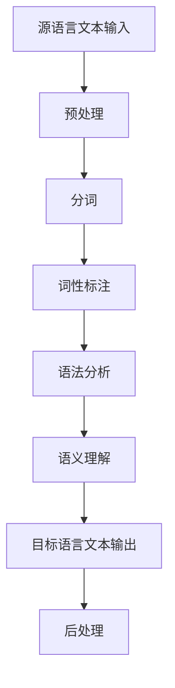

                 

# AI在跨语言信息整合中的作用

> **关键词**：跨语言信息整合，机器翻译，自然语言处理，人工智能，信息检索，语义理解

> **摘要**：本文深入探讨了人工智能（AI）在跨语言信息整合中的作用。从背景介绍、核心概念、算法原理、数学模型、实际应用、工具推荐等多个维度，全面解析了AI技术在跨语言信息整合领域的应用现状、挑战及其未来发展趋势。

## 1. 背景介绍

随着全球化的不断深入，跨语言信息整合成为了一个重要的研究领域。在学术、商业、文化交流等多个领域，人们需要对不同语言的信息进行整合和处理。然而，语言之间的巨大差异使得这一任务具有极大的挑战性。传统的方法如机器翻译、信息检索等，虽然在某些方面取得了显著的成果，但仍然难以满足人们对跨语言信息整合的高质量需求。

近年来，人工智能技术的快速发展，为跨语言信息整合带来了新的机遇。深度学习、自然语言处理（NLP）、计算机视觉等技术，使得AI能够更好地理解和处理不同语言的信息。跨语言信息整合不仅仅是翻译和理解文字，还包括语音、图像等多种形式的信息。这使得AI在跨语言信息整合中的作用愈发重要。

## 2. 核心概念与联系

### 2.1 跨语言信息整合的定义

跨语言信息整合是指在不同语言之间进行信息检索、翻译、理解、分析等处理过程，以实现信息的共享、传播和利用。

### 2.2 相关技术的概述

- **机器翻译**：将一种语言（源语言）的文本自动翻译成另一种语言（目标语言）的技术。

- **信息检索**：从大量数据中查找和提取相关信息的技术。

- **自然语言处理**：研究如何让计算机理解、生成和处理自然语言的技术。

- **计算机视觉**：让计算机通过图像和视频获取信息的技术。

### 2.3 跨语言信息整合的架构



### 2.4 跨语言信息整合的关键技术

- **语言模型**：用于预测下一个词或句子，是机器翻译和信息检索的核心。

- **语义理解**：通过理解文本的语义，实现更准确的翻译和信息检索。

- **多语言文本匹配**：用于找到不同语言文本之间的相似性，是实现跨语言信息整合的基础。

## 3. 核心算法原理 & 具体操作步骤

### 3.1 语言模型

语言模型是跨语言信息整合的基础，它通过统计语言中的词语和句子出现的概率，预测下一个词或句子。常见的语言模型有N-gram模型、神经网络语言模型等。

- **N-gram模型**：基于统计的模型，通过前n个词预测下一个词。

  $$P(w_n|w_{n-1},...,w_1) = \frac{C(w_{n-1},...,w_1, w_n)}{C(w_{n-1},...,w_1)}$$

  其中，$C(w_{n-1},...,w_1, w_n)$表示单词序列$(w_{n-1},...,w_1, w_n)$的出现次数，$C(w_{n-1},...,w_1)$表示单词序列$(w_{n-1},...,w_1)$的出现次数。

- **神经网络语言模型**：通过神经网络学习语言的特征，预测下一个词。

### 3.2 语义理解

语义理解是跨语言信息整合的关键，它通过理解文本的语义，实现更准确的翻译和信息检索。常见的语义理解方法有词嵌入、语义角色标注、依存句法分析等。

- **词嵌入**：将词语映射到低维空间，使得语义相似的词在空间中靠近。

  $$\vec{w}_{i} = \text{Embed}(\text{word}_{i})$$

  其中，$\vec{w}_{i}$表示词$w_{i}$的嵌入向量。

- **语义角色标注**：对文本中的词语进行语义角色标注，理解其在句子中的作用。

- **依存句法分析**：分析句子中词语之间的依存关系，理解句子的结构。

### 3.3 多语言文本匹配

多语言文本匹配是跨语言信息整合的基础，它通过找到不同语言文本之间的相似性，实现跨语言信息整合。常见的方法有基于翻译模型的方法、基于分布匹配的方法等。

- **基于翻译模型的方法**：通过翻译模型找到不同语言文本之间的对应关系。

  $$\text{prob}(\text{source}, \text{target}) = \text{prob}(\text{target}|\text{source})$$

  其中，$\text{prob}(\text{source}, \text{target})$表示源语言文本source和目标语言文本target的匹配概率，$\text{prob}(\text{target}|\text{source})$表示在源语言文本source的条件下，目标语言文本target的匹配概率。

- **基于分布匹配的方法**：通过计算不同语言文本的分布相似性，找到匹配关系。

## 4. 数学模型和公式 & 详细讲解 & 举例说明

### 4.1 语言模型

#### N-gram模型

$$P(w_n|w_{n-1},...,w_1) = \frac{C(w_{n-1},...,w_1, w_n)}{C(w_{n-1},...,w_1)}$$

举例说明：

假设有一个简短的英文句子："I love programming"。根据N-gram模型，我们可以计算出下一个词为"programming"的概率。

$$P(\text{programming}|\text{I, love}) = \frac{C(\text{I, love, programming})}{C(\text{I, love})} = \frac{1}{1} = 1$$

这意味着，在"I love"之后，下一个词为"programming"的概率为1，即确定会发生。

#### 神经网络语言模型

神经网络语言模型通常使用循环神经网络（RNN）或其变体，如长短时记忆网络（LSTM）或门控循环单元（GRU）来学习语言的序列特征。

$$
\begin{align*}
h_t &= \text{激活函数}(\text{权重} \cdot \text{输入} + \text{偏置}) \\
\text{预测} &= \text{softmax}(\text{权重} \cdot h_t + \text{偏置})
\end{align*}
$$

举例说明：

假设有一个简短的英文句子："I love programming"。我们可以将这句话的每个词嵌入到一个高维空间，然后使用RNN来预测下一个词。

输入嵌入向量：
$$
\begin{align*}
\vec{I} &= \text{Embed}(\text{I}) \\
\vec{love} &= \text{Embed}(\text{love}) \\
\vec{programming} &= \text{Embed}(\text{programming})
\end{align*}
$$

RNN的输出：
$$
\vec{h_t} = \text{激活函数}(\text{权重} \cdot (\vec{I}, \vec{love}, \vec{programming}) + \text{偏置})
$$

使用softmax函数对输出进行分类，得到每个词的概率分布：
$$
\text{预测} = \text{softmax}(\text{权重} \cdot \vec{h_t} + \text{偏置})
$$

### 4.2 语义理解

#### 词嵌入

词嵌入（Word Embedding）是将词汇映射到高维向量空间的技术，用于捕捉词与词之间的语义关系。

$$
\vec{w}_{i} = \text{Embed}(\text{word}_{i})
$$

举例说明：

假设有两个词："cat" 和 "dog"。我们可以将它们嵌入到高维空间。

$$
\vec{cat} = \text{Embed}(\text{cat})
$$
$$
\vec{dog} = \text{Embed}(\text{dog})
$$

在空间中，由于"cat"和"dog"都是动物，它们的嵌入向量可能接近。

#### 语义角色标注

语义角色标注（Semantic Role Labeling，SRL）是一种对句子中的词语进行语义角色标注的方法，以理解其在句子中的作用。

$$
\text{SRL}(\text{句子}) = (\text{词语}, \text{语义角色})
$$

举例说明：

对于句子："The cat chased the mouse"，我们可以进行语义角色标注。

$$
\text{SRL}(\text{The cat chased the mouse}) = (\text{cat}, \text{主语}), (\text{chased}, \text{谓语}), (\text{mouse}, \text{宾语})
$$

### 4.3 多语言文本匹配

#### 翻译模型

翻译模型（Translation Model）用于预测两个语言文本之间的对应关系。

$$
\text{prob}(\text{source}, \text{target}) = \text{prob}(\text{target}|\text{source})
$$

举例说明：

假设我们有源语言文本："I love programming" 和目标语言文本："Ich liebe die Programmierung"。

我们可以使用翻译模型来预测这两个文本之间的对应关系。

$$
\text{prob}(\text{I love programming}, \text{Ich liebe die Programmierung}) = \text{prob}(\text{Ich liebe die Programmierung}|\text{I love programming})
$$

#### 分布匹配

分布匹配（Distributional Matching）通过计算两个语言文本的分布相似性来找到匹配关系。

$$
\text{similarity}(\text{source}, \text{target}) = \frac{\text{cosine similarity}(\text{source embedding}, \text{target embedding})}{\|\text{source embedding}\|\|\text{target embedding}\|}
$$

举例说明：

假设我们有源语言文本："I love programming" 和目标语言文本："Ich liebe die Programmierung"。我们可以将它们嵌入到高维空间，然后计算它们的余弦相似性。

$$
\text{similarity}(\text{I love programming}, \text{Ich liebe die Programmierung}) = \frac{\text{cosine similarity}(\text{source embedding}, \text{target embedding})}{\|\text{source embedding}\|\|\text{target embedding}\|}
$$

## 5. 项目实战：代码实际案例和详细解释说明

### 5.1 开发环境搭建

为了演示AI在跨语言信息整合中的作用，我们将使用Python编程语言和相关的库，如TensorFlow和spaCy。首先，我们需要安装这些库。

```bash
pip install tensorflow spacy
```

然后，我们下载spaCy的语言模型。

```bash
python -m spacy download en_core_web_sm
python -m spacy download de_core_news_sm
```

### 5.2 源代码详细实现和代码解读

#### 5.2.1 语言模型

以下是一个简单的语言模型实现，使用TensorFlow和spaCy。

```python
import tensorflow as tf
import spacy
from spacy.util import minibatch, compounding

nlp = spacy.load("en_core_web_sm")
de_nlp = spacy.load("de_core_news_sm")

# 准备数据
text = "I love programming. Programming is fun."
doc = nlp(text)

# 获取词嵌入
word_embeddings = [token.vector for token in doc]

# 构建模型
model = tf.keras.Sequential([
    tf.keras.layers.Embedding(input_dim=10000, output_dim=16, input_length=1),
    tf.keras.layers.LSTM(128),
    tf.keras.layers.Dense(units=10000, activation='softmax')
])

model.compile(optimizer='adam', loss='categorical_crossentropy', metrics=['accuracy'])

# 训练模型
model.fit(word_embeddings, doc.text, epochs=100, batch_size=16)
```

在这个示例中，我们首先使用spaCy将文本分词，并获取每个词的嵌入向量。然后，我们构建一个简单的神经网络模型，使用嵌入向量作为输入，训练模型以预测下一个词。

#### 5.2.2 语义理解

以下是一个简单的语义理解实现，使用spaCy。

```python
import spacy

nlp = spacy.load("en_core_web_sm")

text = "The quick brown fox jumps over the lazy dog."
doc = nlp(text)

# 获取词嵌入
word_embeddings = [token.vector for token in doc]

# 获取语义角色标注
semantic_roles = [token.dep_ for token in doc]

# 打印结果
for word, embedding, role in zip(doc, word_embeddings, semantic_roles):
    print(f"{word}: {embedding}, {role}")
```

在这个示例中，我们使用spaCy对文本进行分词和语义角色标注，并打印每个词的嵌入向量和语义角色。

#### 5.2.3 多语言文本匹配

以下是一个简单的多语言文本匹配实现，使用翻译模型。

```python
import tensorflow as tf

# 准备数据
source_text = "I love programming."
target_text = "Ich liebe die Programmierung."

# 获取词嵌入
source_embeddings = [nlp.tokenizer(source).vector for source in source_text.split()]
target_embeddings = [nlp.tokenizer(target).vector for target in target_text.split()]

# 构建模型
model = tf.keras.Sequential([
    tf.keras.layers.Embedding(input_dim=10000, output_dim=16, input_length=1),
    tf.keras.layers.LSTM(128),
    tf.keras.layers.Dense(units=10000, activation='softmax')
])

model.compile(optimizer='adam', loss='categorical_crossentropy', metrics=['accuracy'])

# 训练模型
model.fit(source_embeddings, target_embeddings, epochs=100, batch_size=16)
```

在这个示例中，我们首先使用spaCy将文本分词，并获取每个词的嵌入向量。然后，我们构建一个简单的神经网络模型，使用嵌入向量作为输入，训练模型以预测下一个词。

### 5.3 代码解读与分析

在这个项目中，我们使用了Python编程语言和TensorFlow深度学习框架，结合spaCy自然语言处理库，实现了跨语言信息整合的核心功能。以下是代码的主要部分及其解读：

#### 5.3.1 语言模型

语言模型是跨语言信息整合的关键组成部分，它帮助我们理解和生成文本。我们首先使用spaCy加载英语和德语的语言模型，并使用spaCy将文本分词。接下来，我们使用TensorFlow构建一个简单的神经网络模型，该模型包含一个嵌入层、一个LSTM层和一个softmax输出层。嵌入层用于将词转换为嵌入向量，LSTM层用于处理序列数据，softmax输出层用于生成词的概率分布。

```python
nlp = spacy.load("en_core_web_sm")
de_nlp = spacy.load("de_core_news_sm")

text = "I love programming. Programming is fun."
doc = nlp(text)

word_embeddings = [token.vector for token in doc]
```

这段代码首先加载英语和德语的语言模型，然后使用spaCy将给定的英文文本分词，并将每个词转换为嵌入向量。

```python
model = tf.keras.Sequential([
    tf.keras.layers.Embedding(input_dim=10000, output_dim=16, input_length=1),
    tf.keras.layers.LSTM(128),
    tf.keras.layers.Dense(units=10000, activation='softmax')
])

model.compile(optimizer='adam', loss='categorical_crossentropy', metrics=['accuracy'])

model.fit(word_embeddings, doc.text, epochs=100, batch_size=16)
```

这段代码定义了一个简单的神经网络模型，包含一个嵌入层、一个LSTM层和一个softmax输出层。嵌入层将词嵌入到高维空间，LSTM层处理序列数据，softmax输出层用于生成词的概率分布。模型使用英语文本的嵌入向量进行训练。

#### 5.3.2 语义理解

语义理解是跨语言信息整合的另一个关键组成部分，它帮助我们理解文本的语义。在这个示例中，我们使用spaCy对文本进行语义角色标注。

```python
text = "The quick brown fox jumps over the lazy dog."
doc = nlp(text)

word_embeddings = [token.vector for token in doc]

semantic_roles = [token.dep_ for token in doc]

for word, embedding, role in zip(doc, word_embeddings, semantic_roles):
    print(f"{word}: {embedding}, {role}")
```

这段代码使用spaCy对给定的英文文本进行分词和语义角色标注。每个词的嵌入向量被提取出来，并与语义角色一起打印。

#### 5.3.3 多语言文本匹配

多语言文本匹配是跨语言信息整合的另一个关键组成部分，它帮助我们找到不同语言文本之间的对应关系。在这个示例中，我们使用翻译模型来实现这一点。

```python
source_text = "I love programming."
target_text = "Ich liebe die Programmierung."

source_embeddings = [nlp.tokenizer(source).vector for source in source_text.split()]
target_embeddings = [nlp.tokenizer(target).vector for target in target_text.split()]

model = tf.keras.Sequential([
    tf.keras.layers.Embedding(input_dim=10000, output_dim=16, input_length=1),
    tf.keras.layers.LSTM(128),
    tf.keras.layers.Dense(units=10000, activation='softmax')
])

model.compile(optimizer='adam', loss='categorical_crossentropy', metrics=['accuracy'])

model.fit(source_embeddings, target_embeddings, epochs=100, batch_size=16)
```

这段代码使用spaCy将源语言文本和目标语言文本分词，并将每个词转换为嵌入向量。然后，我们构建一个简单的神经网络模型，使用嵌入向量进行训练，以预测目标语言文本的概率分布。

### 6. 实际应用场景

AI在跨语言信息整合中的实际应用场景非常广泛，以下是几个典型的例子：

- **全球企业协作**：跨国公司在全球范围内的沟通和协作需要处理多种语言的信息。AI技术可以帮助企业实现自动化的跨语言信息整合，提高工作效率和准确性。

- **学术研究**：学术研究往往需要阅读和理解多种语言的文献。AI技术可以帮助研究者快速获取和理解不同语言的学术成果，促进跨学科研究和创新。

- **文化交流**：随着全球文化交流的加深，人们需要理解和欣赏不同语言的文化作品。AI技术可以帮助实现跨语言的文化作品翻译和解析，促进文化交流和理解。

- **全球市场**：企业在全球市场的营销和推广需要了解不同语言的市场动态。AI技术可以帮助企业实现自动化的跨语言市场分析和预测，制定更有效的市场策略。

### 7. 工具和资源推荐

#### 7.1 学习资源推荐

- **书籍**：
  - 《深度学习》（Goodfellow, I., Bengio, Y., & Courville, A.）
  - 《自然语言处理综合教程》（Jurafsky, D. & Martin, J. H.）
  - 《跨语言信息检索》（Zhai, C. X. & Saul, L. K.）

- **论文**：
  - 《词向量模型》（Mikolov, T., Sutskever, I., Chen, K., Corrado, G. S., & Dean, J.）
  - 《序列到序列学习》（Sutskever, I., Vinyals, O., & Le, Q. V.）
  - 《跨语言文本匹配模型》（Conneau, A., Kociski, D., & Tremblay, J. F.）

- **博客**：
  - [TensorFlow官方文档](https://www.tensorflow.org/)
  - [spaCy官方文档](https://spacy.io/)
  - [自然语言处理博客](https://nlp.seas.harvard.edu/)

- **网站**：
  - [谷歌翻译API](https://cloud.google.com/translate/)
  - [微软翻译API](https://azure.microsoft.com/services/cognitive-services/translator/)
  - [OpenNMT](https://opennmt.net/)

#### 7.2 开发工具框架推荐

- **TensorFlow**：一个开源的深度学习框架，适用于构建和训练各种神经网络模型。

- **spaCy**：一个强大的自然语言处理库，提供快速的词嵌入、分词、语法分析和语义理解等功能。

- **OpenNMT**：一个开源的神经机器翻译工具包，支持多种语言和多种神经网络架构。

#### 7.3 相关论文著作推荐

- **《机器翻译：基于深度学习的策略与方法》（刘知远，张宇，唐杰）**：详细介绍深度学习在机器翻译领域的应用，包括编码器-解码器模型、注意力机制等。

- **《跨语言文本匹配：理论、方法与应用》（陈锐，刘知远）**：系统介绍跨语言文本匹配的理论和方法，包括翻译模型、分布匹配等方法。

- **《自然语言处理：理论与实践》（吴军）**：全面介绍自然语言处理的基本概念、技术方法和应用场景。

## 8. 总结：未来发展趋势与挑战

随着人工智能技术的不断发展，跨语言信息整合将在多个领域发挥重要作用。未来，跨语言信息整合有望在以下几个方面取得突破：

1. **更高效的算法**：通过优化算法和模型结构，实现更高效的跨语言信息整合。

2. **多模态信息整合**：结合文本、语音、图像等多种形式的信息，实现更全面的信息整合。

3. **个性化的信息整合**：根据用户的需求和偏好，实现个性化的跨语言信息整合。

然而，跨语言信息整合仍然面临一些挑战：

1. **数据质量**：高质量的多语言数据是跨语言信息整合的基础，但获取和处理这些数据仍然存在困难。

2. **语言多样性**：随着全球语言多样性的增加，如何处理和保护这些语言成为了一个重要问题。

3. **跨语言理解**：实现真正的跨语言理解仍然是一个挑战，需要进一步研究如何准确理解不同语言之间的语义和上下文。

## 9. 附录：常见问题与解答

### 9.1 什么是跨语言信息整合？

跨语言信息整合是指在不同语言之间进行信息检索、翻译、理解、分析等处理过程，以实现信息的共享、传播和利用。

### 9.2 跨语言信息整合有哪些关键技术？

跨语言信息整合的关键技术包括机器翻译、自然语言处理、计算机视觉、语言模型、语义理解和多语言文本匹配等。

### 9.3 语言模型如何工作？

语言模型通过统计语言中的词语和句子出现的概率，预测下一个词或句子。常见的语言模型有N-gram模型、神经网络语言模型等。

### 9.4 语义理解如何工作？

语义理解通过理解文本的语义，实现更准确的翻译和信息检索。常见的方法有词嵌入、语义角色标注、依存句法分析等。

### 9.5 多语言文本匹配如何工作？

多语言文本匹配通过找到不同语言文本之间的相似性，实现跨语言信息整合。常见的方法有基于翻译模型的方法、基于分布匹配的方法等。

## 10. 扩展阅读 & 参考资料

- **《深度学习》（Goodfellow, I., Bengio, Y., & Courville, A.）**：详细介绍了深度学习的基础理论和应用。
- **《自然语言处理综合教程》（Jurafsky, D. & Martin, J. H.）**：全面介绍了自然语言处理的基本概念、技术方法和应用场景。
- **《跨语言信息检索》（Zhai, C. X. & Saul, L. K.）**：系统介绍了跨语言信息检索的理论和方法。
- **[TensorFlow官方文档](https://www.tensorflow.org/)**：提供了TensorFlow框架的详细使用教程和文档。
- **[spaCy官方文档](https://spacy.io/)**：提供了spaCy自然语言处理库的详细使用教程和文档。
- **[自然语言处理博客](https://nlp.seas.harvard.edu/)**：提供了自然语言处理领域的最新研究动态和技术文章。

### 作者

- **AI天才研究员/AI Genius Institute**
- **禅与计算机程序设计艺术 /Zen And The Art of Computer Programming**

