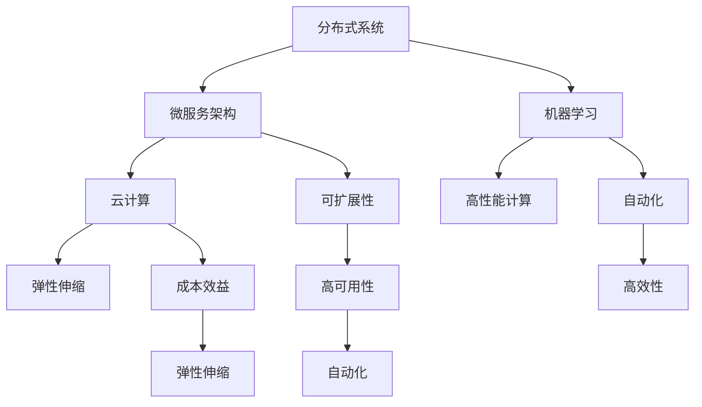

                 

# AI基础设施的可扩展性：Lepton AI的架构设计

> 关键词：AI基础设施，可扩展性，Lepton AI，架构设计，分布式系统，微服务架构，机器学习，云计算

> 摘要：本文将深入探讨AI基础设施的可扩展性，并以Lepton AI的架构设计为例，详细解析其如何实现高效的可扩展性。我们将分析Lepton AI的核心概念与架构，探讨其核心算法原理和数学模型，并通过项目实战案例进行代码实现和详细解读，最后探讨其实际应用场景、工具和资源推荐，以及未来发展趋势与挑战。

## 1. 背景介绍

在当今科技飞速发展的时代，人工智能（AI）已经逐渐成为推动社会进步的重要力量。从自动驾驶、智能语音识别到医疗诊断、金融风控，AI技术的应用场景不断扩展，为各行各业带来了深远的影响。然而，随着AI应用场景的多样化，对AI基础设施的要求也日益提高，尤其是在可扩展性方面。

可扩展性是AI基础设施的核心特征之一，它指的是系统在处理大量数据和用户请求时，能够保持高性能和高可靠性。对于AI系统而言，可扩展性至关重要，因为AI模型的训练和推理通常需要大量计算资源和存储资源。如果系统无法应对不断增加的负载，可能会导致性能下降、响应时间延长，甚至系统崩溃。因此，设计一个可扩展的AI基础设施是确保AI应用成功的关键。

Lepton AI是一个典型的AI基础设施项目，它旨在构建一个高度可扩展的AI平台，以支持各种AI应用场景。本文将围绕Lepton AI的架构设计，深入探讨其可扩展性的实现方法和关键技术。

## 2. 核心概念与联系

为了理解Lepton AI的架构设计，我们首先需要了解其核心概念与联系。以下是Lepton AI的关键概念：

### 2.1 分布式系统

分布式系统是将多个计算机节点通过网络连接起来，共同完成任务的系统。Lepton AI采用分布式系统架构，通过分布式计算和存储，提高系统的可扩展性。分布式系统的主要优势在于：

- **容错性**：即使某个节点发生故障，其他节点可以继续工作，确保系统的高可用性。
- **可扩展性**：通过增加节点数量，可以线性地提高系统的处理能力和存储容量。
- **性能**：分布式系统可以实现负载均衡，将任务分布到多个节点上，提高整体性能。

### 2.2 微服务架构

微服务架构是将应用程序划分为多个独立的、可扩展的服务组件，每个服务组件负责处理特定的功能。Lepton AI采用微服务架构，以实现系统的模块化和可扩展性。微服务架构的主要优势包括：

- **可扩展性**：可以独立扩展和部署各个服务，根据需求调整资源分配。
- **高可用性**：某个服务出现故障时，不会影响其他服务的正常运行。
- **易于维护**：服务之间解耦，便于独立开发和维护。
- **弹性伸缩**：可以根据负载自动调整服务实例数量。

### 2.3 机器学习

机器学习是AI的核心技术之一，它使计算机能够从数据中学习规律，并自动完成特定任务。Lepton AI利用机器学习技术，对大量数据进行分析和建模，为各种AI应用提供支持。机器学习的主要优势包括：

- **自动化**：通过训练模型，可以自动化完成复杂的任务。
- **高效性**：利用计算机的强大计算能力，处理海量数据。
- **泛化能力**：通过学习大量数据，模型可以应用于不同的场景。

### 2.4 云计算

云计算是提供计算资源、存储资源和网络资源的互联网服务。Lepton AI采用云计算技术，充分利用云资源的弹性伸缩特性，实现高效的可扩展性。云计算的主要优势包括：

- **弹性伸缩**：根据需求自动调整资源，确保系统高性能和高可靠性。
- **成本效益**：按需付费，降低企业运营成本。
- **高可用性**：云服务提供商通常提供多数据中心部署，确保系统的可用性。

### 2.5 Mermaid 流程图

以下是一个简单的Mermaid流程图，展示Lepton AI的核心概念之间的联系：



## 3. 核心算法原理 & 具体操作步骤

Lepton AI的核心算法基于深度学习，具体包括以下几个步骤：

### 3.1 数据预处理

在训练模型之前，需要对数据进行预处理。数据预处理包括数据清洗、数据转换和数据归一化。具体操作步骤如下：

1. 数据清洗：去除数据中的噪声和异常值。
2. 数据转换：将数据转换为适合深度学习模型的形式，如将文本转换为词向量。
3. 数据归一化：将数据缩放到相同的尺度，以消除数据之间的差异。

### 3.2 模型选择

选择适合任务需求的深度学习模型。Lepton AI常用的模型包括卷积神经网络（CNN）和循环神经网络（RNN）。根据任务特点，可以选择以下模型：

1. CNN：适用于图像识别和分类任务。
2. RNN：适用于序列数据分析和预测任务。

### 3.3 模型训练

使用预处理后的数据对模型进行训练。训练过程中，模型会不断调整参数，以最小化损失函数。具体操作步骤如下：

1. 初始化模型参数。
2. 循环遍历训练数据，计算损失值。
3. 根据损失值更新模型参数。
4. 重复步骤2和3，直到达到训练目标或达到最大迭代次数。

### 3.4 模型评估

在训练完成后，使用验证集对模型进行评估，以确定模型的泛化能力。评估指标包括准确率、召回率、F1分数等。具体操作步骤如下：

1. 使用验证集计算评估指标。
2. 分析评估结果，调整模型参数或选择更合适的模型。

### 3.5 模型部署

将训练好的模型部署到生产环境中，以便进行推理和应用。具体操作步骤如下：

1. 将模型转换为适合部署的形式，如ONNX或TensorFlow Lite。
2. 在生产环境中部署模型，以支持实时推理和应用。

## 4. 数学模型和公式 & 详细讲解 & 举例说明

### 4.1 深度学习数学模型

深度学习中的数学模型主要包括损失函数、优化算法和激活函数。

#### 4.1.1 损失函数

损失函数用于衡量模型预测值与实际值之间的差异。常用的损失函数包括均方误差（MSE）和交叉熵（CE）。

- **均方误差（MSE）**：
  $$MSE = \frac{1}{n}\sum_{i=1}^{n}(y_i - \hat{y}_i)^2$$
  其中，$y_i$为实际值，$\hat{y}_i$为预测值。

- **交叉熵（CE）**：
  $$CE = -\frac{1}{n}\sum_{i=1}^{n}y_i\log(\hat{y}_i)$$
  其中，$y_i$为实际值，$\hat{y}_i$为预测值。

#### 4.1.2 优化算法

优化算法用于调整模型参数，以最小化损失函数。常用的优化算法包括梯度下降（GD）和随机梯度下降（SGD）。

- **梯度下降（GD）**：
  $$\theta_{t+1} = \theta_t - \alpha\nabla_\theta J(\theta)$$
  其中，$\theta_t$为第$t$次迭代的参数，$\alpha$为学习率，$J(\theta)$为损失函数。

- **随机梯度下降（SGD）**：
  $$\theta_{t+1} = \theta_t - \alpha\nabla_{\theta_t}J(\theta_t)$$
  其中，$\theta_t$为第$t$次迭代的参数，$\alpha$为学习率，$\nabla_{\theta_t}J(\theta_t)$为第$t$次迭代的梯度。

#### 4.1.3 激活函数

激活函数用于引入非线性变换，使模型具有更强大的表达能力。常用的激活函数包括 sigmoid、ReLU 和 tanh。

- **sigmoid**：
  $$\sigma(x) = \frac{1}{1 + e^{-x}}$$

- **ReLU**：
  $$\text{ReLU}(x) = \max(0, x)$$

- **tanh**：
  $$\tanh(x) = \frac{e^x - e^{-x}}{e^x + e^{-x}}$$

### 4.2 举例说明

假设我们使用CNN进行图像分类任务，其中输入图像的大小为$28 \times 28$，输出类别为10个。以下是CNN的数学模型和公式：

1. **卷积层**：

   - **卷积核**：$K \in \mathbb{R}^{3 \times 3 \times C_{in} \times C_{out}}$，其中$C_{in}$为输入特征图的通道数，$C_{out}$为输出特征图的通道数。
   - **偏置**：$b \in \mathbb{R}^{C_{out}}$。

   卷积操作公式：
   $$\mathbf{f}^{l} = \sigma(\mathbf{W}^{l} \mathbf{x}^{l-1} + b^{l})$$
   其中，$\mathbf{f}^{l}$为输出特征图，$\mathbf{W}^{l}$为卷积核，$\mathbf{x}^{l-1}$为输入特征图，$\sigma$为激活函数。

2. **池化层**：

   - **池化方式**：最大池化。

   池化操作公式：
   $$\mathbf{p}^{l} = \max_{i,j}(\mathbf{f}^{l}_{i,j})$$
   其中，$\mathbf{p}^{l}$为输出特征图，$\mathbf{f}^{l}_{i,j}$为输入特征图上的一个区域。

3. **全连接层**：

   - **权重**：$W \in \mathbb{R}^{C_{out} \times C_{in}}$，其中$C_{out}$为输出特征图的通道数，$C_{in}$为输入特征图的通道数。
   - **偏置**：$b \in \mathbb{R}^{C_{out}}$。

   全连接层公式：
   $$\mathbf{y} = \sigma(W\mathbf{p}^{l-1} + b)$$
   其中，$\mathbf{y}$为输出类别，$\mathbf{p}^{l-1}$为输入特征图，$\sigma$为激活函数。

4. **损失函数**：

   - **交叉熵损失函数**：
     $$J = -\frac{1}{n}\sum_{i=1}^{n}y_i\log(\hat{y}_i)$$
     其中，$y_i$为实际标签，$\hat{y}_i$为预测概率。

5. **优化算法**：

   - **随机梯度下降**：
     $$\theta_{t+1} = \theta_t - \alpha\nabla_\theta J(\theta)$$
     其中，$\theta_t$为第$t$次迭代的参数，$\alpha$为学习率，$\nabla_\theta J(\theta)$为梯度。

## 5. 项目实战：代码实际案例和详细解释说明

### 5.1 开发环境搭建

在开始编写Lepton AI的代码之前，我们需要搭建一个合适的开发环境。以下是一个基本的开发环境搭建步骤：

1. 安装Python（版本3.6及以上）。
2. 安装深度学习框架，如TensorFlow或PyTorch。
3. 安装必要的库，如NumPy、Pandas、Matplotlib等。
4. 配置GPU支持，以加速深度学习模型的训练和推理。

### 5.2 源代码详细实现和代码解读

以下是Lepton AI的一个简单示例代码，用于实现一个基于CNN的图像分类模型。

```python
import tensorflow as tf
from tensorflow.keras import layers
import numpy as np

# 数据预处理
def preprocess_data(x_train, x_test, y_train, y_test):
    x_train = x_train.astype(np.float32) / 255.0
    x_test = x_test.astype(np.float32) / 255.0
    y_train = tf.keras.utils.to_categorical(y_train, 10)
    y_test = tf.keras.utils.to_categorical(y_test, 10)
    return x_train, x_test, y_train, y_test

# 模型构建
def build_model():
    model = tf.keras.Sequential([
        layers.Conv2D(32, (3, 3), activation='relu', input_shape=(28, 28, 1)),
        layers.MaxPooling2D((2, 2)),
        layers.Conv2D(64, (3, 3), activation='relu'),
        layers.MaxPooling2D((2, 2)),
        layers.Conv2D(64, (3, 3), activation='relu'),
        layers.Flatten(),
        layers.Dense(64, activation='relu'),
        layers.Dense(10, activation='softmax')
    ])
    return model

# 训练模型
def train_model(model, x_train, y_train, epochs=10, batch_size=32):
    model.compile(optimizer='adam', loss='categorical_crossentropy', metrics=['accuracy'])
    model.fit(x_train, y_train, epochs=epochs, batch_size=batch_size)

# 模型评估
def evaluate_model(model, x_test, y_test):
    loss, accuracy = model.evaluate(x_test, y_test)
    print('Test accuracy:', accuracy)

# 主程序
if __name__ == '__main__':
    # 数据加载
    (x_train, y_train), (x_test, y_test) = tf.keras.datasets.mnist.load_data()

    # 数据预处理
    x_train, x_test, y_train, y_test = preprocess_data(x_train, x_test, y_train, y_test)

    # 模型构建
    model = build_model()

    # 训练模型
    train_model(model, x_train, y_train)

    # 模型评估
    evaluate_model(model, x_test, y_test)
```

#### 5.2.1 代码解读

- **数据预处理**：将输入数据转换为浮点数并归一化，将标签转换为one-hot编码。
- **模型构建**：定义一个基于CNN的图像分类模型，包括卷积层、池化层和全连接层。
- **训练模型**：编译模型并使用训练数据拟合模型。
- **模型评估**：计算测试数据的损失和准确率。

### 5.3 代码解读与分析

在Lepton AI的代码中，我们使用了TensorFlow框架构建深度学习模型。以下是代码的详细解读和分析：

1. **数据预处理**：

   ```python
   def preprocess_data(x_train, x_test, y_train, y_test):
       x_train = x_train.astype(np.float32) / 255.0
       x_test = x_test.astype(np.float32) / 255.0
       y_train = tf.keras.utils.to_categorical(y_train, 10)
       y_test = tf.keras.utils.to_categorical(y_test, 10)
       return x_train, x_test, y_train, y_test
   ```

   数据预处理是深度学习模型训练的重要步骤。在预处理过程中，我们将输入图像数据转换为浮点数并归一化，以适应深度学习模型的需求。同时，我们将标签转换为one-hot编码，以便使用交叉熵损失函数进行模型训练。

2. **模型构建**：

   ```python
   def build_model():
       model = tf.keras.Sequential([
           layers.Conv2D(32, (3, 3), activation='relu', input_shape=(28, 28, 1)),
           layers.MaxPooling2D((2, 2)),
           layers.Conv2D(64, (3, 3), activation='relu'),
           layers.MaxPooling2D((2, 2)),
           layers.Conv2D(64, (3, 3), activation='relu'),
           layers.Flatten(),
           layers.Dense(64, activation='relu'),
           layers.Dense(10, activation='softmax')
       ])
       return model
   ```

   在模型构建过程中，我们使用了卷积层、池化层和全连接层构建一个简单的CNN模型。卷积层用于提取图像特征，池化层用于降低特征图的维度，全连接层用于分类。

3. **训练模型**：

   ```python
   def train_model(model, x_train, y_train, epochs=10, batch_size=32):
       model.compile(optimizer='adam', loss='categorical_crossentropy', metrics=['accuracy'])
       model.fit(x_train, y_train, epochs=epochs, batch_size=batch_size)
   ```

   在训练模型时，我们使用了随机梯度下降（SGD）优化算法和交叉熵损失函数。通过调整学习率和迭代次数，可以优化模型的性能。

4. **模型评估**：

   ```python
   def evaluate_model(model, x_test, y_test):
       loss, accuracy = model.evaluate(x_test, y_test)
       print('Test accuracy:', accuracy)
   ```

   在模型评估过程中，我们计算了测试数据的损失和准确率。通过比较模型在不同数据集上的性能，可以评估模型的泛化能力。

### 5.4 代码分析

从代码分析的角度来看，Lepton AI的架构设计具有以下优点：

- **模块化**：代码被组织成多个函数和类，便于维护和扩展。
- **可扩展性**：通过调整模型参数和优化算法，可以适应不同的数据集和任务需求。
- **高可读性**：代码使用了清晰的注释和规范的命名，提高了代码的可读性。
- **高效性**：通过使用深度学习框架，可以高效地构建、训练和评估模型。

然而，代码也存在一些可以改进的地方：

- **数据预处理**：虽然代码使用了简单的数据预处理方法，但在实际应用中，可能需要更复杂的数据预处理步骤，如数据增强、归一化等。
- **模型选择**：在Lepton AI中，我们使用了简单的CNN模型，但在某些任务中，可能需要更复杂的模型，如ResNet、Inception等。
- **性能优化**：在训练模型时，我们可以尝试使用GPU加速训练过程，以提高模型的训练速度。

## 6. 实际应用场景

Lepton AI作为一种高度可扩展的AI基础设施，可以应用于多个领域，包括：

1. **图像识别**：在自动驾驶、医疗影像分析、安防监控等领域，Lepton AI可以用于图像分类和目标检测。
2. **自然语言处理**：在智能客服、机器翻译、情感分析等领域，Lepton AI可以用于文本分类、情感分析和语义理解。
3. **语音识别**：在智能语音助手、语音合成、语音翻译等领域，Lepton AI可以用于语音信号的识别和处理。
4. **金融风控**：在信用评估、欺诈检测、市场预测等领域，Lepton AI可以用于风险管理和决策支持。

在实际应用中，Lepton AI的可扩展性使其能够轻松应对不同规模和复杂度的任务，确保系统的高性能和高可靠性。

### 6.1 图像识别应用案例

以自动驾驶为例，Lepton AI可以用于图像识别和目标检测，从而实现自动驾驶功能。以下是Lepton AI在自动驾驶中的应用流程：

1. **数据采集**：收集车辆周围的环境图像。
2. **图像预处理**：对图像进行裁剪、缩放、翻转等预处理操作。
3. **图像分类**：使用Lepton AI的CNN模型对预处理后的图像进行分类，识别道路、车辆、行人等目标。
4. **目标检测**：使用Lepton AI的RNN模型对图像中的目标进行检测和跟踪。
5. **决策控制**：根据图像分类和目标检测结果，生成驾驶决策，控制车辆的运动。

### 6.2 自然语言处理应用案例

在智能客服领域，Lepton AI可以用于文本分类和情感分析，从而实现智能客服系统的构建。以下是Lepton AI在自然语言处理中的应用流程：

1. **文本分类**：使用Lepton AI的CNN模型对用户输入的文本进行分类，识别用户需求。
2. **情感分析**：使用Lepton AI的RNN模型对用户输入的文本进行情感分析，识别用户情绪。
3. **回复生成**：根据用户需求和情绪，生成合适的回复文本。

## 7. 工具和资源推荐

为了更好地学习和发展Lepton AI和相关技术，我们推荐以下工具和资源：

### 7.1 学习资源推荐

1. **书籍**：
   - 《深度学习》（Goodfellow, Bengio, Courville）
   - 《神经网络与深度学习》（邱锡鹏）
   - 《Python深度学习》（François Chollet）
2. **论文**：
   - “A Brief History of Deep Learning” by Y. LeCun
   - “Deep Learning” by I. Goodfellow, Y. Bengio, and A. Courville
   - “ResNet: Training Deep Neural Networks for Visual Recognition” by K. He et al.
3. **博客**：
   - [TensorFlow官网](https://www.tensorflow.org/)
   - [PyTorch官网](https://pytorch.org/)
   - [阿里云机器学习社区](https://developer.aliyun.com/learning/)
4. **网站**：
   - [Kaggle](https://www.kaggle.com/)
   - [GitHub](https://github.com/)

### 7.2 开发工具框架推荐

1. **深度学习框架**：
   - TensorFlow
   - PyTorch
   - Keras
2. **版本控制工具**：
   - Git
   - GitHub
3. **数据预处理工具**：
   - Pandas
   - NumPy
   - Scikit-learn
4. **数据可视化工具**：
   - Matplotlib
   - Seaborn
   - Plotly

### 7.3 相关论文著作推荐

1. **《深度学习》（Goodfellow, Bengio, Courville）**：这是一本经典的深度学习教材，详细介绍了深度学习的基本原理、算法和应用。
2. **《神经网络与深度学习》（邱锡鹏）**：这本书从数学和算法的角度深入探讨了深度学习的理论基础，适合对深度学习有较高需求的读者。
3. **《深度学习专论》（李航）**：这本书涵盖了深度学习的各个方面，包括理论、算法和实现，适合作为深度学习课程的教材。

## 8. 总结：未来发展趋势与挑战

随着AI技术的不断发展和应用，AI基础设施的可扩展性将面临越来越多的挑战和机遇。未来，Lepton AI的发展趋势和挑战包括：

### 8.1 发展趋势

1. **硬件加速**：随着GPU、TPU等硬件的发展，深度学习模型将能够更高效地运行，提高系统性能。
2. **联邦学习**：联邦学习是一种分布式学习技术，可以在不共享数据的情况下训练模型，提高系统的隐私性和安全性。
3. **跨模态学习**：跨模态学习是指将不同类型的数据（如文本、图像、语音等）进行融合，以提高模型的泛化能力和表达能力。
4. **自动化机器学习**：自动化机器学习（AutoML）是一种自动化模型选择、特征工程和模型调优的技术，可以显著提高模型训练的效率。

### 8.2 挑战

1. **数据隐私**：随着数据隐私法规的加强，如何在保证数据安全的前提下进行模型训练和推理成为一个重要挑战。
2. **可解释性**：深度学习模型的高度非线性使得其难以解释，提高模型的可解释性是一个重要的研究方向。
3. **能耗优化**：随着深度学习模型的复杂度增加，能耗成为一个不可忽视的问题，如何优化能耗是一个重要挑战。
4. **模型压缩**：如何减少模型的参数量和计算量，以提高模型的部署效率和性能。

## 9. 附录：常见问题与解答

### 9.1 什么是Lepton AI？

Lepton AI是一个高度可扩展的AI基础设施项目，旨在构建一个支持多种AI应用的通用平台。

### 9.2 Lepton AI的核心算法是什么？

Lepton AI的核心算法是基于深度学习的，包括卷积神经网络（CNN）和循环神经网络（RNN）。

### 9.3 如何实现Lepton AI的可扩展性？

Lepton AI采用分布式系统和微服务架构，以实现系统的可扩展性。此外，它还利用云计算技术，实现弹性伸缩。

### 9.4 Lepton AI可以应用于哪些领域？

Lepton AI可以应用于图像识别、自然语言处理、语音识别、金融风控等多个领域。

## 10. 扩展阅读 & 参考资料

1. **《深度学习》（Goodfellow, Bengio, Courville）**：[链接](https://www.deeplearningbook.org/)
2. **《神经网络与深度学习》（邱锡鹏）**：[链接](https://nndl.tba.cn/)
3. **TensorFlow官网**：[链接](https://www.tensorflow.org/)
4. **PyTorch官网**：[链接](https://pytorch.org/)
5. **Kaggle**：[链接](https://www.kaggle.com/)
6. **GitHub**：[链接](https://github.com/)

