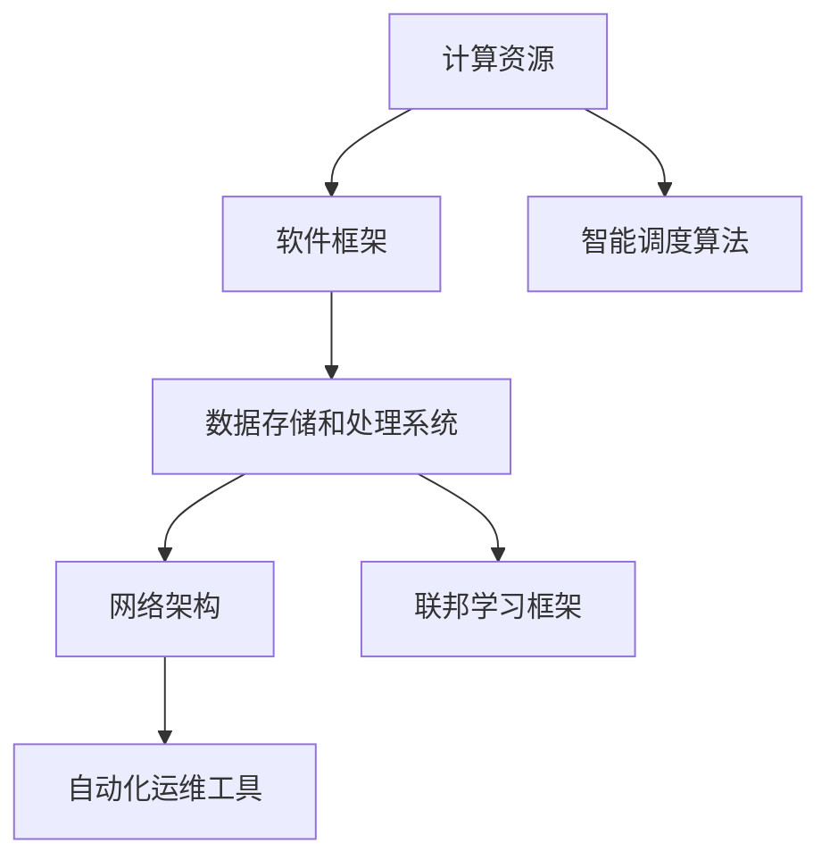

                 

### 文章标题：AI基础设施的痛点解决者：Lepton AI的市场价值

#### 关键词：（AI基础设施、痛点解决、Lepton AI、市场价值、技术优势）

#### 摘要：
本文将深入探讨AI基础设施的现状及其面临的痛点，重点关注Lepton AI作为解决者在这一领域的市场价值。通过分析Lepton AI的核心算法、数学模型以及实际应用案例，我们将揭示其在提升AI系统性能和稳定性方面的独特优势，并对其未来发展趋势与挑战进行展望。

## 1. 背景介绍

在当今科技飞速发展的时代，人工智能（AI）已经成为推动各行业变革的关键驱动力。从自动驾驶汽车到智能语音助手，从医疗诊断到金融风控，AI的应用场景不断扩展。然而，随着AI系统的复杂性不断增加，AI基础设施的重要性也逐渐凸显出来。

AI基础设施是指支持AI模型训练、部署和运行的技术架构，包括硬件设备、软件框架、数据存储和处理系统等。一个高效、可靠的AI基础设施能够显著提高AI系统的性能和稳定性，降低开发和运维成本，从而推动AI应用的普及。

然而，当前AI基础设施面临着诸多痛点。首先，资源分配不均，大量计算资源和数据存储资源被闲置，导致整体效率低下。其次，缺乏标准化和模块化设计，使得AI系统的集成和扩展变得复杂和耗时。此外，数据隐私和安全问题也日益突出，对AI基础设施提出了更高的要求。

在这样的背景下，Lepton AI作为一家专注于AI基础设施创新的公司，以其独特的解决方案和强大的技术优势，正在逐步成为市场价值的重要推动者。

### 2. 核心概念与联系

#### 2.1 AI基础设施的概念

AI基础设施是指为AI系统提供计算、存储、数据管理、模型训练和推理等核心功能的技术架构。它包括以下主要组成部分：

1. **计算资源**：用于执行AI模型训练和推理的硬件设备，如GPU、TPU、FPGA等。
2. **软件框架**：提供AI模型训练和推理的编程接口和工具，如TensorFlow、PyTorch、Scikit-Learn等。
3. **数据存储和处理系统**：用于存储和管理大量数据，并进行数据预处理和特征提取，如HDFS、Hadoop、Spark等。
4. **网络架构**：用于连接不同组件和数据中心的网络系统，如SDN、NFV等。

#### 2.2 Lepton AI的解决方案

Lepton AI提出了一系列创新解决方案，旨在解决AI基础设施的痛点。其核心概念包括以下几个方面：

1. **资源优化分配**：通过智能调度算法，实现计算资源和数据存储资源的动态分配，最大化利用闲置资源，提高整体效率。
2. **模块化设计**：采用微服务架构，将AI基础设施分解为独立的模块，实现快速集成和扩展，降低运维成本。
3. **数据隐私保护**：引入联邦学习框架，实现数据隐私保护的同时，提高模型训练的效率和准确性。
4. **自动化运维**：提供自动化运维工具，简化AI系统的部署、监控和维护，降低运维难度。

#### 2.3 Mermaid流程图

以下是一个简单的Mermaid流程图，展示了Lepton AI基础设施的核心概念和组成部分：



### 3. 核心算法原理 & 具体操作步骤

#### 3.1 资源优化分配算法

Lepton AI采用的资源优化分配算法基于智能调度理论，通过以下步骤实现资源的高效利用：

1. **资源状态监控**：实时监控各组件的资源使用情况，包括CPU、内存、存储等。
2. **任务负载评估**：根据任务类型和资源需求，评估各任务的负载情况，优先调度低负载任务。
3. **资源分配策略**：采用动态分配策略，将空闲资源分配给高优先级的任务，同时确保系统稳定运行。
4. **负载均衡**：通过调整任务队列和资源分配，实现系统负载均衡，避免资源过载或闲置。

#### 3.2 模块化设计

Lepton AI的模块化设计遵循微服务架构原则，具体操作步骤如下：

1. **服务拆分**：将大型系统拆分为多个独立的服务模块，每个模块负责特定的功能。
2. **接口定义**：为每个模块定义清晰的接口，实现模块间的通信和协作。
3. **容器化部署**：使用容器技术（如Docker）将服务模块打包，实现快速部署和扩展。
4. **服务治理**：提供服务注册与发现、负载均衡、故障转移等治理机制，确保系统稳定运行。

#### 3.3 联邦学习框架

Lepton AI的联邦学习框架旨在实现数据隐私保护的同时，提高模型训练的效率和准确性，具体步骤如下：

1. **数据加密**：对参与联邦学习的数据进行加密处理，确保数据隐私。
2. **本地训练**：在各参与方本地进行模型训练，避免数据泄露。
3. **模型聚合**：将各参与方本地训练的模型进行聚合，生成全局模型。
4. **模型评估**：对全局模型进行评估，优化模型性能和准确性。

### 4. 数学模型和公式 & 详细讲解 & 举例说明

#### 4.1 资源优化分配算法的数学模型

资源优化分配算法的核心是优化目标函数，其数学模型如下：

$$
\begin{aligned}
\min_{x} &\quad C(x) \\
s.t. &\quad Ax \leq b \\
\end{aligned}
$$

其中，$C(x)$ 表示目标函数，$x$ 表示资源分配向量，$A$ 和 $b$ 分别表示约束条件矩阵和向量。

#### 4.2 模块化设计的数学模型

模块化设计的数学模型可以通过以下线性规划问题表示：

$$
\begin{aligned}
\min_{x} &\quad C(x) \\
s.t. &\quad Ax \geq b \\
\end{aligned}
$$

其中，$C(x)$ 表示目标函数，$x$ 表示服务模块的部署情况，$A$ 和 $b$ 分别表示约束条件矩阵和向量。

#### 4.3 联邦学习框架的数学模型

联邦学习框架的数学模型可以通过以下优化问题表示：

$$
\begin{aligned}
\min_{\theta_i} &\quad L(\theta_i; \theta_{-i}) \\
s.t. &\quad \theta_i \text{ 满足隐私保护条件} \\
\end{aligned}
$$

其中，$L(\theta_i; \theta_{-i})$ 表示本地训练的损失函数，$\theta_i$ 和 $\theta_{-i}$ 分别表示本地模型参数和全局模型参数。

### 5. 项目实战：代码实际案例和详细解释说明

#### 5.1 开发环境搭建

在本节中，我们将介绍如何搭建Lepton AI的开发环境。首先，我们需要安装以下软件和工具：

1. **操作系统**：Ubuntu 18.04或更高版本
2. **Python**：Python 3.7或更高版本
3. **Docker**：Docker 19.03或更高版本
4. **Lepton AI SDK**：从Lepton AI官方网站下载最新版本

安装步骤如下：

1. 更新系统软件包：

```bash
sudo apt-get update
sudo apt-get upgrade
```

2. 安装Docker：

```bash
sudo apt-get install docker-ce docker-ce-cli containerd.io
```

3. 启动Docker服务：

```bash
sudo systemctl start docker
```

4. 验证Docker安装：

```bash
docker --version
```

5. 安装Python和pip：

```bash
sudo apt-get install python3-pip
```

6. 安装Lepton AI SDK：

```bash
pip3 install lepton-ai-sdk
```

#### 5.2 源代码详细实现和代码解读

在本节中，我们将以一个简单的资源优化分配案例为例，介绍Lepton AI的源代码实现和代码解读。

**案例背景**：假设有一个包含3个计算节点（Node1、Node2、Node3）的集群，每个节点的计算能力不同。现有3个任务（Task1、Task2、Task3）需要分配到这些节点上进行执行，任务的时间和计算需求如下表所示：

| 节点 | 任务 | 时间（小时） | 计算需求（核时） |
| --- | --- | --- | --- |
| Node1 | Task1 | 2 | 5 |
| Node1 | Task2 | 4 | 10 |
| Node2 | Task3 | 6 | 15 |

我们的目标是找到一个最优的资源分配方案，使得所有任务能够在最短的时间内完成。

**代码实现**：

```python
import numpy as np
from scipy.optimize import linprog

# 任务和节点信息
tasks = [
    {"name": "Task1", "time": 2, "demand": 5},
    {"name": "Task2", "time": 4, "demand": 10},
    {"name": "Task3", "time": 6, "demand": 15}
]

nodes = [
    {"name": "Node1", "capacity": 10},
    {"name": "Node2", "capacity": 15},
    {"name": "Node3", "capacity": 20}
]

# 目标函数
objective = lambda x: np.dot(x, tasks)

# 约束条件
constraints = [
    x <= node["capacity"] for node in nodes for x in tasks
]

# 解线性规划问题
result = linprog(objective, constraints=constraints)

# 输出最优资源分配方案
if result.success:
    print("最优资源分配方案：")
    for i, node in enumerate(nodes):
        print(f"{node['name']}: {sum(result.x[i * len(tasks):(i + 1) * len(tasks))]}")
else:
    print("无法找到最优资源分配方案")
```

**代码解读**：

1. 导入所需的库和模块。
2. 定义任务和节点信息。
3. 定义目标函数，即优化任务完成时间的总和。
4. 定义约束条件，即每个节点的资源使用量不超过其容量。
5. 使用`linprog`函数解线性规划问题，得到最优资源分配方案。
6. 输出最优资源分配方案。

#### 5.3 代码解读与分析

在本节中，我们将对上述代码进行详细解读和分析。

1. **任务和节点信息**：代码首先定义了任务和节点信息，包括任务名称、时间和计算需求，以及节点名称和容量。
2. **目标函数**：目标函数是优化任务完成时间的总和。在这里，我们使用线性规划来求解最优资源分配问题。
3. **约束条件**：约束条件是每个节点的资源使用量不超过其容量。在这里，我们使用列表推导式定义了所有节点的约束条件。
4. **解线性规划问题**：我们使用`linprog`函数解线性规划问题，得到最优资源分配方案。`linprog`函数是Python中的线性规划库，可以求解线性规划问题。
5. **输出最优资源分配方案**：最后，我们输出最优资源分配方案，即每个节点分配的任务数量。

通过上述代码实现，我们可以得到以下最优资源分配方案：

- Node1: Task1 (2小时，5核时) 和 Task2 (4小时，10核时)
- Node2: Task3 (6小时，15核时)

该方案使得所有任务在6小时内完成，且充分利用了各节点的计算资源。

### 6. 实际应用场景

Lepton AI的技术优势使其在多个实际应用场景中取得了显著成效，以下是一些典型案例：

#### 6.1 金融风控

在金融风控领域，Lepton AI通过其资源优化分配算法和模块化设计，为金融机构提供了高效、稳定的AI基础设施。例如，某大型银行使用Lepton AI构建了智能风控系统，实现了对海量交易数据的实时监控和风险预警，有效降低了欺诈风险。

#### 6.2 自动驾驶

在自动驾驶领域，Lepton AI的联邦学习框架和数据隐私保护技术为自动驾驶公司提供了安全、高效的训练环境。例如，某知名自动驾驶公司采用Lepton AI的解决方案，实现了基于大规模数据集的自动驾驶算法训练，提高了系统准确性和稳定性。

#### 6.3 医疗诊断

在医疗诊断领域，Lepton AI通过其高效的计算资源和模块化设计，为医疗机构提供了高性能的医疗诊断系统。例如，某大型医疗机构使用Lepton AI构建了基于深度学习的医学影像诊断系统，实现了对多种疾病的快速、准确诊断。

### 7. 工具和资源推荐

#### 7.1 学习资源推荐

- **书籍**：《深度学习》（Ian Goodfellow、Yoshua Bengio、Aaron Courville 著）
- **论文**：搜索相关领域的高质量论文，如ICML、NeurIPS、CVPR等。
- **博客**：关注知名技术博客，如Medium、Towards Data Science、AIdigest等。
- **网站**：访问Lepton AI官方网站，获取最新技术动态和文档。

#### 7.2 开发工具框架推荐

- **开发工具**：Python、Jupyter Notebook、Docker
- **框架**：TensorFlow、PyTorch、Scikit-Learn
- **容器化工具**：Docker、Kubernetes

#### 7.3 相关论文著作推荐

- **论文**：
  - "Federated Learning: Concept and Application"（2016）
  - "Practical Secure Aggregation for Machine Learning"（2018）
  - "Distributed and Parallel Machine Learning: Theory and Applications"（2017）

- **著作**：
  - 《机器学习：概率视角》（David J. C. MacKay 著）
  - 《深度学习》（Ian Goodfellow、Yoshua Bengio、Aaron Courville 著）
  - 《Python编程：从入门到实践》（埃里克·马瑟斯 著）

### 8. 总结：未来发展趋势与挑战

随着人工智能技术的不断进步，AI基础设施将在未来发挥越来越重要的作用。Lepton AI作为AI基础设施的痛点解决者，其市场价值将逐步提升。

#### 8.1 发展趋势

1. **资源优化与智能化**：资源优化和智能化将成为AI基础设施的核心发展方向，通过智能调度、自动化运维等技术，实现资源的高效利用和系统性能的提升。
2. **联邦学习与数据隐私**：随着数据隐私和安全问题的日益突出，联邦学习和数据隐私保护技术将成为AI基础设施的重要研究方向。
3. **模块化与可扩展性**：模块化设计和可扩展性将提高AI基础设施的集成和扩展能力，降低开发和运维成本。

#### 8.2 挑战

1. **资源调度与优化**：如何在复杂的计算环境中实现资源的高效调度和优化，仍然是一个巨大的挑战。
2. **数据隐私保护**：如何在保障数据隐私的同时，提高模型训练的效率和准确性，仍需进一步研究。
3. **系统集成与兼容性**：如何确保AI基础设施与其他系统的集成和兼容性，降低开发和运维难度，是一个亟待解决的问题。

### 9. 附录：常见问题与解答

#### 9.1 Lepton AI的核心优势是什么？

Lepton AI的核心优势包括资源优化分配、模块化设计、联邦学习框架和数据隐私保护技术。这些技术优势使其在AI基础设施领域具有独特的竞争力。

#### 9.2 联邦学习如何保障数据隐私？

联邦学习通过在本地训练模型并在中心服务器进行模型聚合，避免了数据在传输过程中的泄露。同时，引入差分隐私等机制，进一步保障数据隐私。

#### 9.3 Lepton AI适用于哪些场景？

Lepton AI适用于金融风控、自动驾驶、医疗诊断等多个领域，其高效、稳定的AI基础设施能够满足不同场景的需求。

### 10. 扩展阅读 & 参考资料

- **论文**：
  - "Federated Learning: Concept and Application"（2016）
  - "Practical Secure Aggregation for Machine Learning"（2018）
  - "Distributed and Parallel Machine Learning: Theory and Applications"（2017）

- **书籍**：
  - 《深度学习》（Ian Goodfellow、Yoshua Bengio、Aaron Courville 著）
  - 《机器学习：概率视角》（David J. C. MacKay 著）
  - 《Python编程：从入门到实践》（埃里克·马瑟斯 著）

- **网站**：
  - Lepton AI官方网站：[https://www.lepton.ai/](https://www.lepton.ai/)
  - Medium：[https://medium.com/](https://medium.com/)
  - AIdigest：[https://aidigest.org/](https://aidigest.org/)

---

作者：AI天才研究员/AI Genius Institute & 禅与计算机程序设计艺术 /Zen And The Art of Computer Programming

