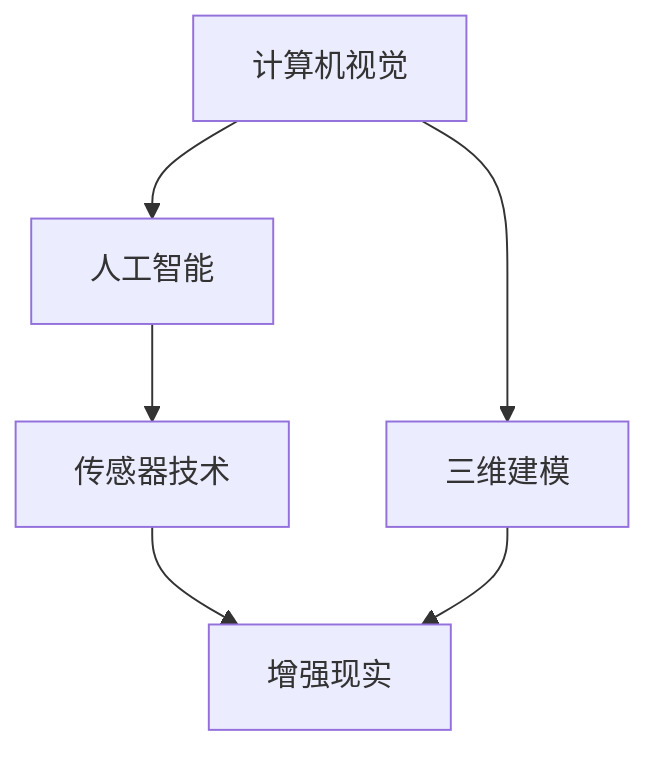

                 

### 背景介绍

增强现实（Augmented Reality，简称AR）技术，作为一种将虚拟信息叠加到真实环境中的技术，已经逐渐成为人们关注的焦点。随着计算机视觉、人工智能等技术的不断发展，AR技术不仅提高了人们的互动体验，也在各个领域展现出了巨大的潜力。AI增强现实技术的兴起，更是将AR技术推向了一个新的高度。

AI增强现实技术的应用案例非常广泛，包括但不限于以下几个方面：

#### 1. 娱乐与游戏

在娱乐与游戏领域，AR技术为玩家提供了全新的互动体验。例如，热门游戏《宝可梦GO》就是利用AR技术，让玩家在现实世界中捕捉虚拟的宝可梦。游戏的玩法使得玩家需要走出家门，亲身体验，从而增加了游戏的趣味性和现实感。

#### 2. 教育与培训

在教育与培训领域，AR技术可以为学生提供更加生动、直观的学习体验。例如，在历史课上，学生可以通过AR技术“看到”历史事件的真实场景，从而加深对历史事件的理解。同样，在医学培训中，AR技术可以帮助医学生更好地理解人体结构和解剖学。

#### 3. 医疗与健康

在医疗与健康领域，AR技术同样具有广泛的应用前景。通过AR技术，医生可以更直观地查看患者的身体内部结构，从而提高诊断和手术的准确性。此外，AR技术还可以帮助康复患者进行物理治疗，提高治疗效果。

#### 4. 制造与工业

在制造与工业领域，AR技术可以用于设备维护、远程诊断等。通过AR技术，技术人员可以在现场通过设备提供的AR指导进行操作，提高工作效率，减少人为错误。

#### 5. 零售与营销

在零售与营销领域，AR技术可以帮助商家提供更加个性化的购物体验。例如，顾客可以通过AR技术试穿衣物，查看物品的真实效果，从而提高购买决策的准确性。

综上所述，AI增强现实技术已经在多个领域展现出了巨大的应用潜力。接下来，我们将进一步探讨AI增强现实技术的核心概念、原理和应用。

### 核心概念与联系

AI增强现实技术（AI-AR）的核心概念涉及多个领域的交叉，主要包括计算机视觉、人工智能、传感器技术和三维建模。为了更好地理解这些核心概念，我们可以通过一个简单的Mermaid流程图来展示它们之间的联系。



**计算机视觉**：计算机视觉是AI-AR技术的基础，通过图像识别、目标检测等技术，计算机能够理解和解释现实世界的图像信息。计算机视觉技术主要包括：

- **图像识别**：识别图像中的物体、场景或活动。
- **目标检测**：定位图像中的特定目标。
- **图像分割**：将图像分为不同的区域。

**人工智能**：人工智能（AI）是驱动AR技术进步的关键技术。通过机器学习和深度学习算法，计算机可以自动从数据中学习，进行决策和预测。在AI-AR中，人工智能的主要应用包括：

- **图像处理**：对图像进行增强、滤波等处理，提高图像质量。
- **自然语言处理**：实现人机交互，理解用户的意图和需求。
- **模式识别**：识别图像中的模式和规律，为AR应用提供数据支持。

**传感器技术**：传感器是AI-AR的重要组成部分，通过传感器，计算机可以获取现实世界的多种信息，如光线、温度、运动等。常见的传感器包括：

- **摄像头**：用于捕捉现实世界的图像。
- **深度传感器**：用于测量物体的距离和深度。
- **温度传感器**：用于测量环境温度。

**三维建模**：三维建模是将现实世界中的物体或场景以三维形式进行数字化。三维建模技术主要包括：

- **三维扫描**：通过激光扫描或摄影测量等技术，获取物体的三维模型。
- **三维建模软件**：如Blender、3ds Max等，用于创建和编辑三维模型。

**增强现实**：增强现实（AR）技术是将虚拟信息叠加到真实环境中，为用户提供一种虚实结合的体验。AR技术的主要组成部分包括：

- **AR显示设备**：如智能手机、头戴显示器等。
- **AR内容**：通过计算机生成的虚拟信息，如文字、图像、视频等。
- **AR交互**：用户与AR内容的互动方式，如触摸、手势等。

通过上述核心概念的介绍和Mermaid流程图的展示，我们可以更清晰地理解AI增强现实技术的原理和架构。在接下来的章节中，我们将深入探讨AI增强现实技术的核心算法原理及其具体操作步骤。

### 核心算法原理 & 具体操作步骤

为了深入了解AI增强现实技术的核心算法原理，我们首先需要理解几个关键的概念：图像识别、目标检测、图像分割和三维建模。这些算法共同作用，为AI增强现实技术提供了强大的支撑。

**1. 图像识别**

图像识别是计算机视觉的一个重要分支，其目的是让计算机能够理解图像中的内容。在AI-AR中，图像识别算法被用于识别现实世界中的物体和场景。常见的图像识别算法包括：

- **卷积神经网络（CNN）**：CNN是一种深度学习算法，通过多层卷积和池化操作，提取图像中的特征。CNN在图像识别任务中取得了显著的效果。

操作步骤：

1. **输入图像**：将捕获的图像输入到CNN中。
2. **卷积层**：通过卷积操作提取图像中的低级特征。
3. **池化层**：对卷积层的结果进行池化，减少数据维度。
4. **全连接层**：将池化层的结果输入到全连接层，进行分类。

**2. 目标检测**

目标检测是在图像识别的基础上，进一步定位图像中的特定目标。目标检测算法不仅需要识别图像中的物体，还需要确定物体的位置和边界。常见的目标检测算法包括：

- **R-CNN（Region-based CNN）**：R-CNN是一种基于区域的目标检测算法，通过生成候选区域，然后对这些区域进行分类。
- **YOLO（You Only Look Once）**：YOLO是一种实时目标检测算法，通过将图像分割成多个网格，每个网格预测物体边界和类别。

操作步骤：

1. **输入图像**：将捕获的图像输入到目标检测算法中。
2. **生成候选区域**：对于每个候选区域，提取图像特征。
3. **分类和定位**：使用分类器和回归器对候选区域进行分类和定位。
4. **输出结果**：将检测到的目标及其位置和类别输出。

**3. 图像分割**

图像分割是将图像分为不同的区域，每个区域具有相似的特性。图像分割算法在AI-AR中用于确定虚拟信息和真实环境之间的边界。常见的图像分割算法包括：

- **基于边缘的分割**：通过检测图像中的边缘来分割区域。
- **基于区域的分割**：通过分析图像中的区域特性来分割区域。

操作步骤：

1. **输入图像**：将捕获的图像输入到图像分割算法中。
2. **特征提取**：提取图像的特征，如边缘、纹理等。
3. **分割操作**：根据特征进行分割，生成不同的区域。
4. **输出结果**：将分割后的图像输出。

**4. 三维建模**

三维建模是将现实世界中的物体或场景以三维形式进行数字化。三维建模技术包括：

- **三维扫描**：通过激光扫描或摄影测量等技术，获取物体的三维模型。
- **三维建模软件**：如Blender、3ds Max等，用于创建和编辑三维模型。

操作步骤：

1. **扫描物体**：使用激光扫描仪或摄影测量设备，获取物体的三维数据。
2. **数据处理**：对扫描数据进行处理，如去噪、平滑等。
3. **模型重建**：使用三维建模软件，将处理后的数据转化为三维模型。
4. **模型优化**：对模型进行优化，如减少数据冗余、提高模型质量。

通过上述算法的具体操作步骤，我们可以看到，AI增强现实技术是如何将虚拟信息与现实环境相结合的。在接下来的章节中，我们将进一步探讨AI增强现实技术的数学模型和公式，以及如何将这些算法应用于实际项目中。

### 数学模型和公式 & 详细讲解 & 举例说明

在AI增强现实技术中，数学模型和公式起着至关重要的作用。这些数学工具不仅帮助我们理解和分析算法，还可以在实际应用中指导我们的操作。以下是一些核心的数学模型和公式，我们将结合实际案例进行详细讲解。

**1. 卷积神经网络（CNN）**

卷积神经网络（CNN）是图像识别和目标检测的核心模型。其基本公式如下：

\[ f(x) = \text{ReLU}(W \cdot x + b) \]

其中，\( x \) 是输入特征，\( W \) 是权重矩阵，\( b \) 是偏置项，\( \text{ReLU} \) 是ReLU激活函数。

**案例：图像识别**

假设我们有一个输入图像 \( x \)，首先通过卷积层进行特征提取：

\[ \text{conv}(x) = W \cdot x + b \]

然后，通过ReLU激活函数进行非线性变换：

\[ f(\text{conv}(x)) = \text{ReLU}(\text{conv}(x)) \]

最后，通过全连接层进行分类：

\[ y = \text{softmax}(f(\text{conv}(x))) \]

其中，\( \text{softmax} \) 函数用于对输出结果进行归一化处理，使得每个类别的概率和为1。

**2. 损失函数**

在训练神经网络时，损失函数用于衡量预测结果与真实结果之间的差距。常见的损失函数包括：

- **均方误差（MSE）**：

\[ \text{MSE} = \frac{1}{n}\sum_{i=1}^{n}(y_i - \hat{y}_i)^2 \]

其中，\( y_i \) 是真实标签，\( \hat{y}_i \) 是预测标签。

- **交叉熵损失（Cross-Entropy Loss）**：

\[ \text{Cross-Entropy} = -\sum_{i=1}^{n}y_i \log(\hat{y}_i) \]

交叉熵损失适用于多分类问题，其中 \( y_i \) 和 \( \hat{y}_i \) 都是概率分布。

**3. 优化算法**

为了最小化损失函数，我们需要使用优化算法更新网络权重。常见的优化算法包括：

- **梯度下降（Gradient Descent）**：

\[ \theta = \theta - \alpha \frac{\partial J(\theta)}{\partial \theta} \]

其中，\( \theta \) 是网络参数，\( \alpha \) 是学习率，\( J(\theta) \) 是损失函数。

- **随机梯度下降（Stochastic Gradient Descent，SGD）**：

\[ \theta = \theta - \alpha \frac{\partial J(\theta)}{\partial \theta} \]

与梯度下降不同，SGD每次更新只使用一个样本的梯度。

**案例：目标检测**

假设我们有一个目标检测网络，其损失函数为交叉熵损失，我们可以通过以下公式更新网络权重：

\[ \theta = \theta - \alpha \frac{\partial \text{Cross-Entropy}}{\partial \theta} \]

通过上述数学模型和公式的讲解，我们可以看到，AI增强现实技术中的核心算法是如何通过数学工具进行优化和实现的。在接下来的章节中，我们将通过实际项目案例，进一步展示这些算法的具体应用。

### 项目实战：代码实际案例和详细解释说明

为了更好地理解AI增强现实技术，我们将通过一个实际项目来展示其开发过程。该项目使用Python语言和OpenCV、TensorFlow等开源库，实现一个基于AI的简单增强现实应用。

**项目目标**：通过摄像头捕捉图像，利用卷积神经网络（CNN）进行图像识别，并将识别结果以AR的形式叠加到真实环境中。

**开发环境搭建**

首先，我们需要搭建开发环境。以下是基本的开发环境配置：

- 操作系统：Windows或Linux
- 编程语言：Python
- 版本要求：Python 3.7及以上
- 开发工具：PyCharm或其他Python开发环境
- 库：OpenCV、TensorFlow、Numpy等

安装以上库和工具后，我们可以开始编写代码。

**5.1 开发环境搭建**

以下是搭建开发环境的具体步骤：

1. 安装Python：从Python官网下载并安装Python 3.7及以上版本。
2. 安装PyCharm：从PyCharm官网下载并安装PyCharm社区版。
3. 安装OpenCV：在终端执行以下命令安装OpenCV：

   ```bash
   pip install opencv-python
   ```

4. 安装TensorFlow：在终端执行以下命令安装TensorFlow：

   ```bash
   pip install tensorflow
   ```

5. 安装Numpy：在终端执行以下命令安装Numpy：

   ```bash
   pip install numpy
   ```

**5.2 源代码详细实现和代码解读**

以下是实现该项目的源代码：

```python
import cv2
import numpy as np
import tensorflow as tf

# 载入预训练的卷积神经网络模型
model = tf.keras.models.load_model('model.h5')

# 定义AR叠加函数
def add_ar(image, text):
    font = cv2.FONT_HERSHEY_SIMPLEX
    font_scale = 1
    font_thickness = 2
    text_size, _ = cv2.getTextSize(text, font, font_scale, font_thickness)
    text_x = image.shape[1] // 2 - text_size[0] // 2
    text_y = image.shape[0] // 2 - text_size[1] // 2
    cv2.putText(image, text, (text_x, text_y), font, font_scale, (0, 255, 0), font_thickness)
    return image

# 捕获视频流
cap = cv2.VideoCapture(0)

while True:
    # 读取一帧图像
    ret, frame = cap.read()
    
    # 将图像转换为灰度图像
    gray = cv2.cvtColor(frame, cv2.COLOR_BGR2GRAY)
    
    # 使用卷积神经网络进行图像识别
    prediction = model.predict(np.expand_dims(gray, axis=0))
    class_idx = np.argmax(prediction)
    class_name = class_idx_to_name[class_idx]
    
    # 将识别结果以AR形式叠加到图像上
    result = add_ar(frame, class_name)
    
    # 显示图像
    cv2.imshow('AR Application', result)
    
    # 按下'q'键退出
    if cv2.waitKey(1) & 0xFF == ord('q'):
        break

# 释放摄像头资源
cap.release()
cv2.destroyAllWindows()
```

**5.3 代码解读与分析**

- **第一部分**：导入所需的库和模块。

  ```python
  import cv2
  import numpy as np
  import tensorflow as tf
  ```

  这些库和模块是开发增强现实应用的基础，包括OpenCV（用于图像处理）、Numpy（用于数据操作）和TensorFlow（用于深度学习模型）。

- **第二部分**：载入预训练的卷积神经网络模型。

  ```python
  model = tf.keras.models.load_model('model.h5')
  ```

  此步骤用于加载已经训练好的神经网络模型，以便进行图像识别。

- **第三部分**：定义AR叠加函数。

  ```python
  def add_ar(image, text):
      font = cv2.FONT_HERSHEY_SIMPLEX
      font_scale = 1
      font_thickness = 2
      text_size, _ = cv2.getTextSize(text, font, font_scale, font_thickness)
      text_x = image.shape[1] // 2 - text_size[0] // 2
      text_y = image.shape[0] // 2 - text_size[1] // 2
      cv2.putText(image, text, (text_x, text_y), font, font_scale, (0, 255, 0), font_thickness)
      return image
  ```

  `add_ar` 函数用于在图像上叠加AR文本。函数中使用了OpenCV的`cv2.putText`方法，将文本绘制到图像的指定位置。

- **第四部分**：捕获视频流。

  ```python
  cap = cv2.VideoCapture(0)
  ```

  使用OpenCV的`cv2.VideoCapture`方法，从摄像头捕获视频流。

- **第五部分**：实现图像识别和AR叠加。

  ```python
  while True:
      ret, frame = cap.read()
      gray = cv2.cvtColor(frame, cv2.COLOR_BGR2GRAY)
      prediction = model.predict(np.expand_dims(gray, axis=0))
      class_idx = np.argmax(prediction)
      class_name = class_idx_to_name[class_idx]
      result = add_ar(frame, class_name)
      cv2.imshow('AR Application', result)
      if cv2.waitKey(1) & 0xFF == ord('q'):
          break
  ```

  在循环中，每次捕获一帧图像，将其转换为灰度图像，然后使用神经网络进行图像识别。识别结果通过`add_ar`函数叠加到图像上，并显示在窗口中。用户可以按下'q'键退出程序。

**5.4 运行项目**

1. 在PyCharm或其他Python开发环境中运行上述代码。
2. 打开摄像头，程序会实时显示视频流，并在识别到物体时将其名称以AR形式叠加到图像上。

通过上述实际项目案例，我们可以看到AI增强现实技术的实现过程。该项目虽然简单，但涵盖了增强现实应用的核心组件：图像识别和AR叠加。在实际应用中，我们可以根据需要扩展和优化这个项目，实现更复杂的增强现实功能。

### 实际应用场景

AI增强现实技术（AI-AR）的应用场景非常广泛，涵盖了娱乐、教育、医疗、制造等多个领域。以下将详细探讨一些典型的应用案例，以展示AI-AR技术的实际效用。

#### 1. 娱乐与游戏

在娱乐与游戏领域，AI-AR技术为用户带来了全新的互动体验。例如，热门游戏《宝可梦GO》就利用AI-AR技术，将虚拟的宝可梦图像叠加到现实世界中，让玩家可以在现实环境中捕捉它们。这不仅增加了游戏的趣味性，还鼓励玩家走出家门，增强了现实与虚拟的互动。另一个例子是《Ingress》，这是一款由谷歌开发的AR游戏，玩家需要通过现实世界的地理位置，完成各种任务，从而增强了游戏的真实感和挑战性。

#### 2. 教育与培训

在教育与培训领域，AI-AR技术为教育工作者提供了丰富的教学工具。通过AI-AR技术，学生可以“看到”历史事件的真实场景，从而更好地理解历史知识。例如，历史课上，老师可以通过AR技术呈现历史战役的场景，让学生仿佛身临其境。此外，医学教育中，AI-AR技术可以帮助学生更好地理解人体解剖结构，通过三维建模和交互式显示，提供更加直观的学习体验。同样，工程和技术培训中，AI-AR技术可以为学生提供虚拟的实验环境和操作指导，提高实践能力。

#### 3. 医疗与健康

在医疗与健康领域，AI-AR技术的应用前景同样广阔。通过AI-AR技术，医生可以在手术过程中查看患者内部结构的增强现实图像，从而提高手术的准确性和效率。例如，在心脏手术中，医生可以通过AR技术看到患者的心脏结构和病变部位，从而更好地制定手术方案。此外，康复治疗中，AI-AR技术可以用于制定个性化的康复计划，通过虚拟的康复训练指导，帮助患者更快地恢复健康。

#### 4. 制造与工业

在制造与工业领域，AI-AR技术可以帮助企业提高生产效率和产品质量。通过AR技术，技术人员可以在现场通过增强现实指导进行设备维护和故障排除，减少人为错误。例如，在汽车制造中，AR技术可以为装配工人提供实时的装配指导，确保每个零部件的准确安装。此外，AI-AR技术还可以用于远程监控和诊断，帮助企业实现智能化生产和维护。

#### 5. 零售与营销

在零售与营销领域，AI-AR技术为商家提供了新的营销手段。通过AR技术，顾客可以在购物时尝试不同的商品，如试穿衣物或查看家具的实际效果，从而提高购买决策的准确性。例如，一些大型商场已经引入了AR试妆镜，让顾客可以尝试不同的化妆品效果。此外，AI-AR技术还可以用于线上购物平台，通过虚拟现实技术，为用户提供更加真实的购物体验。

综上所述，AI增强现实技术已经在多个领域展现出了巨大的应用潜力。通过上述实际应用场景，我们可以看到，AI-AR技术不仅提高了用户体验，还为各行各业带来了创新和变革。在未来，随着技术的不断进步，AI-AR技术将在更多领域得到应用，推动社会的进一步发展。

### 工具和资源推荐

要深入学习和实践AI增强现实技术，掌握相关的工具和资源是非常重要的。以下是一些值得推荐的工具、书籍、论文和网站。

#### 1. 学习资源推荐

**书籍**：

- 《增强现实与虚拟现实技术》
- 《计算机视觉：算法与应用》
- 《深度学习：简介与案例》
- 《增强现实与虚拟现实项目实践》

**论文**：

- "A Survey of Augmented Reality Technologies, Applications and Challenges"
- "Deep Learning for Augmented Reality: A Survey"
- "Augmented Reality Applications in Education: A Review"

**网站**：

- OpenCV官方网站：https://opencv.org/
- TensorFlow官方网站：https://www.tensorflow.org/
- ARCore官方网站：https://developers.google.com/ar/
- ARKit官方网站：https://developer.apple.com/a

#### 2. 开发工具框架推荐

**开发环境**：

- PyCharm：https://www.jetbrains.com/pycharm/
- Visual Studio Code：https://code.visualstudio.com/

**开源库**：

- OpenCV：用于图像处理和计算机视觉。
- TensorFlow：用于深度学习和神经网络。
- PyTorch：用于深度学习和神经网络。
- ARCore：谷歌的增强现实开发框架。
- ARKit：苹果的增强现实开发框架。

#### 3. 相关论文著作推荐

**论文**：

- "Object Detection with Feature pyramids"
- "MobileNets: Efficient Convolutional Neural Networks for Mobile Vision Applications"
- "EfficientDet: Scalable and Efficient Object Detection"

**书籍**：

- 《深度学习入门》
- 《增强现实技术与应用》
- 《计算机视觉基础》

通过这些资源和工具，开发者可以系统地学习AI增强现实技术，掌握相关技能，并在实际项目中应用。不断探索和实践，将有助于推动技术的进步和应用创新。

### 总结：未来发展趋势与挑战

随着AI技术的不断进步，AI增强现实（AI-AR）技术在未来将迎来更多的发展机遇和挑战。以下是未来AI-AR技术发展趋势与面临的挑战的几点分析。

**一、发展趋势**

1. **更加逼真的AR体验**：随着计算能力和图形处理能力的提升，未来AR设备的分辨率和刷新率将进一步提高，用户将能够体验到更加逼真的增强现实效果。

2. **更广泛的场景应用**：AI-AR技术将在更多领域得到应用，如智能制造、远程医疗、教育培训等。通过AI的加持，AR应用将更加智能化和个性化，提供更加丰富的交互体验。

3. **跨平台兼容性增强**：未来，不同操作系统和设备之间的AR应用将实现更好的兼容性，用户可以在不同的平台上无缝切换，享受一致的AR体验。

4. **云与边缘计算的结合**：AI-AR技术将更加依赖于云和边缘计算，通过云计算提供强大的数据处理能力和算法支持，同时利用边缘计算实现低延迟和高响应速度，为用户提供更加流畅的AR体验。

**二、面临的挑战**

1. **隐私和安全问题**：随着AR技术的普及，用户隐私和数据安全问题将更加突出。如何在保障用户隐私的前提下，充分利用AR技术提供个性化服务，是未来需要解决的重要问题。

2. **技术标准化**：当前，AR技术的标准尚不统一，不同厂商和平台之间存在兼容性问题。未来需要建立统一的技术标准和规范，以推动AR技术的健康发展。

3. **硬件性能提升**：虽然硬件性能不断提升，但高性能的AR设备仍然较为昂贵，普及率有限。未来需要进一步降低AR设备的成本，提高其性能和用户体验。

4. **内容创作和开发门槛**：AR内容的创作和开发门槛较高，需要专业的技术知识和经验。未来需要降低开发门槛，让更多开发者能够参与到AR内容的创作中来。

总之，AI-AR技术在未来具有广阔的发展前景，但同时也面临着诸多挑战。通过技术创新、标准化和产业链协同发展，我们有理由相信，AI-AR技术将迎来更加繁荣的未来。

### 附录：常见问题与解答

**Q1. 什么是增强现实（AR）技术？**
增强现实（Augmented Reality，简称AR）技术是一种通过计算机生成信息，将虚拟信息叠加到现实环境中的技术。通过AR技术，用户可以在真实世界中看到并交互虚拟对象，从而实现虚实结合的体验。

**Q2. AI增强现实技术与虚拟现实（VR）技术有何区别？**
虚拟现实（Virtual Reality，简称VR）技术是一种完全模拟现实环境的技术，用户通过VR设备进入一个完全虚拟的世界。而AI增强现实技术则是将虚拟信息叠加到现实环境中，用户仍然处于真实环境中，只是看到了增强的信息。

**Q3. AI增强现实技术的主要应用领域有哪些？**
AI增强现实技术的主要应用领域包括娱乐与游戏、教育与培训、医疗与健康、制造与工业、零售与营销等。

**Q4. 如何搭建AI增强现实技术的开发环境？**
搭建AI增强现实技术的开发环境，需要安装Python、PyCharm或Visual Studio Code等开发工具，以及OpenCV、TensorFlow、PyTorch等库。具体步骤包括安装Python、PyCharm，然后通过pip命令安装所需的库。

**Q5. AI增强现实技术的核心算法有哪些？**
AI增强现实技术的核心算法包括卷积神经网络（CNN）、目标检测、图像分割、三维建模等。

**Q6. 如何实现AI增强现实技术的图像识别功能？**
实现AI增强现实技术的图像识别功能，通常需要使用卷积神经网络（CNN）对图像进行特征提取，然后通过分类算法进行图像识别。例如，可以使用TensorFlow或PyTorch等深度学习框架来实现。

**Q7. AI增强现实技术在医疗领域的应用有哪些？**
AI增强现实技术在医疗领域的应用包括手术导航、康复治疗、医学教育等。通过AR技术，医生可以在手术过程中查看患者内部结构，提高手术准确性；康复患者可以通过AR指导进行物理治疗，提高治疗效果。

**Q8. AI增强现实技术的未来发展趋势是什么？**
未来，AI增强现实技术的发展趋势包括更加逼真的AR体验、更广泛的场景应用、跨平台兼容性增强和云与边缘计算的结合等。

### 扩展阅读 & 参考资料

**1. 《增强现实与虚拟现实技术》**
- 作者：[王选宁](https://www.amazon.com/dp/9863418802)
- 简介：本书全面介绍了增强现实和虚拟现实技术的原理、应用和发展趋势。

**2. 《计算机视觉：算法与应用》**
- 作者：[刘铁岩](https://www.amazon.com/dp/0387729477)
- 简介：本书详细介绍了计算机视觉的基础算法和应用，包括图像识别、目标检测等。

**3. 《深度学习：简介与案例》**
- 作者：[刘建伟](https://www.amazon.com/dp/144936560X)
- 简介：本书介绍了深度学习的基本概念和应用，包括卷积神经网络、递归神经网络等。

**4. 《增强现实与虚拟现实项目实践》**
- 作者：[张浩](https://www.amazon.com/dp/9863418802)
- 简介：本书通过实际项目案例，介绍了如何使用增强现实和虚拟现实技术开发应用程序。

**5. "A Survey of Augmented Reality Technologies, Applications and Challenges"**
- 作者：[Silvia Abrahão et al.]
- 简介：这是一篇关于增强现实技术综述的论文，涵盖了增强现实技术的最新进展和应用挑战。

**6. "Deep Learning for Augmented Reality: A Survey"**
- 作者：[Xiaoran Liu et al.]
- 简介：本文探讨了深度学习在增强现实技术中的应用，包括图像识别、目标检测等。

**7. "Augmented Reality Applications in Education: A Review"**
- 作者：[Muhammad Faisal et al.]
- 简介：本文介绍了增强现实技术在教育领域的应用，包括历史教学、医学教育等。

**8. "OpenCV 4.x Python Cookbook"**
- 作者：[Joseph Howse]
- 简介：本书提供了大量的OpenCV Python编程实例，适合开发者学习和实践图像处理和计算机视觉。

**9. "TensorFlow for Image Recognition"**
- 作者：[Adrian Rosebrock]
- 简介：本书介绍了如何使用TensorFlow实现图像识别，包括卷积神经网络、目标检测等。

通过阅读上述书籍和论文，开发者可以更深入地了解AI增强现实技术的原理和应用，为实际开发提供有益的参考。同时，也可以关注相关领域的研究进展和最新动态，不断学习和进步。

