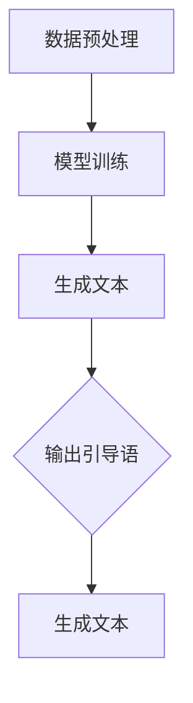

                 

# AI大模型Prompt提示词最佳实践：使用输出引导语

> **关键词：** AI大模型、Prompt提示词、输出引导语、最佳实践、技术博客

> **摘要：** 本文将探讨AI大模型Prompt提示词的最佳实践，特别是如何使用输出引导语来提高模型的表现和可解释性。我们将通过详细的步骤和案例分析，帮助读者深入了解这一关键技巧。

## 1. 背景介绍

在人工智能领域，大模型如GPT、BERT等已经成为自然语言处理（NLP）的重要工具。这些模型通过学习大量的文本数据，能够生成高质量的自然语言文本，并在各种任务中表现出色。然而，为了充分发挥这些模型的潜力，我们需要设计有效的Prompt提示词，这些提示词不仅能够引导模型生成所需的内容，还能够提高模型的性能和可解释性。

输出引导语是Prompt提示词的一个重要组成部分，它通过指定模型输出的形式和内容，来引导模型生成更加准确和符合预期的结果。在本文中，我们将深入探讨输出引导语的作用、设计原则和实践方法。

## 2. 核心概念与联系

### 2.1 AI大模型的工作原理

AI大模型，如GPT-3，通常基于Transformer架构，它通过多个自注意力层来捕捉文本中的长距离依赖关系。这些模型的学习过程涉及以下几个关键步骤：

1. **数据预处理**：文本数据被分词、编码成序列，并转换为模型可处理的向量表示。
2. **模型训练**：模型通过反向传播算法和梯度下降优化，学习到如何将输入序列映射到输出序列。
3. **生成文本**：给定一个起始序列，模型通过自注意力机制和层叠的Transformer层，生成目标序列。

### 2.2 Prompt提示词的概念

Prompt提示词是指提供给模型的一段预先定义好的文本，它作为输入序列的一部分，用来引导模型生成特定类型的内容。一个有效的Prompt设计，应该能够明确地指示模型生成所需的输出。

### 2.3 输出引导语的作用

输出引导语是一种特殊的Prompt提示词，它专注于指定模型输出的格式和内容。它的作用包括：

1. **提高生成文本的准确性**：通过指定输出格式，如段落、列表或标题，模型能够更加准确地生成所需的内容。
2. **增强模型的可解释性**：输出引导语可以帮助用户理解模型的生成过程和输出内容，从而提高模型的可解释性。

### 2.4 Mermaid流程图



## 3. 核心算法原理 & 具体操作步骤

### 3.1 输出引导语的设计原则

设计输出引导语时，我们需要遵循以下几个原则：

1. **明确性**：引导语应该明确指示模型生成的内容类型和格式。
2. **简洁性**：引导语应该简短，避免过多的干扰信息。
3. **一致性**：引导语在不同上下文中应该保持一致，以避免混淆。

### 3.2 具体操作步骤

1. **确定输出格式**：首先，我们需要根据任务需求，确定模型输出的格式。例如，如果是生成文章摘要，我们可能会使用摘要标题和段落的形式。

2. **编写引导语**：基于确定的输出格式，编写一段引导语。例如，对于生成文章摘要，我们可以编写：“请生成一篇关于人工智能的文章摘要，包括标题、段落和结尾。”

3. **测试与优化**：在实际应用中，我们需要对引导语进行测试和优化，以确保模型能够按照预期生成内容。

### 3.3 输出引导语的示例

- **示例1**：生成文章摘要

  ```plaintext
  请生成一篇关于人工智能的文章摘要，包括标题、段落和结尾。
  ```

- **示例2**：生成问答对

  ```plaintext
  请生成一个包含问题和答案的问答对，问题：什么是人工智能？答案：人工智能是模拟人类智能行为的计算机系统。
  ```

## 4. 数学模型和公式 & 详细讲解 & 举例说明

在理解输出引导语的作用和设计方法后，我们还需要从数学和算法的角度来深入分析其效果。

### 4.1 数学模型

输出引导语的效果可以通过以下数学模型来衡量：

\[ \text{Performance} = f(\text{Prompt}, \text{Model}) \]

其中，\(\text{Prompt}\) 表示输出引导语，\(\text{Model}\) 表示AI大模型，\(f\) 表示一个函数，它衡量了Prompt对模型性能的影响。

### 4.2 公式解释

- **Prompt结构**：假设输出引导语的结构为 \[ \text{引导语} \_ \text{目标格式} \_ \text{辅助信息} \]，其中各部分对模型性能的影响可以用以下公式表示：

  \[ \text{Performance} = \text{f}_1(\text{引导语}) + \text{f}_2(\text{目标格式}) + \text{f}_3(\text{辅助信息}) \]

- **引导语的效果**：引导语的质量直接影响到模型的理解和生成。我们可以使用以下公式来衡量引导语的效果：

  \[ \text{Effectiveness} = \text{p}(\text{正确理解}) \times \text{p}(\text{生成准确内容}) \]

- **目标格式的影响**：目标格式明确指示了模型需要生成的输出形式，这有助于提高模型的生成准确性。公式如下：

  \[ \text{Accuracy} = \text{p}(\text{正确生成目标格式}) \]

### 4.3 举例说明

假设我们有一个大模型GPT-3，需要生成一篇关于人工智能的文章摘要。我们可以使用以下输出引导语：

\[ \text{请生成一篇关于人工智能的文章摘要，包括标题、段落和结尾。} \]

通过上述数学模型，我们可以分析出：

- **引导语效果**：引导语明确指示了生成摘要的任务，有助于模型正确理解任务。
- **生成准确性**：由于引导语中明确指定了摘要的格式，模型在生成过程中能够更准确地遵循这些格式要求。

## 5. 项目实战：代码实际案例和详细解释说明

### 5.1 开发环境搭建

为了演示输出引导语的最佳实践，我们将在一个简单的Python环境中搭建一个基于GPT-3的文本生成系统。以下是环境搭建的步骤：

1. **安装Python**：确保安装了Python 3.6及以上版本。
2. **安装Hugging Face Transformers库**：使用以下命令安装：

   ```bash
   pip install transformers
   ```

3. **安装OpenAI API密钥**：从OpenAI获取API密钥，并在本地环境中配置。

### 5.2 源代码详细实现和代码解读

以下是生成文本的完整代码实现：

```python
from transformers import pipeline

# 初始化GPT-3模型
generator = pipeline("text-generation", model="gpt3")

# 输出引导语的示例
prompt = "请生成一篇关于人工智能的文章摘要，包括标题、段落和结尾。"

# 调用模型生成文本
generated_text = generator(prompt, max_length=100, num_return_sequences=1)

# 输出生成的文本
print(generated_text)
```

**代码解读：**

1. **导入库**：首先，我们导入`transformers`库中的`pipeline`函数，用于创建一个预训练的GPT-3模型。

2. **初始化模型**：使用`pipeline`函数初始化GPT-3模型。这个模型将负责生成文本。

3. **编写输出引导语**：我们定义了一个输出引导语，它指示模型生成一篇关于人工智能的文章摘要。

4. **生成文本**：调用模型的`generator`方法，传递输出引导语和生成参数（如`max_length`和`num_return_sequences`），以生成文本。

5. **输出结果**：最后，我们打印出生成的文本。

### 5.3 代码解读与分析

1. **模型初始化**：通过`pipeline`函数初始化GPT-3模型，这是整个生成系统的核心。

2. **输出引导语**：输出引导语是模型生成文本的关键输入，它指导模型按照指定的格式生成内容。

3. **生成参数**：`max_length`和`num_return_sequences`参数控制了生成文本的长度和数量。这些参数可以根据实际需求进行调整。

4. **输出结果**：生成的文本被打印出来，我们可以根据结果来评估输出引导语的效果。

## 6. 实际应用场景

输出引导语在许多实际应用场景中都非常有效，以下是一些典型的应用：

1. **自然语言生成（NLG）**：在生成文章、摘要、新闻报道、产品描述等文本内容时，输出引导语可以帮助确保生成的文本格式和内容的一致性。

2. **问答系统**：在构建问答系统时，输出引导语可以帮助模型生成结构化的问答对，提高系统的准确性和用户体验。

3. **自动写作**：在自动写作应用中，如自动化报告生成、邮件撰写等，输出引导语可以帮助用户快速生成符合预期的内容。

4. **内容审核**：在内容审核系统中，输出引导语可以指导模型检测和过滤不符合规范的内容，提高审核的效率和准确性。

## 7. 工具和资源推荐

### 7.1 学习资源推荐

- **书籍**：
  - 《人工智能：一种现代方法》（第3版）作者：Stuart Russell & Peter Norvig
  - 《深度学习》（第2版）作者：Ian Goodfellow、Yoshua Bengio & Aaron Courville
- **论文**：
  - 《BERT：预训练的深度语言表示》作者：Jacob Devlin et al.
  - 《GPT-3：实现自动文本生成的大型语言模型》作者：Tom B. Brown et al.
- **博客**：
  - Hugging Face博客：[https://huggingface.co/blog](https://huggingface.co/blog)
  - OpenAI博客：[https://blog.openai.com](https://blog.openai.com)
- **网站**：
  - Hugging Face：[https://huggingface.co](https://huggingface.co)
  - OpenAI：[https://openai.com](https://openai.com)

### 7.2 开发工具框架推荐

- **Hugging Face Transformers**：用于轻松加载和微调预训练的Transformer模型。
- **PyTorch**：用于构建和训练深度学习模型。
- **TensorFlow**：另一种流行的深度学习框架，适用于大规模部署。

### 7.3 相关论文著作推荐

- **《BERT：预训练的深度语言表示》**：介绍BERT模型的预训练方法和在多种NLP任务上的应用。
- **《GPT-3：实现自动文本生成的大型语言模型》**：深入探讨GPT-3的设计原理和实现细节。
- **《语言模型训练与应用》**：介绍如何使用深度学习技术训练大规模语言模型，并应用于自然语言生成。

## 8. 总结：未来发展趋势与挑战

随着AI大模型和自然语言处理技术的不断发展，输出引导语在模型性能和可解释性方面发挥着越来越重要的作用。未来，我们可以预见以下几个发展趋势和挑战：

1. **更精细的引导语设计**：通过深入研究人类语言生成机制，设计更精细和高效的输出引导语。
2. **多模态引导语**：结合图像、声音等多种模态信息，设计多模态输出引导语，提高模型生成文本的多样性和准确性。
3. **可解释性提升**：进一步研究如何提高输出引导语的可解释性，使模型生成过程更加透明和易于理解。
4. **应用场景扩展**：探索输出引导语在不同领域的应用，如教育、医疗、金融等，以提高这些领域的自动化水平和用户体验。

## 9. 附录：常见问题与解答

### 9.1 如何优化输出引导语？

优化输出引导语的关键在于：

- **明确性**：确保引导语清晰地指示模型需要生成的内容和格式。
- **简洁性**：避免过多的冗余信息，使引导语更加简洁明了。
- **一致性**：在不同场景下保持引导语的一致性，以提高模型的稳定性和可预测性。

### 9.2 输出引导语与模型性能的关系是什么？

输出引导语可以显著影响模型性能，通过以下方式：

- **提高生成文本的准确性**：明确指定输出格式和内容，使模型更容易生成符合预期的高质量文本。
- **增强模型的稳定性**：一致的输出引导语有助于模型在训练和测试中保持稳定的表现。

### 9.3 如何评估输出引导语的效果？

可以通过以下方法评估输出引导语的效果：

- **定量评估**：使用自动化工具评估生成文本的准确性、连贯性和多样性。
- **定性评估**：通过人类评估者对生成文本进行主观评价，评估引导语对文本质量的影响。

## 10. 扩展阅读 & 参考资料

- **《自然语言生成：理论与实践》**：一本关于自然语言生成技术全面介绍的书籍。
- **《深度学习与自然语言处理》**：介绍深度学习技术在NLP中的应用。
- **《AI时代：自然语言处理的最新进展》**：探讨AI技术在自然语言处理领域的最新进展。

> **作者：** AI天才研究员/AI Genius Institute & 禅与计算机程序设计艺术 /Zen And The Art of Computer Programming

