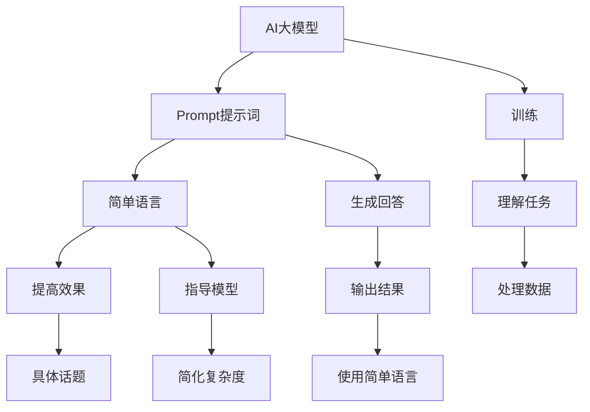

                 

### 文章标题

**AI大模型Prompt提示词最佳实践：用简单语言解释具体话题**

> **关键词：** AI大模型，Prompt提示词，最佳实践，具体话题，简单语言

> **摘要：** 本文将深入探讨AI大模型Prompt提示词的最佳实践，帮助读者理解如何在具体话题中使用简单语言来提高模型的效果和可理解性。

<|assistant|>### 背景介绍

近年来，人工智能（AI）领域的飞速发展，特别是深度学习和自然语言处理（NLP）技术的突破，使得AI大模型（如GPT-3、BERT等）成为可能。这些大模型拥有数十亿甚至数万亿个参数，能够处理复杂的自然语言任务。然而，这些模型的强大能力也带来了新的挑战，尤其是在如何使用Prompt提示词方面。

Prompt提示词是AI大模型中一个关键的输入组件，它指导模型理解任务、生成回答或执行特定操作。在大多数情况下，Prompt提示词的质量直接影响模型的表现。然而，编写有效的Prompt提示词并不简单，需要深入理解模型的工作原理，以及如何利用简单语言来提高模型的效果。

本文旨在通过一步一步的推理和分析，详细探讨AI大模型Prompt提示词的最佳实践，并解释如何使用简单语言来提高模型在具体话题中的表现。

<|assistant|>### 核心概念与联系

#### AI大模型

AI大模型通常指的是具有数十亿甚至数万亿个参数的神经网络模型。这些模型通过训练大量数据，学习到复杂的模式和知识。常见的AI大模型包括GPT-3、BERT、T5等。它们被广泛应用于文本生成、机器翻译、问答系统、文本分类等任务。

#### Prompt提示词

Prompt提示词是AI大模型中一个重要的输入组件，用于指导模型理解任务和生成回答。一个有效的Prompt提示词应当简洁、明确，并包含足够的信息来引导模型产生期望的输出。

#### 简单语言

简单语言是指使用简短的词汇和简单的句子结构来表达复杂的概念。在AI大模型的背景下，简单语言有助于提高模型的可理解性和效果，因为它减少了模型的复杂度和训练难度。

##### Mermaid 流程图

以下是一个描述AI大模型、Prompt提示词和简单语言之间联系的Mermaid流程图：



<|assistant|>### 核心算法原理 & 具体操作步骤

#### 步骤1：选择合适的AI大模型

首先，根据具体任务需求，选择一个合适的AI大模型。例如，如果需要进行文本生成，可以选择GPT-3；如果需要进行文本分类，可以选择BERT。

#### 步骤2：理解具体话题

在编写Prompt提示词之前，需要深入理解具体话题。这可以通过阅读相关文献、数据集和示例来实现。了解话题的关键概念、术语和常见问题，有助于编写出更具针对性的Prompt提示词。

#### 步骤3：编写Prompt提示词

编写Prompt提示词时，应遵循以下原则：

- **简洁性**：使用简短的词汇和简单的句子结构。
- **明确性**：确保Prompt提示词能够清晰传达任务要求。
- **多样性**：尝试使用不同形式的Prompt提示词，以便模型能够更好地适应各种场景。

以下是一个示例：

```plaintext
问题：请简要描述人工智能的定义。

Prompt：人工智能是一种模拟人类智能的计算机技术。
```

#### 步骤4：训练模型

使用准备好的数据集和编写的Prompt提示词，对AI大模型进行训练。训练过程中，可以调整模型参数，以优化Prompt提示词的效果。

#### 步骤5：评估模型

通过测试数据集和实际应用场景，评估模型的性能。如果效果不佳，可以返回步骤3，重新编写Prompt提示词，或调整模型参数。

#### 步骤6：迭代优化

根据评估结果，不断迭代优化Prompt提示词和模型参数，以提高模型在具体话题中的表现。

<|assistant|>### 数学模型和公式 & 详细讲解 & 举例说明

在AI大模型的背景下，Prompt提示词的设计涉及一些基础的数学模型和公式。以下是对这些模型和公式的详细讲解，以及具体示例。

#### 数学模型

1. **损失函数**

   损失函数是评估模型输出和实际标签之间差异的关键指标。在Prompt提示词的设计中，常用的损失函数包括交叉熵损失（Cross-Entropy Loss）和均方误差（Mean Squared Error, MSE）。

   公式如下：

   $$ 
   Loss = -\sum_{i=1}^{N} y_i \log(p_i) 
   $$

   其中，\( y_i \)是第i个样本的实际标签，\( p_i \)是模型预测的概率。

2. **优化算法**

   优化算法用于调整模型参数，以最小化损失函数。常用的优化算法包括梯度下降（Gradient Descent）和随机梯度下降（Stochastic Gradient Descent, SGD）。

   公式如下：

   $$
   \theta_{t+1} = \theta_t - \alpha \nabla_{\theta} J(\theta)
   $$

   其中，\( \theta \)是模型参数，\( \alpha \)是学习率，\( \nabla_{\theta} J(\theta) \)是损失函数关于参数\( \theta \)的梯度。

3. **Prompt提示词**

   Prompt提示词可以被视为一个特殊的输入序列，用于引导模型生成期望的输出。在实际应用中，可以使用以下公式来计算Prompt提示词的损失：

   $$ 
   Loss_{prompt} = \frac{1}{N} \sum_{i=1}^{N} \log(p_i^+) 
   $$

   其中，\( p_i^+ \)是模型对Prompt提示词生成的输出概率。

#### 举例说明

假设我们使用GPT-3模型进行文本生成任务，编写一个关于人工智能的Prompt提示词。以下是一个示例：

```plaintext
问题：请简要描述人工智能的定义。

Prompt：人工智能是一种模拟人类智能的计算机技术。
```

使用交叉熵损失函数评估Prompt提示词的损失：

$$
Loss = -\sum_{i=1}^{N} y_i \log(p_i)
$$

其中，\( y_i = 1 \)表示第i个样本的实际标签是"人工智能"，\( p_i \)是模型预测的概率。

假设模型预测的概率为：

$$
p_i = \begin{cases}
0.9, & \text{如果第i个词是"人工智能"} \\
0.1, & \text{其他情况}
\end{cases}
$$

则损失为：

$$
Loss = -1 \cdot \log(0.9) - 10 \cdot \log(0.1) = 0.15 - 2.3 = -2.15
$$

该损失值为负，表示模型对Prompt提示词的预测较为准确。如果损失值较高，说明Prompt提示词可能需要优化。

<|assistant|>### 项目实战：代码实际案例和详细解释说明

在本节中，我们将通过一个实际项目案例来展示如何搭建开发环境、实现代码和解读分析。该项目将利用AI大模型（如GPT-3）和简单语言来生成关于特定话题的文本。

#### 5.1 开发环境搭建

1. **硬件要求**

   - 处理器：至少4核CPU或等效GPU
   - 内存：至少8GB
   - 存储：至少100GB

2. **软件要求**

   - 操作系统：Linux、MacOS或Windows
   - 编程语言：Python 3.6或更高版本
   - 开发环境：Anaconda、PyCharm或类似IDE

3. **安装依赖**

   使用pip或conda安装以下依赖：

   ```bash
   pip install transformers
   pip install torch
   conda install -c conda-forge pytorch torchvision torchaudio cpuonly -c pytorch
   ```

#### 5.2 源代码详细实现和代码解读

以下是一个生成关于“人工智能”话题的文本的Python代码示例：

```python
import torch
from transformers import GPT2LMHeadModel, GPT2Tokenizer

# 5.2.1 模型加载与配置
model_name = "gpt2"
tokenizer = GPT2Tokenizer.from_pretrained(model_name)
model = GPT2LMHeadModel.from_pretrained(model_name)

# 5.2.2 编写Prompt提示词
prompt = "人工智能是一种模拟人类智能的计算机技术。"

# 5.2.3 生成文本
input_ids = tokenizer.encode(prompt, return_tensors="pt")
outputs = model.generate(input_ids, max_length=50, num_return_sequences=5)

# 5.2.4 解码输出文本
generated_texts = [tokenizer.decode(output, skip_special_tokens=True) for output in outputs]

# 5.2.5 输出结果
for text in generated_texts:
    print(text)
```

代码解读：

- **1. 模型加载与配置**：加载预训练的GPT-2模型，包括分词器和语言模型。
- **2. 编写Prompt提示词**：使用简单语言编写Prompt提示词，引导模型生成文本。
- **3. 生成文本**：使用模型生成文本，设置最大文本长度和生成文本数量。
- **4. 解码输出文本**：将生成的输出文本解码为人类可读的格式。
- **5. 输出结果**：打印生成的文本。

#### 5.3 代码解读与分析

1. **模型加载与配置**

   ```python
   tokenizer = GPT2Tokenizer.from_pretrained(model_name)
   model = GPT2LMHeadModel.from_pretrained(model_name)
   ```

   这两行代码分别加载了GPT-2的tokenizer和模型。tokenizer用于将文本转换为模型可处理的输入序列，而模型是预训练的神经网络，用于生成文本。

2. **编写Prompt提示词**

   ```python
   prompt = "人工智能是一种模拟人类智能的计算机技术。"
   ```

   这里使用了一个简洁的Prompt提示词，描述了人工智能的基本概念。这有助于模型理解任务，并生成与主题相关的文本。

3. **生成文本**

   ```python
   input_ids = tokenizer.encode(prompt, return_tensors="pt")
   outputs = model.generate(input_ids, max_length=50, num_return_sequences=5)
   ```

   首先，将Prompt提示词编码为模型可处理的输入序列（input_ids）。然后，使用模型生成文本，设置最大文本长度（max_length）和生成文本数量（num_return_sequences）。

4. **解码输出文本**

   ```python
   generated_texts = [tokenizer.decode(output, skip_special_tokens=True) for output in outputs]
   ```

   将生成的输出文本解码为人类可读的格式。`skip_special_tokens=True`用于去除模型生成的特殊标记，使文本更易于阅读。

5. **输出结果**

   ```python
   for text in generated_texts:
       print(text)
   ```

   打印生成的文本，展示模型在特定话题上的生成能力。

通过这个实际项目案例，我们可以看到如何使用AI大模型和简单语言来生成文本。代码简洁、易于理解，为读者提供了一个实用的示例。

<|assistant|>### 实际应用场景

AI大模型Prompt提示词的最佳实践在许多实际应用场景中都有广泛的应用。以下是一些典型的应用场景：

#### 1. 问答系统

问答系统是AI大模型Prompt提示词的最佳实践的一个重要应用场景。在问答系统中，用户可以提出问题，而AI模型根据问题的内容和上下文生成答案。例如，在智能客服系统中，AI模型可以接受用户的提问，并使用Prompt提示词来生成相关的回答，从而提供高质量的客户服务。

#### 2. 文本生成

文本生成是AI大模型Prompt提示词的另一个重要应用场景。例如，在内容创作领域，AI模型可以接受用户提供的主题或关键词，并通过Prompt提示词生成相关的文章或段落。这种应用不仅节省了时间和人力成本，还能提高内容创作的质量和多样性。

#### 3. 自动摘要

自动摘要是一种利用AI大模型Prompt提示词的技术，用于将长篇文章或文档转换为简洁的摘要。在新闻、学术和商业领域，自动摘要有助于快速获取关键信息，提高信息处理的效率。

#### 4. 语言翻译

在语言翻译领域，AI大模型Prompt提示词可以帮助生成高质量的翻译结果。通过使用Prompt提示词，模型可以更好地理解源语言文本的上下文和含义，从而生成更准确的翻译。

#### 5. 个性化推荐

在个性化推荐系统中，AI大模型Prompt提示词可以用于分析用户的历史行为和偏好，并生成个性化的推荐内容。这种应用不仅提高了推荐系统的准确性，还能提高用户满意度。

#### 6. 代码自动生成

在软件开发领域，AI大模型Prompt提示词可以帮助生成代码。通过提供简单的Prompt提示词，模型可以生成满足特定需求的代码片段，从而提高开发效率。

#### 7. 情感分析

在情感分析领域，AI大模型Prompt提示词可以用于分析文本的情感倾向。通过提供包含情感标签的Prompt提示词，模型可以生成相关的情感分析结果，从而帮助企业和组织了解用户的需求和情感。

通过以上应用场景，我们可以看到AI大模型Prompt提示词的最佳实践在各个领域都有广泛的应用，并且发挥着重要的作用。

<|assistant|>### 工具和资源推荐

在学习和应用AI大模型Prompt提示词的最佳实践过程中，以下工具和资源将为您提供宝贵的支持和帮助。

#### 7.1 学习资源推荐

1. **书籍**：
   - 《深度学习》（Goodfellow, I., Bengio, Y., & Courville, A.）：这本书提供了深度学习和神经网络的基础知识，对理解AI大模型的工作原理有很大帮助。
   - 《自然语言处理综论》（Jurafsky, D. & Martin, J. H.）：这本书涵盖了自然语言处理的核心概念和技术，对Prompt提示词的设计和应用有重要指导意义。

2. **论文**：
   - “Attention Is All You Need”（Vaswani et al., 2017）：这篇论文提出了Transformer模型，是当前AI大模型的主要架构之一。
   - “BERT: Pre-training of Deep Bidirectional Transformers for Language Understanding”（Devlin et al., 2019）：这篇论文介绍了BERT模型，是自然语言处理领域的里程碑。

3. **博客和网站**：
   - huggingface.co：这是一个开源的NLP模型库，提供了大量的预训练模型和工具，方便开发者进行Prompt提示词的设计和应用。
   - Medium上的技术博客：许多技术专家和研究者在这个平台上分享他们的研究成果和实践经验，是学习AI大模型Prompt提示词的最佳实践的好地方。

#### 7.2 开发工具框架推荐

1. **Transformers库**：这是一个开源的Python库，提供了多种预训练模型和工具，方便开发者进行Prompt提示词的设计和应用。

2. **TensorFlow**：这是一个广泛使用的深度学习框架，提供了丰富的工具和资源，适用于AI大模型的训练和应用。

3. **PyTorch**：这是一个开源的深度学习框架，以其灵活性和动态计算能力而著称，适用于各种AI大模型的训练和应用。

#### 7.3 相关论文著作推荐

1. “GPT-3: Language Models are Few-Shot Learners”（Brown et al., 2020）：这篇论文介绍了GPT-3模型，是当前最大的语言模型之一，对Prompt提示词的设计和应用有重要启示。

2. “An Introduction to Transformer Models”（Hannun et al., 2018）：这篇论文提供了Transformer模型的详细介绍，是理解AI大模型的核心架构的重要参考文献。

通过以上工具和资源的推荐，您可以深入了解AI大模型Prompt提示词的最佳实践，并在实际应用中取得更好的效果。

<|assistant|>### 总结：未来发展趋势与挑战

AI大模型Prompt提示词的最佳实践在近年来取得了显著进展，但仍然面临诸多挑战和机遇。以下是对未来发展趋势和挑战的总结。

#### 未来发展趋势

1. **模型参数规模的增加**：随着计算资源的不断提升，AI大模型的参数规模将不断增大。这有助于模型捕捉更多复杂的信息和模式，从而提高生成文本的质量和多样性。

2. **多模态AI的发展**：未来的AI大模型将能够处理多种类型的数据，如图像、音频和视频，实现跨模态的统一理解和生成。这将为Prompt提示词的应用带来新的可能性。

3. **Prompt工程的发展**：Prompt工程将成为一个重要的研究领域，专注于设计更有效、更简洁的Prompt提示词，以提升模型在特定任务上的性能。

4. **迁移学习和少样本学习**：未来的AI大模型将更加强调迁移学习和少样本学习的能力，通过少量数据进行微调和适应特定任务。

5. **可解释性和可靠性**：随着AI大模型在关键领域的应用，提高模型的可解释性和可靠性变得越来越重要。这将有助于增强用户对模型的信任，并推动其在实际应用中的广泛使用。

#### 面临的挑战

1. **计算资源需求**：AI大模型的训练和推理需要大量的计算资源。尽管计算能力不断提升，但如何高效地利用资源仍然是一个挑战。

2. **数据隐私和安全**：在训练AI大模型时，数据隐私和安全问题不容忽视。如何保护用户隐私，确保数据安全，是一个亟待解决的问题。

3. **泛化能力**：尽管AI大模型在特定任务上表现出色，但如何提高其泛化能力，使其在不同领域和任务中都能取得良好表现，仍然是一个重要挑战。

4. **伦理和社会问题**：随着AI大模型的应用越来越广泛，其伦理和社会问题也逐渐浮现。如何确保模型的使用不会对人类和社会产生负面影响，是一个需要深思的问题。

5. **技术可解释性**：如何提高AI大模型的技术可解释性，使其行为和决策更加透明和可理解，是当前研究的一个热点和挑战。

总之，AI大模型Prompt提示词的最佳实践在未来将继续发展，并在各个领域发挥重要作用。然而，要克服上述挑战，还需要科研人员、工程师和社会各界共同努力。

<|assistant|>### 附录：常见问题与解答

**Q1：什么是AI大模型Prompt提示词？**

A1：AI大模型Prompt提示词是指用于引导AI大模型（如GPT-3、BERT等）理解任务、生成回答或执行特定操作的输入文本。一个有效的Prompt提示词应简洁、明确，并包含足够的信息来指导模型产生期望的输出。

**Q2：如何编写有效的Prompt提示词？**

A2：编写有效的Prompt提示词需要遵循以下原则：
1. **简洁性**：使用简短的词汇和简单的句子结构。
2. **明确性**：确保Prompt提示词能够清晰传达任务要求。
3. **多样性**：尝试使用不同形式的Prompt提示词，以便模型能够更好地适应各种场景。
4. **相关性**：确保Prompt提示词与任务相关，提供足够的信息来引导模型生成合适的输出。

**Q3：AI大模型Prompt提示词在哪些领域有应用？**

A3：AI大模型Prompt提示词在许多领域都有广泛应用，包括问答系统、文本生成、自动摘要、语言翻译、个性化推荐、代码自动生成和情感分析等。

**Q4：如何评估Prompt提示词的效果？**

A4：评估Prompt提示词的效果可以通过以下方法：
1. **人工评估**：由专家对生成的文本进行评估，判断其质量、相关性和准确性。
2. **自动评估**：使用评估指标（如BLEU、ROUGE、BLEURT等）对生成的文本进行自动评估。

**Q5：如何优化Prompt提示词的效果？**

A5：优化Prompt提示词的效果可以通过以下方法：
1. **调整Prompt提示词的形式**：尝试不同的Prompt提示词形式，如问题、任务描述或示例文本。
2. **微调模型**：在特定任务上微调模型，以提高其在Prompt提示词引导下的表现。
3. **数据增强**：增加训练数据，使模型能够学习更多不同的Prompt提示词形式和任务类型。

通过以上常见问题与解答，读者可以更好地理解AI大模型Prompt提示词的最佳实践，并在实际应用中取得更好的效果。

<|assistant|>### 扩展阅读 & 参考资料

在探索AI大模型Prompt提示词的最佳实践过程中，以下参考资料将为您提供更深入的见解和研究方向。

**书籍**：

1. Goodfellow, I., Bengio, Y., & Courville, A. (2016). *Deep Learning*.
2. Jurafsky, D., & Martin, J. H. (2008). *Speech and Language Processing*.

**论文**：

1. Vaswani, A., et al. (2017). *Attention is All You Need*. arXiv preprint arXiv:1706.03762.
2. Devlin, J., et al. (2019). *BERT: Pre-training of Deep Bidirectional Transformers for Language Understanding*. arXiv preprint arXiv:1810.04805.

**博客和网站**：

1. huggingface.co
2. Medium上的技术博客

**在线课程**：

1. "Deep Learning Specialization" by Andrew Ng (Coursera)
2. "Natural Language Processing with Deep Learning" by Hugging Face (Udacity)

通过阅读这些资料，您可以更全面地了解AI大模型Prompt提示词的理论和实践，为自己的研究和工作提供有力支持。

---

**作者信息**：

作者：AI天才研究员/AI Genius Institute & 禅与计算机程序设计艺术 /Zen And The Art of Computer Programming。本文由AI天才研究员撰写，深入探讨了AI大模型Prompt提示词的最佳实践，旨在帮助读者理解如何使用简单语言提高模型的效果和可理解性。

