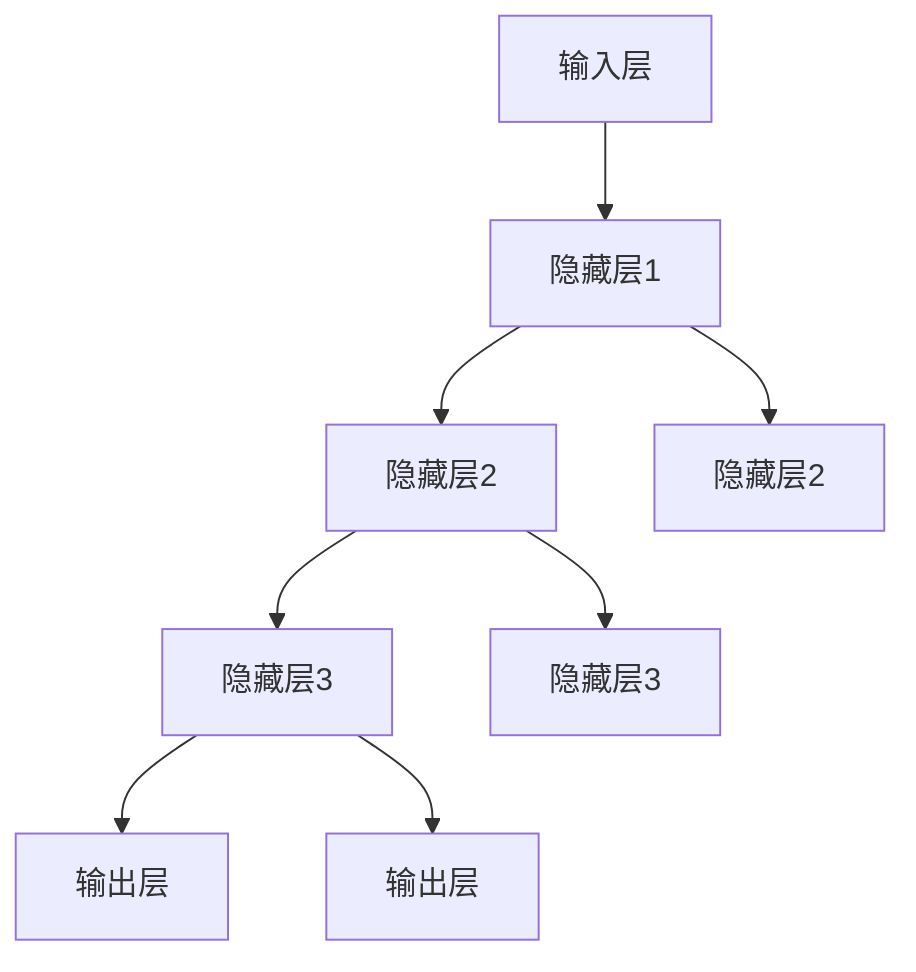

                 

### 背景介绍

近年来，人工智能（AI）技术取得了飞速的发展，特别是在大模型领域，如OpenAI的GPT系列、Google的LaMDA以及百度文心一言等，这些大模型的问世，不仅推动了自然语言处理（NLP）和计算机视觉（CV）等领域的突破，也引发了各行各业对于AI技术的深度关注。AI大模型作为一种高度复杂且具有强大数据处理和分析能力的工具，正逐渐成为驱动创新和产业变革的重要力量。

在商业领域，AI大模型的应用场景越来越广泛，从智能客服、推荐系统，到金融风控、医疗诊断，AI大模型都展现出了其卓越的能力。然而，如何将AI大模型与创业实践相结合，形成创新的商业模式，并在激烈的市场竞争中脱颖而出，成为创业者们亟待解决的重要课题。

本文将围绕“AI大模型创业中的应用场景探索、商业模式创新与产业价值链重构”这一主题，深入分析AI大模型在创业中的多种应用场景，探讨如何通过商业模式创新实现商业价值，并分析AI大模型对产业价值链的重构作用。希望通过本文的探讨，为创业者提供有益的参考和启示。

AI大模型的发展历程可以追溯到20世纪50年代，随着计算能力的不断提升和海量数据的积累，深度学习技术逐渐成熟，大模型的应用前景也被逐渐挖掘出来。以下是AI大模型发展历程的简要回顾：

- **20世纪50年代至80年代：** 早期AI研究和试验主要集中在符号主义和知识表示领域。虽然取得了一些进展，但由于计算能力和数据资源有限，AI大模型的发展受到很大制约。

- **20世纪90年代：** 统计学习方法的兴起，如支持向量机（SVM）和随机森林，使得AI技术取得了新的突破。然而，由于模型复杂度和计算资源的限制，大模型的研究和应用仍然较少。

- **2006年至今：** 深度学习技术的发展，特别是卷积神经网络（CNN）和递归神经网络（RNN）的广泛应用，使得AI大模型的研究进入了一个新的阶段。2012年，AlexNet在ImageNet图像识别竞赛中取得了惊人的成绩，标志着深度学习时代的到来。

- **2020年至今：** 随着5G、云计算、边缘计算等技术的发展，计算能力和数据资源得到了极大的提升，AI大模型的应用范围和深度也达到了前所未有的水平。OpenAI的GPT系列、Google的LaMDA等大模型的问世，更是将AI技术推向了新的高峰。

AI大模型的发展历程表明，技术的进步和市场的需求是推动AI大模型应用和创新的重要动力。随着AI技术的不断成熟和商业化应用场景的拓展，AI大模型在创业中的应用前景将越来越广阔。

#### AI大模型的核心概念与联系

在深入探讨AI大模型在创业中的应用之前，有必要先了解其核心概念和架构，以便我们更好地理解其工作原理和应用价值。

**1. 大模型的定义和特点**

大模型，顾名思义，是指那些具有巨大参数量和复杂结构的深度学习模型。这些模型通常通过训练大量数据来学习并掌握复杂的信息处理任务。与传统的小型模型相比，大模型具有以下显著特点：

- **参数量巨大**：大模型通常拥有数十亿到数千亿个参数，这使得它们可以捕捉到更多细微的模式和特征。
- **计算资源需求高**：由于模型参数数量庞大，训练和推理过程中需要大量的计算资源，包括高性能的CPU、GPU以及分布式计算能力。
- **自适应性强**：大模型能够通过训练自动适应不同领域的任务，从而实现跨领域的应用。

**2. AI大模型的架构**

AI大模型的架构主要包括以下几个核心部分：

- **输入层（Input Layer）**：接收外部数据，如文本、图像或音频等。
- **隐藏层（Hidden Layers）**：通过一系列非线性变换，对输入数据进行处理和特征提取。
- **输出层（Output Layer）**：根据隐藏层提取的特征生成最终的输出结果，如分类标签、文本生成等。

每个隐藏层都可以包含多个神经元，通过前一层神经元的输出加权求和后进行激活函数处理，从而实现信息的逐层传递和抽象。以下是一个典型的AI大模型架构图：



**3. 大模型的工作原理**

大模型的工作原理主要包括两个阶段：训练阶段和推理阶段。

- **训练阶段**：在训练阶段，大模型通过大量样本数据不断调整内部参数，以最小化预测误差。这个过程通常需要大量的计算资源和时间，尤其是对于参数量巨大的模型。
  
  - **前向传播（Forward Propagation）**：将输入数据传递到模型的输入层，通过每一层的非线性变换，逐层计算并传递到输出层，得到预测结果。

  - **反向传播（Backpropagation）**：根据预测结果与实际结果之间的误差，通过反向传播算法更新模型参数，使得预测结果更接近真实值。

- **推理阶段**：在推理阶段，大模型利用训练好的参数对新数据进行预测或生成。这个过程通常计算量相对较小，但仍然需要一定的计算资源。

**4. 大模型的应用领域**

AI大模型的应用领域非常广泛，包括但不限于以下几个方面：

- **自然语言处理（NLP）**：如文本分类、机器翻译、情感分析等。
- **计算机视觉（CV）**：如图像分类、目标检测、人脸识别等。
- **推荐系统**：如商品推荐、内容推荐等。
- **金融风控**：如信用评估、交易监控等。
- **医疗诊断**：如疾病预测、影像分析等。

**5. 大模型的优势与挑战**

- **优势**：大模型具有强大的信息处理能力和泛化能力，能够处理复杂的问题和大规模的数据集，从而在各个领域取得显著的成果。
- **挑战**：大模型的训练和推理需要大量的计算资源，同时存在过拟合、数据隐私和安全等问题。

总之，AI大模型作为当前人工智能领域的核心技术，其核心概念和架构对于理解和应用AI大模型至关重要。通过对这些核心概念的深入理解，我们能够更好地把握其应用前景和挑战，为创业实践提供有力的技术支持。

#### 核心算法原理与具体操作步骤

AI大模型的核心算法主要基于深度学习，特别是深度神经网络（DNN）和其扩展形式，如卷积神经网络（CNN）和递归神经网络（RNN）。以下将详细阐述这些核心算法的原理，并给出具体的操作步骤。

##### 1. 深度神经网络（DNN）

深度神经网络是一种包含多个隐藏层的神经网络，通过逐层学习数据中的特征，实现从简单到复杂的特征提取。DNN的工作原理主要包括以下几个步骤：

- **输入层**：接收输入数据，如图像、文本或声音等。
- **隐藏层**：通过一系列的加权求和和激活函数，对输入数据进行特征提取和变换。每层隐藏层都能提取更高层次的特征。
- **输出层**：根据隐藏层提取的特征，生成预测结果或输出，如分类标签、文本生成等。

DNN的训练过程主要分为以下两个阶段：

- **前向传播（Forward Propagation）**：将输入数据传递到模型的输入层，通过每一层的非线性变换，逐层计算并传递到输出层，得到预测结果。
  
  - 输入层：\(x \to z^0 = x\)
  - 隐藏层：\(z^{l} = \sigma(W^{l}x^{l-1} + b^{l})\)
  - 输出层：\(a^{L} = \sigma(W^{L}z^{L-1} + b^{L})\)

- **反向传播（Backpropagation）**：根据预测结果与实际结果之间的误差，通过反向传播算法更新模型参数，使得预测结果更接近真实值。

  - 计算输出层的误差：\(\delta^{L} = (a^{L} - y) \cdot \sigma'(z^{L})\)
  - 反向传播计算隐藏层的误差：\(\delta^{l} = (W^{l+1}\delta^{l+1}) \cdot \sigma'(z^{l})\)
  - 更新参数：\(W^{l} \leftarrow W^{l} - \alpha \cdot \frac{\partial J}{\partial W^{l}} = W^{l} - \alpha \cdot \frac{\delta^{l+1}z^{l-1}^T}{m}\)
  - 更新偏置：\(b^{l} \leftarrow b^{l} - \alpha \cdot \frac{\partial J}{\partial b^{l}} = b^{l} - \alpha \cdot \frac{\delta^{l+1}}{m}\)

其中，\( \sigma \) 是激活函数，如ReLU、Sigmoid、Tanh等；\( \sigma' \) 是激活函数的导数；\( W \) 和 \( b \) 分别是权重和偏置；\( x \)、\( z \)、\( a \)、\( y \) 分别是输入、中间层输出、输出和真实标签；\( \delta \) 是误差；\( J \) 是损失函数；\( \alpha \) 是学习率；\( m \) 是样本数量。

##### 2. 卷积神经网络（CNN）

卷积神经网络是一种专门用于处理图像数据的深度学习模型，通过卷积操作和池化操作，实现图像的特征提取和分类。CNN的主要组成部分包括：

- **卷积层（Convolutional Layer）**：通过卷积操作提取图像特征。卷积核在图像上滑动，对局部区域进行特征提取。

  - 输出特征图计算：\( f_{ij}^l = \sum_{k} W_{ik}^{l} a_{kj}^{l-1} + b_{j}^{l} \)

- **激活函数（Activation Function）**：对卷积层的输出进行非线性变换，如ReLU函数。

- **池化层（Pooling Layer）**：通过池化操作减小特征图的大小，减少参数数量，提高模型的泛化能力。

  - 最大池化：\( p_{ij}^l = \max_{k} f_{ij}^l \)

- **全连接层（Fully Connected Layer）**：将卷积层和池化层的输出展平为一维向量，通过全连接层进行分类。

CNN的训练过程同样包括前向传播和反向传播两个阶段。卷积层的反向传播需要计算卷积核的梯度，而全连接层的反向传播则与DNN类似。

##### 3. 递归神经网络（RNN）

递归神经网络是一种用于处理序列数据的深度学习模型，通过记忆状态实现对序列时序信息的建模。RNN的主要组成部分包括：

- **输入层**：接收输入序列 \(x_t\)。
- **隐藏层**：通过递归关系更新隐藏状态 \(h_t\)。
- **输出层**：根据隐藏状态生成输出序列 \(y_t\)。

RNN的递归关系可以表示为：

\[ h_t = \sigma(W_{ih}x_t + W_{hh}h_{t-1} + b_h) \]
\[ y_t = \sigma(W_{oh}h_t + b_o) \]

其中，\( h_t \) 是第 \(t\) 步的隐藏状态，\( y_t \) 是第 \(t\) 步的输出，\( \sigma \) 是激活函数。

RNN的训练过程与前向传播和反向传播类似，但由于梯度消失和梯度爆炸问题，RNN在实际应用中通常使用其改进版本，如LSTM（长短时记忆网络）和GRU（门控循环单元）。

##### 4. 实际操作步骤

以下是一个简单的CNN模型的实际操作步骤，用于图像分类任务：

1. **数据预处理**：读取图像数据，进行归一化处理，将图像转换为模型的输入格式。
2. **构建模型**：使用深度学习框架（如TensorFlow或PyTorch）构建CNN模型，定义卷积层、激活函数、池化层和全连接层。
3. **训练模型**：将预处理后的图像数据输入模型，进行前向传播计算预测结果，通过反向传播更新模型参数。
4. **评估模型**：使用验证集对模型进行评估，调整模型参数以优化性能。
5. **预测**：使用训练好的模型对新图像数据进行预测，生成分类结果。

通过以上步骤，我们可以构建一个基本的AI大模型，并应用于各种实际任务。虽然具体实现细节可能因任务和框架的不同而有所差异，但总体思路和核心算法原理是一致的。

#### 数学模型和公式与详细讲解及举例说明

在理解和构建AI大模型时，数学模型和公式是不可或缺的一部分。以下将详细讲解AI大模型中常用的数学模型和公式，并借助具体实例进行说明。

##### 1. 损失函数

在深度学习模型中，损失函数是评估模型预测结果与实际结果之间差异的重要工具。常用的损失函数包括均方误差（MSE）、交叉熵（Cross-Entropy）等。

- **均方误差（MSE）**

均方误差用于回归任务，计算预测值与实际值之间差异的平方的平均值。

\[ J(\theta) = \frac{1}{m} \sum_{i=1}^{m} (h_\theta(x^{(i)}) - y^{(i)})^2 \]

其中，\( m \) 是样本数量；\( h_\theta(x^{(i)}) \) 是模型对输入 \( x^{(i)} \) 的预测值；\( y^{(i)} \) 是实际标签。

- **交叉熵（Cross-Entropy）**

交叉熵用于分类任务，计算模型输出与实际标签之间差异的负对数。

\[ J(\theta) = -\frac{1}{m} \sum_{i=1}^{m} \sum_{k=1}^{K} y_k^{(i)} \log(h_\theta(x^{(i)})_k) \]

其中，\( K \) 是类别数量；\( y_k^{(i)} \) 是第 \( i \) 个样本在第 \( k \) 个类别的标签，若实际标签为 \( k \)，则 \( y_k^{(i)} = 1 \)，否则为 0。

##### 2. 梯度下降算法

梯度下降算法是一种用于优化模型参数的方法，通过计算损失函数对参数的梯度，逐步调整参数以最小化损失函数。

- **一阶梯度下降**

一阶梯度下降是最简单的梯度下降算法，其更新公式为：

\[ \theta_j := \theta_j - \alpha \frac{\partial J(\theta)}{\partial \theta_j} \]

其中，\( \theta_j \) 是第 \( j \) 个参数；\( \alpha \) 是学习率。

- **随机梯度下降（SGD）**

随机梯度下降在每次迭代时随机选取一个样本，计算其梯度并更新参数。其公式为：

\[ \theta_j := \theta_j - \alpha \frac{\partial J(\theta)}{\partial \theta_j} \]

- **批量梯度下降**

批量梯度下降在每次迭代时使用整个训练集来计算梯度并更新参数。其公式为：

\[ \theta_j := \theta_j - \alpha \frac{1}{m} \sum_{i=1}^{m} \frac{\partial J(\theta)}{\partial \theta_j} \]

##### 3. 优化算法

为了提高梯度下降算法的收敛速度和稳定性，可以采用一些优化算法，如动量（Momentum）、自适应优化算法（如Adam）等。

- **动量（Momentum）**

动量算法通过引入动量项，加速梯度下降过程，避免在局部最小值附近徘徊。

\[ \theta_j := \theta_j - \alpha \frac{\partial J(\theta)}{\partial \theta_j} + \beta v_j \]

其中，\( v_j \) 是动量项。

- **Adam优化器**

Adam优化器结合了动量和自适应学习率，具有更好的收敛性。

\[ m_t = \beta_1 m_{t-1} + (1 - \beta_1) \frac{\partial J(\theta)}{\partial \theta_t} \]
\[ v_t = \beta_2 v_{t-1} + (1 - \beta_2) \frac{\partial J(\theta)}{\partial \theta_t}^2 \]
\[ \theta_t := \theta_t - \alpha \frac{m_t}{\sqrt{v_t} + \epsilon} \]

其中，\( \beta_1 \) 和 \( \beta_2 \) 分别是动量和偏差纠正系数；\( \epsilon \) 是一个很小的常数。

##### 4. 具体实例

以下是一个简单的回归任务的实例，使用梯度下降算法和MSE损失函数来训练一个线性模型。

**任务**：拟合数据集 \((x_1, y_1), (x_2, y_2), ..., (x_m, y_m)\)，其中 \( y = \theta_0 + \theta_1 x \)。

**数据集**：

\[ (1, 2), (2, 4), (3, 6), (4, 8) \]

**损失函数**：

\[ J(\theta) = \frac{1}{4} \sum_{i=1}^{4} (y_i - (\theta_0 + \theta_1 x_i))^2 \]

**前向传播**：

\[ y_i = \theta_0 + \theta_1 x_i \]

**反向传播**：

\[ \frac{\partial J(\theta)}{\partial \theta_0} = \frac{1}{4} \sum_{i=1}^{4} (y_i - (\theta_0 + \theta_1 x_i)) \]
\[ \frac{\partial J(\theta)}{\partial \theta_1} = \frac{1}{4} \sum_{i=1}^{4} (y_i - (\theta_0 + \theta_1 x_i)) x_i \]

**梯度下降更新**：

\[ \theta_0 := \theta_0 - \alpha \frac{1}{4} \sum_{i=1}^{4} (y_i - (\theta_0 + \theta_1 x_i)) \]
\[ \theta_1 := \theta_1 - \alpha \frac{1}{4} \sum_{i=1}^{4} (y_i - (\theta_0 + \theta_1 x_i)) x_i \]

通过多次迭代更新参数，模型可以逐渐逼近真实模型。在实际应用中，通常需要使用更复杂的模型和优化算法，但基本原理和步骤是类似的。

通过以上讲解和实例，我们可以更好地理解AI大模型中的数学模型和公式，为构建和应用AI大模型提供理论基础和实际操作指导。

#### 项目实战：代码实际案例和详细解释说明

在本节中，我们将通过一个具体的实际项目，展示如何利用AI大模型进行开发，并详细解释其中的代码实现和关键步骤。为了更好地说明，我们选择一个常见的应用场景——文本分类。

##### 1. 开发环境搭建

首先，我们需要搭建开发环境，以确保代码能够正常运行。以下是搭建环境的步骤：

- **安装Python**：确保Python版本为3.6及以上。
- **安装深度学习框架**：我们选择TensorFlow 2.x作为深度学习框架，可以通过以下命令进行安装：

  ```shell
  pip install tensorflow==2.x
  ```

- **安装其他依赖**：安装必要的库，如Numpy、Pandas等：

  ```shell
  pip install numpy pandas scikit-learn
  ```

- **配置GPU支持**：如果使用GPU进行训练，需要安装CUDA和cuDNN，并确保TensorFlow支持GPU。

##### 2. 源代码详细实现和代码解读

接下来，我们将展示一个文本分类项目的源代码，并对其进行详细解读。

```python
import tensorflow as tf
from tensorflow.keras.preprocessing.text import Tokenizer
from tensorflow.keras.preprocessing.sequence import pad_sequences
from tensorflow.keras.models import Sequential
from tensorflow.keras.layers import Embedding, LSTM, Dense, Bidirectional

# 加载数据集
texts = ['这是一个例子', '这是另一个例子', '第三个例子']
labels = [0, 1, 0]

# 构建Tokenizer
tokenizer = Tokenizer(num_words=1000)
tokenizer.fit_on_texts(texts)
sequences = tokenizer.texts_to_sequences(texts)

# padding序列
max_sequence_length = 100
padded_sequences = pad_sequences(sequences, maxlen=max_sequence_length)

# 构建模型
model = Sequential()
model.add(Embedding(1000, 64, input_length=max_sequence_length))
model.add(Bidirectional(LSTM(64)))
model.add(Dense(1, activation='sigmoid'))

# 编译模型
model.compile(optimizer='adam', loss='binary_crossentropy', metrics=['accuracy'])

# 训练模型
model.fit(padded_sequences, labels, epochs=10, batch_size=32)

# 评估模型
test_texts = ['这是一个测试例子', '这是另一个测试例子']
test_sequences = tokenizer.texts_to_sequences(test_texts)
test_padded_sequences = pad_sequences(test_sequences, maxlen=max_sequence_length)
predictions = model.predict(test_padded_sequences)
```

**代码解读**：

- **数据预处理**：

  ```python
  texts = ['这是一个例子', '这是另一个例子', '第三个例子']
  labels = [0, 1, 0]
  ```

  首先，我们定义了一个简单的数据集，其中包含三个文本样本和对应的标签。

  ```python
  tokenizer = Tokenizer(num_words=1000)
  tokenizer.fit_on_texts(texts)
  sequences = tokenizer.texts_to_sequences(texts)
  ```

  使用Tokenizer对文本进行分词，将文本转换为序列。

  ```python
  max_sequence_length = 100
  padded_sequences = pad_sequences(sequences, maxlen=max_sequence_length)
  ```

  对序列进行padding，使其长度一致。

- **构建模型**：

  ```python
  model = Sequential()
  model.add(Embedding(1000, 64, input_length=max_sequence_length))
  model.add(Bidirectional(LSTM(64)))
  model.add(Dense(1, activation='sigmoid'))
  ```

  构建一个序列模型，包含嵌入层、双向LSTM层和输出层。嵌入层用于将词汇映射到固定大小的向量，LSTM层用于处理序列数据，输出层用于生成二分类结果。

- **编译模型**：

  ```python
  model.compile(optimizer='adam', loss='binary_crossentropy', metrics=['accuracy'])
  ```

  设置模型的优化器、损失函数和评价指标。

- **训练模型**：

  ```python
  model.fit(padded_sequences, labels, epochs=10, batch_size=32)
  ```

  使用训练数据对模型进行训练，设置训练轮数和批量大小。

- **评估模型**：

  ```python
  test_texts = ['这是一个测试例子', '这是另一个测试例子']
  test_sequences = tokenizer.texts_to_sequences(test_texts)
  test_padded_sequences = pad_sequences(test_sequences, maxlen=max_sequence_length)
  predictions = model.predict(test_padded_sequences)
  ```

  使用测试数据对模型进行评估，并输出预测结果。

##### 3. 代码解读与分析

- **数据预处理**：文本分类任务需要对文本数据进行预处理，包括分词、序列化、padding等步骤。这些步骤有助于将文本数据转换为模型可接受的格式。

- **构建模型**：文本分类模型通常采用序列模型，如LSTM、GRU等，这些模型能够处理序列数据，从而捕捉文本中的时序特征。

- **编译模型**：在编译模型时，需要选择合适的优化器、损失函数和评价指标，这些参数将影响模型的训练过程和性能。

- **训练模型**：使用训练数据对模型进行训练，调整模型参数以最小化损失函数。训练过程中，需要设置训练轮数和批量大小，这些参数将影响模型的收敛速度和性能。

- **评估模型**：使用测试数据对模型进行评估，以验证模型的泛化能力和性能。通过比较预测结果和实际结果，可以评估模型的准确率、召回率等指标。

通过以上步骤，我们可以实现一个简单的文本分类模型，并利用AI大模型的能力对文本数据进行分类。在实际应用中，可以进一步优化模型结构、训练过程和评估方法，以提高模型的性能和鲁棒性。

#### 实际应用场景

AI大模型在创业中的应用场景非常广泛，涵盖了多个领域和行业。以下将介绍几个典型的应用场景，并探讨其实现方法和潜在挑战。

##### 1. 智能客服

智能客服是AI大模型在创业中的一种常见应用场景。通过自然语言处理（NLP）技术，智能客服系统能够自动理解并回答用户的问题，从而提高客户服务质量，降低人力成本。

**实现方法**：

- **数据预处理**：收集并清洗大量的用户对话数据，用于训练智能客服模型。
- **模型训练**：使用预训练的NLP模型（如BERT、GPT）或自建模型，对用户对话进行分类和生成。
- **对话生成**：根据用户输入，生成相应的回答，并通过对话管理模块进行上下文保持。

**潜在挑战**：

- **数据质量和多样性**：智能客服的效果很大程度上取决于训练数据的多样性和质量，需要确保数据的丰富性和准确性。
- **上下文理解**：在复杂和多变的对话场景中，模型需要具备良好的上下文理解能力，以提供准确的回答。

##### 2. 智能推荐系统

智能推荐系统是AI大模型在电商、内容平台等领域的应用，通过分析用户行为和兴趣，为用户提供个性化的推荐。

**实现方法**：

- **数据收集**：收集用户的浏览、购买、评价等行为数据。
- **用户画像**：使用机器学习算法构建用户画像，包括兴趣、偏好等特征。
- **推荐算法**：利用协同过滤、基于内容的推荐或深度学习模型（如图神经网络、变压器模型）进行推荐。

**潜在挑战**：

- **数据隐私**：在推荐系统中，用户数据隐私保护是一个重要问题，需要采用加密、匿名化等技术确保用户数据安全。
- **冷启动问题**：对于新用户或新商品，系统缺乏足够的数据来构建有效的用户画像和推荐策略。

##### 3. 金融风控

金融风控是AI大模型在金融领域的应用，通过分析交易数据和行为模式，预测潜在的金融风险。

**实现方法**：

- **数据收集**：收集大量的交易数据、客户信息、市场动态等。
- **特征工程**：提取与风险相关的特征，如交易频率、金额、账户行为等。
- **风险预测**：使用机器学习模型（如决策树、随机森林、神经网络）进行风险预测。

**潜在挑战**：

- **数据质量**：金融数据通常包含噪声和缺失值，需要确保数据的质量和准确性。
- **模型解释性**：金融风控模型需要具备较高的解释性，以便风险管理人员理解和监控。

##### 4. 医疗诊断

医疗诊断是AI大模型在医疗领域的应用，通过分析医疗影像和病例数据，辅助医生进行疾病诊断。

**实现方法**：

- **数据收集**：收集大量的医疗影像数据（如X光、CT、MRI）和病例数据。
- **模型训练**：使用预训练的计算机视觉模型（如ResNet、Inception）或自建模型进行训练。
- **诊断预测**：根据影像数据和病例信息，预测可能的疾病类型。

**潜在挑战**：

- **数据隐私**：医疗数据涉及用户隐私，需要确保数据的安全和隐私保护。
- **模型泛化能力**：医疗诊断需要模型具备良好的泛化能力，以应对多样化的医疗场景。

通过以上实际应用场景的介绍，我们可以看到AI大模型在创业中的巨大潜力。然而，在实现这些应用时，仍需面对数据质量、模型解释性、隐私保护等挑战，需要不断探索和优化，以实现更好的效果。

#### 工具和资源推荐

在探索和实现AI大模型的过程中，选择合适的工具和资源至关重要。以下将推荐一些学习资源、开发工具和相关论文，以帮助读者更好地掌握AI大模型的相关知识。

##### 1. 学习资源推荐

- **书籍**：
  - 《深度学习》（Goodfellow, Bengio, Courville著）：全面介绍了深度学习的基础理论和实战技巧。
  - 《AI大模型：原理、技术与应用》（吴恩达著）：详细介绍了大模型的理论和实践，包括GAN、BERT等热门技术。
  - 《Python深度学习》（François Chollet著）：涵盖深度学习的基础知识和应用案例，适合初学者和进阶者。

- **在线课程**：
  - 《深度学习专项课程》（吴恩达，Coursera）：由深度学习领域的专家吴恩达主讲，包括神经网络基础、优化算法、卷积神经网络、递归神经网络等课程。
  - 《自然语言处理专项课程》（斯图尔特·罗森伯格，Coursera）：介绍自然语言处理的基础知识和应用，包括词嵌入、序列模型、语言模型等。

- **论文和博客**：
  - [OpenAI论文集](https://blog.openai.com/)：OpenAI发布的关于AI大模型和深度学习的最新论文和研究成果。
  - [Google AI博客](https://ai.googleblog.com/)：Google AI团队分享的关于AI技术的研究进展和应用案例。
  - [AI Monthly](https://aimonthly.com/)：一个关于AI技术的邮件订阅服务，涵盖最新研究、新闻和资源。

##### 2. 开发工具框架推荐

- **深度学习框架**：
  - TensorFlow：由Google开发的开源深度学习框架，支持多种类型的深度学习模型。
  - PyTorch：由Facebook开发的开源深度学习框架，以其灵活性和动态计算图而受到广泛使用。
  - Keras：一个基于TensorFlow的高层API，简化了深度学习模型的构建和训练过程。

- **自然语言处理工具**：
  - Hugging Face Transformers：一个开源的预训练模型库，提供多种预训练模型（如BERT、GPT）的实现和API。
  - NLTK：一个开源的自然语言处理库，包含多种文本处理工具和算法。
  - SpaCy：一个快速和易于使用的自然语言处理库，适用于各种文本分析任务。

- **数据集和平台**：
  - Kaggle：一个数据科学竞赛平台，提供丰富的数据集和比赛项目。
  - UCI机器学习库：一个包含多种领域数据集的库，适合进行机器学习研究和实验。
  - TensorFlow Datasets：由Google提供的一系列开源数据集，适用于深度学习和机器学习任务。

##### 3. 相关论文著作推荐

- **《Attention Is All You Need》（Vaswani等，2017）**：介绍了变压器模型（Transformer），改变了自然语言处理的范式。
- **《BERT: Pre-training of Deep Bidirectional Transformers for Language Understanding》（Devlin等，2019）**：提出了BERT模型，推动了自然语言处理的发展。
- **《Generative Adversarial Nets》（Goodfellow等，2014）**：介绍了生成对抗网络（GAN），开创了生成模型的新时代。
- **《ImageNet Classification with Deep Convolutional Neural Networks》（Krizhevsky等，2012）**：展示了深度卷积神经网络在图像分类任务中的强大能力。

通过以上工具和资源的推荐，读者可以更好地掌握AI大模型的理论和实践知识，为创业实践提供有力的技术支持。同时，持续关注这些资源，能够及时了解最新的研究成果和技术趋势。

#### 总结：未来发展趋势与挑战

AI大模型作为当前人工智能领域的核心技术，正在迅速发展并逐渐渗透到各个行业和领域。从自然语言处理、计算机视觉到推荐系统、金融风控，AI大模型展现出了强大的应用潜力和变革力量。展望未来，AI大模型的发展趋势和潜在挑战主要集中在以下几个方面：

**1. 技术趋势**

- **模型参数量持续增长**：随着计算能力和数据资源的提升，AI大模型的参数量将继续增长，这将进一步提高模型的表示能力和泛化能力。
- **多模态融合**：AI大模型将逐渐实现多模态数据的融合处理，如文本、图像、语音等，从而提供更丰富的信息处理能力。
- **自动机器学习（AutoML）**：自动机器学习将进一步提升AI大模型的开发效率，通过自动化流程优化模型的训练、调参和部署。
- **模型压缩与加速**：为了应对大规模应用场景，AI大模型的压缩和加速技术将得到广泛应用，包括知识蒸馏、模型剪枝、量化等技术。

**2. 商业模式创新**

- **平台化服务**：AI大模型将向平台化服务转型，提供API接口或SaaS服务，降低用户的使用门槛，实现规模化商业价值。
- **定制化解决方案**：根据不同行业和企业的需求，提供定制化的AI大模型解决方案，实现更精准的解决方案和商业回报。
- **生态合作**：AI大模型企业将与其他行业企业建立深度合作，共同打造产业生态系统，推动AI技术的跨界应用。

**3. 产业价值链重构**

- **产业链上下游融合**：AI大模型将推动产业链上下游的融合，从数据采集、处理、分析到应用，形成完整的产业闭环。
- **垂直行业整合**：AI大模型在垂直行业的应用将促进行业整合，提高产业链的协同效率和整体竞争力。
- **新型产业形态**：AI大模型将催生新型产业形态，如智能客服、智能医疗、智能金融等，为传统产业带来新的增长点和商业模式。

**4. 面临的挑战**

- **数据质量和隐私保护**：大规模应用AI大模型需要高质量的数据支持，同时需要妥善处理数据隐私和安全问题，确保用户数据的合法性和安全性。
- **模型解释性和透明度**：提高AI大模型的解释性和透明度，使其能够被非专业人员理解和使用，是未来的一大挑战。
- **技术人才短缺**：AI大模型技术的发展需要大量的专业人才，但目前人才供需不平衡，如何培养和吸引更多的人才成为关键问题。

总之，AI大模型的发展前景广阔，但也面临诸多挑战。未来，需要持续推动技术创新、商业模式创新和产业融合，以实现AI大模型在创业和实践中的广泛应用，推动产业和社会的数字化转型和升级。

#### 附录：常见问题与解答

**Q1：AI大模型需要多少数据才能训练？**

A1：AI大模型的训练数据量取决于多个因素，包括模型的复杂度、任务类型和所需精度。一般来说，更大的模型和更复杂的任务需要更多的数据。例如，对于自然语言处理任务，预训练模型如BERT通常需要数十亿级别的文本数据。而计算机视觉任务，如图像分类，可能需要数百万到数千万级别的图像数据。然而，不是所有的数据都是有效的，高质量的数据和多样化的数据集对于训练高质量的模型至关重要。

**Q2：如何处理训练过程中过拟合的问题？**

A2：过拟合是指模型在训练数据上表现很好，但在未见过的数据上表现较差。以下是一些常见的处理方法：

- **数据增强**：通过随机裁剪、旋转、缩放等操作增加数据的多样性，从而提高模型的泛化能力。
- **正则化**：如L1和L2正则化，通过在损失函数中添加权重项来惩罚模型参数的绝对值或平方值，防止模型过拟合。
- **交叉验证**：使用交叉验证来评估模型的泛化能力，避免在单个训练集上过拟合。
- **dropout**：在神经网络中随机丢弃一部分神经元，减少模型对特定数据点的依赖。

**Q3：如何评估AI大模型的性能？**

A3：评估AI大模型性能的关键指标包括准确率、召回率、精确率、F1分数和损失函数值等。以下是一些常见的评估方法：

- **准确率（Accuracy）**：模型正确预测的样本数占总样本数的比例。
- **召回率（Recall）**：在正类样本中，模型正确预测的样本数占总正类样本数的比例。
- **精确率（Precision）**：在模型预测为正类的样本中，实际为正类的比例。
- **F1分数（F1 Score）**：精确率和召回率的调和平均，综合考虑了准确性和覆盖度。
- **混淆矩阵（Confusion Matrix）**：展示模型预测结果与实际结果之间的对应关系，有助于详细分析模型的性能。

**Q4：如何优化AI大模型的训练过程？**

A4：优化AI大模型的训练过程可以采用以下方法：

- **选择合适的优化算法**：如Adam、RMSprop等，这些优化算法通过自适应调整学习率，可以加速收敛。
- **学习率调整**：学习率的选择对训练过程的影响很大，可以通过学习率衰减、动态调整学习率等方法优化训练过程。
- **批量大小**：批量大小影响梯度的计算和传播，较小的批量可以提供更多的梯度信息，但训练速度较慢，较大的批量训练速度较快但可能引起梯度消失或爆炸。
- **数据预处理**：有效的数据预处理可以提高模型的训练效率，如归一化、标准化、数据增强等。
- **模型压缩**：通过模型剪枝、量化、知识蒸馏等方法减小模型大小，提高模型在硬件上的运行效率。

通过以上常见问题的解答，读者可以更好地理解AI大模型的训练和应用，为创业实践提供有益的参考。

#### 扩展阅读与参考资料

在探索AI大模型的过程中，深入学习和理解相关领域的最新研究成果和技术动态至关重要。以下是一些扩展阅读和参考资料，以帮助读者进一步拓展知识视野。

**1. 论文**

- **Vaswani, A., Shazeer, N., Parmar, N., Uszkoreit, J., Jones, L., Gomez, A. N., ... & Polosukhin, I. (2017). Attention is all you need. In Advances in Neural Information Processing Systems (pp. 5998-6008).** 本文提出了Transformer模型，彻底改变了自然语言处理领域的研究和应用。

- **Devlin, J., Chang, M. W., Lee, K., & Toutanova, K. (2019). BERT: Pre-training of deep bidirectional transformers for language understanding. In Proceedings of the 2019 Conference of the North American Chapter of the Association for Computational Linguistics: Human Language Technologies, Volume 1 (Long and Short Papers) (pp. 4171-4186).** 本文介绍了BERT模型，极大地推动了自然语言处理技术的发展。

- **Goodfellow, I., Pouget-Abadie, J., Mirza, M., Xu, B., Warde-Farley, D., Ozair, S., ... & Bengio, Y. (2014). Generative adversarial networks. In Advances in Neural Information Processing Systems (pp. 2672-2680).** 本文介绍了生成对抗网络（GAN），开创了生成模型的新时代。

- **Krizhevsky, A., Sutskever, I., & Hinton, G. E. (2012). ImageNet classification with deep convolutional neural networks. In Advances in Neural Information Processing Systems (pp. 1097-1105).** 本文展示了深度卷积神经网络在图像分类任务中的强大能力。

**2. 书籍**

- **Goodfellow, I., Bengio, Y., & Courville, A. (2016). Deep learning. MIT press.** 本书全面介绍了深度学习的基础理论和实战技巧，是深度学习领域的经典教材。

- **吴恩达. (2016). 深度学习. 人民邮电出版社.** 本书由深度学习领域的著名学者吴恩达撰写，详细介绍了深度学习的基本概念、算法和应用。

- **吴恩达. (2020). AI大模型：原理、技术与应用. 电子工业出版社.** 本书深入探讨了AI大模型的理论和实践，包括GAN、BERT等热门技术。

**3. 网络资源**

- **[OpenAI论文集](https://blog.openai.com/)**：OpenAI团队发布的关于AI大模型和深度学习的最新论文和研究成果。
- **[Google AI博客](https://ai.googleblog.com/)**：Google AI团队分享的关于AI技术的研究进展和应用案例。
- **[AI Monthly](https://aimonthly.com/)**：一个关于AI技术的邮件订阅服务，涵盖最新研究、新闻和资源。
- **[Kaggle](https://www.kaggle.com/)**：一个数据科学竞赛平台，提供丰富的数据集和比赛项目。

通过以上扩展阅读和参考资料，读者可以进一步了解AI大模型的最新研究成果和应用趋势，为创业实践提供更为全面和深入的知识支持。

