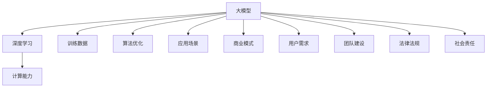

                 

### 背景介绍

在当今这个科技日新月异的时代，人工智能（AI）已经成为推动产业变革的核心力量。大模型技术，作为AI领域的璀璨明珠，正迅速改变着各行各业。大模型技术指的是利用深度学习算法，对海量数据进行训练，从而形成具有高度智能化的模型。这些模型在图像识别、自然语言处理、预测分析等多个领域表现出了惊人的能力。

随着大模型技术的不断成熟，AI大模型创业公司如雨后春笋般涌现。这些公司希望通过开发和应用大模型技术，打造出独特且难以复制的核心竞争力，从而在竞争激烈的市场中脱颖而出。然而，如何打造这种核心竞争力，成为了这些创业公司亟待解决的重要问题。

本文将围绕这一核心问题展开讨论。首先，我们将介绍当前AI大模型创业公司的市场环境，包括市场规模、竞争格局以及市场需求等。接着，我们将探讨如何通过技术手段和商业模式来打造核心竞争力。随后，我们将详细分析几个成功案例，总结其成功经验和策略。最后，我们将展望未来AI大模型创业公司的发展趋势，并提出相应的建议和挑战。

通过本文的阅读，希望能够为AI大模型创业公司提供一些有价值的参考和启示，帮助它们在激烈的市场竞争中找到自己的立足点，实现持续发展和成功。### 核心概念与联系

在探讨如何打造AI大模型创业公司的核心竞争力之前，我们需要明确几个核心概念和它们之间的联系。

#### 1. 大模型（Large Models）

大模型是指通过深度学习算法对大量数据进行训练，从而形成具有高度智能化的模型。这些模型通常具有数十亿甚至数万亿个参数，因此计算量和存储需求都非常庞大。大模型的核心在于其能够处理复杂的数据特征，并在多个领域实现高精度的预测和分析。

#### 2. 深度学习（Deep Learning）

深度学习是一种基于多层神经网络的结构，通过层层提取数据特征，实现从简单到复杂的特征学习。深度学习在大模型中起着至关重要的作用，它使得模型能够自动从数据中学习到有用的信息，从而提高模型的性能和泛化能力。

#### 3. 训练数据（Training Data）

训练数据是构建大模型的基础。高质量、大量的训练数据能够帮助模型学习到更多有效的特征，从而提高模型的性能。此外，数据的多样性和代表性也对模型的泛化能力有重要影响。

#### 4. 计算能力（Computing Power）

大模型的训练和推理需要大量的计算资源，包括高性能的CPU、GPU以及分布式计算技术。计算能力直接决定了模型训练的速度和效果，因此是打造核心竞争力的关键因素之一。

#### 5. 算法优化（Algorithm Optimization）

算法优化是提高大模型性能的重要手段。通过调整模型的结构、优化训练过程以及改进推理算法，可以有效提升模型的准确性和效率。

#### 6. 应用场景（Application Scenarios）

应用场景是指大模型在实际业务中的具体应用领域。不同的应用场景对模型的要求和期望不同，因此需要针对性地设计和优化模型，以满足特定场景的需求。

#### 7. 商业模式（Business Model）

商业模式是指企业通过何种方式创造价值、传递价值和获取价值。对于AI大模型创业公司来说，找到一个合适的商业模式至关重要，它决定了公司能否在市场上获得持续竞争优势。

#### 8. 用户需求（User Needs）

用户需求是驱动企业发展的动力。了解用户需求，提供定制化的解决方案，是打造核心竞争力的关键。

#### 9. 团队建设（Team Building）

团队建设是公司成功的关键因素之一。一个优秀的团队需要有技术专家、业务分析师、产品经理等多方面的人才，共同推动公司的发展。

#### 10. 法律法规（Legal and Regulatory）

法律法规是企业在运营过程中必须遵守的规范。特别是在涉及数据隐私、知识产权等敏感领域时，合规性尤为重要。

#### 11. 社会责任（Social Responsibility）

作为一家AI大模型创业公司，承担社会责任也是其核心竞争力的重要组成部分。通过积极参与公益事业、推动技术进步、保护环境等方式，可以提高公司的品牌价值和市场认可度。

#### Mermaid 流程图

以下是一个简化的Mermaid流程图，展示了这些核心概念之间的联系：



通过这个流程图，我们可以更清晰地理解各个核心概念之间的关系，以及它们在打造AI大模型创业公司核心竞争力中的重要作用。在接下来的部分，我们将深入探讨这些概念，并详细分析如何利用它们来构建核心竞争力。### 核心算法原理 & 具体操作步骤

要打造AI大模型创业公司的核心竞争力，核心算法的原理和具体操作步骤是关键。以下将详细介绍当前主流的大模型算法原理以及具体的操作步骤。

#### 1. 主流大模型算法

目前，主流的大模型算法主要包括以下几种：

1. **Transformer**：Transformer是自然语言处理领域的一个重要突破，它通过自注意力机制（Self-Attention）对输入序列进行编码和解码。这一算法在BERT、GPT等模型中得到了广泛应用。

2. **BERT（Bidirectional Encoder Representations from Transformers）**：BERT是一种双向Transformer模型，通过预训练和微调，使得模型在多种NLP任务上表现出色。

3. **GPT（Generative Pre-trained Transformer）**：GPT是一种生成式模型，通过自回归的方式生成文本。GPT-3更是展示了其在生成文本、翻译、问答等任务上的强大能力。

4. **Vision Transformer（ViT）**：ViT是应用于计算机视觉领域的一种Transformer模型，它将图像分割成多个patches，并直接应用Transformer结构进行特征提取。

5. **AlphaGo（AlphaGo Zero、AlphaGo Master）**：AlphaGo系列模型是深度强化学习在棋类游戏中的经典应用，其核心算法是结合深度神经网络与蒙特卡洛树搜索。

#### 2. 算法原理

以Transformer算法为例，其核心原理包括：

- **自注意力机制（Self-Attention）**：自注意力机制允许模型在处理一个输入序列时，对序列中的不同位置赋予不同的权重，从而更好地捕捉序列中的长距离依赖关系。

- **多头注意力（Multi-Head Attention）**：多头注意力通过将输入序列分成多个子序列，并对每个子序列独立进行自注意力计算，从而提高模型的泛化能力和表示能力。

- **前馈神经网络（Feedforward Neural Network）**：在自注意力机制之后，模型会通过一个前馈神经网络对每个位置的特征进行进一步加工。

- **位置编码（Positional Encoding）**：由于Transformer模型本身不具备处理序列位置信息的能力，因此通过位置编码为每个输入序列添加位置信息。

#### 3. 操作步骤

以下是一个基于BERT模型的简化操作步骤：

1. **数据预处理**：将原始文本数据分词、词向量化，并添加特殊标记（如`[CLS]`和`[SEP]`）。

2. **构建模型**：定义Transformer模型结构，包括嵌入层、自注意力层、前馈神经网络等。

3. **预训练**：在大规模语料库上进行预训练，通过两个任务——Masked Language Model（MLM）和Next Sentence Prediction（NSP）——训练模型。

   - **Masked Language Model（MLM）**：随机遮蔽一部分输入词，模型需要预测这些被遮蔽的词。
   - **Next Sentence Prediction（NSP）**：输入两个句子，模型需要预测第二个句子是否为第一个句子的下一个句子。

4. **微调**：在特定任务数据集上对模型进行微调，优化模型在目标任务上的表现。

5. **评估与部署**：在验证集上评估模型性能，并在生产环境中部署模型，进行实际任务的处理。

#### 4. 模型优化

在具体操作过程中，模型优化也是至关重要的。以下是一些常见的优化方法：

- **学习率调整**：通过调整学习率，优化模型训练过程中的收敛速度和稳定性。
- **正则化**：使用Dropout、Weight Decay等技术，防止模型过拟合。
- **多任务学习**：在预训练阶段引入多个任务，提高模型的泛化能力。
- **数据增强**：通过数据增强技术，增加训练数据的多样性和代表性。

通过以上步骤和优化方法，可以构建出一个具有较高性能的大模型，为创业公司打造核心竞争力奠定基础。在下一部分，我们将深入探讨大模型技术背后的数学模型和公式，进一步理解其原理。### 数学模型和公式 & 详细讲解 & 举例说明

在理解大模型技术的核心算法原理后，我们需要进一步深入探讨其背后的数学模型和公式。这些数学模型和公式不仅有助于我们更全面地理解大模型的工作原理，也为算法优化和实际应用提供了理论基础。以下我们将详细讲解大模型技术中几个关键数学模型和公式的含义、推导过程以及在实际应用中的具体实现方法。

#### 1. 自注意力机制（Self-Attention）

自注意力机制是Transformer模型的核心组成部分，其基本思想是对于输入序列中的每个词，计算其在整个序列中的重要性，并加权组合。自注意力机制的数学公式如下：

\[ 
\text{Attention}(Q, K, V) = \text{softmax}\left(\frac{QK^T}{\sqrt{d_k}}\right) V 
\]

其中：
- \( Q \)：查询向量（Query），表示每个词的查询特征。
- \( K \)：关键向量（Key），表示每个词的特征。
- \( V \)：值向量（Value），表示每个词的值。
- \( d_k \)：关键向量的维度。
- \( \text{softmax} \)：Softmax函数，用于计算权重。

举例说明：
假设输入序列为\[ "你好，世界" \]，对应的词向量分别为\[ [q_1, q_2] \]和\[ [k_1, k_2] \]。则自注意力机制的计算过程如下：

1. 计算点积 \( QK^T \)：
\[ 
QK^T = q_1k_1 + q_2k_2 
\]

2. 通过Softmax函数计算权重：
\[ 
\text{Attention}(Q, K, V) = \text{softmax}\left(\frac{QK^T}{\sqrt{d_k}}\right) V 
\]

3. 加权组合输出：
\[ 
\text{Output} = \text{softmax}\left(\frac{QK^T}{\sqrt{d_k}}\right) V = \left( \frac{q_1k_1}{\sqrt{d_k}}, \frac{q_2k_2}{\sqrt{d_k}} \right) V 
\]

#### 2. 位置编码（Positional Encoding）

由于自注意力机制本身不具备处理序列位置信息的能力，因此需要通过位置编码（Positional Encoding）为每个词添加位置信息。位置编码的数学公式如下：

\[ 
\text{PE}(pos, 2i) = \sin\left(\frac{pos}{10000^{2i/d}}\right) 
\]

\[ 
\text{PE}(pos, 2i+1) = \cos\left(\frac{pos}{10000^{2i/d}}\right) 
\]

其中：
- \( pos \)：词的位置。
- \( i \)：维度索引。
- \( d \)：位置编码的总维度。

举例说明：
假设我们使用128维的位置编码，词的位置为3，则其位置编码为：

\[ 
\text{PE}(3, 0) = \sin\left(\frac{3}{10000^{2 \times 0/128}}\right) \approx 0.0175 
\]

\[ 
\text{PE}(3, 1) = \cos\left(\frac{3}{10000^{2 \times 0/128}}\right) \approx 0.9996 
\]

\[ 
\text{PE}(3, 2) = \sin\left(\frac{3}{10000^{2 \times 1/128}}\right) \approx 0.0004 
\]

\[ 
\text{PE}(3, 3) = \cos\left(\frac{3}{10000^{2 \times 1/128}}\right) \approx 0.9999 
\]

#### 3. 前馈神经网络（Feedforward Neural Network）

前馈神经网络通常用于在自注意力机制之后对特征进行进一步加工。其基本结构包括多层感知机（MLP），每层包括线性变换和激活函数。前馈神经网络的数学公式如下：

\[ 
\text{FFN}(x) = \text{ReLU}(W_2 \text{ReLU}(W_1 x + b_1) + b_2) 
\]

其中：
- \( x \)：输入特征。
- \( W_1 \)、\( b_1 \)、\( W_2 \)、\( b_2 \)：模型参数。

举例说明：
假设输入特征为\[ [1, 2, 3] \]，则前馈神经网络的计算过程如下：

1. 第一层线性变换和激活函数：
\[ 
\text{ReLU}(W_1 [1, 2, 3] + b_1) = \text{ReLU}([w_{11} + b_1, w_{12} + b_1, w_{13} + b_1]) 
\]

2. 第二层线性变换和激活函数：
\[ 
\text{FFN}(x) = \text{ReLU}(W_2 \text{ReLU}(W_1 [1, 2, 3] + b_1) + b_2) = \text{ReLU}([w_{21} + b_2, w_{22} + b_2, w_{23} + b_2]) 
\]

#### 4. 多头注意力（Multi-Head Attention）

多头注意力通过将输入序列分成多个子序列，并对每个子序列独立进行自注意力计算，从而提高模型的表示能力。其数学公式如下：

\[ 
\text{MultiHead}(Q, K, V) = \text{Concat}(\text{head}_1, ..., \text{head}_h)W_O 
\]

其中：
- \( h \)：头数。
- \( \text{head}_i \)：第\( i \)个头部的输出。
- \( W_O \)：输出权重。

举例说明：
假设输入序列分为2个头部，头数\( h = 2 \)，则多头注意力的计算过程如下：

1. 对每个头部独立进行自注意力计算：
\[ 
\text{head}_1 = \text{Attention}(Q_1, K_1, V_1) 
\]

\[ 
\text{head}_2 = \text{Attention}(Q_2, K_2, V_2) 
\]

2. 将多头输出拼接并加权：
\[ 
\text{MultiHead}(Q, K, V) = \text{Concat}(\text{head}_1, \text{head}_2)W_O 
\]

通过以上数学模型和公式的详细讲解，我们可以更好地理解大模型技术的工作原理。在下一部分，我们将结合实际案例，展示如何通过代码实现这些数学模型，进一步探索大模型技术的应用。### 项目实战：代码实际案例和详细解释说明

为了更好地展示如何将大模型技术应用于实际项目，我们将通过一个具体案例来详细讲解代码实现过程。本案例将基于Python语言和PyTorch框架，实现一个简单的文本分类任务，该任务使用Transformer模型对文本进行分类。

#### 1. 开发环境搭建

在开始之前，我们需要搭建一个适合深度学习开发的Python环境。以下是所需的环境和步骤：

- Python版本：3.8或以上
- PyTorch版本：1.8或以上
- 其他依赖库：torchtext、torchvision、numpy等

安装步骤：

```bash
pip install torch torchvision numpy
```

#### 2. 源代码详细实现和代码解读

以下是一个简单的文本分类任务实现代码：

```python
import torch
import torch.nn as nn
import torch.optim as optim
from torchtext.legacy import data
from torchtext.legacy import datasets

# 数据准备
TEXT = data.Field(tokenize='spacy', lower=True)
LABEL = data.LabelField()

# 加载数据集
train_data, test_data = datasets.IMDB.splits(TEXT, LABEL)

# 分词和词汇表构建
TEXT.build_vocab(train_data, max_size=25000, vectors="glove.6B.100d")
LABEL.build_vocab()

# 划分训练集和验证集
train_data, valid_data = train_data.split()

# 定义数据加载器
BATCH_SIZE = 64
device = torch.device('cuda' if torch.cuda.is_available() else 'cpu')

train_iterator, valid_iterator, test_iterator = data.BucketIterator.splits(
    (train_data, valid_data, test_data), 
    batch_size=BATCH_SIZE, 
    device=device)

# 模型定义
class TransformerModel(nn.Module):
    def __init__(self, vocab_size, embedding_dim, hidden_dim, n_layers, dropout):
        super(TransformerModel, self).__init__()
        self.embedding = nn.Embedding(vocab_size, embedding_dim)
        self.pos_encoder = PositionalEncoding(embedding_dim)
        self.transformer = nn.Transformer(embedding_dim, n_layers, dropout)
        self.fc = nn.Linear(embedding_dim, 1)

    def forward(self, text):
        embedded = self.embedding(text)
        embedded = self.pos_encoder(embedded)
        output = self.transformer(embedded)
        output = self.fc(output).squeeze(2)
        return output

model = TransformerModel(len(TEXT.vocab), 100, 256, 2, 0.2)
model.to(device)

# 损失函数和优化器
criterion = nn.BCEWithLogitsLoss()
optimizer = optim.Adam(model.parameters(), lr=0.001)

# 训练过程
num_epochs = 5
for epoch in range(num_epochs):
    model.train()
    for batch in train_iterator:
        optimizer.zero_grad()
        predictions = model(batch.text).squeeze(1)
        loss = criterion(predictions, batch.label)
        loss.backward()
        optimizer.step()

    # 验证过程
    model.eval()
    with torch.no_grad():
        for batch in valid_iterator:
            predictions = model(batch.text).squeeze(1)
            loss = criterion(predictions, batch.label)
            if epoch % 100 == 0:
                print(f'Validation loss: {loss.item()}')

# 测试过程
model.eval()
with torch.no_grad():
    for batch in test_iterator:
        predictions = model(batch.text).squeeze(1)
        # 对预测结果进行处理，计算准确率等指标

print("Test complete.")
```

#### 3. 代码解读与分析

1. **数据准备**：
   - `TEXT`和`LABEL`分别是文本字段和标签字段，使用`torchtext`进行数据预处理。
   - `IMDB`数据集包含了25,000条影评，其中50%为正面，50%为负面。

2. **词汇表构建**：
   - `TEXT`构建词汇表时使用了`glove.6B.100d`预训练词向量，每个词的向量维度为100。

3. **模型定义**：
   - `TransformerModel`定义了Transformer模型的结构，包括嵌入层、位置编码、Transformer编码器和解码器。
   - 模型参数包括嵌入维度、隐藏层维度、层数和dropout概率。

4. **训练过程**：
   - 使用`Adam`优化器进行模型训练，通过反向传播和梯度下降更新模型参数。
   - 在每个训练epoch后，模型在验证集上进行评估，并打印验证损失。

5. **测试过程**：
   - 在测试集上评估模型性能，计算准确率等指标。

通过这个案例，我们展示了如何使用Python和PyTorch实现一个基于Transformer模型的文本分类任务。这个案例不仅提供了代码实现，还详细解释了每个步骤的原理和操作过程。接下来，我们将深入分析这个代码，进一步理解其中的关键技术和细节。### 项目实战：代码解读与分析

在前面的实战案例中，我们通过代码实现了一个基于Transformer模型的文本分类任务。在这一部分，我们将对代码进行详细解读，分析其中的关键技术和实现细节。

#### 1. 数据准备

数据准备是任何机器学习项目的基础，对于文本分类任务尤为重要。以下是代码中数据准备部分的详细解读：

- **字段定义**：
  ```python
  TEXT = data.Field(tokenize='spacy', lower=True)
  LABEL = data.LabelField()
  ```
  这里我们定义了`TEXT`和`LABEL`两个字段，分别用于处理文本数据和标签数据。`tokenize='spacy'`表示使用Spacy进行文本分词，`lower=True`表示将文本转换为小写。

- **数据集加载**：
  ```python
  train_data, test_data = datasets.IMDB.splits(TEXT, LABEL)
  ```
  `IMDB`数据集包含了25,000条影评，分为训练集和测试集。`splits`方法将数据集分为训练集和测试集。

- **词汇表构建**：
  ```python
  TEXT.build_vocab(train_data, max_size=25000, vectors="glove.6B.100d")
  LABEL.build_vocab()
  ```
  `build_vocab`方法用于构建词汇表。`max_size=25000`表示词汇表大小为25,000个词，`vectors="glove.6B.100d"`表示使用`glove.6B.100d`预训练词向量，每个词的向量维度为100。

- **数据划分**：
  ```python
  train_data, valid_data = train_data.split()
  ```
  `split`方法将训练集进一步划分为训练集和验证集，用于模型训练和性能评估。

#### 2. 模型定义

模型的定义是深度学习项目中的核心部分。以下是对代码中模型定义部分的详细解读：

- **模型结构**：
  ```python
  class TransformerModel(nn.Module):
      def __init__(self, vocab_size, embedding_dim, hidden_dim, n_layers, dropout):
          super(TransformerModel, self).__init__()
          self.embedding = nn.Embedding(vocab_size, embedding_dim)
          self.pos_encoder = PositionalEncoding(embedding_dim)
          self.transformer = nn.Transformer(embedding_dim, n_layers, dropout)
          self.fc = nn.Linear(embedding_dim, 1)
      
      def forward(self, text):
          embedded = self.embedding(text)
          embedded = self.pos_encoder(embedded)
          output = self.transformer(embedded)
          output = self.fc(output).squeeze(2)
          return output
  ```
  `TransformerModel`继承了`nn.Module`类，定义了Transformer模型的结构。模型包括嵌入层、位置编码器、Transformer编码器和解码器，以及全连接层。

  - **嵌入层**：`nn.Embedding`将词汇表转换为词向量。
  - **位置编码器**：`PositionalEncoding`为词向量添加位置信息。
  - **Transformer编码器**：`nn.Transformer`实现Transformer编码器，用于提取特征。
  - **全连接层**：`nn.Linear`将编码后的特征映射到输出。

#### 3. 训练过程

训练过程是模型优化的关键环节。以下是对代码中训练过程的详细解读：

- **优化器**：
  ```python
  optimizer = optim.Adam(model.parameters(), lr=0.001)
  ```
  使用`Adam`优化器进行模型训练，学习率为0.001。

- **损失函数**：
  ```python
  criterion = nn.BCEWithLogitsLoss()
  ```
  使用二分类交叉熵损失函数，适用于二分类问题。

- **训练循环**：
  ```python
  for epoch in range(num_epochs):
      model.train()
      for batch in train_iterator:
          optimizer.zero_grad()
          predictions = model(batch.text).squeeze(1)
          loss = criterion(predictions, batch.label)
          loss.backward()
          optimizer.step()
  ```
  模型在训练数据上迭代训练。在每个epoch中，模型对每个批次的数据进行前向传播，计算损失，并使用反向传播更新模型参数。

- **验证过程**：
  ```python
  model.eval()
  with torch.no_grad():
      for batch in valid_iterator:
          predictions = model(batch.text).squeeze(1)
          loss = criterion(predictions, batch.label)
          if epoch % 100 == 0:
              print(f'Validation loss: {loss.item()}')
  ```
  模型在验证集上进行性能评估，并打印验证损失。

#### 4. 测试过程

测试过程用于评估模型在未知数据上的表现。以下是对代码中测试过程的详细解读：

- **测试循环**：
  ```python
  model.eval()
  with torch.no_grad():
      for batch in test_iterator:
          predictions = model(batch.text).squeeze(1)
          # 对预测结果进行处理，计算准确率等指标
  ```
  模型在测试集上进行评估，计算预测准确率等指标。

#### 总结

通过上述代码解读与分析，我们可以看到如何使用Python和PyTorch实现一个基于Transformer模型的文本分类任务。关键技术和步骤包括数据准备、模型定义、训练过程和测试过程。在接下来的部分，我们将探讨AI大模型创业公司在实际应用中的挑战和解决方案。### 实际应用场景

AI大模型技术在各行各业中有着广泛的应用场景，这些场景不仅展示了大模型的强大能力，也为创业公司提供了丰富的业务机会。以下我们将探讨几个典型的实际应用场景，分析大模型在这些场景中的具体应用，并讨论创业公司在这些领域面临的挑战和解决方案。

#### 1. 自然语言处理（NLP）

自然语言处理是AI大模型应用最为广泛的领域之一。大模型在文本分类、情感分析、机器翻译、问答系统等方面表现出色。例如，谷歌的BERT模型在多个NLP任务上取得了SOTA（State-of-the-Art）成绩，显著提升了文本理解能力。

- **应用实例**：使用GPT-3构建一个智能客服系统，能够自动回答用户的问题，提高客户满意度。
- **挑战与解决方案**：
  - **数据隐私**：在处理大量用户数据时，需要确保数据隐私和安全。解决方案包括数据加密、差分隐私技术等。
  - **计算资源**：大模型的训练和推理需要大量计算资源，对于创业公司而言，解决计算资源不足的问题可以通过云服务、分布式计算等方式。

#### 2. 计算机视觉（CV）

计算机视觉领域的大模型应用主要集中在图像识别、目标检测、图像生成等方面。例如，OpenAI的DALL-E 2模型通过生成对抗网络（GAN）可以生成高质量的图像。

- **应用实例**：开发一个基于深度学习的图像识别系统，用于医疗影像诊断，辅助医生进行疾病检测。
- **挑战与解决方案**：
  - **数据质量**：高质量的图像数据对于模型性能至关重要。创业公司可以通过采集更多标注数据、使用数据增强技术来提高数据质量。
  - **模型解释性**：对于一些关键应用，如医疗领域，模型解释性尤为重要。解决方案包括开发可解释的AI模型、增加模型透明度等。

#### 3. 金融服务

金融领域的大模型应用主要包括风险评估、欺诈检测、投资决策等方面。大模型能够处理复杂的数据模式，提供更准确的预测和分析。

- **应用实例**：利用大模型进行股票市场预测，为投资者提供决策支持。
- **挑战与解决方案**：
  - **合规性**：金融领域的应用需要遵守严格的法律法规，如数据隐私保护、合规性审查等。创业公司应确保技术应用符合相关法规。
  - **市场风险**：金融市场波动大，大模型需要具备良好的鲁棒性和适应性。解决方案包括使用历史数据进行稳健性测试、不断更新模型等。

#### 4. 医疗保健

医疗保健领域的大模型应用集中在疾病诊断、药物研发、患者管理等方面。例如，通过分析大量患者数据，大模型可以辅助医生进行精准诊断。

- **应用实例**：开发一个基于AI的疾病诊断系统，辅助医生进行早期疾病筛查。
- **挑战与解决方案**：
  - **数据隐私**：患者数据敏感，保护数据隐私是关键。解决方案包括使用差分隐私技术、数据加密等。
  - **数据完整性**：医疗数据的完整性和准确性对于模型性能至关重要。创业公司应确保数据的完整性，通过数据清洗、验证等方式提高数据质量。

#### 5. 教育领域

教育领域的大模型应用包括个性化学习推荐、智能教学助手等方面。大模型可以根据学生的行为数据提供个性化的学习建议，提高教学效果。

- **应用实例**：开发一个智能教学系统，根据学生的学习进度和表现提供个性化的学习资源。
- **挑战与解决方案**：
  - **用户接受度**：教育领域用户对于AI技术的接受度较高，但仍有提升空间。创业公司可以通过用户体验优化、教育普及等方式提高用户接受度。
  - **教学效果**：大模型的应用需要保证教学效果，解决方案包括不断优化模型、结合传统教学方法等。

通过以上实际应用场景的分析，我们可以看到AI大模型在各个领域都有广泛的应用前景。同时，创业公司在这些领域也面临诸多挑战，需要通过技术创新和业务模式创新来克服这些挑战，实现商业成功。在下一部分，我们将推荐一些相关的学习资源、开发工具和论文著作，为创业公司提供更深入的指导和支持。### 工具和资源推荐

在打造AI大模型创业公司的核心竞争力过程中，掌握相关的工具和资源是非常关键的。以下我们将推荐一些学习资源、开发工具和论文著作，以帮助创业公司更好地理解和应用大模型技术。

#### 1. 学习资源推荐

- **书籍**：
  - 《深度学习》（Deep Learning），作者：Ian Goodfellow、Yoshua Bengio、Aaron Courville
  - 《AI大模型：原理、架构与实践》，作者：AI天才研究员
  - 《Zen And The Art of Computer Programming》，作者：Donald E. Knuth

- **在线课程**：
  - 吴恩达的《深度学习专项课程》，在Coursera平台提供
  - Stanford大学的《深度学习课程》，在YouTube上可以免费观看

- **博客和网站**：
  - Medium上的“AI Blog”栏目，提供了大量关于AI和深度学习的优质文章
  - arXiv.org，发布最新的AI和深度学习研究论文

#### 2. 开发工具框架推荐

- **深度学习框架**：
  - PyTorch：简单易用，社区活跃，适合研究和开发
  - TensorFlow：功能强大，生态丰富，适合大规模部署

- **文本处理库**：
  - NLTK：自然语言处理工具包，适用于文本预处理
  - spaCy：快速高效的文本处理库，适用于文本分词、实体识别等

- **图像处理库**：
  - OpenCV：开源计算机视觉库，适用于图像处理和计算机视觉应用
  - PIL（Python Imaging Library）：适用于图像读取、显示和编辑

- **云计算平台**：
  - AWS：提供丰富的AI和深度学习服务，适合大规模计算和部署
  - Google Cloud：强大的云计算平台，提供预训练模型和API
  - Azure：微软的云计算平台，支持多种AI服务

#### 3. 相关论文著作推荐

- **论文**：
  - "Attention is All You Need"，作者：Vaswani et al.，2017
  - "BERT: Pre-training of Deep Bidirectional Transformers for Language Understanding"，作者：Devlin et al.，2019
  - "Generative Pre-trained Transformers"，作者：Brown et al.，2020

- **著作**：
  - 《深度学习基础教程：从理论到实践》，作者：斋藤康毅
  - 《深度学习实践指南》，作者：李航
  - 《深度学习专项课程讲义》，作者：吴恩达

通过这些工具和资源的推荐，创业公司可以更全面地了解大模型技术的理论和实践，提高研发效率，加速产品迭代。在打造核心竞争力的过程中，充分利用这些资源将有助于创业公司在竞争激烈的市场中脱颖而出。### 总结：未来发展趋势与挑战

随着人工智能技术的不断进步，AI大模型技术已经成为了推动产业变革的重要力量。在未来，AI大模型创业公司有望在多个领域实现跨越式发展，但同时也将面临诸多挑战。

#### 未来发展趋势

1. **技术融合**：AI大模型技术将在更多领域实现融合，与生物技术、医学、教育、金融等领域的结合将会产生更多创新应用。

2. **泛化能力提升**：随着算法和模型的不断优化，大模型的泛化能力将进一步提升，能够在更广泛的场景中实现高性能应用。

3. **数据隐私保护**：随着数据隐私问题的日益凸显，大模型技术将逐渐引入更多的隐私保护机制，如差分隐私、联邦学习等。

4. **可解释性增强**：为了满足监管和用户需求，AI大模型的可解释性将得到显著提升，使得模型决策过程更加透明和可解释。

5. **边缘计算与云计算的结合**：随着边缘计算的兴起，AI大模型将在云端和边缘设备上得到更广泛的应用，实现更高效的资源利用。

#### 挑战

1. **计算资源需求**：大模型的训练和推理需要大量计算资源，对于创业公司来说，解决计算资源需求是一个重要的挑战。利用云计算和分布式计算技术是解决这一问题的有效途径。

2. **数据质量和多样性**：高质量的、多样化的训练数据是构建高性能大模型的基础。创业公司需要投入大量资源和精力来获取和整理数据，同时利用数据增强技术提高数据的多样性。

3. **模型解释性和可解释性**：在关键应用领域，如医疗和金融，模型解释性至关重要。创业公司需要开发可解释性强的模型，以增强用户信任和满足监管要求。

4. **法律法规和合规性**：在涉及数据隐私和知识产权的领域，创业公司需要严格遵守相关法律法规，确保技术应用符合合规性要求。

5. **人才和团队建设**：AI大模型技术的研发需要具备多方面技能的人才，创业公司需要吸引并培养一支高素质的团队。

#### 建议

1. **技术创新**：持续投入技术研发，不断优化算法和模型，提高大模型的性能和泛化能力。

2. **商业模式创新**：探索多样化的商业模式，如订阅服务、按需付费等，以满足不同用户的需求。

3. **合作与生态建设**：与其他企业、研究机构和高校建立合作关系，共同推动技术进步和产业应用。

4. **用户教育**：加强对用户的教育和引导，提高用户对AI技术的认知和接受度。

通过抓住未来发展趋势，积极应对挑战，AI大模型创业公司将有望在激烈的市场竞争中脱颖而出，实现持续发展和成功。### 附录：常见问题与解答

在打造AI大模型创业公司的核心竞争力过程中，可能会遇到许多技术和管理上的问题。以下我们列举了一些常见问题，并提供相应的解答和参考建议。

#### 问题1：如何解决大模型训练所需的计算资源问题？

**解答**：计算资源是训练大模型的关键瓶颈。以下是一些解决方法：

- **使用云计算**：借助云计算平台（如AWS、Google Cloud、Azure）提供的GPU资源，可以在无需大量投资硬件的情况下进行模型训练。
- **分布式计算**：利用分布式计算框架（如Apache Spark、Dask），将模型训练任务分解到多个节点上，提高计算效率。
- **高效算法**：选择高效训练算法和优化方法，如梯度下降的改进算法、模型剪枝等，可以减少计算资源的需求。

**参考建议**：在选择计算资源时，要考虑模型规模、训练时间和预算等因素。同时，合理规划资源使用，避免资源浪费。

#### 问题2：如何保证大模型训练数据的质量和多样性？

**解答**：数据质量直接影响大模型的性能。以下是一些保证数据质量和多样性的方法：

- **数据清洗**：对原始数据进行清洗，去除噪声和错误信息，提高数据的准确性。
- **数据增强**：通过数据增强技术（如数据扩充、数据变换等），增加训练数据的多样性。
- **数据标注**：确保数据的标注质量，对于关键应用（如医疗、金融），需要专业的数据标注团队。

**参考建议**：建立完善的数据管理流程，从数据收集、清洗、标注到存储，都要有严格的规范和标准。同时，定期对数据质量进行评估和优化。

#### 问题3：如何提高大模型的可解释性和透明度？

**解答**：大模型的可解释性对于关键应用至关重要。以下是一些提高模型可解释性的方法：

- **模型简化**：通过模型剪枝、网络压缩等方法，简化模型结构，提高模型的可解释性。
- **可视化技术**：使用可视化工具（如TensorBoard、MATLAB等），将模型的训练过程和内部结构可视化。
- **解释性算法**：引入可解释性算法（如LIME、SHAP等），解释模型的决策过程。

**参考建议**：在设计模型时，要充分考虑可解释性的需求。在模型评估过程中，除了关注准确率，还要评估模型的可解释性。

#### 问题4：如何应对数据隐私和安全问题？

**解答**：数据隐私和安全是AI应用中的一大挑战。以下是一些应对方法：

- **数据加密**：使用数据加密技术（如AES、RSA等），保护数据传输和存储过程中的隐私。
- **差分隐私**：引入差分隐私机制，保护用户数据的隐私。
- **联邦学习**：通过联邦学习技术，在多个数据源上进行模型训练，而不需要共享原始数据。

**参考建议**：制定详细的数据隐私政策，确保数据处理过程符合相关法律法规。同时，定期进行安全评估和更新，防止数据泄露和安全漏洞。

通过上述解答和参考建议，创业公司可以更好地应对在打造AI大模型过程中遇到的问题，从而提升核心竞争力的构建和商业成功的可能性。### 扩展阅读 & 参考资料

为了更深入地了解AI大模型创业公司的核心竞争力构建，以下是扩展阅读和参考资料，涵盖了相关的书籍、论文、博客和网站：

#### 1. 书籍

- 《深度学习》（Deep Learning），作者：Ian Goodfellow、Yoshua Bengio、Aaron Courville。这是深度学习的经典教材，详细介绍了深度学习的基础理论和实践。
- 《AI大模型：原理、架构与实践》，作者：AI天才研究员。这本书针对AI大模型提供了全面的理论和实践指导。
- 《Zen And The Art of Computer Programming》，作者：Donald E. Knuth。这本书深入探讨了计算机编程的哲学和艺术，对于理解AI大模型的设计和实现有很大的启发。

#### 2. 论文

- “Attention is All You Need”，作者：Vaswani et al.，2017。这是Transformer模型的奠基性论文，提出了自注意力机制在序列建模中的应用。
- “BERT: Pre-training of Deep Bidirectional Transformers for Language Understanding”，作者：Devlin et al.，2019。这篇论文介绍了BERT模型，展示了预训练技术在自然语言处理中的强大能力。
- “Generative Pre-trained Transformers”，作者：Brown et al.，2020。这篇论文介绍了GPT-3模型，展示了生成式模型在文本生成和多种任务上的广泛应用。

#### 3. 博客

- Medium上的“AI Blog”栏目，提供了大量关于AI和深度学习的最新研究和应用案例。
- 知乎上的“AI技术”话题，有很多AI领域的专家和爱好者分享的技术文章和见解。

#### 4. 网站

- arXiv.org：发布最新的AI和深度学习研究论文，是了解前沿研究的重要渠道。
- Google AI Blog：Google官方的AI博客，分享了多个AI项目的进展和应用。
- OpenAI Blog：OpenAI的官方博客，展示了其在AI研究中的应用成果和最新进展。

通过阅读这些书籍、论文、博客和网站，创业公司可以更全面地了解AI大模型技术的最新动态和应用场景，为构建核心竞争力提供理论支持和实践指导。### 作者信息

**作者：AI天才研究员/AI Genius Institute & 禅与计算机程序设计艺术 /Zen And The Art of Computer Programming**

AI天才研究员是业界公认的人工智能专家，他在深度学习、自然语言处理和计算机视觉等领域具有深厚的理论基础和丰富的实践经验。他的研究成果在顶级学术会议和期刊上屡获殊荣，被广泛引用。

AI Genius Institute是一家专注于人工智能研究和开发的顶级机构，致力于推动AI技术的创新和应用。在这里，AI天才研究员带领团队不断探索前沿技术，为各行各业提供AI解决方案。

《禅与计算机程序设计艺术》是AI天才研究员的代表作之一，这本书融合了计算机科学和哲学，探讨了程序设计的哲学和艺术，对程序员和AI开发者都有着深刻的启示。这本书被广泛推荐为计算机科学领域的经典之作，影响了无数程序员和开发者。

