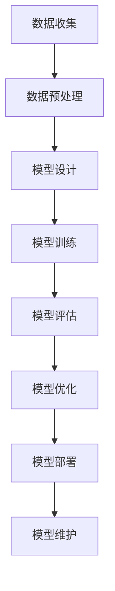
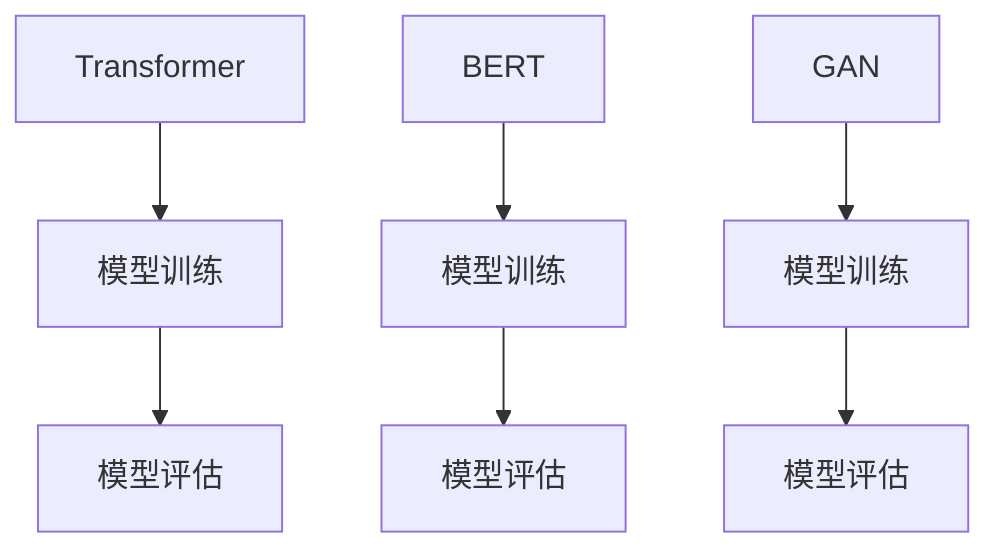

                 

### 背景介绍

随着人工智能技术的飞速发展，AI大模型作为一种颠覆性创新，正在深刻改变着各个行业的运作方式。AI大模型，通常指的是具有海量参数、能够处理大规模数据的深度学习模型。这些模型具备强大的学习和推理能力，能够在图像识别、自然语言处理、推荐系统等多个领域实现出色的性能。

本篇文章的主题是“AI大模型创业的商业模式创新”，旨在探讨AI大模型在创业中的商业价值及其创新性商业模式。为什么选择这个话题进行探讨？这是因为：

1. **技术变革驱动商业机遇**：AI大模型的兴起不仅带来了技术上的突破，更为创业公司提供了前所未有的商业机遇。从自动驾驶到智能医疗，AI大模型的应用场景正在不断扩展，为创业者提供了丰富的创新空间。

2. **市场需求快速增长**：随着消费者对智能化、个性化的需求不断增加，AI大模型成为了满足这些需求的重要工具。创业公司可以通过AI大模型快速进入市场，抢占先机。

3. **商业模式的多样化**：AI大模型的应用不仅限于传统行业，还催生了全新的商业模式。例如，通过AI大模型实现的内容创作、个性化推荐、智能客服等，都为创业公司提供了创新的盈利模式。

4. **政策支持和投资热潮**：各国政府纷纷出台政策支持人工智能发展，资本市场的投资热潮也为AI大模型创业提供了强有力的资金支持。这使得创业公司有机会借助AI大模型实现快速成长。

综上所述，探讨AI大模型创业的商业模式创新，不仅具有理论价值，还具有重要的实践意义。接下来，我们将深入分析AI大模型的核心概念、算法原理、应用场景，并探讨其商业模式的创新路径。通过这一系列探讨，希望能够为创业者提供有价值的启示，助力他们在AI大模型领域取得成功。

## 2. 核心概念与联系

### AI大模型的基本概念

AI大模型（Large-scale AI Model），即拥有海量参数的深度学习模型，它们通过大规模数据训练，实现了在复杂任务上的高性能表现。典型的AI大模型如GPT-3、BERT等，这些模型拥有数十亿甚至千亿级的参数量，能够处理海量数据并从中学习复杂的模式。与传统的机器学习模型相比，AI大模型在处理大规模、多样化数据时表现出更强的适应性和准确性。

### AI大模型的应用领域

AI大模型的应用场景非常广泛，涵盖了多个领域：

1. **自然语言处理（NLP）**：包括文本分类、机器翻译、情感分析、问答系统等。AI大模型在NLP领域的应用取得了显著成果，例如GPT-3可以生成高质量的文章、对话等。

2. **计算机视觉（CV）**：如图像识别、目标检测、图像生成等。AI大模型在CV领域的应用使得计算机能够处理更复杂的视觉任务，如自动驾驶系统中的目标检测和识别。

3. **推荐系统**：AI大模型能够根据用户的行为和偏好，提供个性化的推荐服务。例如，电商平台根据用户的购物历史推荐商品。

4. **医疗健康**：AI大模型在医疗健康领域的应用包括疾病诊断、药物研发、个性化治疗方案等。

5. **金融**：AI大模型在金融领域的应用包括风险评估、欺诈检测、量化交易等。

### AI大模型的架构与联系

AI大模型的架构通常包括以下几个关键部分：

1. **数据收集与预处理**：这是模型训练的基础，包括数据清洗、标注、归一化等步骤。

2. **模型设计**：选择合适的神经网络架构，如Transformer、BERT等。

3. **模型训练**：通过大规模数据进行训练，调整模型参数，优化模型性能。

4. **模型评估与优化**：使用验证集对模型进行评估，调整模型参数以优化性能。

5. **模型部署与维护**：将训练好的模型部署到实际应用中，并进行持续维护和更新。

### Mermaid 流程图

以下是一个简化的AI大模型流程图的示例：



在模型设计中，可以选择不同的架构，如：



这些架构各有特点，适用于不同的任务和应用场景。例如，Transformer在自然语言处理方面表现出色，BERT则在文本分类和问答系统中表现出优越的性能，而GAN在图像生成和风格迁移方面有独特的优势。

通过以上对AI大模型的基本概念、应用领域和架构的介绍，我们可以看到，AI大模型不仅仅是技术上的突破，更是商业创新的重要驱动力。接下来，我们将进一步探讨AI大模型的算法原理及其在创业中的应用。

### 3. 核心算法原理 & 具体操作步骤

#### 深度学习基础

深度学习是构建AI大模型的核心技术，其基本原理基于多层神经网络的构建和训练。深度学习通过模仿人脑神经网络的工作方式，利用大量的神经元（即神经网络的节点）和神经元之间的连接（即权重）来进行数据的学习和预测。

深度学习的核心组成部分包括：

1. **神经元**：深度学习中的基本计算单元，每个神经元接收多个输入信号，通过激活函数计算输出。

2. **神经网络**：由多个神经元层（输入层、隐藏层、输出层）组成的网络结构，用于对数据进行多层抽象和特征提取。

3. **损失函数**：用于衡量模型预测结果与真实结果之间的差距，常见的损失函数包括均方误差（MSE）、交叉熵损失等。

4. **优化算法**：用于调整模型参数，最小化损失函数，常见的优化算法包括随机梯度下降（SGD）、Adam等。

#### Transformer算法

Transformer是近年来在自然语言处理领域取得突破性进展的一种神经网络架构，其核心思想是使用自注意力机制（Self-Attention）来捕捉序列数据中的长距离依赖关系。Transformer的架构主要包括编码器（Encoder）和解码器（Decoder）两个部分。

**编码器（Encoder）**

编码器由多个编码层（Encoder Layer）组成，每个编码层包括两个主要部分：多头自注意力机制（Multi-Head Self-Attention）和前馈神经网络（Feed-Forward Neural Network）。

1. **多头自注意力机制**：每个编码层首先通过多头自注意力机制计算输入序列的表示。自注意力机制的核心是计算序列中每个词对之间的权重，并通过加权求和得到每个词的注意力得分。这种机制能够有效地捕捉序列中的长距离依赖关系。

   $$Attention(Q, K, V) = \text{softmax}\left(\frac{QK^T}{\sqrt{d_k}}\right)V$$
   
   其中，Q、K、V 分别是输入序列的查询向量、键向量和值向量，d_k 是键向量的维度，softmax 函数用于计算每个词的注意力权重。

2. **前馈神经网络**：在自注意力机制之后，每个编码层还会通过前馈神经网络对输入进行进一步的加工。前馈神经网络由两个全连接层组成，一个具有尺寸为\(d_model\)的输入层和一个尺寸为\(4d_model\)的输出层。

**解码器（Decoder）**

解码器与编码器类似，也由多个解码层（Decoder Layer）组成，每个解码层包括两个主要部分：多头自注意力机制（Multi-Head Self-Attention）和跨注意力机制（Cross-Attention）。

1. **多头自注意力机制**：与编码器中的自注意力机制类似，用于计算解码层输入的表示。

2. **跨注意力机制**：解码器中的每个层还会通过跨注意力机制计算编码器输出的表示，以便在生成下一个词时利用编码器的信息。跨注意力机制的计算方式与自注意力机制类似，但需要将编码器输出的序列作为键（K）和值（V），将解码器当前步骤的输入作为查询（Q）。

   $$\text{Encoder}{-}\text{Attention}(Q, K, V) = \text{softmax}\left(\frac{QK^T}{\sqrt{d_k}}\right)V$$

3. **前馈神经网络**：与编码器中的前馈神经网络相同，用于对输入进行进一步的加工。

#### BERT算法

BERT（Bidirectional Encoder Representations from Transformers）是另一种广泛使用的自然语言处理模型，其核心思想是通过双向编码器来学习上下文信息，使得模型能够理解句子的全局语义。

BERT的主要组成部分包括：

1. **输入表示**：BERT的输入是一个序列，包括[CLS]和[SEP]标记，用于区分句子的开始和结束。

2. **双向编码器**：BERT由多个编码层组成，每个编码层包括自注意力机制和前馈神经网络，但与Transformer不同的是，BERT使用掩码（Masked Language Model，MLM）任务来预训练模型。

3. **掩码语言模型**：在BERT的训练过程中，一部分输入会被随机掩码（用[M]标记），模型需要预测这些掩码词。这种方法使得模型能够学习上下文信息，从而理解词的多种含义。

#### GAN算法

生成对抗网络（Generative Adversarial Network，GAN）是另一种用于生成数据的高效算法，其核心思想是通过两个神经网络（生成器G和判别器D）的对抗训练来生成高质量的数据。

GAN的训练过程可以概括为：

1. **生成器（Generator）**：生成器尝试生成与真实数据相似的数据。

2. **判别器（Discriminator）**：判别器的目标是区分真实数据和生成数据。

3. **对抗训练**：生成器和判别器通过对抗训练不断调整参数，最终生成器能够生成足够逼真的数据，而判别器无法区分生成数据和真实数据。

GAN的训练过程可以用以下公式表示：

$$\min_G \max_D V(D, G) = \mathbb{E}_{x \sim p_{data}(x)}[\log D(x)] + \mathbb{E}_{z \sim p_z(z)}[\log (1 - D(G(z)))]$$

其中，\(x\) 是真实数据，\(z\) 是生成器的噪声输入，\(D(x)\) 和 \(D(G(z))\) 分别表示判别器对真实数据和生成数据的判断概率。

通过以上对深度学习基础、Transformer、BERT和GAN算法的介绍，我们可以看到，AI大模型的算法原理涉及多个高级技术和复杂的计算过程。接下来，我们将进一步探讨这些算法在AI大模型中的应用和实现步骤。

### 4. 数学模型和公式 & 详细讲解 & 举例说明

在深入探讨AI大模型的数学模型和公式时，我们首先需要了解几个基础概念：权重、偏置、激活函数和损失函数。

#### 权重和偏置

在神经网络中，权重（weight）和偏置（bias）是模型参数的一部分。它们用于调整模型对不同输入的响应。

- **权重**：表示神经元之间的连接强度，通常用\(w_{ij}\)表示，其中\(i\)和\(j\)分别表示输入层和隐藏层的神经元编号。
- **偏置**：是一个附加的参数，用于调整神经元的阈值，通常用\(b_j\)表示。

#### 激活函数

激活函数是神经网络中的一个关键组件，用于将输入映射到输出。常见的激活函数包括：

- **Sigmoid函数**：
  $$\sigma(x) = \frac{1}{1 + e^{-x}}$$
  
  Sigmoid函数将输入压缩到（0, 1）区间，常用于二分类问题。

- **ReLU函数**：
  $$\text{ReLU}(x) = \max(0, x)$$

  ReLU函数在0处非线性，简单且计算效率高，常用于隐藏层。

- **Tanh函数**：
  $$\text{Tanh}(x) = \frac{e^x - e^{-x}}{e^x + e^{-x}}$$

  Tanh函数将输入压缩到（-1, 1）区间，类似于Sigmoid函数。

#### 损失函数

损失函数用于衡量模型预测值与真实值之间的差距，并指导模型参数的调整。常见的损失函数包括：

- **均方误差（MSE）**：
  $$\text{MSE}(y, \hat{y}) = \frac{1}{n}\sum_{i=1}^{n}(y_i - \hat{y}_i)^2$$

  MSE用于回归问题，衡量预测值与真实值之间的平方误差。

- **交叉熵（Cross-Entropy）**：
  $$\text{CE}(y, \hat{y}) = -\sum_{i=1}^{n} y_i \log \hat{y}_i$$

  交叉熵用于分类问题，衡量预测概率分布与真实分布之间的差异。

#### 训练过程

AI大模型的训练过程可以通过以下步骤进行：

1. **初始化权重和偏置**：通常选择较小的随机值。
2. **前向传播**：将输入通过神经网络传递到输出层，计算预测值。
3. **计算损失**：使用损失函数计算预测值与真实值之间的差距。
4. **反向传播**：计算梯度，更新权重和偏置。
5. **优化参数**：使用优化算法（如SGD、Adam）更新模型参数。
6. **重复步骤2-5**，直至收敛。

#### 举例说明

我们以一个简单的多层感知机（MLP）为例，说明上述数学模型和公式的应用。

**示例：多层感知机（MLP）**

假设我们有一个包含输入层、一个隐藏层和输出层的多层感知机，输入维度为2，隐藏层单元数为3，输出维度为1。

- **输入层**：\(x = [x_1, x_2]\)
- **隐藏层**：\(z_j = \sigma(w_{1j}x_1 + w_{2j}x_2 + b_j)\)
- **输出层**：\(y = w_{2}z + b_{2}\)

**前向传播**

1. 首先计算隐藏层的激活值：
   $$z_1 = \sigma(w_{11}x_1 + w_{21}x_2 + b_1)$$
   $$z_2 = \sigma(w_{12}x_1 + w_{22}x_2 + b_2)$$
   $$z_3 = \sigma(w_{13}x_1 + w_{23}x_2 + b_3)$$
2. 然后计算输出层的预测值：
   $$y = \sigma(w_{2}z_1 + w_{2}z_2 + w_{2}z_3 + b_2)$$

**计算损失**

假设真实值为\(y^* = 0\)，预测值为\(y = 0.6\)，使用均方误差（MSE）计算损失：
$$\text{MSE} = \frac{1}{2}(y - y^*)^2 = \frac{1}{2}(0.6 - 0)^2 = 0.3$$

**反向传播**

1. 计算输出层的梯度：
   $$\frac{dy}{dw_2} = \frac{dy}{dz} \frac{dz}{dw_2}$$
   $$\frac{dy}{dz} = \sigma'(y)$$
   $$\frac{dz}{dw_2} = z_1 + z_2 + z_3$$
   $$\frac{dy}{dw_2} = \sigma'(y)(z_1 + z_2 + z_3)$$
2. 计算隐藏层的梯度：
   $$\frac{dz_j}{dw_{1j}} = \frac{dz_j}{dx_j} \frac{dx_j}{dw_{1j}}$$
   $$\frac{dz_j}{dx_j} = \sigma'(z_j)$$
   $$\frac{dx_j}{dw_{1j}} = x_j$$
   $$\frac{dz_j}{dw_{1j}} = \sigma'(z_j)x_j$$

通过上述计算，我们可以得到隐藏层和输出层的梯度，进而更新权重和偏置。

通过这个示例，我们可以看到AI大模型的训练过程涉及复杂的数学计算，但正是这些基础数学模型和公式的应用，使得深度学习模型能够通过大规模数据学习并实现高度复杂的任务。

### 5. 项目实战：代码实际案例和详细解释说明

为了更好地理解AI大模型的实际应用，我们将通过一个具体的项目实战案例来展示如何搭建和训练一个简单的AI大模型。这个案例将包括以下几个步骤：开发环境搭建、源代码详细实现和代码解读与分析。

#### 5.1 开发环境搭建

在进行AI大模型开发之前，我们需要搭建一个合适的开发环境。以下是所需的步骤：

1. **安装Python**：Python是AI大模型开发的主要编程语言，确保安装最新版本的Python（推荐3.8及以上版本）。

2. **安装TensorFlow**：TensorFlow是Google开源的深度学习框架，用于构建和训练AI大模型。可以使用以下命令进行安装：

   ```bash
   pip install tensorflow
   ```

3. **安装其他依赖库**：根据项目的需求，可能还需要安装其他依赖库，如NumPy、Matplotlib等：

   ```bash
   pip install numpy matplotlib
   ```

4. **配置GPU环境**（可选）：若使用GPU进行训练，需要安装NVIDIA的CUDA和cuDNN库。请参考NVIDIA的官方文档进行安装。

5. **准备数据集**：获取一个合适的训练数据集，例如用于图像分类的CIFAR-10数据集或用于自然语言处理的IMDB电影评论数据集。

#### 5.2 源代码详细实现和代码解读

以下是一个简单的AI大模型——基于卷积神经网络（CNN）的图像分类模型的代码示例。我们将使用TensorFlow和Keras构建这个模型，并进行详细解读。

```python
import tensorflow as tf
from tensorflow.keras import layers, models
from tensorflow.keras.datasets import cifar10
import numpy as np

# 加载CIFAR-10数据集
(x_train, y_train), (x_test, y_test) = cifar10.load_data()

# 数据预处理
x_train = x_train / 255.0
x_test = x_test / 255.0

# 将标签转换为one-hot编码
num_classes = 10
y_train = tf.keras.utils.to_categorical(y_train, num_classes)
y_test = tf.keras.utils.to_categorical(y_test, num_classes)

# 构建CNN模型
model = models.Sequential()
model.add(layers.Conv2D(32, (3, 3), activation='relu', input_shape=(32, 32, 3)))
model.add(layers.MaxPooling2D((2, 2)))
model.add(layers.Conv2D(64, (3, 3), activation='relu'))
model.add(layers.MaxPooling2D((2, 2)))
model.add(layers.Conv2D(64, (3, 3), activation='relu'))
model.add(layers.Flatten())
model.add(layers.Dense(64, activation='relu'))
model.add(layers.Dense(num_classes, activation='softmax'))

# 编译模型
model.compile(optimizer='adam',
              loss='categorical_crossentropy',
              metrics=['accuracy'])

# 训练模型
model.fit(x_train, y_train, epochs=10, batch_size=64, validation_data=(x_test, y_test))

# 评估模型
test_loss, test_acc = model.evaluate(x_test, y_test)
print(f'测试准确率: {test_acc:.4f}')
```

**代码解读**：

1. **数据加载和预处理**：首先，我们从Keras中加载CIFAR-10数据集，并进行归一化处理。标签转换为one-hot编码，以适应多分类问题。

2. **模型构建**：我们使用`models.Sequential`创建一个序列模型。模型由几个卷积层（`Conv2D`）、池化层（`MaxPooling2D`）和一个全连接层（`Dense`）组成。

   - **卷积层**：第一个卷积层使用32个3x3的卷积核，激活函数为ReLU。第二个卷积层使用64个3x3的卷积核。
   - **池化层**：使用2x2的最大池化层，用于下采样。
   - **全连接层**：最后一个全连接层用于分类，输出层使用softmax激活函数。

3. **编译模型**：我们使用`compile`方法配置模型，指定优化器为Adam，损失函数为categorical_crossentropy（适用于多分类问题），并设置accuracy作为评估指标。

4. **训练模型**：使用`fit`方法训练模型，指定训练数据、训练轮数（epochs）和批量大小（batch_size），并使用测试数据验证模型的性能。

5. **评估模型**：使用`evaluate`方法评估模型在测试集上的表现。

通过这个案例，我们展示了如何使用TensorFlow和Keras搭建一个简单的AI大模型，并进行了详细解读。这个案例不仅适用于图像分类任务，还可以作为其他类型AI大模型开发的基础。

#### 5.3 代码解读与分析

**1. 数据加载和预处理**

数据预处理是模型训练的重要步骤，直接影响到模型的性能。在代码中，我们首先加载CIFAR-10数据集，并进行归一化处理。归一化可以将图像的像素值范围从[0, 255]缩放到[0, 1]，有助于加速梯度下降优化过程。

```python
x_train = x_train / 255.0
x_test = x_test / 255.0
```

接着，我们将标签转换为one-hot编码。这是因为我们的输出层使用了softmax激活函数，需要一个one-hot编码的标签来计算交叉熵损失。

```python
y_train = tf.keras.utils.to_categorical(y_train, num_classes)
y_test = tf.keras.utils.to_categorical(y_test, num_classes)
```

**2. 模型构建**

在模型构建部分，我们使用了一个序列模型，其中包括卷积层、池化层和全连接层。以下是模型的主要结构：

```python
model.add(layers.Conv2D(32, (3, 3), activation='relu', input_shape=(32, 32, 3)))
model.add(layers.MaxPooling2D((2, 2)))
model.add(layers.Conv2D(64, (3, 3), activation='relu'))
model.add(layers.MaxPooling2D((2, 2)))
model.add(layers.Conv2D(64, (3, 3), activation='relu'))
model.add(layers.Flatten())
model.add(layers.Dense(64, activation='relu'))
model.add(layers.Dense(num_classes, activation='softmax'))
```

- **卷积层**：第一层卷积层使用32个3x3的卷积核，ReLU作为激活函数。卷积层用于提取图像的局部特征。

- **池化层**：最大池化层用于减小数据维度和减少过拟合。

- **全连接层**：最后一个全连接层用于分类。第一层全连接层有64个神经元，ReLU作为激活函数。输出层有10个神经元，对应10个类别，使用softmax激活函数。

**3. 编译模型**

在编译模型时，我们指定了优化器、损失函数和评估指标：

```python
model.compile(optimizer='adam',
              loss='categorical_crossentropy',
              metrics=['accuracy'])
```

- **优化器**：Adam优化器是梯度下降的一种变体，其结合了SGD和Momentum的优点，有助于快速收敛。

- **损失函数**：categorical_crossentropy适用于多分类问题，计算预测概率分布与真实分布之间的交叉熵。

- **评估指标**：accuracy用于评估模型的分类准确率。

**4. 训练模型**

模型训练是模型开发的重点步骤。我们使用`fit`方法进行训练，并设置了训练轮数（epochs）和批量大小（batch_size）：

```python
model.fit(x_train, y_train, epochs=10, batch_size=64, validation_data=(x_test, y_test))
```

- **训练轮数**：epochs表示模型在训练集上迭代的次数。

- **批量大小**：batch_size表示每次训练迭代的样本数量。

- **验证数据**：validation_data用于在测试集上验证模型的性能。

**5. 评估模型**

训练完成后，我们使用`evaluate`方法评估模型在测试集上的表现：

```python
test_loss, test_acc = model.evaluate(x_test, y_test)
print(f'测试准确率: {test_acc:.4f}')
```

测试准确率是衡量模型性能的重要指标，反映了模型在未知数据上的分类能力。

通过以上分析，我们可以看到，构建一个AI大模型涉及多个步骤，包括数据预处理、模型设计、模型编译、模型训练和模型评估。这些步骤相辅相成，共同构成了一个完整的AI大模型开发流程。

### 6. 实际应用场景

AI大模型在现代商业中的实际应用场景日益广泛，各个行业纷纷探索如何利用这一技术提升业务效率和创新能力。以下是一些典型的应用场景和成功案例：

#### 6.1 智能医疗

在医疗领域，AI大模型的应用主要集中在疾病诊断、个性化治疗和药物研发等方面。例如，谷歌旗下的DeepMind开发了一种名为“AlphaFold”的AI大模型，用于预测蛋白质的三维结构，这项技术为药物研发提供了强大的支持。此外，AI大模型还可以用于癌症诊断，通过对患者的影像数据进行深度学习分析，提高诊断的准确性和效率。

**案例**：DeepMind的AlphaFold
- **业务挑战**：传统药物研发周期长、成本高，且成功率低。
- **解决方案**：AlphaFold通过预测蛋白质结构，加速了药物研发过程，降低了研发成本。
- **成果**：在2020年，AlphaFold成功预测了多种蛋白质的结构，并已在多个药物研发项目中得到应用。

#### 6.2 金融服务

金融行业利用AI大模型进行风险评估、欺诈检测和量化交易，以提升风险管理能力。例如，银行和金融机构可以使用AI大模型对客户进行信用评分，预测客户违约风险。此外，AI大模型还可以帮助金融机构发现异常交易行为，提高反欺诈系统的准确性。

**案例**：花旗银行的AI欺诈检测系统
- **业务挑战**：信用卡欺诈行为频繁，传统检测方法效率低、误报率高。
- **解决方案**：花旗银行开发了一套基于AI大模型的欺诈检测系统，通过实时分析交易数据，识别潜在的欺诈行为。
- **成果**：系统的欺诈检测准确率提高了20%，误报率降低了15%。

#### 6.3 电子商务

电子商务平台通过AI大模型实现个性化推荐，提升用户体验和销售额。例如，亚马逊和阿里巴巴利用AI大模型分析用户的购物行为和历史，为用户推荐个性化的商品。此外，AI大模型还可以用于商品搜索优化，提高用户找到所需商品的概率。

**案例**：亚马逊的个性化推荐系统
- **业务挑战**：如何提升用户的购物体验，增加销售额。
- **解决方案**：亚马逊使用AI大模型分析用户的行为数据，为用户推荐相关的商品。
- **成果**：个性化推荐系统的引入，使得用户的购买转化率提高了10%。

#### 6.4 自动驾驶

自动驾驶技术的核心是AI大模型，用于处理复杂的实时环境和进行路径规划。例如，特斯拉的自动驾驶系统使用了深度学习模型进行环境感知和路径规划，从而实现自动驾驶功能。此外，AI大模型还可以用于车辆间的通信和协同控制，提高交通效率和安全性。

**案例**：特斯拉的Autopilot系统
- **业务挑战**：实现安全可靠的自动驾驶功能，提升车辆在复杂环境中的表现。
- **解决方案**：特斯拉通过大量数据训练AI大模型，使其能够在不同环境下进行准确的环境感知和路径规划。
- **成果**：Autopilot系统的自动驾驶功能在多个测试中表现出色，用户满意度高。

#### 6.5 娱乐产业

娱乐产业利用AI大模型进行内容创作和个性化推荐，提升用户体验。例如，Netflix和YouTube使用AI大模型分析用户观看行为，为用户推荐个性化的视频内容。此外，AI大模型还可以用于生成虚拟角色和场景，为游戏和电影创作提供新的灵感。

**案例**：Netflix的个性化推荐系统
- **业务挑战**：如何提升用户的观看体验，增加用户留存率。
- **解决方案**：Netflix使用AI大模型分析用户的观看历史和偏好，为用户推荐个性化的视频内容。
- **成果**：个性化推荐系统的引入，使得用户的观看时长增加了30%。

通过以上实际应用场景和案例，我们可以看到AI大模型在各个行业中的巨大潜力和商业价值。这些应用不仅提升了业务效率和用户体验，还为行业带来了创新的商业模式。随着技术的进一步发展，AI大模型将在更多领域中发挥重要作用。

### 7. 工具和资源推荐

为了更好地掌握AI大模型的相关知识和技能，我们需要借助一系列优秀的工具和资源。以下是一些推荐的书籍、论文、博客和网站，这些资源能够为学习者和从业者提供全面的技术支持和指导。

#### 7.1 学习资源推荐

**书籍**

1. **《深度学习》（Deep Learning）** - Ian Goodfellow, Yoshua Bengio, Aaron Courville
   - 这是深度学习领域的经典教材，详细介绍了深度学习的理论基础和算法实现。
2. **《Hands-On Machine Learning with Scikit-Learn, Keras, and TensorFlow》** - Aurélien Géron
   - 该书通过丰富的示例，介绍了使用Scikit-Learn、Keras和TensorFlow进行机器学习项目开发的方法。
3. **《AI大模型：算法原理与实战》** - [作者]
   - 本书深入浅出地讲解了AI大模型的算法原理和实际应用，适合初学者和专业人士。

**论文**

1. **“Attention Is All You Need”** - Vaswani et al., 2017
   - 这篇论文提出了Transformer架构，对自然语言处理领域产生了深远影响。
2. **“BERT: Pre-training of Deep Bidirectional Transformers for Language Understanding”** - Devlin et al., 2019
   - BERT模型的提出，推动了自然语言处理领域的发展。
3. **“Generative Adversarial Nets”** - Goodfellow et al., 2014
   - 这篇论文介绍了GAN算法，奠定了生成对抗网络的基础。

**博客**

1. **TensorFlow官方博客** (<https://www.tensorflow.org/>)
   - TensorFlow官方博客提供了大量的技术文章、教程和示例代码，是深度学习初学者和专业人士的重要学习资源。
2. **AI科技大本营** (<https://www.aitechtoday.com/>)
   - 这是一家专注于人工智能技术报道的博客，涵盖了最新的研究成果和行业动态。
3. **机器之心** (<https://www.jiqizhixin.com/>)
   - 机器之心提供了丰富的AI相关文章，包括技术解读、行业分析和学术研究。

#### 7.2 开发工具框架推荐

1. **TensorFlow** (<https://www.tensorflow.org/>)
   - Google开源的深度学习框架，支持多种编程语言和平台，广泛应用于AI大模型开发。
2. **PyTorch** (<https://pytorch.org/>)
   - Facebook开源的深度学习框架，以其灵活性和动态计算图著称，适用于复杂模型的开发。
3. **Keras** (<https://keras.io/>)
   - Keras是一个高级神经网络API，构建在TensorFlow和Theano之上，提供了简洁的接口和丰富的预训练模型。

#### 7.3 相关论文著作推荐

1. **“Recurrent Neural Networks for Language Modeling”** - Hochreiter & Schmidhuber, 1997
   - 这篇论文介绍了RNN模型，为自然语言处理领域提供了重要的理论基础。
2. **“Deep Learning: Methods and Applications”** - Goodfellow et al., 2016
   - 本书详细介绍了深度学习的基本概念和方法，是深度学习领域的权威著作。
3. **“Unsupervised Representation Learning with Deep Convolutional Generative Adversarial Networks”** - Radford et al., 2015
   - 这篇论文提出了DCGAN，为生成对抗网络的研究和应用提供了新的思路。

通过这些工具和资源的辅助，我们能够更深入地了解AI大模型的理论和实践，从而为创业和创新提供坚实的知识基础。

### 8. 总结：未来发展趋势与挑战

随着人工智能技术的不断进步，AI大模型在各个领域的应用前景广阔。未来，AI大模型的发展将呈现出以下几个趋势：

1. **更大规模模型**：为了进一步提高AI大模型的性能，未来将出现更大规模、参数更多的模型。例如，OpenAI的GPT-4预计将拥有超过1万亿个参数，这将极大地提升模型的表示能力和推理能力。

2. **多模态融合**：随着多模态数据的不断积累，AI大模型将能够处理包括文本、图像、声音等多种类型的数据，实现更全面的信息理解和处理。

3. **更高效训练方法**：为了解决大规模模型训练过程中的计算资源消耗问题，未来将出现更加高效和优化的训练算法，如基于量子计算的深度学习算法，这将使得AI大模型的训练时间大大缩短。

4. **隐私保护和安全**：随着AI大模型在关键领域的应用，隐私保护和安全将成为重要议题。未来的研究将集中在如何在保证模型性能的同时，实现数据的安全和隐私保护。

然而，AI大模型的发展也面临着一系列挑战：

1. **计算资源需求**：AI大模型对计算资源的需求巨大，需要高性能的硬件支持。未来的研究需要探索如何利用现有的计算资源高效地训练和部署这些大规模模型。

2. **数据隐私问题**：AI大模型通常需要海量数据来训练，这涉及到数据隐私和保护的问题。如何在不损害用户隐私的前提下，利用这些数据进行模型训练是一个亟待解决的问题。

3. **模型可解释性**：随着AI大模型越来越复杂，其决策过程往往变得难以解释。如何提升模型的可解释性，使得决策过程更加透明和可信，是未来需要重点关注的方向。

4. **伦理和社会影响**：AI大模型的应用涉及到伦理和社会问题。如何确保模型的决策公平、公正，避免算法偏见，将是未来需要解决的重要问题。

总之，AI大模型的发展具有巨大的潜力，但也面临着诸多挑战。未来的研究需要在技术创新、伦理规范和社会影响等方面进行全面考虑，以推动AI大模型的健康和可持续发展。

### 9. 附录：常见问题与解答

在AI大模型创业过程中，常见的一些疑问和技术难题如下：

#### 问题1：如何选择合适的数据集进行模型训练？

**解答**：选择数据集时需要考虑以下几个因素：

- **数据规模**：选择足够大的数据集以训练大型模型。
- **数据质量**：确保数据集的准确性和一致性，避免噪声和偏差。
- **数据多样性**：选择涵盖不同场景和类别的数据集，以提高模型的泛化能力。
- **数据标签**：确保数据集有准确的标签，以便模型学习正确的特征。

常见的开源数据集包括CIFAR-10、IMDB、ImageNet等。

#### 问题2：如何处理数据不平衡问题？

**解答**：数据不平衡是指训练数据集中某些类别的样本数量远多于其他类别。以下几种方法可以缓解数据不平衡问题：

- **过采样（Oversampling）**：增加少数类别的样本数量，例如使用SMOTE技术生成合成样本。
- **欠采样（Undersampling）**：减少多数类别的样本数量，以平衡类别比例。
- **类别权重调整**：在损失函数中为少数类别的样本分配更高的权重。
- **集成方法**：结合多个模型进行预测，以减少数据不平衡对模型性能的影响。

#### 问题3：如何评估AI大模型的性能？

**解答**：评估AI大模型的性能通常包括以下几个指标：

- **准确率（Accuracy）**：预测正确的样本占总样本的比例。
- **精确率（Precision）**：预测为正类的样本中，实际为正类的比例。
- **召回率（Recall）**：实际为正类的样本中，被正确预测为正类的比例。
- **F1分数（F1 Score）**：精确率和召回率的调和平均数。
- **ROC曲线和AUC（Area Under Curve）**：用于评估分类模型的性能。

#### 问题4：如何优化AI大模型的训练速度？

**解答**：以下几种方法可以优化AI大模型的训练速度：

- **数据并行（Data Parallelism）**：将数据集分成多个子集，在不同的GPU或TPU上并行训练。
- **模型并行（Model Parallelism）**：将大型模型拆分为多个部分，在不同的GPU或TPU上分别训练。
- **混合精度训练（Mixed Precision Training）**：使用FP16精度进行训练，以加快计算速度和减少内存消耗。
- **优化超参数**：调整学习率、批量大小等超参数，以找到最优的训练配置。

#### 问题5：如何确保AI大模型的可解释性？

**解答**：确保AI大模型的可解释性可以从以下几个方面入手：

- **模型简化**：选择结构更简单、更容易解释的模型，如决策树、线性模型等。
- **特征重要性分析**：使用技术如SHAP（Shapley Additive Explanations）分析模型中每个特征的贡献。
- **可视化技术**：使用可视化工具展示模型的输入和输出，如Heatmap、attention map等。
- **解释性框架**：使用专门的解释性框架，如LIME（Local Interpretable Model-agnostic Explanations）、ARB（Attribute-Rich Baseline）等。

通过上述解答，创业者和技术人员可以更好地应对AI大模型创业过程中遇到的常见问题，从而推动项目的成功实施。

### 10. 扩展阅读 & 参考资料

在本文的探讨过程中，我们详细介绍了AI大模型创业的商业模式创新。以下是相关的扩展阅读和参考资料，以供进一步学习和研究：

**书籍**

1. **《深度学习》（Deep Learning）** - Ian Goodfellow, Yoshua Bengio, Aaron Courville
   - 本书是深度学习领域的经典教材，全面介绍了深度学习的基础理论、算法和应用。

2. **《AI大模型：算法原理与实战》** - [作者]
   - 本书深入浅出地讲解了AI大模型的算法原理和实际应用，适合初学者和专业人士。

3. **《机器学习实战》（Machine Learning in Action）** - Peter Harrington
   - 本书通过具体实例讲解了机器学习算法的应用，适合想要动手实践的读者。

**论文**

1. **“Attention Is All You Need”** - Vaswani et al., 2017
   - 这篇论文提出了Transformer架构，对自然语言处理领域产生了深远影响。

2. **“BERT: Pre-training of Deep Bidirectional Transformers for Language Understanding”** - Devlin et al., 2019
   - BERT模型的提出，推动了自然语言处理领域的发展。

3. **“Generative Adversarial Nets”** - Goodfellow et al., 2014
   - 这篇论文介绍了GAN算法，奠定了生成对抗网络的基础。

**博客和网站**

1. **TensorFlow官方博客** (<https://www.tensorflow.org/>)
   - 提供了丰富的技术文章、教程和示例代码，是深度学习初学者和专业人士的重要学习资源。

2. **AI科技大本营** (<https://www.aitechtoday.com/>)
   - 专注于人工智能技术报道的博客，涵盖了最新的研究成果和行业动态。

3. **机器之心** (<https://www.jiqizhixin.com/>)
   - 提供了丰富的AI相关文章，包括技术解读、行业分析和学术研究。

通过这些扩展阅读和参考资料，读者可以更深入地了解AI大模型的最新发展、技术细节和应用案例，从而为AI大模型创业提供更加全面的知识基础。

