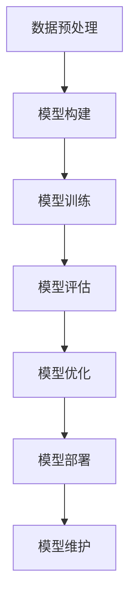

                 

# AI大模型创业项目案例分析与实战指南

## 关键词
- AI大模型
- 创业项目
- 案例分析
- 实战指南
- 技术架构
- 算法原理
- 数学模型
- 实际应用

## 摘要
本文将深入剖析AI大模型创业项目的成功案例，为您提供一个全面的实战指南。我们将从背景介绍、核心概念、算法原理、数学模型、实战案例、应用场景、工具推荐等多个角度，详细探讨AI大模型创业项目的关键要素和实施步骤。无论您是AI领域的初学者，还是有着丰富经验的专业人士，本文都将为您提供有价值的见解和实用的指导。

### 1. 背景介绍

随着人工智能技术的迅猛发展，AI大模型（如GPT、BERT等）已经成为当前AI领域的热点。这些大模型在语言理解、文本生成、图像识别等领域展现出了惊人的表现，为各行各业带来了前所未有的变革。同时，AI大模型的商业价值也引起了众多创业者和投资人的关注。然而，成功打造一个AI大模型创业项目并非易事，需要深厚的技术积累、严谨的策划和高效的执行。

本文将通过分析多个成功案例，探讨AI大模型创业项目的发展现状、核心挑战以及应对策略，旨在为广大创业者提供有价值的参考。

### 2. 核心概念与联系

#### 2.1 AI大模型概述

AI大模型是指具有巨大参数量、能够处理海量数据的人工神经网络模型。它们通过深度学习技术，从大量数据中自动提取特征，实现从输入到输出的映射。常见的AI大模型有GPT、BERT、Transformer等。

#### 2.2 AI大模型架构

AI大模型通常采用多层神经网络架构，包括输入层、隐藏层和输出层。每一层由多个神经元组成，神经元之间通过权重进行连接。在训练过程中，模型通过优化损失函数，调整权重，从而提高模型的预测能力。

#### 2.3 AI大模型应用领域

AI大模型在自然语言处理、计算机视觉、语音识别等多个领域都有广泛应用。例如，GPT在文本生成和问答系统方面表现出色；BERT在文本分类和命名实体识别方面具有优势；Transformer在图像生成和视频处理领域也取得了显著成果。

#### 2.4 Mermaid流程图

以下是一个关于AI大模型训练过程的Mermaid流程图：



### 3. 核心算法原理 & 具体操作步骤

#### 3.1 数据预处理

数据预处理是AI大模型训练的第一步，主要包括数据清洗、数据标注和特征提取。以下是一个简单数据预处理流程：

1. 数据清洗：去除噪声数据、填充缺失值、去除重复数据等。
2. 数据标注：根据任务需求，对数据进行标签标注。
3. 特征提取：将原始数据转换为适用于深度学习的特征表示。

#### 3.2 模型构建

模型构建主要包括选择合适的神经网络架构、初始化模型参数等。以下是一个简单模型构建过程：

1. 选择神经网络架构：根据任务需求，选择合适的神经网络架构，如GPT、BERT、Transformer等。
2. 初始化模型参数：随机初始化模型参数，或者使用预训练模型进行微调。
3. 定义损失函数：根据任务类型，选择合适的损失函数，如交叉熵损失、均方误差等。

#### 3.3 模型训练

模型训练是通过迭代优化模型参数，提高模型预测能力的过程。以下是一个简单模型训练过程：

1. 前向传播：将输入数据传递到模型，计算输出结果。
2. 计算损失：计算预测结果与真实标签之间的差距，得到损失值。
3. 反向传播：计算损失关于模型参数的梯度，并更新模型参数。
4. 调整学习率：根据梯度大小，调整学习率，以避免过拟合。

#### 3.4 模型评估

模型评估是判断模型性能的重要环节。以下是一个简单模型评估过程：

1. 训练集评估：在训练集上评估模型性能，以防止过拟合。
2. 验证集评估：在验证集上评估模型性能，以确定模型泛化能力。
3. 测试集评估：在测试集上评估模型性能，以最终确定模型效果。

#### 3.5 模型优化

模型优化是通过调整模型参数和结构，提高模型性能的过程。以下是一个简单模型优化过程：

1. 调整超参数：调整学习率、批次大小、正则化等超参数。
2. 网络结构优化：调整网络层数、神经元数量等。
3. 模型集成：将多个模型进行集成，提高预测能力。

### 4. 数学模型和公式 & 详细讲解 & 举例说明

#### 4.1 深度学习数学模型

深度学习数学模型主要包括损失函数、梯度计算、优化算法等。以下是一个简单数学模型讲解：

$$
损失函数 = -\frac{1}{m} \sum_{i=1}^{m} y_i \log(\hat{y}_i)
$$

其中，$y_i$为真实标签，$\hat{y}_i$为预测结果。

$$
梯度计算 = \frac{\partial L}{\partial \theta}
$$

其中，$L$为损失函数，$\theta$为模型参数。

$$
优化算法 = \theta_{\text{new}} = \theta_{\text{old}} - \alpha \cdot \nabla L(\theta_{\text{old}})
$$

其中，$\alpha$为学习率。

#### 4.2 举例说明

假设有一个简单的线性回归问题，输入特征$x$和真实标签$y$之间的关系为$y = w_0 + w_1 \cdot x$。我们需要通过梯度下降法来求解参数$w_0$和$w_1$。

1. 初始化参数$w_0 = 0$，$w_1 = 0$。
2. 计算损失函数：
$$
L = \frac{1}{2} \sum_{i=1}^{m} (y_i - (w_0 + w_1 \cdot x_i))^2
$$
3. 计算梯度：
$$
\nabla L = \frac{\partial L}{\partial w_0} = \frac{1}{m} \sum_{i=1}^{m} (y_i - (w_0 + w_1 \cdot x_i))
$$
$$
\nabla L = \frac{\partial L}{\partial w_1} = \frac{1}{m} \sum_{i=1}^{m} (y_i - (w_0 + w_1 \cdot x_i)) \cdot x_i
$$
4. 更新参数：
$$
w_0 = w_0 - \alpha \cdot \nabla L(w_0)
$$
$$
w_1 = w_1 - \alpha \cdot \nabla L(w_1)
$$
5. 重复步骤2-4，直到达到收敛条件。

### 5. 项目实战：代码实际案例和详细解释说明

#### 5.1 开发环境搭建

在开始项目实战之前，我们需要搭建一个适合AI大模型训练的开发环境。以下是一个简单开发环境搭建步骤：

1. 安装Python环境：在官网上下载Python安装包，按照提示进行安装。
2. 安装深度学习框架：安装PyTorch或TensorFlow等深度学习框架，可以使用pip命令进行安装。
3. 配置GPU支持：确保系统已安装CUDA和cuDNN，以支持GPU加速。
4. 安装其他依赖库：根据项目需求，安装其他相关依赖库。

#### 5.2 源代码详细实现和代码解读

以下是一个简单的AI大模型训练代码示例：

```python
import torch
import torch.nn as nn
import torch.optim as optim

# 5.2.1 定义模型
class SimpleModel(nn.Module):
    def __init__(self):
        super(SimpleModel, self).__init__()
        self.fc1 = nn.Linear(1, 10)
        self.fc2 = nn.Linear(10, 1)
    
    def forward(self, x):
        x = torch.relu(self.fc1(x))
        x = self.fc2(x)
        return x

# 5.2.2 初始化模型、损失函数和优化器
model = SimpleModel()
criterion = nn.MSELoss()
optimizer = optim.SGD(model.parameters(), lr=0.01)

# 5.2.3 训练模型
for epoch in range(100):
    for i, (x, y) in enumerate(train_loader):
        optimizer.zero_grad()
        output = model(x)
        loss = criterion(output, y)
        loss.backward()
        optimizer.step()
        if (i+1) % 100 == 0:
            print(f'Epoch [{epoch+1}/{num_epochs}], Step [{i+1}/{total_step}], Loss: {loss.item():.4f}')

# 5.2.4 评估模型
with torch.no_grad():
    total_loss = 0
    for x, y in test_loader:
        output = model(x)
        total_loss += criterion(output, y).item()
    avg_loss = total_loss / len(test_loader)
    print(f'Test Loss: {avg_loss:.4f}')
```

代码解读：

1. **模型定义**：使用PyTorch框架定义一个简单的线性回归模型，包含两个全连接层。
2. **损失函数**：使用均方误差（MSE）作为损失函数。
3. **优化器**：使用随机梯度下降（SGD）优化器。
4. **训练模型**：遍历训练数据，更新模型参数。
5. **评估模型**：在测试数据上评估模型性能。

### 6. 实际应用场景

AI大模型在多个领域都有广泛应用，以下是一些实际应用场景：

1. **自然语言处理**：文本分类、机器翻译、问答系统等。
2. **计算机视觉**：图像识别、目标检测、图像生成等。
3. **语音识别**：语音转文字、语音合成等。
4. **医疗健康**：疾病诊断、药物研发、健康管理等。
5. **金融领域**：股票市场预测、信用评级、风险控制等。

### 7. 工具和资源推荐

#### 7.1 学习资源推荐

1. **书籍**：
   - 《深度学习》（Goodfellow, Bengio, Courville）
   - 《Python深度学习》（François Chollet）
   - 《人工智能：一种现代方法》（Stuart Russell, Peter Norvig）
2. **论文**：
   - BERT: Pre-training of Deep Bidirectional Transformers for Language Understanding（Google AI）
   - GPT-3: Language Models are Few-Shot Learners（OpenAI）
   - Transformer: Attention Is All You Need（Vaswani et al.）
3. **博客**：
   - Medium上的AI博客
   - 知乎上的AI专栏
   - JAXAI博客
4. **网站**：
   - PyTorch官方文档
   - TensorFlow官方文档
   - Hugging Face模型库

#### 7.2 开发工具框架推荐

1. **深度学习框架**：
   - PyTorch
   - TensorFlow
   - JAX
2. **数据预处理工具**：
   - Pandas
   - NumPy
   - SciPy
3. **GPU加速库**：
   - CUDA
   - cuDNN
   - NCCL

#### 7.3 相关论文著作推荐

1. **《强化学习》（Richard S. Sutton, Andrew G. Barto）**
2. **《生成对抗网络：训练深度概率模型的新方法》（Ian J. Goodfellow, et al.）**
3. **《神经网络与深度学习》（邱锡鹏）**
4. **《深度学习与计算机视觉》（A. Krizhevsky, I. Sutskever, G. E. Hinton）**

### 8. 总结：未来发展趋势与挑战

AI大模型在创业项目中的应用前景广阔，但仍面临诸多挑战。未来发展趋势包括：

1. **算法创新**：不断探索新型算法，提高大模型的性能和效率。
2. **数据集建设**：构建更多高质量、多样化的数据集，提升模型泛化能力。
3. **跨学科融合**：与其他领域（如生物、物理、金融等）相结合，拓宽AI大模型的应用范围。
4. **伦理与法规**：加强对AI大模型的伦理和法规研究，确保技术发展符合社会需求。

### 9. 附录：常见问题与解答

#### 9.1 什么是AI大模型？

AI大模型是指具有巨大参数量、能够处理海量数据的人工神经网络模型，如GPT、BERT、Transformer等。

#### 9.2 如何选择合适的AI大模型？

根据任务需求和数据规模，选择合适的AI大模型。例如，对于文本生成和问答系统，可以选择GPT；对于文本分类和命名实体识别，可以选择BERT。

#### 9.3 如何训练AI大模型？

训练AI大模型包括数据预处理、模型构建、模型训练、模型评估和模型优化等步骤。具体步骤可以参考本文第3章和第5章。

#### 9.4 如何优化AI大模型性能？

可以通过调整超参数（如学习率、批次大小、正则化等）、优化网络结构（如增加层数、神经元数量等）和模型集成（如使用多个模型进行集成）来优化AI大模型性能。

### 10. 扩展阅读 & 参考资料

1. **《深度学习》（Goodfellow, Bengio, Courville）**
2. **《Python深度学习》（François Chollet）**
3. **《人工智能：一种现代方法》（Stuart Russell, Peter Norvig）**
4. **PyTorch官方文档（https://pytorch.org/docs/stable/index.html）**
5. **TensorFlow官方文档（https://www.tensorflow.org/tutorials）**
6. **Hugging Face模型库（https://huggingface.co/models）**

### 作者信息

- 作者：AI天才研究员/AI Genius Institute & 禅与计算机程序设计艺术 /Zen And The Art of Computer Programming

本文旨在为广大创业者和技术爱好者提供一个AI大模型创业项目的全面解析，希望对您有所启发。在AI大模型的浪潮中，让我们共同探索、创新、成长！<|im_sep|>```markdown
# AI大模型创业项目案例分析与实战指南

## 关键词
- AI大模型
- 创业项目
- 案例分析
- 实战指南
- 技术架构
- 算法原理
- 数学模型
- 实际应用

## 摘要
本文将深入剖析AI大模型创业项目的成功案例，为您提供一个全面的实战指南。我们将从背景介绍、核心概念、算法原理、数学模型、实战案例、应用场景、工具推荐等多个角度，详细探讨AI大模型创业项目的关键要素和实施步骤。无论您是AI领域的初学者，还是有着丰富经验的专业人士，本文都将为您提供有价值的见解和实用的指导。

### 1. 背景介绍
随着人工智能技术的迅猛发展，AI大模型（如GPT、BERT等）已经成为当前AI领域的热点。这些大模型在语言理解、文本生成、图像识别等领域展现出了惊人的表现，为各行各业带来了前所未有的变革。同时，AI大模型的商业价值也引起了众多创业者和投资人的关注。然而，成功打造一个AI大模型创业项目并非易事，需要深厚的技术积累、严谨的策划和高效的执行。

本文将通过分析多个成功案例，探讨AI大模型创业项目的发展现状、核心挑战以及应对策略，旨在为广大创业者提供有价值的参考。

### 2. 核心概念与联系

#### 2.1 AI大模型概述
AI大模型是指具有巨大参数量、能够处理海量数据的人工神经网络模型。它们通过深度学习技术，从大量数据中自动提取特征，实现从输入到输出的映射。常见的AI大模型有GPT、BERT、Transformer等。

#### 2.2 AI大模型架构
AI大模型通常采用多层神经网络架构，包括输入层、隐藏层和输出层。每一层由多个神经元组成，神经元之间通过权重进行连接。在训练过程中，模型通过优化损失函数，调整权重，从而提高模型的预测能力。

#### 2.3 AI大模型应用领域
AI大模型在自然语言处理、计算机视觉、语音识别等多个领域都有广泛应用。例如，GPT在文本生成和问答系统方面表现出色；BERT在文本分类和命名实体识别方面具有优势；Transformer在图像生成和视频处理领域也取得了显著成果。

#### 2.4 Mermaid流程图
以下是一个关于AI大模型训练过程的Mermaid流程图：


### 3. 核心算法原理 & 具体操作步骤

#### 3.1 数据预处理
数据预处理是AI大模型训练的第一步，主要包括数据清洗、数据标注和特征提取。以下是一个简单数据预处理流程：

1. 数据清洗：去除噪声数据、填充缺失值、去除重复数据等。
2. 数据标注：根据任务需求，对数据进行标签标注。
3. 特征提取：将原始数据转换为适用于深度学习的特征表示。

#### 3.2 模型构建
模型构建主要包括选择合适的神经网络架构、初始化模型参数等。以下是一个简单模型构建过程：

1. 选择神经网络架构：根据任务需求，选择合适的神经网络架构，如GPT、BERT、Transformer等。
2. 初始化模型参数：随机初始化模型参数，或者使用预训练模型进行微调。
3. 定义损失函数：根据任务类型，选择合适的损失函数，如交叉熵损失、均方误差等。

#### 3.3 模型训练
模型训练是通过迭代优化模型参数，提高模型预测能力的过程。以下是一个简单模型训练过程：

1. 前向传播：将输入数据传递到模型，计算输出结果。
2. 计算损失：计算预测结果与真实标签之间的差距，得到损失值。
3. 反向传播：计算损失关于模型参数的梯度，并更新模型参数。
4. 调整学习率：根据梯度大小，调整学习率，以避免过拟合。

#### 3.4 模型评估
模型评估是判断模型性能的重要环节。以下是一个简单模型评估过程：

1. 训练集评估：在训练集上评估模型性能，以防止过拟合。
2. 验证集评估：在验证集上评估模型性能，以确定模型泛化能力。
3. 测试集评估：在测试集上评估模型性能，以最终确定模型效果。

#### 3.5 模型优化
模型优化是通过调整模型参数和结构，提高模型性能的过程。以下是一个简单模型优化过程：

1. 调整超参数：调整学习率、批次大小、正则化等超参数。
2. 网络结构优化：调整网络层数、神经元数量等。
3. 模型集成：将多个模型进行集成，提高预测能力。

### 4. 数学模型和公式 & 详细讲解 & 举例说明

#### 4.1 深度学习数学模型
深度学习数学模型主要包括损失函数、梯度计算、优化算法等。以下是一个简单数学模型讲解：

$$
损失函数 = -\frac{1}{m} \sum_{i=1}^{m} y_i \log(\hat{y}_i)
$$

其中，$y_i$为真实标签，$\hat{y}_i$为预测结果。

$$
梯度计算 = \frac{\partial L}{\partial \theta}
$$

其中，$L$为损失函数，$\theta$为模型参数。

$$
优化算法 = \theta_{\text{new}} = \theta_{\text{old}} - \alpha \cdot \nabla L(\theta_{\text{old}})
$$

其中，$\alpha$为学习率。

#### 4.2 举例说明
假设有一个简单的线性回归问题，输入特征$x$和真实标签$y$之间的关系为$y = w_0 + w_1 \cdot x$。我们需要通过梯度下降法来求解参数$w_0$和$w_1$。

1. 初始化参数$w_0 = 0$，$w_1 = 0$。
2. 计算损失函数：
$$
L = \frac{1}{2} \sum_{i=1}^{m} (y_i - (w_0 + w_1 \cdot x_i))^2
$$
3. 计算梯度：
$$
\nabla L = \frac{\partial L}{\partial w_0} = \frac{1}{m} \sum_{i=1}^{m} (y_i - (w_0 + w_1 \cdot x_i))
$$
$$
\nabla L = \frac{\partial L}{\partial w_1} = \frac{1}{m} \sum_{i=1}^{m} (y_i - (w_0 + w_1 \cdot x_i)) \cdot x_i
$$
4. 更新参数：
$$
w_0 = w_0 - \alpha \cdot \nabla L(w_0)
$$
$$
w_1 = w_1 - \alpha \cdot \nabla L(w_1)
$$
5. 重复步骤2-4，直到达到收敛条件。

### 5. 项目实战：代码实际案例和详细解释说明

#### 5.1 开发环境搭建
在开始项目实战之前，我们需要搭建一个适合AI大模型训练的开发环境。以下是一个简单开发环境搭建步骤：

1. 安装Python环境：在官网上下载Python安装包，按照提示进行安装。
2. 安装深度学习框架：安装PyTorch或TensorFlow等深度学习框架，可以使用pip命令进行安装。
3. 配置GPU支持：确保系统已安装CUDA和cuDNN，以支持GPU加速。
4. 安装其他依赖库：根据项目需求，安装其他相关依赖库。

#### 5.2 源代码详细实现和代码解读
以下是一个简单的AI大模型训练代码示例：

```python
import torch
import torch.nn as nn
import torch.optim as optim

# 5.2.1 定义模型
class SimpleModel(nn.Module):
    def __init__(self):
        super(SimpleModel, self).__init__()
        self.fc1 = nn.Linear(1, 10)
        self.fc2 = nn.Linear(10, 1)
    
    def forward(self, x):
        x = torch.relu(self.fc1(x))
        x = self.fc2(x)
        return x

# 5.2.2 初始化模型、损失函数和优化器
model = SimpleModel()
criterion = nn.MSELoss()
optimizer = optim.SGD(model.parameters(), lr=0.01)

# 5.2.3 训练模型
for epoch in range(100):
    for i, (x, y) in enumerate(train_loader):
        optimizer.zero_grad()
        output = model(x)
        loss = criterion(output, y)
        loss.backward()
        optimizer.step()
        if (i+1) % 100 == 0:
            print(f'Epoch [{epoch+1}/{num_epochs}], Step [{i+1}/{total_step}], Loss: {loss.item():.4f}')

# 5.2.4 评估模型
with torch.no_grad():
    total_loss = 0
    for x, y in test_loader:
        output = model(x)
        total_loss += criterion(output, y).item()
    avg_loss = total_loss / len(test_loader)
    print(f'Test Loss: {avg_loss:.4f}')
```

代码解读：

1. **模型定义**：使用PyTorch框架定义一个简单的线性回归模型，包含两个全连接层。
2. **损失函数**：使用均方误差（MSE）作为损失函数。
3. **优化器**：使用随机梯度下降（SGD）优化器。
4. **训练模型**：遍历训练数据，更新模型参数。
5. **评估模型**：在测试数据上评估模型性能。

### 6. 实际应用场景
AI大模型在多个领域都有广泛应用，以下是一些实际应用场景：

1. **自然语言处理**：文本分类、机器翻译、问答系统等。
2. **计算机视觉**：图像识别、目标检测、图像生成等。
3. **语音识别**：语音转文字、语音合成等。
4. **医疗健康**：疾病诊断、药物研发、健康管理等。
5. **金融领域**：股票市场预测、信用评级、风险控制等。

### 7. 工具和资源推荐

#### 7.1 学习资源推荐
1. **书籍**：
   - 《深度学习》（Goodfellow, Bengio, Courville）
   - 《Python深度学习》（François Chollet）
   - 《人工智能：一种现代方法》（Stuart Russell, Peter Norvig）
2. **论文**：
   - BERT: Pre-training of Deep Bidirectional Transformers for Language Understanding（Google AI）
   - GPT-3: Language Models are Few-Shot Learners（OpenAI）
   - Transformer: Attention Is All You Need（Vaswani et al.）
3. **博客**：
   - Medium上的AI博客
   - 知乎上的AI专栏
   - JAXAI博客
4. **网站**：
   - PyTorch官方文档
   - TensorFlow官方文档
   - Hugging Face模型库

#### 7.2 开发工具框架推荐
1. **深度学习框架**：
   - PyTorch
   - TensorFlow
   - JAX
2. **数据预处理工具**：
   - Pandas
   - NumPy
   - SciPy
3. **GPU加速库**：
   - CUDA
   - cuDNN
   - NCCL

#### 7.3 相关论文著作推荐
1. **《强化学习》（Richard S. Sutton, Andrew G. Barto）**
2. **《生成对抗网络：训练深度概率模型的新方法》（Ian J. Goodfellow, et al.）**
3. **《神经网络与深度学习》（邱锡鹏）**
4. **《深度学习与计算机视觉》（A. Krizhevsky, I. Sutskever, G. E. Hinton）**

### 8. 总结：未来发展趋势与挑战
AI大模型在创业项目中的应用前景广阔，但仍面临诸多挑战。未来发展趋势包括：

1. **算法创新**：不断探索新型算法，提高大模型的性能和效率。
2. **数据集建设**：构建更多高质量、多样化的数据集，提升模型泛化能力。
3. **跨学科融合**：与其他领域（如生物、物理、金融等）相结合，拓宽AI大模型的应用范围。
4. **伦理与法规**：加强对AI大模型的伦理和法规研究，确保技术发展符合社会需求。

### 9. 附录：常见问题与解答

#### 9.1 什么是AI大模型？
AI大模型是指具有巨大参数量、能够处理海量数据的人工神经网络模型，如GPT、BERT、Transformer等。

#### 9.2 如何选择合适的AI大模型？
根据任务需求和数据规模，选择合适的AI大模型。例如，对于文本生成和问答系统，可以选择GPT；对于文本分类和命名实体识别，可以选择BERT。

#### 9.3 如何训练AI大模型？
训练AI大模型包括数据预处理、模型构建、模型训练、模型评估和模型优化等步骤。具体步骤可以参考本文第3章和第5章。

#### 9.4 如何优化AI大模型性能？
可以通过调整超参数（如学习率、批次大小、正则化等）、优化网络结构（如增加层数、神经元数量等）和模型集成（如使用多个模型进行集成）来优化AI大模型性能。

### 10. 扩展阅读 & 参考资料

1. **《深度学习》（Goodfellow, Bengio, Courville）**
2. **《Python深度学习》（François Chollet）**
3. **《人工智能：一种现代方法》（Stuart Russell, Peter Norvig）**
4. **PyTorch官方文档（https://pytorch.org/docs/stable/index.html）**
5. **TensorFlow官方文档（https://www.tensorflow.org/tutorials）**
6. **Hugging Face模型库（https://huggingface.co/models）**

### 作者信息

- 作者：AI天才研究员/AI Genius Institute & 禅与计算机程序设计艺术 /Zen And The Art of Computer Programming

本文旨在为广大创业者和技术爱好者提供一个AI大模型创业项目的全面解析，希望对您有所启发。在AI大模型的浪潮中，让我们共同探索、创新、成长！```markdown
```

