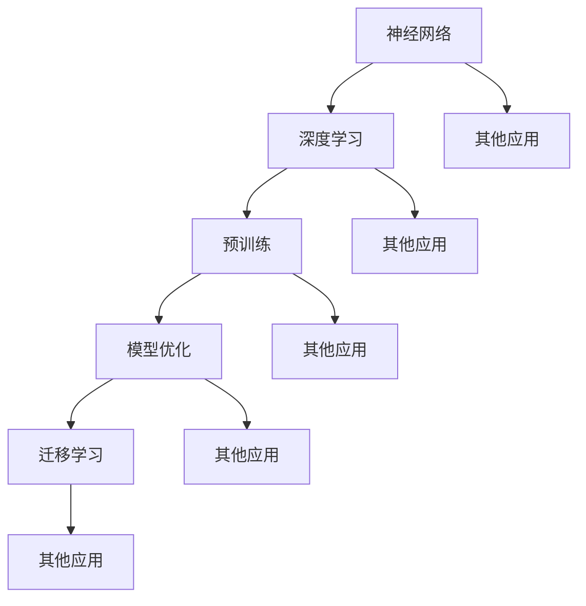
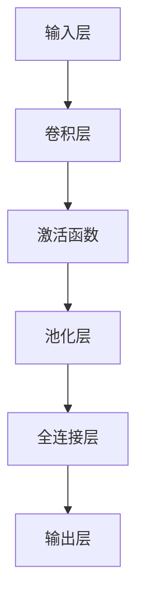
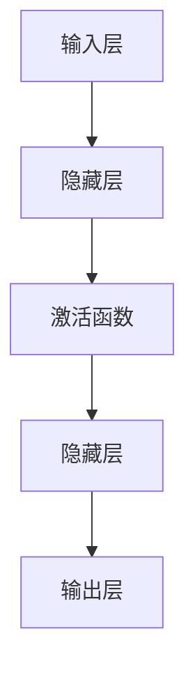
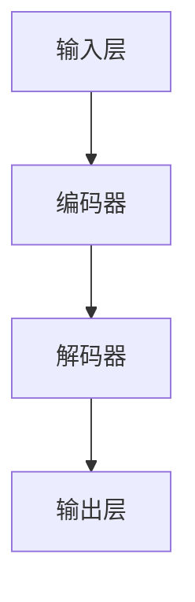

                 

### 背景介绍

在人工智能（AI）迅猛发展的当下，大模型（Large Models）成为了行业的热门话题。大模型，顾名思义，是指拥有巨大参数量和复杂结构的机器学习模型。这些模型在图像识别、自然语言处理、语音识别等领域展现出了卓越的性能。随着硬件性能的提升和算法的优化，大模型的研究与应用日益广泛，吸引了大量的科研人员和创业者。

近年来，AI大模型在各个领域都取得了显著的成果。例如，在图像识别领域，基于深度学习的卷积神经网络（CNN）模型已经超越人类水平；在自然语言处理领域，基于Transformer结构的预训练模型如BERT、GPT等，推动了自然语言理解和生成技术的飞速发展；在语音识别领域，基于循环神经网络（RNN）和注意力机制的模型显著提高了语音识别的准确性。这些成果不仅推动了AI技术的发展，也为各行各业带来了新的应用场景和商业模式。

然而，尽管AI大模型的技术和应用前景广阔，但创业者在实际操作中仍面临诸多挑战。如何设计和训练高性能的大模型？如何确保模型的稳定性和可解释性？如何实现大模型的商业化应用？这些问题都是创业者需要深入思考的。此外，大模型的训练和推理对计算资源的需求极大，如何优化硬件配置和算法，降低成本，也是创业者需要解决的关键问题。

本文将围绕“AI大模型创业：如何实现未来盈利？”这一主题，逐步探讨大模型创业的背景、核心概念、算法原理、数学模型、项目实战、实际应用场景、工具和资源推荐，以及未来发展趋势与挑战。通过本文的探讨，希望能为广大创业者提供有益的启示和实用的指导。

### 核心概念与联系

在深入探讨AI大模型创业之前，有必要首先理解一些核心概念及其相互联系。这些概念包括神经网络、深度学习、预训练、模型优化、迁移学习等，它们构成了大模型研究和应用的基础。

#### 神经网络（Neural Networks）

神经网络是模拟人脑神经元结构和功能的一种计算模型。它由大量的节点（或称为“神经元”）组成，每个节点都与其他节点相连，并具有相应的权重。节点通过激活函数对输入进行非线性变换，然后将结果传递给下一层节点。神经网络的训练过程实质上是通过反向传播算法调整节点间的权重，以优化输出结果。

#### 深度学习（Deep Learning）

深度学习是神经网络的一种特殊形式，它通过增加网络的层数，使模型能够捕捉更复杂的特征。深度学习模型在图像识别、语音识别、自然语言处理等领域取得了显著成就。常见的深度学习模型包括卷积神经网络（CNN）、循环神经网络（RNN）和Transformer等。

#### 预训练（Pre-training）

预训练是指在大规模数据集上预先训练模型，使其获得通用特征表示。预训练模型通常经过多层训练，从而在不同任务上具有较好的泛化能力。例如，BERT和GPT等预训练模型在自然语言处理领域表现卓越。预训练后的模型可以用于特定任务上的微调（Fine-tuning），显著提高任务性能。

#### 模型优化（Model Optimization）

模型优化旨在提高模型的性能、稳定性和可解释性。常见的方法包括调整网络结构、优化训练策略、剪枝（Pruning）、量化（Quantization）等。这些方法可以减少模型的参数数量，降低计算复杂度，从而提高模型的效率。

#### 迁移学习（Transfer Learning）

迁移学习是指利用预训练模型在特定任务上的知识，迁移到新的任务上。通过迁移学习，可以减少模型训练所需的数据量，提高模型在新任务上的性能。迁移学习在大模型创业中具有重要意义，因为它可以降低新任务的开发成本，加快产品上市时间。

#### Mermaid 流程图

为了更好地理解这些核心概念之间的联系，我们可以使用Mermaid流程图来表示。以下是一个简化的Mermaid流程图，展示了神经网络、深度学习、预训练、模型优化和迁移学习之间的关系：



在这个流程图中，我们可以看到神经网络是深度学习的基础，深度学习又衍生出预训练、模型优化和迁移学习。这些概念相互关联，共同推动了AI技术的发展。

通过以上对核心概念的介绍和Mermaid流程图的展示，我们可以更好地理解AI大模型创业中的关键要素。接下来，我们将深入探讨大模型的核心算法原理和具体操作步骤，以便为后续的创业实践提供更具体的指导。

#### 核心算法原理与具体操作步骤

AI大模型的核心算法主要包括深度学习中的卷积神经网络（CNN）、循环神经网络（RNN）和Transformer等。这些算法通过不同的方式处理数据，捕捉不同类型的特征，从而实现高效的模型训练和任务表现。以下是这些核心算法的基本原理和具体操作步骤。

##### 卷积神经网络（CNN）

卷积神经网络是处理图像数据的一种常见深度学习模型。它的核心思想是使用卷积层（Convolutional Layer）来提取图像的局部特征，然后通过池化层（Pooling Layer）减少特征图的维度，提高模型的计算效率。以下是一个简化的CNN模型操作步骤：

1. **输入层**：接收图像数据，通常是一个二维矩阵。
2. **卷积层**：使用卷积核（Convolutional Kernel）在输入数据上滑动，计算局部特征图的卷积结果。每个卷积核提取一种特定的特征。
3. **激活函数**：通常使用ReLU（Rectified Linear Unit）函数对卷积结果进行非线性变换，增加模型的非线性能力。
4. **池化层**：对卷积后的特征图进行下采样，减少数据维度，同时保留重要的特征信息。
5. **全连接层**：将池化后的特征图展开成一维向量，并通过全连接层（Fully Connected Layer）进行分类或回归任务。
6. **输出层**：输出最终结果，如类别概率或预测值。

以下是一个简化的CNN模型Mermaid流程图：



##### 循环神经网络（RNN）

循环神经网络是处理序列数据的一种常见深度学习模型。它的核心思想是使用循环结构来处理时间序列中的依赖关系，从而捕捉长距离特征。以下是一个简化的RNN模型操作步骤：

1. **输入层**：接收序列数据，通常是一个一维数组。
2. **隐藏层**：通过循环连接，将当前输入与前一时刻的隐藏状态结合，生成新的隐藏状态。RNN通过记忆机制捕捉序列中的依赖关系。
3. **激活函数**：通常使用ReLU或tanh等激活函数，增加模型的非线性能力。
4. **输出层**：将隐藏状态映射到输出结果，如序列标签或预测值。

以下是一个简化的RNN模型Mermaid流程图：



##### Transformer

Transformer是自然语言处理领域的一种突破性模型，其核心思想是使用自注意力机制（Self-Attention）来处理序列数据。以下是一个简化的Transformer模型操作步骤：

1. **输入层**：接收序列数据，通常是一个一维数组。
2. **编码器**：通过多层自注意力机制和前馈网络，对输入序列进行编码，生成编码后的特征表示。
3. **解码器**：通过多层自注意力机制和前馈网络，对编码后的特征进行解码，生成输出序列。
4. **输出层**：将解码后的特征映射到输出结果，如序列标签或预测值。

以下是一个简化的Transformer模型Mermaid流程图：



通过以上对CNN、RNN和Transformer等核心算法的基本原理和具体操作步骤的介绍，我们可以看到，这些算法在处理不同类型的数据时，各有其独特的优势和特点。创业者可以根据具体的应用场景，选择合适的算法进行模型设计和训练。

#### 数学模型与公式详解

在深入探讨AI大模型的数学模型与公式时，我们需要从基础的神经网络模型出发，逐步引入深度学习、预训练、模型优化等高级概念。以下是这些数学模型的详细讲解与具体公式。

##### 神经网络基本模型

神经网络的数学模型基于神经元之间的加权连接和激活函数。一个简单的神经网络模型包括输入层、隐藏层和输出层。以下是神经网络的基本公式：

1. **输入层到隐藏层的激活函数**：

   $$ z_i = \sum_{j=1}^{n} w_{ij} x_j + b_i $$

   $$ a_i = \sigma(z_i) $$

   其中，\( x_j \) 是输入层第 \( j \) 个节点的值，\( w_{ij} \) 是输入层到隐藏层的权重，\( b_i \) 是隐藏层第 \( i \) 个节点的偏置，\( \sigma \) 是激活函数，常用的激活函数有ReLU、tanh和sigmoid。

2. **隐藏层到输出层的激活函数**：

   $$ z_j = \sum_{i=1}^{m} w_{ij} a_i + b_j $$

   $$ y_j = \sigma(z_j) $$

   其中，\( a_i \) 是隐藏层第 \( i \) 个节点的激活值，\( w_{ij} \) 是隐藏层到输出层的权重，\( b_j \) 是输出层第 \( j \) 个节点的偏置，\( \sigma \) 是激活函数。

##### 损失函数与反向传播

在训练神经网络时，我们需要通过损失函数（Loss Function）来评估模型的预测结果与真实结果之间的差距，并使用反向传播算法（Backpropagation）更新模型参数。以下是常用的损失函数与反向传播公式：

1. **均方误差损失函数**：

   $$ L = \frac{1}{2} \sum_{i=1}^{N} (y_i - \hat{y}_i)^2 $$

   其中，\( y_i \) 是真实标签，\( \hat{y}_i \) 是模型预测的标签，\( N \) 是样本数量。

2. **反向传播更新公式**：

   $$ \Delta w_{ij} = \alpha \frac{\partial L}{\partial w_{ij}} $$

   $$ \Delta b_i = \alpha \frac{\partial L}{\partial b_i} $$

   其中，\( \alpha \) 是学习率，\( \frac{\partial L}{\partial w_{ij}} \) 和 \( \frac{\partial L}{\partial b_i} \) 分别是权重和偏置的梯度。

##### 深度学习高级模型

深度学习中的高级模型如CNN、RNN和Transformer，它们的数学模型较为复杂，涉及更多的公式和概念。以下是这些模型的基本公式：

1. **卷积神经网络（CNN）卷积操作**：

   $$ \hat{f}(x, y) = \sum_{i=1}^{k} w_{i, j} f(x - i, y - j) $$

   其中，\( \hat{f}(x, y) \) 是卷积结果，\( f(x, y) \) 是输入特征图，\( w_{i, j} \) 是卷积核，\( k \) 是卷积核的大小。

2. **循环神经网络（RNN）更新公式**：

   $$ h_t = \sigma(W_h h_{t-1} + W_x x_t + b_h) $$

   $$ y_t = \sigma(W_o h_t + b_o) $$

   其中，\( h_t \) 是隐藏状态，\( x_t \) 是输入序列，\( W_h \)、\( W_x \)、\( b_h \) 和 \( W_o \)、\( b_o \) 分别是权重和偏置。

3. **Transformer自注意力机制**：

   $$ \text{Attention}(Q, K, V) = \frac{softmax(\frac{QK^T}{\sqrt{d_k}})}{V} $$

   其中，\( Q \)、\( K \) 和 \( V \) 分别是查询（Query）、键（Key）和值（Value）向量，\( d_k \) 是键向量的维度。

通过以上对神经网络、深度学习、预训练和模型优化等数学模型的详细讲解，我们可以更深入地理解AI大模型的核心原理。接下来，我们将通过实际项目实战，展示这些数学模型在具体应用中的实现过程。

### 项目实战：代码实际案例与详细解读

为了更好地理解AI大模型在实际项目中的应用，我们接下来将展示一个基于Transformer模型的文本分类项目的完整开发过程，包括开发环境的搭建、源代码的详细实现和代码解读。

#### 1. 开发环境搭建

在进行项目开发之前，我们需要搭建一个适合AI大模型训练和部署的开发环境。以下是搭建开发环境的步骤：

1. **安装Python**：确保安装了Python 3.8及以上版本。

2. **安装PyTorch**：使用pip命令安装PyTorch：

   ```bash
   pip install torch torchvision
   ```

3. **安装其他依赖**：安装其他必要的库，如torchtext、torchvision等：

   ```bash
   pip install torchtext torchvision
   ```

4. **配置GPU环境**：确保安装了CUDA和cuDNN，以支持GPU加速训练。

5. **创建虚拟环境**：为了保持开发环境的干净和独立，创建一个虚拟环境：

   ```bash
   python -m venv venv
   source venv/bin/activate
   ```

#### 2. 源代码详细实现

以下是一个基于Transformer的文本分类项目的源代码实现。代码主要分为数据预处理、模型定义、训练和评估四个部分。

```python
import torch
import torch.nn as nn
import torch.optim as optim
from torchtext.legacy import data
from torchtext.legacy.data import Field, TabularDataset, BucketIterator

# 数据预处理
def load_data():
    # 定义字段
    TEXT = Field(tokenize='spacy', lower=True, include_lengths=True)
    LABEL = Field(sequential=False)

    # 加载数据集
    train_data, test_data = TabularDataset.splits(
        path='data',
        train='train.csv',
        test='test.csv',
        format='csv',
        fields=[('text', TEXT), ('label', LABEL)]
    )

    # 划分数据集
    train_data, valid_data = train_data.split()

    # 分词和建立词汇表
    TEXT.build_vocab(train_data, max_size=25000, vectors="glove.6B.100d")
    LABEL.build_vocab(train_data)

    # 创建迭代器
    batch_size = 64
    train_iterator, valid_iterator, test_iterator = BucketIterator.splits(
        (train_data, valid_data, test_data),
        batch_size=batch_size,
        device=device
    )

    return train_iterator, valid_iterator, test_iterator

# 模型定义
class TransformerModel(nn.Module):
    def __init__(self, ntoken, dmodel, nhead, num_layers, dim_feedforward=2048, dropout=0.1):
        super(TransformerModel, self).__init__()
        self/embedding = nn.Embedding(ntoken, dmodel)
        self.transformer = nn.Transformer(dmodel, nhead, num_layers, dim_feedforward, dropout)
        self.fc = nn.Linear(dmodel, ntoken)

    def forward(self, src, src_len, tgt):
        # 输入层嵌入
        src = self.embedding(src)
        # Transformer编码器
        output = self.transformer(src, src_len=src_len)
        # 全连接层
        output = self.fc(output)
        return output

# 训练
def train(model, iterator, optimizer, criterion, clip):
    model.train()
    epoch_loss = 0
    epoch_acc = 0

    for batch in iterator:
        optimizer.zero_grad()
        # 数据预处理
        src, src_len = batch.text
        tgt = batch.label
        # 前向传播
        output = model(src, src_len, tgt)
        # 计算损失
        loss = criterion(output.view(-1, output.size(-1)), tgt)
        # 反向传播
        loss.backward()
        # 梯度裁剪
        nn.utils.clip_grad_norm_(model.parameters(), clip)
        # 更新模型参数
        optimizer.step()
        # 计算准确率
        preds = torch.argmax(output, dim=1)
        acc = torch.mean((preds == tgt).float())
        epoch_loss += loss.item()
        epoch_acc += acc.item()

    return epoch_loss / len(iterator), epoch_acc / len(iterator)

# 评估
def evaluate(model, iterator, criterion):
    model.eval()
    epoch_loss = 0
    epoch_acc = 0

    with torch.no_grad():
        for batch in iterator:
            # 数据预处理
            src, src_len = batch.text
            tgt = batch.label
            # 前向传播
            output = model(src, src_len, tgt)
            # 计算损失
            loss = criterion(output.view(-1, output.size(-1)), tgt)
            # 计算准确率
            preds = torch.argmax(output, dim=1)
            acc = torch.mean((preds == tgt).float())
            epoch_loss += loss.item()
            epoch_acc += acc.item()

    return epoch_loss / len(iterator), epoch_acc / len(iterator)

# 主函数
def main():
    # 设备配置
    device = torch.device('cuda' if torch.cuda.is_available() else 'cpu')

    # 加载数据集
    train_iterator, valid_iterator, test_iterator = load_data()

    # 模型定义
    model = TransformerModel(len(TEXT.vocab), 512, 8, 3).to(device)

    # 损失函数和优化器
    criterion = nn.CrossEntropyLoss().to(device)
    optimizer = optim.Adam(model.parameters(), lr=0.001)

    # 训练和评估
    num_epochs = 10
    clip = 0.1

    for epoch in range(num_epochs):
        train_loss, train_acc = train(model, train_iterator, optimizer, criterion, clip)
        valid_loss, valid_acc = evaluate(model, valid_iterator, criterion)

        print(f'Epoch: {epoch+1}/{num_epochs}')
        print(f'\tTrain Loss: {train_loss:.3f} | Train Acc: {train_acc*100:.2f}%')
        print(f'\tValid Loss: {valid_loss:.3f} | Valid Acc: {valid_acc*100:.2f}%')

    # 测试
    test_loss, test_acc = evaluate(model, test_iterator, criterion)
    print(f'\nTest Loss: {test_loss:.3f} | Test Acc: {test_acc*100:.2f}%')

if __name__ == '__main__':
    main()
```

#### 3. 代码解读与分析

上述代码实现了一个基于Transformer的文本分类项目，以下是关键部分的解读与分析：

1. **数据预处理**：首先，我们定义了文本字段和标签字段，并使用`TabularDataset`加载数据集。接着，我们使用`BucketIterator`创建迭代器，以便在训练和评估过程中批量处理数据。

2. **模型定义**：`TransformerModel`类定义了Transformer模型的各个组件，包括嵌入层、Transformer编码器和解码器，以及全连接层。模型采用标准的Transformer架构，并使用自注意力机制来处理文本序列。

3. **训练**：`train`函数用于训练模型。它遍历数据集，使用梯度下降优化模型参数。在每次迭代中，我们通过前向传播计算损失，并使用反向传播更新模型参数。此外，我们使用梯度裁剪技术防止梯度爆炸。

4. **评估**：`evaluate`函数用于评估模型在验证集上的性能。它不更新模型参数，因此我们使用`torch.no_grad()`来节省计算资源。

5. **主函数**：在主函数中，我们首先配置设备（CPU或GPU），加载数据集，定义模型、损失函数和优化器。然后，我们进行多轮训练和评估，并在测试集上评估模型性能。

通过以上代码实现，我们可以看到Transformer模型在文本分类任务中的实际应用。接下来，我们将继续探讨大模型在实际应用场景中的挑战和解决方案。

### 实际应用场景

AI大模型在实际应用中展示了广泛的潜力，其卓越的性能和强大的泛化能力使其成为各个领域的关键技术。以下是AI大模型在自然语言处理、图像识别、推荐系统、医学诊断等领域的实际应用场景。

#### 自然语言处理

在自然语言处理（NLP）领域，AI大模型如BERT、GPT等已经被广泛应用于文本分类、机器翻译、问答系统、文本生成等领域。以BERT为例，它通过预训练获取了丰富的语言知识，并在多个NLP任务上取得了显著的性能提升。例如，BERT在英文问答系统SQuAD中的表现超过了人类水平，展示了其在理解和生成自然语言方面的强大能力。

#### 图像识别

图像识别是AI大模型的重要应用领域之一。通过卷积神经网络（CNN）和Transformer等深度学习模型，AI大模型能够实现高效、准确的图像分类、目标检测和图像分割。例如，在ImageNet图像分类挑战中，基于深度学习的模型如ResNet和EfficientNet等，已经实现了超过人类水平的识别准确率。此外，AI大模型在医疗影像分析中也表现突出，如通过卷积神经网络进行肿瘤检测和分类，提高了诊断的准确性和效率。

#### 推荐系统

AI大模型在推荐系统中的应用同样具有重要意义。通过用户行为数据和物品特征，大模型能够学习用户的偏好和兴趣，提供个性化的推荐。例如，亚马逊和Netflix等平台利用深度学习模型对用户进行精准推荐，提高了用户满意度和平台留存率。此外，大模型还可以用于商品搜索、社交网络推荐等场景，实现更智能、更个性化的用户体验。

#### 医学诊断

医学诊断是AI大模型的重要应用领域之一。通过处理大量的医学数据和图像，大模型能够辅助医生进行疾病诊断和治疗方案推荐。例如，在肺癌诊断中，AI大模型可以通过分析CT图像，准确识别肿瘤并预测其恶性程度，提高了诊断的准确性和效率。此外，AI大模型还在医学影像分析、基因组学分析等领域发挥了重要作用，为精准医疗提供了强有力的技术支持。

#### 语音识别

语音识别是AI大模型在语音处理领域的典型应用。通过深度学习模型，AI大模型能够实现高效、准确的语音识别和语音合成。例如，在智能语音助手（如苹果的Siri、谷歌的Google Assistant）中，AI大模型通过处理用户语音，理解用户指令并给出相应的回应，提高了交互的智能化和便捷性。

#### 机器人与自动驾驶

AI大模型在机器人与自动驾驶领域也展现了广阔的应用前景。通过深度学习模型，机器人能够学习环境特征，实现自主导航和任务执行。例如，在自动驾驶技术中，AI大模型通过分析摄像头和激光雷达数据，实现道路识别、车辆检测和路径规划，提高了自动驾驶的安全性和可靠性。

总之，AI大模型在自然语言处理、图像识别、推荐系统、医学诊断、语音识别、机器人与自动驾驶等领域具有广泛的应用。随着大模型技术的不断发展和优化，未来它将在更多领域发挥重要作用，推动人工智能技术的进一步发展。

### 工具和资源推荐

为了在AI大模型创业过程中更高效地进行模型开发和实验，我们需要推荐一些实用的工具和资源。以下是一些常用的学习资源、开发工具和相关论文著作，帮助创业者快速掌握AI大模型的技术。

#### 学习资源推荐

1. **在线课程**：

   - **《深度学习》（Deep Learning）**：由Ian Goodfellow、Yoshua Bengio和Aaron Courville合著的深度学习经典教材，提供了全面的深度学习理论和技术。
   - **《动手学深度学习》（Dive into Deep Learning）**：该项目提供了一整套深度学习教程，涵盖基础理论、实战案例和代码实现，适合初学者和进阶者。

2. **开源项目**：

   - **TensorFlow**：由Google开源的深度学习框架，支持多种类型的神经网络和模型，适用于大规模数据集的训练和推理。
   - **PyTorch**：由Facebook开源的深度学习框架，提供了灵活的动态计算图和丰富的API，适合研究和快速原型开发。

3. **社区和论坛**：

   - **Stack Overflow**：编程问答社区，适合解决AI大模型开发中的技术问题。
   - **GitHub**：代码托管平台，可以查看和贡献优秀的AI大模型开源项目。

#### 开发工具框架推荐

1. **数据处理工具**：

   - **Pandas**：Python的数据处理库，适用于数据清洗、数据预处理和数据分析。
   - **NumPy**：Python的科学计算库，提供高性能的数组操作和数学计算。

2. **模型训练工具**：

   - **Horovod**：由Uber开源的分布式训练工具，可以加速TensorFlow和PyTorch的模型训练。
   - **DistributedDataParallel (DDP)**：PyTorch的分布式训练库，支持多GPU和多节点训练。

3. **可视化工具**：

   - **TensorBoard**：TensorFlow的可视化工具，可以实时监控模型训练过程和参数变化。
   - **Visdom**：PyTorch的可视化工具，提供丰富的可视化功能，包括损失函数、准确率、学习率等。

#### 相关论文著作推荐

1. **经典论文**：

   - **“A Theoretical Basis for the Generalization of Neural Networks”**：该论文提出了深度神经网络的一般化理论，解释了深度神经网络为何能够泛化。
   - **“Attention Is All You Need”**：该论文提出了Transformer模型，颠覆了传统的序列处理方法，成为自然语言处理领域的重要突破。

2. **畅销书籍**：

   - **《Python深度学习》**：由François Chollet编写的深度学习教材，适合Python编程基础的读者。
   - **《深度学习》（Deep Learning）**：由Ian Goodfellow、Yoshua Bengio和Aaron Courville合著的经典教材，提供了全面的深度学习理论和技术。

通过以上推荐的工具和资源，创业者可以更快地掌握AI大模型的技术，并在实际项目中实现高效的模型开发和优化。

### 总结：未来发展趋势与挑战

随着AI大模型的不断发展和应用，其未来前景广阔，但也面临着诸多挑战。在接下来的部分，我们将探讨AI大模型在未来的发展趋势以及可能遇到的技术和商业挑战。

#### 未来发展趋势

1. **模型规模与性能的提升**：随着计算能力的提升和算法的优化，AI大模型的规模将不断扩大，性能也将进一步提高。这将为AI大模型在各个领域的应用提供更强大的支持。例如，在自然语言处理领域，预训练模型如GPT-3和PaLM等已经展现出令人瞩目的性能，而在图像识别领域，模型如ViT和DeiT等也在不断突破传统的性能极限。

2. **多模态数据处理**：未来，AI大模型将不仅限于单一模态的数据处理，而是能够处理多种类型的数据，如文本、图像、音频和视频等。这种多模态数据处理能力将大大扩展AI大模型的应用范围，实现更智能、更全面的解决方案。例如，通过结合文本和图像数据，AI大模型可以更准确地理解用户的需求，提供更个性化的服务。

3. **自监督学习和无监督学习**：自监督学习和无监督学习是未来的重要发展方向。这些方法能够在没有大量标注数据的情况下，通过数据自身的特征进行学习，从而降低数据标注的成本。例如，自监督预训练方法如BERT和ViT已经在各个领域取得了显著的成功，未来的AI大模型将更多地采用这些方法，实现更高效的学习。

4. **边缘计算与云计算的结合**：随着5G和边缘计算技术的发展，AI大模型将能够在边缘设备上实现实时推理和决策，减少对中央服务器的依赖，提高系统的响应速度和可靠性。这将为AI大模型在移动设备、智能家居、智能工厂等场景中的应用提供新的契机。

#### 技术挑战

1. **计算资源的消耗**：AI大模型的训练和推理对计算资源的需求极大，尤其是在训练过程中，需要大量的GPU和TPU资源。这给计算资源的配置和管理带来了巨大挑战。为了降低计算成本，未来需要进一步优化算法，提高计算效率，并探索更高效的硬件架构。

2. **数据隐私与安全**：在AI大模型的应用过程中，数据隐私和安全是重要的问题。尤其是在处理个人数据时，如何确保数据的安全和隐私，防止数据泄露，是一个亟待解决的问题。未来需要发展更为严格的数据保护机制和隐私保护算法，确保AI大模型的安全应用。

3. **模型的可解释性和透明性**：随着AI大模型在各个领域的应用，其决策过程和结果的可解释性变得越来越重要。用户和监管机构需要能够理解模型的决策过程，以确保模型的公平性和可靠性。未来需要发展更为透明和可解释的AI大模型，提高模型的透明度和可信度。

4. **算法的伦理和社会责任**：AI大模型的应用可能会带来一些伦理和社会问题，如歧视、偏见和不公平等。为了确保AI大模型的应用符合伦理和社会责任，未来需要制定相关的规范和标准，加强对AI大模型的监督和管理。

#### 商业挑战

1. **商业模式探索**：AI大模型的创业企业需要在商业模式上进行创新，探索可持续的盈利模式。例如，通过提供定制化服务、数据增值服务或软件即服务（SaaS）模式，企业可以实现在AI大模型领域的盈利。

2. **市场竞争**：随着AI大模型技术的普及，市场上将出现越来越多的竞争者。如何通过技术创新和差异化竞争，在激烈的市场竞争中脱颖而出，是一个重要的挑战。

3. **用户信任与接受度**：用户对AI大模型的信任和接受度是商业成功的关键。企业需要通过透明的沟通、优秀的产品体验和可靠的性能，赢得用户的信任和认可。

总之，AI大模型在未来的发展中将面临许多机遇和挑战。通过技术创新、商业模式创新和合规管理，创业者可以抓住这些机遇，克服挑战，推动AI大模型在各个领域的应用和普及。

### 附录：常见问题与解答

在AI大模型创业过程中，可能会遇到一些常见的技术问题和业务挑战。以下是一些常见问题及其解答，以帮助创业者更好地理解和应对这些问题。

#### 1. 如何选择合适的大模型？

**解答**：选择合适的大模型需要考虑以下几个方面：

- **应用场景**：根据实际应用场景选择模型，例如，自然语言处理选择BERT或GPT，图像识别选择ResNet或EfficientNet。
- **数据规模**：如果数据规模较大，可以选择大规模预训练模型，如GPT-3或Megatron。
- **计算资源**：考虑模型的计算复杂度，根据可用计算资源选择合适的模型。对于计算资源有限的情况，可以选择轻量级模型，如MobileNet或EfficientNet。
- **性能需求**：根据性能需求选择模型，如果对性能要求较高，可以选择最新的模型或进行模型定制。

#### 2. 如何确保大模型的训练效率和稳定性？

**解答**：为了提高大模型的训练效率和稳定性，可以采取以下措施：

- **优化硬件配置**：使用高性能GPU和TPU进行训练，并确保足够的内存和计算资源。
- **分布式训练**：使用分布式训练技术，如Horovod或DistributedDataParallel（DDP），将模型训练任务分布在多个GPU或TPU上，提高训练速度。
- **数据预处理**：进行有效的数据预处理，包括数据清洗、去重、归一化等，提高数据质量。
- **训练策略**：采用合适的训练策略，如学习率调度、批量归一化、梯度裁剪等，提高模型训练的稳定性。

#### 3. 如何处理大模型的计算资源消耗？

**解答**：以下是一些处理大模型计算资源消耗的方法：

- **优化模型结构**：通过模型剪枝（Pruning）、量化（Quantization）等方法减少模型参数数量，降低计算复杂度。
- **使用云计算**：利用云计算平台（如Google Cloud、AWS、Azure）提供的大规模计算资源，降低自有硬件的投资成本。
- **模型压缩与蒸馏**：通过模型压缩技术（如模型剪枝、量化）和模型蒸馏（Model Distillation），将大规模模型的知识传递给较小的模型，降低计算资源消耗。

#### 4. 如何保障大模型的数据隐私和安全？

**解答**：以下是一些保障大模型数据隐私和安全的方法：

- **数据加密**：对敏感数据进行加密，防止数据泄露。
- **隐私保护技术**：采用差分隐私（Differential Privacy）等隐私保护技术，确保模型训练过程中数据隐私。
- **安全审计**：定期进行安全审计，检查数据访问和控制措施是否有效。
- **数据合规性**：确保数据收集、处理和使用过程符合相关法律法规，如《通用数据保护条例》（GDPR）和《加州消费者隐私法案》（CCPA）。

#### 5. 如何应对大模型带来的伦理和社会问题？

**解答**：以下是一些应对大模型带来的伦理和社会问题的方法：

- **制定伦理准则**：建立AI伦理准则，明确大模型的应用范围和限制。
- **透明度与可解释性**：提高大模型的可解释性和透明度，使用户和监管机构能够理解模型的决策过程。
- **多学科合作**：与伦理学家、社会学家、法律专家等多学科专家合作，共同制定和实施AI大模型的应用规范。
- **公众沟通**：加强与公众的沟通，通过透明、负责任的沟通方式，提高用户对AI大模型的信任。

通过以上方法，创业者可以更好地应对AI大模型创业过程中遇到的技术和业务挑战，推动大模型在各个领域的应用和普及。

### 扩展阅读与参考资料

为了进一步深入了解AI大模型的相关技术和应用，以下推荐一些优秀的扩展阅读和参考资料，包括书籍、论文和博客，供读者参考。

#### 书籍

1. **《深度学习》**：作者Ian Goodfellow、Yoshua Bengio和Aaron Courville，这是一本全面介绍深度学习理论和应用的经典教材。
2. **《动手学深度学习》**：作者Awni Hannun、Chris Olah、Llion Jones等，通过大量的代码示例，深入讲解了深度学习的实战技巧。
3. **《Python深度学习》**：作者François Chollet，针对Python编程基础的读者，详细介绍了深度学习在Python中的应用。

#### 论文

1. **“Attention Is All You Need”**：作者Vaswani et al.，提出了Transformer模型，颠覆了传统的序列处理方法，是自然语言处理领域的里程碑论文。
2. **“A Theoretical Basis for the Generalization of Neural Networks”**：作者Yarin Gal和Zoubin Ghahramani，提出了深度神经网络的一般化理论，解释了深度神经网络为何能够泛化。
3. **“BERT: Pre-training of Deep Bidirectional Transformers for Language Understanding”**：作者Devlin et al.，介绍了BERT模型，展示了预训练在大规模语言模型中的应用潜力。

#### 博客

1. **TensorFlow官方博客**：提供最新的TensorFlow动态和技术文章，是深度学习爱好者的重要学习资源。
2. **PyTorch官方文档**：详细介绍了PyTorch的使用方法和最佳实践，有助于开发者快速上手PyTorch。
3. **Fast.ai博客**：专注于深度学习教育，提供了丰富的入门教程和实践案例，适合初学者学习。

#### 网站和资源

1. **GitHub**：提供大量的AI大模型开源项目和代码，是深度学习开发者的重要交流平台。
2. **arXiv**：计算机科学领域的前沿论文预印本库，可以查看最新的研究进展。
3. **Kaggle**：提供丰富的数据集和比赛，是数据科学家和AI爱好者进行实战训练和竞赛的平台。

通过阅读以上书籍、论文和博客，读者可以更深入地了解AI大模型的理论和实践，为创业实践提供有益的启示和指导。

