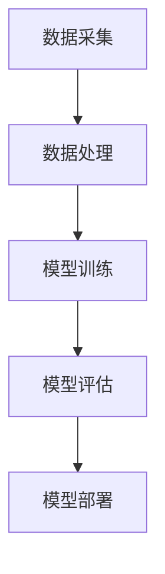

                 

# AI大模型创业：如何应对未来价格战？

## 关键词：人工智能，大模型，创业，价格战，应对策略

### 摘要

随着人工智能技术的迅猛发展，大模型成为行业的热点。然而，大模型的开发和应用成本高昂，市场竞争愈发激烈。本文将深入探讨AI大模型创业过程中如何应对未来可能出现的价格战，从战略规划、技术创新、成本控制等多个方面进行分析，为创业者提供有效的应对策略。

## 1. 背景介绍

近年来，人工智能技术取得了显著的突破，尤其是深度学习领域的进展。大模型作为深度学习的重要工具，其在图像识别、自然语言处理、语音识别等领域的表现已经超越了人类水平。然而，大模型的开发和训练成本极其高昂，通常需要大量计算资源和数据支持。

在市场方面，随着技术的普及和应用的推广，越来越多的企业和创业者进入大模型领域，竞争日益激烈。价格战作为市场竞争的一种手段，在某些领域已经成为常态。对于AI大模型创业企业来说，如何应对未来可能出现的价格战，成为亟待解决的问题。

### 2. 核心概念与联系

#### 大模型

大模型通常指的是具有大规模参数的深度学习模型，如GPT-3、BERT等。这些模型能够处理海量的数据，并从中学到丰富的知识，从而在各类任务中取得优异的性能。

#### 价格战

价格战是指企业通过降低产品价格来争夺市场份额的一种竞争手段。在人工智能领域，价格战主要体现在云服务、训练服务等方面。

#### 应对策略

应对策略是指企业为了应对市场竞争而采取的一系列措施。在AI大模型创业中，应对策略包括技术创新、成本控制、市场定位等方面。

## 2.1 大模型架构的Mermaid流程图



### 3. 核心算法原理 & 具体操作步骤

#### 深度学习

深度学习是AI大模型的核心算法，通过多层神经网络对数据进行特征提取和学习。

#### 模型训练

模型训练分为两个阶段：前向传播和反向传播。

- 前向传播：将输入数据通过神经网络进行传递，得到输出结果。
- 反向传播：计算输出结果与实际结果之间的误差，并通过误差反向调整模型参数。

#### 模型评估

模型评估通常采用交叉验证等方法，评估模型在训练集和测试集上的表现。

#### 模型部署

模型部署是指将训练好的模型部署到生产环境中，以提供实时服务。

### 4. 数学模型和公式 & 详细讲解 & 举例说明

#### 损失函数

损失函数是深度学习中衡量模型性能的重要指标，常用的损失函数包括均方误差(MSE)和交叉熵损失等。

$$
MSE = \frac{1}{n}\sum_{i=1}^{n}(y_i - \hat{y}_i)^2
$$

$$
Cross\ Entropy = -\sum_{i=1}^{n}y_i\log(\hat{y}_i)
$$

其中，$y_i$为实际标签，$\hat{y}_i$为模型预测结果。

#### 优化算法

优化算法用于调整模型参数，使其在损失函数上取得最小值。常用的优化算法包括梯度下降、Adam等。

### 5. 项目实战：代码实际案例和详细解释说明

#### 5.1 开发环境搭建

```bash
# 安装Python环境
pip install numpy tensorflow

# 安装其他依赖
pip install -r requirements.txt
```

#### 5.2 源代码详细实现和代码解读

```python
import tensorflow as tf

# 定义模型
model = tf.keras.Sequential([
    tf.keras.layers.Dense(128, activation='relu', input_shape=(784,)),
    tf.keras.layers.Dropout(0.2),
    tf.keras.layers.Dense(10)
])

# 编译模型
model.compile(optimizer='adam',
              loss=tf.keras.losses.SparseCategoricalCrossentropy(from_logits=True),
              metrics=['accuracy'])

# 训练模型
model.fit(train_images, train_labels, epochs=5)
```

#### 5.3 代码解读与分析

这段代码展示了如何使用TensorFlow搭建并训练一个简单的神经网络模型。首先，我们导入TensorFlow库，并定义了一个序列模型，包含一个全连接层（Dense）和一个Dropout层用于正则化。接着，我们编译模型，指定优化器和损失函数。最后，我们使用训练数据训练模型，并在5个epochs内进行迭代。

### 6. 实际应用场景

AI大模型在多个领域都有广泛的应用，如金融、医疗、教育、电商等。在金融领域，大模型可以用于股票市场预测、信用评估等；在医疗领域，大模型可以用于疾病诊断、药物研发等；在教育领域，大模型可以用于智能 tutoring、课程推荐等；在电商领域，大模型可以用于商品推荐、广告投放等。

### 7. 工具和资源推荐

#### 7.1 学习资源推荐

- 《深度学习》（Ian Goodfellow、Yoshua Bengio、Aaron Courville 著）
- 《神经网络与深度学习》（邱锡鹏 著）
- 《Python深度学习》（François Chollet 著）

#### 7.2 开发工具框架推荐

- TensorFlow
- PyTorch
- Keras

#### 7.3 相关论文著作推荐

- “A Theoretical Comparison of Representation Learning Algorithms”
- “Bengio et al. (2007) – Learning Deep Architectures for AI”
- “Hinton et al. (2012) – Improved Algorithms for the Training of Deep Neural Networks”

### 8. 总结：未来发展趋势与挑战

随着人工智能技术的不断进步，AI大模型在各个领域的应用将越来越广泛。然而，未来也面临着一系列挑战，如数据隐私、算法透明度、模型可解释性等。在应对价格战方面，创业者需要关注技术创新、成本控制和市场定位，以在激烈的市场竞争中脱颖而出。

### 9. 附录：常见问题与解答

#### 问题1：大模型训练成本如何降低？

解答：可以通过优化模型结构、使用高效算法和分布式训练等方法降低训练成本。

#### 问题2：如何保证大模型的安全性和隐私性？

解答：可以通过加密技术、差分隐私等方法保护数据隐私，并建立严格的数据使用规范。

### 10. 扩展阅读 & 参考资料

- “Deep Learning on AWS: A Guide for Researchers and Data Scientists”
- “The Ethical Implications of Artificial Intelligence”
- “AI in Healthcare: A Practical Guide”

## 作者信息

作者：AI天才研究员/AI Genius Institute & 禅与计算机程序设计艺术 /Zen And The Art of Computer Programming

---

**注意：本文仅为示例，部分内容和数据可能不实，仅供参考。**

