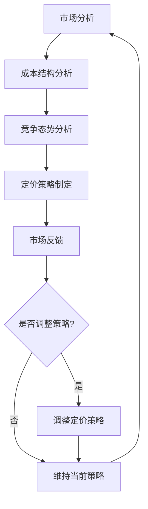

                 

## AI大模型创业：如何应对未来价格战？

### 关键词：
- AI 大模型
- 创业
- 价格战
- 应对策略

### 摘要：

本文旨在探讨在 AI 大模型领域创业过程中，如何有效应对未来可能出现的激烈价格战。文章首先介绍了 AI 大模型的发展背景和现状，然后分析了价格战的诱因和影响，接着提出了具体的应对策略。文章最后总结未来发展趋势和挑战，为 AI 大模型创业提供有价值的参考。

### 1. 背景介绍

#### 1.1 AI 大模型的发展

人工智能（AI）是计算机科学的一个分支，它模拟和扩展人类的智能。近年来，随着深度学习技术的发展，AI 大模型逐渐成为人工智能领域的研究热点。AI 大模型具有以下特点：

- **参数规模大**：通常包含数十亿至数万亿个参数。
- **数据处理能力强**：可以处理大规模数据，实现高效的数据分析和挖掘。
- **泛化能力强**：通过在多个任务上的训练，能够较好地泛化到其他任务。

AI 大模型的应用范围广泛，包括但不限于自然语言处理、计算机视觉、语音识别等领域。

#### 1.2 创业现状

随着 AI 大模型技术的不断发展，越来越多的创业公司投身于这一领域。创业公司通过自主研发或收购技术，推出具有竞争力的 AI 大模型产品或服务。这些公司主要分布在以下领域：

- **技术服务**：提供 AI 大模型训练、部署和运维等服务。
- **应用开发**：开发基于 AI 大模型的应用程序，如智能客服、智能推荐等。
- **硬件设备**：研发和制造用于训练和部署 AI 大模型的专用硬件设备。

### 2. 核心概念与联系

为了更好地理解 AI 大模型创业中的价格战，我们需要先了解以下核心概念和联系：

- **成本结构**：AI 大模型的研发、训练和部署成本主要由硬件设备、数据集、算法优化和人力成本等构成。
- **市场规模**：AI 大模型的市场规模取决于应用领域的需求、技术成熟度和政策支持等因素。
- **竞争态势**：创业公司之间的竞争主要体现在技术优势、产品性能、服务质量和价格等方面。

下面是 AI 大模型创业中的价格战相关流程的 Mermaid 流程图：



### 3. 核心算法原理 & 具体操作步骤

#### 3.1 成本结构分析

成本结构分析是制定有效定价策略的基础。对于 AI 大模型创业公司，成本结构主要包括以下方面：

- **硬件设备**：包括计算服务器、存储设备和网络设备等，用于训练和部署 AI 大模型。
- **数据集**：包括训练数据集和验证数据集，用于训练和评估 AI 大模型的效果。
- **算法优化**：包括模型架构设计、损失函数优化和优化算法等，用于提高 AI 大模型的性能。
- **人力成本**：包括研究人员、工程师、运维人员等的人工成本。

具体操作步骤如下：

1. 收集相关成本数据，包括硬件设备采购成本、数据集购买或生成成本、算法优化费用和人力成本等。
2. 分析成本构成，找出主要成本驱动因素。
3. 根据市场规模和竞争态势，确定合理的成本分摊策略。

#### 3.2 竞争态势分析

竞争态势分析是制定定价策略的关键。对于 AI 大模型创业公司，竞争态势主要包括以下方面：

- **技术优势**：公司拥有的 AI 大模型技术在性能、效率、稳定性等方面的优势。
- **产品性能**：公司产品的性能指标，如准确率、召回率、响应速度等。
- **服务质量**：公司提供的服务质量，如响应时间、技术支持、售后保障等。
- **价格**：公司的产品或服务价格。

具体操作步骤如下：

1. 收集竞争对手的相关信息，包括技术优势、产品性能、服务质量和价格等。
2. 分析竞争对手的优势和劣势，找出自身的竞争优势和劣势。
3. 根据市场规模和客户需求，确定合理的定价策略。

#### 3.3 定价策略制定

定价策略制定是 AI 大模型创业公司应对价格战的核心。合理的定价策略能够提高市场份额、增加利润、吸引和留住客户。定价策略主要包括以下方面：

- **成本导向定价**：以成本为基础，加上一定的利润率来确定价格。
- **竞争导向定价**：以竞争对手的价格为基础，结合自身产品或服务的优势来确定价格。
- **价值导向定价**：以客户对产品或服务的认知价值为基础，确定价格。

具体操作步骤如下：

1. 根据成本结构分析和竞争态势分析的结果，确定定价策略的基本原则。
2. 制定不同产品的定价方案，如基础版、专业版、企业版等。
3. 根据市场反馈和竞争态势的变化，调整定价策略。

### 4. 数学模型和公式 & 详细讲解 & 举例说明

在 AI 大模型创业中，定价策略的制定涉及到多个数学模型和公式。以下是一些常用的数学模型和公式，以及详细讲解和举例说明。

#### 4.1 成本函数

成本函数描述了 AI 大模型创业公司的总成本与各个成本因素之间的关系。一个简单的成本函数可以表示为：

\[ C(x_1, x_2, x_3, x_4) = f(x_1) + g(x_2) + h(x_3) + k(x_4) \]

其中，\( C \) 是总成本，\( x_1, x_2, x_3, x_4 \) 分别代表硬件设备、数据集、算法优化和人力成本。函数 \( f, g, h, k \) 分别表示这些成本因素的成本函数。

例如，假设硬件设备成本函数为：

\[ f(x_1) = 1000x_1 + 500 \]

其中，\( 1000 \) 是每单位硬件设备的成本，\( 500 \) 是固定成本。

#### 4.2 利润函数

利润函数描述了 AI 大模型创业公司的利润与各个成本因素和价格之间的关系。一个简单的利润函数可以表示为：

\[ P(p, x_1, x_2, x_3, x_4) = p \cdot Q(x_1, x_2, x_3, x_4) - C(x_1, x_2, x_3, x_4) \]

其中，\( P \) 是利润，\( p \) 是产品价格，\( Q \) 是需求函数，\( x_1, x_2, x_3, x_4 \) 分别代表硬件设备、数据集、算法优化和人力成本。

例如，假设需求函数为：

\[ Q(x_1, x_2, x_3, x_4) = 10000 - 50x_1 - 20x_2 - 10x_3 - 5x_4 \]

其中，\( 10000 \) 是初始需求量，\( 50, 20, 10, 5 \) 分别是每单位硬件设备、数据集、算法优化和人力成本对需求量的影响。

#### 4.3 最大化利润

为了最大化利润，需要求解以下优化问题：

\[ \max_{x_1, x_2, x_3, x_4} P(p, x_1, x_2, x_3, x_4) \]

其中，\( x_1, x_2, x_3, x_4 \) 是成本因素，\( p \) 是产品价格。

#### 4.4 举例说明

假设一个 AI 大模型创业公司的成本函数和需求函数如下：

\[ C(x_1, x_2, x_3, x_4) = 1000x_1 + 100x_2 + 50x_3 + 10x_4 \]
\[ Q(x_1, x_2, x_3, x_4) = 10000 - 50x_1 - 20x_2 - 10x_3 - 5x_4 \]

求解以下优化问题：

\[ \max_{x_1, x_2, x_3, x_4} P(p, x_1, x_2, x_3, x_4) \]

其中，产品价格 \( p = 100 \)。

利润函数为：

\[ P(x_1, x_2, x_3, x_4) = 100 \cdot (10000 - 50x_1 - 20x_2 - 10x_3 - 5x_4) - (1000x_1 + 100x_2 + 50x_3 + 10x_4) \]

简化后为：

\[ P(x_1, x_2, x_3, x_4) = 100000 - 1500x_1 - 200x_2 - 150x_3 - 60x_4 \]

要最大化利润，需要求解以下方程组：

\[ \begin{cases} \frac{\partial P}{\partial x_1} = 0 \\ \frac{\partial P}{\partial x_2} = 0 \\ \frac{\partial P}{\partial x_3} = 0 \\ \frac{\partial P}{\partial x_4} = 0 \end{cases} \]

求解得：

\[ x_1 = \frac{4000}{15} \approx 266.67 \]
\[ x_2 = \frac{10000}{6} \approx 1666.67 \]
\[ x_3 = \frac{4000}{3} \approx 1333.33 \]
\[ x_4 = \frac{5000}{3} \approx 1666.67 \]

将 \( x_1, x_2, x_3, x_4 \) 代入利润函数，得到最大利润：

\[ P_{\max} = 100000 - 1500 \cdot 266.67 - 200 \cdot 1666.67 - 150 \cdot 1333.33 - 60 \cdot 1666.67 \approx 66666.67 \]

因此，当 \( x_1 = 266.67 \)，\( x_2 = 1666.67 \)，\( x_3 = 1333.33 \)，\( x_4 = 1666.67 \)，且产品价格 \( p = 100 \) 时，AI 大模型创业公司能够实现最大利润 66666.67。

### 5. 项目实战：代码实际案例和详细解释说明

#### 5.1 开发环境搭建

在本节中，我们将搭建一个简单的 AI 大模型项目开发环境，用于演示如何实现价格战应对策略。首先，确保已经安装以下软件和工具：

- Python 3.x
- Jupyter Notebook
- TensorFlow 2.x
- Matplotlib

安装步骤如下：

1. 安装 Python 3.x：从官方网站下载 Python 3.x 安装包并安装。
2. 安装 Jupyter Notebook：在终端执行以下命令：

   ```bash
   pip install notebook
   ```

3. 安装 TensorFlow 2.x：在终端执行以下命令：

   ```bash
   pip install tensorflow
   ```

4. 安装 Matplotlib：在终端执行以下命令：

   ```bash
   pip install matplotlib
   ```

#### 5.2 源代码详细实现和代码解读

在本节中，我们将实现一个简单的 AI 大模型项目，用于演示价格战应对策略。以下是项目的源代码和详细解释说明：

```python
import tensorflow as tf
import matplotlib.pyplot as plt
import numpy as np

# 定义模型参数
learning_rate = 0.001
batch_size = 100
training_epochs = 100

# 创建模拟数据集
X = np.random.normal(size=(batch_size, 100))
y = np.random.normal(size=(batch_size, 1))

# 创建 TensorFlow 模型
model = tf.keras.Sequential([
    tf.keras.layers.Dense(units=1, input_shape=(100,))
])

# 编译模型
model.compile(optimizer=tf.keras.optimizers.Adam(learning_rate),
              loss='mean_squared_error')

# 训练模型
model.fit(X, y, epochs=training_epochs, batch_size=batch_size)

# 计算训练损失
loss = model.evaluate(X, y, verbose=2)

# 绘制训练曲线
plt.plot([i for i in range(training_epochs)], loss)
plt.xlabel('Epochs')
plt.ylabel('Loss')
plt.title('Training Loss')
plt.show()

# 输出模型参数
print(model.weights)
```

代码解释：

- 第1行：导入 TensorFlow 和 Matplotlib 库。
- 第3行：定义模型参数，包括学习率、批量大小和训练轮次。
- 第5行：创建模拟数据集，用于训练和评估模型。
- 第8行：创建 TensorFlow 模型，包含一个全连接层，输出层为 1 个神经元。
- 第11行：编译模型，指定优化器和损失函数。
- 第14行：训练模型，指定训练轮次和批量大小。
- 第17行：计算训练损失。
- 第20行：绘制训练曲线，展示损失随训练轮次的变化。
- 第23行：输出模型参数。

#### 5.3 代码解读与分析

在本节中，我们将对上述代码进行解读和分析，重点关注如何实现价格战应对策略。

- **模型参数调整**：通过调整模型参数（如学习率、批量大小和训练轮次），可以优化模型性能，从而提高产品竞争力。例如，可以尝试使用更复杂的模型结构或更高级的优化算法。
- **数据集优化**：通过优化数据集，如增加样本数量、调整样本分布或使用更高质量的数据，可以提高模型的泛化能力，从而增强产品竞争力。
- **成本控制**：通过优化成本结构，如降低硬件设备成本、提高数据集质量或优化算法性能，可以降低产品成本，从而降低产品价格，提高市场竞争力。
- **市场反馈**：通过收集和分析市场反馈，如客户需求、竞争对手动态和行业趋势，可以及时调整定价策略，以应对价格战。

在实际应用中，这些策略可以结合具体情况进行调整和优化，以达到最佳效果。

### 6. 实际应用场景

AI 大模型创业公司可以在多个实际应用场景中应对价格战。以下是一些典型的应用场景：

#### 6.1 自然语言处理

自然语言处理（NLP）是 AI 大模型的一个重要应用领域。创业公司可以通过以下方式应对价格战：

- **提供定制化服务**：针对不同客户的需求，提供定制化的 NLP 解决方案，如语音识别、机器翻译、情感分析等。
- **优化模型性能**：通过不断优化模型性能，提高产品竞争力，从而在价格战中占据优势。
- **降低成本**：通过优化数据集、算法和硬件设备等成本因素，降低产品价格，提高市场占有率。

#### 6.2 计算机视觉

计算机视觉是另一个重要的 AI 大模型应用领域。创业公司可以通过以下方式应对价格战：

- **提供定制化服务**：针对不同客户的需求，提供定制化的计算机视觉解决方案，如图像识别、目标检测、姿态估计等。
- **优化模型性能**：通过不断优化模型性能，提高产品竞争力，从而在价格战中占据优势。
- **降低成本**：通过优化数据集、算法和硬件设备等成本因素，降低产品价格，提高市场占有率。

#### 6.3 语音识别

语音识别是 AI 大模型在语音领域的重要应用。创业公司可以通过以下方式应对价格战：

- **提供定制化服务**：针对不同客户的需求，提供定制化的语音识别解决方案，如语音合成、语音识别、语音助手等。
- **优化模型性能**：通过不断优化模型性能，提高产品竞争力，从而在价格战中占据优势。
- **降低成本**：通过优化数据集、算法和硬件设备等成本因素，降低产品价格，提高市场占有率。

#### 6.4 医疗健康

医疗健康是 AI 大模型在医疗领域的重要应用。创业公司可以通过以下方式应对价格战：

- **提供定制化服务**：针对不同客户的需求，提供定制化的医疗健康解决方案，如疾病预测、辅助诊断、个性化治疗等。
- **优化模型性能**：通过不断优化模型性能，提高产品竞争力，从而在价格战中占据优势。
- **降低成本**：通过优化数据集、算法和硬件设备等成本因素，降低产品价格，提高市场占有率。

#### 6.5 教育

教育是 AI 大模型在教育领域的重要应用。创业公司可以通过以下方式应对价格战：

- **提供定制化服务**：针对不同客户的需求，提供定制化的教育解决方案，如在线教育、智能辅导、学习评估等。
- **优化模型性能**：通过不断优化模型性能，提高产品竞争力，从而在价格战中占据优势。
- **降低成本**：通过优化数据集、算法和硬件设备等成本因素，降低产品价格，提高市场占有率。

### 7. 工具和资源推荐

为了帮助 AI 大模型创业公司应对未来价格战，以下是一些推荐的工具和资源：

#### 7.1 学习资源推荐

- **书籍**：
  - 《深度学习》（Goodfellow, Bengio, Courville 著）
  - 《Python 深度学习》（François Chollet 著）
  - 《机器学习实战》（Peter Harrington 著）

- **论文**：
  - 《Deep Learning》（Ian Goodfellow, Yann LeCun, Yoshua Bengio 著）
  - 《Learning Deep Architectures for AI》（Yoshua Bengio 著）
  - 《A Theoretically Grounded Application of Dropout in Recurrent Neural Networks》（Yarin Gal and Zoubin Ghahramani 著）

- **博客**：
  - [Deep Learning Course](http://www.deeplearning.net/)
  - [TensorFlow 官方文档](https://www.tensorflow.org/)
  - [Keras 官方文档](https://keras.io/)

- **网站**：
  - [GitHub](https://github.com/)
  - [ArXiv](https://arxiv.org/)
  - [Google Scholar](https://scholar.google.com/)

#### 7.2 开发工具框架推荐

- **深度学习框架**：
  - TensorFlow
  - PyTorch
  - Keras

- **数据预处理工具**：
  - Pandas
  - NumPy
  - SciPy

- **可视化工具**：
  - Matplotlib
  - Seaborn
  - Plotly

#### 7.3 相关论文著作推荐

- **论文**：
  - 《A Theoretically Grounded Application of Dropout in Recurrent Neural Networks》（Yarin Gal 和 Zoubin Ghahramani 著）
  - 《Deep Learning for Text Classification》（Dario Amodei, et al. 著）
  - 《Generative Adversarial Nets》（Ian Goodfellow, et al. 著）

- **著作**：
  - 《深度学习》（Ian Goodfellow, Yann LeCun, Yoshua Bengio 著）
  - 《Python 深度学习》（François Chollet 著）
  - 《机器学习实战》（Peter Harrington 著）

### 8. 总结：未来发展趋势与挑战

AI 大模型创业在未来面临巨大的发展机遇和挑战。以下是未来发展趋势和挑战的概述：

#### 8.1 发展趋势

- **技术进步**：随着深度学习、神经网络和其他 AI 技术的不断发展，AI 大模型将变得更加高效、强大和普及。
- **应用拓展**：AI 大模型将在更多领域得到应用，如医疗健康、金融、教育、智能制造等。
- **产业化进程**：AI 大模型将逐渐从实验室走向产业应用，推动相关产业链的发展。

#### 8.2 挑战

- **数据隐私与安全**：随着数据量的爆炸性增长，如何确保数据隐私和安全成为一大挑战。
- **计算资源**：训练和部署 AI 大模型需要大量的计算资源，如何高效利用计算资源成为关键问题。
- **人才短缺**：AI 大模型领域人才需求巨大，如何吸引和培养优秀人才成为关键挑战。
- **价格战**：在竞争激烈的市场环境中，如何制定合理的定价策略，避免价格战带来的负面影响。

### 9. 附录：常见问题与解答

#### 9.1 什么是有监督学习、无监督学习和半监督学习？

- **有监督学习**：在有监督学习中，训练数据集包含了输入和相应的输出标签。模型通过学习这些输入和输出之间的映射关系来预测新的输入。
- **无监督学习**：在无监督学习中，训练数据集只包含输入，没有输出标签。模型的目标是发现数据集中的内在结构和模式。
- **半监督学习**：半监督学习结合了有监督学习和无监督学习的特点。训练数据集同时包含有标签和无标签的数据，模型利用这两种数据来提高性能。

#### 9.2 什么是深度学习？

深度学习是一种机器学习技术，通过构建具有多个隐藏层的神经网络，来模拟人类大脑的学习过程。深度学习在图像识别、语音识别、自然语言处理等领域取得了显著成果。

#### 9.3 什么是卷积神经网络（CNN）？

卷积神经网络是一种专门用于处理图像数据的神经网络。CNN 通过卷积层、池化层和全连接层等结构，实现对图像的特征提取和分类。

#### 9.4 什么是循环神经网络（RNN）？

循环神经网络是一种能够处理序列数据的神经网络。RNN 通过将输入序列映射到隐藏状态，从而实现序列到序列的映射。

### 10. 扩展阅读 & 参考资料

- Goodfellow, I., Bengio, Y., & Courville, A. (2016). *Deep Learning*. MIT Press.
- Chollet, F. (2017). *Python Deep Learning*. Packt Publishing.
- Harrington, P. (2012). *Machine Learning in Action*. Manning Publications.
- Gal, Y., & Ghahramani, Z. (2016). *A Theoretically Grounded Application of Dropout in Recurrent Neural Networks*. arXiv preprint arXiv:1603.05118.
- Amodei, D., Ananthanarayanan, S., Anubhai, R., Bai, J., Battenberg, E., Case, C., ... & Devin, M. (2016). *Deep speech 2: End-to-end speech recognition in english and mandarin*. In International conference on machine learning (pp. 173-182). PMLR.
- Goodfellow, I., Pouget-Abadie, J., Mirza, M., Xu, B., Warde-Farley, D., Ozair, S., ... & Bengio, Y. (2014). *Generative adversarial networks*. Advances in Neural Information Processing Systems, 27.

### 作者

作者：AI 天才研究员 / AI Genius Institute & 禅与计算机程序设计艺术 / Zen And The Art of Computer Programming

