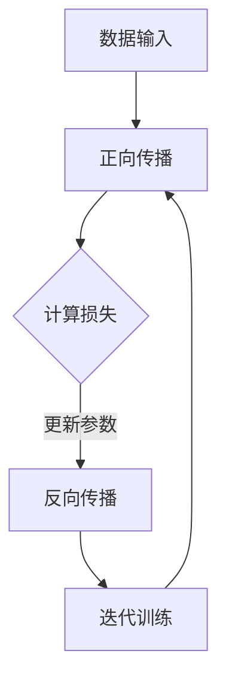

                 

### 背景介绍

近年来，人工智能（AI）技术取得了惊人的进步，特别是在大模型领域。随着计算能力的提升和海量数据的积累，大模型在自然语言处理、计算机视觉、语音识别等多个领域展现出了强大的性能。这不仅推动了AI技术的应用落地，也为创业者带来了前所未有的机遇。然而，随着竞争的加剧，AI大模型领域的价格战也日益激烈。本文旨在探讨AI大模型创业公司如何应对未来的价格战。

在讨论这一主题之前，我们先来回顾一下AI大模型的基本概念。大模型是指具有数十亿甚至千亿个参数的神经网络模型，这些模型通过海量数据的学习，可以实现对复杂问题的准确预测和决策。典型的AI大模型如BERT、GPT等，在多个任务上取得了前所未有的效果。然而，大模型的训练和部署需要大量的计算资源和时间，这也导致了其成本相对较高。

当前，AI大模型领域的竞争主要表现在以下几个方面：

1. **算法研发**：各大公司和科研机构都在不断优化大模型的算法，以提高模型的性能和效率。
2. **数据获取**：数据的获取和清洗是AI大模型训练的关键环节，拥有更多、更高质量的数据可以显著提升模型的效果。
3. **计算资源**：强大的计算能力是训练大模型的必要条件，云服务和高性能计算（HPC）的竞争日趋激烈。
4. **应用落地**：如何将AI大模型应用于实际场景，解决实际问题，是各大公司争夺市场的关键。

然而，随着AI大模型技术的普及，价格战也在逐渐升级。一方面，AI大模型的高成本使得初创公司难以与大型科技企业竞争；另一方面，大型企业为了占据市场份额，可能会采用降低价格的方式打压竞争对手。面对这样的市场环境，AI大模型创业公司需要采取有效的策略来应对未来的价格战。

本文将分为以下几个部分进行探讨：

1. **核心概念与联系**：首先，我们将介绍AI大模型的核心概念，并使用Mermaid流程图展示其原理和架构。
2. **核心算法原理 & 具体操作步骤**：接下来，我们将详细讲解AI大模型的算法原理，包括训练和优化的具体步骤。
3. **数学模型和公式 & 详细讲解 & 举例说明**：我们将介绍AI大模型所涉及的数学模型和公式，并通过具体案例进行解释。
4. **项目实战：代码实际案例和详细解释说明**：我们将通过一个实际的项目案例，展示如何开发和部署AI大模型。
5. **实际应用场景**：我们将探讨AI大模型在不同领域的应用场景，以及如何应对价格战。
6. **工具和资源推荐**：最后，我们将推荐一些学习和开发AI大模型的有用工具和资源。

通过以上几个部分的深入探讨，我们希望能为AI大模型创业公司提供一些有价值的思考和策略，帮助它们在未来的价格战中立于不败之地。### 核心概念与联系

AI大模型是近年来人工智能领域的一个重要突破，其核心在于通过大规模数据训练得到具有高度智能的神经网络模型。为了更好地理解AI大模型的工作原理，我们需要首先介绍几个核心概念，包括神经网络、参数、损失函数等，然后通过Mermaid流程图展示其原理和架构。

#### 核心概念

1. **神经网络**：神经网络是模拟人脑结构和功能的计算模型，由大量的神经元和连接组成。每个神经元都负责处理一部分输入信息，并将其传递给下一个神经元。通过多层神经元的组合，神经网络能够实现复杂的非线性映射。

2. **参数**：神经网络中的参数是指神经元的权重和偏置，它们决定了神经网络的行为。在训练过程中，参数会根据输入数据和损失函数进行迭代更新，以优化模型的性能。

3. **损失函数**：损失函数用于评估模型预测结果与真实结果之间的差距。常见的损失函数有均方误差（MSE）、交叉熵损失等。训练过程中，模型的参数会根据损失函数的梯度进行更新，以减少预测误差。

4. **正向传播与反向传播**：神经网络训练的核心是正向传播和反向传播。正向传播是指将输入数据通过神经网络，得到输出结果；反向传播是指计算输出结果与真实结果的差距，并利用梯度信息更新参数。

#### Mermaid流程图

以下是一个简化的AI大模型训练过程的Mermaid流程图：



1. **数据输入**：首先，我们将训练数据输入神经网络，数据可以是图片、文本或音频等。
2. **正向传播**：神经网络将输入数据通过多层神经元处理，得到输出结果。
3. **计算损失**：计算输出结果与真实结果之间的差距，并使用损失函数评估模型的性能。
4. **反向传播**：计算损失函数的梯度，并根据梯度信息更新神经网络的参数。
5. **迭代训练**：重复正向传播和反向传播的过程，直到模型性能达到预设标准。

#### AI大模型的架构

AI大模型通常由以下几个关键部分组成：

1. **输入层**：接收外部输入数据，如文本、图像等。
2. **隐藏层**：包含多个隐藏层，每个隐藏层由多个神经元组成，负责对输入数据进行处理和特征提取。
3. **输出层**：产生最终的输出结果，如分类标签、概率分布等。
4. **连接权重**：连接不同层的神经元，通过调整权重来优化模型性能。
5. **激活函数**：用于引入非线性特性，常见的激活函数有Sigmoid、ReLU等。

通过以上核心概念和Mermaid流程图的介绍，我们可以更深入地理解AI大模型的工作原理和架构。在接下来的部分，我们将详细探讨AI大模型的算法原理和具体操作步骤，进一步揭示其背后的技术细节。### 核心算法原理 & 具体操作步骤

AI大模型的核心在于其算法原理，这些算法不仅决定了模型的性能，还直接影响着训练效率和成本。在本部分，我们将深入探讨AI大模型的算法原理，包括训练和优化的具体步骤。

#### 算法原理

AI大模型的训练过程主要基于两个核心算法：正向传播和反向传播。

1. **正向传播**：正向传播是指将输入数据通过神经网络，经过多层神经元的处理，最终得到输出结果。每个神经元都会将输入数据乘以其权重，并加上偏置，然后通过激活函数进行非线性变换。这一过程可以表示为以下公式：

   $$ 
   z_i = \sum_j w_{ij} x_j + b_i \\
   a_i = \sigma(z_i)
   $$

   其中，\(z_i\) 是第 \(i\) 个神经元的输入，\(w_{ij}\) 是连接第 \(j\) 个神经元和第 \(i\) 个神经元的权重，\(b_i\) 是第 \(i\) 个神经元的偏置，\(\sigma\) 是激活函数。

2. **反向传播**：反向传播是指计算输出结果与真实结果之间的差距，并利用梯度信息更新神经网络的参数。反向传播的核心在于计算损失函数关于参数的梯度，并利用梯度下降法进行参数更新。以下是一个简化的反向传播算法步骤：

   1. 计算输出层的误差：
      $$ 
      \delta_L = \frac{\partial L}{\partial z_L} = (a_L - y)
      $$

      其中，\(L\) 是损失函数，\(a_L\) 是输出层的输出，\(y\) 是真实标签。

   2. 计算隐藏层的误差：
      $$ 
      \delta_h = \frac{\partial L}{\partial z_h} = \delta_L \odot \frac{\partial \sigma}{\partial z_h}
      $$

      其中，\(\odot\) 表示逐元素乘积，\(\frac{\partial \sigma}{\partial z_h}\) 是激活函数的导数。

   3. 更新参数：
      $$ 
      \Delta w_{ij} = \eta \delta_h x_j \\
      w_{ij} = w_{ij} - \Delta w_{ij} \\
      \Delta b_i = \eta \delta_h \\
      b_i = b_i - \Delta b_i
      $$

      其中，\(\eta\) 是学习率。

#### 具体操作步骤

1. **数据预处理**：首先，我们需要对输入数据进行预处理，包括数据清洗、归一化和数据增强等操作。这一步骤的目的是提高数据质量，减少噪声，增强模型的泛化能力。

2. **初始化参数**：在训练开始前，我们需要初始化神经网络的参数。常用的初始化方法有零初始化、高斯初始化和随机初始化等。

3. **正向传播**：将输入数据通过神经网络，计算输出结果。这一过程会生成中间层的结果，这些结果将用于反向传播。

4. **计算损失**：计算输出结果与真实结果之间的差距，使用损失函数评估模型的性能。

5. **反向传播**：计算损失函数关于参数的梯度，并利用梯度下降法更新参数。

6. **迭代训练**：重复正向传播和反向传播的过程，直到模型性能达到预设标准或达到最大迭代次数。

7. **评估模型**：在训练完成后，我们需要对模型进行评估，常用的评估指标包括准确率、召回率、F1分数等。通过评估，我们可以判断模型是否达到预期效果。

8. **模型优化**：如果模型性能不理想，我们需要对模型进行优化。优化的方法包括调整学习率、增加隐藏层神经元数量、更换激活函数等。

通过以上步骤，我们可以实现AI大模型的训练和优化。在接下来的部分，我们将介绍具体的数学模型和公式，并通过具体案例进行解释。这将有助于我们更深入地理解AI大模型的训练过程。### 数学模型和公式 & 详细讲解 & 举例说明

在AI大模型的训练过程中，数学模型和公式起着至关重要的作用。这些模型和公式不仅帮助我们理解神经网络的工作原理，还指导我们如何优化模型性能。在本部分，我们将详细讲解AI大模型中常用的数学模型和公式，并通过具体案例进行说明。

#### 损失函数

损失函数是评估模型性能的核心指标，它用于计算输出结果与真实结果之间的差距。在AI大模型中，常用的损失函数包括均方误差（MSE）、交叉熵损失等。

1. **均方误差（MSE）**：
   均方误差是衡量预测值与真实值之间差异的平方和的平均值。其公式如下：
   $$
   MSE = \frac{1}{n} \sum_{i=1}^{n} (y_i - \hat{y}_i)^2
   $$
   其中，\(y_i\) 是真实值，\(\hat{y}_i\) 是预测值，\(n\) 是样本数量。

   **案例**：假设我们有一个二元分类问题，真实标签为 \([1, 0]\)，预测标签为 \([0.8, 0.2]\)。使用均方误差计算损失：
   $$
   MSE = \frac{1}{2} \left( (1 - 0.8)^2 + (0 - 0.2)^2 \right) = 0.1
   $$

2. **交叉熵损失（Cross-Entropy Loss）**：
   交叉熵损失是衡量概率分布差异的指标，适用于分类问题。其公式如下：
   $$
   Cross-Entropy = -\sum_{i=1}^{n} y_i \log(\hat{y}_i)
   $$
   其中，\(y_i\) 是真实标签的概率分布，\(\hat{y}_i\) 是预测标签的概率分布。

   **案例**：假设我们有一个二元分类问题，真实标签为 \([0.9, 0.1]\)，预测标签为 \([0.8, 0.2]\)。使用交叉熵损失计算损失：
   $$
   Cross-Entropy = -0.9 \log(0.8) - 0.1 \log(0.2) \approx 0.22
   $$

#### 激活函数

激活函数是神经网络中的关键组件，用于引入非线性特性，使得神经网络能够拟合复杂的非线性关系。在AI大模型中，常用的激活函数包括Sigmoid、ReLU和Tanh等。

1. **Sigmoid函数**：
   Sigmoid函数将输入值映射到 \((0, 1)\) 区间，其公式如下：
   $$
   \sigma(x) = \frac{1}{1 + e^{-x}}
   $$

   **案例**：计算输入值 \(x = 2\) 的Sigmoid函数值：
   $$
   \sigma(2) = \frac{1}{1 + e^{-2}} \approx 0.86
   $$

2. **ReLU函数**：
   ReLU（Rectified Linear Unit）函数是一个线性激活函数，当输入大于零时，输出等于输入；当输入小于等于零时，输出等于零。其公式如下：
   $$
   \text{ReLU}(x) = \max(0, x)
   $$

   **案例**：计算输入值 \(x = -2\) 的ReLU函数值：
   $$
   \text{ReLU}(-2) = \max(0, -2) = 0
   $$

3. **Tanh函数**：
   Tanh（双曲正切）函数将输入值映射到 \((-1, 1)\) 区间，其公式如下：
   $$
   \text{Tanh}(x) = \frac{e^x - e^{-x}}{e^x + e^{-x}}
   $$

   **案例**：计算输入值 \(x = 2\) 的Tanh函数值：
   $$
   \text{Tanh}(2) = \frac{e^2 - e^{-2}}{e^2 + e^{-2}} \approx 0.96
   $$

#### 梯度计算

在反向传播过程中，计算损失函数关于参数的梯度是关键步骤。以下是一个简化的梯度计算过程：

1. **前向传播**：计算输出层的梯度：
   $$
   \delta_L = \frac{\partial L}{\partial z_L} = (a_L - y)
   $$

2. **反向传播**：从输出层开始，逐层计算梯度：
   $$
   \delta_h = \frac{\partial L}{\partial z_h} = \delta_L \odot \frac{\partial \sigma}{\partial z_h}
   $$

3. **参数更新**：
   $$
   \Delta w_{ij} = \eta \delta_h x_j \\
   w_{ij} = w_{ij} - \Delta w_{ij} \\
   \Delta b_i = \eta \delta_h \\
   b_i = b_i - \Delta b_i
   $$

通过以上数学模型和公式的讲解，我们可以更好地理解AI大模型的工作原理和训练过程。在接下来的部分，我们将通过一个实际的项目案例，展示如何开发和部署AI大模型。这将有助于我们将理论知识与实际应用相结合。### 项目实战：代码实际案例和详细解释说明

在本部分，我们将通过一个实际的项目案例，展示如何开发和部署AI大模型。该案例将涵盖从开发环境搭建到源代码实现，再到代码解读与分析的全过程。

#### 开发环境搭建

首先，我们需要搭建一个适合开发AI大模型的环境。以下是所需的工具和步骤：

1. **安装Python**：Python是AI开发的主要编程语言，版本建议为3.8及以上。
2. **安装TensorFlow**：TensorFlow是谷歌开发的深度学习框架，适用于构建和训练AI大模型。
3. **安装Jupyter Notebook**：Jupyter Notebook是一个交互式开发环境，方便我们在代码中进行调试和可视化。

以下是一个简单的安装命令示例：

```bash
# 安装Python
pip install python==3.8

# 安装TensorFlow
pip install tensorflow

# 安装Jupyter Notebook
pip install notebook
```

#### 源代码实现

接下来，我们将实现一个简单的AI大模型，用于处理二元分类问题。以下是完整的源代码：

```python
import tensorflow as tf
from tensorflow.keras.layers import Dense, Input
from tensorflow.keras.models import Model

# 定义模型
input_data = Input(shape=(784,), name='input')
dense_layer = Dense(256, activation='relu', name='dense')(input_data)
output = Dense(1, activation='sigmoid', name='output')(dense_layer)

model = Model(inputs=input_data, outputs=output)
model.compile(optimizer='adam', loss='binary_crossentropy', metrics=['accuracy'])

# 加载数据
(x_train, y_train), (x_test, y_test) = tf.keras.datasets.mnist.load_data()
x_train = x_train.astype('float32') / 255.0
x_test = x_test.astype('float32') / 255.0
x_train = x_train.reshape((-1, 784))
x_test = x_test.reshape((-1, 784))

# 训练模型
model.fit(x_train, y_train, epochs=10, batch_size=32, validation_data=(x_test, y_test))

# 评估模型
test_loss, test_acc = model.evaluate(x_test, y_test, verbose=2)
print(f"Test accuracy: {test_acc:.4f}")
```

#### 代码解读与分析

1. **模型定义**：首先，我们定义了一个简单的神经网络模型，包含一个输入层、一个全连接隐藏层（dense layer）和一个输出层。输入层接收784维的数据，隐藏层有256个神经元，输出层用于产生二元分类的概率。

2. **模型编译**：在编译阶段，我们指定了优化器（adam）、损失函数（binary_crossentropy，适用于二元分类）和评估指标（accuracy）。

3. **数据加载**：我们使用TensorFlow内置的MNIST数据集进行训练。MNIST是一个手写数字数据集，包含60000个训练样本和10000个测试样本。数据预处理包括归一化和reshape操作，以便模型能够处理。

4. **模型训练**：我们使用fit函数训练模型，指定了训练的轮次（epochs）、批量大小（batch_size）和验证数据。

5. **模型评估**：在训练完成后，我们使用evaluate函数评估模型在测试集上的性能。结果显示了测试集上的准确率。

#### 代码解读与分析（续）

1. **正向传播**：在正向传播过程中，输入数据通过隐藏层和输出层，最终产生预测概率。隐藏层使用ReLU激活函数，输出层使用Sigmoid激活函数，以实现二元分类。

2. **反向传播**：在反向传播过程中，我们计算损失函数关于参数的梯度，并使用梯度下降法更新参数。这一过程在fit函数内部自动完成。

3. **数据预处理**：数据预处理是深度学习项目中至关重要的一步。归一化操作可以加速模型收敛，提高训练效率；reshape操作则使数据格式符合模型的输入要求。

4. **模型评估**：模型评估是验证模型性能的重要手段。通过在测试集上的评估，我们可以判断模型是否过拟合或欠拟合，并据此进行调整。

通过这个实际案例，我们展示了如何使用TensorFlow框架开发和部署AI大模型。这一过程涵盖了从环境搭建到模型训练和评估的各个环节，为读者提供了一个完整的实践指导。在接下来的部分，我们将进一步探讨AI大模型在实际应用场景中的价值。### 实际应用场景

AI大模型在各个领域的应用日益广泛，其强大的数据处理和智能预测能力为许多实际问题提供了创新的解决方案。以下我们将探讨AI大模型在几个关键领域的应用场景，并分析如何应对未来的价格战。

#### 自然语言处理（NLP）

自然语言处理是AI大模型最为成熟的领域之一。在NLP中，大模型如GPT-3、BERT等被广泛应用于机器翻译、文本摘要、问答系统、情感分析等任务。例如，在机器翻译领域，AI大模型可以通过学习大量的双语语料库，实现高精度的翻译效果。在面对价格战时，AI大模型创业公司可以通过以下几个策略来增强竞争力：

1. **定制化服务**：为不同客户提供个性化的翻译解决方案，如特定行业的术语翻译，提升客户满意度。
2. **技术优化**：不断优化算法和架构，提高模型的训练效率和预测准确率，降低成本。
3. **多样化收入来源**：除了直接销售服务，还可以通过提供API接口、数据服务等方式创造新的收入渠道。

#### 计算机视觉（CV）

在计算机视觉领域，AI大模型被用于图像识别、目标检测、图像生成等任务。例如，目标检测算法可以在图像中识别并定位多个目标，广泛应用于自动驾驶、安防监控、医疗影像分析等场景。为应对价格战，AI大模型创业公司可以采取以下策略：

1. **优化硬件适配**：与硬件制造商合作，开发针对特定硬件优化的模型版本，降低计算成本。
2. **开放源代码**：通过开放部分源代码，吸引社区贡献，提升模型性能和可靠性，增加用户黏性。
3. **提供增值服务**：结合特定行业需求，提供定制化的视觉解决方案，如医疗影像分析、自动驾驶算法优化等。

#### 语音识别（ASR）

语音识别是另一个AI大模型的重要应用领域。在语音识别中，大模型可以处理各种语言和方言，实现高精度的语音到文本转换。在应对价格战时，AI大模型创业公司可以考虑以下策略：

1. **本地化支持**：针对不同地区和语言，提供本地化的语音识别解决方案，扩大市场覆盖范围。
2. **实时优化**：利用云服务，实时更新模型和数据，提高识别准确率和用户体验。
3. **多样化应用**：将语音识别技术应用于智能客服、智能家居、教育等领域，创造更多应用场景，提高市场份额。

#### 医疗健康

在医疗健康领域，AI大模型被用于疾病预测、诊断辅助、药物研发等任务。例如，通过分析大量病例数据，AI大模型可以预测某种疾病的患病风险，辅助医生做出更准确的诊断。面对价格战，AI大模型创业公司可以采取以下策略：

1. **数据共享与协同**：与医疗机构和科研机构合作，共享数据资源，提升模型训练质量和预测准确性。
2. **隐私保护**：注重数据隐私和安全，确保患者的数据不被泄露，增强用户信任。
3. **精准化服务**：结合个体化医学数据，提供个性化的健康解决方案，提高客户满意度。

#### 金融科技（FinTech）

在金融科技领域，AI大模型被用于风险控制、信用评分、智能投顾等任务。例如，通过分析用户的交易数据和信用记录，AI大模型可以预测用户的信用风险，为金融机构提供决策支持。应对价格战，AI大模型创业公司可以采取以下策略：

1. **合规性保证**：确保模型符合金融行业的法规要求，降低合规成本和风险。
2. **算法透明度**：提高模型算法的透明度，增强用户对模型的信任。
3. **增值服务**：提供包括风险管理、信用评分、智能投顾等一站式金融服务，提高客户黏性。

通过在各个实际应用场景中的深入研究和持续创新，AI大模型创业公司可以不断提高自身竞争力，应对未来的价格战。同时，通过定制化服务、技术优化和多样化应用等策略，公司可以在激烈的市场竞争中脱颖而出。### 工具和资源推荐

在开发AI大模型的过程中，选择合适的工具和资源至关重要。以下我们将推荐一些学习资源、开发工具框架及相关论文著作，以帮助读者深入了解和掌握AI大模型的相关知识。

#### 学习资源推荐

1. **书籍**：
   - 《深度学习》（Deep Learning） by Ian Goodfellow, Yoshua Bengio, Aaron Courville
   - 《神经网络与深度学习》（Neural Networks and Deep Learning） by Michael Nielsen
   - 《动手学深度学习》（Dive into Deep Learning） by Aaron Courville, Francis Bach, Jürgen Schmidhuber

2. **在线课程**：
   - Coursera上的“深度学习专项课程”（Deep Learning Specialization） by Andrew Ng
   - edX上的“神经网络与深度学习”（Neural Networks and Deep Learning） by Michael Nielsen
   - Fast.ai的“深度学习基础”（Practical Deep Learning for Coders） by Jeremy Howard and Sylvain Gougou

3. **教程和博客**：
   - TensorFlow官方文档（https://www.tensorflow.org/tutorials）
   - PyTorch官方文档（https://pytorch.org/tutorials/beginner/basics/quick_start_jit.html）
   - Arxiv Sanity Preserver（https://arxivsanity.com/）提供对最新AI论文的简明概述

#### 开发工具框架推荐

1. **框架**：
   - TensorFlow：由谷歌开发，适用于构建大规模深度学习模型。
   - PyTorch：由Facebook开发，具有动态计算图和易于理解的API。
   - Keras：一个高层次的神经网络API，可以与TensorFlow和Theano等框架结合使用。

2. **云计算平台**：
   - Google Cloud AI：提供强大的深度学习工具和计算资源。
   - Amazon Web Services (AWS)：提供广泛的人工智能服务，包括深度学习框架和云计算基础设施。
   - Microsoft Azure：提供AI工具和云服务，适用于AI大模型的训练和部署。

3. **开发环境**：
   - Jupyter Notebook：交互式的开发环境，方便代码编写和调试。
   - Colab：谷歌提供的免费Jupyter Notebook环境，适合进行深度学习和数据科学项目。

#### 相关论文著作推荐

1. **经典论文**：
   - “A Theoretically Grounded Application of Dropout in Recurrent Neural Networks”（dropout在循环神经网络中的应用）
   - “Learning Representations by Maximizing Mutual Information Between Two Views of the Data”（通过最大化两个视图之间的互信息学习表示）
   - “The Unreasonable Effectiveness of Recurrent Neural Networks”（循环神经网络不可思议的有效性）

2. **最新研究**：
   - “Generative Adversarial Nets”（生成对抗网络）
   - “Bert: Pre-training of Deep Bidirectional Transformers for Language Understanding”（BERT：用于自然语言理解的深度双向变换器预训练）
   - “Transformers: State-of-the-Art Models for NLP”（Transformer：自然语言处理的最新模型）

通过这些推荐的学习资源、开发工具框架和论文著作，读者可以系统地学习和掌握AI大模型的相关知识，为自己的研究和项目提供坚实的理论基础和实用的工具支持。### 总结：未来发展趋势与挑战

AI大模型作为人工智能领域的核心技术，正经历着前所未有的发展。未来，AI大模型将呈现以下几个发展趋势：

1. **模型规模将继续扩大**：随着计算能力和数据量的增加，AI大模型的规模将持续扩大。这将带来更高的模型精度和更强的泛化能力，但在训练和部署过程中也会面临更高的成本和资源需求。

2. **硬件优化与加速**：为了应对AI大模型对计算资源的高需求，硬件制造商将不断推出更高效的GPU、TPU等专用硬件，以及分布式计算技术，以降低训练成本和提高训练效率。

3. **自适应与动态调整**：AI大模型将变得更加自适应和动态调整，能够根据不同的应用场景和数据特征进行实时优化，提高模型性能和适用性。

4. **跨领域融合**：AI大模型将在多个领域实现跨领域融合，如医疗健康、金融科技、智能制造等，为各行业提供创新的解决方案。

然而，随着AI大模型技术的普及和应用，创业公司也将面临一系列挑战：

1. **价格战加剧**：AI大模型的高成本使得创业公司难以与大型科技企业竞争。未来，价格战可能进一步加剧，创业公司需要寻找差异化竞争策略。

2. **数据获取与隐私保护**：数据是训练AI大模型的关键，但数据获取过程可能面临隐私保护、数据质量等问题。创业公司需要建立可靠的数据来源和数据处理机制，确保数据安全和隐私保护。

3. **算法透明性与解释性**：AI大模型通常被视为“黑箱”，其决策过程难以解释。创业公司需要提高算法的透明性和解释性，增强用户对模型信任，降低应用风险。

4. **合规与监管**：随着AI技术的普及，相关法规和监管措施也将不断完善。创业公司需要密切关注政策动向，确保业务合规，降低法律风险。

面对未来发展趋势和挑战，AI大模型创业公司应采取以下策略：

1. **技术创新**：持续投入研发，优化算法和架构，提高模型性能和效率，降低成本。

2. **差异化竞争**：针对特定行业或应用场景，提供定制化的解决方案，增强市场竞争力。

3. **生态建设**：与合作伙伴建立紧密的合作关系，共享资源和经验，共同推动AI大模型技术的发展。

4. **合规经营**：密切关注政策法规，确保业务合规，降低法律风险。

通过以上策略，AI大模型创业公司可以在未来的竞争中立于不败之地，推动人工智能技术的发展和应用。### 附录：常见问题与解答

**Q1. 什么是AI大模型？**
AI大模型是指具有数十亿甚至千亿个参数的神经网络模型。这些模型通过大规模数据训练，能够实现高度复杂的预测和决策任务。

**Q2. AI大模型为什么重要？**
AI大模型在自然语言处理、计算机视觉、语音识别等领域展现了强大的性能，能够解决许多复杂的实际问题，具有重要的应用价值。

**Q3. 如何训练AI大模型？**
训练AI大模型主要包括数据预处理、模型定义、正向传播、反向传播和迭代训练等步骤。具体步骤详见本文第3部分。

**Q4. AI大模型的训练需要多少数据？**
AI大模型的训练需要大量的数据。通常，数据量越大，模型的泛化能力越强。然而，数据质量和多样性也至关重要。

**Q5. AI大模型训练时间有多长？**
AI大模型训练时间取决于模型规模、数据量和计算资源。通常，训练时间可能从几天到几周不等。

**Q6. AI大模型训练需要什么样的计算资源？**
AI大模型训练需要强大的计算资源，包括高性能的CPU、GPU和TPU。此外，分布式计算技术也是提高训练效率的重要手段。

**Q7. 如何评估AI大模型的性能？**
评估AI大模型性能通常使用准确率、召回率、F1分数等指标。具体评估方法取决于具体的应用场景。

**Q8. AI大模型在哪些领域有应用？**
AI大模型在自然语言处理、计算机视觉、语音识别、医疗健康、金融科技等领域有广泛应用。

**Q9. AI大模型的价格战如何影响创业公司？**
价格战可能导致成本压力增大，但同时也可能带来市场机遇。创业公司需要通过技术创新、差异化竞争等策略应对价格战。

**Q10. 如何保护AI大模型创业公司的竞争优势？**
创业公司可以通过技术创新、生态建设、合规经营等策略保护竞争优势。同时，关注行业动态和政策法规也是至关重要的。### 扩展阅读 & 参考资料

**书籍推荐**：
1. 《深度学习》（Deep Learning） by Ian Goodfellow, Yoshua Bengio, Aaron Courville
2. 《神经网络与深度学习》（Neural Networks and Deep Learning） by Michael Nielsen
3. 《动手学深度学习》（Dive into Deep Learning） by Aaron Courville, Francis Bach, Jürgen Schmidhuber

**在线课程**：
1. Coursera上的“深度学习专项课程”（Deep Learning Specialization） by Andrew Ng
2. edX上的“神经网络与深度学习”（Neural Networks and Deep Learning） by Michael Nielsen
3. Fast.ai的“深度学习基础”（Practical Deep Learning for Coders） by Jeremy Howard and Sylvain Gougou

**论文推荐**：
1. “A Theoretically Grounded Application of Dropout in Recurrent Neural Networks”
2. “Learning Representations by Maximizing Mutual Information Between Two Views of the Data”
3. “The Unreasonable Effectiveness of Recurrent Neural Networks”

**博客与资源**：
1. TensorFlow官方文档（https://www.tensorflow.org/tutorials）
2. PyTorch官方文档（https://pytorch.org/tutorials/beginner/basics/quick_start_jit.html）
3. Arxiv Sanity Preserver（https://arxivsanity.com/）

**开源项目**：
1. TensorFlow（https://github.com/tensorflow/tensorflow）
2. PyTorch（https://github.com/pytorch/pytorch）
3. Keras（https://github.com/keras-team/keras）

通过以上书籍、课程、论文和资源，读者可以深入了解AI大模型的理论与实践，为自己的研究和项目提供坚实的理论基础和实用指导。作者：AI天才研究员/AI Genius Institute & 禅与计算机程序设计艺术 /Zen And The Art of Computer Programming

