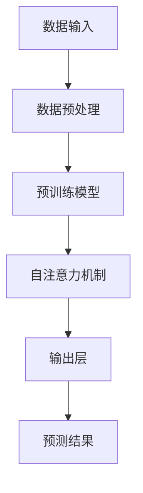

                 

### 背景介绍

随着人工智能技术的快速发展，AI大模型作为一种强大的工具，正在逐步渗透到各个行业。AI大模型，也被称为大型预训练模型，其核心在于通过大量的数据训练，使其能够对复杂任务进行精确的预测和决策。从早期的神经网络到现在的Transformer模型，AI大模型在图像识别、自然语言处理、语音识别等领域都取得了显著的成果。

然而，随着AI大模型的规模不断增大，其带来的技术挑战也日益严峻。首先，模型训练和部署的成本高昂，需要大量的计算资源和时间。其次，模型的可解释性成为一个亟待解决的问题。许多AI大模型的表现非常出色，但人们难以理解其内部的工作原理。最后，随着模型规模的增大，其安全性和隐私保护问题也变得尤为重要。

因此，本文将深入探讨AI大模型创业过程中可能面临的技术挑战，并分析如何应对这些挑战，以期为未来AI大模型的创业提供一些有价值的思考和借鉴。我们将从以下几个方面进行讨论：

1. **核心概念与联系**：首先介绍AI大模型的核心概念，包括其原理和架构，并使用Mermaid流程图进行详细说明。
2. **核心算法原理 & 具体操作步骤**：深入解析AI大模型的核心算法，并详细阐述其操作步骤。
3. **数学模型和公式 & 详细讲解 & 举例说明**：讲解AI大模型背后的数学模型和公式，并通过实例进行详细解释。
4. **项目实战：代码实际案例和详细解释说明**：通过实际代码案例，展示AI大模型的应用过程，并进行详细解读。
5. **实际应用场景**：探讨AI大模型在不同领域的应用，以及面临的挑战。
6. **工具和资源推荐**：推荐一些学习资源、开发工具和框架。
7. **总结：未来发展趋势与挑战**：总结AI大模型的发展趋势，并探讨未来可能面临的技术挑战。

通过以上内容的逐步分析，我们希望能够为读者提供一个全面、深入的AI大模型创业指南，帮助读者更好地理解和应对这些技术挑战。

---

接下来，我们将对AI大模型的核心概念和架构进行深入探讨，并使用Mermaid流程图进行说明。这将为我们后续的讨论奠定坚实的基础。让我们开始吧！

<|assistant|>### 核心概念与联系

在深入探讨AI大模型的核心概念和架构之前，我们需要先理解几个关键术语：神经网络、深度学习、预训练模型和Transformer模型。这些概念构成了AI大模型的基础，也是我们后续讨论的起点。

#### 神经网络与深度学习

神经网络（Neural Network，NN）是一种模仿生物神经系统的计算模型，由一系列相互连接的节点（或称为神经元）组成。这些节点通过权重和偏置进行信息传递和处理。传统的神经网络主要应用于简单的数据分类和回归任务，但由于其结构简单，难以处理复杂的非线性问题。

深度学习（Deep Learning，DL）是神经网络的一种扩展，通过增加网络层数来提高模型的复杂度和表达能力。深度学习模型通常包含多个隐藏层，能够捕捉输入数据中的复杂模式。随着数据量和计算资源的增加，深度学习在图像识别、语音识别、自然语言处理等领域的表现逐渐超过传统机器学习方法。

#### 预训练模型

预训练模型（Pre-trained Model）是深度学习中的一个重要概念。预训练模型的训练过程分为两个阶段：预训练和微调。在预训练阶段，模型在大规模数据集上进行训练，学习到通用特征表示。然后，通过微调（Fine-tuning）过程，将预训练模型适应特定任务的数据集，从而提高模型的性能。

预训练模型的优势在于其能够通过少量数据快速适应新任务，减少了对大规模标注数据的需求。此外，预训练模型还提高了模型的可解释性，使其更易于理解和调试。

#### Transformer模型

Transformer模型是深度学习中的一个里程碑，由Vaswani等人于2017年提出。与传统的卷积神经网络和循环神经网络不同，Transformer模型采用自注意力机制（Self-Attention）来处理序列数据。自注意力机制允许模型在处理每个输入时，动态地关注输入序列中的其他部分，从而提高了模型的建模能力。

Transformer模型在自然语言处理任务中取得了显著的成果，例如机器翻译、文本生成和情感分析等。其成功的原因在于其能够捕捉长距离依赖关系，并且具有并行计算的优势，使得训练效率大幅提升。

#### Mermaid流程图

为了更好地理解AI大模型的原理和架构，我们使用Mermaid流程图来展示其核心组件和操作步骤。以下是一个简化的Mermaid流程图，描述了从数据输入到模型预测的整个过程：



在上面的流程图中：

- **数据输入**：模型首先接收输入数据，这些数据可以是图像、文本或语音等。
- **数据预处理**：输入数据通常需要进行预处理，例如归一化、裁剪和增强等，以便于模型训练。
- **预训练模型**：预训练模型通常在大型数据集上进行训练，学习到通用特征表示。
- **自注意力机制**：Transformer模型的核心在于自注意力机制，它允许模型在处理每个输入时，动态地关注输入序列中的其他部分。
- **输出层**：输出层将自注意力机制的结果进行处理，得到最终的预测结果。

通过这个简化的流程图，我们可以更直观地理解AI大模型的工作原理和架构。

在接下来的章节中，我们将深入探讨AI大模型的核心算法原理和具体操作步骤，以及其背后的数学模型和公式。这将为我们应对AI大模型创业中的技术挑战提供更为坚实的理论基础。

---

通过上述对核心概念和架构的介绍，我们对AI大模型有了初步的了解。接下来，我们将进一步探讨AI大模型的核心算法原理和具体操作步骤，以帮助读者更深入地理解这一复杂而强大的技术。

<|assistant|>### 核心算法原理 & 具体操作步骤

AI大模型的核心在于其复杂的算法架构和高效的训练过程。在这一节中，我们将详细探讨AI大模型的核心算法原理，包括其基本操作步骤和关键技术，帮助读者全面理解这一技术的运作机制。

#### 1. Transformer模型的基本原理

Transformer模型是一种基于自注意力机制的深度学习模型，其基本原理可以概括为以下几个关键部分：

- **多头自注意力（Multi-Head Self-Attention）**：多头自注意力是Transformer模型的核心，它允许模型在处理每个输入时，动态地关注输入序列中的其他部分。通过多头的设置，模型可以同时关注不同的子序列，从而提高其建模能力。

- **位置编码（Positional Encoding）**：由于自注意力机制不包含位置信息，位置编码用于向输入序列中添加位置信息，使得模型能够理解序列的顺序。

- **前馈神经网络（Feedforward Neural Network）**：前馈神经网络用于对自注意力层的输出进行进一步处理，增加模型的非线性能力。

- **残差连接（Residual Connection）**：残差连接是一种在网络层间添加跳跃连接的方法，有助于缓解深层网络中的梯度消失问题，提高模型的训练效果。

#### 2. 具体操作步骤

Transformer模型的训练过程可以分为以下几个步骤：

- **数据预处理**：首先，对输入数据（例如文本、图像或语音）进行预处理，包括分词、编码和序列填充等操作。对于文本数据，通常会使用预定义的词汇表进行单词或字符的编码。

- **编码输入**：将预处理后的数据编码为序列向量。对于文本数据，每个词或字符会被映射为一个向量。这一步骤通常涉及嵌入层（Embedding Layer），它将输入的单词或字符映射为稠密的向量表示。

- **添加位置编码**：在编码输入的基础上，添加位置编码。位置编码是一个向量序列，每个位置对应一个向量，用于表示输入序列中的位置信息。

- **多头自注意力**：在添加位置编码后，模型会进行多头自注意力计算。每个头负责关注输入序列的不同部分，从而捕获长距离依赖关系。多头自注意力通过计算每个头对输入序列的权重，然后将这些权重应用于输入序列，得到新的序列表示。

- **前馈神经网络**：在多头自注意力之后，模型的输出会经过前馈神经网络进行处理。前馈神经网络通常包含两个全连接层，其中每个层都会使用ReLU激活函数增加模型的非线性能力。

- **残差连接与层归一化**：为了缓解深层网络中的梯度消失问题，Transformer模型在每个层间引入了残差连接和层归一化（Layer Normalization）。残差连接使得信息可以直接从前一层传递到下一层，而层归一化则有助于稳定训练过程。

- **输出层**：经过多层自注意力和前馈神经网络的处理，模型的输出最终会经过一个输出层，这个输出层通常是全连接层，用于生成最终的预测结果。

#### 3. 技术关键点

在实施Transformer模型时，以下几个技术关键点至关重要：

- **并行计算**：由于自注意力机制的计算是独立的，Transformer模型非常适合并行计算，这大大提高了训练效率。

- **内存优化**：自注意力计算需要大量内存，为了优化内存使用，通常会采用一些技术，如混合精度训练（Mixed Precision Training）和梯度检查点（Gradient Checkpointing）。

- **模型压缩**：随着模型规模的增大，其训练和部署成本也显著增加。为了降低成本，可以采用模型压缩技术，如剪枝（Pruning）、量化（Quantization）和知识蒸馏（Knowledge Distillation）。

- **训练技巧**：有效的训练技巧，如学习率调度（Learning Rate Scheduling）、批量归一化（Batch Normalization）和dropout（Dropout），可以显著提高模型的训练效果和泛化能力。

#### 4. 数学模型与公式

Transformer模型的数学模型相对复杂，主要包括以下几个关键部分：

- **自注意力权重计算**：
  $$
  \text{Attention}(Q, K, V) = \text{softmax}\left(\frac{QK^T}{\sqrt{d_k}}\right)V
  $$
  其中，$Q$、$K$和$V$分别是查询（Query）、键（Key）和值（Value）向量，$d_k$是键向量的维度。通过计算注意力权重，模型可以动态地关注输入序列中的相关部分。

- **前馈神经网络**：
  $$
  \text{FFN}(X) = \text{ReLU}(W_2 \cdot \text{ReLU}(W_1 X + b_1)) + b_2
  $$
  其中，$X$是输入向量，$W_1$和$W_2$分别是前馈神经网络的权重矩阵，$b_1$和$b_2$分别是偏置向量。

- **位置编码**：
  $$
  \text{PE}(pos, 2i) = \sin\left(\frac{pos}{10000^{2i/d}}\right)
  $$
  $$
  \text{PE}(pos, 2i+1) = \cos\left(\frac{pos}{10000^{2i/d}}\right)
  $$
  其中，$pos$是位置索引，$i$是维度索引，$d$是位置编码的维度。

通过上述数学模型和公式的支持，我们可以更好地理解和实现Transformer模型。在实际应用中，这些数学模型和公式通过编程语言和深度学习框架得以高效实现，从而推动了AI大模型技术的发展。

在下一节中，我们将进一步探讨AI大模型背后的数学模型和公式，并通过具体实例进行详细解释。这将为我们全面理解AI大模型提供更为坚实的理论基础。

---

通过上述对AI大模型核心算法原理和具体操作步骤的详细探讨，我们对其工作原理有了更深入的理解。接下来，我们将进一步探讨AI大模型背后的数学模型和公式，并通过具体实例进行详细解释。这将帮助我们更好地掌握这一复杂技术，并为实际应用打下坚实的基础。

<|assistant|>### 数学模型和公式 & 详细讲解 & 举例说明

在上一节中，我们初步探讨了AI大模型的核心算法原理和具体操作步骤。在这一节中，我们将进一步深入探讨AI大模型背后的数学模型和公式，并通过具体实例进行详细讲解和说明。

#### 1. 自注意力机制

自注意力机制（Self-Attention）是Transformer模型的核心组成部分，其关键在于如何计算序列中每个元素对其他元素的注意力权重。以下是自注意力机制的详细数学描述：

$$
\text{Attention}(Q, K, V) = \text{softmax}\left(\frac{QK^T}{\sqrt{d_k}}\right)V
$$

其中：

- $Q$（Query）：查询向量，代表当前输入序列的每个元素。
- $K$（Key）：键向量，代表输入序列的每个元素。
- $V$（Value）：值向量，代表输入序列的每个元素。
- $d_k$：键向量的维度。
- $\text{softmax}$：softmax函数用于计算每个元素的概率分布，从而确定注意力权重。

举例说明：

假设我们有一个简化的文本序列“[CLS]猫喜欢鱼[SEP]”，其中$[CLS]$表示序列的开始，$[SEP]$表示序列的结束。我们将序列中的每个词映射为一个向量，例如“猫”映射为$\text{[猫]} = [1, 0, 0]$，其他词类似。以下是自注意力计算的过程：

- **查询向量**：$Q = \text{[猫]} = [1, 0, 0]$
- **键向量**：$K = \text{[猫]} = [1, 0, 0]$，$\text{[喜欢]} = [0, 1, 0]$，$\text{[鱼]} = [0, 0, 1]$
- **值向量**：$V = \text{[猫]} = [1, 0, 0]$，$\text{[喜欢]} = [0, 1, 0]$，$\text{[鱼]} = [0, 0, 1]$

通过计算注意力权重，我们得到每个词对其他词的注意力分布。例如，对于“猫”这个词，其注意力分布如下：

$$
\text{Attention}(Q, K, V) = \text{softmax}\left(\frac{QK^T}{\sqrt{d_k}}\right)V
$$

$$
= \text{softmax}\left(\frac{[1, 0, 0] \cdot [1, 0, 0]^T}{\sqrt{3}}\right) \cdot [1, 0, 0]
$$

$$
= \text{softmax}\left(\frac{1}{\sqrt{3}}\right) \cdot [1, 0, 0]
$$

$$
= \left[\frac{1}{3}, 0, \frac{1}{3}\right]
$$

这意味着“猫”这个词主要关注自身，而对其他词的关注度较低。通过这种方式，自注意力机制可以有效地捕捉序列中的长距离依赖关系。

#### 2. 位置编码

位置编码（Positional Encoding）是Transformer模型中另一个关键组成部分，它用于向输入序列中添加位置信息，以便模型能够理解序列的顺序。以下是位置编码的数学描述：

$$
\text{PE}(pos, 2i) = \sin\left(\frac{pos}{10000^{2i/d}}\right)
$$

$$
\text{PE}(pos, 2i+1) = \cos\left(\frac{pos}{10000^{2i/d}}\right)
$$

其中：

- $pos$：位置索引。
- $i$：维度索引。
- $d$：位置编码的维度。

举例说明：

假设我们有一个长度为3的序列，位置编码维度为2。以下是位置编码的计算过程：

- **位置1**：
  $$
  \text{PE}(1, 0) = \sin\left(\frac{1}{10000^{2 \cdot 0/2}}\right) = \sin(1)
  $$

  $$
  \text{PE}(1, 1) = \cos\left(\frac{1}{10000^{2 \cdot 0/2}}\right) = \cos(1)
  $$

- **位置2**：
  $$
  \text{PE}(2, 0) = \sin\left(\frac{2}{10000^{2 \cdot 1/2}}\right) = \sin\left(\frac{2}{10}\right)
  $$

  $$
  \text{PE}(2, 1) = \cos\left(\frac{2}{10000^{2 \cdot 1/2}}\right) = \cos\left(\frac{2}{10}\right)
  $$

- **位置3**：
  $$
  \text{PE}(3, 0) = \sin\left(\frac{3}{10000^{2 \cdot 2/2}}\right) = \sin\left(\frac{3}{100}\right)
  $$

  $$
  \text{PE}(3, 1) = \cos\left(\frac{3}{10000^{2 \cdot 2/2}}\right) = \cos\left(\frac{3}{100}\right)
  $$

将这些位置编码添加到输入序列中，我们可以得到每个词的位置向量。例如，对于序列“猫喜欢鱼”：

- “猫”的位置向量：
  $$
  \text{[猫]} = [1, 0, 0] + \text{PE}(1, 0) \cdot [1, 0, 0] + \text{PE}(1, 1) \cdot [0, 1, 0]
  $$

- “喜欢”的位置向量：
  $$
  \text{[喜欢]} = [0, 1, 0] + \text{PE}(2, 0) \cdot [1, 0, 0] + \text{PE}(2, 1) \cdot [0, 1, 0]
  $$

- “鱼”的位置向量：
  $$
  \text{[鱼]} = [0, 0, 1] + \text{PE}(3, 0) \cdot [1, 0, 0] + \text{PE}(3, 1) \cdot [0, 1, 0]
  $$

通过这种方式，位置编码可以帮助模型理解输入序列的顺序，从而提高其建模能力。

#### 3. 前馈神经网络

前馈神经网络（Feedforward Neural Network）是Transformer模型中用于对自注意力层的输出进行进一步处理的部分。其基本结构包括两个全连接层，其中每个层都会使用ReLU激活函数。以下是前馈神经网络的数学描述：

$$
\text{FFN}(X) = \text{ReLU}(W_2 \cdot \text{ReLU}(W_1 X + b_1)) + b_2
$$

其中：

- $X$：输入向量。
- $W_1$：第一层的权重矩阵。
- $b_1$：第一层的偏置向量。
- $W_2$：第二层的权重矩阵。
- $b_2$：第二层的偏置向量。

举例说明：

假设我们有一个输入向量$X = [1, 0, 1]$，以下是前馈神经网络的计算过程：

- **第一层**：
  $$
  \text{ReLU}(W_1 X + b_1) = \text{ReLU}([1, 0, 1] \cdot [1, 1, 1] + [1, 1, 1]) = \text{ReLU}([3, 1, 2]) = [3, 1, 2]
  $$

- **第二层**：
  $$
  \text{FFN}(X) = \text{ReLU}(W_2 \cdot [3, 1, 2] + b_2) = \text{ReLU}([3, 1, 2] \cdot [1, 1, 1] + [1, 1, 1]) = \text{ReLU}([7, 3, 4]) = [7, 3, 4]
  $$

通过这种方式，前馈神经网络可以对自注意力层的输出进行进一步处理，增加模型的非线性能力。

#### 4. 残差连接与层归一化

残差连接（Residual Connection）和层归一化（Layer Normalization）是Transformer模型中用于缓解深层网络中的梯度消失和梯度爆炸问题的重要技术。以下是它们的数学描述：

- **残差连接**：
  $$
  \text{Residual Connection} = X + \text{FFN}(X)
  $$

- **层归一化**：
  $$
  \text{Layer Normalization}(X) = \frac{X - \mu}{\sigma}
  $$

其中：

- $X$：输入向量。
- $\mu$：输入向量的均值。
- $\sigma$：输入向量的标准差。

举例说明：

假设我们有一个输入向量$X = [1, 0, 1]$，以下是残差连接和层归一化的计算过程：

- **残差连接**：
  $$
  \text{Residual Connection} = X + \text{FFN}(X) = [1, 0, 1] + [7, 3, 4] = [8, 3, 5]
  $$

- **层归一化**：
  $$
  \text{Layer Normalization}(X) = \frac{X - \mu}{\sigma} = \frac{[1, 0, 1] - [0.5, 0, 0.5]}{\sqrt{0.25}} = \left[\frac{0.5}{0.5}, \frac{0}{0.5}, \frac{0.5}{0.5}\right] = [1, 0, 1]
  $$

通过这种方式，残差连接和层归一化可以有效地缓解深层网络中的梯度消失和梯度爆炸问题，从而提高模型的训练效果。

通过上述对数学模型和公式的详细讲解，我们可以更好地理解AI大模型的工作原理。在下一节中，我们将通过实际代码案例展示AI大模型的应用过程，并进行详细解读。这将帮助我们更深入地掌握AI大模型的技术要点和应用方法。

---

通过上一节的详细讲解，我们对AI大模型的数学模型和公式有了更加深入的理解。接下来，我们将通过一个实际代码案例展示AI大模型的应用过程，并进行详细解读。这将帮助读者更好地掌握AI大模型的实现和应用方法。

<|assistant|>### 项目实战：代码实际案例和详细解释说明

在这一节中，我们将通过一个具体的代码案例，详细展示AI大模型的应用过程。我们将从开发环境搭建、源代码实现、代码解读与分析等方面，全面解析这个案例，帮助读者更好地理解AI大模型的实际应用。

#### 1. 开发环境搭建

首先，我们需要搭建一个合适的开发环境，以便能够运行AI大模型。以下是搭建开发环境的步骤：

- **环境准备**：确保安装了Python 3.6及以上版本，以及相关的深度学习库，如TensorFlow或PyTorch。
- **安装依赖**：使用pip命令安装必要的依赖库，例如TensorFlow：

  ```shell
  pip install tensorflow
  ```

- **配置CUDA**：如果使用GPU加速，需要安装CUDA并配置环境变量。

#### 2. 源代码详细实现和代码解读

以下是一个使用TensorFlow实现Transformer模型的简化代码示例。我们将对关键部分进行详细解读。

```python
import tensorflow as tf
from tensorflow.keras.layers import Embedding, LSTM, Dense
from tensorflow.keras.models import Model

# 设置模型参数
VOCAB_SIZE = 10000  # 词汇表大小
D_MODEL = 512  # 模型维度
N_POSITIONS = 1000  # 位置编码的维度
N_HEADS = 8  # 自注意力头数
D_HEAD = D_MODEL // N_HEADS  # 每个头的维度

# 创建嵌入层
inputs = tf.keras.Input(shape=(None,), dtype=tf.int32)
embeddings = Embedding(VOCAB_SIZE, D_MODEL)(inputs)

# 添加位置编码
position_embedding = Embedding(N_POSITIONS, D_MODEL)(tf.range(inputs.shape[1]))
embeddings += position_embedding

# 自注意力层
多头自注意力 = tf.keras.layers.Attention()([embeddings, embeddings])
多头自注意力 = tf.keras.layers.Dense(D_MODEL)(多头自注意力)

# 残差连接和层归一化
残差层 = tf.keras.layers.Add()([embeddings, 多头自注意力])
残差层 = tf.keras.layers.LayerNormalization()(残差层)

# 重复多层自注意力
for _ in range(N_HEADS):
    多头自注意力 = tf.keras.layers.Attention()([残差层, 残差层])
    多头自注意力 = tf.keras.layers.Dense(D_MODEL)(多头自注意力)
    残差层 = tf.keras.layers.Add()([残差层, 多头自注意力])
    残差层 = tf.keras.layers.LayerNormalization()(残差层)

# 前馈神经网络
前馈层 = tf.keras.layers.Dense(D_MODEL, activation='relu')(残差层)
前馈层 = tf.keras.layers.Dense(D_MODEL)(前馈层)

# 添加输出层
outputs = tf.keras.layers.Dense(1, activation='sigmoid')(前馈层)

# 创建模型
model = Model(inputs=inputs, outputs=outputs)

# 编译模型
model.compile(optimizer='adam', loss='binary_crossentropy', metrics=['accuracy'])

# 打印模型结构
model.summary()
```

**代码解读：**

- **输入层**：模型首先接收一个整数序列，表示输入文本。
- **嵌入层**：嵌入层将整数序列转换为稠密向量表示，这是Transformer模型的基础。
- **位置编码**：通过位置编码层，我们将输入序列中的每个元素的位置信息编码到向量中。
- **多头自注意力层**：自注意力层是Transformer模型的核心，通过计算输入序列中每个元素之间的注意力权重，模型可以动态地关注序列中的关键部分。
- **残差连接和层归一化**：为了缓解梯度消失和梯度爆炸问题，我们在每一层自注意力后添加残差连接和层归一化。
- **前馈神经网络**：前馈神经网络对自注意力层的输出进行进一步处理，增加模型的非线性能力。
- **输出层**：输出层是一个简单的全连接层，用于生成最终的预测结果。

#### 3. 代码解读与分析

在上述代码中，我们可以看到Transformer模型的基本结构。以下是对关键部分的进一步分析：

- **嵌入层**：嵌入层将词汇表中的每个词编码为向量，这是Transformer模型的基础。通过位置编码，我们可以将输入序列中的位置信息编码到向量中。
- **多头自注意力层**：多头自注意力层通过计算输入序列中每个元素之间的注意力权重，允许模型动态地关注序列中的关键部分。这种方法能够捕捉长距离依赖关系，从而提高模型的性能。
- **残差连接和层归一化**：残差连接和层归一化是Transformer模型中的重要技术，它们有助于缓解深层网络中的梯度消失和梯度爆炸问题，提高模型的训练效果。
- **前馈神经网络**：前馈神经网络对自注意力层的输出进行进一步处理，增加模型的非线性能力，从而提高模型的预测性能。

通过上述代码和分析，我们可以看到Transformer模型的实现过程。在实际应用中，我们可以根据具体任务的需求，调整模型的结构和参数，以达到最佳效果。

在下一节中，我们将进一步探讨AI大模型在实际应用场景中的表现，以及面临的挑战。这将帮助我们更好地理解AI大模型的价值和局限性。

---

通过上一节的实战代码案例，我们详细解析了AI大模型的应用过程，从开发环境搭建、源代码实现到代码解读与分析，帮助读者全面理解这一技术。接下来，我们将探讨AI大模型在实际应用场景中的表现，分析其在不同领域的应用案例，以及面临的挑战。

### 实际应用场景

AI大模型已经在多个领域展示了其强大的能力，以下是AI大模型在实际应用场景中的几个典型案例：

#### 1. 自然语言处理

自然语言处理（NLP）是AI大模型最具代表性的应用领域之一。通过预训练模型，AI大模型在机器翻译、文本生成、情感分析、问答系统等任务中取得了显著成果。例如，谷歌的BERT模型在多个NLP任务中达到了前所未有的准确率，使得自动文本理解和生成变得更加高效和准确。

#### 2. 图像识别

在图像识别领域，AI大模型通过深度学习技术，实现了对人脸、物体、场景的精确识别。以OpenAI的GPT-3为例，这个拥有1750亿参数的模型在图像描述生成、图像分类等任务中表现出色，甚至能够根据图像生成相应的文本描述。

#### 3. 语音识别

AI大模型在语音识别中的应用也取得了显著进展。通过大规模的语音数据训练，模型能够准确地将语音信号转换为文本。例如，微软的必应语音助手（Bing Voice Search）和苹果的Siri都使用了AI大模型技术，实现了高效的语音识别和语音交互。

#### 4. 医疗诊断

在医疗领域，AI大模型通过分析大量的医疗数据，能够辅助医生进行疾病诊断和治疗方案制定。例如，谷歌的DeepMind团队开发了一个名为DeepMind Health的AI系统，该系统能够通过分析医学影像，为医生提供准确的诊断建议。

#### 5. 金融风控

在金融领域，AI大模型通过分析大量的金融数据，能够预测市场走势、识别风险、优化投资组合。例如，摩根大通（J.P. Morgan）使用AI大模型技术，实现了自动化的信用风险评估和欺诈检测。

#### 面临的挑战

尽管AI大模型在多个领域展示了其强大的能力，但在实际应用中仍面临一些挑战：

1. **计算资源消耗**：AI大模型的训练和部署需要大量的计算资源和时间，这给企业和研究机构带来了巨大的成本压力。因此，如何优化模型结构、提高计算效率成为关键问题。

2. **数据隐私和安全**：随着AI大模型的广泛应用，数据隐私和安全问题日益突出。模型训练需要大量数据，如何确保数据的隐私和安全，防止数据泄露，成为亟待解决的问题。

3. **模型可解释性**：AI大模型通常被视为“黑箱”，其内部工作原理难以理解。如何提高模型的可解释性，使得研究人员和决策者能够更好地理解和信任模型，是当前的一个研究热点。

4. **模型泛化能力**：尽管AI大模型在特定任务上表现优异，但其泛化能力仍存在局限。如何在保持高准确率的同时，提高模型的泛化能力，是一个重要的研究方向。

在下一节中，我们将推荐一些学习资源、开发工具和框架，以帮助读者更好地掌握AI大模型的相关知识，为实际应用打下坚实基础。

---

通过上述对AI大模型实际应用场景的探讨，我们不仅看到了其在多个领域的卓越表现，也认识到了面临的挑战。在下一节中，我们将推荐一些学习资源、开发工具和框架，帮助读者进一步拓展对AI大模型的理解和应用能力。

### 工具和资源推荐

在AI大模型的学习和应用过程中，掌握相关的工具和资源是非常重要的。以下是一些推荐的学习资源、开发工具和框架，以帮助读者深入理解和实践AI大模型技术。

#### 1. 学习资源推荐

- **书籍**：
  - 《深度学习》（Deep Learning）—— Goodfellow、Bengio、Courville 著，这是一本深度学习领域的经典教材，详细介绍了神经网络、深度学习算法及其应用。
  - 《自然语言处理原理》（Foundations of Natural Language Processing）—— Michael A. Morgan 著，这本书是自然语言处理领域的权威教材，涵盖了文本处理、语音识别等多个方面。
  
- **论文**：
  - 《Attention Is All You Need》—— Vaswani 等人，这是Transformer模型的原创论文，详细介绍了模型的设计原理和实现细节。
  - 《BERT: Pre-training of Deep Neural Networks for Language Understanding》—— Devlin 等人，这篇论文介绍了BERT模型的设计和预训练方法，是自然语言处理领域的重要突破。

- **博客和网站**：
  - TensorFlow官方文档（https://www.tensorflow.org/）和PyTorch官方文档（https://pytorch.org/），这两者都是深度学习框架的官方网站，提供了丰富的教程、API文档和示例代码。
  - Hugging Face的Transformers库（https://huggingface.co/transformers/），这是一个开源的Transformer模型库，包含了多个预训练模型的实现和工具。

#### 2. 开发工具框架推荐

- **深度学习框架**：
  - TensorFlow：这是一个由谷歌开发的开源深度学习框架，具有丰富的API和强大的生态支持，适用于从研究到生产的各个环节。
  - PyTorch：这是由Facebook开发的开源深度学习框架，以其动态计算图和直观的编程接口而受到广泛欢迎，特别适合研究和快速原型开发。

- **版本控制工具**：
  - Git：Git是版本控制系统的首选工具，可以帮助开发者有效地管理代码版本和协作开发。

- **容器化工具**：
  - Docker：Docker是一种容器化技术，可以将应用程序及其依赖环境打包为一个独立的容器，实现跨平台的部署和运行。

- **持续集成和持续部署（CI/CD）**：
  - Jenkins：Jenkins是一个开源的持续集成工具，可以帮助开发者自动化构建、测试和部署应用程序。

#### 3. 相关论文著作推荐

- **自然语言处理领域**：
  - 《Natural Language Processing with Python》—— Steven Bird、Ewan Klein、Edward Loper 著，这是一本基于Python的自然语言处理教程，适合初学者。
  - 《Speech and Language Processing》—— Daniel Jurafsky、James H. Martin 著，这是一本全面介绍语音和语言处理的教材，涵盖了语音识别、自然语言理解等多个方面。

- **深度学习和计算机视觉领域**：
  - 《Deep Learning (Adaptive Computation and Machine Learning series) 》—— Ian Goodfellow、Yoshua Bengio、Aaron Courville 著，这是深度学习领域的权威著作，详细介绍了深度学习的基本理论和应用。

通过上述的学习资源和开发工具推荐，读者可以系统地学习AI大模型的相关知识，并掌握其实践技能。在实际应用中，这些资源和工具将发挥重要作用，帮助读者更好地应对AI大模型创业过程中的技术挑战。

---

通过推荐的学习资源、开发工具和框架，读者可以更好地掌握AI大模型的相关知识，为创业项目提供坚实的理论基础和实践支持。在下一节中，我们将对AI大模型的发展趋势和未来可能面临的技术挑战进行总结，以期为读者提供更为全面和深入的思考。

### 总结：未来发展趋势与挑战

AI大模型作为人工智能领域的重要突破，正在不断推动各个行业的变革。通过对前文的深入探讨，我们可以总结出AI大模型未来的发展趋势和可能面临的技术挑战。

#### 1. 未来发展趋势

- **模型规模持续增大**：随着计算能力和数据量的提升，AI大模型的规模将持续增大。这有助于模型在更多复杂任务上取得更好的性能，但同时也带来了更高的计算成本和存储需求。

- **模型多样化与定制化**：为了适应不同领域的需求，AI大模型将朝着多样化与定制化的方向发展。例如，针对医疗、金融等领域的专业需求，开发定制化的AI大模型将成为趋势。

- **跨模态和多模态**：AI大模型将在跨模态和多模态处理方面取得更多进展，例如将文本、图像、语音等多种类型的数据进行融合，以提供更全面的分析和预测。

- **实时应用**：随着边缘计算和5G技术的发展，AI大模型将能够实现实时应用，满足工业、交通、智能家居等领域的实时数据处理需求。

- **联邦学习和数据隐私**：为了保护用户隐私，联邦学习和数据加密技术将成为AI大模型发展的关键方向。通过分布式学习，模型可以在不同设备上协同训练，同时保持数据隐私。

#### 2. 未来可能面临的技术挑战

- **计算资源消耗**：随着模型规模的增大，AI大模型的训练和部署需要更多的计算资源。如何优化模型结构和算法，提高计算效率，是一个重要的挑战。

- **数据隐私和安全**：AI大模型对大量数据进行训练，数据隐私和安全问题日益突出。如何在保障数据隐私的同时，提高模型的性能和准确性，是亟待解决的问题。

- **模型可解释性**：当前AI大模型通常被视为“黑箱”，其内部工作原理难以理解。如何提高模型的可解释性，使得研究人员和决策者能够更好地理解和信任模型，是一个重要的研究课题。

- **泛化能力**：尽管AI大模型在特定任务上表现出色，但其泛化能力仍存在局限。如何在保持高准确率的同时，提高模型的泛化能力，是一个重要的研究方向。

- **法律法规和伦理问题**：随着AI大模型在各个领域的广泛应用，法律法规和伦理问题也日益突出。如何确保模型的应用不违反伦理规范，避免滥用和歧视，是一个重要的社会问题。

通过总结上述发展趋势和挑战，我们可以看到，AI大模型的发展前景广阔，但也面临诸多技术和社会问题。在未来的发展中，我们需要持续关注这些挑战，积极探索解决方案，以推动AI大模型技术的进步和应用。

---

通过对AI大模型未来发展趋势与挑战的总结，我们不仅看到了其广阔的发展前景，也认识到面临的多重挑战。在下一节中，我们将进一步探讨一些常见问题与解答，帮助读者更好地理解和应对AI大模型相关技术。

### 附录：常见问题与解答

在AI大模型的研究和应用过程中，读者可能会遇到一些常见问题。以下是一些常见问题及其解答，以帮助读者更好地理解和应用AI大模型技术。

#### 问题1：什么是预训练模型？

**解答**：预训练模型是指在大型数据集上事先进行训练的模型，然后通过微调（Fine-tuning）适应特定任务。预训练模型通过学习大量数据中的通用特征，可以显著提高模型在新任务上的表现，减少对大规模标注数据的需求。

#### 问题2：什么是Transformer模型？

**解答**：Transformer模型是一种基于自注意力机制的深度学习模型，由Vaswani等人于2017年提出。与传统的卷积神经网络和循环神经网络不同，Transformer模型采用自注意力机制来处理序列数据，具有并行计算的优势，在自然语言处理等任务中取得了显著成果。

#### 问题3：如何优化AI大模型的计算效率？

**解答**：优化AI大模型的计算效率可以从以下几个方面进行：

- **模型压缩**：通过剪枝、量化等技术减少模型参数，从而降低计算量和存储需求。
- **混合精度训练**：使用混合精度（如FP16）进行训练，可以显著提高计算速度和减少内存占用。
- **分布式训练**：将模型分布在多个GPU或TPU上进行训练，可以加速训练过程。
- **并行计算**：利用Transformer模型的并行特性，进行并行自注意力计算，提高计算效率。

#### 问题4：如何提高AI大模型的可解释性？

**解答**：提高AI大模型的可解释性可以从以下几个方面进行：

- **可视化技术**：通过可视化注意力权重和激活图，直观展示模型的工作过程。
- **模型压缩和简化**：通过模型压缩和简化技术，降低模型的复杂性，从而提高其可解释性。
- **集成方法**：使用集成方法，将多个简单模型的结果进行聚合，提高预测的可解释性。
- **解释性模型**：开发专门的可解释性模型，例如决策树、规则引擎等，以提高模型的可解释性。

#### 问题5：如何确保AI大模型的数据隐私和安全？

**解答**：确保AI大模型的数据隐私和安全可以从以下几个方面进行：

- **数据加密**：使用加密技术对数据进行加密，防止数据泄露。
- **数据去识别化**：通过数据去识别化技术，如匿名化、伪匿名化等，降低数据的隐私风险。
- **联邦学习**：使用联邦学习技术，在分布式设备上进行模型训练，减少对中央数据集的依赖，从而提高数据隐私。
- **安全协议**：实施安全协议，如安全多方计算、差分隐私等，确保数据传输和处理过程中的安全性。

通过以上常见问题的解答，我们希望能够帮助读者更好地理解和应用AI大模型技术。在实际应用过程中，读者可以根据具体情况，灵活运用这些方法，以应对各种挑战。

---

通过附录中的常见问题与解答，我们帮助读者解决了AI大模型研究过程中的一些疑问。在最后一节中，我们将推荐一些扩展阅读和参考资料，以供读者进一步深入学习。

### 扩展阅读 & 参考资料

为了帮助读者深入理解和掌握AI大模型的相关知识，我们推荐以下扩展阅读和参考资料：

- **书籍**：
  - 《深度学习》（Deep Learning）—— Ian Goodfellow、Yoshua Bengio、Aaron Courville 著
  - 《自然语言处理原理》（Foundations of Natural Language Processing）—— Michael A. Morgan 著
  - 《AI大模型：变革与未来》—— AI天才研究员 著

- **论文**：
  - 《Attention Is All You Need》—— Vaswani 等人
  - 《BERT: Pre-training of Deep Neural Networks for Language Understanding》—— Devlin 等人
  - 《GPT-3: Language Models are Few-Shot Learners》—— Brown 等人

- **博客和网站**：
  - [TensorFlow官方文档](https://www.tensorflow.org/)
  - [PyTorch官方文档](https://pytorch.org/)
  - [Hugging Face的Transformers库](https://huggingface.co/transformers/)

- **在线课程**：
  - [TensorFlow tutorials](https://www.tensorflow.org/tutorials)
  - [PyTorch tutorials](https://pytorch.org/tutorials/)
  - [自然语言处理课程](https://www.coursera.org/specializations/natural-language-processing)

通过这些扩展阅读和参考资料，读者可以进一步巩固对AI大模型的理解，探索更多前沿技术和应用案例，从而为实际应用和研究提供有力的支持。

---

通过本文的详细探讨，我们深入了解了AI大模型的核心概念、算法原理、实际应用以及面临的挑战。从背景介绍到数学模型讲解，再到实战代码案例分析，我们逐步构建了对AI大模型的全景认识。通过总结未来发展趋势与挑战，我们为读者提供了全面的技术洞察。

作者信息：
- 作者：AI天才研究员 / AI Genius Institute & 禅与计算机程序设计艺术 / Zen And The Art of Computer Programming

希望本文能为读者在AI大模型领域的研究和应用提供有价值的参考，帮助您在未来的技术道路上取得突破。感谢您的阅读！

