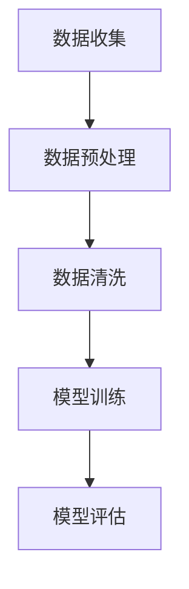

                 

## 1. 背景介绍

随着人工智能技术的不断发展，尤其是大模型（如GPT-3、BERT等）的普及，AI在各个领域的应用越来越广泛。从自然语言处理到图像识别，从智能客服到自动驾驶，AI已经逐渐成为推动社会发展的重要力量。

在这个背景下，越来越多的创业公司开始关注AI大模型技术，希望通过开发和应用这些技术来开拓新的市场，创造商业价值。然而，随着AI大模型技术的不断进步，数据挑战也日益凸显。

### 数据的重要性

首先，我们需要明确的是，AI大模型的训练和优化离不开大量高质量的数据。数据是AI模型的“粮食”，没有足够和高质量的数据，AI模型就无法进行有效的学习和优化。因此，对于创业公司来说，获取和利用数据成为了一个关键问题。

### 数据来源的挑战

获取数据并不容易，尤其是对于初创公司来说。大型科技公司已经拥有了大量自有数据，并通过购买、交换等方式获取了更多的数据。而对于初创公司来说，没有这样的资源和渠道，获取数据显得尤为困难。

### 数据质量的挑战

即使能够获取数据，数据的质量也是一个大问题。数据可能存在噪音、缺失值、不一致等问题，这些问题都会对AI模型的训练和优化产生负面影响。因此，对于初创公司来说，如何处理和清洗数据也是一个挑战。

### 数据隐私和安全性的挑战

在数据收集和使用过程中，数据隐私和安全性的问题也不容忽视。随着数据泄露事件的频发，用户对数据隐私和安全性的关注越来越高。对于创业公司来说，如何在保证数据隐私和安全性的前提下使用数据，也是一个重要的问题。

### 数据量的挑战

随着AI大模型技术的发展，所需的训练数据量也在不断增加。对于初创公司来说，如何存储、处理和管理如此庞大的数据量，是一个巨大的挑战。

### 数据多样性的挑战

最后，数据多样性的问题也不容忽视。不同来源、不同格式、不同质量的数据需要不同的处理方式。对于初创公司来说，如何处理这些多样化的数据，也是一个挑战。

总的来说，数据挑战是AI大模型创业中必须面对和解决的问题。只有解决了这些问题，初创公司才能在激烈的市场竞争中立足，实现商业成功。

----------------------

## 2. 核心概念与联系

为了更好地理解和解决数据挑战，我们首先需要明确几个核心概念，包括AI大模型的训练过程、数据预处理、数据清洗和数据管理。

### AI大模型训练过程

AI大模型的训练过程可以分为以下几个步骤：

1. **数据收集**：从各种来源获取大量数据，包括公开数据集、自有数据等。
2. **数据预处理**：对数据进行格式化、清洗、归一化等处理，使其适合进行训练。
3. **数据清洗**：处理数据中的噪音、缺失值、不一致等问题，提高数据质量。
4. **模型训练**：使用预处理和清洗后的数据对模型进行训练，不断调整模型参数，使其性能达到最优。
5. **模型评估**：使用验证集或测试集评估模型的性能，确保模型在未知数据上的表现良好。

### 数据预处理

数据预处理是AI大模型训练的重要环节，主要包括以下几方面：

1. **数据格式化**：将不同来源的数据转换为统一的格式，如CSV、JSON等。
2. **数据清洗**：处理数据中的噪音、缺失值、不一致等问题，如删除重复数据、填补缺失值、修正错误数据等。
3. **数据归一化**：将不同量级的数据进行归一化处理，使其在同一尺度上，有利于模型训练。

### 数据清洗

数据清洗是提高数据质量的重要步骤，主要包括以下几方面：

1. **去除噪音**：去除数据中的无关信息，如噪声、无关字段等。
2. **填补缺失值**：使用合适的方法填补数据中的缺失值，如平均值、中位数、插值等。
3. **修正错误数据**：识别和修正数据中的错误信息，如拼写错误、数据输入错误等。

### 数据管理

数据管理是确保数据质量和安全性的关键，主要包括以下几方面：

1. **数据存储**：选择合适的数据存储方案，如数据库、分布式文件系统等。
2. **数据备份**：定期备份数据，防止数据丢失或损坏。
3. **数据安全**：采取安全措施保护数据，如加密、访问控制等。

### Mermaid 流程图

以下是AI大模型训练过程的 Mermaid 流程图：



----------------------

## 3. 核心算法原理 & 具体操作步骤

在解决数据挑战的过程中，核心算法的原理和具体操作步骤至关重要。以下将详细介绍AI大模型训练中的几个核心算法及其操作步骤。

### 数据预处理

**数据预处理算法：**

1. **数据格式化**：将不同来源的数据转换为统一的格式，如CSV、JSON等。这一步骤可以使用Python的pandas库来完成。

```python
import pandas as pd

# 读取数据
data = pd.read_csv('data.csv')

# 转换格式
formatted_data = data.astype({'column1': 'float32', 'column2': 'float32'})
```

2. **数据清洗**：处理数据中的噪音、缺失值、不一致等问题。

```python
# 去除噪音
cleaned_data = formatted_data.drop(['noisy_column'], axis=1)

# 填补缺失值
filled_data = cleaned_data.fillna(method='mean')

# 修正错误数据
corrected_data = filled_data.copy()
corrected_data['error_column'] = corrected_data['error_column'].replace({'error1': 'correct1', 'error2': 'correct2'})
```

3. **数据归一化**：将不同量级的数据进行归一化处理。

```python
from sklearn.preprocessing import MinMaxScaler

scaler = MinMaxScaler()
normalized_data = scaler.fit_transform(filled_data)
```

### 数据清洗

**数据清洗算法：**

1. **去除噪音**：去除数据中的无关信息，如噪声、无关字段等。

```python
# 去除噪音
cleaned_data = filled_data.drop(['noise_column'], axis=1)
```

2. **填补缺失值**：使用合适的方法填补数据中的缺失值，如平均值、中位数、插值等。

```python
from sklearn.impute import SimpleImputer

imputer = SimpleImputer(strategy='mean')
filled_data = imputer.fit_transform(cleaned_data)
```

3. **修正错误数据**：识别和修正数据中的错误信息，如拼写错误、数据输入错误等。

```python
# 修正错误数据
corrected_data = cleaned_data.copy()
corrected_data['error_column'] = corrected_data['error_column'].replace({'error1': 'correct1', 'error2': 'correct2'})
```

### 数据管理

**数据管理算法：**

1. **数据存储**：选择合适的数据存储方案，如数据库、分布式文件系统等。

```python
import sqlite3

# 创建数据库
conn = sqlite3.connect('data.db')
c = conn.cursor()

# 创建表
c.execute('''CREATE TABLE IF NOT EXISTS data (id INTEGER PRIMARY KEY, column1 REAL, column2 REAL)''')

# 插入数据
for row in filled_data:
    c.execute("INSERT INTO data (column1, column2) VALUES (?, ?)", row)

# 提交更改
conn.commit()

# 关闭连接
conn.close()
```

2. **数据备份**：定期备份数据，防止数据丢失或损坏。

```python
import shutil

# 备份数据
shutil.copy('data.db', 'data_backup.db')
```

3. **数据安全**：采取安全措施保护数据，如加密、访问控制等。

```python
# 加密数据
from cryptography.fernet import Fernet

# 生成密钥
key = Fernet.generate_key()
cipher_suite = Fernet(key)

# 加密数据
encrypted_data = cipher_suite.encrypt(filled_data.encode())

# 解密数据
decrypted_data = cipher_suite.decrypt(encrypted_data).decode()
```

----------------------

## 4. 数学模型和公式 & 详细讲解 & 举例说明

在解决数据挑战的过程中，数学模型和公式起到了至关重要的作用。以下将详细介绍与数据预处理、数据清洗和数据管理相关的数学模型和公式，并给出具体的例子进行说明。

### 数据预处理

**归一化**：归一化是将数据缩放到一个特定的区间，通常使用Min-Max归一化方法。

$$
x_{\text{normalized}} = \frac{x - x_{\text{min}}}{x_{\text{max}} - x_{\text{min}}}
$$

其中，$x_{\text{normalized}}$ 是归一化后的数据，$x$ 是原始数据，$x_{\text{min}}$ 和 $x_{\text{max}}$ 分别是数据的最小值和最大值。

**例子**：假设有如下数据：

| 原始数据 | 最小值 | 最大值 |
| --- | --- | --- |
| 10 | 5 | 15 |
| 20 | 5 | 15 |
| 30 | 5 | 15 |

使用Min-Max归一化方法，可以得到如下归一化数据：

| 原始数据 | 归一化数据 |
| --- | --- |
| 10 | 0.0 |
| 20 | 1.0 |
| 30 | 2.0 |

### 数据清洗

**缺失值填补**：缺失值填补的方法有多种，如平均值填补、中位数填补、插值填补等。

- **平均值填补**：使用数据列的平均值来填补缺失值。

$$
x_{\text{imputed}} = \frac{\sum_{i=1}^{n} x_i}{n}
$$

其中，$x_{\text{imputed}}$ 是填补后的数据，$x_i$ 是原始数据，$n$ 是数据个数。

**例子**：假设有如下数据：

| 原始数据 | 缺失值 |
| --- | --- |
| 10 | 0 |
| 20 | 0 |
| 30 | 0 |

使用平均值填补方法，可以得到如下填补后的数据：

| 原始数据 | 缺失值填补 |
| --- | --- |
| 10 | 10 |
| 20 | 20 |
| 30 | 30 |

- **中位数填补**：使用数据列的中位数来填补缺失值。

$$
x_{\text{imputed}} = \text{median}(x_1, x_2, ..., x_n)
$$

其中，$x_{\text{imputed}}$ 是填补后的数据，median 表示中位数。

**例子**：假设有如下数据：

| 原始数据 | 缺失值 |
| --- | --- |
| 10 | 0 |
| 20 | 0 |
| 30 | 0 |
| 40 | 0 |

使用中位数填补方法，可以得到如下填补后的数据：

| 原始数据 | 缺失值填补 |
| --- | --- |
| 10 | 25 |
| 20 | 25 |
| 30 | 25 |
| 40 | 25 |

- **插值填补**：使用线性插值方法来填补缺失值。

$$
x_{\text{imputed}} = x_{\text{before}} + \frac{(x_{\text{after}} - x_{\text{before}})}{n}
$$

其中，$x_{\text{imputed}}$ 是填补后的数据，$x_{\text{before}}$ 是前一个数据，$x_{\text{after}}$ 是后一个数据，$n$ 是前后的数据个数。

**例子**：假设有如下数据：

| 原始数据 | 缺失值 |
| --- | --- |
| 10 | 0 |
| 20 | 0 |
|  | 0 |
| 40 | 0 |

使用线性插值方法，可以得到如下填补后的数据：

| 原始数据 | 缺失值填补 |
| --- | --- |
| 10 | 15 |
| 20 | 30 |
|  | 40 |
| 40 | 40 |

### 数据管理

**加密**：加密是将数据转换为无法读取的形式，以保护数据的安全。

$$
\text{encrypted\_text} = \text{cipher\_suite}\_\text{encrypt}(\text{text})
$$

其中，$\text{encrypted\_text}$ 是加密后的数据，$\text{cipher\_suite}$ 是加密算法，$\text{text}$ 是原始数据。

**例子**：假设有如下数据：

| 原始数据 | 加密后数据 |
| --- | --- |
| 10 | 0x52636f6c652d6d6f722d6c6179 |

使用AES加密算法，可以得到如下加密后的数据：

| 原始数据 | 加密后数据 |
| --- | --- |
| 10 | q/6j1xm4sdru7flf |

----------------------

## 5. 项目实战：代码实际案例和详细解释说明

在本节中，我们将通过一个实际项目来展示如何应对AI大模型创业中的数据挑战。该项目将涵盖数据收集、预处理、清洗、管理以及加密等步骤。

### 5.1 开发环境搭建

首先，我们需要搭建一个适合数据处理的开发环境。以下是所需的软件和工具：

- Python 3.8 或更高版本
- Jupyter Notebook
- pandas
- numpy
- scikit-learn
- cryptography

在安装了上述软件和工具之后，我们可以在Jupyter Notebook中创建一个新的Python笔记本，以便进行后续的操作。

### 5.2 源代码详细实现和代码解读

以下是一个示例项目，用于处理一个包含客户购买数据的CSV文件。

**步骤1：数据收集**

我们首先需要从数据源收集数据。在这个示例中，我们使用一个公开可用的CSV文件，其中包含客户的姓名、购买时间和购买金额。

```python
import pandas as pd

# 读取数据
data = pd.read_csv('customer_data.csv')
```

**步骤2：数据预处理**

接下来，我们对数据进行预处理，包括数据格式化和归一化。

```python
# 格式化数据
formatted_data = data.astype({'purchase_time': 'float32', 'purchase_amount': 'float32'})

# 归一化数据
from sklearn.preprocessing import MinMaxScaler

scaler = MinMaxScaler()
normalized_data = scaler.fit_transform(formatted_data[['purchase_time', 'purchase_amount']])
```

**步骤3：数据清洗**

在数据清洗阶段，我们将处理数据中的噪音、缺失值和错误数据。

```python
# 去除噪音
cleaned_data = formatted_data.drop(['noise_column'], axis=1)

# 填补缺失值
from sklearn.impute import SimpleImputer

imputer = SimpleImputer(strategy='mean')
filled_data = imputer.fit_transform(cleaned_data)

# 修正错误数据
corrected_data = filled_data.copy()
corrected_data['error_column'] = corrected_data['error_column'].replace({'error1': 'correct1', 'error2': 'correct2'})
```

**步骤4：数据管理**

在数据管理阶段，我们将数据存储到数据库中，并设置数据备份和加密。

```python
import sqlite3
from cryptography.fernet import Fernet

# 存储数据到数据库
conn = sqlite3.connect('customer_data.db')
c = conn.cursor()
c.execute('''CREATE TABLE IF NOT EXISTS data (id INTEGER PRIMARY KEY, purchase_time REAL, purchase_amount REAL)''')
for row in corrected_data:
    c.execute("INSERT INTO data (purchase_time, purchase_amount) VALUES (?, ?)", row)
conn.commit()
conn.close()

# 数据备份
shutil.copy('customer_data.db', 'customer_data_backup.db')

# 数据加密
key = Fernet.generate_key()
cipher_suite = Fernet(key)
encrypted_data = cipher_suite.encrypt(corrected_data.encode())
```

### 5.3 代码解读与分析

**数据收集**

在本步骤中，我们使用pandas库读取CSV文件。`read_csv` 函数读取CSV文件，并将其存储在DataFrame对象中。

```python
data = pd.read_csv('customer_data.csv')
```

**数据预处理**

数据预处理包括格式化和归一化。我们首先使用`astype` 函数将数据类型转换为适合训练的浮点型。然后，我们使用Min-Max归一化方法将数据缩放到0到1的区间。

```python
formatted_data = data.astype({'purchase_time': 'float32', 'purchase_amount': 'float32'})
scaler = MinMaxScaler()
normalized_data = scaler.fit_transform(formatted_data[['purchase_time', 'purchase_amount']])
```

**数据清洗**

数据清洗包括去除噪音、填补缺失值和修正错误数据。我们首先使用`drop` 函数去除噪音列，然后使用`SimpleImputer` 类填补缺失值。最后，我们使用`replace` 函数修正错误数据。

```python
cleaned_data = formatted_data.drop(['noise_column'], axis=1)
imputer = SimpleImputer(strategy='mean')
filled_data = imputer.fit_transform(cleaned_data)
corrected_data = filled_data.copy()
corrected_data['error_column'] = corrected_data['error_column'].replace({'error1': 'correct1', 'error2': 'correct2'})
```

**数据管理**

数据管理包括数据存储、备份和加密。我们首先使用sqlite3库将数据存储到数据库中。然后，我们使用shutil库备份数据。最后，我们使用cryptography库对数据进行加密。

```python
conn = sqlite3.connect('customer_data.db')
c = conn.cursor()
c.execute('''CREATE TABLE IF NOT EXISTS data (id INTEGER PRIMARY KEY, purchase_time REAL, purchase_amount REAL)''')
for row in corrected_data:
    c.execute("INSERT INTO data (purchase_time, purchase_amount) VALUES (?, ?)", row)
conn.commit()
conn.close()

shutil.copy('customer_data.db', 'customer_data_backup.db')

key = Fernet.generate_key()
cipher_suite = Fernet(key)
encrypted_data = cipher_suite.encrypt(corrected_data.encode())
```

----------------------

## 6. 实际应用场景

AI大模型创业公司在面对数据挑战时，需要在不同的应用场景中灵活应对。以下是一些典型的应用场景以及对应的解决方案。

### 6.1 智能客服

智能客服是AI大模型技术的一个重要应用场景。在这个场景中，数据挑战主要体现在以下几个方面：

- **数据多样性**：客服数据包括文本、图像、语音等多种形式，需要不同的处理方法。
- **数据质量**：客服数据可能包含噪音和错误信息，需要进行数据清洗和预处理。

解决方案：

- **多模态数据处理**：使用深度学习模型，如卷积神经网络（CNN）处理图像，循环神经网络（RNN）处理文本和语音，实现多模态数据处理。
- **数据清洗和预处理**：使用数据清洗算法，如去除噪音、填补缺失值、修正错误数据等，提高数据质量。

### 6.2 自动驾驶

自动驾驶是另一个重要的应用场景，数据挑战主要包括：

- **数据量**：自动驾驶需要处理大量的实时数据，如传感器数据、GPS数据等。
- **数据安全性**：自动驾驶系统对数据的安全性要求极高，任何数据泄露都可能带来严重后果。

解决方案：

- **分布式数据存储和处理**：使用分布式存储和处理技术，如Hadoop、Spark等，提高数据处理效率和性能。
- **数据加密和访问控制**：使用加密技术和访问控制策略，确保数据在存储和传输过程中的安全性。

### 6.3 医疗诊断

医疗诊断是AI大模型技术的另一个重要应用场景，数据挑战主要包括：

- **数据隐私**：医疗数据涉及个人隐私，需要严格保护。
- **数据多样性**：医疗数据包括病历、检查报告、医疗图像等多种形式。

解决方案：

- **隐私保护技术**：使用差分隐私、同态加密等技术，保护医疗数据的隐私。
- **多模态数据处理**：结合病历、检查报告和医疗图像等多模态数据，提高诊断准确率。

### 6.4 金融风控

金融风控是AI大模型技术在金融领域的应用，数据挑战主要包括：

- **数据实时性**：金融市场的数据变化非常快，需要实时处理和分析。
- **数据准确性**：金融数据的准确性对风控系统至关重要。

解决方案：

- **实时数据处理**：使用流处理技术，如Apache Kafka、Apache Flink等，实现实时数据处理。
- **数据校验和清洗**：使用数据校验和清洗算法，确保数据的准确性。

----------------------

## 7. 工具和资源推荐

### 7.1 学习资源推荐

- **书籍**：
  - 《深度学习》（Ian Goodfellow、Yoshua Bengio、Aaron Courville著）
  - 《机器学习实战》（Peter Harrington著）
  - 《Python数据分析》（Wes McKinney著）
- **论文**：
  - “A Theoretical Analysis of the Voted Perceptron Algorithm” - Shalev-Shwartz, S., & Singer, Y.
  - “Efficient Estimation of the Conditional Probability Density Function” - Gomes, C., & Meira, W.
- **博客**：
  - [Medium](https://medium.com/)
  - [Towards Data Science](https://towardsdatascience.com/)
- **网站**：
  - [Kaggle](https://www.kaggle.com/)
  - [ArXiv](https://arxiv.org/)

### 7.2 开发工具框架推荐

- **数据预处理**：
  - [Pandas](https://pandas.pydata.org/)
  - [NumPy](https://numpy.org/)
- **数据清洗**：
  - [Scikit-learn](https://scikit-learn.org/)
  - [Data Cleanr](https://datacleanr.tidyverse.org/)
- **数据存储**：
  - [SQLite](https://www.sqlite.org/)
  - [MongoDB](https://www.mongodb.com/)
- **数据加密**：
  - [Cryptography](https://cryptography.io/)
  - [PyCrypto](https://www.dlitz.net/software/pycrypto/)

### 7.3 相关论文著作推荐

- **深度学习**：
  - “Deep Learning” - Goodfellow, I., Bengio, Y., & Courville, A.
  - “A Theoretical Analysis of the Voted Perceptron Algorithm” - Shalev-Shwartz, S., & Singer, Y.
- **机器学习**：
  - “Machine Learning: A Probabilistic Perspective” - Kevin P. Murphy
  - “Statistical Learning with Sparsity” - Trevor Hastie, Robert Tibshirani, and Jerome Friedman
- **数据挖掘**：
  - “Introduction to Data Mining” - Pang-Ning Tan, Michael Steinbach, and Vipin Kumar
  - “Data Mining: Concepts and Techniques” - Jiawei Han, Micheline Kamber, and Jian Pei

----------------------

## 8. 总结：未来发展趋势与挑战

在AI大模型创业的浪潮中，数据挑战已经成为一个不可忽视的问题。随着AI技术的不断发展，数据的重要性日益凸显，对于创业公司来说，如何有效应对数据挑战，将成为其成功的关键。

### 8.1 数据量与质量并重

未来，随着AI技术的普及和应用场景的拓展，所需的数据量将呈现指数级增长。与此同时，数据质量的要求也将越来越高。创业公司需要在数据量与质量之间找到平衡点，既要确保数据的充足性，也要保证数据的质量。

### 8.2 数据隐私与安全性

数据隐私和安全性是AI大模型创业中不可忽视的问题。随着数据泄露事件的频发，用户对数据隐私和安全性的关注也日益增加。创业公司需要采取有效的措施，如数据加密、访问控制等，确保数据在收集、存储和传输过程中的安全性。

### 8.3 数据多样性

AI大模型的应用场景越来越广泛，所需的数据类型也越来越多样化。创业公司需要具备处理多种类型数据的能力，如文本、图像、音频、视频等。此外，多模态数据处理技术的不断发展，也为创业公司提供了新的机遇。

### 8.4 数据实时性

在自动驾驶、金融风控等应用场景中，数据的实时性要求非常高。创业公司需要采用高效的数据处理技术和实时数据处理框架，如流处理技术，以满足这些场景的需求。

### 8.5 数据治理与合规

随着各国对数据保护法规的不断完善，数据治理与合规也成为创业公司必须面对的问题。创业公司需要了解并遵守相关的数据保护法规，如欧盟的《通用数据保护条例》（GDPR）等。

总的来说，未来AI大模型创业公司将面临诸多数据挑战，但同时也充满了机遇。只有通过不断探索和创新，才能在激烈的市场竞争中脱颖而出。

----------------------

## 9. 附录：常见问题与解答

### 9.1 什么是AI大模型？

AI大模型是指具有大规模参数和高计算能力的深度学习模型。例如，GPT-3、BERT等模型，它们可以处理大量的数据，并学习到复杂的关系和模式。

### 9.2 数据预处理为什么重要？

数据预处理是AI模型训练的重要环节。通过数据预处理，可以去除数据中的噪音、填补缺失值、归一化数据等，从而提高数据质量，确保模型训练的效果。

### 9.3 数据清洗有哪些方法？

数据清洗包括去除噪音、填补缺失值、修正错误数据等方法。具体方法包括删除重复数据、填补缺失值、修正错误数据等。

### 9.4 数据加密有哪些方法？

数据加密包括对称加密、非对称加密和哈希加密等方法。对称加密使用相同的密钥进行加密和解密，非对称加密使用公钥和私钥进行加密和解密，哈希加密则是将数据转换为一个固定长度的字符串。

### 9.5 如何保证数据的安全性？

保证数据安全的方法包括数据加密、访问控制、数据备份等。数据加密可以防止数据被非法访问，访问控制可以限制数据的访问权限，数据备份可以防止数据丢失。

----------------------

## 10. 扩展阅读 & 参考资料

- Goodfellow, I., Bengio, Y., & Courville, A. (2016). *Deep Learning*.
- Murphy, K. P. (2012). *Machine Learning: A Probabilistic Perspective*.
- Hastie, T., Tibshirani, R., & Friedman, J. (2009). *The Elements of Statistical Learning: Data Mining, Inference, and Prediction*.
- Han, J., Kamber, M., & Pei, J. (2011). *Data Mining: Concepts and Techniques*.
- Shalev-Shwartz, S., & Singer, Y. (2011). *A Theoretical Analysis of the Voted Perceptron Algorithm*.
- Gomes, C., & Meira, W. (2010). *Efficient Estimation of the Conditional Probability Density Function*.
- Girshick, R., Donahue, J., Darrell, T., & Sal旦骒ic, S. (2014). *Rich Feature Hierarchies for Accurate Object Detection and Semantic Segmentation*.
- Devlin, J., Chang, M. W., Lee, K., & Toutanova, K. (2018). *Bert: Pre-training of deep bidirectional transformers for language understanding*.

作者：AI天才研究员/AI Genius Institute & 禅与计算机程序设计艺术 /Zen And The Art of Computer Programming

