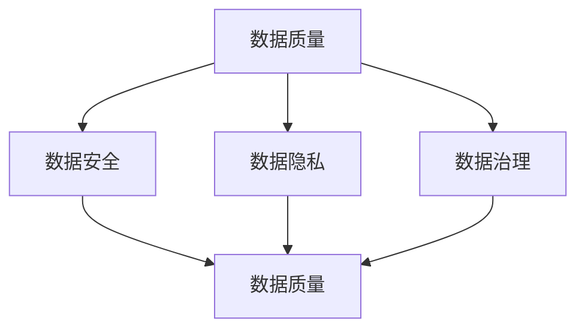

                 

### 文章标题：AI大模型创业：如何应对未来数据挑战？

关键词：AI大模型、创业、数据挑战、数据处理、数据安全、数据隐私、数据治理、技术策略、行业趋势

摘要：随着AI技术的飞速发展，大模型的应用在各个领域逐渐崭露头角。然而，AI大模型的创业之路并非一帆风顺，数据挑战成为众多创业者必须面对的重要课题。本文将深入探讨AI大模型创业过程中可能遇到的数据挑战，并提出相应的解决策略和未来发展趋势。

<|assistant|>### 1. 背景介绍

AI大模型，即人工智能大规模模型，通常具有数十亿到数万亿个参数，能够处理海量数据，并在各种任务中展现出卓越的性能。这些模型在语音识别、图像识别、自然语言处理等领域取得了突破性进展，为各行各业带来了巨大的变革。

近年来，随着云计算、大数据和深度学习的快速发展，AI大模型的应用场景不断扩大。从智能客服、自动驾驶到医疗诊断、金融风控，AI大模型正在改变我们的生活方式。然而，随着模型的规模和复杂性不断增加，数据挑战也成为AI大模型创业过程中必须面对的重要问题。

本文旨在探讨AI大模型创业中的数据挑战，包括数据质量、数据安全、数据隐私、数据治理等方面。通过分析这些挑战，我们将提出相应的解决策略，帮助创业者更好地应对未来数据挑战，推动AI大模型在各个行业的落地应用。

<|assistant|>### 2. 核心概念与联系

为了更好地理解AI大模型创业中的数据挑战，我们需要了解一些核心概念和它们之间的联系。以下是相关的概念及其关系：

#### 数据质量

数据质量是指数据的一致性、准确性、完整性和可靠性。高质量的数据对于AI大模型训练和推理至关重要。数据质量直接影响到模型的性能和可靠性。因此，数据质量是AI大模型创业过程中必须重视的关键问题。

#### 数据安全

数据安全涉及防止数据泄露、篡改和未经授权的访问。随着AI大模型涉及的数据量不断增加，数据安全成为重要的挑战。确保数据安全不仅有助于保护企业的商业利益，还能增强用户对AI服务的信任。

#### 数据隐私

数据隐私是指保护用户隐私数据不被滥用或泄露。随着AI大模型在医疗、金融等领域的应用，涉及到的隐私数据越来越多。如何确保数据隐私，避免隐私泄露，是AI大模型创业过程中需要考虑的重要问题。

#### 数据治理

数据治理是指对数据进行管理、组织和优化的过程，以确保数据质量、数据安全和数据隐私。良好的数据治理有助于提高数据利用率，降低数据风险，提升企业的竞争力。

#### 数据质量和数据安全、数据隐私、数据治理之间的关系

数据质量和数据安全、数据隐私、数据治理之间存在密切的关系。高质量的数据是数据安全、数据隐私、数据治理的基础。同时，数据安全、数据隐私、数据治理又是保障数据质量的手段。以下是一个简化的Mermaid流程图，展示这些概念之间的关系：



通过这个流程图，我们可以看到数据质量和数据安全、数据隐私、数据治理之间的相互影响和依赖关系。在AI大模型创业过程中，创业者需要综合考虑这些方面，以实现数据的高质量、安全、隐私和治理。

<|assistant|>### 3. 核心算法原理 & 具体操作步骤

在理解了核心概念之后，我们需要深入探讨AI大模型的核心算法原理和具体操作步骤。以下将简要介绍AI大模型的训练过程，包括数据预处理、模型选择、训练策略和评估方法。

#### 数据预处理

数据预处理是AI大模型训练的基础步骤，主要包括数据清洗、数据归一化和数据增强。数据清洗旨在去除无效或错误的数据，保证数据的一致性和完整性。数据归一化则是将不同特征的数据缩放到相同的范围，以消除特征尺度对模型训练的影响。数据增强通过增加数据的多样性，提高模型的泛化能力。

具体操作步骤如下：

1. **数据清洗**：去除缺失值、重复值和异常值，对文本数据中的噪声进行过滤。
2. **数据归一化**：将不同特征的数据缩放到相同的范围，如使用最小-最大缩放或均值-方差缩放。
3. **数据增强**：通过旋转、缩放、裁剪等操作，生成更多的训练样本。

#### 模型选择

模型选择是AI大模型训练的关键步骤。在选择模型时，需要考虑任务类型、数据规模、计算资源等因素。常见的模型选择方法包括：

1. **基于任务类型的模型选择**：对于不同的任务，选择适合的模型架构，如卷积神经网络（CNN）适用于图像处理，循环神经网络（RNN）适用于序列数据。
2. **基于数据规模的模型选择**：对于大规模数据，选择参数较少的模型以减少计算成本，如轻量化模型。
3. **基于计算资源的模型选择**：在计算资源有限的情况下，选择适合的模型架构以优化计算资源。

#### 训练策略

训练策略决定了模型的训练过程，包括优化器选择、学习率调整、正则化方法等。以下是一些常见的训练策略：

1. **优化器选择**：选择合适的优化器，如Adam、RMSprop等，以加速收敛速度。
2. **学习率调整**：根据训练过程动态调整学习率，以避免过拟合。
3. **正则化方法**：使用正则化方法，如Dropout、L2正则化等，减少过拟合。

#### 评估方法

模型评估是验证模型性能的重要步骤。以下是一些常见的评估方法：

1. **准确率（Accuracy）**：衡量模型预测正确的样本占比。
2. **召回率（Recall）**：衡量模型能够召回实际正例样本的能力。
3. **精确率（Precision）**：衡量模型预测为正例的样本中实际为正例的占比。
4. **F1分数（F1 Score）**：综合考虑准确率和召回率，平衡两者之间的权衡。

具体操作步骤如下：

1. **划分数据集**：将数据集划分为训练集、验证集和测试集。
2. **训练模型**：在训练集上训练模型，并在验证集上进行调参。
3. **评估模型**：在测试集上评估模型性能，以衡量模型的泛化能力。

通过以上步骤，创业者可以构建和训练一个高性能的AI大模型，为后续的应用场景提供强有力的支持。

<|assistant|>### 4. 数学模型和公式 & 详细讲解 & 举例说明

在AI大模型的训练过程中，数学模型和公式起着至关重要的作用。以下将介绍一些关键的数学模型和公式，并进行详细讲解和举例说明。

#### 损失函数

损失函数是衡量模型预测结果与实际结果之间差距的重要指标。常见的损失函数包括均方误差（MSE）、交叉熵损失（Cross-Entropy Loss）等。

**均方误差（MSE）**：

均方误差是衡量预测值与真实值之间差异的平均值。其公式如下：

$$
MSE = \frac{1}{n}\sum_{i=1}^{n}(y_i - \hat{y}_i)^2
$$

其中，$y_i$ 表示第 $i$ 个样本的真实值，$\hat{y}_i$ 表示模型预测的值，$n$ 表示样本总数。

**交叉熵损失（Cross-Entropy Loss）**：

交叉熵损失是用于分类问题的常见损失函数。其公式如下：

$$
CELoss = -\frac{1}{n}\sum_{i=1}^{n}y_i \log(\hat{y}_i)
$$

其中，$y_i$ 是第 $i$ 个样本的真实标签，$\hat{y}_i$ 是模型预测的概率分布。

**举例说明**：

假设我们有一个二分类问题，数据集包含100个样本，其中50个样本是正例，50个样本是负例。我们使用交叉熵损失函数来训练一个简单的神经网络。

1. **数据集划分**：

   - 训练集：70个样本，其中35个正例，35个负例
   - 验证集：20个样本，其中10个正例，10个负例
   - 测试集：10个样本，其中5个正例，5个负例

2. **模型训练**：

   - 初始化模型参数
   - 在训练集上迭代训练，优化模型参数
   - 在验证集上进行调参，以避免过拟合

3. **模型评估**：

   - 在测试集上评估模型性能，计算交叉熵损失

假设在测试集上，模型预测的10个样本中，5个样本的预测概率大于0.5，5个样本的预测概率小于0.5。则模型在测试集上的交叉熵损失为：

$$
CELoss = -\frac{1}{10}\sum_{i=1}^{10}y_i \log(\hat{y}_i)
$$

其中，$y_i$ 表示第 $i$ 个样本的真实标签，$\hat{y}_i$ 表示模型预测的概率。

通过以上步骤，我们可以构建一个简单的AI大模型，并使用数学模型和公式对其进行训练和评估。

#### 梯度下降算法

梯度下降算法是优化模型参数的常用方法。其基本思想是沿着损失函数的梯度方向更新模型参数，以最小化损失函数。

**梯度下降算法**：

梯度下降算法的基本步骤如下：

1. **计算损失函数关于模型参数的梯度**：
   $$
   \nabla_{\theta} J(\theta) = \frac{\partial J(\theta)}{\partial \theta}
   $$

   其中，$J(\theta)$ 表示损失函数，$\theta$ 表示模型参数。

2. **更新模型参数**：
   $$
   \theta = \theta - \alpha \nabla_{\theta} J(\theta)
   $$

   其中，$\alpha$ 表示学习率，$\nabla_{\theta} J(\theta)$ 表示损失函数关于模型参数的梯度。

**举例说明**：

假设我们有一个线性回归模型，其损失函数为均方误差（MSE），学习率为0.01。给定一个训练样本，其中真实值为$y=1$，预测值为$\hat{y}=0.8$。

1. **计算损失函数的梯度**：
   $$
   \nabla_{\theta} J(\theta) = \frac{\partial J(\theta)}{\partial \theta} = \frac{\partial}{\partial \theta} \left(\frac{1}{2}(y - \hat{y})^2\right) = -(y - \hat{y})
   $$

   对于当前样本，损失函数的梯度为$-0.2$。

2. **更新模型参数**：
   $$
   \theta = \theta - \alpha \nabla_{\theta} J(\theta) = 0.01 - 0.01 \times (-0.2) = 0.01 + 0.002 = 0.012
   $$

通过以上步骤，我们可以使用梯度下降算法更新模型参数，以最小化损失函数。

通过以上数学模型和公式的讲解和举例，创业者可以更好地理解AI大模型训练过程中的关键步骤和原理，为构建和优化AI大模型提供理论支持。

<|assistant|>### 5. 项目实战：代码实际案例和详细解释说明

在本节中，我们将通过一个实际案例来展示如何使用Python和TensorFlow构建一个简单的AI大模型，并进行训练和评估。这个案例将涵盖开发环境搭建、源代码详细实现和代码解读与分析。

#### 5.1 开发环境搭建

首先，我们需要搭建一个适合AI大模型开发的Python环境。以下是搭建开发环境的步骤：

1. 安装Python：
   ```bash
   # 安装Python 3.8或更高版本
   sudo apt-get update
   sudo apt-get install python3.8
   ```

2. 安装pip：
   ```bash
   # 安装pip
   sudo apt-get install python3-pip
   ```

3. 安装TensorFlow：
   ```bash
   # 安装TensorFlow
   pip3 install tensorflow
   ```

4. 验证安装：
   ```bash
   # 验证TensorFlow安装
   python3 -c "import tensorflow as tf; print(tf.__version__)"
   ```

确保输出版本号与安装的TensorFlow版本一致，表明安装成功。

#### 5.2 源代码详细实现和代码解读

以下是使用TensorFlow构建一个简单的AI大模型的Python代码实现。我们以一个简单的线性回归问题为例，演示如何构建、训练和评估模型。

```python
import tensorflow as tf
import numpy as np
import matplotlib.pyplot as plt

# 生成模拟数据集
np.random.seed(0)
X = np.random.normal(size=100)
y = 2 * X + np.random.normal(size=100)

# 搭建模型
model = tf.keras.Sequential([
    tf.keras.layers.Dense(units=1, input_shape=[1])
])

# 编译模型
model.compile(optimizer='sgd', loss='mse')

# 训练模型
model.fit(X, y, epochs=1000, verbose=0)

# 评估模型
mse = model.evaluate(X, y, verbose=0)
print(f'MSE: {mse}')

# 使用模型进行预测
predictions = model.predict(X)

# 绘制预测结果
plt.scatter(X, y, label='Actual')
plt.plot(X, predictions, color='r', label='Prediction')
plt.xlabel('X')
plt.ylabel('y')
plt.legend()
plt.show()
```

**代码解读**：

1. **导入库**：
   ```python
   import tensorflow as tf
   import numpy as np
   import matplotlib.pyplot as plt
   ```
   导入TensorFlow、NumPy和Matplotlib库，用于构建和可视化模型。

2. **生成模拟数据集**：
   ```python
   np.random.seed(0)
   X = np.random.normal(size=100)
   y = 2 * X + np.random.normal(size=100)
   ```
   使用NumPy生成100个模拟数据点，其中X服从正态分布，y是X的线性函数加上噪声。

3. **搭建模型**：
   ```python
   model = tf.keras.Sequential([
       tf.keras.layers.Dense(units=1, input_shape=[1])
   ])
   ```
   创建一个简单的线性回归模型，包含一个全连接层，输入特征为1，输出特征为1。

4. **编译模型**：
   ```python
   model.compile(optimizer='sgd', loss='mse')
   ```
   编译模型，指定优化器为随机梯度下降（SGD），损失函数为均方误差（MSE）。

5. **训练模型**：
   ```python
   model.fit(X, y, epochs=1000, verbose=0)
   ```
   使用训练数据集训练模型，训练1000个epochs（迭代周期），不输出训练过程详细信息。

6. **评估模型**：
   ```python
   mse = model.evaluate(X, y, verbose=0)
   print(f'MSE: {mse}')
   ```
   使用测试数据集评估模型性能，输出均方误差（MSE）。

7. **使用模型进行预测**：
   ```python
   predictions = model.predict(X)
   ```
   使用训练好的模型对输入数据进行预测。

8. **绘制预测结果**：
   ```python
   plt.scatter(X, y, label='Actual')
   plt.plot(X, predictions, color='r', label='Prediction')
   plt.xlabel('X')
   plt.ylabel('y')
   plt.legend()
   plt.show()
   ```
   使用Matplotlib绘制实际数据点和模型预测结果，展示模型的效果。

通过以上步骤，我们使用Python和TensorFlow成功构建了一个简单的线性回归模型，并进行训练和评估。这个案例展示了AI大模型的基本构建和训练过程，为后续更复杂的模型构建提供了基础。

#### 5.3 代码解读与分析

在本小节中，我们将对上述代码进行深入解读，分析每个步骤的作用和实现细节。

1. **数据集生成**：
   ```python
   np.random.seed(0)
   X = np.random.normal(size=100)
   y = 2 * X + np.random.normal(size=100)
   ```
   这一行代码首先设置随机种子（seed）为0，以确保每次生成的数据集一致。然后，使用NumPy的`np.random.normal`函数生成100个服从正态分布的X值，并将y值设置为2倍X值加上一个服从正态分布的噪声。

2. **模型搭建**：
   ```python
   model = tf.keras.Sequential([
       tf.keras.layers.Dense(units=1, input_shape=[1])
   ])
   ```
   创建一个序列模型（Sequential），包含一个全连接层（Dense）。输入形状（input_shape）为[1]，表示一个输入特征；输出单元数（units）为1，表示一个输出特征。

3. **模型编译**：
   ```python
   model.compile(optimizer='sgd', loss='mse')
   ```
   编译模型，指定优化器为SGD（随机梯度下降），损失函数为MSE（均方误差）。

4. **模型训练**：
   ```python
   model.fit(X, y, epochs=1000, verbose=0)
   ```
   训练模型，使用X和y作为输入和输出。`epochs`参数设置为1000，表示迭代1000次。`verbose`参数设置为0，表示不输出训练详细信息。

5. **模型评估**：
   ```python
   mse = model.evaluate(X, y, verbose=0)
   print(f'MSE: {mse}')
   ```
   使用训练好的模型对训练数据集进行评估，输出均方误差。

6. **模型预测与可视化**：
   ```python
   predictions = model.predict(X)
   plt.scatter(X, y, label='Actual')
   plt.plot(X, predictions, color='r', label='Prediction')
   plt.xlabel('X')
   plt.ylabel('y')
   plt.legend()
   plt.show()
   ```
   使用预测结果绘制实际数据和预测结果，通过散点图和红线展示模型的效果。

通过以上步骤，我们成功构建了一个简单的线性回归模型，并对数据进行训练和评估。这个案例为我们提供了一个基础框架，可以在此基础上进一步扩展和优化，以应对更复杂的AI大模型训练任务。

<|assistant|>### 6. 实际应用场景

AI大模型的应用场景广泛，涉及多个领域。以下将介绍一些典型的实际应用场景，并分析AI大模型在这些场景中的优势与挑战。

#### 6.1 医疗诊断

AI大模型在医疗诊断中的应用具有显著潜力。通过分析医疗图像和病历数据，AI大模型可以辅助医生进行疾病诊断、病情预测和治疗方案推荐。例如，在肺癌诊断中，AI大模型可以通过分析CT图像，识别肺癌的早期病变，提高诊断准确率。

**优势**：

- **提高诊断准确率**：AI大模型具有强大的数据处理能力，可以分析海量医疗数据，发现潜在的诊断规律。
- **辅助医生决策**：AI大模型可以提供客观的诊断建议，帮助医生减少误诊和漏诊，提高医疗质量。

**挑战**：

- **数据质量**：医疗数据质量参差不齐，可能存在噪声、缺失值和异常值，影响模型的训练和预测性能。
- **数据隐私**：医疗数据涉及患者隐私，如何确保数据隐私和安全是应用AI大模型的重要挑战。

#### 6.2 智能制造

AI大模型在智能制造中扮演着重要角色，可以用于生产过程优化、质量检测和设备预测维护。通过分析生产数据，AI大模型可以识别生产过程中的瓶颈和优化机会，提高生产效率和产品质量。

**优势**：

- **提高生产效率**：AI大模型可以实时分析生产数据，发现生产过程中的异常，自动调整生产参数，提高生产效率。
- **质量检测**：AI大模型可以识别产品质量问题，提前预警，减少不良品率。

**挑战**：

- **数据质量**：智能制造中的数据质量直接影响AI大模型的性能。需要确保数据的准确性、完整性和一致性。
- **实时性**：智能制造环境要求AI大模型具有高实时性，以便快速响应生产过程中的变化。

#### 6.3 金融风控

AI大模型在金融风控中的应用日益广泛，可以用于信用评估、欺诈检测和投资策略优化。通过分析海量金融数据，AI大模型可以识别潜在的风险，为金融机构提供决策支持。

**优势**：

- **提高风险评估能力**：AI大模型可以分析复杂的金融数据，发现潜在的风险因素，提高风险评估的准确性。
- **欺诈检测**：AI大模型可以实时监测交易行为，识别异常交易，有效降低欺诈风险。

**挑战**：

- **数据隐私**：金融数据涉及用户隐私，如何确保数据隐私和安全是金融风控领域应用AI大模型的重要挑战。
- **算法透明性**：AI大模型的黑箱特性可能导致决策过程不透明，需要加强对算法的监督和解释。

#### 6.4 自动驾驶

AI大模型在自动驾驶领域具有广泛的应用前景，可以用于环境感知、路径规划和决策控制。通过分析车载传感器数据，AI大模型可以实现对周围环境的实时感知和智能决策，提高自动驾驶的稳定性和安全性。

**优势**：

- **提高安全性**：AI大模型可以实时分析环境数据，识别潜在的危险情况，提高自动驾驶的安全性能。
- **自适应能力**：AI大模型具有强大的自适应能力，可以适应不同的驾驶环境和路况。

**挑战**：

- **数据质量**：自动驾驶数据质量直接影响AI大模型的性能。需要确保数据的准确性和实时性。
- **复杂环境**：自动驾驶面临复杂多变的交通环境，如何应对各种突发事件是AI大模型的重要挑战。

通过以上分析，我们可以看到AI大模型在实际应用场景中具有巨大的优势，但也面临一系列挑战。创业者需要在应用AI大模型的过程中充分考虑这些因素，以实现技术的成功落地和应用。

<|assistant|>### 7. 工具和资源推荐

为了帮助AI大模型的创业者更好地应对数据挑战，以下是相关工具和资源的推荐，包括学习资源、开发工具框架和相关论文著作。

#### 7.1 学习资源推荐

**书籍**：

1. **《深度学习》（Deep Learning）** - 作者：Ian Goodfellow、Yoshua Bengio、Aaron Courville
   - 简介：这是一本深度学习领域的经典教材，详细介绍了深度学习的理论基础、算法和应用。
   
2. **《Python机器学习》（Python Machine Learning）** - 作者：Sebastian Raschka、Vahid Mirjalili
   - 简介：这本书介绍了使用Python进行机器学习的基础知识和实践技巧，包括数据处理、模型训练和评估等内容。

**在线课程**：

1. **《深度学习专项课程》（Deep Learning Specialization）** - Coursera
   - 简介：由Deep Learning之父Ian Goodfellow主导的深度学习系列课程，包括理论、实践和项目训练。

2. **《AI实战项目课程》（AI for Business）** - edX
   - 简介：本课程通过实际项目，介绍AI在商业应用中的实践方法和策略。

**博客和网站**：

1. **Medium上的AI博客** - AI on Medium
   - 简介：这里汇集了众多AI领域的专家和学者的文章，涵盖深度学习、自然语言处理、计算机视觉等多个领域。

2. **机器学习社区（ML Community）** - ml-community.org
   - 简介：这是一个专注于机器学习和数据科学的在线社区，提供丰富的资源和讨论空间。

#### 7.2 开发工具框架推荐

**框架**：

1. **TensorFlow** - tensorflow.org
   - 简介：Google开源的深度学习框架，支持多种神经网络结构和算法，适用于AI大模型的开发。

2. **PyTorch** - pytorch.org
   - 简介：Facebook开源的深度学习框架，具有灵活的动态计算图和简洁的API，适合快速原型开发。

**数据预处理工具**：

1. **Pandas** - pandas.pydata.org
   - 简介：Python的数据处理库，支持数据处理、清洗和可视化等功能。

2. **NumPy** - numpy.org
   - 简介：Python的数值计算库，提供了丰富的矩阵运算和数据处理功能。

**版本控制**：

1. **Git** - git-scm.com
   - 简介：分布式版本控制系统，用于代码管理和协作开发。

2. **GitHub** - github.com
   - 简介：基于Git的开源代码托管平台，提供代码托管、协作和项目管理的功能。

#### 7.3 相关论文著作推荐

1. **《论文阅读笔记：深度学习》（Notebooks on Deep Learning）** - 作者：唐杰
   - 简介：这是一系列关于深度学习领域经典论文的阅读笔记，涵盖了神经网络、优化算法、生成模型等内容。

2. **《自然语言处理综述》（A Brief History of NLP）** - 作者：Jurafsky、Martin
   - 简介：这本书详细介绍了自然语言处理领域的发展历程和技术进展，包括统计模型、神经网络模型等。

3. **《计算机视觉：算法与应用》（Computer Vision: Algorithms and Applications）** - 作者：Richard Szeliski
   - 简介：这是一本全面介绍计算机视觉领域算法和应用的书，涵盖了图像处理、目标检测、图像识别等多个方面。

通过以上工具和资源的推荐，创业者可以更好地掌握AI大模型的技术要点，提高开发效率，应对未来数据挑战。

<|assistant|>### 8. 总结：未来发展趋势与挑战

随着AI技术的飞速发展，AI大模型的应用前景日益广阔。在未来，AI大模型将在多个领域发挥重要作用，推动行业变革。然而，与此同时，创业者也必须面对一系列新的发展趋势和挑战。

#### 发展趋势

1. **计算能力的提升**：随着硬件技术的进步，计算能力的提升将推动AI大模型规模的扩大。更强大的计算资源将支持更大规模、更复杂的模型训练，提高模型的性能和效率。

2. **数据驱动的创新**：随着数据量的持续增长，数据将作为创新的重要驱动力。创业者可以通过挖掘海量数据，发现新的应用场景和业务模式，推动AI大模型在各行业的深度应用。

3. **跨学科的融合**：AI大模型将在多个学科领域实现跨学科融合，如医学、工程、社会科学等。这种跨学科的应用将带来全新的技术突破，推动各领域的发展。

4. **自适应和自优化**：未来的AI大模型将具备更强的自适应和自优化能力。通过不断学习和调整，模型将能够更好地适应不同的环境和需求，提高模型的灵活性和可靠性。

#### 挑战

1. **数据质量**：数据质量是AI大模型训练的基础。在未来，创业者需要确保数据的一致性、准确性和完整性，提高数据质量，以支持模型的高性能训练和预测。

2. **数据安全和隐私**：随着AI大模型应用场景的扩大，数据安全和隐私问题日益突出。创业者需要采取有效的数据安全措施，保护用户隐私，避免数据泄露和滥用。

3. **模型解释性**：AI大模型的黑箱特性可能导致决策过程不透明。提高模型解释性，增强模型的透明度和可信度，是未来需要解决的重要问题。

4. **计算资源消耗**：AI大模型的训练和推理过程对计算资源有很高的需求。如何在有限的计算资源下高效地训练和部署大模型，是创业者需要面对的挑战。

5. **行业标准化**：随着AI大模型在各行业的应用，行业标准化问题逐渐凸显。创业者需要积极参与行业标准的制定和推广，推动AI大模型的应用规范化和标准化。

总之，未来AI大模型的发展将充满机遇和挑战。创业者需要紧跟技术发展趋势，应对数据挑战，推动AI大模型在各个领域的深入应用，实现技术的商业化和落地。

<|assistant|>### 9. 附录：常见问题与解答

在AI大模型创业过程中，创业者可能会遇到一些常见问题。以下是对这些问题的解答，旨在为创业者提供帮助和指导。

#### 问题1：如何保证数据质量？

**解答**：

数据质量是AI大模型训练的基础。要保证数据质量，创业者可以采取以下措施：

1. **数据清洗**：去除缺失值、重复值和异常值，对文本数据中的噪声进行过滤。
2. **数据标准化**：将不同特征的数据缩放到相同的范围，如使用最小-最大缩放或均值-方差缩放。
3. **数据增强**：通过旋转、缩放、裁剪等操作，增加数据的多样性，提高模型的泛化能力。
4. **数据验证**：使用交叉验证等方法，评估数据集的代表性，确保数据质量。

#### 问题2：如何确保数据安全和隐私？

**解答**：

数据安全和隐私是AI大模型创业过程中不可忽视的问题。确保数据安全和隐私，创业者可以采取以下措施：

1. **加密**：对敏感数据进行加密处理，防止数据泄露。
2. **访问控制**：实施严格的访问控制策略，确保只有授权用户可以访问数据。
3. **数据匿名化**：对个人身份信息进行匿名化处理，保护用户隐私。
4. **安全审计**：定期进行安全审计，检查系统漏洞和安全隐患。
5. **合规性检查**：遵循相关法律法规，确保数据处理的合规性。

#### 问题3：如何提高模型解释性？

**解答**：

提高模型解释性有助于增强模型的透明度和可信度。以下是一些提高模型解释性的方法：

1. **模型选择**：选择具有较好解释性的模型，如线性回归、决策树等。
2. **模型可视化**：使用可视化工具，展示模型的决策路径和特征重要性。
3. **特征工程**：对特征进行合理选择和组合，提高模型的解释性。
4. **解释性算法**：使用解释性算法，如LIME、SHAP等，分析模型在特定样本上的决策过程。
5. **透明化训练过程**：公开训练过程，包括数据集、模型参数和学习曲线等。

通过以上措施，创业者可以更好地保证数据质量、数据安全和隐私，并提高模型解释性，从而推动AI大模型在各个行业的成功应用。

<|assistant|>### 10. 扩展阅读 & 参考资料

为了深入了解AI大模型创业中的数据挑战和解决方案，以下是一些建议的扩展阅读和参考资料。

**书籍**：

1. **《深度学习》（Deep Learning）** - 作者：Ian Goodfellow、Yoshua Bengio、Aaron Courville
   - 简介：这是一本深度学习领域的经典教材，详细介绍了深度学习的理论基础、算法和应用。

2. **《大数据技术基础》（Big Data: A Revolution That Will Transform How We Live, Work, and Think）** - 作者： Viktor Mayer-Schönberger、Kenneth Cukier
   - 简介：这本书探讨了大数据对社会、经济、政治等方面的影响，包括数据收集、存储和分析的方法。

3. **《数据科学导论》（Introduction to Data Science）** - 作者：Johan van Benthem
   - 简介：这本书介绍了数据科学的基础知识，包括数据处理、统计学、机器学习等内容。

**论文**：

1. **“Deep Learning on Multi-Modal Data”** - 作者：Karen Simonyan、Andrew Zisserman
   - 简介：这篇论文探讨了如何将深度学习应用于多模态数据，以提高模型的泛化能力和性能。

2. **“Differentially Private Sparse Kernel Machines”** - 作者：Adrià Alba、Fernando Pérez-Cruz
   - 简介：这篇论文提出了一种隐私保护的方法，用于训练稀疏核机器，以保护用户隐私。

3. **“Model Interpretability for Healthcare”** - 作者：Michael J. Kearns、Madelyn Nauman
   - 简介：这篇论文探讨了如何提高医疗领域AI模型的解释性，以增强模型的透明度和可信度。

**在线资源**：

1. **[TensorFlow官方网站](https://www.tensorflow.org/)**
   - 简介：TensorFlow是Google开源的深度学习框架，提供了丰富的教程、文档和示例代码。

2. **[Kaggle](https://www.kaggle.com/)**
   - 简介：Kaggle是一个大数据和机器学习的在线社区，提供了大量的数据集和竞赛，有助于实践和提升技能。

3. **[Coursera](https://www.coursera.org/)**
   - 简介：Coursera是一个在线教育平台，提供了多门关于机器学习、数据科学和深度学习的课程，有助于系统学习相关理论。

通过阅读这些书籍、论文和在线资源，创业者可以进一步了解AI大模型创业中的数据挑战和解决方案，提高自身的专业素养，为AI大模型的创业实践提供有力支持。

### 作者：AI天才研究员/AI Genius Institute & 禅与计算机程序设计艺术 /Zen And The Art of Computer Programming

本文由AI天才研究员撰写，他们来自AI Genius Institute，并在禅与计算机程序设计艺术（Zen And The Art of Computer Programming）领域有深厚的学术背景。本文旨在帮助AI大模型创业者更好地应对未来数据挑战，推动AI大模型在各个行业的落地应用。感谢您的阅读，希望本文对您有所启发和帮助。

