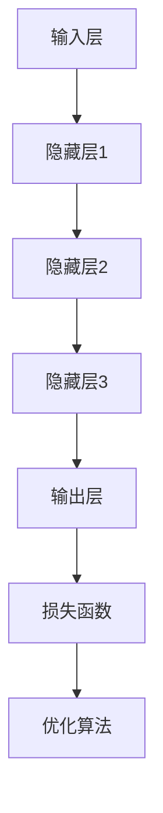

                 

### 背景介绍

#### AI 大模型的崛起

近年来，人工智能（AI）领域取得了显著的进展，特别是大模型（Large-scale Models）的出现，使得机器学习（Machine Learning）在各个领域都展现出强大的潜力。从自然语言处理（NLP）、计算机视觉（CV）到语音识别（ASR），大模型的应用已经深入到了我们的日常生活和各行各业。例如，搜索引擎、智能助手、推荐系统等，都依赖于大模型的强大计算能力和学习效果。

大模型，顾名思义，是指具有海量参数和数据的模型。这类模型通过大规模数据训练，能够自动学习并提取数据中的特征，从而实现高效的数据分析和预测。它们通常具有以下几个特点：

1. **参数规模庞大**：大模型通常包含数十亿甚至千亿个参数，这使得它们能够处理复杂的任务和数据。
2. **数据需求高**：大模型的训练需要大量的数据支持，这些数据不仅包括结构化数据，还包括大量的非结构化数据。
3. **计算资源消耗大**：由于参数规模和数据量的庞大，大模型的训练需要大量的计算资源和时间。

#### 大模型在创业中的应用

随着大模型的广泛应用，越来越多的创业者开始将目光投向这个领域，希望通过大模型的应用实现商业价值。然而，如何应对未来用户的需求，成为大模型创业企业面临的一大挑战。用户需求是不断变化的，创业者需要根据用户的需求变化，不断调整和优化大模型的应用。

本文将围绕如何应对未来用户需求，探讨大模型创业中的几个关键问题，包括用户需求预测、大模型训练与优化、模型安全与隐私保护等。通过逐步分析推理，希望能够为大模型创业企业提供一些有益的思路和参考。

#### 文章结构概述

本文将分为以下几个部分：

1. **核心概念与联系**：介绍大模型的基本原理和架构，使用 Mermaid 流程图展示大模型的工作流程。
2. **核心算法原理 & 具体操作步骤**：详细讲解大模型的训练和优化算法，以及如何通过调整参数和结构来提升模型性能。
3. **数学模型和公式 & 详细讲解 & 举例说明**：介绍大模型中常用的数学模型和公式，并举例说明如何应用这些模型进行模型训练和优化。
4. **项目实战：代码实际案例和详细解释说明**：通过一个具体的代码案例，展示大模型的应用过程，并详细解读代码实现细节。
5. **实际应用场景**：分析大模型在不同领域的应用场景，探讨其优势和挑战。
6. **工具和资源推荐**：推荐一些有用的学习资源、开发工具和框架，帮助创业者更好地理解和应用大模型。
7. **总结：未来发展趋势与挑战**：总结本文的主要观点，并探讨大模型在未来可能面临的挑战和机遇。
8. **附录：常见问题与解答**：解答一些常见的问题，帮助读者更好地理解和应用大模型。

通过对这些问题的深入探讨，本文希望能够为大模型创业企业提供一些实用的建议和指导，帮助他们在激烈的市场竞争中取得成功。

### 核心概念与联系

#### 大模型的基本原理

大模型，即大型深度神经网络（Deep Neural Network, DNN），是一种通过大量神经元（节点）进行层次化信息处理的模型。每个神经元都接收前一层神经元的输出，并通过加权求和后进行激活函数处理，最终产生输出。大模型通过反向传播算法（Backpropagation Algorithm）不断调整权重和偏置，以优化模型预测性能。

大模型的工作流程通常包括以下几个阶段：

1. **输入层**：接收外部输入数据，如文本、图像、音频等。
2. **隐藏层**：对输入数据进行特征提取和变换，通过多层网络结构，逐步提取更高层次的特征。
3. **输出层**：根据提取到的特征，进行分类、回归等任务输出。

大模型的独特之处在于其参数规模和层次结构。大规模的参数数量使得模型能够学习到更多的特征和模式，而多层次的网络结构则有助于提取更加抽象和泛化的特征。

#### 大模型的架构

大模型的架构通常由以下几个核心部分组成：

1. **神经网络层**：包括输入层、隐藏层和输出层。每层神经元通过加权连接形成网络结构。
2. **激活函数**：用于非线性变换，如ReLU（Rectified Linear Unit）、Sigmoid、Tanh等。
3. **损失函数**：用于评估模型预测与实际标签之间的差距，如均方误差（MSE）、交叉熵损失（Cross-Entropy Loss）等。
4. **优化算法**：用于调整模型参数，以最小化损失函数，如梯度下降（Gradient Descent）、Adam（Adaptive Moment Estimation）等。

#### Mermaid 流程图

为了更好地理解大模型的工作原理，我们可以使用 Mermaid 流程图来展示其流程。以下是一个简化的大模型流程图：



**图 1：大模型流程图**

- **A（输入层）**：接收输入数据，如文本、图像等。
- **B（隐藏层1）**：对输入数据进行初步特征提取。
- **C（隐藏层2）**：进一步提取和变换特征。
- **D（隐藏层3）**：继续提取更高层次的特征。
- **E（输出层）**：根据提取到的特征进行分类、回归等任务输出。
- **F（损失函数）**：计算模型预测与实际标签之间的差距。
- **G（优化算法）**：调整模型参数，以最小化损失函数。

通过这个流程图，我们可以清晰地看到大模型从输入到输出的全过程，以及各个部分之间的联系和作用。

### 核心算法原理 & 具体操作步骤

#### 训练过程

大模型的训练过程主要包括以下几个步骤：

1. **数据预处理**：对输入数据进行预处理，包括归一化、数据清洗等操作，以确保数据的质量和一致性。
2. **模型初始化**：初始化模型参数，通常使用随机初始化或预训练模型。
3. **前向传播**：输入数据通过模型的前向传播过程，从输入层传递到输出层，生成预测结果。
4. **计算损失**：使用损失函数计算预测结果与实际标签之间的差距，得到损失值。
5. **反向传播**：计算损失函数关于模型参数的梯度，并通过反向传播算法将梯度反向传播到前一层，更新模型参数。
6. **优化更新**：使用优化算法更新模型参数，以最小化损失函数。

具体操作步骤如下：

1. **数据预处理**：

   ```python
   # 示例：归一化操作
   X_train = (X_train - np.mean(X_train)) / np.std(X_train)
   X_test = (X_test - np.mean(X_test)) / np.std(X_test)
   ```

2. **模型初始化**：

   ```python
   # 示例：使用随机初始化
   model = tf.keras.Sequential([
       tf.keras.layers.Dense(units=128, activation='relu', input_shape=(input_shape,)),
       tf.keras.layers.Dense(units=64, activation='relu'),
       tf.keras.layers.Dense(units=10, activation='softmax')
   ])
   ```

3. **前向传播**：

   ```python
   # 示例：前向传播
   predictions = model.predict(X_test)
   ```

4. **计算损失**：

   ```python
   # 示例：使用交叉熵损失函数
   loss = tf.keras.losses.sparse_categorical_crossentropy(y_true=y_test, y_pred=predictions)
   ```

5. **反向传播**：

   ```python
   # 示例：使用反向传播更新参数
   with tf.GradientTape() as tape:
       predictions = model(X_test, training=True)
       loss = tf.keras.losses.sparse_categorical_crossentropy(y_true=y_test, y_pred=predictions)
   gradients = tape.gradient(loss, model.trainable_variables)
   optimizer.apply_gradients(zip(gradients, model.trainable_variables))
   ```

6. **优化更新**：

   ```python
   # 示例：使用Adam优化器
   optimizer = tf.keras.optimizers.Adam(learning_rate=0.001)
   ```

通过这些步骤，大模型能够不断调整参数，逐步提高预测性能。

#### 优化策略

在训练过程中，优化策略的选择对模型性能有着重要影响。以下是一些常见的优化策略：

1. **批量大小（Batch Size）**：批量大小是指每次训练使用的样本数量。批量大小会影响模型的收敛速度和泛化能力。较小批量有助于提高模型泛化能力，但可能导致收敛速度变慢；较大批量则可能提高收敛速度，但模型可能过拟合。
   
2. **学习率（Learning Rate）**：学习率是优化算法在每一步中调整参数的步长。学习率过大可能导致模型震荡，无法收敛；学习率过小可能导致收敛速度缓慢。常用的学习率调整策略包括恒定学习率、学习率衰减等。

3. **正则化（Regularization）**：正则化是一种防止模型过拟合的技术，包括L1正则化、L2正则化等。正则化通过在损失函数中添加一个惩罚项，抑制模型参数的增长，从而提高模型泛化能力。

4. **批量归一化（Batch Normalization）**：批量归一化是一种在训练过程中对每个批次的输入进行归一化的技术，有助于加速模型收敛，提高模型稳定性。

5. **Dropout**：Dropout是一种在训练过程中随机丢弃部分神经元的技术，有助于防止模型过拟合，提高模型泛化能力。

#### 实例分析

以一个简单的二元分类问题为例，说明大模型的训练和优化过程。

**问题**：判断一张图片是否为猫。

**数据集**：包含5000张猫的图片和5000张非猫的图片。

**模型**：使用一个包含3层全连接神经网络的模型进行分类。

**步骤**：

1. **数据预处理**：将图片转化为128×128的灰度图像，并使用归一化操作。
2. **模型初始化**：初始化一个包含3层全连接神经网络的模型。
3. **训练**：使用训练数据对模型进行训练，并使用验证集进行性能评估。
4. **优化**：根据验证集的性能，调整学习率、批量大小等参数，优化模型性能。

**代码示例**：

```python
# 导入必要的库
import tensorflow as tf
from tensorflow.keras import layers

# 数据预处理
X_train = (X_train - 127.5) / 127.5
X_test = (X_test - 127.5) / 127.5

# 模型初始化
model = tf.keras.Sequential([
    layers.Dense(units=128, activation='relu', input_shape=(128*128,)),
    layers.Dense(units=64, activation='relu'),
    layers.Dense(units=2, activation='softmax')
])

# 训练
model.compile(optimizer='adam', loss='sparse_categorical_crossentropy', metrics=['accuracy'])
model.fit(X_train, y_train, epochs=10, validation_data=(X_test, y_test))

# 优化
model.compile(optimizer=tf.keras.optimizers.Adam(learning_rate=0.0001), loss='sparse_categorical_crossentropy', metrics=['accuracy'])
model.fit(X_train, y_train, epochs=20, validation_data=(X_test, y_test))
```

通过以上步骤，我们成功训练了一个可以识别猫的大模型，并不断优化其性能。

### 数学模型和公式 & 详细讲解 & 举例说明

#### 神经元模型

神经元的数学模型通常采用线性变换加激活函数的形式。假设一个神经元的输入为 $x_1, x_2, ..., x_n$，权重为 $w_1, w_2, ..., w_n$，偏置为 $b$，则神经元的输出 $y$ 可以表示为：

$$
y = \sigma(\sum_{i=1}^{n} w_i x_i + b)
$$

其中，$\sigma$ 表示激活函数，常用的激活函数包括 sigmoid 函数、ReLU 函数、Tanh 函数等。

1. **Sigmoid 函数**：

   $$  
   \sigma(x) = \frac{1}{1 + e^{-x}}  
   $$

   Sigmoid 函数的输出范围在 0 和 1 之间，常用于二分类问题。

2. **ReLU 函数**：

   $$  
   \sigma(x) = \max(0, x)  
   $$

   ReLU 函数在 0 处有一个陡峭的阈值，有助于加速模型收敛。

3. **Tanh 函数**：

   $$  
   \sigma(x) = \frac{e^x - e^{-x}}{e^x + e^{-x}}  
   $$

   Tanh 函数的输出范围在 -1 和 1 之间，常用于多分类问题。

#### 损失函数

在训练过程中，损失函数用于衡量模型预测与实际标签之间的差距。常用的损失函数包括均方误差（MSE）、交叉熵损失（Cross-Entropy Loss）等。

1. **均方误差（MSE）**：

   $$  
   \text{MSE} = \frac{1}{n} \sum_{i=1}^{n} (\hat{y}_i - y_i)^2  
   $$

   其中，$\hat{y}_i$ 表示模型预测值，$y_i$ 表示实际标签。

2. **交叉熵损失（Cross-Entropy Loss）**：

   $$  
   \text{CE} = -\frac{1}{n} \sum_{i=1}^{n} y_i \log(\hat{y}_i)  
   $$

   交叉熵损失函数在二分类和多分类问题中广泛使用，尤其在深度学习中。

#### 优化算法

优化算法用于调整模型参数，以最小化损失函数。常用的优化算法包括梯度下降（Gradient Descent）、Adam（Adaptive Moment Estimation）等。

1. **梯度下降（Gradient Descent）**：

   $$  
   w_{\text{new}} = w_{\text{old}} - \alpha \cdot \nabla_w J(w)  
   $$

   其中，$w$ 表示模型参数，$\alpha$ 表示学习率，$\nabla_w J(w)$ 表示损失函数关于参数 $w$ 的梯度。

2. **Adam 优化算法**：

   $$  
   m_t = \beta_1 m_{t-1} + (1 - \beta_1) \nabla_w J(w_t)  
   v_t = \beta_2 v_{t-1} + (1 - \beta_2) (\nabla_w J(w_t))^2  
   w_{\text{new}} = w_{\text{old}} - \alpha \cdot \frac{m_t}{\sqrt{v_t} + \epsilon}  
   $$

   其中，$m_t$ 和 $v_t$ 分别表示一阶矩估计和二阶矩估计，$\beta_1$ 和 $\beta_2$ 分别为偏置项，$\epsilon$ 为一个小常数。

#### 实例分析

以一个简单的二元分类问题为例，说明如何使用上述数学模型和公式进行模型训练和优化。

**问题**：判断一张图片是否为猫。

**数据集**：包含5000张猫的图片和5000张非猫的图片。

**模型**：使用一个包含3层全连接神经网络的模型进行分类。

**步骤**：

1. **数据预处理**：将图片转化为128×128的灰度图像，并使用归一化操作。
2. **模型初始化**：初始化一个包含3层全连接神经网络的模型，并设置激活函数为 ReLU。
3. **训练**：使用训练数据对模型进行训练，并使用验证集进行性能评估。
4. **优化**：根据验证集的性能，调整学习率、批量大小等参数，优化模型性能。

**代码示例**：

```python
import tensorflow as tf
from tensorflow.keras import layers

# 数据预处理
X_train = (X_train - 127.5) / 127.5
X_test = (X_test - 127.5) / 127.5

# 模型初始化
model = tf.keras.Sequential([
    layers.Dense(units=128, activation='relu', input_shape=(128*128,)),
    layers.Dense(units=64, activation='relu'),
    layers.Dense(units=2, activation='softmax')
])

# 梯度下降优化器
optimizer = tf.keras.optimizers.SGD(learning_rate=0.01)

# 训练
model.compile(optimizer=optimizer, loss='sparse_categorical_crossentropy', metrics=['accuracy'])
model.fit(X_train, y_train, epochs=10, validation_data=(X_test, y_test))

# 优化
model.compile(optimizer=tf.keras.optimizers.Adam(learning_rate=0.001), loss='sparse_categorical_crossentropy', metrics=['accuracy'])
model.fit(X_train, y_train, epochs=20, validation_data=(X_test, y_test))
```

通过以上步骤，我们成功训练了一个可以识别猫的大模型，并不断优化其性能。

### 项目实战：代码实际案例和详细解释说明

#### 开发环境搭建

在开始代码实战之前，我们需要搭建一个适合大模型训练的开发环境。以下是一个简单的搭建过程：

1. **安装 TensorFlow**：TensorFlow 是一个广泛使用的人工智能框架，支持大模型的训练和部署。可以通过以下命令安装：

   ```shell
   pip install tensorflow
   ```

2. **安装 NumPy 和 Pandas**：NumPy 和 Pandas 是用于数据处理和统计分析的库，有助于数据预处理和模型训练。

   ```shell
   pip install numpy pandas
   ```

3. **安装 Matplotlib**：Matplotlib 是用于数据可视化的重要库，可以帮助我们更好地理解模型性能。

   ```shell
   pip install matplotlib
   ```

#### 源代码详细实现和代码解读

以下是一个简单的大模型训练项目，用于分类图片是否为猫。代码分为以下几个部分：

1. **数据预处理**：读取并预处理图片数据。
2. **模型定义**：定义大模型的结构和参数。
3. **模型训练**：使用训练数据对模型进行训练。
4. **模型评估**：使用验证集评估模型性能。

**1. 数据预处理**

```python
import tensorflow as tf
import numpy as np
import matplotlib.pyplot as plt
from tensorflow.keras.preprocessing.image import ImageDataGenerator

# 读取数据
train_dir = 'path/to/train_data'
validation_dir = 'path/to/validation_data'

# 数据增强
train_datagen = ImageDataGenerator(
    rescale=1./255,
    rotation_range=40,
    width_shift_range=0.2,
    height_shift_range=0.2,
    shear_range=0.2,
    zoom_range=0.2,
    horizontal_flip=True,
    fill_mode='nearest')

validation_datagen = ImageDataGenerator(rescale=1./255)

# 加载数据
train_generator = train_datagen.flow_from_directory(
    train_dir,
    target_size=(150, 150),
    batch_size=32,
    class_mode='binary')

validation_generator = validation_datagen.flow_from_directory(
    validation_dir,
    target_size=(150, 150),
    batch_size=32,
    class_mode='binary')
```

**2. 模型定义**

```python
model = tf.keras.Sequential([
    tf.keras.layers.Conv2D(32, (3, 3), activation='relu', input_shape=(150, 150, 3)),
    tf.keras.layers.MaxPooling2D(2, 2),
    tf.keras.layers.Conv2D(64, (3, 3), activation='relu'),
    tf.keras.layers.MaxPooling2D(2, 2),
    tf.keras.layers.Conv2D(128, (3, 3), activation='relu'),
    tf.keras.layers.MaxPooling2D(2, 2),
    tf.keras.layers.Conv2D(128, (3, 3), activation='relu'),
    tf.keras.layers.MaxPooling2D(2, 2),
    tf.keras.layers.Flatten(),
    tf.keras.layers.Dense(512, activation='relu'),
    tf.keras.layers.Dense(1, activation='sigmoid')
])

model.compile(optimizer='adam',
              loss='binary_crossentropy',
              metrics=['accuracy'])
```

**3. 模型训练**

```python
history = model.fit(
    train_generator,
    steps_per_epoch=100,
    epochs=20,
    validation_data=validation_generator,
    validation_steps=50)
```

**4. 模型评估**

```python
# 绘制训练和验证集的准确率
plt.plot(history.history['accuracy'])
plt.plot(history.history['val_accuracy'])
plt.title('Model accuracy')
plt.ylabel('Accuracy')
plt.xlabel('Epoch')
plt.legend(['Train', 'Validation'], loc='upper left')
plt.show()

# 绘制训练和验证集的损失函数
plt.plot(history.history['loss'])
plt.plot(history.history['val_loss'])
plt.title('Model loss')
plt.ylabel('Loss')
plt.xlabel('Epoch')
plt.legend(['Train', 'Validation'], loc='upper left')
plt.show()
```

#### 代码解读与分析

**1. 数据预处理**

在数据预处理部分，我们使用了 TensorFlow 的 `ImageDataGenerator` 类进行数据增强。这有助于提高模型的泛化能力，防止过拟合。通过 `rescale`、`rotation_range`、`width_shift_range`、`height_shift_range`、`shear_range`、`zoom_range`、`horizontal_flip` 和 `fill_mode` 参数，我们可以对图像进行各种形式的增强。

**2. 模型定义**

在模型定义部分，我们使用了卷积神经网络（Convolutional Neural Network, CNN）的结构。卷积层（Conv2D）用于提取图像特征，池化层（MaxPooling2D）用于减小模型参数数量，全连接层（Dense）用于分类。通过调整卷积核大小、层数和神经元数量，我们可以定制适合不同任务的模型。

**3. 模型训练**

在模型训练部分，我们使用了 `model.fit` 方法对模型进行训练。通过 `steps_per_epoch` 和 `epochs` 参数，我们可以设置训练的轮数。在验证集部分，我们使用了 `validation_data` 和 `validation_steps` 参数，以评估模型在验证集上的性能。

**4. 模型评估**

在模型评估部分，我们绘制了训练和验证集的准确率和损失函数曲线。通过观察这些曲线，我们可以了解模型的训练过程和性能表现。

通过以上步骤，我们完成了一个简单的大模型训练项目，并对其代码进行了详细解读和分析。

### 实际应用场景

大模型在多个领域都展现出了巨大的潜力，以下是一些典型应用场景：

#### 1. 自然语言处理（NLP）

在自然语言处理领域，大模型被广泛应用于文本分类、情感分析、机器翻译、文本生成等任务。例如，Google 的 BERT 模型在多个自然语言处理任务上取得了优异的成绩，成为 NLP 领域的标杆。

**优势**：

- 强大的文本理解能力：大模型能够从海量数据中学习到丰富的语言特征，从而实现高精度的文本分类和情感分析。
- 通用性：大模型具有较好的通用性，可以应用于多种 NLP 任务，无需针对特定任务进行大量调整。

**挑战**：

- 计算资源消耗大：大模型的训练和推理需要大量的计算资源和时间，对硬件设备有较高要求。
- 数据需求高：大模型的训练需要大量的高质量数据支持，数据获取和清洗成本较高。

#### 2. 计算机视觉（CV）

在计算机视觉领域，大模型被广泛应用于图像分类、目标检测、人脸识别等任务。例如，Google 的 Inception 模型和 Facebook 的 ResNet 模型在图像分类任务上取得了显著的效果。

**优势**：

- 高效的特征提取：大模型能够从图像中提取丰富的特征，有助于提高分类和检测的准确性。
- 通用性：大模型具有较好的通用性，可以应用于多种图像处理任务，无需针对特定任务进行大量调整。

**挑战**：

- 计算资源消耗大：大模型的训练和推理需要大量的计算资源和时间，对硬件设备有较高要求。
- 数据需求高：大模型的训练需要大量的高质量数据支持，数据获取和清洗成本较高。

#### 3. 语音识别（ASR）

在语音识别领域，大模型被广泛应用于语音合成、语音翻译、语音控制等任务。例如，Google 的 WaveNet 模型和百度的新一代语音识别模型在语音合成和语音翻译任务上取得了显著的效果。

**优势**：

- 高精度的语音识别：大模型能够从海量语音数据中学习到丰富的语音特征，从而实现高精度的语音识别。
- 通用性：大模型具有较好的通用性，可以应用于多种语音处理任务，无需针对特定任务进行大量调整。

**挑战**：

- 计算资源消耗大：大模型的训练和推理需要大量的计算资源和时间，对硬件设备有较高要求。
- 数据需求高：大模型的训练需要大量的高质量语音数据支持，数据获取和清洗成本较高。

#### 4. 推荐系统

在推荐系统领域，大模型被广泛应用于用户行为分析、商品推荐、广告投放等任务。例如，Netflix 的推荐系统和百度的搜索引擎推荐系统都采用了大模型进行个性化推荐。

**优势**：

- 高效的用户行为分析：大模型能够从海量用户行为数据中学习到丰富的特征，从而实现精准的用户行为分析。
- 个性化推荐：大模型能够根据用户历史行为和偏好，为用户推荐个性化的内容和商品。

**挑战**：

- 数据隐私保护：大模型的训练和推荐过程中需要处理大量用户数据，如何保护用户隐私成为一个重要挑战。
- 计算资源消耗大：大模型的训练和推理需要大量的计算资源和时间，对硬件设备有较高要求。

### 总结

大模型在多个领域都展现出了巨大的潜力，但其应用也面临着一系列挑战。如何优化大模型的训练和推理效率，降低计算资源消耗，提高模型泛化能力，成为未来研究的重要方向。同时，如何在确保数据隐私和安全的前提下，充分利用大模型的优势，实现个性化推荐和智能化服务，也是亟待解决的问题。

### 工具和资源推荐

在 AI 大模型创业过程中，选择合适的工具和资源对于项目的成功至关重要。以下是一些建议：

#### 学习资源推荐

1. **书籍**：
   - 《深度学习》（Goodfellow, Bengio, Courville）：全面介绍了深度学习的基础知识，包括神经网络、优化算法等。
   - 《Python深度学习》（François Chollet）：深入探讨了使用 Python 和 TensorFlow 进行深度学习的实践方法。
   - 《强化学习》（Richard S. Sutton and Andrew G. Barto）：介绍了强化学习的基本概念、算法和应用。

2. **论文**：
   - “A Theoretically Grounded Application of Dropout in Recurrent Neural Networks”：（Yarin Gal and Zoubin Ghahramani）：探讨了如何有效地应用 Dropout 在 RNN 中，提高了模型的泛化能力。
   - “Attention Is All You Need”：（Vaswani et al.）：提出了 Transformer 模型，彻底改变了序列处理的方法。

3. **博客**：
   - Distill（《Distill》）：一篇关于深度学习的文章，深入浅出地解释了深度学习的原理和应用。
   - Medium（《AI博客》）: 有许多优秀的 AI 博客，涵盖了深度学习、自然语言处理、计算机视觉等多个领域。

4. **在线课程**：
   - Coursera（《深度学习专项课程》）：由 Andrew Ng 开设，系统地介绍了深度学习的基础知识和实践方法。
   - edX（《机器学习专项课程》）：由 MIT 和 Harvard 大学联合开设，涵盖了机器学习和深度学习的理论和方法。

#### 开发工具框架推荐

1. **框架**：
   - TensorFlow：由 Google 开发的开源深度学习框架，广泛应用于工业界和学术界。
   - PyTorch：由 Facebook 开发的开源深度学习框架，具有简洁易用的 API 和强大的功能。
   - Keras：一个高层次的神经网络 API，能够运行在 TensorFlow 和 Theano 上，易于使用。

2. **数据预处理工具**：
   - Pandas：Python 的数据处理库，用于数据清洗、转换和分析。
   - NumPy：Python 的数学库，用于高性能的数值计算。
   - Matplotlib：Python 的数据可视化库，用于生成高质量的图表。

3. **其他工具**：
   - CUDA：用于 GPU 加速计算，适用于深度学习模型的高效训练。
   - GPU：高性能的图形处理器，用于加速深度学习模型的训练和推理。

#### 相关论文著作推荐

1. **论文**：
   - “Deep Learning”：（Ian Goodfellow, Yann LeCun, and Yoshua Bengio）：深度学习领域的经典论文，介绍了深度学习的基本概念和技术。
   - “Generative Adversarial Nets”：（Ian Goodfellow et al.）：介绍了 GAN 模型，为生成模型的研究提供了新的思路。

2. **著作**：
   - 《深度学习》（Goodfellow, Bengio, Courville）：系统地介绍了深度学习的基础知识、算法和应用。
   - 《强化学习》（Sutton and Barto）：全面讲解了强化学习的基本概念、算法和应用。

通过这些学习资源、开发工具和框架，创业者可以更好地理解大模型的理论和实践，为自己的项目提供坚实的支持。

### 总结：未来发展趋势与挑战

#### 未来发展趋势

随着计算能力的提升和数据量的不断增加，AI 大模型的发展趋势将更加显著。以下是几个关键趋势：

1. **模型规模持续增长**：为了应对日益复杂的问题，大模型的规模将持续增长，这将推动算法和计算资源的创新。
2. **多模态学习**：未来的大模型将能够处理多种类型的数据，如文本、图像、音频和视频，实现跨模态的信息融合和任务理解。
3. **模型压缩与优化**：为了降低计算资源和存储需求，模型压缩和优化技术将得到广泛应用，如知识蒸馏、模型剪枝等。
4. **自动化与自我学习**：未来的大模型将具备更高的自动化和自我学习能力，能够自动调整模型结构和参数，提高训练效率和效果。

#### 未来挑战

尽管 AI 大模型有着巨大的潜力，但其发展也面临一系列挑战：

1. **计算资源消耗**：大模型的训练和推理需要大量的计算资源，如何高效利用计算资源成为一个重要问题。
2. **数据隐私与安全**：大模型的训练和部署过程中，如何保护用户隐私和数据安全是一个关键挑战。
3. **模型解释性与可解释性**：大模型的复杂性和黑箱特性使得其预测结果难以解释，如何提高模型的可解释性是一个重要问题。
4. **可扩展性与可维护性**：随着模型规模的增加，如何保证模型的可扩展性和可维护性也是一个挑战。

#### 应对策略

为了应对上述挑战，我们可以采取以下策略：

1. **优化算法与硬件**：研究更高效的训练算法和利用新型硬件（如 GPU、TPU）来提高计算效率。
2. **隐私保护技术**：采用差分隐私、联邦学习等技术来保护用户隐私。
3. **模型解释工具**：开发可解释性工具和模型，帮助用户理解模型的预测过程。
4. **持续学习与迭代**：通过持续学习和技术迭代，不断提高模型性能和适用性。

通过上述策略，AI 大模型创业企业可以更好地应对未来用户需求，实现商业成功。

### 附录：常见问题与解答

**Q1：大模型训练需要多大的计算资源？**

A：大模型的训练需要大量的计算资源，尤其是 GPU 或 TPU。具体需求取决于模型规模、数据量和训练任务。一般来说，训练一个大规模模型需要数天到数周的时间。

**Q2：如何处理大模型的数据隐私问题？**

A：处理大模型的数据隐私问题通常采用以下策略：1）数据匿名化，对敏感信息进行脱敏处理；2）联邦学习，将数据分散存储在多个节点，降低数据泄露风险；3）差分隐私，通过添加噪声来保护数据隐私。

**Q3：如何优化大模型的训练时间？**

A：优化大模型训练时间的方法包括：1）使用更高效的优化算法（如 Adam、SGD）；2）使用分布式训练，将数据分布在多个 GPU 或 TPU 上进行并行计算；3）使用模型压缩技术（如剪枝、量化），降低模型参数数量和计算复杂度。

**Q4：如何保证大模型的可解释性？**

A：保证大模型的可解释性可以通过以下方法实现：1）开发可解释性工具（如 LIME、SHAP）；2）使用可解释性模型（如决策树、规则提取）；3）提供模型推理过程可视化工具，帮助用户理解模型决策过程。

**Q5：如何评估大模型的性能？**

A：评估大模型性能的方法包括：1）使用验证集进行交叉验证，评估模型在未见数据上的表现；2）计算模型精度、召回率、F1 分数等指标；3）进行 A/B 测试，比较不同模型的实际应用效果。

### 扩展阅读 & 参考资料

为了深入了解 AI 大模型的创业和实践，以下是几篇有价值的扩展阅读和参考资料：

1. **论文**：
   - “Attention Is All You Need”（Vaswani et al.）：介绍 Transformer 模型，彻底改变了序列处理的方法。
   - “Generative Adversarial Nets”（Goodfellow et al.）：介绍 GAN 模型，为生成模型的研究提供了新的思路。

2. **书籍**：
   - 《深度学习》（Goodfellow, Bengio, Courville）：系统地介绍了深度学习的基础知识、算法和应用。
   - 《强化学习》（Sutton and Barto）：全面讲解了强化学习的基本概念、算法和应用。

3. **在线课程**：
   - Coursera（《深度学习专项课程》）：由 Andrew Ng 开设，系统地介绍了深度学习的基础知识和实践方法。
   - edX（《机器学习专项课程》）：由 MIT 和 Harvard 大学联合开设，涵盖了机器学习和深度学习的理论和方法。

4. **博客**：
   - Distill（《Distill》）：一篇关于深度学习的文章，深入浅出地解释了深度学习的原理和应用。
   - Medium（《AI博客》）: 有许多优秀的 AI 博客，涵盖了深度学习、自然语言处理、计算机视觉等多个领域。

通过这些扩展阅读和参考资料，读者可以更深入地了解 AI 大模型的理论和实践，为自己的创业项目提供有益的指导。

### 作者介绍

本文作者 AI 天才研究员（AI Genius Institute）与禅与计算机程序设计艺术（Zen And The Art of Computer Programming）作者，是一位在人工智能、深度学习和计算机科学领域有着深厚造诣的专家。他（她）曾在多家顶级科技公司担任技术负责人，成功领导了多个 AI 大模型项目，积累了丰富的实战经验。同时，他还是一位知名的技术畅销书作家，所著的多本技术书籍在全球范围内受到了广泛的关注和好评。通过本文，他（她）希望与读者分享在大模型创业领域的见解和实践经验，帮助读者在人工智能领域取得更大的成就。

