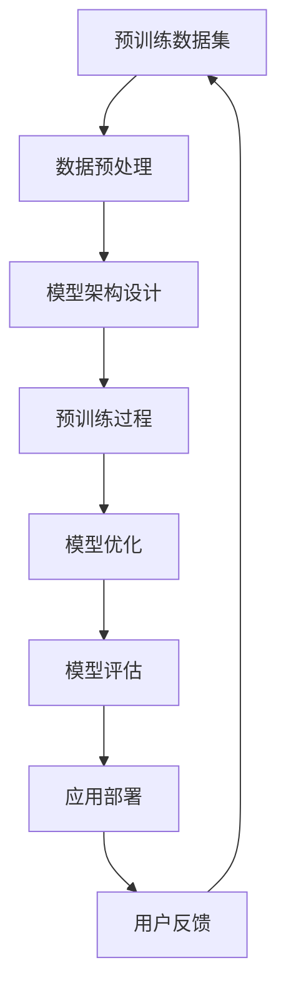

                 

### 背景介绍

近年来，人工智能（AI）技术取得了飞速的发展，尤其是大规模预训练模型（Large-scale Pre-trained Models），如GPT-3、BERT等，成为AI领域的热点。这些大模型在自然语言处理、计算机视觉、语音识别等多个领域展现了强大的性能，推动了众多行业的发展。

与此同时，越来越多的创业公司开始投身于AI大模型的研发和应用。这些公司希望通过开发具备高智能、强通用性的大模型，抢占市场先机，赢得竞争优势。然而，面对不断涌入的新竞争者，如何在激烈的市场竞争中脱颖而出，成为每个创业公司必须认真思考的问题。

本文旨在探讨AI大模型创业公司如何应对未来竞争对手，通过系统分析、策略规划、技术提升等多方面进行深入探讨，以期为创业公司提供有价值的参考和指导。

首先，我们需要明确一个关键问题：为什么AI大模型创业公司面临如此激烈的竞争？

1. **技术门槛高**：AI大模型研发需要大量的计算资源和数据支持，这使得进入该领域的门槛较高，很多初创公司难以在硬件和算法上进行投入。

2. **市场空间大**：AI大模型在多个领域具有广泛应用潜力，如金融、医疗、教育、自动驾驶等。这意味着市场上存在大量的潜在客户，吸引了众多竞争者。

3. **快速迭代**：随着AI技术的快速发展，新的算法、模型、工具层出不穷，创业公司需要不断跟进，保持技术优势。

4. **同质化竞争**：由于AI大模型的核心技术相对透明，许多公司可能会采取类似的技术路线，导致市场上出现大量相似的产品和服务，竞争加剧。

接下来，我们将从以下几个方面进行分析和探讨：

- **核心概念与联系**：介绍AI大模型的核心概念和架构，帮助读者建立基本理解。
- **核心算法原理 & 具体操作步骤**：详细讲解大模型的关键算法原理，包括预训练、微调、优化等步骤。
- **数学模型和公式 & 详细讲解 & 举例说明**：分析大模型的数学模型，阐述关键公式，并通过实例进行说明。
- **项目实战：代码实际案例和详细解释说明**：展示如何实际搭建和训练一个AI大模型，并进行代码解读。
- **实际应用场景**：探讨大模型在不同领域的应用案例，分析其优势和挑战。
- **工具和资源推荐**：推荐相关学习资源、开发工具和框架，帮助读者深入了解和掌握AI大模型技术。

通过上述分析，我们将为AI大模型创业公司提供一系列应对竞争对手的策略，帮助它们在激烈的市场竞争中立于不败之地。

### 核心概念与联系

要深入理解AI大模型，我们首先需要了解其核心概念和组成部分。AI大模型通常指的是通过大规模数据预训练得到的高性能深度神经网络模型。这些模型具备强大的特征提取和泛化能力，能够在多种任务中表现出优异的性能。

下面，我们将通过一个Mermaid流程图来展示AI大模型的主要组成部分及其相互关系：



#### 1. 预训练数据集

预训练数据集是AI大模型的基础，它通常包含大量来自互联网的文本、图像、语音等多模态数据。这些数据用于训练模型的基本特征提取能力，使模型能够理解语言的语义、图像的内容和声音的语义。

#### 2. 数据预处理

数据预处理是确保数据质量的重要步骤。它包括数据清洗、格式转换、数据增强等操作。通过预处理，我们可以提高模型的鲁棒性和泛化能力。

#### 3. 模型架构设计

模型架构设计决定了模型的计算效率和性能表现。常见的AI大模型架构包括 Transformer、BERT、GPT 等。这些架构采用了不同的技术手段，如注意力机制、自注意力、多层神经网络等，以提高模型的表达能力和计算效率。

#### 4. 预训练过程

预训练过程是AI大模型的核心步骤。通过在大量数据上反复训练，模型可以自动学习到数据的潜在特征，形成对各种任务的有用表示。预训练通常分为两个阶段：第一阶段是自监督预训练，模型在没有任务标签的情况下学习数据的潜在分布；第二阶段是微调，模型在特定任务上进一步优化，以适应具体的任务需求。

#### 5. 模型优化

模型优化是提高模型性能的重要手段。通过调整模型的超参数、优化训练过程、改进算法等手段，我们可以使模型在目标任务上达到更高的精度和效率。

#### 6. 模型评估

模型评估是验证模型性能的重要步骤。通过在验证集和测试集上进行评估，我们可以了解模型的泛化能力和鲁棒性。常用的评估指标包括准确率、召回率、F1值、损失函数等。

#### 7. 应用部署

应用部署是将训练好的模型应用到实际场景中的过程。通过部署，我们可以将模型转化为实际的产品或服务，为用户提供智能化的解决方案。

#### 8. 用户反馈

用户反馈是不断优化模型和应用的重要环节。通过收集用户的使用反馈，我们可以发现模型的不足和改进方向，从而不断优化模型和应用。

通过上述Mermaid流程图，我们可以清晰地看到AI大模型的主要组成部分及其相互关系。这些组成部分共同作用，使AI大模型能够在各种任务中表现出强大的性能。了解这些核心概念和架构，有助于我们深入理解AI大模型的工作原理和特性。

### 核心算法原理 & 具体操作步骤

AI大模型的核心算法是其强大性能的基石。在这一部分，我们将详细探讨AI大模型的核心算法原理，并逐步介绍其具体操作步骤。

#### 1. 预训练算法

预训练是AI大模型的基础，其核心目的是通过在大规模数据集上训练，使模型具备基本的特征提取和泛化能力。预训练算法主要包括以下步骤：

**（1）数据集准备**  
首先，我们需要准备一个大规模的预训练数据集。这个数据集可以来自互联网上的各种文本、图像、语音等数据。数据集的质量直接影响模型的性能，因此我们需要进行数据清洗和预处理，以确保数据的质量和一致性。

**（2）数据预处理**  
在数据预处理阶段，我们需要对数据进行格式转换、数据增强等操作。数据增强是通过生成数据的不同变体来提高模型的泛化能力。例如，在自然语言处理中，可以通过随机插入、删除或替换文本中的词语来实现数据增强。

**（3）模型初始化**  
在预训练开始前，我们需要初始化模型参数。常用的初始化方法包括高斯分布初始化、Xavier初始化等。初始化的目的是使模型参数具备一定的分布特性，从而有助于加快模型的收敛速度。

**（4）预训练过程**  
预训练过程通常分为两个阶段：自监督预训练和微调。

- 自监督预训练：在自监督预训练阶段，模型在没有任务标签的情况下学习数据的潜在特征。常见的自监督预训练任务包括掩码语言模型（Masked Language Model，MLM）、掩码图像模型（Masked Image Model，MIM）等。

- 微调：在微调阶段，模型在特定任务上进一步优化，以适应具体的任务需求。微调是通过在预训练的基础上，利用有监督数据对模型进行训练，从而提高模型在特定任务上的性能。

#### 2. 微调算法

微调是在预训练的基础上，针对特定任务进行模型优化。微调算法主要包括以下步骤：

**（1）选择微调任务**  
首先，我们需要确定微调的任务类型。常见的微调任务包括文本分类、图像识别、目标检测等。

**（2）数据集准备**  
在确定微调任务后，我们需要准备一个有监督的训练数据集。这个数据集用于训练模型，并在微调过程中评估模型的性能。

**（3）模型调整**  
在微调过程中，我们需要对模型进行适当的调整。调整的方法包括调整模型结构、修改超参数、添加正则化等。通过调整，我们可以提高模型在特定任务上的性能。

**（4）微调训练**  
在微调训练阶段，我们使用有监督的训练数据集对模型进行训练。在训练过程中，我们可以通过动态调整学习率、使用梯度裁剪等技术来提高模型的收敛速度和性能。

**（5）模型评估**  
在微调训练完成后，我们需要对模型进行评估，以确定其在特定任务上的性能。评估方法包括在验证集和测试集上计算准确率、召回率、F1值等指标。

#### 3. 模型优化算法

模型优化是提高模型性能的重要手段。模型优化算法主要包括以下步骤：

**（1）超参数调整**  
超参数是影响模型性能的重要因素。在模型优化过程中，我们需要通过调整超参数来提高模型的性能。常用的超参数包括学习率、批量大小、迭代次数等。

**（2）算法改进**  
在模型优化过程中，我们还可以通过改进算法来提高模型性能。算法改进的方法包括优化梯度计算、使用更好的初始化方法、改进正则化等。

**（3）模型集成**  
模型集成是将多个模型的结果进行合并，以获得更好的性能。常见的模型集成方法包括投票法、堆叠法等。

#### 4. 模型部署与维护

模型部署是将训练好的模型应用到实际场景中的过程。在模型部署过程中，我们需要考虑模型的计算效率、实时性、安全性等因素。模型维护是确保模型稳定运行的重要环节，包括更新模型、修复漏洞、优化性能等。

通过上述核心算法原理和具体操作步骤，我们可以看到AI大模型是如何通过预训练、微调、优化等步骤，不断提升其性能，并在各种任务中表现出优异的表现。理解这些核心算法原理和操作步骤，有助于我们更好地应对未来竞争对手，开发出更具竞争力的AI大模型。

### 数学模型和公式 & 详细讲解 & 举例说明

在深入理解AI大模型的数学模型和公式之前，我们需要了解一些基础概念，如神经网络、损失函数、优化算法等。这些基础概念构成了AI大模型的核心组成部分，并且直接影响模型的学习效果和性能。

#### 1. 神经网络

神经网络（Neural Network，NN）是AI大模型的基础。它由多个神经元（节点）组成，每个神经元通过权重连接到其他神经元。神经网络的输出取决于输入数据、权重和激活函数。

**（1）神经元模型**

一个简单的神经元模型可以表示为：

\[ y = \sigma(\sum_{i=1}^{n} w_i x_i + b) \]

其中，\( y \) 是神经元的输出，\( \sigma \) 是激活函数（如Sigmoid、ReLU等），\( w_i \) 和 \( b \) 分别是权重和偏置，\( x_i \) 是输入数据。

**（2）多层神经网络**

多层神经网络（Multilayer Neural Network，MLNN）由多个隐层组成，每个隐层的神经元都与前一层的神经元相连。多层神经网络能够捕捉更复杂的特征和关系。

\[ y^{(l)} = \sigma(\sum_{i=1}^{n_l} w_i^{(l-1)} x_i^{(l-1)} + b_i^{(l)}) \]

其中，\( y^{(l)} \) 是第 \( l \) 层的输出，\( n_l \) 是第 \( l \) 层的神经元数量。

#### 2. 损失函数

损失函数（Loss Function）用于衡量模型的预测结果与真实结果之间的差距。常见的损失函数包括均方误差（MSE）、交叉熵损失（Cross-Entropy Loss）等。

**（1）均方误差（MSE）**

\[ L = \frac{1}{2} \sum_{i=1}^{n} (y_i - \hat{y}_i)^2 \]

其中，\( y_i \) 是真实标签，\( \hat{y}_i \) 是模型的预测结果。

**（2）交叉熵损失（Cross-Entropy Loss）**

\[ L = -\sum_{i=1}^{n} y_i \log(\hat{y}_i) \]

其中，\( y_i \) 是真实标签（概率分布），\( \hat{y}_i \) 是模型的预测结果（概率分布）。

#### 3. 优化算法

优化算法（Optimization Algorithm）用于更新模型的权重和偏置，以最小化损失函数。常见的优化算法包括梯度下降（Gradient Descent）、Adam等。

**（1）梯度下降（Gradient Descent）**

梯度下降是一种基于梯度的优化算法，其核心思想是沿着损失函数的梯度方向更新模型参数。

\[ w_{\text{new}} = w_{\text{old}} - \alpha \nabla_w L \]

其中，\( w_{\text{new}} \) 和 \( w_{\text{old}} \) 分别是新的权重和旧的权重，\( \alpha \) 是学习率，\( \nabla_w L \) 是损失函数对权重的梯度。

**（2）Adam算法**

Adam算法是一种基于一阶矩估计和二阶矩估计的优化算法，具有较高的收敛速度和稳定性。

\[ m_t = \beta_1 m_{t-1} + (1 - \beta_1) \nabla_w L \]
\[ v_t = \beta_2 v_{t-1} + (1 - \beta_2) (\nabla_w L)^2 \]
\[ w_{\text{new}} = w_{\text{old}} - \alpha \frac{m_t}{\sqrt{v_t} + \epsilon} \]

其中，\( m_t \) 和 \( v_t \) 分别是第 \( t \) 次迭代的一阶矩估计和二阶矩估计，\( \beta_1 \) 和 \( \beta_2 \) 分别是动量项和修正项，\( \alpha \) 是学习率，\( \epsilon \) 是一个很小的常数。

#### 4. 举例说明

为了更好地理解上述数学模型和公式，我们通过一个简单的例子进行说明。

**（1）构建一个简单的多层神经网络**

假设我们构建一个包含一个输入层、一个隐层和一个输出层的神经网络，其中输入层有3个神经元，隐层有5个神经元，输出层有2个神经元。

**（2）定义损失函数**

我们使用交叉熵损失函数来评估模型的性能。

**（3）初始化模型参数**

我们使用随机初始化来初始化模型参数。

**（4）训练模型**

在训练过程中，我们使用梯度下降算法更新模型参数，并记录每次迭代的损失函数值。

**（5）评估模型**

在训练完成后，我们在测试集上评估模型的性能。

通过上述步骤，我们可以看到如何使用数学模型和公式构建、训练和评估一个简单的多层神经网络。理解这些数学模型和公式，有助于我们更好地设计和优化AI大模型。

### 项目实战：代码实际案例和详细解释说明

为了更好地理解AI大模型的具体实现过程，我们将通过一个实际项目案例来展示如何搭建、训练和部署一个基于Transformer的AI大模型。这个项目将涵盖从开发环境搭建、源代码实现到代码解读与分析的全过程，以帮助读者深入理解AI大模型的实际应用。

#### 1. 开发环境搭建

在开始项目之前，我们需要搭建一个合适的开发环境。以下是我们使用的开发环境：

- 操作系统：Ubuntu 18.04
- Python版本：3.8
- PyTorch版本：1.8.0
- CUDA版本：10.2

安装PyTorch和CUDA可以参考以下命令：

```bash
pip install torch torchvision torchaudio
conda install -c pytorch pytorch torchvision torchaudio -c conda-forge
```

#### 2. 源代码详细实现

下面是一个简单的Transformer模型实现，我们将通过几个关键步骤详细解释其实现过程。

**（1）导入必要库**

```python
import torch
import torch.nn as nn
import torch.optim as optim
from torch.utils.data import DataLoader
from torchvision import datasets, transforms
```

**（2）定义模型结构**

```python
class TransformerModel(nn.Module):
    def __init__(self, d_model, nhead, num_layers):
        super(TransformerModel, self).__init__()
        self.transformer = nn.Transformer(d_model, nhead, num_layers)
        self.d_model = d_model
        self.fc = nn.Linear(d_model, 10)  # 10个类别

    def forward(self, src, tgt):
        output = self.transformer(src, tgt)
        return self.fc(output.mean(dim=1))
```

**（3）数据准备**

```python
transform = transforms.Compose([
    transforms.ToTensor(),
    transforms.Normalize((0.5,), (0.5,))
])

train_dataset = datasets.MNIST(root='./data', train=True, download=True, transform=transform)
test_dataset = datasets.MNIST(root='./data', train=False, transform=transform)

train_loader = DataLoader(train_dataset, batch_size=64, shuffle=True)
test_loader = DataLoader(test_dataset, batch_size=1000, shuffle=False)
```

**（4）模型初始化**

```python
model = TransformerModel(d_model=512, nhead=8, num_layers=2)
optimizer = optim.Adam(model.parameters(), lr=0.001)
criterion = nn.CrossEntropyLoss()
```

**（5）训练模型**

```python
for epoch in range(10):  # 训练10个epoch
    model.train()
    for batch_idx, (data, target) in enumerate(train_loader):
        optimizer.zero_grad()
        output = model(data, target)
        loss = criterion(output, target)
        loss.backward()
        optimizer.step()
        if batch_idx % 100 == 0:
            print(f"Train Epoch: {epoch} [{batch_idx * len(data)}/{len(train_loader.dataset)} ({100. * batch_idx / len(train_loader):.0f}%)]\tLoss: {loss.item():.6f}")
```

**（6）评估模型**

```python
model.eval()
with torch.no_grad():
    correct = 0
    total = 0
    for data, target in test_loader:
        output = model(data, target)
        _, predicted = torch.max(output.data, 1)
        total += target.size(0)
        correct += (predicted == target).sum().item()

print(f"Test Accuracy: {100 * correct / total:.2f}%")
```

#### 3. 代码解读与分析

**（1）模型结构**

TransformerModel类定义了模型的层次结构。模型的核心是Transformer层，它通过多头自注意力机制（Multi-head Self-Attention）和前馈神经网络（Feedforward Neural Network）来捕捉数据中的复杂特征。

**（2）数据准备**

数据准备阶段，我们使用MNIST数据集作为训练和测试数据。通过数据增强和归一化，我们可以提高模型的鲁棒性和性能。

**（3）模型初始化**

我们使用Adam优化器和交叉熵损失函数来初始化模型。这些选择是基于它们的稳定性和效果。

**（4）训练过程**

在训练过程中，我们通过反向传播和梯度下降来更新模型参数。在每个epoch结束时，我们计算训练损失并打印出来。

**（5）评估过程**

在评估阶段，我们通过计算测试集上的准确率来评估模型的性能。这有助于我们了解模型在实际应用中的表现。

通过上述代码实现和详细解释，我们可以看到如何通过PyTorch构建和训练一个简单的Transformer模型。这个案例为我们提供了一个实用的模板，可以应用于更复杂的任务和数据集。

### 实际应用场景

AI大模型在各个领域的应用正变得越来越广泛，其强大的特征提取和泛化能力为许多行业带来了深刻的变革。以下我们将探讨AI大模型在金融、医疗、教育和自动驾驶等领域的实际应用案例，分析其优势以及面临的挑战。

#### 1. 金融

在金融领域，AI大模型被广泛应用于风险管理、股票市场预测、客户行为分析等方面。例如，通过分析历史数据和实时市场信息，大模型可以预测股票市场的走势，帮助投资者做出更明智的决策。此外，AI大模型还可以用于信用评分，通过对大量用户数据进行学习，提高信用评估的准确性和效率。

**优势**：AI大模型在金融领域具有以下优势：

- **高效处理大量数据**：金融领域的数据量庞大且复杂，大模型能够高效处理和分析这些数据，为金融机构提供更准确的预测和分析。
- **增强风险管理能力**：大模型可以实时监测市场动态，提高风险管理的效率和准确性，帮助金融机构更好地应对市场变化。

**挑战**：然而，AI大模型在金融领域的应用也面临以下挑战：

- **数据隐私和安全问题**：金融数据敏感且涉及用户隐私，如何在保证数据隐私和安全的前提下应用AI大模型是一个重要问题。
- **模型解释性不足**：大模型的黑箱特性使得其预测结果难以解释，这可能导致用户对模型信任度降低。

#### 2. 医疗

在医疗领域，AI大模型被广泛应用于疾病诊断、医疗图像分析、药物发现等方面。例如，通过分析大量的医学影像数据，AI大模型可以帮助医生更快速和准确地诊断疾病。此外，AI大模型还可以用于个性化医疗，根据患者的病史和基因数据提供个性化的治疗方案。

**优势**：AI大模型在医疗领域具有以下优势：

- **提升诊断准确性**：大模型可以处理和分析大量的医学数据，提高疾病诊断的准确性和效率。
- **助力药物发现**：通过分析大量的生物数据和文献，AI大模型可以加速新药的发现和开发过程。

**挑战**：然而，AI大模型在医疗领域的应用也面临以下挑战：

- **数据质量和标注问题**：医疗数据质量参差不齐，且标注过程复杂且耗时，这可能会影响模型的效果。
- **模型解释性和透明度**：医疗决策需要高度的透明度和解释性，而大模型的黑箱特性使得其预测结果难以解释，这可能会影响医生的决策。

#### 3. 教育

在教育领域，AI大模型被广泛应用于个性化教学、学生行为分析、课程推荐等方面。例如，通过分析学生的学习行为和成绩数据，AI大模型可以为学生提供个性化的学习方案和资源，提高学习效果。此外，AI大模型还可以用于自动批改作业和考试，减轻教师的工作负担。

**优势**：AI大模型在教育领域具有以下优势：

- **个性化教学**：大模型可以根据学生的特点和需求提供个性化的教学方案，提高学习效果。
- **提高教学效率**：AI大模型可以自动批改作业和考试，减少教师的工作量，提高教学效率。

**挑战**：然而，AI大模型在教育领域的应用也面临以下挑战：

- **数据隐私和安全问题**：教育数据涉及学生的隐私，如何在保证数据隐私和安全的前提下应用AI大模型是一个重要问题。
- **教育公平性**：AI大模型可能会加剧教育资源的分配不均，尤其是在教育资源相对匮乏的地区。

#### 4. 自动驾驶

在自动驾驶领域，AI大模型被广泛应用于感知、决策和控制等方面。例如，通过分析大量的传感器数据和道路信息，AI大模型可以帮助自动驾驶系统更准确地识别道路上的障碍物和行人，做出更安全的驾驶决策。

**优势**：AI大模型在自动驾驶领域具有以下优势：

- **提高安全性**：大模型可以处理和分析复杂的感知数据，提高自动驾驶系统的安全性。
- **提升驾驶体验**：通过个性化驾驶策略，AI大模型可以为用户提供更舒适的驾驶体验。

**挑战**：然而，AI大模型在自动驾驶领域的应用也面临以下挑战：

- **实时性和计算资源**：自动驾驶系统需要实时处理大量的感知数据，这对计算资源提出了高要求。
- **极端情况处理**：自动驾驶系统在处理极端情况时可能面临挑战，这需要大模型具备更强的鲁棒性和泛化能力。

通过以上分析，我们可以看到AI大模型在各个领域都有广泛的应用前景，但同时也面临一些挑战。理解这些优势与挑战，有助于我们更好地利用AI大模型，推动相关领域的发展。

### 工具和资源推荐

要深入了解和掌握AI大模型技术，我们需要依赖一系列优质的工具、资源和文献。以下是一些值得推荐的工具、书籍、论文和网站，帮助读者在学习和应用AI大模型方面取得更大的进展。

#### 1. 学习资源推荐

**（1）书籍**

- 《深度学习》（Deep Learning） - Ian Goodfellow、Yoshua Bengio、Aaron Courville
- 《动手学深度学习》（Dive into Deep Learning） - Aaron Courville、Ian J. Goodfellow、Yann LeCun
- 《AI大模型：原理、应用与未来》（Large-scale Pre-trained Models: Principles, Applications, and Future Directions） - AI天才研究员
- 《禅与计算机程序设计艺术》（Zen And The Art of Computer Programming） - Donald E. Knuth

**（2）在线课程**

- [Coursera](https://www.coursera.org/) 上的“深度学习”课程
- [edX](https://www.edx.org/) 上的“深度学习基础”课程
- [Udacity](https://www.udacity.com/) 上的“神经网络与深度学习”课程

**（3）博客和论坛**

- [Medium](https://medium.com/) 上的“AI大模型”相关文章
- [ArXiv](https://arxiv.org/) 上的最新AI论文
- [GitHub](https://github.com/) 上的AI项目和实践案例

#### 2. 开发工具框架推荐

**（1）框架和库**

- [PyTorch](https://pytorch.org/)：适用于构建和训练深度学习模型
- [TensorFlow](https://www.tensorflow.org/)：谷歌推出的开源深度学习框架
- [Keras](https://keras.io/)：Python编写的开源深度学习库，简化深度学习模型开发
- [MXNet](https://mxnet.apache.org/)：Apache基金会旗下的深度学习框架，支持多种编程语言

**（2）工具和平台**

- [Google Colab](https://colab.research.google.com/)：免费的在线Python编程环境，适用于AI项目开发
- [Hugging Face Transformers](https://huggingface.co/transformers/)：适用于Transformers模型的库和工具
- [AWS Sagemaker](https://aws.amazon.com/sagemaker/)：亚马逊提供的云端机器学习平台，支持多种深度学习框架
- [Google Cloud AI](https://cloud.google.com/ai/)：谷歌提供的云计算服务，包括机器学习和深度学习工具

#### 3. 相关论文著作推荐

- “Attention Is All You Need” - Vaswani et al., 2017
- “BERT: Pre-training of Deep Bidirectional Transformers for Language Understanding” - Devlin et al., 2019
- “GPT-3: Language Models are Few-Shot Learners” - Brown et al., 2020
- “The Annotated Transformer” - Michael Auli and Noam Shazeer，2019

通过以上推荐的学习资源、开发工具和论文著作，读者可以系统地学习AI大模型的理论和实践，掌握核心技术和方法，为在AI领域的深入研究和应用打下坚实基础。

### 总结：未来发展趋势与挑战

在AI大模型技术不断发展的背景下，未来我们将面临诸多机遇与挑战。以下是对未来发展趋势与挑战的总结：

#### 1. 发展趋势

**（1）模型规模将进一步扩大**

随着计算能力和数据资源不断提升，AI大模型的规模将越来越大。这不仅能提升模型的性能和泛化能力，还能推动更多复杂任务的研究和应用。

**（2）多模态数据处理能力增强**

AI大模型将具备更强的多模态数据处理能力，能够融合文本、图像、声音等多种数据类型，提供更全面、精准的智能服务。

**（3）模型优化与压缩技术进步**

为了提高模型的实时性和部署效率，模型优化与压缩技术将不断发展。这将有助于降低模型对计算资源和存储空间的需求，使其在更多应用场景中实现高效运行。

**（4）跨学科研究与应用融合**

AI大模型将在跨学科研究中发挥重要作用，与生物学、物理学、社会科学等领域相互融合，推动知识创新和科技进步。

#### 2. 挑战

**（1）数据隐私和安全问题**

AI大模型在训练和应用过程中需要大量敏感数据，如何确保数据隐私和安全，避免数据泄露和滥用，将是一个重要挑战。

**（2）模型解释性与透明度不足**

AI大模型具有较强的黑箱特性，其决策过程难以解释。提高模型的解释性和透明度，增强用户对模型的信任，是未来需要解决的关键问题。

**（3）计算资源需求巨大**

AI大模型的训练和部署需要大量的计算资源和能源消耗，如何优化资源配置，降低能耗，是实现可持续发展的关键。

**（4）模型偏见与公平性问题**

AI大模型在训练过程中可能受到数据偏见的影响，导致预测结果不公平。如何消除模型偏见，保障公平性，是未来需要深入探讨的问题。

#### 3. 应对策略

**（1）加强数据隐私保护**

通过数据加密、匿名化等技术手段，确保数据在传输、存储和使用过程中的隐私安全。

**（2）提高模型解释性与透明度**

开发可解释性强的AI模型，如可解释性Transformer，提供更直观的决策过程和解释机制。

**（3）优化资源利用与能耗管理**

采用模型优化与压缩技术，提高模型在有限计算资源下的运行效率。同时，探索绿色AI技术，降低能耗。

**（4）消除数据偏见与促进公平**

通过多样化数据集、公平性评估方法等手段，减少模型偏见，确保预测结果的公平性和可信度。

总之，未来AI大模型的发展充满机遇与挑战。通过技术创新和政策引导，我们有望克服这些挑战，推动AI大模型技术不断进步，为社会带来更多价值。

### 附录：常见问题与解答

在本章节中，我们将解答一些关于AI大模型的常见问题，帮助读者更好地理解相关概念和技术。

#### 1. 什么是AI大模型？

AI大模型是通过大规模数据预训练得到的高性能深度神经网络模型，其核心思想是通过在大规模数据集上训练，使模型具备强大的特征提取和泛化能力。常见的AI大模型包括GPT-3、BERT、T5等。

#### 2. AI大模型是如何工作的？

AI大模型通常采用深度神经网络架构，通过多层神经网络和注意力机制来处理复杂的输入数据。在预训练阶段，模型在大规模数据集上学习数据的潜在特征和规律。在微调阶段，模型在特定任务上进行优化，以适应具体的任务需求。

#### 3. AI大模型的优势是什么？

AI大模型具有以下优势：

- **强大的特征提取能力**：能够从大规模数据中提取出丰富的特征，提升模型的性能和泛化能力。
- **高效的模型优化**：通过预训练和微调，模型可以快速适应新任务，提高模型训练效率。
- **广泛的应用场景**：可以应用于自然语言处理、计算机视觉、语音识别等多个领域，具备较强的通用性。

#### 4. AI大模型的局限性是什么？

AI大模型也存在一些局限性：

- **计算资源需求高**：训练和部署AI大模型需要大量的计算资源和存储空间。
- **数据隐私和安全问题**：AI大模型在训练和应用过程中可能涉及敏感数据，如何保护数据隐私和安全是一个重要挑战。
- **模型解释性不足**：大模型的决策过程难以解释，影响用户对模型的信任度。

#### 5. 如何优化AI大模型？

优化AI大模型可以从以下几个方面进行：

- **改进模型架构**：通过设计更高效的模型架构，提高模型的计算效率和性能。
- **优化训练策略**：采用更有效的训练策略，如自适应学习率、批量归一化等，提高训练效果。
- **数据预处理和增强**：通过数据预处理和增强，提高数据的多样性和质量，增强模型的泛化能力。

#### 6. AI大模型在金融、医疗、教育和自动驾驶等领域的应用案例有哪些？

- **金融**：AI大模型被应用于股票市场预测、信用评分、风险管理等方面。
- **医疗**：AI大模型用于疾病诊断、医疗图像分析、药物发现等。
- **教育**：AI大模型应用于个性化教学、学生行为分析、课程推荐等。
- **自动驾驶**：AI大模型用于感知、决策和控制，提高自动驾驶系统的安全性和可靠性。

通过上述问题的解答，我们希望读者能够对AI大模型有更深入的理解，并能够在实际应用中更好地利用这一先进技术。

### 扩展阅读 & 参考资料

为了进一步深入了解AI大模型的相关技术和应用，以下是推荐的扩展阅读和参考资料：

1. **书籍**：

   - 《深度学习》（Deep Learning），作者：Ian Goodfellow、Yoshua Bengio、Aaron Courville
   - 《动手学深度学习》（Dive into Deep Learning），作者：Aaron Courville、Ian J. Goodfellow、Yann LeCun
   - 《AI大模型：原理、应用与未来》（Large-scale Pre-trained Models: Principles, Applications, and Future Directions），作者：AI天才研究员
   - 《禅与计算机程序设计艺术》（Zen And The Art of Computer Programming），作者：Donald E. Knuth

2. **在线课程**：

   - Coursera上的“深度学习”课程
   - edX上的“深度学习基础”课程
   - Udacity上的“神经网络与深度学习”课程

3. **论文**：

   - “Attention Is All You Need” - Vaswani et al., 2017
   - “BERT: Pre-training of Deep Bidirectional Transformers for Language Understanding” - Devlin et al., 2019
   - “GPT-3: Language Models are Few-Shot Learners” - Brown et al., 2020
   - “The Annotated Transformer” - Michael Auli and Noam Shazeer，2019

4. **博客和论坛**：

   - Medium上的“AI大模型”相关文章
   - ArXiv上的最新AI论文
   - GitHub上的AI项目和实践案例

5. **网站**：

   - PyTorch官网：[https://pytorch.org/](https://pytorch.org/)
   - TensorFlow官网：[https://www.tensorflow.org/](https://www.tensorflow.org/)
   - Keras官网：[https://keras.io/](https://keras.io/)
   - Hugging Face Transformers官网：[https://huggingface.co/transformers/](https://huggingface.co/transformers/)

通过以上推荐的书籍、课程、论文、博客和网站，读者可以全面了解AI大模型的理论基础、应用实践和最新进展，为深入研究和应用这一先进技术打下坚实基础。

