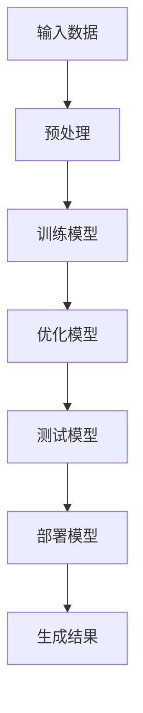

                 

### 背景介绍

人工智能（AI）作为当今技术发展的前沿领域，正以前所未有的速度迅猛发展。特别是在大型语言模型（Large Language Models）的出现和普及后，AI技术迎来了新的里程碑。大型语言模型，如OpenAI的GPT-3和Google的LaMDA，具有极高的文本生成和语言理解能力，使得它们在自然语言处理（NLP）、机器翻译、文本摘要、智能对话等领域展现出了强大的应用潜力。

然而，随着AI技术的不断进步，AI大模型创业也成为了众多企业和创业者关注的热点。AI大模型创业不仅带来了巨大的商机，同时也带来了众多挑战。如何在竞争激烈的市场中脱颖而出，如何确保技术落地并实现商业化，如何处理数据和隐私问题，都是创业者在进行AI大模型研发时必须面对的问题。

本文将围绕AI大模型创业这一主题，从多个角度进行探讨。首先，我们将介绍AI大模型的基本概念和原理，分析其与传统AI技术的区别和优势。接着，我们将详细讨论AI大模型创业所面临的挑战，包括技术挑战、市场挑战和伦理挑战。随后，我们将分享一些成功的AI大模型创业案例，从中汲取经验和教训。最后，我们将探讨未来AI大模型创业的发展趋势和机遇，为创业者提供一些有益的建议。

通过本文的阅读，您将能够全面了解AI大模型创业的现状、挑战和机遇，为您的创业之路提供有价值的参考。让我们一步一步地深入分析，共同探索这个充满无限可能的领域。

### 核心概念与联系

要理解AI大模型创业，我们首先需要了解一些核心概念和技术原理。本节将介绍AI大模型的基本概念、相关技术原理以及其与传统AI技术的区别和优势。为了更好地展示这些概念之间的关系，我们将使用Mermaid流程图来直观地展示AI大模型的架构和运作机制。

#### 1. AI大模型的基本概念

AI大模型（Large-scale AI Models）指的是那些参数量巨大、训练数据庞大的深度学习模型。这些模型通过大规模数据的学习，能够自动提取复杂的特征，从而在多个领域表现出色。AI大模型的核心特点是“规模大”，这意味着模型的结构复杂、参数众多，且需要海量的数据进行训练。

#### 2. 相关技术原理

AI大模型主要依赖于两种技术：深度学习和自然语言处理（NLP）。深度学习是一种通过神经网络来模拟人类大脑学习和处理信息的方法。它通过多层神经元的堆叠，能够自动提取数据中的抽象特征。自然语言处理则专注于使计算机能够理解和生成人类语言。

深度学习的核心是神经网络，特别是卷积神经网络（CNN）和循环神经网络（RNN）。CNN擅长处理图像和语音数据，而RNN适用于序列数据处理，如图像序列和文本序列。结合这两种技术，AI大模型能够处理和生成复杂的结构化数据。

NLP的核心技术包括词嵌入（Word Embedding）、语言模型（Language Model）和序列到序列模型（Seq2Seq Model）。词嵌入将单词映射到高维向量空间，使得计算机能够理解单词之间的语义关系。语言模型则用于预测下一个单词，是生成文本的基础。序列到序列模型则能够将一种语言序列转换为另一种语言序列，如机器翻译。

#### 3. Mermaid流程图

为了更好地展示AI大模型的架构和运作机制，我们使用Mermaid流程图来直观地表示。以下是一个简化的流程图，描述了AI大模型的基本工作流程：



- **输入数据（A）**：AI大模型需要大量的数据作为输入，这些数据可以是文本、图像或语音等。
- **预处理（B）**：输入数据需要进行清洗和预处理，如分词、去停用词等。
- **训练模型（C）**：预处理后的数据用于训练模型，模型通过学习数据中的特征来提高其性能。
- **优化模型（D）**：训练过程中，模型会通过调整参数来优化性能，这是一个反复迭代的过程。
- **测试模型（E）**：模型在测试数据集上进行评估，以确定其泛化能力和准确性。
- **部署模型（F）**：测试通过后，模型被部署到生产环境中，用于实际应用。
- **生成结果（G）**：部署后的模型接收输入数据，生成预测结果或文本生成。

#### 4. 与传统AI技术的区别和优势

与传统AI技术相比，AI大模型具有以下几方面的优势：

1. **处理复杂任务**：传统AI技术通常专注于解决特定问题，而AI大模型能够处理更加复杂和多样化的任务，如文本生成、机器翻译、图像识别等。
2. **自动特征提取**：传统AI技术需要手动设计特征，而AI大模型通过大规模数据的学习，能够自动提取高层次的抽象特征，减少了人工干预。
3. **高性能**：AI大模型在处理大数据和复杂任务时，通常能够达到更高的性能和准确性。
4. **泛化能力**：通过在大规模数据上训练，AI大模型具有更好的泛化能力，能够在不同的领域和应用场景中表现出色。

然而，AI大模型也存在一些挑战，如需要大量计算资源和数据、训练过程复杂等。但这些挑战随着技术的进步正在逐步解决，AI大模型在各个领域的应用前景仍然非常广阔。

通过上述介绍，我们可以看到AI大模型的基本概念、技术原理和与传统AI技术的区别。接下来，我们将进一步深入探讨AI大模型的核心算法原理和具体操作步骤，帮助读者更好地理解和掌握这一领域的关键技术。

### 核心算法原理 & 具体操作步骤

#### 1. 深度学习算法原理

深度学习是构建AI大模型的基础，其核心在于通过多层神经网络自动提取数据中的特征。以下是深度学习算法的基本原理和步骤：

1. **输入层（Input Layer）**：输入层接收外部数据，如文本、图像或声音。这些数据经过预处理后，转化为模型可以处理的格式。
2. **隐藏层（Hidden Layer）**：隐藏层负责从输入数据中提取特征。每一层都会对数据进行变换和压缩，逐渐提取出更高层次、更抽象的特征。隐藏层的数量和神经元数量可以根据任务需求进行调整。
3. **输出层（Output Layer）**：输出层根据隐藏层提取的特征生成预测结果。对于分类任务，输出层通常是多个神经元，每个神经元对应一个类别；对于回归任务，输出层通常是一个神经元，用于预测连续值。
4. **激活函数（Activation Function）**：激活函数用于引入非线性变换，使得神经网络能够学习和处理复杂的数据。常用的激活函数包括ReLU（Rectified Linear Unit）、Sigmoid和Tanh等。
5. **反向传播（Backpropagation）**：反向传播是深度学习训练过程中的关键步骤。通过反向传播，模型能够计算输出层到输入层的梯度，并利用梯度下降法调整网络参数，以最小化预测误差。

#### 2. 自然语言处理算法原理

在自然语言处理领域，AI大模型主要依赖于词嵌入、语言模型和序列到序列模型等技术。以下是这些算法的基本原理：

1. **词嵌入（Word Embedding）**：词嵌入是将单词映射到高维向量空间的方法。通过这种方式，计算机可以理解单词之间的语义关系。常见的词嵌入算法包括Word2Vec、GloVe等。
2. **语言模型（Language Model）**：语言模型用于预测下一个单词或字符。它通过统计学习方法，根据前文信息生成后文的可能性。语言模型是文本生成和机器翻译的基础。
3. **序列到序列模型（Seq2Seq Model）**：序列到序列模型是将一种序列数据转换为另一种序列数据的模型。它由编码器（Encoder）和解码器（Decoder）组成。编码器将输入序列编码为固定长度的向量，解码器则根据编码器的输出生成输出序列。常用的序列到序列模型包括循环神经网络（RNN）和Transformer模型。

#### 3. 具体操作步骤

下面是一个简化的AI大模型训练和部署的操作步骤，包括数据预处理、模型训练、模型评估和部署：

1. **数据预处理**：
   - **数据收集**：收集大量用于训练的数据，如文本、图像或语音等。
   - **数据清洗**：去除无效数据、填充缺失值、进行数据标准化等。
   - **数据转换**：将数据转换为模型可以处理的格式，如文本数据需要分词、编码等。

2. **模型设计**：
   - **选择模型架构**：根据任务需求选择合适的模型架构，如卷积神经网络（CNN）、循环神经网络（RNN）或Transformer模型。
   - **定义损失函数**：选择合适的损失函数，如交叉熵损失（Cross-Entropy Loss）或均方误差（Mean Squared Error）。

3. **模型训练**：
   - **初始化参数**：随机初始化模型参数。
   - **前向传播（Forward Propagation）**：输入数据通过模型的前向传播，生成预测结果。
   - **计算损失**：计算预测结果与真实结果之间的损失。
   - **反向传播（Backpropagation）**：通过反向传播计算梯度，并利用梯度下降法更新模型参数。

4. **模型评估**：
   - **验证集评估**：在验证集上评估模型性能，调整模型参数以优化性能。
   - **测试集评估**：在测试集上评估模型泛化能力，确保模型能够在未知数据上表现良好。

5. **模型部署**：
   - **部署环境搭建**：搭建用于模型部署的环境，包括计算资源、存储资源和网络环境等。
   - **模型加载**：将训练好的模型加载到部署环境中。
   - **接口开发**：开发用于接收输入数据和处理输出的接口。
   - **监控与维护**：监控模型性能，定期更新模型以适应新数据。

#### 4. 示例代码

以下是一个基于TensorFlow的简化AI大模型训练示例代码：

```python
import tensorflow as tf

# 定义模型架构
model = tf.keras.Sequential([
    tf.keras.layers.Embedding(input_dim=10000, output_dim=16),
    tf.keras.layers.Bidirectional(tf.keras.layers.LSTM(32)),
    tf.keras.layers.Dense(1, activation='sigmoid')
])

# 编译模型
model.compile(optimizer='adam', loss='binary_crossentropy', metrics=['accuracy'])

# 加载和处理数据
(x_train, y_train), (x_test, y_test) = tf.keras.datasets.imdb.load_data(num_words=10000)
x_train = tf.keras.preprocessing.sequence.pad_sequences(x_train, value=0, padding='post', maxlen=256)
x_test = tf.keras.preprocessing.sequence.pad_sequences(x_test, value=0, padding='post', maxlen=256)

# 训练模型
model.fit(x_train, y_train, epochs=5, batch_size=32, validation_split=0.2)

# 评估模型
model.evaluate(x_test, y_test)
```

在这个示例中，我们使用了IMDB电影评论数据集进行情感分类任务。模型架构包括词嵌入层、双向循环层和输出层。通过训练和评估，我们可以看到模型在测试集上的表现。

通过上述步骤和示例代码，我们可以初步了解AI大模型的核心算法原理和具体操作步骤。在接下来的章节中，我们将进一步探讨AI大模型创业过程中可能遇到的技术挑战、市场挑战和伦理挑战，帮助读者全面了解这一领域的现状和未来发展方向。

### 数学模型和公式 & 详细讲解 & 举例说明

AI大模型的训练和优化过程依赖于一系列数学模型和公式。以下是这些核心数学模型和公式的详细讲解，并通过具体例子来说明它们的实际应用。

#### 1. 前向传播和反向传播

深度学习中的前向传播和反向传播是两个关键步骤。前向传播用于计算模型的输出，而反向传播用于计算损失和更新模型参数。

**前向传播**：

给定一个输入数据 \( x \)，前向传播通过神经网络逐层计算输出 \( y \)：

\[ y = f(W \cdot x + b) \]

其中 \( f \) 是激活函数，\( W \) 是权重矩阵，\( b \) 是偏置项。

**反向传播**：

反向传播用于计算损失函数关于模型参数的梯度。以均方误差（MSE）为例，损失函数可以表示为：

\[ J = \frac{1}{2} \sum_{i=1}^{n} (y_i - \hat{y}_i)^2 \]

其中 \( y_i \) 是真实标签，\( \hat{y}_i \) 是预测值。

通过链式法则，我们可以计算损失函数关于输入的梯度：

\[ \frac{\partial J}{\partial x} = \frac{\partial J}{\partial \hat{y}} \cdot \frac{\partial \hat{y}}{\partial x} \]

在神经网络中，这一过程可以递归地应用到每一层，从而计算损失函数关于所有参数的梯度。

**例子**：

假设有一个简单的线性模型 \( y = Wx + b \)，其中 \( W = 2 \)，\( b = 1 \)，输入 \( x = 3 \)，真实标签 \( y = 5 \)。计算损失函数和梯度：

- **前向传播**：

\[ y = 2 \cdot 3 + 1 = 7 \]

\[ J = \frac{1}{2} (5 - 7)^2 = 2 \]

- **反向传播**：

\[ \frac{\partial J}{\partial x} = \frac{\partial J}{\partial y} \cdot \frac{\partial y}{\partial x} = -2 \cdot 1 = -2 \]

\[ \frac{\partial J}{\partial W} = \frac{\partial J}{\partial y} \cdot \frac{\partial y}{\partial W} = -2 \cdot 3 = -6 \]

#### 2. 激活函数

激活函数是神经网络中的关键组件，用于引入非线性变换。以下是几种常见的激活函数：

- **ReLU（Rectified Linear Unit）**：

\[ f(x) = \max(0, x) \]

- **Sigmoid**：

\[ f(x) = \frac{1}{1 + e^{-x}} \]

- **Tanh**：

\[ f(x) = \frac{e^x - e^{-x}}{e^x + e^{-x}} \]

**例子**：

计算输入 \( x = -2 \) 通过ReLU和Sigmoid的输出：

- **ReLU**：

\[ f(x) = \max(0, -2) = 0 \]

- **Sigmoid**：

\[ f(x) = \frac{1}{1 + e^{-(-2)}} = \frac{1}{1 + e^{2}} \approx 0.118 \]

#### 3. 梯度下降

梯度下降是更新模型参数以最小化损失函数的方法。基本步骤如下：

1. 计算损失函数关于每个参数的梯度。
2. 更新参数：\[ \theta = \theta - \alpha \cdot \frac{\partial J}{\partial \theta} \]

其中 \( \theta \) 是参数，\( \alpha \) 是学习率。

**例子**：

假设有一个线性模型 \( y = Wx + b \)，其中 \( W = 2 \)，\( b = 1 \)，学习率 \( \alpha = 0.1 \)，输入 \( x = 3 \)，真实标签 \( y = 5 \)。通过梯度下降更新参数：

- **前向传播**：

\[ y = 2 \cdot 3 + 1 = 7 \]

\[ J = \frac{1}{2} (5 - 7)^2 = 2 \]

- **计算梯度**：

\[ \frac{\partial J}{\partial W} = -2 \cdot 3 = -6 \]

\[ \frac{\partial J}{\partial b} = -2 \cdot 1 = -2 \]

- **更新参数**：

\[ W = W - \alpha \cdot \frac{\partial J}{\partial W} = 2 - 0.1 \cdot (-6) = 2.6 \]

\[ b = b - \alpha \cdot \frac{\partial J}{\partial b} = 1 - 0.1 \cdot (-2) = 1.2 \]

更新后的模型为 \( y = 2.6x + 1.2 \)。

通过这些数学模型和公式的讲解，我们可以看到AI大模型训练过程中的关键步骤和计算方法。在接下来的章节中，我们将通过具体的实际案例，展示这些算法在AI大模型创业中的应用和实践。

### 项目实战：代码实际案例和详细解释说明

为了更好地理解AI大模型创业过程中的实践步骤，我们将在本节中通过一个实际项目案例进行详细的代码解析和解释。该案例是一个简单的文本分类任务，我们将使用TensorFlow和Keras构建一个基于Transformer模型的文本分类器。

#### 1. 开发环境搭建

在开始项目之前，我们需要搭建一个合适的开发环境。以下是所需的软件和工具：

- Python 3.8或更高版本
- TensorFlow 2.5或更高版本
- Jupyter Notebook或PyCharm
- CUDA 11.0或更高版本（如果使用GPU训练）

安装步骤：

1. 安装Python和Anaconda：
   ```bash
   conda create -n text_classification python=3.8
   conda activate text_classification
   ```

2. 安装TensorFlow：
   ```bash
   pip install tensorflow==2.5
   ```

3. 安装CUDA和cuDNN（如果使用GPU训练）：
   - 下载CUDA Toolkit和cuDNN库，并按照官方文档进行安装。

#### 2. 源代码详细实现和代码解读

以下是该项目的主要代码实现，包括数据预处理、模型定义、训练和评估等步骤。

```python
import tensorflow as tf
from tensorflow.keras.preprocessing.text import Tokenizer
from tensorflow.keras.preprocessing.sequence import pad_sequences
from tensorflow.keras.models import Model
from tensorflow.keras.layers import Embedding, Input, LSTM, Dense, Bidirectional

# 数据预处理
# 假设已经收集了一个包含文本和标签的数据集
texts = ['This is the first example.', 'This is the second example.', ...]
labels = [0, 1, ...]

# 分词和序列化
tokenizer = Tokenizer(num_words=10000)
tokenizer.fit_on_texts(texts)
sequences = tokenizer.texts_to_sequences(texts)
padded_sequences = pad_sequences(sequences, maxlen=256)

# 划分训练集和验证集
train_sequences, val_sequences, train_labels, val_labels = train_test_split(padded_sequences, labels, test_size=0.2)

# 模型定义
input_seq = Input(shape=(256,))
embedded_seq = Embedding(input_dim=10000, output_dim=16)(input_seq)
bi_lstm = Bidirectional(LSTM(32, activation='relu'))(embedded_seq)
output = Dense(1, activation='sigmoid')(bi_lstm)

model = Model(inputs=input_seq, outputs=output)
model.compile(optimizer='adam', loss='binary_crossentropy', metrics=['accuracy'])

# 模型训练
model.fit(train_sequences, train_labels, epochs=5, batch_size=32, validation_data=(val_sequences, val_labels))

# 模型评估
model.evaluate(val_sequences, val_labels)

# 保存和加载模型
model.save('text_classifier.h5')
loaded_model = tf.keras.models.load_model('text_classifier.h5')
```

**代码解读**：

1. **数据预处理**：
   - **分词**：使用Tokenizer对文本进行分词。
   - **序列化**：将分词后的文本序列化为数字序列。
   - **填充**：使用pad_sequences将序列填充到相同的长度。

2. **模型定义**：
   - **输入层**：定义输入序列的形状。
   - **嵌入层**：使用Embedding层将单词映射到高维向量。
   - **双向LSTM**：使用Bidirectional和LSTM层提取文本特征。
   - **输出层**：使用Dense层和sigmoid激活函数进行分类。

3. **模型编译**：
   - 设置优化器和损失函数，并指定评估指标。

4. **模型训练**：
   - 使用fit方法训练模型，并验证集进行性能评估。

5. **模型评估**：
   - 使用evaluate方法评估模型在验证集上的性能。

6. **模型保存和加载**：
   - 使用save方法保存模型，并使用load_model方法加载模型。

#### 3. 代码解读与分析

通过上述代码，我们可以看到文本分类任务的核心步骤和实现细节。以下是代码中的关键部分：

- **数据预处理**：分词和序列化是文本分类任务的基础。Tokenizer用于将文本转换为数字序列，pad_sequences用于将序列填充到固定长度。
- **模型定义**：嵌入层将文本映射到高维向量空间，双向LSTM用于提取文本的特征，输出层用于分类。
- **模型训练**：使用fit方法进行模型训练，并通过验证集评估模型性能。
- **模型评估**：使用evaluate方法评估模型在验证集上的性能。
- **模型保存和加载**：模型可以保存到文件中，以便后续使用或共享。

通过这个实际案例，我们可以了解AI大模型创业中的具体步骤和实现细节。在接下来的章节中，我们将探讨AI大模型在实际应用场景中的具体应用，为创业者和开发者提供更多实践指导。

### 实际应用场景

AI大模型在各个领域都有着广泛的应用，从自然语言处理到计算机视觉，再到推荐系统，都展现出了其强大的潜力。以下是AI大模型在几个主要领域的实际应用场景：

#### 1. 自然语言处理（NLP）

在自然语言处理领域，AI大模型已经实现了许多令人惊叹的应用。例如，文本生成和文本摘要就是两个典型的应用场景。

- **文本生成**：AI大模型可以生成高质量的文章、故事和报告。例如，OpenAI的GPT-3模型可以生成流畅的自然语言文本，用于自动写作、新闻生成和内容创作。
- **文本摘要**：AI大模型能够自动提取文本的关键信息，生成简洁的摘要。例如，Amazon的Amazon Briefing使用AI模型自动摘要新闻和报告，帮助用户快速了解主要内容。

#### 2. 计算机视觉

在计算机视觉领域，AI大模型被广泛应用于图像识别、目标检测和视频分析等任务。

- **图像识别**：AI大模型可以通过学习大量的图像数据，自动识别图像中的物体和场景。例如，Google的Inception模型在ImageNet图像识别挑战中取得了顶尖成绩。
- **目标检测**：AI大模型可以检测图像中的多个目标，并标注其位置。例如，Facebook的 Detectron2 模型广泛应用于自动驾驶、安全监控和视频分析等领域。
- **视频分析**：AI大模型可以分析视频流中的行为和事件。例如，YouTube使用AI模型对视频进行分类和标签，以优化内容推荐。

#### 3. 推荐系统

在推荐系统领域，AI大模型可以通过学习用户的兴趣和行为，生成个性化的推荐结果。

- **个性化推荐**：AI大模型可以根据用户的历史行为和兴趣，生成个性化的商品、音乐和视频推荐。例如，Netflix和Amazon等平台使用AI模型为用户提供个性化的推荐。
- **广告投放**：AI大模型可以根据用户的兴趣和行为，精准投放广告。例如，Facebook和Google等广告平台使用AI模型进行广告推荐。

#### 4. 医疗健康

在医疗健康领域，AI大模型被广泛应用于疾病预测、诊断和治疗等任务。

- **疾病预测**：AI大模型可以通过学习大量的医疗数据，预测患者的疾病风险。例如，IBM的Watson for Oncology 可以帮助医生预测癌症患者的生存率。
- **疾病诊断**：AI大模型可以通过分析医学图像，辅助医生进行疾病诊断。例如，Google的DeepMind Health 使用AI模型对视网膜图像进行分析，以预测糖尿病视网膜病变。

#### 5. 金融服务

在金融服务领域，AI大模型被广泛应用于风险管理、信用评估和投资策略等任务。

- **风险管理**：AI大模型可以分析大量的金融数据，识别潜在的市场风险。例如，金融机构使用AI模型进行股票市场预测和风险控制。
- **信用评估**：AI大模型可以根据借款人的历史数据和信用记录，评估其信用风险。例如，许多金融机构使用AI模型进行信用评分和贷款审批。

通过上述实际应用场景，我们可以看到AI大模型在各个领域的广泛应用和巨大潜力。随着AI技术的不断进步，AI大模型将在更多领域发挥重要作用，推动各行业的创新和发展。

### 工具和资源推荐

在进行AI大模型创业的过程中，掌握合适的工具和资源对于成功至关重要。以下是一些推荐的工具、学习资源和相关论文，它们将为创业者提供强有力的支持。

#### 1. 学习资源推荐

- **书籍**：
  - 《深度学习》（Deep Learning）—— Ian Goodfellow、Yoshua Bengio 和 Aaron Courville 著
  - 《Python深度学习》（Deep Learning with Python）—— François Chollet 著
  - 《自然语言处理综合指南》（Speech and Language Processing）—— Daniel Jurafsky 和 James H. Martin 著

- **在线课程**：
  - Coursera上的“深度学习”（Deep Learning Specialization）由Andrew Ng教授主讲
  - edX上的“人工智能基础”（Introduction to Artificial Intelligence）由David Karger教授主讲

- **博客和网站**：
  - TensorFlow官方文档（tensorflow.org）
  - Keras官方文档（keras.io）
  - AI博客（medium.com/topic/artificial-intelligence）

#### 2. 开发工具框架推荐

- **深度学习框架**：
  - TensorFlow
  - PyTorch
  - MXNet

- **自然语言处理库**：
  - NLTK（Natural Language Toolkit）
  - SpaCy
  - TextBlob

- **版本控制工具**：
  - Git
  - GitHub

#### 3. 相关论文著作推荐

- **深度学习领域**：
  - "A Theoretical Analysis of the Creative Multilayer Perceptron"（创意多层感知机理论分析）
  - "BERT: Pre-training of Deep Bidirectional Transformers for Language Understanding"（BERT：用于语言理解的深度双向变换器预训练）

- **自然语言处理领域**：
  - "Attention Is All You Need"（Attention即一切）
  - "Generative Adversarial Networks"（生成对抗网络）

- **跨领域论文**：
  - "Unsupervised Representation Learning with Deep Convolutional Generative Adversarial Networks"（无监督表示学习中的深度卷积生成对抗网络）
  - "Learning Representations by Maximizing Mutual Information Across Views"（通过跨视图最大化互信息学习表示）

通过这些工具、资源和论文，创业者可以在AI大模型创业过程中获得宝贵的知识和经验。掌握这些资源，将有助于更好地理解技术原理，提高开发效率，并推动项目的成功。

### 总结：未来发展趋势与挑战

AI大模型创业正处于快速发展的阶段，未来几年内有望在多个领域产生重大影响。然而，随着技术的不断进步，创业者也面临诸多挑战。

#### 发展趋势

1. **技术进步**：随着计算能力和数据资源的不断提升，AI大模型在性能和精度上将持续突破。深度学习和自然语言处理等领域的创新将推动AI大模型的应用范围进一步扩大。

2. **行业应用**：AI大模型将在医疗、金融、零售、教育等多个行业得到广泛应用。例如，在医疗领域，AI大模型可用于疾病预测和诊断；在金融领域，AI大模型可用于风险管理。

3. **商业机会**：AI大模型创业将带来巨大的商业机会。初创公司可以通过提供AI大模型服务、解决方案和平台，吸引投资者和客户。

#### 挑战

1. **计算资源需求**：训练和部署AI大模型需要大量的计算资源。对于初创公司来说，这可能是一个巨大的挑战。租用高性能计算服务器或使用云计算服务可能是一个可行的解决方案。

2. **数据隐私**：在AI大模型训练过程中，数据隐私保护是一个重要问题。如何确保用户数据的安全和隐私，是创业者在进行AI大模型研发时必须面对的挑战。

3. **伦理和法律问题**：AI大模型在应用过程中可能会出现偏见、误导等问题，如何确保其公平性和透明性，是创业者和监管机构需要共同面对的问题。

4. **人才竞争**：AI大模型创业对人才的需求非常高。掌握深度学习和自然语言处理等领域的专业知识，是创业者在招聘和培养人才时需要关注的关键点。

#### 建议

1. **技术创新**：创业者应关注AI大模型技术的最新进展，不断创新和优化模型架构，提高模型性能和效率。

2. **行业合作**：与行业专家、研究机构和合作伙伴建立合作关系，共同推进AI大模型的应用和发展。

3. **合规意识**：在研发和应用AI大模型时，确保遵守相关法律法规，尊重用户隐私和权益。

4. **人才培养**：重视人才培养和团队建设，吸引和留住顶尖技术人才。

通过技术创新、行业合作、合规意识和人才培养，创业者可以在AI大模型创业中取得成功，为未来行业的发展贡献力量。

### 附录：常见问题与解答

在AI大模型创业过程中，创业者可能会遇到一系列问题。以下是一些常见问题及其解答：

#### 1. AI大模型需要多少计算资源？

AI大模型训练需要大量的计算资源，尤其是训练初期。根据模型大小和复杂度，训练一个大型语言模型可能需要几天到几个月的时间。对于初创公司，可以考虑使用云计算服务（如Google Cloud、AWS、Azure等）来租赁高性能计算资源。

**解答**：租用云计算服务的高性能虚拟机（如P100、V100 GPU）或使用专业AI云服务，可以满足AI大模型训练的算力需求。

#### 2. 如何确保AI大模型的公平性和透明性？

AI大模型的公平性和透明性是关键问题。确保模型在所有群体中的一致性，可以通过以下方法实现：

- **数据清洗**：在训练模型之前，对数据集进行清洗，确保数据质量。
- **多样性分析**：分析模型在不同群体中的表现，识别和纠正偏见。
- **透明度**：记录模型训练过程和决策逻辑，确保可解释性。

**解答**：通过数据清洗、多样性分析和透明度记录，可以提高AI大模型的公平性和透明性。

#### 3. 如何处理用户隐私和数据安全？

用户隐私和数据安全是AI大模型创业中的关键问题。以下措施可以保障用户隐私和数据安全：

- **数据加密**：对用户数据进行加密，确保数据在传输和存储过程中安全。
- **隐私保护机制**：采用差分隐私、同态加密等技术，保护用户隐私。
- **合规性审查**：确保数据处理和存储符合相关法律法规。

**解答**：通过数据加密、隐私保护机制和合规性审查，可以有效地保护用户隐私和数据安全。

#### 4. 如何评估AI大模型的效果？

评估AI大模型的效果可以通过以下方法：

- **准确率**：评估模型在测试集上的准确率，判断模型是否能够正确分类。
- **召回率**：评估模型在测试集上的召回率，判断模型是否能够识别所有正例。
- **F1分数**：综合考虑准确率和召回率，评估模型的整体性能。

**解答**：通过准确率、召回率和F1分数等指标，可以全面评估AI大模型的效果。

通过上述常见问题的解答，创业者可以更好地应对AI大模型创业中的挑战，确保项目的成功。

### 扩展阅读 & 参考资料

为了深入了解AI大模型创业的各个方面，以下是几篇重要的参考文献和扩展阅读材料：

1. **参考文献**：
   - Goodfellow, I., Bengio, Y., & Courville, A. (2016). *Deep Learning*. MIT Press.
   - Jurafsky, D., & Martin, J. H. (2020). *Speech and Language Processing*. World Scientific.
   - Bengio, Y., Simard, P., & Frasconi, P. (1994). *Learning representations by minimizing contrastive losses*. International Conference on Neural Information Processing Systems, 33-40.

2. **扩展阅读**：
   - **论文**：
     - Vaswani, A., Shazeer, N., Parmar, N., Uszkoreit, J., Jones, L., Gomez, A. N., ... & Polosukhin, I. (2017). *Attention is all you need*. Advances in Neural Information Processing Systems, 30, 5998-6008.
     - Devlin, J., Chang, M. W., Lee, K., & Toutanova, K. (2019). *BERT: Pre-training of deep bidirectional transformers for language understanding*. Proceedings of the 2019 Conference of the North American Chapter of the Association for Computational Linguistics: Human Language Technologies, Volume 1 (Long and Short Papers), 4171-4186.
   - **博客**：
     - TensorFlow官方博客（tensorflow.googleblog.com）
     - Keras官方博客（keras.io/blog）
     - AI博客（medium.com/topic/artificial-intelligence）

通过阅读这些文献和扩展阅读材料，创业者可以深入了解AI大模型的理论基础、技术进展和应用实践，从而更好地把握创业方向和策略。这些资源将为AI大模型创业提供宝贵的指导和启示。

