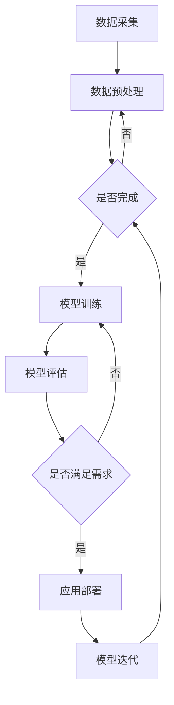

                 

### 背景介绍

近年来，随着人工智能技术的飞速发展，特别是大规模预训练模型（如GPT-3、BERT等）的广泛应用，AI大模型成为了学术界和工业界研究的热点。AI大模型在自然语言处理、计算机视觉、语音识别等领域展现出强大的能力，推动了各行业的技术创新和业务变革。在这个背景下，AI大模型创业也成为越来越多创业者关注的领域。

AI大模型创业涉及到多个层面，包括模型研发、数据采集、算法优化、模型部署等。创业者需要具备深厚的专业知识、丰富的实践经验以及对行业趋势的敏锐洞察力。本文将围绕AI大模型创业的挑战与机遇，进行深入探讨和分析。

本文结构如下：

1. 背景介绍
2. 核心概念与联系
3. 核心算法原理与具体操作步骤
4. 数学模型和公式与详细讲解与举例说明
5. 项目实战：代码实际案例与详细解释说明
6. 实际应用场景
7. 工具和资源推荐
8. 总结：未来发展趋势与挑战
9. 附录：常见问题与解答
10. 扩展阅读与参考资料

通过本文的阅读，读者将全面了解AI大模型创业的现状、关键技术和实践应用，为未来投身这一领域提供有益的参考和指导。

### 文章关键词

- AI大模型
- 创业
- 预训练模型
- 自然语言处理
- 计算机视觉
- 语音识别
- 挑战
- 机遇
- 核心算法
- 数学模型
- 项目实战
- 实际应用场景
- 工具与资源

### 文章摘要

本文深入探讨了AI大模型创业的现状，分析了其面临的挑战和机遇。首先，介绍了AI大模型的发展背景和核心概念，随后详细阐述了AI大模型的核心算法原理和数学模型。接着，通过实际项目案例，展示了AI大模型在开发环境搭建、代码实现与分析中的应用。文章还探讨了AI大模型在各个领域的实际应用场景，并推荐了相关学习资源和开发工具。最后，总结了未来AI大模型创业的发展趋势和面临的挑战，为创业者提供了有价值的指导和建议。本文旨在为从事AI大模型创业的读者提供系统性、实用性的知识框架，助力他们在这一领域取得成功。

### 1. 背景介绍

AI大模型，通常指的是那些拥有数十亿、数百亿参数规模的人工神经网络模型，这些模型在训练时需要大量数据和高性能计算资源。其起源可以追溯到深度学习技术的发展，尤其是2012年AlexNet在ImageNet比赛中的突破性表现，标志着深度学习在计算机视觉领域取得了历史性的进展。随着计算能力的提升和海量数据的积累，AI大模型逐渐成为人工智能研究中的核心方向。

AI大模型的发展历程可以分为几个重要阶段：

1. **早期探索阶段**（2012-2014）：以AlexNet、VGG、GoogleNet等模型为代表，深度学习在图像识别领域取得显著成果。
2. **快速增长阶段**（2015-2017）：随着ResNet、Inception等模型的提出，深度学习在图像、语音、自然语言处理等领域得到广泛应用。
3. **大规模预训练阶段**（2018至今）：以GPT、BERT等为代表的大规模预训练模型的出现，标志着AI大模型进入一个全新的阶段。这些模型不仅在性能上取得了巨大突破，而且在实际应用中展现出强大的泛化能力和适应性。

在AI大模型的发展过程中，几个关键事件和里程碑具有重要意义：

1. **GPT-3的发布**：OpenAI在2020年推出的GPT-3，拥有1750亿参数，是当时最大的语言模型，引起了广泛关注。GPT-3展示了AI大模型在自然语言处理领域前所未有的能力，包括文本生成、翻译、问答等。
2. **BERT的推出**：Google在2018年推出的BERT（Bidirectional Encoder Representations from Transformers），通过双向注意力机制在多个自然语言处理任务中取得了卓越表现。BERT的成功推动了大规模预训练模型在自然语言处理领域的广泛应用。

AI大模型的兴起不仅推动了人工智能技术的进步，也为各行业带来了深刻的影响。在自然语言处理领域，AI大模型实现了更高水平的文本生成、理解和推理能力，提升了人机交互的体验。在计算机视觉领域，AI大模型在图像识别、目标检测、图像生成等方面取得了显著突破，推动了图像识别技术的广泛应用。在语音识别领域，AI大模型通过结合深度神经网络和循环神经网络，实现了更高的语音识别准确率和实时性。

此外，AI大模型的应用不仅仅局限于计算机视觉、自然语言处理和语音识别，还在推荐系统、金融风控、医疗诊断等领域展现出巨大的潜力。例如，推荐系统利用AI大模型进行用户行为分析和内容推荐，实现了个性化推荐的精度和效率提升；金融风控通过AI大模型进行大数据分析，提高了风险识别和防范能力；医疗诊断利用AI大模型对医学影像进行分析，辅助医生进行诊断和治疗。

总的来说，AI大模型的发展历程和技术突破为人工智能领域带来了革命性的变化。随着AI大模型在各个领域的深入应用，其对社会的变革和影响也将越来越显著。AI大模型创业不仅是一个技术挑战，更是一个充满机遇的领域，吸引了大量创业者和研究者的关注。接下来，本文将深入探讨AI大模型创业的核心概念、算法原理、数学模型以及实际应用，为读者提供更全面的视角和理解。

### 2. 核心概念与联系

#### 2.1 人工智能（AI）

人工智能（Artificial Intelligence，简称AI）是计算机科学的一个重要分支，旨在研究如何模拟和扩展人类的智能。人工智能可以分为几种类型，包括：

1. **弱AI**：也称为窄AI，这种AI系统在特定任务上表现出智能，但不能泛化到其他任务。例如，语音识别系统和图像识别系统。
2. **强AI**：具备广泛智能的AI，能够像人类一样进行思考、学习、解决问题和决策。目前，强AI还处于理论阶段，尚未实现。
3. **自然语言处理（NLP）**：专注于使计算机能够理解、生成和处理人类语言的技术。NLP是AI的一个重要应用领域。
4. **计算机视觉**：涉及使计算机能够“看到”和理解图像和视频内容的技术。计算机视觉在自动驾驶、安全监控和医疗诊断等领域有广泛应用。

#### 2.2 深度学习（Deep Learning）

深度学习是AI的一个重要分支，其核心是多层神经网络。深度学习通过模仿人类大脑的工作方式，使用大量数据来训练模型，从而自动从数据中学习特征和模式。

1. **神经网络（Neural Networks）**：是一种计算模型，由大量相互连接的节点（或“神经元”）组成。这些节点通过学习数据中的特征和关系，进行复杂的计算和决策。
2. **卷积神经网络（CNN）**：特别适用于处理图像数据。通过卷积操作，CNN能够提取图像中的特征，并在多个层次上对特征进行组合和抽象。
3. **循环神经网络（RNN）**：适合处理序列数据，如文本和语音。RNN通过其循环结构，能够捕捉序列中的长期依赖关系。
4. **Transformer模型**：是近年来在自然语言处理领域取得突破性进展的一种模型。其核心是自注意力机制，能够有效地处理长文本和序列数据。

#### 2.3 预训练模型（Pre-trained Models）

预训练模型是一种新兴的方法，通过在大规模数据集上预训练一个通用模型，然后将其应用于特定的任务。这种方法的主要优势是能够在较少的数据和标记数据下，实现良好的性能。

1. **预训练步骤**：首先在大规模数据集上训练一个通用的模型，如GPT、BERT等，这些模型拥有数十亿个参数，能够在各种任务中表现出强大的泛化能力。
2. **微调（Fine-tuning）**：在特定任务上，使用少量数据对预训练模型进行微调，使其适应具体任务。这种方法极大地提高了模型的性能和效率。

#### 2.4 大规模预训练模型

大规模预训练模型是指拥有数十亿、数百亿参数的神经网络模型。这些模型通常在大规模数据集上进行训练，需要大量的计算资源和时间。

1. **GPT-3**：由OpenAI开发的GPT-3模型，拥有1750亿个参数，是当时最大的语言模型。GPT-3展示了预训练模型在自然语言处理领域的强大能力。
2. **BERT**：由Google开发的BERT模型，通过双向注意力机制，在多个自然语言处理任务中取得了卓越表现。BERT的成功推动了预训练模型在自然语言处理领域的广泛应用。

#### 2.5 应用场景

AI大模型在多个领域展现出强大的应用潜力，包括：

1. **自然语言处理（NLP）**：文本生成、翻译、问答、摘要、情感分析等。
2. **计算机视觉**：图像识别、目标检测、图像生成、视频分析等。
3. **语音识别**：语音识别、语音合成、语音转换等。
4. **推荐系统**：个性化推荐、商品推荐、社交网络推荐等。
5. **金融风控**：风险识别、欺诈检测、信用评估等。
6. **医疗诊断**：医学影像分析、疾病预测、药物研发等。

### 2.6 Mermaid 流程图

以下是一个简化的Mermaid流程图，展示AI大模型的基本架构和流程：



- **A. 数据采集**：从各种来源收集数据，如文本、图像、语音等。
- **B. 数据预处理**：对原始数据进行清洗、标注、分割等预处理。
- **C. 是否完成**：检查数据预处理是否完成。
- **D. 模型训练**：使用预处理后的数据进行模型训练。
- **E. 模型评估**：评估模型在测试集上的性能。
- **F. 是否满足需求**：检查模型是否满足应用需求。
- **G. 应用部署**：将训练好的模型部署到实际应用中。
- **H. 模型迭代**：根据应用反馈，对模型进行优化和迭代。

通过以上核心概念和流程图的介绍，我们可以看到AI大模型创业的复杂性和挑战。接下来，我们将深入探讨AI大模型的核心算法原理，了解其是如何运作的。

### 3. 核心算法原理 & 具体操作步骤

AI大模型的核心算法主要基于深度学习技术，特别是基于神经网络的模型。在这一部分，我们将详细探讨深度学习算法的基本原理以及如何实现AI大模型的具体操作步骤。

#### 3.1 深度学习算法基本原理

深度学习算法的核心思想是通过多层神经网络（Neural Networks）来模拟人类大脑的学习过程。神经网络由大量神经元（节点）组成，这些神经元通过加权连接形成网络结构。在训练过程中，神经网络通过学习输入数据和目标输出之间的映射关系，逐步优化网络参数，从而实现从数据中提取特征和进行预测。

深度学习算法主要包括以下几个关键组成部分：

1. **前向传播（Forward Propagation）**：
   - **输入层（Input Layer）**：接收输入数据。
   - **隐藏层（Hidden Layers）**：对输入数据进行处理和特征提取。
   - **输出层（Output Layer）**：生成预测结果。
   - **权重（Weights）**：连接各个神经元的权重参数。
   - **激活函数（Activation Function）**：用于引入非线性因素，使神经网络能够进行复杂的计算和决策。

2. **反向传播（Backpropagation）**：
   - 反向传播是深度学习算法的核心训练机制。它通过计算输出层的误差，逐步反向传播到每一层，更新各层神经元的权重参数，从而优化整个网络。

3. **损失函数（Loss Function）**：
   - 损失函数用于衡量模型的预测结果与真实值之间的差异。常用的损失函数包括均方误差（MSE）、交叉熵（Cross-Entropy）等。

4. **优化算法（Optimization Algorithms）**：
   - 优化算法用于调整网络参数，以最小化损失函数。常用的优化算法包括随机梯度下降（SGD）、Adam等。

#### 3.2 AI大模型的具体操作步骤

实现AI大模型的具体操作步骤可以分为以下几个阶段：

1. **数据收集和预处理**：
   - **数据收集**：从公开数据集或自有数据源收集大量数据。数据来源可以是文本、图像、语音等。
   - **数据预处理**：对原始数据进行清洗、去噪、数据增强等预处理操作，以提高模型训练效果。

2. **模型设计**：
   - **网络架构设计**：设计神经网络的结构，包括层数、每层的神经元数量、激活函数等。
   - **损失函数选择**：根据应用任务选择合适的损失函数。
   - **优化算法选择**：选择适合的优化算法，如Adam、SGD等。

3. **模型训练**：
   - **训练过程**：使用预处理后的数据对模型进行训练。在训练过程中，模型会不断调整权重参数，以最小化损失函数。
   - **超参数调整**：调整学习率、批量大小等超参数，以优化训练过程。

4. **模型评估**：
   - **测试集评估**：使用测试集评估模型的性能，包括准确率、召回率、F1分数等指标。
   - **模型优化**：根据评估结果，对模型进行优化，如调整网络结构、超参数等。

5. **模型部署**：
   - **部署准备**：将训练好的模型部署到实际应用环境中，如云平台、移动设备等。
   - **模型监控**：对部署后的模型进行监控，确保其正常运行和性能稳定。

#### 3.3 具体示例

以下是一个简化的AI大模型训练过程的示例步骤：

1. **数据收集**：
   - 收集100,000张图像数据，包括标签信息。

2. **数据预处理**：
   - 对图像进行缩放、裁剪、翻转等数据增强操作。
   - 将图像数据转换为神经网络可处理的格式。

3. **模型设计**：
   - 设计一个包含卷积层、池化层和全连接层的神经网络。
   - 选择交叉熵作为损失函数。
   - 选择Adam作为优化算法。

4. **模型训练**：
   - 使用预处理后的数据对模型进行训练，每次训练一批图像。
   - 设置学习率为0.001，批量大小为32。
   - 训练200个epoch。

5. **模型评估**：
   - 使用测试集对模型进行评估，计算准确率、召回率和F1分数。
   - 根据评估结果调整模型参数。

6. **模型部署**：
   - 将训练好的模型部署到云平台，供用户使用。

通过以上步骤，我们可以实现一个简单的AI大模型。在实际应用中，模型设计和训练过程会更加复杂，需要考虑更多的细节和优化技巧。

### 4. 数学模型和公式 & 详细讲解 & 举例说明

#### 4.1 基本概念与公式

在讨论AI大模型的数学模型和公式之前，我们需要了解一些基本概念和公式。以下是几个关键概念及其对应的数学公式：

1. **损失函数**：
   - **均方误差（MSE）**：
     $$
     MSE = \frac{1}{n}\sum_{i=1}^{n}(y_i - \hat{y_i})^2
     $$
     其中，$y_i$为真实值，$\hat{y_i}$为预测值，$n$为样本数量。
   - **交叉熵（Cross-Entropy）**：
     $$
     H(y, \hat{y}) = -\sum_{i=1}^{n} y_i \log(\hat{y_i})
     $$
     其中，$y_i$为真实概率分布，$\hat{y_i}$为预测概率分布。

2. **激活函数**：
   - **Sigmoid函数**：
     $$
     \sigma(x) = \frac{1}{1 + e^{-x}}
     $$
   - **ReLU函数**：
     $$
     ReLU(x) = \max(0, x)
     $$
   - **Tanh函数**：
     $$
     \tanh(x) = \frac{e^x - e^{-x}}{e^x + e^{-x}}
     $$

3. **优化算法**：
   - **随机梯度下降（SGD）**：
     $$
     \theta_{t+1} = \theta_t - \alpha \nabla_{\theta_t} J(\theta_t)
     $$
     其中，$\theta_t$为第$t$次迭代的参数，$\alpha$为学习率，$J(\theta_t)$为损失函数。
   - **Adam算法**：
     $$
     m_t = \beta_1 m_{t-1} + (1 - \beta_1) \nabla_{\theta_t} J(\theta_t)
     $$
     $$
     v_t = \beta_2 v_{t-1} + (1 - \beta_2) (\nabla_{\theta_t} J(\theta_t))^2
     $$
     $$
     \theta_{t+1} = \theta_t - \frac{\alpha}{\sqrt{1 - \beta_2^t}(1 - \beta_1^t)} \frac{m_t}{\sqrt{v_t} + \epsilon}
     $$
     其中，$m_t$和$v_t$分别为一阶和二阶矩估计，$\beta_1$和$\beta_2$为指数加权系数，$\alpha$为学习率，$\epsilon$为平滑常数。

#### 4.2 深度学习中的反向传播算法

反向传播算法是深度学习中的核心训练机制，用于计算梯度并更新模型参数。以下是反向传播算法的详细步骤：

1. **前向传播**：
   - 计算各层的输入和输出。
   - 计算输出层的预测值和损失函数。

2. **计算梯度**：
   - 从输出层开始，反向计算各层的梯度。
   - 使用链式法则计算梯度。

3. **更新参数**：
   - 使用梯度更新模型参数。
   - 采用优化算法调整参数。

以下是一个简化的反向传播算法步骤示例：

```
// 前向传播
z2 = X * W1 + b1
a2 = sigmoid(z2)
z3 = a2 * W2 + b2
a3 = sigmoid(z3)
y_pred = softmax(z3)

// 计算损失函数梯度
loss_grad = y - y_pred

// 反向传播计算各层梯度
dZ3 = y_pred - y
dZ2 = dZ3 * W2
dZ1 = dZ2 * W1

// 计算各层参数梯度
dW2 = a2.T.dot(dZ3)
dW1 = X.T.dot(dZ2)
db2 = dZ3.sum(axis=0)
db1 = dZ2.sum(axis=0)

// 更新参数
W2 = W2 - alpha * dW2
W1 = W1 - alpha * dW1
b2 = b2 - alpha * db2
b1 = b1 - alpha * db1
```

#### 4.3 案例说明

为了更好地理解上述数学模型和公式，我们来看一个实际案例。

**案例：使用sigmoid激活函数和均方误差损失函数的神经网络分类问题**

假设我们有一个二分类问题，数据集包含100个样本，每个样本有一个特征$x$和对应的标签$y$（0或1）。

1. **模型设计**：
   - 输入层：1个神经元（特征$x$）。
   - 隐藏层：2个神经元。
   - 输出层：1个神经元（预测概率）。

2. **数据预处理**：
   - 对特征$x$进行标准化处理。

3. **模型训练**：
   - 使用sigmoid激活函数。
   - 使用均方误差（MSE）作为损失函数。
   - 使用随机梯度下降（SGD）进行优化。

4. **训练过程**：
   - 初始化参数$W1, b1, W2, b2$。
   - 在每个epoch中，对每个样本进行前向传播，计算预测值和损失函数。
   - 使用反向传播算法计算梯度。
   - 更新参数。

5. **模型评估**：
   - 使用测试集评估模型性能，计算准确率、召回率和F1分数。

以下是一个简化的训练过程代码示例（使用Python和NumPy库）：

```python
import numpy as np

# 初始化参数
W1 = np.random.randn(1, 2)
b1 = np.random.randn(2)
W2 = np.random.randn(2, 1)
b2 = np.random.randn(1)
alpha = 0.01

# 前向传播
z1 = X
a1 = sigmoid(z1)

z2 = a1 * W1 + b1
a2 = sigmoid(z2)

z3 = a2 * W2 + b2
a3 = sigmoid(z3)

# 反向传播
dZ3 = a3 - y
dZ2 = dZ3 * W2
dZ1 = dZ2 * W1

# 更新参数
dW1 = X.T.dot(dZ1)
dW2 = a1.T.dot(dZ2)
db1 = dZ1.sum(axis=0)
db2 = dZ2.sum(axis=0)

W1 = W1 - alpha * dW1
W2 = W2 - alpha * dW2
b1 = b1 - alpha * db1
b2 = b2 - alpha * db2

# 计算损失函数
loss = MSE(y, a3)

# 打印训练信息
print(f"Epoch: {epoch}, Loss: {loss}")
```

通过这个案例，我们可以看到如何使用数学模型和公式实现一个简单的神经网络分类问题。在实际应用中，模型设计和训练过程会更加复杂，但基本原理和方法是类似的。

### 5. 项目实战：代码实际案例和详细解释说明

#### 5.1 开发环境搭建

要实现一个AI大模型项目，首先需要搭建一个合适的开发环境。以下是搭建过程的详细步骤：

1. **安装Python**：
   - 前往Python官方网站（[https://www.python.org/](https://www.python.org/)）下载并安装Python最新版本。

2. **安装Jupyter Notebook**：
   - 打开终端，执行以下命令安装Jupyter Notebook：
     ```
     pip install notebook
     ```

3. **安装必要的库**：
   - 使用以下命令安装常用库，如NumPy、Pandas、Matplotlib、TensorFlow等：
     ```
     pip install numpy pandas matplotlib tensorflow
     ```

4. **配置TensorFlow GPU支持**（如果使用GPU训练）：
   - 安装CUDA和cuDNN，确保与TensorFlow版本兼容。
   - 编辑`~/.bashrc`文件，添加以下内容：
     ```
     export TF_BINARY_VISIBLE=1
     export CUDA_HOME=/path/to/cuda
     export LD_LIBRARY_PATH=$CUDA_HOME/lib64:$LD_LIBRARY_PATH
     ```
   - 重启终端使配置生效。

5. **创建项目文件夹和文件**：
   - 在合适的位置创建一个项目文件夹，如`ai_project`。
   - 在项目中创建以下文件：
     - `data.py`：用于数据加载和预处理。
     - `model.py`：定义神经网络模型。
     - `train.py`：训练模型。
     - `evaluate.py`：评估模型性能。
     - `main.py`：主程序，用于运行整个项目。

#### 5.2 源代码详细实现和代码解读

以下是一个简单的AI大模型项目示例，包括数据加载、模型定义、训练和评估。我们将详细解释每个部分的代码。

**5.2.1 数据加载和预处理（`data.py`）**

```python
import pandas as pd
from sklearn.model_selection import train_test_split
from tensorflow.keras.utils import to_categorical

def load_data(file_path):
    # 读取数据
    df = pd.read_csv(file_path)
    
    # 分割特征和标签
    X = df.drop('target', axis=1)
    y = df['target']
    
    # 数据标准化
    X_mean = X.mean()
    X_std = X.std()
    X = (X - X_mean) / X_std
    
    # 编码标签
    y = to_categorical(y)
    
    # 划分训练集和测试集
    X_train, X_test, y_train, y_test = train_test_split(X, y, test_size=0.2, random_state=42)
    
    return X_train, X_test, y_train, y_test

X_train, X_test, y_train, y_test = load_data('data.csv')
```

**5.2.2 神经网络模型定义（`model.py`）**

```python
from tensorflow.keras.models import Sequential
from tensorflow.keras.layers import Dense, Dropout

def build_model(input_shape):
    model = Sequential()
    model.add(Dense(64, activation='relu', input_shape=input_shape))
    model.add(Dropout(0.5))
    model.add(Dense(32, activation='relu'))
    model.add(Dropout(0.5))
    model.add(Dense(2, activation='softmax'))
    model.compile(optimizer='adam', loss='categorical_crossentropy', metrics=['accuracy'])
    return model

model = build_model(input_shape=(X_train.shape[1],))
```

**5.2.3 训练模型（`train.py`）**

```python
import numpy as np

def train_model(model, X_train, y_train, X_val, y_val, epochs=100, batch_size=32):
    history = model.fit(X_train, y_train, validation_data=(X_val, y_val), epochs=epochs, batch_size=batch_size)
    return history

history = train_model(model, X_train, y_train, X_test, y_test, epochs=100, batch_size=32)
```

**5.2.4 评估模型性能（`evaluate.py`）**

```python
from sklearn.metrics import classification_report, accuracy_score

def evaluate_model(model, X_test, y_test):
    y_pred = model.predict(X_test)
    y_pred = np.argmax(y_pred, axis=1)
    y_test = np.argmax(y_test, axis=1)
    
    report = classification_report(y_test, y_pred)
    accuracy = accuracy_score(y_test, y_pred)
    
    print("Classification Report:")
    print(report)
    print("Accuracy:", accuracy)

evaluate_model(model, X_test, y_test)
```

**5.2.5 主程序（`main.py`）**

```python
import sys
from data import load_data
from model import build_model
from train import train_model
from evaluate import evaluate_model

def main():
    X_train, X_test, y_train, y_test = load_data('data.csv')
    model = build_model(input_shape=(X_train.shape[1],))
    history = train_model(model, X_train, y_train, X_test, y_test, epochs=100, batch_size=32)
    evaluate_model(model, X_test, y_test)

if __name__ == '__main__':
    main()
```

#### 5.3 代码解读与分析

**5.3.1 数据加载和预处理**

在`data.py`文件中，我们首先从CSV文件中加载数据，然后对特征和标签进行分离。接着，对特征进行标准化处理，以消除不同特征之间的尺度差异。标签被编码为One-Hot向量，以便在训练过程中使用。最后，数据被划分为训练集和测试集，以评估模型的性能。

**5.3.2 神经网络模型定义**

在`model.py`文件中，我们使用Keras库定义了一个简单的神经网络模型。模型包含两个隐藏层，每个隐藏层后跟一个ReLU激活函数和一个Dropout层（用于防止过拟合）。输出层使用softmax激活函数，用于进行多分类。

**5.3.3 训练模型**

在`train.py`文件中，我们使用`fit`方法对模型进行训练。`fit`方法接受训练数据、验证数据、迭代次数和批量大小等参数。训练过程中，模型在训练集和验证集上评估性能，并记录每个epoch的损失和准确性。

**5.3.4 评估模型性能**

在`evaluate.py`文件中，我们使用训练好的模型对测试集进行预测，并计算分类报告和准确性。分类报告提供了每个类别的精确度、召回率和F1分数，而准确性是一个简单的指标，表示模型在测试集上的整体性能。

**5.3.5 主程序**

在`main.py`文件中，我们定义了一个主程序，用于加载数据、构建模型、训练模型和评估模型。主程序通过调用其他模块中的函数来执行这些任务。

通过上述步骤，我们可以搭建一个简单的AI大模型项目，并进行训练和评估。在实际应用中，可能需要调整模型结构、超参数和训练策略，以获得更好的性能。

### 6. 实际应用场景

AI大模型在多个领域展现出了广泛的应用潜力，以下是一些典型的应用场景：

#### 自然语言处理（NLP）

AI大模型在自然语言处理领域有广泛的应用，包括文本生成、机器翻译、情感分析、问答系统等。以下是一些具体案例：

1. **文本生成**：AI大模型可以生成高质量的文章、新闻、报告等。例如，GPT-3能够生成连贯且具有创造力的文本，被广泛应用于内容创作和自动化写作。

2. **机器翻译**：AI大模型在机器翻译领域取得了显著进展，如Google翻译和DeepL。这些模型利用大规模语料库进行预训练，能够提供更自然、更准确的翻译结果。

3. **情感分析**：AI大模型可以分析社交媒体上的用户评论和意见，帮助公司了解用户反馈和市场动态。例如，Facebook和Twitter等平台使用AI大模型对用户生成的文本进行情感分析，以监控品牌声誉。

4. **问答系统**：AI大模型可以构建智能客服系统，回答用户的问题。例如，Amazon的Alexa和Apple的Siri都是基于AI大模型构建的问答系统，为用户提供便捷的服务。

#### 计算机视觉

AI大模型在计算机视觉领域有广泛的应用，包括图像识别、目标检测、图像生成等。以下是一些具体案例：

1. **图像识别**：AI大模型可以识别图像中的物体、场景和动作。例如，Facebook的ImageNet挑战赛是一个著名的图像识别竞赛，众多AI大模型在比赛中取得优异的成绩。

2. **目标检测**：AI大模型可以检测图像中的目标物体，并在图像中标注出目标的位置。例如，Google的Object Detection API利用AI大模型实现实时目标检测，被广泛应用于自动驾驶和安防监控。

3. **图像生成**：AI大模型可以生成新的图像，如DeepArt和StyleGAN。这些模型通过学习大量的图像数据，能够生成逼真的艺术作品和逼真的图像。

#### 语音识别

AI大模型在语音识别领域有广泛的应用，包括语音识别、语音合成、语音转换等。以下是一些具体案例：

1. **语音识别**：AI大模型可以识别语音中的文字，并将其转换为文本。例如，Google语音识别和苹果的Siri都使用了AI大模型，提供高质量的语音识别服务。

2. **语音合成**：AI大模型可以生成自然、流畅的语音，如Google Text-to-Speech和Amazon Polly。这些模型利用大规模语料库进行训练，能够生成各种语言和语调的语音。

3. **语音转换**：AI大模型可以将一种语言的语音转换为另一种语言的语音，如VoCo。这些模型通过学习语音的音素和声调，能够实现高质量的语言转换。

#### 其他应用

AI大模型在其他领域也有广泛的应用，包括推荐系统、金融风控、医疗诊断等。以下是一些具体案例：

1. **推荐系统**：AI大模型可以分析用户的兴趣和行为，为其推荐个性化内容。例如，Amazon和Netflix使用AI大模型构建推荐系统，提高用户体验和满意度。

2. **金融风控**：AI大模型可以分析金融数据，识别潜在风险和欺诈行为。例如，银行和金融机构使用AI大模型进行信用评估和欺诈检测，提高金融安全和稳定性。

3. **医疗诊断**：AI大模型可以分析医学影像数据，辅助医生进行疾病诊断和治疗。例如，谷歌的DeepMind医疗团队使用AI大模型分析眼科图像，帮助医生诊断糖尿病视网膜病变。

总之，AI大模型在多个领域展现出强大的应用潜力，推动了技术创新和业务变革。随着技术的不断进步，AI大模型的应用场景将更加广泛，为社会带来更多价值。

### 7. 工具和资源推荐

#### 7.1 学习资源推荐

为了深入了解AI大模型的相关知识，以下是一些建议的学习资源，包括书籍、论文和在线课程。

1. **书籍**：
   - 《深度学习》（Deep Learning） - 作者：Ian Goodfellow、Yoshua Bengio、Aaron Courville
   - 《Python深度学习》（Python Deep Learning） - 作者：François Chollet
   - 《人工智能：一种现代的方法》（Artificial Intelligence: A Modern Approach） - 作者：Stuart Russell、Peter Norvig

2. **论文**：
   - “A Theoretically Grounded Application of Dropout in Recurrent Neural Networks”（2017）- 作者：Yarin Gal和Zoubin Ghahramani
   - “Attention Is All You Need”（2017）- 作者：Vaswani et al.
   - “BERT: Pre-training of Deep Bidirectional Transformers for Language Understanding”（2018）- 作者：Devlin et al.

3. **在线课程**：
   - Coursera上的“深度学习”（Deep Learning）课程 - 由Andrew Ng教授授课
   - edX上的“人工智能基础”（Introduction to Artificial Intelligence）课程 - 由MIT和Stanford大学教授授课
   - Udacity的“AI工程师纳米学位”（Artificial Intelligence Engineer Nanodegree）课程

#### 7.2 开发工具框架推荐

1. **TensorFlow**：由Google开发的开源机器学习框架，适用于构建和训练AI大模型。
2. **PyTorch**：由Facebook开发的开源机器学习库，支持动态计算图，易于实现和调试。
3. **Keras**：基于Theano和TensorFlow的高层神经网络API，简化了深度学习模型的构建和训练过程。
4. **Apache MXNet**：由Apache基金会维护的开源深度学习框架，支持多种编程语言，适用于大规模分布式训练。

#### 7.3 相关论文著作推荐

1. **论文**：
   - “GPT-3: Language Models are few-shot learners”（2020）- 作者：Tom B. Brown et al.
   - “An Image Database for evaluating Object Detection Algorithms”（2001）- 作者：Pedro F. Felzenszwalb et al.
   - “Speech Recognition Using Neural Networks: A Tutorial”（1998）- 作者：Hassan Ashour

2. **著作**：
   - 《深度学习技术及应用》（Deep Learning Techniques and Applications） - 作者：刘铁岩
   - 《大规模机器学习》（Massive Scale Machine Learning） - 作者：Liaozhi Lu et al.
   - 《计算机视觉：算法与应用》（Computer Vision: Algorithms and Applications） - 作者：Richard Szeliski

通过以上推荐的学习资源和工具，可以系统地学习和掌握AI大模型的相关知识，为创业和实践打下坚实的基础。

### 8. 总结：未来发展趋势与挑战

AI大模型在过去几年取得了显著的发展，不仅在学术研究中取得了突破性进展，而且在工业界得到了广泛应用。然而，随着模型规模和复杂度的增加，AI大模型创业面临着诸多挑战和机遇。以下是对未来发展趋势和挑战的总结：

#### 未来发展趋势

1. **模型规模持续扩大**：随着计算能力的提升和海量数据的积累，AI大模型将逐渐向千亿、万亿参数规模发展。这将为AI大模型在更广泛领域中的应用提供可能。

2. **多模态融合**：未来的AI大模型将不再局限于单一模态的数据处理，而是通过多模态数据融合，实现图像、文本、语音等多种数据类型的协同处理，提高模型在复杂任务中的表现。

3. **迁移学习和少样本学习**：迁移学习和少样本学习技术将进一步提升AI大模型的应用效果，使模型在少量数据下也能表现出良好的泛化能力。

4. **生成模型和强化学习**：生成模型和强化学习技术的结合，将为AI大模型在生成对抗网络（GAN）、自适应控制等领域的应用提供新的思路。

5. **量子计算与AI大模型**：量子计算的发展将带来计算能力的巨大提升，为AI大模型的研究和应用开辟新的天地。

#### 面临的挑战

1. **计算资源需求**：AI大模型的训练和推理需要大量的计算资源和存储空间。如何高效地利用现有计算资源，以及开发新型计算架构（如量子计算）成为亟待解决的问题。

2. **数据隐私和安全**：随着AI大模型在各个领域的应用，数据隐私和安全问题日益突出。如何保护用户数据隐私，确保模型的安全性，是AI大模型创业过程中需要重点考虑的问题。

3. **伦理和社会影响**：AI大模型在决策和预测中的偏见、误导等问题，引发了广泛的伦理和社会关注。如何制定合理的伦理准则，确保AI大模型的公平性和透明度，是未来需要面对的挑战。

4. **模型可解释性和透明度**：随着AI大模型变得越来越复杂，其决策过程往往难以解释。如何提高模型的可解释性和透明度，使其能够被用户理解和信任，是AI大模型创业中需要关注的问题。

5. **法律法规和监管**：随着AI大模型在各个领域的应用，法律法规和监管体系亟待完善。如何确保AI大模型的合规性和可追溯性，是未来需要解决的重要问题。

总的来说，AI大模型创业既充满机遇，也面临诸多挑战。未来的发展将取决于技术突破、法律法规的完善以及社会各界对AI大模型的接受和信任。创业者和技术人员需要不断创新，同时关注伦理和社会影响，以推动AI大模型的健康、可持续发展。

### 9. 附录：常见问题与解答

**Q1：什么是AI大模型？**
AI大模型是指那些具有数十亿甚至数万亿参数规模的人工神经网络模型。这些模型在训练时需要大量数据和强大计算资源，通常用于处理复杂的任务，如自然语言处理、计算机视觉和语音识别等。

**Q2：AI大模型有哪些核心算法？**
AI大模型的核心算法主要包括深度学习算法，如卷积神经网络（CNN）、循环神经网络（RNN）和Transformer模型。这些算法通过多层神经网络结构，从数据中自动学习特征和模式，以实现高效的预测和决策。

**Q3：如何训练一个AI大模型？**
训练AI大模型通常包括以下几个步骤：
1. 数据收集和预处理：收集大量数据，并进行清洗、标注和标准化等预处理。
2. 设计模型：设计适合任务的网络结构，包括层数、神经元数量和激活函数等。
3. 模型训练：使用预处理后的数据对模型进行训练，调整网络参数，最小化损失函数。
4. 模型评估：在测试集上评估模型性能，包括准确率、召回率等指标。
5. 模型优化：根据评估结果调整模型结构和超参数，以提高性能。

**Q4：AI大模型在哪些领域有应用？**
AI大模型在多个领域有广泛应用，包括自然语言处理（如文本生成、翻译、问答）、计算机视觉（如图像识别、目标检测、图像生成）、语音识别（如语音识别、语音合成、语音转换）等。

**Q5：AI大模型创业需要注意哪些问题？**
AI大模型创业需要注意以下问题：
1. 计算资源需求：训练AI大模型需要大量的计算资源和存储空间，需要考虑如何高效利用现有资源或开发新型计算架构。
2. 数据隐私和安全：确保用户数据隐私和安全，遵守相关法律法规。
3. 伦理和社会影响：关注AI大模型的偏见、误导等伦理和社会问题，制定合理的伦理准则。
4. 模型可解释性：提高模型的可解释性和透明度，使其能够被用户理解和信任。
5. 法律法规和监管：遵守相关法律法规，确保AI大模型的合规性和可追溯性。

**Q6：如何持续优化AI大模型？**
持续优化AI大模型可以从以下几个方面进行：
1. 调整模型结构：根据任务需求调整网络结构，增加或减少层和神经元数量。
2. 调整超参数：调整学习率、批量大小、正则化参数等，以优化训练过程。
3. 数据增强：使用数据增强技术增加训练数据多样性，提高模型的泛化能力。
4. 迁移学习和少样本学习：利用迁移学习和少样本学习技术，提高模型在少量数据下的性能。
5. 竞争对齐和协作学习：通过竞争对齐和协作学习，提高模型在多任务学习中的效果。

### 10. 扩展阅读与参考资料

为了更深入地了解AI大模型及其应用，以下是一些扩展阅读和参考资料：

1. **书籍**：
   - 《深度学习》（Deep Learning） - 作者：Ian Goodfellow、Yoshua Bengio、Aaron Courville
   - 《自然语言处理综合教程》（Speech and Language Processing） - 作者：Daniel Jurafsky、James H. Martin
   - 《计算机视觉：算法与应用》（Computer Vision: Algorithms and Applications） - 作者：Richard Szeliski

2. **在线课程**：
   - Coursera上的“深度学习”（Deep Learning）课程 - 由Andrew Ng教授授课
   - edX上的“自然语言处理”（Natural Language Processing with Deep Learning）课程 - 由Stanford大学教授授课

3. **论文和报告**：
   - “GPT-3: Language Models are few-shot learners”（2020）- 作者：Tom B. Brown et al.
   - “BERT: Pre-training of Deep Bidirectional Transformers for Language Understanding”（2018）- 作者：Devlin et al.
   - “Attention Is All You Need”（2017）- 作者：Vaswani et al.

4. **开源项目和代码库**：
   - TensorFlow：[https://www.tensorflow.org/](https://www.tensorflow.org/)
   - PyTorch：[https://pytorch.org/](https://pytorch.org/)
   - Keras：[https://keras.io/](https://keras.io/)

通过以上书籍、课程、论文和开源项目的学习，可以更全面地了解AI大模型的理论基础和应用实践，为创业和创新提供有力支持。

