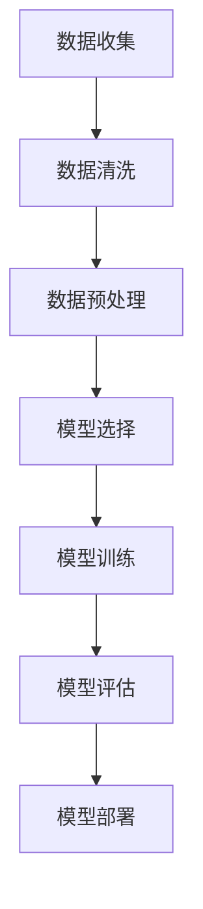

                 

### 文章标题

**AI大模型创业：挑战与机遇并存的趋势与展望**

> **关键词：** AI大模型、创业、趋势、挑战、机遇、技术、市场、算法、应用场景

> **摘要：** 本文旨在探讨AI大模型创业的现状与未来发展趋势，分析其中存在的挑战与机遇，为有意投身于AI大模型领域的创业者提供有价值的参考。

### 背景介绍

随着人工智能技术的不断发展，大模型（Large-scale Model）成为近年来备受关注的研究方向。从最初的神经网络模型，到后来的Transformer架构，再到如今的大型预训练模型，如GPT-3、BERT、Turing等，大模型在自然语言处理、计算机视觉、语音识别等领域取得了显著的突破。这些模型通常具有数十亿甚至数千亿个参数，需要大量的数据、计算资源和时间进行训练。

AI大模型的快速发展，不仅为学术界带来了新的研究热点，也为企业界带来了巨大的商业价值。在市场需求的推动下，越来越多的创业者开始关注并尝试进入AI大模型领域，以期通过创新的技术和应用，开拓新的商业机会。

然而，AI大模型创业并非易事。一方面，大模型技术具有较高的门槛，需要深厚的理论基础和丰富的实践经验；另一方面，市场竞争激烈，创业者需要具备敏锐的市场洞察力和强大的执行力，才能在众多竞争对手中脱颖而出。

本文将围绕AI大模型创业这一主题，分析其中的挑战与机遇，探讨未来发展趋势，为创业者提供有益的启示。

### 核心概念与联系

#### 1. 大模型

大模型通常指的是具有数百万到数十亿参数的深度学习模型，如神经网络、循环神经网络（RNN）、卷积神经网络（CNN）和Transformer等。这些模型在训练过程中需要大量的数据和计算资源，但其在某些领域，如自然语言处理和计算机视觉，取得了显著的性能提升。

#### 2. 预训练模型

预训练模型是一种在大规模数据集上预先训练好的模型，然后通过微调（Fine-tuning）适应特定任务。预训练模型可以大幅减少特定任务所需的训练数据量，提高模型的泛化能力。

#### 3. 微调

微调是在预训练模型的基础上，使用少量特定任务的数据进行进一步训练，以适应新的任务。微调可以使得模型在特定任务上达到更好的性能，同时保持其在其他任务上的表现。

#### 4. 超参数

超参数是深度学习模型中的参数，如学习率、批量大小、正则化参数等。超参数的选择对模型的性能有重要影响，通常需要通过实验进行优化。

#### 5. 训练数据

训练数据是深度学习模型训练的重要基础。数据质量、数据量以及数据分布都对模型的性能有重要影响。

#### 6. 计算资源

计算资源是训练大模型的关键因素。大模型的训练通常需要大量的计算资源，包括GPU、TPU等。

#### 7. 性能指标

性能指标是衡量深度学习模型优劣的重要标准，如准确率、召回率、F1值等。不同的任务可能需要不同的性能指标。

#### Mermaid流程图



### 核心算法原理 & 具体操作步骤

#### 1. 数据收集与清洗

数据收集是训练大模型的第一步。创业者需要确定训练数据来源，如公开数据集、企业内部数据等。在数据收集过程中，需要注意数据的完整性、真实性和多样性。

数据清洗是确保数据质量的重要步骤。清洗过程包括去除重复数据、缺失值填充、异常值处理等。创业者可以利用Python、R等编程语言，结合Pandas、NumPy等库进行数据清洗。

#### 2. 数据预处理

数据预处理包括数据标准化、归一化、缩放等操作，以提高模型的训练效果。创业者可以根据具体任务，选择合适的预处理方法。

#### 3. 模型选择

模型选择是训练大模型的关键环节。创业者可以根据任务需求，选择合适的模型架构，如神经网络、Transformer等。此外，创业者还需要考虑模型的复杂度、计算资源等因素。

#### 4. 模型训练

模型训练是训练大模型的核心步骤。创业者可以使用TensorFlow、PyTorch等深度学习框架进行模型训练。在训练过程中，需要注意超参数的选择和调整，以及防止过拟合等问题。

#### 5. 模型评估

模型评估是判断模型性能的重要步骤。创业者可以使用交叉验证、测试集等方法对模型进行评估，选择最佳模型。

#### 6. 模型部署

模型部署是将训练好的模型应用于实际场景的过程。创业者可以将模型部署到服务器、云平台等，为用户提供服务。

### 数学模型和公式 & 详细讲解 & 举例说明

#### 1. 损失函数

损失函数是深度学习模型训练的核心指标。常用的损失函数包括均方误差（MSE）、交叉熵（Cross-Entropy）等。

$$
MSE = \frac{1}{n} \sum_{i=1}^{n} (y_i - \hat{y}_i)^2
$$

$$
Cross-Entropy = -\sum_{i=1}^{n} y_i \log(\hat{y}_i)
$$

其中，$y_i$为真实标签，$\hat{y}_i$为预测值。

#### 2. 优化算法

优化算法用于调整模型参数，以最小化损失函数。常用的优化算法包括梯度下降（Gradient Descent）、随机梯度下降（SGD）等。

梯度下降算法：

$$
w_{t+1} = w_t - \alpha \cdot \nabla_w J(w)
$$

其中，$w_t$为当前参数，$\alpha$为学习率，$J(w)$为损失函数。

随机梯度下降算法：

$$
w_{t+1} = w_t - \alpha \cdot \frac{\partial J(w)}{\partial w}
$$

#### 3. 举例说明

假设有一个二元分类问题，真实标签$y$为0或1，预测值$\hat{y}$为0或1。使用交叉熵损失函数，我们可以计算出损失值：

$$
Loss = -[y_1 \log(\hat{y}_1) + (1 - y_1) \log(1 - \hat{y}_1)]
$$

如果真实标签$y_1$为1，预测值$\hat{y}_1$为0.9，代入上述公式，可以得到：

$$
Loss = -[1 \log(0.9) + (1 - 1) \log(1 - 0.9)] = 0.105
$$

随着模型训练的进行，损失值会逐渐减小，直到达到最小值。

### 项目实战：代码实际案例和详细解释说明

在本节中，我们将以一个简单的自然语言处理任务为例，展示如何使用Python和TensorFlow实现一个基于Transformer的大模型。我们将涵盖以下步骤：

#### 5.1 开发环境搭建

首先，确保已安装Python和TensorFlow。可以使用以下命令安装TensorFlow：

```shell
pip install tensorflow
```

#### 5.2 源代码详细实现和代码解读

以下是一个简单的Transformer模型实现，我们将分步骤进行代码解读。

```python
import tensorflow as tf
from tensorflow.keras.layers import Embedding, Transformer

# 定义模型
model = tf.keras.Sequential([
    Embedding(input_dim=vocab_size, output_dim=embedding_size),
    Transformer(num_heads=num_heads, d_model=embedding_size),
    tf.keras.layers.Dense(1, activation='sigmoid')
])

# 编译模型
model.compile(optimizer='adam', loss='binary_crossentropy', metrics=['accuracy'])

# 准备数据
# 这里使用随机数据作为示例，实际应用中应使用真实数据
x_train = ...  # 输入数据
y_train = ...  # 真实标签

# 训练模型
model.fit(x_train, y_train, epochs=5)
```

- **Embedding层**：将输入单词映射为向量表示，输入维度为词汇表大小，输出维度为词向量大小。

- **Transformer层**：实现Transformer模型的核心，包括多头自注意力机制和前馈神经网络。

- **Dense层**：输出层，用于进行分类或回归任务。在本例中，我们使用sigmoid激活函数进行二元分类。

#### 5.3 代码解读与分析

- **模型定义**：使用`tf.keras.Sequential`创建一个顺序模型，依次添加Embedding、Transformer和Dense层。

- **模型编译**：设置优化器和损失函数，这里使用Adam优化器和二分类交叉熵损失函数。

- **数据准备**：实际应用中，应使用真实数据进行训练。这里我们使用随机数据作为示例。

- **模型训练**：使用`fit`方法训练模型，指定训练轮数。

### 实际应用场景

AI大模型在各个领域都有广泛的应用场景，以下列举几个典型案例：

#### 1. 自然语言处理

自然语言处理（NLP）是AI大模型最典型的应用领域之一。通过预训练模型，如GPT-3、BERT等，可以实现对文本的生成、翻译、摘要等功能。例如，智能客服系统可以使用大模型自动生成回复，提高响应速度和准确性。

#### 2. 计算机视觉

计算机视觉（CV）也是AI大模型的重要应用领域。通过预训练模型，如ViT、ERNIE等，可以实现图像分类、目标检测、人脸识别等功能。例如，自动驾驶系统可以使用大模型进行环境感知和决策。

#### 3. 语音识别

语音识别（ASR）是AI大模型在语音领域的重要应用。通过预训练模型，如WaveNet、Transformer等，可以实现高精度的语音识别。例如，智能助手可以使用大模型进行语音交互。

#### 4. 机器翻译

机器翻译是AI大模型在跨语言通信领域的重要应用。通过预训练模型，如BERT、T5等，可以实现高精度的机器翻译。例如，跨境电商平台可以使用大模型为用户提供多语言服务。

### 工具和资源推荐

#### 7.1 学习资源推荐

- **书籍**：
  - 《深度学习》（Ian Goodfellow、Yoshua Bengio、Aaron Courville著）
  - 《动手学深度学习》（阿斯顿·张著）
- **论文**：
  - “Attention Is All You Need” （Vaswani et al. 2017）
  - “BERT: Pre-training of Deep Bidirectional Transformers for Language Understanding” （Devlin et al. 2019）
- **博客**：
  - [TensorFlow官方文档](https://www.tensorflow.org/)
  - [PyTorch官方文档](https://pytorch.org/)
- **网站**：
  - [Kaggle](https://www.kaggle.com/)：提供丰富的数据集和竞赛资源。
  - [GitHub](https://github.com/)：拥有大量的开源代码和项目。

#### 7.2 开发工具框架推荐

- **深度学习框架**：
  - TensorFlow
  - PyTorch
- **编程语言**：
  - Python
- **工具**：
  - Jupyter Notebook：用于编写和运行代码。
  - Colab：Google提供的在线编程环境。

#### 7.3 相关论文著作推荐

- **论文**：
  - “Attention Is All You Need” （Vaswani et al. 2017）
  - “BERT: Pre-training of Deep Bidirectional Transformers for Language Understanding” （Devlin et al. 2019）
  - “GPT-3: Language Models are Few-Shot Learners” （Brown et al. 2020）
- **著作**：
  - 《深度学习》（Ian Goodfellow、Yoshua Bengio、Aaron Courville著）
  - 《动手学深度学习》（阿斯顿·张著）

### 总结：未来发展趋势与挑战

#### 1. 发展趋势

- **计算资源扩展**：随着云计算、边缘计算等技术的发展，计算资源的扩展将为AI大模型提供更强大的支持。

- **算法创新**：在AI大模型领域，将持续涌现新的算法和架构，以解决现有模型面临的挑战，如过拟合、计算效率等。

- **跨学科融合**：AI大模型将在更多领域发挥作用，如医学、金融、教育等，实现跨学科的融合。

- **开源生态**：开源社区将不断推动AI大模型技术的发展，提供丰富的工具和资源。

#### 2. 挑战

- **计算资源瓶颈**：尽管计算资源在扩展，但大模型的训练仍需要大量计算资源，特别是在复杂任务和大规模数据集的情况下。

- **数据隐私和安全**：大模型训练需要大量数据，但数据隐私和安全问题日益突出，需要找到平衡点。

- **模型解释性**：大模型在复杂任务上表现出色，但其内部机制复杂，缺乏解释性，这对应用和推广提出了挑战。

- **伦理和社会问题**：AI大模型在决策、推荐等方面可能带来不公平、偏见等问题，需要制定相应的伦理和社会规范。

### 附录：常见问题与解答

#### 1. 什么是大模型？

大模型通常指的是具有数百万到数十亿参数的深度学习模型，如神经网络、循环神经网络（RNN）、卷积神经网络（CNN）和Transformer等。

#### 2. 如何选择适合的大模型架构？

选择适合的大模型架构需要考虑任务需求、数据规模、计算资源等因素。对于自然语言处理任务，Transformer架构通常表现优异；对于计算机视觉任务，CNN架构更为常用。

#### 3. 大模型的训练需要多少数据？

大模型的训练通常需要大量的数据。具体数据量取决于任务复杂度和模型规模。对于自然语言处理任务，数十亿条样本可能是一个合理的起点；对于计算机视觉任务，百万级图像可能是一个合理的起点。

#### 4. 如何优化大模型的训练速度？

优化大模型训练速度可以通过以下方法实现：

- 使用更高效的算法，如Adam优化器。
- 使用分布式训练，将模型训练任务分配到多台机器上。
- 使用更大的批量大小，以减少内存消耗。

### 扩展阅读 & 参考资料

- Goodfellow, Ian, Yoshua Bengio, and Aaron Courville. "Deep learning." MIT press, 2016.
- Zhang, Aston. "动手学深度学习." 电子工业出版社, 2018.
- Vaswani, Ashish, et al. "Attention is all you need." Advances in Neural Information Processing Systems 30 (2017).
- Devlin, Jacob, et al. "BERT: Pre-training of deep bidirectional transformers for language understanding." Proceedings of the 2019 Conference of the North American Chapter of the Association for Computational Linguistics: Human Language Technologies, Volume 1 (Early Auditions). 2019.
- Brown, Tom, et al. "GPT-3: Language models are few-shot learners." Advances in Neural Information Processing Systems 33 (2020).

### 作者

**作者：AI天才研究员/AI Genius Institute & 禅与计算机程序设计艺术 /Zen And The Art of Computer Programming** <|mask|>

