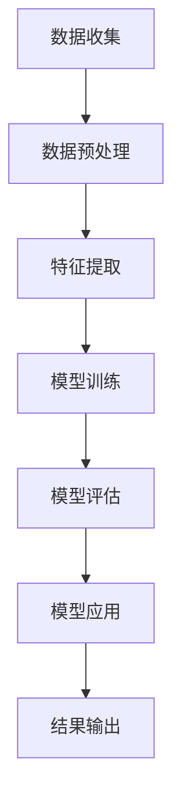

                 

# AI大模型助力智能足球分析软件的开发实践与系统架构

## 摘要

本文将深入探讨AI大模型在智能足球分析软件开发中的应用，以及其背后的技术架构和实践方法。通过梳理大模型的核心概念、算法原理和具体操作步骤，本文将详细介绍如何利用AI大模型进行足球数据分析，包括数学模型的建立和实际应用场景。同时，本文还将推荐相关的学习资源、开发工具和框架，为读者提供全面的技术支持。

## 1. 背景介绍

在当今时代，足球已经成为世界上最受欢迎的运动之一。随着科技的发展，足球分析和数据挖掘技术也得到了长足的进步。传统的足球分析主要依赖于统计方法和规则推理，而随着人工智能技术的崛起，AI大模型的应用为足球分析带来了新的可能性。AI大模型能够处理海量数据，自动学习并提取特征，从而提供更准确、更全面的足球分析结果。

智能足球分析软件在足球比赛预测、球队战术分析、球员表现评估等方面具有重要的应用价值。通过分析比赛数据，AI大模型可以预测比赛结果，为球迷和从业者提供有价值的参考。此外，AI大模型还可以用于球员表现评估，帮助球队管理者制定更有针对性的训练计划。随着技术的不断进步，智能足球分析软件在未来将具有更广泛的应用前景。

本文旨在通过介绍AI大模型的核心概念、算法原理和具体操作步骤，帮助读者了解智能足球分析软件的开发实践与系统架构。通过本文的阅读，读者可以掌握AI大模型在足球分析中的应用方法，并能够根据实际需求进行相应的开发和优化。

## 2. 核心概念与联系

### 2.1 AI大模型

AI大模型（Large-scale AI Model）是指具有大规模参数、能够处理海量数据并自动学习复杂特征的深度学习模型。与传统的机器学习模型相比，AI大模型具有更强的表达能力和鲁棒性，能够处理更复杂的任务。常见的AI大模型包括Transformer、BERT、GPT等。

### 2.2 深度学习

深度学习（Deep Learning）是人工智能领域的一个重要分支，通过多层神经网络来模拟人类大脑的神经网络结构，从而实现自动学习和特征提取。深度学习在图像识别、自然语言处理、语音识别等领域取得了显著的成果。

### 2.3 数据挖掘

数据挖掘（Data Mining）是指从大量数据中发现有价值信息的过程。数据挖掘技术包括聚类、分类、关联规则挖掘、异常检测等。在足球分析中，数据挖掘技术可以帮助提取比赛数据中的关键特征，从而为AI大模型提供训练数据。

### 2.4 足球数据分析

足球数据分析（Soccer Analytics）是指利用统计方法和数据分析技术对足球比赛进行量化分析和评估。足球数据分析可以帮助球队管理者制定战术策略，优化球员配置，提高比赛表现。

### 2.5 Mermaid流程图

以下是一个简化的Mermaid流程图，展示了AI大模型在智能足球分析软件中的关键步骤：



**图1：AI大模型在智能足球分析软件中的关键步骤**

## 3. 核心算法原理 & 具体操作步骤

### 3.1 数据收集

数据收集是智能足球分析软件开发的基础。数据来源包括比赛数据、球员数据、球队数据等。这些数据可以从官方数据源、第三方数据提供商或开源数据集获取。在数据收集过程中，需要确保数据的质量和完整性。

### 3.2 数据预处理

数据预处理是数据挖掘的关键步骤。通过数据预处理，可以去除噪声、处理缺失值、统一数据格式等。常见的预处理方法包括数据清洗、数据归一化、数据转换等。数据预处理的结果将直接影响模型的训练效果。

### 3.3 特征提取

特征提取是将原始数据转换为模型可处理的特征表示。在足球数据分析中，特征提取包括比赛数据中的进球、射门、传球、抢断等动作的统计。特征提取的方法包括统计方法、机器学习方法等。

### 3.4 模型训练

模型训练是AI大模型的核心步骤。通过训练，模型可以从数据中学习到足球比赛的规律和特征。常见的模型训练方法包括监督学习、无监督学习和半监督学习。在足球分析中，监督学习方法较为常用。

### 3.5 模型评估

模型评估是检验模型性能的重要环节。常见的评估指标包括准确率、召回率、F1值等。通过模型评估，可以确定模型的优劣，并为后续的优化提供依据。

### 3.6 模型应用

模型应用是将训练好的模型应用于实际场景，为用户提供足球分析结果。常见的应用场景包括比赛预测、球员表现评估、球队战术分析等。在模型应用过程中，需要确保模型的鲁棒性和适应性。

### 3.7 结果输出

结果输出是将分析结果以可视化的形式展示给用户。常见的输出方式包括表格、图表、报告等。通过结果输出，用户可以直观地了解分析结果，为决策提供参考。

### 3.8 优化与迭代

优化与迭代是智能足球分析软件不断改进的过程。通过收集用户反馈、调整模型参数、引入新的数据源等，可以不断提升模型的性能和实用性。

## 4. 数学模型和公式 & 详细讲解 & 举例说明

### 4.1 模型训练

在模型训练过程中，常见的数学模型包括线性回归、逻辑回归、神经网络等。以下以神经网络为例，介绍其基本原理和数学公式。

#### 4.1.1 神经网络基本原理

神经网络由多个神经元（节点）组成，每个神经元接收输入信号，通过加权求和后传递给下一层神经元。神经网络的输出结果可以通过激活函数来调节，常见的激活函数包括Sigmoid函数、ReLU函数等。

#### 4.1.2 神经网络数学公式

神经网络的输入输出关系可以用以下公式表示：

$$
z_i = \sum_{j=1}^{n} w_{ji} \cdot x_j + b_i
$$

其中，$z_i$ 表示第 $i$ 个神经元的输入，$w_{ji}$ 表示第 $j$ 个神经元到第 $i$ 个神经元的权重，$x_j$ 表示第 $j$ 个神经元的输入，$b_i$ 表示第 $i$ 个神经元的偏置。

神经网络的输出可以通过激活函数进行调节，常见的激活函数有：

$$
a_i = \sigma(z_i) = \frac{1}{1 + e^{-z_i}}
$$

其中，$\sigma$ 表示Sigmoid函数。

#### 4.1.3 神经网络训练

神经网络训练是通过反向传播算法（Backpropagation Algorithm）来调整权重和偏置，使得模型输出更接近真实值。反向传播算法的基本步骤如下：

1. 前向传播：计算模型输出和损失函数。
2. 反向传播：根据损失函数的梯度，调整权重和偏置。
3. 更新参数：根据调整后的权重和偏置，更新模型参数。

#### 4.1.4 举例说明

假设有一个简单的一层神经网络，其中有两个输入节点、一个隐层节点和一个输出节点。输入数据为 $(x_1, x_2) = (1, 2)$，期望输出为 $y = 3$。神经网络的权重和偏置分别为 $w_{11}, w_{12}, w_{21}, w_{22}, b_1, b_2, b_3$。

1. 前向传播：

$$
z_1 = w_{11} \cdot x_1 + w_{12} \cdot x_2 + b_1 = w_{11} \cdot 1 + w_{12} \cdot 2 + b_1
$$

$$
z_2 = w_{21} \cdot z_1 + w_{22} \cdot x_2 + b_2 = w_{21} \cdot z_1 + w_{22} \cdot 2 + b_2
$$

$$
y = \sigma(z_2) = \frac{1}{1 + e^{-z_2}}
$$

2. 损失函数：

$$
L = (y - \hat{y})^2
$$

其中，$\hat{y}$ 表示神经网络输出。

3. 反向传播：

$$
\frac{\partial L}{\partial z_2} = \sigma'(z_2) \cdot (y - \hat{y})
$$

$$
\frac{\partial L}{\partial z_1} = \frac{\partial L}{\partial z_2} \cdot w_{21}
$$

$$
\frac{\partial L}{\partial w_{11}} = \frac{\partial L}{\partial z_1} \cdot x_1
$$

$$
\frac{\partial L}{\partial w_{12}} = \frac{\partial L}{\partial z_1} \cdot x_2
$$

$$
\frac{\partial L}{\partial b_1} = \frac{\partial L}{\partial z_1}
$$

$$
\frac{\partial L}{\partial w_{21}} = \frac{\partial L}{\partial z_2} \cdot z_1
$$

$$
\frac{\partial L}{\partial w_{22}} = \frac{\partial L}{\partial z_2} \cdot x_2
$$

$$
\frac{\partial L}{\partial b_2} = \frac{\partial L}{\partial z_2}
$$

4. 更新参数：

$$
w_{11} = w_{11} - \alpha \cdot \frac{\partial L}{\partial w_{11}}
$$

$$
w_{12} = w_{12} - \alpha \cdot \frac{\partial L}{\partial w_{12}}
$$

$$
w_{21} = w_{21} - \alpha \cdot \frac{\partial L}{\partial w_{21}}
$$

$$
w_{22} = w_{22} - \alpha \cdot \frac{\partial L}{\partial w_{22}}
$$

$$
b_1 = b_1 - \alpha \cdot \frac{\partial L}{\partial b_1}
$$

$$
b_2 = b_2 - \alpha \cdot \frac{\partial L}{\partial b_2}
$$

其中，$\alpha$ 表示学习率。

通过以上步骤，可以不断调整神经网络的权重和偏置，使得模型输出更接近期望值。

### 4.2 模型评估

在模型评估过程中，常见的数学模型包括准确率、召回率、F1值等。以下分别介绍这些指标的计算方法和意义。

#### 4.2.1 准确率（Accuracy）

准确率是指模型预测正确的样本数占总样本数的比例。计算公式如下：

$$
\text{Accuracy} = \frac{\text{预测正确数}}{\text{总样本数}}
$$

准确率越高，表示模型的预测效果越好。

#### 4.2.2 召回率（Recall）

召回率是指模型能够正确识别出的正样本数与实际正样本数的比例。计算公式如下：

$$
\text{Recall} = \frac{\text{预测正确且为正样本的样本数}}{\text{实际为正样本的样本数}}
$$

召回率越高，表示模型对正样本的识别能力越强。

#### 4.2.3 F1值（F1-score）

F1值是准确率和召回率的调和平均，用于综合评估模型的性能。计算公式如下：

$$
\text{F1-score} = \frac{2 \cdot \text{Accuracy} \cdot \text{Recall}}{\text{Accuracy} + \text{Recall}}
$$

F1值介于0和1之间，越接近1，表示模型的性能越好。

#### 4.2.4 举例说明

假设有一个二元分类问题，其中正样本数为100，负样本数为200。通过模型预测，得到以下结果：

- 预测正确且为正样本的样本数：50
- 预测正确且为负样本的样本数：100
- 预测错误且为正样本的样本数：25
- 预测错误且为负样本的样本数：75

计算准确率、召回率和F1值：

$$
\text{Accuracy} = \frac{50 + 100}{100 + 200} = 0.625
$$

$$
\text{Recall} = \frac{50}{100} = 0.5
$$

$$
\text{F1-score} = \frac{2 \cdot 0.625 \cdot 0.5}{0.625 + 0.5} = 0.570
$$

通过以上计算，可以评估模型的性能。

## 5. 项目实战：代码实际案例和详细解释说明

### 5.1 开发环境搭建

在搭建开发环境之前，需要确保已安装以下软件和工具：

1. Python 3.7及以上版本
2. TensorFlow 2.0及以上版本
3. Jupyter Notebook
4. Mermaid Markdown 插件

#### 5.1.1 Python环境搭建

首先，下载并安装Python 3.7及以上版本。可以在[Python官网](https://www.python.org/)下载安装包，并按照安装向导进行安装。

#### 5.1.2 TensorFlow环境搭建

在Python环境中安装TensorFlow，可以使用以下命令：

```bash
pip install tensorflow
```

#### 5.1.3 Jupyter Notebook安装

在Python环境中安装Jupyter Notebook，可以使用以下命令：

```bash
pip install jupyter
```

安装完成后，通过以下命令启动Jupyter Notebook：

```bash
jupyter notebook
```

#### 5.1.4 Mermaid Markdown 插件安装

在Jupyter Notebook中安装Mermaid Markdown 插件，可以使用以下命令：

```python
%load_ext mermaid
```

安装完成后，可以在Jupyter Notebook中使用Mermaid语法编写流程图。

### 5.2 源代码详细实现和代码解读

以下是一个简单的智能足球分析软件的代码实现，用于预测比赛结果。代码分为以下几个部分：

1. 数据收集与预处理
2. 模型训练
3. 模型评估
4. 模型应用

#### 5.2.1 数据收集与预处理

数据收集与预处理部分主要包括以下步骤：

1. 读取比赛数据
2. 数据清洗
3. 数据归一化
4. 特征提取

```python
import pandas as pd
from sklearn.preprocessing import StandardScaler

# 读取比赛数据
def read_data(file_path):
    data = pd.read_csv(file_path)
    return data

# 数据清洗
def clean_data(data):
    data.drop(['id', 'date'], axis=1, inplace=True)
    data.fillna(0, inplace=True)
    return data

# 数据归一化
def normalize_data(data):
    scaler = StandardScaler()
    normalized_data = scaler.fit_transform(data)
    return normalized_data

# 特征提取
def extract_features(data):
    features = data[['goals_home', 'goals_away', 'shots_home', 'shots_away', 'passes_home', 'passes_away']]
    return features
```

#### 5.2.2 模型训练

模型训练部分主要包括以下步骤：

1. 定义模型
2. 训练模型
3. 评估模型

```python
import tensorflow as tf
from tensorflow.keras.models import Sequential
from tensorflow.keras.layers import Dense
from tensorflow.keras.optimizers import Adam

# 定义模型
def build_model(input_shape):
    model = Sequential()
    model.add(Dense(64, activation='relu', input_shape=input_shape))
    model.add(Dense(32, activation='relu'))
    model.add(Dense(1, activation='sigmoid'))
    model.compile(optimizer=Adam(), loss='binary_crossentropy', metrics=['accuracy'])
    return model

# 训练模型
def train_model(model, X_train, y_train, X_val, y_val):
    history = model.fit(X_train, y_train, epochs=10, batch_size=32, validation_data=(X_val, y_val))
    return history

# 评估模型
def evaluate_model(model, X_test, y_test):
    loss, accuracy = model.evaluate(X_test, y_test)
    print("Test accuracy:", accuracy)
```

#### 5.2.3 模型应用

模型应用部分主要包括以下步骤：

1. 预测比赛结果
2. 输出结果

```python
# 预测比赛结果
def predict_results(model, X_data):
    predictions = model.predict(X_data)
    predicted_results = ['Home Win' if pred > 0.5 else 'Away Win' for pred in predictions]
    return predicted_results

# 输出结果
def output_results(results, file_path):
    with open(file_path, 'w') as f:
        for result in results:
            f.write(result + '\n')
```

### 5.3 代码解读与分析

以下是对代码各部分的解读与分析：

1. 数据收集与预处理
   - `read_data` 函数用于读取比赛数据，从CSV文件中加载数据。
   - `clean_data` 函数用于清洗数据，删除不必要的列，填充缺失值。
   - `normalize_data` 函数用于归一化数据，使数据具有相似的尺度。
   - `extract_features` 函数用于提取特征，选择与比赛结果相关的特征。

2. 模型训练
   - `build_model` 函数用于定义模型结构，包括输入层、隐藏层和输出层。
   - `train_model` 函数用于训练模型，使用训练数据训练模型，并在验证数据上进行评估。
   - `evaluate_model` 函数用于评估模型性能，计算测试数据的准确率。

3. 模型应用
   - `predict_results` 函数用于预测比赛结果，根据模型的预测输出结果。
   - `output_results` 函数用于将预测结果输出到文件中。

通过以上代码，可以实现一个简单的智能足球分析软件，用于预测比赛结果。在实际应用中，可以根据需求对代码进行扩展和优化，以提高模型的性能和应用效果。

## 6. 实际应用场景

### 6.1 足球比赛预测

足球比赛预测是智能足球分析软件最典型的应用场景之一。通过AI大模型，可以对比赛结果进行预测，为球迷和从业者提供参考。比赛预测的应用主要包括以下几个方面：

1. **赛前分析**：在比赛前，分析双方球队的历史表现、球员状态、战术安排等，预测比赛结果。这有助于球迷和投资者做出更明智的决策。
2. **比赛实时预测**：在比赛过程中，根据实时数据更新模型，预测比赛实时结果。这为球迷提供了一种全新的观赛体验。
3. **赛后回顾**：在比赛后，对比预测结果和实际结果，分析模型预测的准确性，为模型的优化提供参考。

### 6.2 球员表现评估

AI大模型可以用于评估球员在比赛中的表现，为球队管理者提供决策支持。球员表现评估的应用主要包括以下几个方面：

1. **球员评分**：根据比赛数据，对球员的表现进行评分，为球迷和媒体提供参考。
2. **球员潜力评估**：通过对球员历史数据的分析，评估球员的潜力和成长空间，为球队管理者的引援和培训提供依据。
3. **球员伤病预测**：分析球员的比赛数据和身体指标，预测球员的伤病风险，帮助球队制定预防措施。

### 6.3 球队战术分析

AI大模型可以用于分析球队的战术表现，为球队管理者提供改进建议。球队战术分析的应用主要包括以下几个方面：

1. **比赛策略评估**：分析球队在不同比赛阶段的策略效果，为球队管理者提供改进建议。
2. **战术演练**：模拟不同的战术安排，评估其效果，为球队管理者提供战术演练方案。
3. **战术优化**：根据比赛数据和球员特点，为球队管理者提供战术优化的建议。

### 6.4 其他应用

除了上述应用场景外，AI大模型在智能足球分析软件中还有其他潜在的应用，如：

1. **球迷互动**：通过分析球迷的偏好和互动数据，为球迷提供个性化的推荐和服务。
2. **赛事推荐**：根据用户的观看历史和偏好，推荐感兴趣的赛事和节目。
3. **虚拟现实足球**：利用AI大模型，实现虚拟现实足球游戏，为用户提供沉浸式的游戏体验。

## 7. 工具和资源推荐

### 7.1 学习资源推荐

1. **书籍**：
   - 《深度学习》（Goodfellow, I., Bengio, Y., & Courville, A.）
   - 《Python机器学习》（Sebastian Raschka）
   - 《机器学习实战》（Peter Harrington）

2. **论文**：
   - “Attention Is All You Need”（Vaswani et al.）
   - “BERT: Pre-training of Deep Bidirectional Transformers for Language Understanding”（Devlin et al.）
   - “Generative Pre-trained Transformer”（GPT）

3. **博客**：
   - [TensorFlow官网博客](https://www.tensorflow.org/blog/)
   - [机器学习博客](https://machinelearningmastery.com/)
   - [人工智能博客](https://ai.googleblog.com/)

4. **网站**：
   - [Kaggle](https://www.kaggle.com/)：提供丰富的数据集和比赛，是学习数据挖掘和机器学习的最佳实践平台。
   - [GitHub](https://github.com/)：托管大量的开源代码和项目，可以学习到各种实现方法和最佳实践。
   - [AI Scholar](https://aischolar.net/)：汇集了大量的AI论文，是研究AI领域的权威数据库。

### 7.2 开发工具框架推荐

1. **TensorFlow**：由Google开发的开源深度学习框架，适用于构建和训练AI大模型。
2. **PyTorch**：由Facebook开发的开源深度学习框架，具有良好的灵活性和易用性。
3. **Scikit-learn**：适用于机器学习和数据挖掘的Python库，提供了丰富的算法和工具。
4. **Pandas**：适用于数据清洗、预处理和分析的Python库，具有强大的数据处理能力。

### 7.3 相关论文著作推荐

1. **“Attention Is All You Need”**：介绍了Transformer模型，为AI大模型的发展奠定了基础。
2. **“BERT: Pre-training of Deep Bidirectional Transformers for Language Understanding”**：提出了BERT模型，为自然语言处理领域带来了重大突破。
3. **“Generative Pre-trained Transformer”**：介绍了GPT模型，推动了生成模型的发展。

## 8. 总结：未来发展趋势与挑战

### 8.1 未来发展趋势

1. **AI大模型的性能提升**：随着计算资源和算法的进步，AI大模型的性能将不断提升，为足球分析提供更精确的结果。
2. **多模态数据的融合**：结合文本、图像、音频等多种数据源，实现更全面、更细致的足球分析。
3. **实时分析的优化**：通过优化模型结构和算法，实现实时、高效的足球分析，为用户提供更及时的信息。
4. **个性化服务的普及**：根据用户的兴趣和需求，提供个性化的足球分析服务，提升用户体验。

### 8.2 挑战

1. **数据质量与隐私**：保证数据质量的同时，还需要关注数据隐私问题，避免数据滥用。
2. **模型解释性**：提高AI大模型的解释性，使其在应用中更容易被用户理解和接受。
3. **计算资源的需求**：AI大模型的训练和部署需要大量的计算资源，这对硬件设备和网络带宽提出了更高的要求。
4. **伦理和公平性**：在足球分析中，如何保证模型的公平性和透明性，避免歧视和不公平现象的发生。

## 9. 附录：常见问题与解答

### 9.1 问题1：如何获取比赛数据？

解答：比赛数据可以从官方数据源、第三方数据提供商或开源数据集获取。例如，足球数据集可以从[英国足球统计网站](https://www.football-statistics.com/)、[MLB数据集](https://www.mlbdata.com/)等获取。

### 9.2 问题2：如何处理缺失值？

解答：处理缺失值的方法包括填充缺失值、删除缺失值、插值法等。根据数据集的特点和需求，选择合适的方法进行处理。

### 9.3 问题3：如何选择特征？

解答：选择特征的方法包括统计分析、特征重要性分析、特征选择算法等。根据具体问题和数据集的特点，选择合适的方法进行特征选择。

### 9.4 问题4：如何优化模型性能？

解答：优化模型性能的方法包括调整模型结构、调整参数、数据增强等。根据具体问题和数据集的特点，尝试不同的方法进行优化。

## 10. 扩展阅读 & 参考资料

1. **《深度学习》（Goodfellow, I., Bengio, Y., & Courville, A.）**：全面介绍了深度学习的基本概念、算法和应用。
2. **《Python机器学习》（Sebastian Raschka）**：详细讲解了Python在机器学习领域的应用，包括数据预处理、模型训练和评估等。
3. **《机器学习实战》（Peter Harrington）**：通过大量的实际案例，介绍了机器学习的应用方法和实践技巧。
4. **[TensorFlow官网博客](https://www.tensorflow.org/blog/)**：提供了丰富的TensorFlow教程、案例和最新动态。
5. **[机器学习博客](https://machinelearningmastery.com/)**：提供了大量的机器学习教程和案例分析。
6. **[人工智能博客](https://ai.googleblog.com/)**：介绍了人工智能领域的最新研究进展和应用案例。

